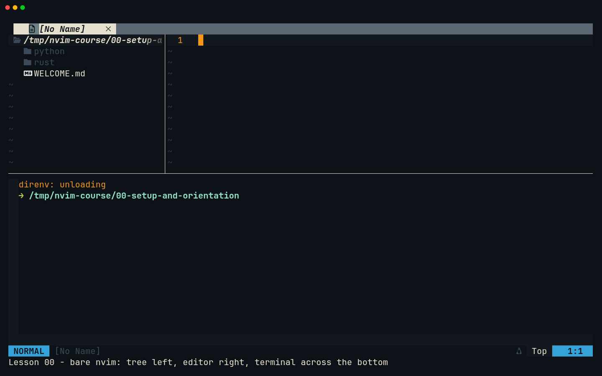
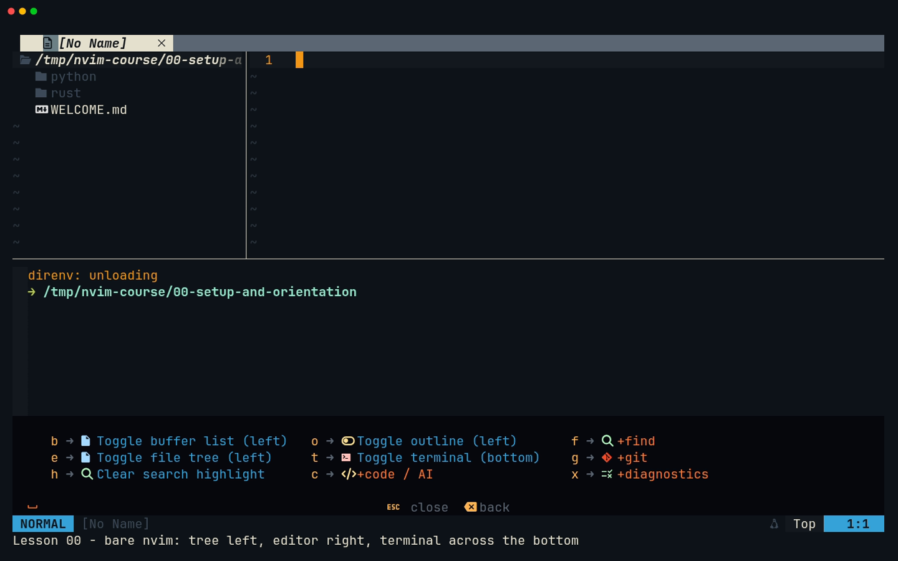

# Lesson 00 — Setup and orientation

**Last Updated**: 27/09/2026
**Version**: 1.0.0
**Maintained By**: Development Team
**Language**: British English (en_GB)
**Timezone**: Europe/London

---

This lesson takes you from "Neovim is installed somewhere" to a routine you can trust on laptop-intel. One
key chord opens the Neovim dev layout. You will know what every window on screen is for, find any binding
with Space and the which-key popup, run the health checks, and quit without leaving anything half-closed.
Both capstones, just-panel (Rust and ratatui) and session-browser (Python and Textual), are built inside
this layout from lesson 06 onwards. Learn its shape now and you will not be fighting it later.

**Part**: 0 — Orientation · **Time**: ~45 min (plus ~30 for `:Tutor` chapter 1) · **Previous**: [Course README](../README.md) · **Next**: [Lesson 01 — Modes and survival](01-MODES-AND-SURVIVAL.md)

## Objectives

By the end of this lesson you can:

- say how the course runs (written on Ubuntu, followed and recorded on laptop-intel) and confirm that you
  have Neovim 0.12.5;
- find the Neovim config and explain how `~/.config/nvim/KEYBINDS.md` is generated from it;
- start Neovim with each key in the `SUPER + … + RETURN` family and predict what you will get;
- tell a bare `nvim` (dock layout) from `nvim <file>` (no layout);
- name the three windows of the Neovim dev layout, and the three panes of the dock layout inside Neovim;
- find bindings with Space and the which-key popup, and open KEYBINDS.md;
- run `:checkhealth` and `:Tutor`, and quit everything cleanly with `:qa`;
- find your way around any lesson in this course.

## Before you start

- **Machine.** Use laptop-intel, booted into the **full** `laptop-intel` configuration. The Neovim config
  itself arrives with the `dev` stage (`home/stages/dev.nix:17`). `dev-layout` and `just` are different:
  only the full config installs them (`modules/core/common.nix:88`, `:96-97`), and `dev-layout` is what
  runs behind `SUPER + SHIFT + RETURN` and `SUPER + CTRL + RETURN`. Check in a terminal. `SUPER + RETURN`
  opens Kitty, but on laptop-intel every ordinary new window goes to workspace 10 without switching to it
  (`config/hypr/devices/laptop-intel.lua:115-121`), so press `SUPER + 0` to get there:

  ```bash
  # in any directory
  command -v dev-layout just
  ```

  Two paths means you are on the full config. If you get one or none, switch to the full config with
  `sudo nixos-rebuild switch --flake ~/Repos/personal/nix-config#laptop-intel`. That is stage 6 in
  `.claude/CLAUDE.md`.
- **Repository.** Clone the repo to `~/Repos/personal/nix-config`. `dev-layout` looks there unless the
  variable `DEV_LAYOUT_NIX_CONFIG` names somewhere else (`rust/dev-layout/src/main.rs:62-69`).
- **The course is committed.** In the repository, `git status --short docs/NEOVIM-COURSE` prints nothing.
  The lessons rely on it: lesson 01 restores a spoilt kata with `git checkout`, and from lesson 06 on
  `git status` should list only your capstone work. If this folder reached laptop-intel some other way than
  through git, commit it before lesson 01, for example as `docs(nvim): add the Neovim course`.
- **Workspace 2.** Leave it empty: the nix-config layout reserves it. If a Zed nix-config layout
  (`SUPER + SHIFT + Z`) is open there, close it first (see [Gotchas](#gotchas-in-this-config)).
- **Mouse.** Park the pointer at the edge of the screen. Hyprland focus follows the mouse
  (`follow_mouse = 1`, `config/hypr/30-input.lua:12`).
- **Notation.** Skim [Notation](../README.md#notation) in the README. `<leader>` means the Space bar.
- **Milestone.** There isn't one yet. Capstone code starts in lesson 06, and none of it is committed until
  lesson 12.

## Keys in this lesson

| Keys | Mode | Action | Where it comes from |
|---|---|---|---|
| `SUPER + SHIFT + RETURN` | Hyprland | Build the nix-config Neovim layout on workspace 2, or just focus workspace 2 if anything is already there | config (config/hypr/60-keybinds.lua:26) |
| `SUPER + CTRL + RETURN` | Hyprland | Pick a project in wofi, then build its Neovim layout on the first free workspace from 3 to 5 | config (60-keybinds.lua:27) |
| `SUPER + ALT + RETURN` | Hyprland | Kitty running a bare `nvim` in `$HOME`: the dock layout without the dev layout. It opens on workspace 10 | config (60-keybinds.lua:28) |
| `SUPER + RETURN` | Hyprland | Plain Kitty terminal, opened on workspace 10 | config (60-keybinds.lua:25) |
| `SUPER + 0` | Hyprland | Go to workspace 10, where ordinary new windows land on laptop-intel | config (60-keybinds.lua:159-163; devices/laptop-intel.lua:115-121) |
| `SUPER + H` / `J` / `K` / `L` | Hyprland | Move focus left / down / up / right between Kitty windows | config (60-keybinds.lua:129-132) |
| `SUPER + Q` | Hyprland | Close the focused window | config (60-keybinds.lua:93) |
| `SUPER + 2` | Hyprland | Go to workspace 2 | config (60-keybinds.lua:159-163) |
| `<leader>` (Space) | n | Leader key. Pause after it and which-key lists what can follow | config (neovim.nix:210) |
| `<BS>` / `<Esc>` | which-key popup | Up one level / close without running anything | which-key default |
| `<C-h>` `<C-j>` `<C-k>` `<C-l>` | n | Move to the Neovim window left / below / above / right | config (neovim.nix:68-71) |
| `<C-\><C-n>` | t | Leave Terminal mode (`<Esc>` goes to the shell instead) | Neovim default |
| `<leader>e` | n | Toggle the file tree on the left; opening it also moves the cursor into it | config (neovim.nix:24) |
| `<leader>t` | n | Toggle the terminal at the bottom | config (neovim.nix:27) |
| `<C-q>` | n | `:q` on the current **window**, which is not the same as quitting Neovim | config (neovim.nix:65) |
| `:e {file}`, `<Tab>` | c | Open a file; `<Tab>` completes the path | Neovim default |
| `:checkhealth [name]` | c | Run health checks | Neovim default |
| `q` / `gO` / `]]` `[[` | n (health report) | Close the report / table of contents / next or previous section | Neovim 0.12 default |
| `:Tutor [name]` | c | Start the built-in interactive tutorial | Neovim default |
| `:qa` / `:qa!` | c | Quit every window / quit and throw away unsaved changes | Neovim default |
| `j` `k` `/` `n` `q` | `less` | Scroll, search, next match, quit (quitting also closes that pane) | `less` default |

## Walkthrough

Steps 1 and 2 check the machine and show you where the config lives. Steps 3 to 10 are **the first 10
minutes**. Do them in one sitting, in order. Steps 11 to 13 widen the view.

### 1. Check the machine and the Neovim build

The course was written on an Ubuntu machine where Neovim cannot run. There, `/usr/local/bin/nvim` is a
9-byte file containing `Not Found`, left behind by a failed download, and there is no `~/.config/nvim`.
Follow every step on laptop-intel instead; that is also where the recordings are made. Anything the author
could not check from Ubuntu is labelled **verify on laptop-intel**.

The flake pins nixpkgs `20b1ddd` (19/09/2026), and that fixes the versions this course is written against:

| Component | Version |
|---|---|
| Neovim | 0.12.5 |
| neo-tree / aerial / gitsigns | 3.42.0 / v4.0.0 / 2.1.0 |
| Claude Code / Codex CLI | 2.1.278 / 0.155.1 |
| just / kitty / vhs | 1.58.0 / 0.48.2 / 0.12.1 (the config overrides nixpkgs' 0.12.0) |
| Rust (nixpkgs) / Python / uv | 1.98 / 3.14.7 / 0.12.16 |

**Try it**

```bash
# in any directory on laptop-intel
nvim --version | head -n 1
type -a nvim
```

**What you should see**

- The first command prints `NVIM v0.12.5`.
- `type -a nvim` lists every `nvim` on your `PATH`, and the first one listed is the one that runs. The full
  config installs two: the configured Home Manager one, and a plain system package
  (`modules/core/common.nix:57`). The configured one should be listed first (verify on laptop-intel).
- The real test comes in step 6: if Space opens a which-key popup, you are in the configured Neovim.

### 2. Find the config and the generated KEYBINDS.md

The whole Neovim setup is one Home Manager module: `programs.neovim` in `home/modules/neovim.nix`
(`neovim.nix:112`). Its Lua lives in the `initLua` string (`:202-990`). Near the top of the file is the list
that matters most in this course: `keymaps` (`:23-72`), the **single source of truth** for your bindings.
Each entry has a group, a key (`lhs`), a command (`rhs`) and a description (`desc`). From that one list,
Nix generates two things:

1. **The mappings.** Every entry that is not marked `docOnly` becomes a
   `vim.keymap.set(mode, lhs, rhs, { desc = … })` call (`:78-87`, inserted at `:871`). The mode is Normal
   unless the entry says otherwise. Only `<leader>cs` is Visual (`:42`).
2. **The reference.** Every entry, `docOnly` ones included, becomes a row of `~/.config/nvim/KEYBINDS.md`
   (`:89-105`, written at `:1002`). The rows are grouped Panels, Find, Git, AI, Code, Diagnostics, Buffers
   and Windows.

`docOnly = true` means "documented here, defined elsewhere". The language-server keys are buffer-local and
set when a server attaches (`:335-360`). The format key `<leader>cf` needs a Lua function (`:987-989`).
Listing them keeps the reference complete without pretending the list defines them.

Three more facts from the same file:

- **Aliases.** `vi` and `vim` also start this Neovim (`viAlias`, `vimAlias`, `:115-116`).
- **Default editor.** `defaultEditor = false` (`:114`), so `EDITOR` is still `zeditor --wait`
  (`home/stages/dev.nix:74-77`). `git commit` in a terminal opens Zed, not Neovim; lessons 06 and 12 deal
  with that.
- **Stale guide.** `docs/NEOVIM-SETUP.md` is out of date: it describes nvim-tree, `<leader>f` for
  formatting and `<C-k>` for signature help, none of which is true any more. Trust KEYBINDS.md and this
  course.

**Try it**

```bash
# in ~/Repos/personal/nix-config
sed -n '23,72p' home/modules/neovim.nix
head -n 12 ~/.config/nvim/KEYBINDS.md
ls -l ~/.config/nvim/KEYBINDS.md
```

**What you should see**

- **`sed`.** The list, starting
  `{ group = "Panels"; lhs = "<leader>e";  rhs = "<cmd>Neotree toggle filesystem left<CR>"; …`.
- **`head`.** The header `# Neovim keybinds`, then "Leader is `<Space>`. Generated from
  `home/modules/neovim.nix` — do not edit by hand; the file is rewritten on every `nixos-rebuild`.", then
  `## Panels` and the start of its table.
- **`ls -l`.** An arrow (`->`) into `/nix/store`. The file is a read-only link that Home Manager rewrites.
  You change bindings by editing `neovim.nix` and rebuilding ([lesson 22](22-MAKING-THE-CONFIG-YOURS.md)),
  never by editing this file.

> **Zed habit:** In Zed you edit `keymap.json` and the change applies at once. Here a binding lives in
> Nix: edit the `keymaps` list, rebuild, and the mapping, KEYBINDS.md and the which-key popup all change
> together.

### 3. First 10 minutes (1/8): open the nix-config layout

The `RETURN` family of Hyprland keys (`config/hypr/60-keybinds.lua:12-28`) opens Kitty, and every key in
it except plain `SUPER + RETURN` starts Neovim there. The one you will use most is `SUPER + SHIFT + RETURN`,
which runs `dev-layout --nvim` (`:26`). It builds the **nix-config layout** on workspace 2, which is
reserved for this repository, with every window starting in `~/Repos/personal/nix-config`. If workspace 2
already holds any window at all, it only switches to workspace 2 and builds nothing
(`rust/dev-layout/src/main.rs:243-252`).

**Try it**

Press `SUPER + SHIFT + RETURN`.

**What you should see**

Hyprland switches to workspace 2 and three Kitty windows appear, a moment apart: the two terminals are
started 500 ms apart (`main.rs:367`). The big one on the left is Neovim.

If nothing appears, open a plain Kitty (`SUPER + RETURN`, then `SUPER + 0`) and run `dev-layout --nvim`
there. It prints what it is doing, for example "nix-config layout already open on workspace 2; focusing
it." (`main.rs:244-249`).

### 4. First 10 minutes (2/8): identify the three windows

```text
┌──────────────────────────────── workspace 2 ────────────────────────────────┐
│ Kitty "nixcfg-nvim": nvim, 75 % of the width               │ Kitty          │
│ ┌──────────┬─────────────────────────────────────────────┐ │ "nixcfg-term": │
│ │ tree     │ editing window                              │ │ less showing   │
│ │ (30 col) │                                             │ │ KEYBINDS.md    │
│ │          │                                             │ ├────────────────┤
│ ├──────────┴─────────────────────────────────────────────┤ │ Kitty          │
│ │ terminal (toggleterm, 15 rows, full width)             │ │ "nixcfg-term": │
│ └────────────────────────────────────────────────────────┘ │ zsh            │
└────────────────────────────────────────────────────────────┴────────────────┘
                                   (not to scale)
```

| Window | Kitty class | Runs | Use it for |
|---|---|---|---|
| Left, 75 % of the width | `nixcfg-nvim` | a bare `nvim` in the repo | editing (`main.rs:318-342`) |
| Top right | `nixcfg-term` | `less ~/.config/nvim/KEYBINDS.md` | the key reference; a plain shell if the file is missing (`main.rs:344-380`) |
| Bottom right | `nixcfg-term` | zsh in the repo | a free shell, "where `claude` and `codex` get run when you would rather have them outside the editor" (`main.rs:347-349`) |

The editor gets 75 % because `dev-layout` sets the split ratio to 1.5 (`main.rs:967-996`). How the two
right-hand panes share their height is Hyprland's default for this layout (verify on laptop-intel).

Two sets of window keys, one for each level:

- **Between Kitty windows:** `SUPER + H` / `J` / `K` / `L`, or `SUPER` plus an arrow key
  (`60-keybinds.lua:129-138`).
- **Between Neovim's own windows**, inside the left Kitty: `<C-h>` / `<C-j>` / `<C-k>` / `<C-l>`
  (`neovim.nix:68-71`).

The bottom-right zsh starts in the repo, so direnv loads the flake's development shell there. The repo's
`.envrc` is `use flake`, and `~/Repos` is on direnv's whitelist (`home/stages/dev.nix:23-31`). The first
load can take a while.

**Try it**

1. `SUPER + L` moves focus to the right-hand column. `SUPER + K` and `SUPER + J` move between the two panes
   there.
2. In the `less` pane, press `j` a few times, then type `/Windows` and `<CR>` to jump to the Windows table.
3. `SUPER + H` takes you back to Neovim.

Do **not** press `q` in the `less` pane yet; see the gotcha below.

**What you should see**

Keystrokes go to whichever window has focus. `less` scrolls and jumps to `## Windows`.

> **Gotcha:** `q` quits `less`. That Kitty window was started only to run `less`, and Kitty closes a window
> when its program exits: it would need `--hold` to stay open, and `dev-layout` does not pass it. So the pane
> closes too. `SUPER + SHIFT + RETURN` will not bring it back while anything else is still on workspace 2
> (step 10).

### 5. First 10 minutes (3/8): read the dock layout inside Neovim

`dev-layout` starts Neovim with no file argument, which makes it a **bare start**. A bare start runs the
`VimEnter` autocmd "Open the default dock layout on a bare start" (`neovim.nix:889-905`), which does three
things:

1. **Tree.** It opens the neo-tree file tree on the left, 30 columns wide
   (`Neotree show filesystem left`, `:896`, `:649`), rooted at Neovim's working directory.
2. **Terminal.** It opens a toggleterm terminal (`:897`) across the full width at the bottom, 15 rows high
   (`:776`). Toggleterm opens a new horizontal terminal with `botright split`, which is why the terminal
   also runs under the tree.
3. **Cursor.** It moves the cursor back into the editing window (`:900-903`), so what you type goes into the
   file area, not into the tree or the shell.

The outline (`<leader>o`) and the git panel (`<leader>gs`) are deliberately left closed: with Neovim at 75 %
of a 1920 px screen, four panels would leave about 60 columns for code (`:883-885`). Around the panes:

- **Top:** the bufferline, one entry per open buffer.
- **Bottom:** a single statusline for the whole screen (`laststatus = 3`, `:247`) drawn by lualine, with
  the command line under it. The statusline starts with the current mode: NORMAL, INSERT, TERMINAL and so
  on.

The course gives these areas names, mapped onto your config in
[Pane terminology](../README.md#pane-terminology):

- the **File Pane** is where you edit;
- the **Tree** is neo-tree on the left;
- the **Project Pane** is the whole-project view: this dock layout, Telescope, the outline and quickfix.



*Recorded with `nvim -i NONE` in a three-item fixture folder, so the tree shows `python`, `rust` and
`WELCOME.md` rather than nix-config.*

**Try it**

1. Press `<C-h>`: the cursor moves into the tree. Press `<C-l>`: it comes back to the editing window.
2. Press `<C-j>`: the cursor moves into the terminal.
3. Look at the statusline. If it says TERMINAL, every key now goes to the shell (`<C-l>` would clear the
   shell's screen instead of moving). Press `<C-\><C-n>` (Ctrl+\ then Ctrl+n) to get back to Normal mode,
   then `<C-k>` to go up.
4. The terminal runs under the tree as well as under the editor, so `<C-k>` goes to whichever of the two is
   above the cursor's column. With a short shell prompt that is the tree: press `<C-l>` to reach the editing
   window.

**What you should see**

The cursorline and the cursor follow you between the three panes. After `<C-\><C-n>` `<C-k>` (and `<C-l>`
if you landed in the tree) you are back in the editing window, and the statusline says NORMAL.

> **Zed habit:** Zed's project panel and terminal dock map onto the tree (`<leader>e`) and the terminal
> (`<leader>t`). Zed's outline and git panels are `<leader>o` and `<leader>gs` here. You open them on
> demand; lessons 07 to 09 cover all four.

### 6. First 10 minutes (4/8): press Space and read which-key

Space is your **leader** key (`vim.g.mapleader = ' '`, `neovim.nix:210`). Most of this config's bindings
start with it. Press Space and pause: after 200 ms, which-key opens a popup listing every key that
can follow. That delay is which-key's own default and is separate from `timeoutlen`, which is 300 ms here
(`:270`). The popup uses which-key's "classic" layout at the pinned revision.

The config gives which-key four group labels (`:844-849`):

| Label | Holds |
|---|---|
| `+find` | `ff` `fg` `fb` `fh` |
| `+git` | `gs` `gg` `gd` `gq` `gh` |
| `+code / AI` | `cc` `cb` `co` `cf`, plus `ca` wherever a language server is attached (`cs` exists only in Visual mode) |
| `+diagnostics` | `xx` `xw` |

Every other entry shows the `desc` text from the `keymaps` list.

Keys inside the popup:

- a listed letter runs that binding, or opens that group;
- `<BS>` goes up one level;
- `<Esc>` closes the popup without running anything.



**Try it**

In the editing window (the statusline says NORMAL):

1. Press Space and wait a second. Read the popup.
2. Press `f` to open the `+find` group.
3. Press `<BS>` to go back up, then `g` for the `+git` group.
4. Press `<Esc>` to close the popup.

**What you should see**

A panel along the bottom listing:

- `b` Toggle buffer list (left)
- `e` Toggle file tree (left)
- `h` Clear search highlight
- `o` Toggle outline (left)
- `t` Toggle terminal (bottom)
- the groups `c` `+code / AI`, `f` `+find`, `g` `+git` and `x` `+diagnostics`

`<leader>k`, `<leader>rn` and `<leader>ld` are missing because no language server is attached to an empty
buffer. They appear in Rust and Python files (lesson 10).

> **Tip:** The popup only appears when you pause. Type Space then `f` then `f` briskly and Find files opens
> with no popup at all. That is how you will use known bindings. Pause when you have forgotten one.

> **Gotcha:** `x` is shown as `+diagnostics`, but `<leader>x` on its own is also "Close buffer"
> (`neovim.nix:63`). Type Space and `x` together and then stop, and the buffer closes 300 ms later. If you
> paused for the popup first, `x` only opens the `+diagnostics` group, and `<Esc>` leaves it safely.
> Lessons 05 and 08 explain the rule. Until then, never type Space `x` and stop.

### 7. First 10 minutes (5/8): open KEYBINDS.md inside Neovim

The `less` pane is one way to read the reference. You can also open the same file in Neovim.

**Try it**

1. Type `:e ~/.config/nvim/KEY`, press `<Tab>` to complete the name to `KEYBINDS.md`, then press `<CR>`.
2. Type `/Windows` and press `<CR>`.

**What you should see**

- KEYBINDS.md opens in the editing window, and an entry for it appears in the bufferline.
- The search puts the cursor on `## Windows`.
- The file lives in the Nix store (step 2), so Neovim opens it read-only and warns you if you start to
  change it. Leave it as it is. You do not need to close it: the next steps work around it, and step 10
  quits everything.

### 8. First 10 minutes (6/8): run `:checkhealth`

`:checkhealth` runs every health check that Neovim and your plugins provide, and writes a report. Where the
report opens depends on your buffers. If the only buffer is an empty one, the report uses the current
window; otherwise it opens in a **new tab page**. You now have KEYBINDS.md open, so expect a new tab. Inside
the report (Neovim 0.12.5 defaults):

- `q` closes the report and its tab;
- `gO` lists the sections in a small "Table of contents" window;
- `]]` / `[[` jump to the next or previous section.

The full report is long and contains some warnings. The sections that matter in this course:

| Section | Why it matters |
|---|---|
| `vim.lsp` | Which language servers are enabled and attached (lesson 10). |
| `which-key` | Reports "overlapping keymaps": keys that are both a binding and the start of longer ones. Expect `<leader>x` in the list (lessons 05 and 08). |
| `claudecode` | The Claude Code integration (lesson 13). |

The Python 3 and Ruby providers are switched off in the config (`neovim.nix:118-119`), so expect them to be
reported as disabled. Nothing in this course needs them. When you want only one section, name it:
`:checkhealth which-key` or `:checkhealth vim.lsp`.

**Try it**

1. Run `:checkhealth`, then wait until the command line reports that the checks are done.
2. Press `gO` to open the table of contents. It lists every section and sub-section, so find the
   `which-key` entry with a search: type `/which-key` and `<CR>`. Then press `<CR>` again to jump to that
   section.
3. Close the contents list with `:lclose`, then press `[[` and `]]` a few times.
4. Press `q`.

**What you should see**

The report fills the screen in a second tab. The contents list opens as a small window under it, and
`<CR>` on an entry puts the cursor on that heading in the report. `]]` and `[[` hop from section to
section. `q` closes the tab and brings back your dock layout exactly as you left it.

### 9. First 10 minutes (7/8): start `:Tutor`

`:Tutor` opens Neovim's built-in interactive tutorial in the current window. Neovim's own manual calls it a
"30-minute tutorial". Chapter 1 opens by default; `:Tutor vim-02-beginner` opens chapter 2. The tutorial
buffer is never written to disk, so you can type anything into it.

The tutorial describes stock Neovim. A few keys behave differently in your config, and lesson 05 lists them.
Where the two disagree, your config wins.

**Try it**

1. Run `:Tutor`.
2. Read the first screen, moving down with `j`.
3. Either work through chapter 1 now (about 30 minutes) or come back to it before lesson 01.

**What you should see**

The editing window now shows the tutorial, headed `# Welcome to the Neovim Tutorial` and `# Chapter 1`. The
tree and the terminal are unchanged.

> **Tip:** Chapter 1 is the best warm-up for lessons 01 to 03, which cover the same ground in more depth and
> with your bindings.

### 10. First 10 minutes (8/8): quit cleanly with `:qa`

`:qa` ("quit all") closes every window in one go: tree, editor, tutorial and terminal. Neovim 0.12.5 quits
even while the shell in the terminal pane is still running. That was tested with the 0.12.5 release build
and the pinned toggleterm, not with your whole config; verify on laptop-intel. The tutorial never blocks
`:qa` either, however much you typed into it.

- If any file has unsaved changes, Neovim refuses with `E37: No write since last change`.
- `:qa!` quits anyway and throws the changes away. Lesson 01 covers saving (`:w`, `:wq`, `ZZ`).

Prefer `:qa` to closing the Kitty window with `SUPER + Q`: it gives plugins the chance to shut down properly.
For example, claudecode.nvim starts a small local server every time Neovim starts (`auto_start = true`,
`neovim.nix:830-833`) and deletes its lock file when Neovim exits.

After `:qa` the Neovim Kitty window closes, because Kitty was started only to run `nvim`
(`main.rs:326-327`) and closes when its program exits. The `less` pane and the shell stay on workspace 2.
Because workspace 2 is not empty, `SUPER + SHIFT + RETURN` now only focuses it (step 3). To get a fresh
layout, close the leftovers first.


[MP4](../media/00-setup-and-orientation/00-setup-and-orientation.mp4) of the same recording.

**Try it**

1. In Neovim, run `:qa`.
2. Press `SUPER + SHIFT + RETURN`. Nothing new appears.
3. Close the `less` pane and the shell: focus each one and press `SUPER + Q`.
4. Press `SUPER + SHIFT + RETURN` again.

**What you should see**

After step 1 only the two right-hand panes remain. Step 2 changes nothing. After step 4 you have a complete,
fresh layout again.

> **Zed habit:** `Ctrl+Q` quits Zed. In Neovim `<C-q>` is `:q` on the current **window** only
> (`neovim.nix:65`). With the tree and terminal open, Neovim keeps running. Quit Neovim with `:qa`.

### 11. Bare `nvim` versus `nvim <file>`, and the other launch keys

The dock layout is skipped when `nvim` gets any argument (`vim.fn.argc() > 0`, `neovim.nix:892`) or when
text is piped into it (`:907-912`). So `nvim justfile`, `nvim .` and a Neovim started by `git commit` all
open without the tree and the terminal. The comment at `:887-888` explains that this is deliberate. Open
the panes on demand with `<leader>e` (tree) and `<leader>t` (terminal).

| Keys | Runs | What you get |
|---|---|---|
| `SUPER + RETURN` | `kitty` | A plain terminal on workspace 10; press `SUPER + 0` to go to it. Start `nvim` from it in any directory. |
| `SUPER + SHIFT + RETURN` | `dev-layout --nvim` | The nix-config layout on workspace 2 (steps 3 to 10). |
| `SUPER + CTRL + RETURN` | `dev-layout-pick --nvim` | A wofi list, prompt "Dev space (nvim)", of every `<account>/<project>` folder two levels under `~/Repos`, such as `personal/nix-config`. `<CR>` builds the same three-window layout for that project on the first free workspace from 3 to 5; `<Esc>` cancels quietly (`home/modules/hyprland.nix:135-178`). |
| `SUPER + ALT + RETURN` | `kitty -e nvim` | One Kitty running a bare `nvim` with no dev layout, also on workspace 10. Kitty inherits Hyprland's working directory, `$HOME`, so the dock layout's tree shows your home directory. |

The picker only lists `<account>/<project>` folders, so it cannot open `rust/just-panel` directly. From a
terminal, `dev-layout --new --nvim ~/Repos/personal/nix-config/rust/just-panel` can; lesson 09 uses it.

**Try it**

```bash
# in the bottom-right shell of the layout (~/Repos/personal/nix-config)
nvim justfile
```

1. Check that there is no tree and no terminal.
2. Press Space then `e`: the tree opens and the cursor moves into it. Press `<C-l>` to go back to the
   justfile.
3. Press Space then `t`: the terminal opens at the bottom. It starts in Terminal mode, so press
   `<C-\><C-n>` and then `<C-k>` to go back up (and `<C-l>` if that put you in the tree).
4. Run `:qa`.
5. Press `SUPER + ALT + RETURN`, then `SUPER + 0`. Look at the tree (your home directory), run `:qa`, and
   press `SUPER + 2` to return to the layout.
6. Press `SUPER + CTRL + RETURN`, read the list, and press `<Esc>`.

**What you should see**

- `nvim justfile` shows only the justfile in a full-size window.
- Space then `e` and Space then `t` add the two panes.
- The `SUPER + ALT + RETURN` window shows the dock layout rooted at `$HOME`.
- The picker closes without doing anything.

### 12. How every lesson is laid out

Every lesson uses the same template, so you always know where to look:

1. **Header.** The metadata block, then one paragraph on why the lesson matters.
2. **Navigation line.** The Part, Time, Previous and Next line.
3. **Objectives.**
4. **Before you start.** What to open, and which milestone you should have reached.
5. **Keys in this lesson.** Every key taught, with its mode and where it comes from. "config
   (neovim.nix:NN)" is your config; "Neovim default" and "`<plugin>` default" are not.
6. **Walkthrough.** Numbered steps, each with an explanation, **Try it** and **What you should see**.
7. **Gotchas in this config.** The traps your config sets for that topic, and how to get out of them.
8. **Drills.** Short exercises with the answers folded away.
9. **Milestone.** From lesson 06 onwards, the capstone step with full code and "check it" commands.
10. **Recap.**
11. **Recording.** Which tape made the pictures, and how to re-record it.

Callouts are **Gotcha**, **Tip**, **Zed habit** and **Why**. The README explains the notation and has a
progress checklist.

**Try it**

```bash
# in ~/Repos/personal/nix-config
grep '^## ' docs/NEOVIM-COURSE/lessons/00-SETUP-AND-ORIENTATION.md
```

**What you should see**

The section headings of this lesson, in template order: Objectives, Before you start, Keys in this lesson,
Walkthrough, Gotchas in this config, Drills, Recap, Recording. This lesson has no Milestone.

### 13. The capstones at a glance

You build two terminal apps, one milestone at a time, entirely inside Neovim:

- **just-panel** (Rust, ratatui 0.30): a control panel for the repo's justfile. It lists the recipes under
  the justfile's own `# ====` section banners, shows what each one does, and runs the one you pick in the
  real terminal. It prompts for parameters and asks for confirmation before recipes that use `sudo` or end
  your session. It lives in `rust/just-panel` as a member of the Rust workspace, and is packaged by Nix
  through `rust/nix/default.nix`. See the [spec](../projects/JUST-PANEL-SPEC.md).
- **session-browser** (Python 3.14, Textual 8): one list of your Claude Code, Codex and Kitty sessions, with
  search and a preview. It resumes the one you pick: `claude --resume`, `codex resume`, or
  `kitty --session`. It lives in `python/session-browser` as a uv project. See the
  [spec](../projects/SESSION-BROWSER-SPEC.md).

| Lessons | just-panel | session-browser |
|---|---|---|
| 06 to 08 | JP0 to JP2: scaffold, module files, data types | SB0 to SB2: the same |
| 09 | investigation for JP4 | investigation for SB3 and SB4 |
| 10 to 11 | JP3 to JP4: parsing `just --dump`, section banners | SB3 to SB4: Claude, Codex and Kitty session sources |
| 12 to 13 | commit JP0 to JP4; add AGENTS.md and CLAUDE.md | commit SB0 to SB4; add AGENTS.md and CLAUDE.md |
| 14 to 17 | JP5 to JP8: the TUI, filter, running recipes, tests and Nix packaging | – |
| 18 to 21 | – | SB5 to SB8: the TUI, search, resume actions, tests and packaging |

**Try it**

```bash
# in ~/Repos/personal/nix-config
ls rust
just --justfile docs/NEOVIM-COURSE/fixtures/just/justfile --list
```

**What you should see**

- **`ls rust`.** The existing workspace crates (`dev-layout`, `secrets-verify` and the rest). `just-panel`
  joins them in lesson 06. There is no `python/` folder yet; session-browser creates it.
- **`just … --list`.** The recipes of the course's harmless sample justfile. Always pass `--justfile`
  like this when you experiment. On laptop-intel, zsh exports `JUST_JUSTFILE` for the real nix-config
  justfile (`home/modules/shell.nix:78-80`), so a bare `just` runs the real recipes from any directory.

## Gotchas in this config

- **`SUPER + SHIFT + RETURN` and `SUPER + CTRL + RETURN` build nothing.** `dev-layout` is only installed by
  the full `laptop-intel` config (`modules/core/common.nix:96-97`). On the staged configs
  (`laptop-intel-dev`, `-productivity`, `-creative`), `SUPER + SHIFT + RETURN` fails silently.
  `SUPER + CTRL + RETURN` still shows its picker, because `dev-layout-pick` comes from the desktop stage
  (`home/modules/hyprland.nix:135-178`), but nothing appears after you choose. **Fix:** check with
  `command -v dev-layout`, then switch to the full config (see [Before you start](#before-you-start)).
- **`SUPER + SHIFT + RETURN` only focuses workspace 2.** If workspace 2 holds any window, including a Zed
  nix-config layout from `SUPER + SHIFT + Z` or panes left behind after `:qa`, it builds nothing
  (`main.rs:243-252`). **Fix:** close what is there with `SUPER + Q`, then press the chord again.
- **No tree or terminal after `nvim <file>` or `nvim .`.** The dock layout only runs on a bare start
  (`neovim.nix:892`). **Fix:** press `<leader>e` and `<leader>t`, or start plain `nvim` and open the file
  from the tree.
- **`SUPER + ALT + RETURN` roots the tree at `$HOME`.** Kitty inherits Hyprland's working directory.
  **Fix:** use `SUPER + CTRL + RETURN` for a project, or `cd` into it in a plain Kitty before running
  `nvim`.
- **A new Kitty "does not open".** On laptop-intel a catch-all window rule sends every ordinary window to
  workspace 10 without switching to it (`config/hypr/devices/laptop-intel.lua:115-121`). The dev layouts
  are the exception: they go to workspace 2 or the 3–5 pool. **Fix:** after `SUPER + RETURN` or
  `SUPER + ALT + RETURN`, press `SUPER + 0`.
- **Focus follows the mouse.** With `follow_mouse = 1`, moving the pointer over another Kitty window moves
  keyboard focus there (`config/hypr/30-input.lua:12`). **Fix:** park the pointer. Remember the two
  levels: `SUPER + H/J/K/L` between Kitty windows, `<C-h/j/k/l>` between Neovim windows.
- **Your keys land in the shell.** If the cursor ends up in the terminal pane in Terminal mode, the
  statusline says TERMINAL and every key goes to the shell. None of the config's bindings exist in
  Terminal mode, and `<Esc>` goes to the shell too. The startup autocmd is meant to leave you in the
  editing window. A sandbox test with the pinned toggleterm did, but check on laptop-intel. **Fix:**
  `<C-\><C-n>`, then `<C-k>`, then `<C-l>` if `<C-k>` put you in the tree.
- **`<C-q>` does not quit Neovim.** It is `:q` on the current window (`neovim.nix:65`). **Fix:** `:qa`.
- **`q` in the `less` pane closes it for good.** That pane cannot be rebuilt while workspace 2 is occupied.
  **Fix:** close the other panes and press `SUPER + SHIFT + RETURN`, or read KEYBINDS.md inside Neovim
  (step 7).
- **`SUPER + /` is the wrong cheat sheet.** It opens the hand-maintained **Hyprland** cheat sheet,
  `~/.config/hypr/KEYBINDS.md` (`60-keybinds.lua:79`), which has drifted from the real binds
  (`neovim.nix:16-17` says so). **Fix:** use the Neovim reference `~/.config/nvim/KEYBINDS.md`, or
  [Appendix A](../appendices/A-CHEATSHEET.md).
- **`docs/NEOVIM-SETUP.md` is stale.** It still describes nvim-tree and bindings that have since moved.
  **Fix:** ignore it until [lesson 28](28-GOING-FURTHER.md) updates it.
- **The Ubuntu `nvim` is broken.** `/usr/local/bin/nvim` is not a program. **Fix:** follow the course on
  laptop-intel.

## Drills

1. Which launch key gives you the dock layout rooted at your home directory, with no dev layout around it?

   <details><summary>Answer</summary>

   `SUPER + ALT + RETURN`. It runs `kitty -e nvim` (`60-keybinds.lua:28`): a bare `nvim`, so the dock
   layout runs, in Hyprland's working directory, `$HOME`. The window opens on workspace 10, so press
   `SUPER + 0` to see it.

   </details>

2. You run `nvim justfile` and see neither the tree nor the terminal. Why not, and how do you get both
   without quitting?

   <details><summary>Answer</summary>

   The `VimEnter` autocmd returns early when Neovim gets a file argument (`vim.fn.argc() > 0`,
   `neovim.nix:892`). Press `<leader>e` (Space then `e`) for the tree and `<leader>t` (Space then `t`) for
   the terminal. `<leader>e` moves you into the tree, so press `<C-l>` before `<leader>t`.

   </details>

3. Where is the single source of truth for your bindings, and what two things does it generate?

   <details><summary>Answer</summary>

   The `keymaps` list in `home/modules/neovim.nix` (`:23-72`). Its non-`docOnly` entries become
   `vim.keymap.set` calls (`:78-87`, inserted at `:871`). All of its entries become
   `~/.config/nvim/KEYBINDS.md` (`:89-105`, written at `:1002`).

   </details>

4. You quit Neovim with `:qa`, press `SUPER + SHIFT + RETURN`, and no new Neovim appears. Why? Give two
   ways to get Neovim back.

   <details><summary>Answer</summary>

   The `less` pane and the shell are still on workspace 2, and `dev-layout` only focuses an occupied
   workspace 2 (`main.rs:243-252`). Either close both panes with `SUPER + Q` and press
   `SUPER + SHIFT + RETURN` again for a full layout, or run `nvim` in the bottom-right shell, which gives
   you Neovim inside that small window.

   </details>

5. Open which-key, go into the `+git` group, come back to the top level, and close the popup without
   running anything. Which keys did you press?

   <details><summary>Answer</summary>

   Space, pause, `g`, `<BS>`, `<Esc>`.

   </details>

6. Run only the which-key health check. Which binding does it report as overlapping, and why?

   <details><summary>Answer</summary>

   `:checkhealth which-key`. It reports `<leader>x`, because that key is a binding in its own right (Close
   buffer, `neovim.nix:63`) and also the start of `<leader>xx` and `<leader>xw` (`:55-56`).

   </details>

7. Your keystrokes are appearing in the shell at the bottom instead of in the file. Get back to the editing
   window.

   <details><summary>Answer</summary>

   `<C-\><C-n>` (Ctrl+\ then Ctrl+n) leaves Terminal mode. Then `<C-k>` moves up. The terminal spans the
   full width, so if the cursor was under the tree you land there: `<C-l>` takes you on to the editing
   window.

   </details>

8. Which command opens chapter 2 of the built-in tutorial?

   <details><summary>Answer</summary>

   `:Tutor vim-02-beginner`.

   </details>

## Recap

- **Where to follow.** On laptop-intel with the full `laptop-intel` config and Neovim 0.12.5. The Ubuntu
  machine the course was written on cannot run Neovim.
- **Where the bindings come from.** The `keymaps` list in `home/modules/neovim.nix` generates both your
  mappings and `~/.config/nvim/KEYBINDS.md`. Never edit the generated file.
- **Launch keys.** `SUPER + SHIFT + RETURN` gives the nix-config layout: Neovim at 75 %, KEYBINDS.md in
  `less`, and a shell. `SUPER + CTRL + RETURN` picks another project. `SUPER + ALT + RETURN` is a bare
  Neovim in `$HOME`. `SUPER + RETURN` is a plain Kitty. Those last two open on workspace 10
  (`SUPER + 0`).
- **Dock layout.** A bare `nvim` opens the tree on the left and the terminal across the bottom, then puts
  you in the editing window. `nvim <file>` does not.
- **Finding keys.** Space, then pause: which-key shows you the way. `<BS>` goes up a level; `<Esc>` closes
  the popup.
- **Health and practice.** `:checkhealth` reports problems and `q` closes the report. `:Tutor` is the
  30-minute warm-up.
- **Quitting.** `:qa` quits everything cleanly. `<C-q>` only closes a window.

## Recording

- **Tape:** [`tapes/00-setup-and-orientation.tape`](../tapes/00-setup-and-orientation.tape)
- **VHS version first.** `vhs --version` must print 0.12.1, which the config builds (0.12.0 exits 0 and writes
  nothing); if it prints 0.12.0, `just rebuild` first
  ([Appendix B](../appendices/B-RECORDING-WITH-VHS.md#first-make-sure-vhs-is-0121), which also covers rendering
  in full).
- **Render** it on laptop-intel, from the course folder:

  ```bash
  # in ~/Repos/personal/nix-config/docs/NEOVIM-COURSE
  vhs --version                                  # vhs version 0.12.1
  vhs tapes/00-setup-and-orientation.tape
  ```

- **Outputs:** `media/00-setup-and-orientation/00-setup-and-orientation.gif` and
  `media/00-setup-and-orientation/00-setup-and-orientation.mp4`, embedded and linked in step 10.
- **Screenshots:**
  - `media/00-setup-and-orientation/dock-layout.png` (step 5): the tree listing `python`, `rust` and
    `WELCOME.md`, the empty editing window holding the cursor, and the terminal across the bottom showing
    your zsh prompt. The caption is in the command line.
  - `media/00-setup-and-orientation/which-key.png` (step 6): the top-level popup with `b` `e` `h` `o` `t`
    and the groups `+code / AI`, `+find`, `+git` and `+diagnostics`.
- **Fixture:** `fixtures/00-setup-and-orientation/`, copied to `/tmp/nvim-course/00-setup-and-orientation`
  by the tape's hidden setup.
- **What the tape shows:**
  1. It types `nvim -i NONE` on camera.
  2. It waits for the tree to list `WELCOME.md`, then gives the terminal 3 seconds to settle.
  3. A hidden focus guard and a caption follow.
  4. It presses Space for which-key, then `<Esc>`.
  5. It quits on camera with `:qa!` and waits for the shell prompt.
- **How it differs from doing it by hand:**
  - `-i NONE` keeps the recording out of your ShaDa history.
  - `:qa!` instead of `:qa`, so a recording can never stall on `E37`.
  - `CLAUDE_CONFIG_DIR` points at a throwaway folder, so claudecode.nvim's lock file never touches
    `~/.claude`.
  - The terminal pane runs your own zsh, because VHS passes on `$SHELL`, and the tape types nothing into it.
    The tape sets `ZSH_AUTOSUGGEST_HISTORY_IGNORE "*"`, so zsh-autosuggestions cannot show lines from your
    shell history ([Appendix B](../appendices/B-RECORDING-WITH-VHS.md#privacy-guards)).
- **Manual steps:** none. The Hyprland dev layout (steps 3, 4, 10 and 11) cannot be recorded with VHS,
  which captures a single terminal, so the diagram in step 4 stands in for it. Record this tape before you
  apply [lesson 24](24-FIX-COUNTED-TERMINAL-TOGGLE.md) and [lesson 26](26-FIX-CLOSE-BUFFER-KEY.md), which
  change the which-key popup in `which-key.png`
  ([Appendix B](../appendices/B-RECORDING-WITH-VHS.md#record-in-this-order)).
- **Check after rendering:**
  1. `ls -l media/00-setup-and-orientation/` lists all four files, and none of them is empty. An empty
     folder after a run that exited 0 means VHS 0.12.0 did the rendering: see **VHS version first** above.
     The full checklist is in [Appendix B](../appendices/B-RECORDING-WITH-VHS.md).
  2. In `dock-layout.png`, the cursorline is in the editing window. The hidden focus guard would hide a
     change in the startup autocmd; to see an unguarded start, delete the guard lines as the tape's
     comments explain and re-record.
  3. Nothing private is on screen: only the fixture path and your prompt.
