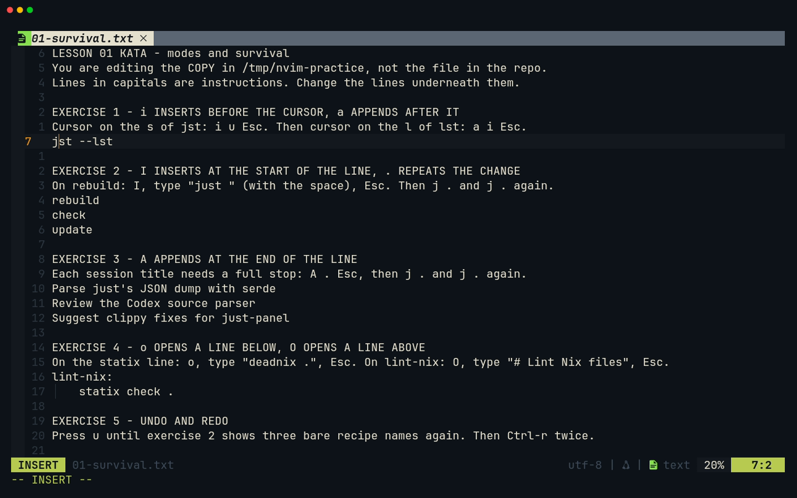
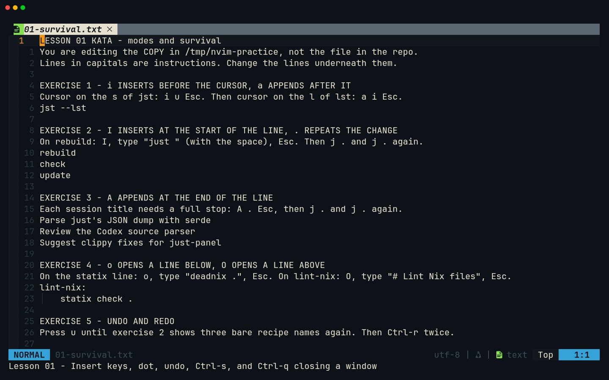
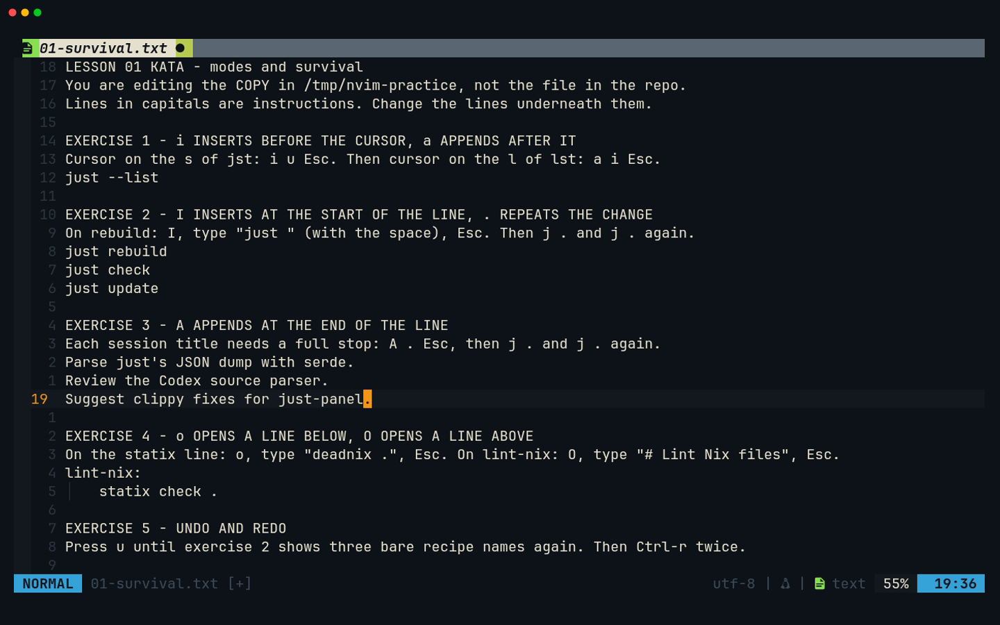
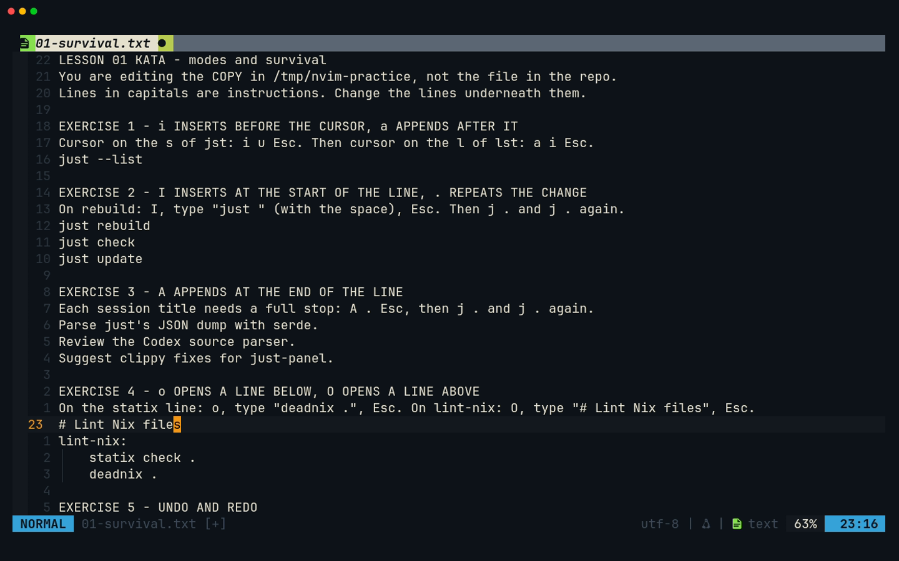
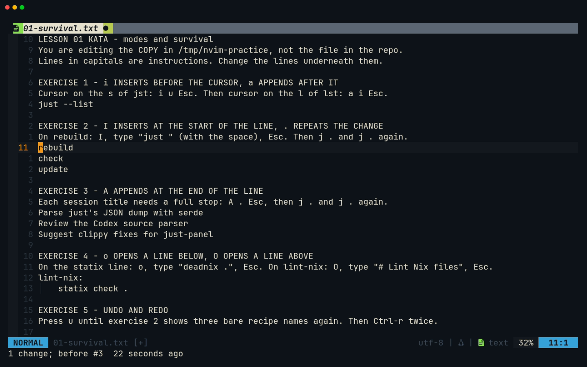
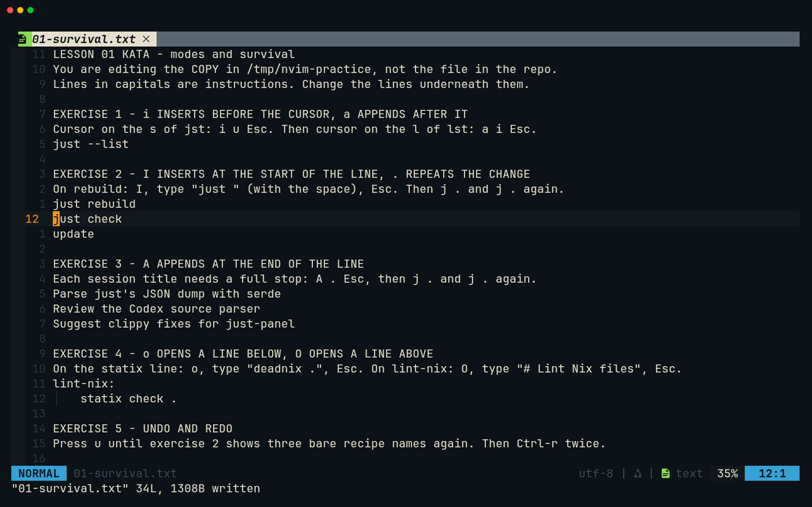
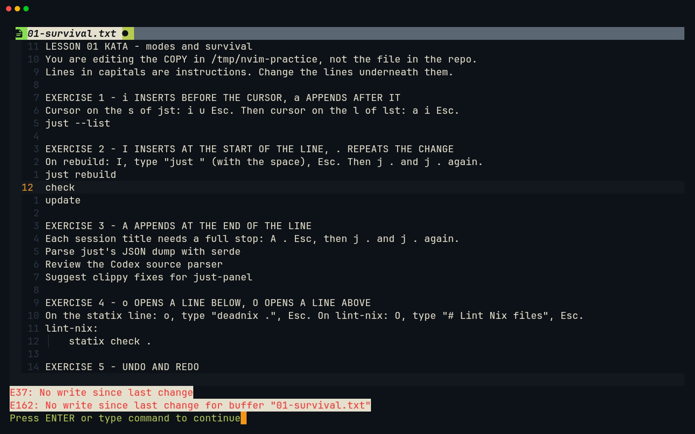
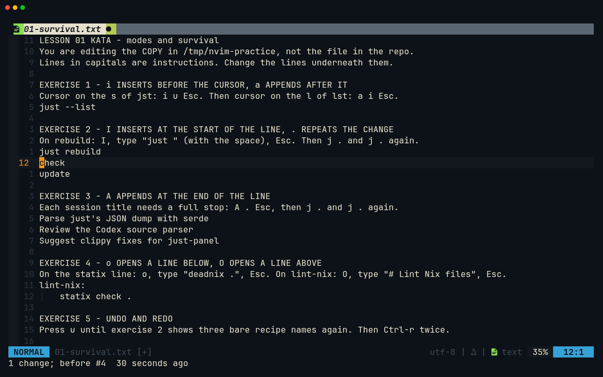
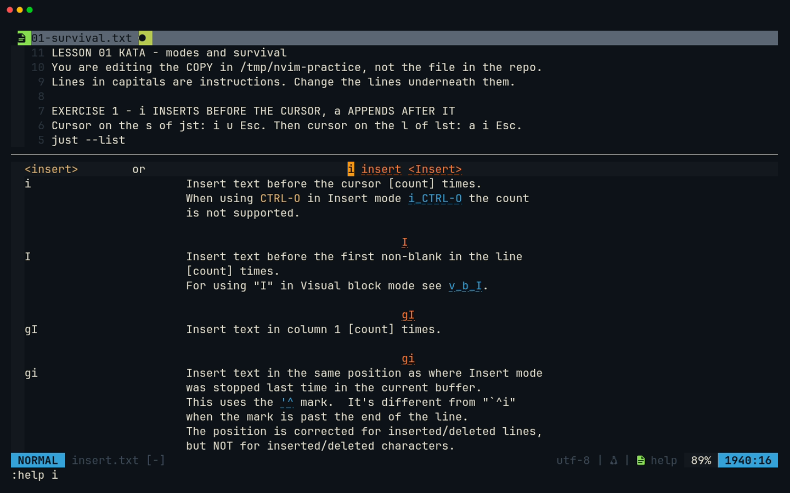

# Lesson 01 — Modes and survival

**Last Updated**: 27/09/2026
**Version**: 1.0.0
**Maintained By**: Development Team
**Language**: British English (en_GB)
**Timezone**: Europe/London

---

After this lesson you can open a file, type into it, take mistakes back, save and leave, without the mouse
and without getting stuck in the wrong mode. Every later lesson, and every line of just-panel and
session-browser you write, starts with these moves. Two of your own keys, `<C-s>` and `<C-q>`, look like the
Zed shortcuts you know but behave differently, so this lesson pins them down before they surprise you.

**Part**: 1 — Neovim basics · **Time**: ~45 min · **Previous**: [Lesson 00 — Setup and orientation](00-SETUP-AND-ORIENTATION.md) · **Next**: [Lesson 02 — Motions](02-MOTIONS.md)

## Objectives

By the end of this lesson you can:

- say which mode you are in at a glance, and get back to Normal mode from any of them with `<Esc>`;
- enter Insert mode six ways (`i` `a` `I` `A` `o` `O`) and pick the one that saves keystrokes;
- repeat your last change with `.`;
- undo and redo with `u` and `<C-r>`, including changes made before you last closed the file;
- save with `:w` or `<C-s>` and quit with `:q`, `:wq`, `:q!`, `:qa`, `ZZ` or `ZQ`, knowing what each one closes;
- explain why `<C-q>` closes a **window** and not Neovim;
- read the line numbers (relative, with the absolute number on the cursor line) and use `:help`.

## Before you start

- You have done [lesson 00](00-SETUP-AND-ORIENTATION.md): `nvim --version` reports `NVIM v0.12.5` on
  `laptop-intel`.
- Open a plain terminal: `SUPER + RETURN`, then `SUPER + 0` (new windows open on workspace 10).
- **Work on copies.** The practice files live in the repository, and the course expects them unchanged. Copy
  them to `/tmp` once and edit only the copies:

  ```bash
  # in the new terminal, which starts in your home folder
  cd ~/Repos/personal/nix-config
  mkdir -p /tmp/nvim-practice
  cp docs/NEOVIM-COURSE/practice/0* /tmp/nvim-practice/
  cd /tmp/nvim-practice
  nvim 01-survival.txt
  ```

  Repeat the `cp` line (from the repository) whenever you want a fresh copy. If you ever edit a file in the repository by mistake,
  `git checkout -- docs/NEOVIM-COURSE/practice/` puts back the committed version.
  [practice/README.md](../practice/README.md) lists every kata file.
- Open files by name (`nvim 01-survival.txt`) throughout Part 1. A bare `nvim` opens the dock layout with the
  tree and a terminal (neovim.nix:889-905), which you do not need yet. Giving a file skips it (neovim.nix:892).
- No capstone code yet. Both projects start in [lesson 06](06-TERMINAL.md).

## Keys in this lesson

| Keys | Mode | Action | Where it comes from |
| --- | --- | --- | --- |
| `<Esc>` | Insert, Visual, Command-line | back to Normal mode | Neovim default |
| `i` / `a` | Normal | Insert before / after the cursor | Neovim default |
| `I` / `A` | Normal | Insert at the first non-blank / at the end of the line | Neovim default |
| `o` / `O` | Normal | open a new line below / above and Insert there | Neovim default |
| `h` `j` `k` `l` | Normal | left, down, up, right (lesson 02 goes much further) | Neovim default |
| `:{number}<CR>` | Command-line | go to line `{number}` | Neovim default |
| `.` | Normal | repeat the last change | Neovim default |
| `u` / `<C-r>` | Normal | undo / redo | Neovim default |
| `:w` | Command-line | write (save) the file | Neovim default |
| `<C-s>` | Normal | save (`:w`) | config (neovim.nix:64) |
| `<C-s>` | Insert | signature help from a language server, **not** save | Neovim 0.12 default |
| `:q` / `:q!` | Command-line | close the window / close it and throw changes away | Neovim default |
| `<C-q>` | Normal | `:q`: closes the current **window** | config (neovim.nix:65) |
| `:wq` / `ZZ` | Command-line / Normal | save and close the window (`ZZ` saves only if changed) | Neovim default |
| `ZQ` | Normal | close the window without saving (same as `:q!`) | Neovim default |
| `:qa` / `:qa!` | Command-line | quit Neovim / quit and throw away all changes | Neovim default |
| `:help {topic}` | Command-line | open the manual at `{topic}` | Neovim default |
| `<C-]>` / `<C-o>` | Normal (in help) | follow the link under the cursor / come back | Neovim default |
| `<C-z>` | Normal | suspend Neovim to the shell (`fg` brings it back) | Neovim default |

## Walkthrough

The whole lesson in one recording ([MP4](../media/01-modes-and-survival/01-modes-and-survival.mp4)):


### 1. Modes: why the keyboard does two jobs

In Neovim a letter key is either a **command** or **text**, depending on the mode:

| Mode | What keys do | How you get there | What you see |
| --- | --- | --- | --- |
| Normal | run commands: move, delete, undo | `<Esc>` from anywhere; you start here | `NORMAL` at the left of the status line |
| Insert | type text, like any editor | `i` `a` `I` `A` `o` `O` (this lesson) | `INSERT`, plus `-- INSERT --` on the bottom line |
| Visual | select text, then act on it | `v`, `V`, `<C-v>` ([lesson 03](03-OPERATORS-AND-TEXT-OBJECTS.md)) | `VISUAL`, `V-LINE`, `V-BLOCK` |
| Command-line | type an Ex command (`:w`) or a search (`/`) | `:` or `/` from Normal mode | the cursor sits on the bottom line |
| Replace | overtype existing text | `R` from Normal mode | `REPLACE` |
| Terminal | keys go to a shell inside Neovim | [lesson 06](06-TERMINAL.md) | `TERMINAL` |

The status line at the bottom is lualine. It is global (one for all windows, `laststatus = 3`,
neovim.nix:247). Its left block always names the mode, and its right block shows `line:column`.

**Try it.** With `01-survival.txt` open, press `i`. The left block turns to `INSERT` and `-- INSERT --` appears
underneath. Type a few letters, then press `<Esc>`: you are back in `NORMAL`. Press `u` to undo the letters.



> **Tip:** When in doubt, press `<Esc>`. In Normal mode it does nothing harmful, so pressing it twice is a
> safe way to get your bearings.

### 2. Moving just enough, and reading the line numbers

[Lesson 02](02-MOTIONS.md) is all about moving. For now you need three things:

- `h` `j` `k` `l` move left, down, up and right. The arrow keys work too.
- `:7` then `<CR>` (Enter) jumps to line 7. That is Command-line mode: `:` opens it, `<CR>` runs it.
- The status line shows where you are, e.g. `7:2` means line 7, column 2.

The gutter uses **relative numbers** (`number` and `relativenumber`, neovim.nix:214-215). The cursor line shows
its real line number. Every other line shows how far it is from the cursor. The cursor line is also
highlighted (`cursorline`, neovim.nix:251). Lesson 02 turns these distances into jumps (`5j` = five lines
down).



**Try it.** Press `j` a few times and watch the numbers shift. The highlighted line always shows its real
number and every other line shows its distance. Then type `:7` and press `<CR>`.

### 3. `i` and `a`: before or after the cursor

`i` starts inserting **before** the character under the cursor, and `a` (append) starts **after** it.

**Try it (exercise 1, line 7 `jst --lst`).**

1. `:7` `<CR>`, then `h` or `l` until the cursor is on the `s` of `jst`. (`:7` may keep the column you
   were in, which lesson 02 explains.)
2. `i`, type `u`, `<Esc>`. The line reads `just --lst`.
3. `l` until the cursor is on the `l` of `lst`, then `a`, type `i`, `<Esc>`. The line reads `just --list`.

Notice that `<Esc>` moves the cursor one character left. Normal mode sits **on** a character, while Insert
mode sits **between** characters.

### 4. `I`, `A` and `.` (dot): the line ends, then repeat

`I` inserts at the first non-blank character of the line and `A` appends at the very end. Neither cares where
the cursor is on the line, which makes them perfect for repeating.

`.` repeats your last **change**. A change is everything from the key that started it to the `<Esc>` that
ended it, so `Ijust <Esc>` is one change that `.` replays in full.

**Try it (exercise 2, lines 11-13).**

1. `:11` `<CR>` puts you on `rebuild`.
2. `I`, type `just ` (with the trailing space), `<Esc>`. You get `just rebuild`.
3. `j` then `.` gives `just check`. `j` then `.` again gives `just update`.

**Try it (exercise 3, lines 17-19).** `:17` `<CR>`, then `A`, type `.`, `<Esc>`. Then `j` `.` `j` `.`. All three
session titles now end with a full stop.



> **Why:** `.` is why Neovim users make small, repeatable edits: make the change once, then move and press
> `.`. From lesson 03 on you will repeat whole operator commands with it, and lesson 04 uses it to change search
> matches one by one.

### 5. `o` and `O`: new lines

`o` opens a new line **below** the cursor line and `O` (capital) opens one **above**. Both put you in Insert
mode. The config sets `autoindent` (neovim.nix:221), so a new line starts with the same indentation as the
line you opened it from.

**Try it (exercise 4, lines 23-24).**

1. `:24` `<CR>` (the `statix check .` line), `o`, type `deadnix .`, `<Esc>`. The new line is indented four
   spaces, like the one above it.
2. `:23` `<CR>` (the `lint-nix:` line), `O`, type `# Lint Nix files`, `<Esc>`.

```text
# Lint Nix files
lint-nix:
    statix check .
    deadnix .
```



> **Gotcha:** While you type, a small menu may pop up under the cursor offering a word that is already in the
> file, such as `deadnix` or `files`, marked `Text`. That is nvim-cmp suggesting words from the buffer
> (neovim.nix:329). Ignore it and keep typing: `<Esc>` closes it as it leaves Insert mode. Do not press `<CR>`
> while it is open, because Enter accepts the top suggestion instead of starting a new line.
> [Lesson 11](11-COMPLETION-FORMATTING-DIAGNOSTICS.md) covers completion properly.

### 6. Undo and redo

`u` undoes the last change and `<C-r>` redoes it. Each Insert session (from `i`/`A`/`o`… to `<Esc>`) is one
undo step, and so is each `.`. (One exception in this config: typing a bracket or a quote splits the session
into several undo steps, because nvim-autopairs adds the closer. Lesson 03 shows it; this kata has none.)

**Try it (exercise 5).** Press `u` eight times: exercise 4 (two changes), exercise 3 (three) and exercise 2
(three) are undone in reverse order. Each `u` reports on the bottom line, the last one `1 change; before #3`.
Lines 11-13 read `rebuild`, `check`, `update` again, while exercise 1 stays done. Now press `<C-r>` twice to
redo `just rebuild` and `just check`. Each redo reports too, e.g. `1 change; after #3`.



> **Zed habit:** `<C-z>` is not undo here. In Normal mode it **suspends** Neovim and drops you back to the shell
> you started it from, which looks as if Neovim vanished. Type `fg` and `<CR>` to get it back, then use `u`. The
> dev-layout windows (lesson 00) run Neovim straight from Kitty with no shell behind it, so there is nothing
> to drop back to. What `<C-z>` does there is unconfirmed (verify on laptop-intel); just use `u`.

### 7. Saving: `:w` and `<C-s>`

`:w` `<CR>` writes the file. The config adds `<C-s>` for the same thing (neovim.nix:64), **in Normal mode
only**. Both report on the bottom line. After exercises 1-5 it reads `"01-survival.txt" 34L, 1308B written`.

**Try it (exercise 6).** Press `<Esc>` to be sure you are in Normal mode, then `:w` `<CR>`. Change something, go
back to Normal mode and press `<C-s>`.



> **Gotcha:** In Insert mode `<C-s>` does **not** save. Neovim (since 0.11) maps Insert-mode `<C-s>` to "show
> signature help" from a language server (`:help i_CTRL-S`). In a plain text file it does nothing visible.
> Always `<Esc>` first, then `<C-s>`.

Saving also runs **format on save** (conform, neovim.nix:974-977). A `.txt` file has no formatter, so the kata
saves exactly as you typed it. A Markdown file is rewritten by prettier and a Python file by ruff
(neovim.nix:951, 953). That is why the Part 1 kata files are mostly `.txt`. See Gotcha 3.

### 8. Quitting: which command closes what

Neovim shows files in **windows**. Most `:q`-family commands close the current window. Neovim itself only exits
when the last window closes, or when you use a `:qa` command.

| Command | Saves? | Closes | If there are unsaved changes |
| --- | --- | --- | --- |
| `:q` / `<C-q>` | no | this window | on the **last** window it refuses (`E37: No write since last change`, `E162` names the buffer). On any other window it closes the window and keeps the changes in a hidden buffer (Neovim's default `hidden`) |
| `:q!` / `ZQ` | no, discards | this window | throws them away |
| `:wq` | yes | this window | – |
| `ZZ` (same as `:x`) | only if changed | this window | – |
| `:qa` | no | every window, so Neovim exits | refuses with E37/E162, including for changes left in hidden buffers |
| `:qa!` | no, discards | everything | throws them away |
| `:wqa` | yes, all | everything | – |

**Try it.** Make a change without saving, then press `<C-q>`. Neovim refuses with E37/E162 and waits at `Press
ENTER`. Press `<CR>`, then either `<C-s>` and `<C-q>` again, or `:q!` to leave without saving.



### 9. Undo that survives a restart

The config sets `undofile` (neovim.nix:266). Every save also writes the undo history to a file under
`~/.local/state/nvim/undo/`, and reopening the file loads it again. So `u` keeps working after you quit.

**Try it (exercise 6, continued).** Save with `<C-s>`, quit with `:q`, reopen with `nvim 01-survival.txt` and
press `u`. The last change from the previous session comes undone, with a message such as
`1 change; before #4  29 seconds ago`. `<C-r>` puts it back.



### 10. `:help`, and why `<C-q>` is not "quit Neovim"

The manual is built in. `:help {topic}` opens it in a new **window**, below your file because the config sets
`splitbelow` (neovim.nix:261). Useful topics for this lesson:

| Command | Opens |
| --- | --- |
| `:help i` | the `i` command (Insert mode keys are nearby) |
| `:help :w` | the `:w` command (a leading `:` means an Ex command) |
| `:help i_CTRL-S` | what `<C-s>` does in Insert mode (the `i_` prefix means Insert mode) |
| `:help undo-persistence` | the undo file |
| `:help help-summary` | how to find anything else in the manual |

Inside help, `<C-]>` follows the link under the cursor and `<C-o>` comes back.

**Try it (exercise 7).** Type `:help i` and `<CR>`. A help window opens below the kata. Press `<C-q>`: the
**help window** closes and your file stays open. That is the rule for `<C-q>`: it is `:q` (neovim.nix:65), and
`:q` closes one window.



> **Zed habit:** In Zed `Ctrl+Q` quits the application. Here `<C-q>` closes the window you are in. With one
> window that is the same thing, but as soon as you have a split, a help window or the dock layout, Neovim keeps
> running. To leave Neovim for certain, use `:qa` (or `:qa!`).

> **Tip:** `<leader>fh` (Space, then `f`, then `h`) searches every help tag with Telescope. It arrives properly
> in [lesson 09](09-PROJECT-PANE.md).

## Gotchas in this config

1. **`<C-q>` closes a window, not Neovim** (neovim.nix:65). In a bare `nvim` (the dock layout with the tree and
   a terminal, neovim.nix:889-905), `<C-q>` in the editor closes only the editor window and leaves the tree and
   terminal behind. Leave with `:qa` (or `:qa!` to discard changes). Inside a Telescope picker `<C-q>` means
   something else entirely (lesson 09).
2. **`<C-s>` saves in Normal mode only** (neovim.nix:64). In Insert mode it is Neovim's signature-help key, so
   `<Esc>` first. Inside some panels (neo-tree, Neogit, aerial) `<C-s>` is a panel command, as later lessons
   show.
3. **Saving can rewrite a file** (neovim.nix:974-977). Format on save runs prettier on Markdown, ruff on Python,
   and the language server's formatter on Rust and Nix. The `.txt` katas are safe to save. For the Python kata in
   lesson 03, or any file you do not want reformatted, `:noautocmd w` saves without formatting (lesson 11
   explains conform properly). And never practise on the course's own `.md` files: copy first.
4. **`u` can go back further than you expect.** Because of `undofile` (neovim.nix:266), undo reaches into
   earlier sessions. If you press `u` once too often, `<C-r>` brings the change back.
5. **The line numbers are relative** (neovim.nix:214-215). Only the cursor line shows its real number. To jump
   to an absolute line, type `:{number}`. The status line's `line:column` is always absolute.
6. **`<C-z>` suspends Neovim**, it does not undo. `fg` in the shell resumes it (see the Zed habit in step 6).
7. **Closing a window can hide unsaved work.** Neovim's default `hidden` lets `:q`/`<C-q>` close a window whose
   buffer has unsaved changes, as long as it is not the last window. The changes wait in a hidden buffer until
   `:qa` refuses to exit (E37/E162) and names it. `:wa` saves them all.

## Drills

Start each drill from a fresh copy: `cp ~/Repos/personal/nix-config/docs/NEOVIM-COURSE/practice/01-survival.txt /tmp/nvim-practice/`.

1. On line 12 (`check`), turn the line into `just check --list`, using one `I` and one `A`.

   <details><summary>Answer</summary>

   `:12` `<CR>`, then `I`, type `just` and a space, `<Esc>`. Then `A`, type a space and `--list`, `<Esc>`. That is
   two Insert sessions, so `u` twice undoes both.
   </details>

2. Once you are on line 11 (`rebuild`), add a blank line between it and `check` in two keystrokes.

   <details><summary>Answer</summary>

   `o` `<Esc>`. `o` opens an empty line below and `<Esc>` leaves it empty. (From `check`, `O` `<Esc>` does the
   same.)
   </details>

3. You typed `Ijust ` and pressed `<Esc>` on `rebuild`. How many keys does it take to make `check` and `update`
   match?

   <details><summary>Answer</summary>

   Four: `j` `.` `j` `.`. `.` replays the whole `Ijust <Esc>` change wherever the cursor is on the line, because
   `I` does not depend on the cursor column.
   </details>

4. You are typing in Insert mode and press `<C-s>` out of Zed habit. What happened, and how do you save?

   <details><summary>Answer</summary>

   Nothing was saved. Insert-mode `<C-s>` is Neovim's signature-help key (`:help i_CTRL-S`), and in a text file
   it shows nothing. Press `<Esc>`, then `<C-s>` (or `:w` `<CR>`), and look for the `written` message.
   </details>

5. With an unsaved change in the kata, open `:help i`, then `:help :w`. How many windows are there? Now press
   `<C-q>` twice. What is left on screen, and is Neovim still running?

   <details><summary>Answer</summary>

   Two windows: `:help` reuses an open help window instead of adding another. The first `<C-q>` closes the help
   window. The second is `:q` on the **last** window with an unsaved change, so Neovim refuses with E37/E162 and
   keeps running. Press `<CR>`, then save and quit (`:wq`) or discard (`:q!`).
   </details>

6. Save the kata, quit, and reopen it. Undo the last three changes, then redo one.

   <details><summary>Answer</summary>

   `<C-s>`, `:q` `<CR>`, `nvim 01-survival.txt`, then `u` `u` `u` and `<C-r>`. The undo file written at save
   time (`undofile`, neovim.nix:266) is what makes `u` work in the new session.
   </details>

7. You opened a file, made a mess, and want to leave without saving **anything** in any window. One command?

   <details><summary>Answer</summary>

   `:qa!` `<CR>`. (`ZQ` or `:q!` discard and close only the current window.)
   </details>

## Recap

- Normal mode is for commands and Insert mode is for typing. The status line always names the mode, and
  `<Esc>` always gets you back to Normal.
- `i`/`a` insert before/after the cursor, `I`/`A` at the line's start/end, and `o`/`O` on a new line
  below/above.
- `.` repeats the last change. `u` undoes, `<C-r>` redoes, and the undo history survives a restart
  (`undofile`).
- Save with `:w` or Normal-mode `<C-s>`. Saving may run a formatter; the `.txt` katas are safe.
- `:q`, `<C-q>`, `ZZ` and `ZQ` close a **window**. `:qa` / `:qa!` leave Neovim.
- `:help {topic}` opens the manual in a window. `<C-]>` follows links and `<C-o>` comes back.

Next, [lesson 02](02-MOTIONS.md) replaces `hjkl`-tapping with motions that jump straight to where you
want to be.

## Recording

- **Tape:** [`tapes/01-modes-and-survival.tape`](../tapes/01-modes-and-survival.tape). Run it from
  `docs/NEOVIM-COURSE/` with `vhs tapes/01-modes-and-survival.tape`.
- **Fixture:** `fixtures/01-modes-and-survival/01-survival.txt`, an exact copy of `practice/01-survival.txt`.
  Keep the two identical when you edit either. The tape copies it to `/tmp/nvim-course/01-modes-and-survival`
  and sets `XDG_STATE_HOME` inside that directory, so the undo file it writes never touches
  `~/.local/state/nvim/undo`. It also points `CLAUDE_CONFIG_DIR` at a throwaway folder next to it, so the lock
  file claudecode.nvim writes on every start (neovim.nix:830-833) never lands in your real `~/.claude/ide`.
- **Outputs** in `media/01-modes-and-survival/`: `01-modes-and-survival.gif`, `01-modes-and-survival.mp4` and
  these screenshots:

  | Screenshot | Shows |
  | --- | --- |
  | `start.png` | the kata just opened: relative numbers, line 1 showing its real number |
  | `insert-mode.png` | `INSERT` in lualine and `-- INSERT --` below, cursor inside `jst` |
  | `dot-repeat.png` | exercises 1-3 done with `i`/`a`, `I` + `.`, `A` + `.` |
  | `open-lines.png` | exercise 4: the `O` comment line and the autoindented `o` line |
  | `undo.png` | after eight `u`: exercise 2 back to bare names |
  | `saved.png` | the `written` message after `<C-s>` |
  | `persistent-undo.png` | after `:q` and reopening, `u` reports `1 change; before #4` |
  | `help-window.png` | `:help i` in a window below the kata |
  | `e37.png` | `<C-q>` on the last window with an unsaved change: E37 and E162 |

- **Manual steps:** none. Nothing is yanked or deleted, so your system clipboard is untouched.
- **VHS version:** `vhs --version` must print 0.12.1, which the config builds (0.12.0 exits 0 and writes nothing);
  if it prints 0.12.0, `just rebuild` first ([Appendix B](../appendices/B-RECORDING-WITH-VHS.md#first-make-sure-vhs-is-0121)).
- **Check after every run:** `media/01-modes-and-survival/` actually contains `01-modes-and-survival.gif`,
  `01-modes-and-survival.mp4` and all nine PNGs above. An exit code of 0 proves nothing on its own.
