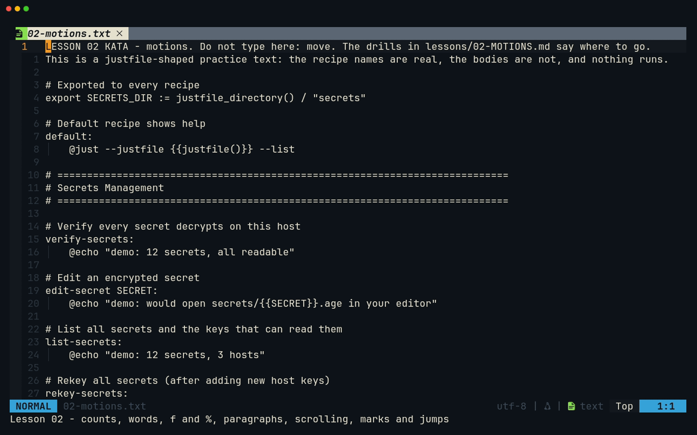
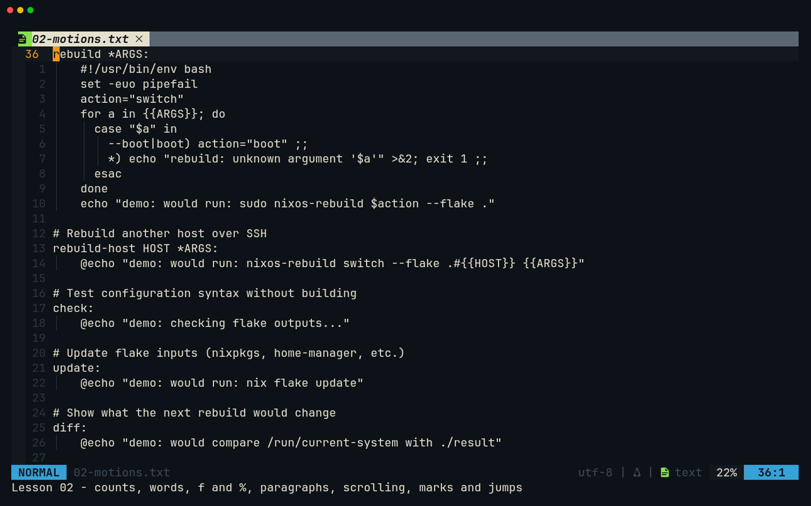
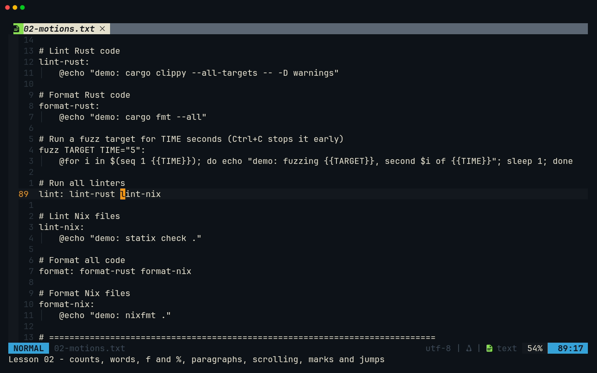
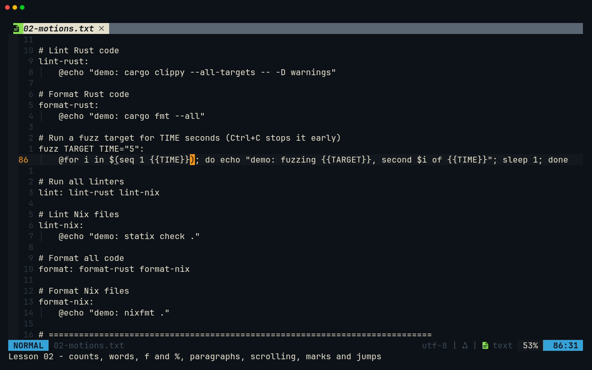
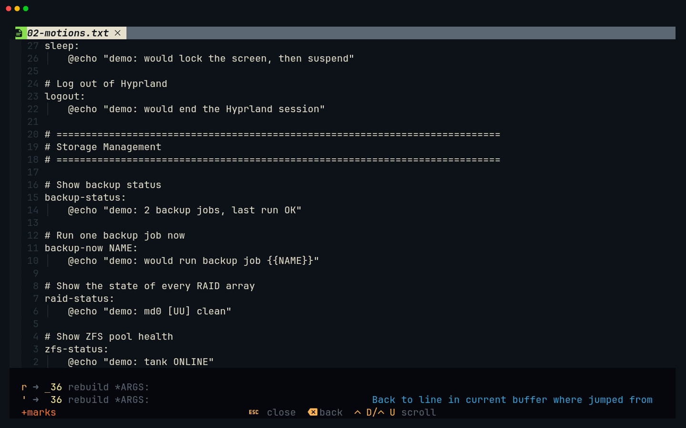
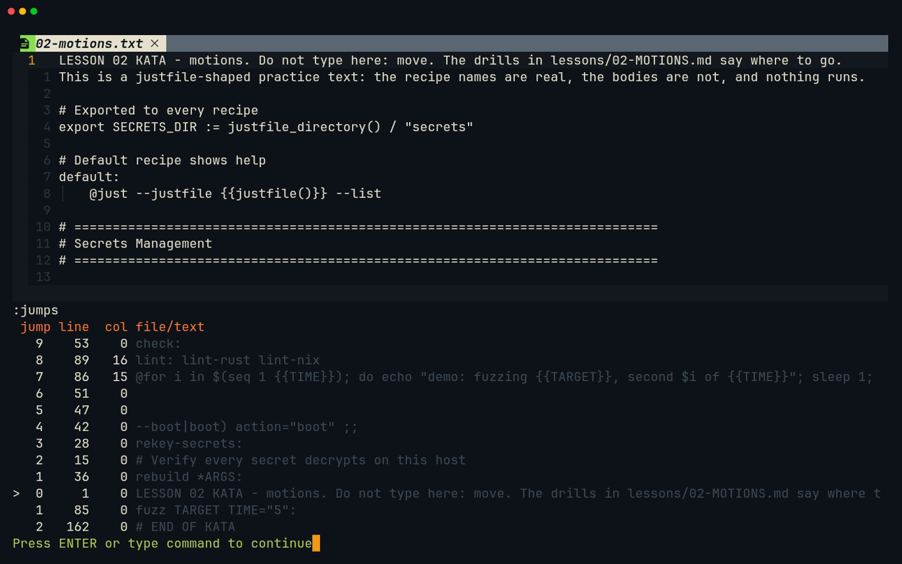

# Lesson 02 — Motions

**Last Updated**: 27/09/2026
**Version**: 1.0.0
**Maintained By**: Development Team
**Language**: British English (en_GB)
**Timezone**: Europe/London

---

Motions get you anywhere in a file in two or three keys: the next word, the matching bracket, line 85, the
place you were a minute ago. They are also half of every editing command in [lesson 03](03-OPERATORS-AND-TEXT-OBJECTS.md)
(`d` + a motion deletes exactly what the motion covers), so time spent here pays twice. The kata is a
justfile-shaped text whose recipe names are the ones just-panel will list in lesson 14. Its hyphenated names
(`lint-rust`, `clean-generations`) show you early how Neovim splits words.

**Part**: 1 — Neovim basics · **Time**: ~60 min · **Previous**: [Lesson 01 — Modes and survival](01-MODES-AND-SURVIVAL.md) · **Next**: [Lesson 03 — Operators and text objects](03-OPERATORS-AND-TEXT-OBJECTS.md)

## Objectives

By the end of this lesson you can:

- turn the relative line numbers into exact jumps (`17j`, `5k`) and jump to absolute lines (`53G`, `gg`, `G`);
- move by words and WORDs (`w` `b` `e` `ge`, `W` `B` `E`), and say why `-` makes them differ;
- reach line positions (`0` `^` `$`) and single characters (`f` `t` `F` `T`, repeated with `;` `,`);
- jump between matching brackets with `%` and between paragraphs with `{` `}`;
- move the view and the cursor within it (`<C-d>` `<C-u>` `<C-f>` `<C-b>`, `zz` `zt` `zb`, `H` `M` `L`);
- set and use marks, walk back through the jumplist with `<C-o>`, and explain why `<C-i>` does not walk
  forward in this config.

## Before you start

- You have finished [lesson 01](01-MODES-AND-SURVIVAL.md) and have the copies in `/tmp/nvim-practice`. If not:

  ```bash
  # from ~/Repos/personal/nix-config
  mkdir -p /tmp/nvim-practice
  cp docs/NEOVIM-COURSE/practice/0* /tmp/nvim-practice/
  ```

- Open the kata:

  ```bash
  # from /tmp/nvim-practice
  nvim 02-motions.txt
  ```

- This kata is for **moving**, not typing. If a stray key changes something, `u` undoes it. A fresh `cp` of the
  file resets everything.
- The drills name lines by their absolute number (`line 85`). `85G` takes you there, and the status line's
  `line:column` confirms it.

## Keys in this lesson

| Keys | Mode | Action | Where it comes from |
| --- | --- | --- | --- |
| `h` `j` `k` `l` | Normal | left, down, up, right; with a count, `17j` | Neovim default |
| (gutter numbers) | – | distance from the cursor line, i.e. the count to type | config (neovim.nix:214-215) |
| `gg` / `G` / `{N}G` | Normal | first line / last line / line N (also `:{N}`) | Neovim default |
| `w` / `b` / `e` / `ge` | Normal | next word start / previous word start / word end / previous word end | Neovim default |
| `W` / `B` / `E` / `gE` | Normal | the same for WORDs (anything between spaces) | Neovim default |
| `0` / `^` / `$` | Normal | column 0 / first non-blank / end of line | Neovim default |
| `f{c}` / `t{c}` | Normal | onto / just before the next `{c}` on the line | Neovim default |
| `F{c}` / `T{c}` | Normal | the same, backwards | Neovim default |
| `;` / `,` | Normal | repeat the last `f`/`t`/`F`/`T` / repeat it in reverse | Neovim default |
| `%` | Normal | jump to the matching `(` `)` `[` `]` `{` `}` | Neovim default |
| `{` / `}` | Normal | previous / next blank line (paragraph) | Neovim default |
| `H` / `M` / `L` | Normal | top / middle / bottom line of the window | Neovim default |
| `<C-d>` / `<C-u>` | Normal | scroll half a window down / up | Neovim default |
| `<C-f>` / `<C-b>` | Normal | scroll a whole window forward / back | Neovim default |
| `zz` / `zt` / `zb` | Normal | scroll so the cursor line is centred / at the top / at the bottom | Neovim default |
| `m{a-z}` | Normal | set a mark | Neovim default |
| `'{a-z}` / `` `{a-z} `` | Normal | jump to a mark's line / exact position | Neovim default |
| `'` or `` ` `` on its own | Normal | a list of your marks, shown at once | which-key default (marks plugin) |
| `''` | Normal | back to the line you last jumped from | Neovim default |
| `<C-o>` | Normal | back through the jumplist | Neovim default |
| `<C-i>` | Normal | forward through the jumplist in stock Neovim, **but here it runs `:bnext`** (the `<Tab>` map) | config (neovim.nix:61) |
| `:jumps` / `:marks` | Command-line | show the jumplist / the marks | Neovim default |

## Walkthrough

The whole lesson in one recording ([MP4](../media/02-motions/02-motions.mp4)):



### 1. `hjkl`, counts, and the relative numbers

`h` `j` `k` `l` move one character or line. Put a number in front and they move that many: `5j` goes five lines
down. The gutter already shows that number for every line on screen (`relativenumber`, neovim.nix:215), so you
never count by hand. You read the number next to the line you want and type it before `j` or `k`.

For absolute positions, use `gg` (first line), `G` (last line) and `{N}G` or `:{N}` (line N).

**Try it.**

1. `36G` jumps to `rebuild *ARGS:`. `zt` scrolls it to the top of the window.
2. Find `check:` in the gutter. It shows **17**.
3. `17j`. The status line says `53:1`.



> **Tip:** `gg`, `G`, `{N}G` and `:{N}` keep your **column** where they can, because Neovim's default is
> `nostartofline` (`:help 'startofline'`). If you need the start of the line, follow with `0` or `^`, as in
> `85G0`. Lesson 03's drills rely on that habit.

### 2. Words and WORDs

A **word** is a run of letters, digits and `_`, or a run of other non-blank characters. A **WORD** is anything
between spaces. The lower-case motions use words and the capitals use WORDs:

| Motion | Goes to |
| --- | --- |
| `w` / `W` | start of the next word / WORD |
| `b` / `B` | start of the current or previous word / WORD |
| `e` / `E` | end of the current or next word / WORD |
| `ge` / `gE` | end of the previous word / WORD |

Recipe names are where this matters. On line 89, `lint: lint-rust lint-nix`, `w` stops on `:`, `lint`, `-`,
`rust` and then `lint` (of `lint-nix`). `W` needs two presses to get to the same place.

**Try it.**

1. `89G0`, then `w` five times. Watch it stop on the punctuation.
2. `0`, then `W` twice. You land on `lint-nix` again.
3. `e` and `E` from `0`: `e` stops at the `t` of `lint`, while `E` stops on the `:`, the end of the WORD `lint:`.
4. Line 85, `fuzz TARGET TIME="5":`: `85G0` then `w` four times lands on the `5`.



> **Why:** the same rule decides what `*` searches for and what the text object `iw` covers. In
> [lesson 04](04-SEARCH-REGISTERS-MACROS.md), `*` on `lint` also stops inside `lint-rust` for exactly this
> reason.

### 3. Line positions: `0` `^` `$`

`0` goes to column 0, `^` to the first non-blank character and `$` to the last character. They differ only on
indented lines, and recipe bodies are indented.

**Try it.** `86G`, then `0` (the cursor sits in the indentation), `^` (on the `@` of `@for`), `$` (on the `e` of
`done`).

### 4. Finding a character on the line: `f` `t` `F` `T` `;` `,`

`f{c}` jumps **onto** the next `{c}` on the current line and `t{c}` stops just **before** it. `F` and `T` do the
same backwards. `;` repeats the last one in the same direction and `,` repeats it in reverse. This is the
fastest way to cross a long line.

**Try it (line 86, the long `@for` line).**

1. `86G0` then `f{`: the cursor lands on the first `{` of `{{TIME}}`.
2. `;` moves to the second `{`, `;` again jumps to the first `{` of `{{TARGET}}`, and `,` goes back.
3. `0t;` stops just before the first `;`, on the `)` that closes `$(seq 1 {{TIME}})`.
4. `$` then `b` lands on the `d` of the final `done`.

### 5. Matching pairs: `%`

On a bracket, `%` jumps to its partner. Anywhere else on the line, it first finds the next bracket to the right,
then jumps to its partner.

**Try it.** `86G0` then `%`: from the start of the line, `%` finds the `(` of `$(seq` and lands on its `)`. `%`
again jumps back to the `(`.



### 6. Paragraphs: `{` `}`

A paragraph is a block of non-blank lines. `}` jumps to the next blank line and `{` to the previous one. In a
justfile every recipe is a paragraph, so `}` hops recipe by recipe.

**Try it.** `36G0` then `}`: line 47, the blank line after the `rebuild` body. `}` again: line 51. `{`: back to 47.

> **Tip:** In [lesson 09](09-PROJECT-PANE.md) the aerial outline window has its own `{` and `}` that hop between
> symbols. That is aerial's own map inside its window. In code buffers `{` and `}` stay paragraph motions.

### 7. The window: scrolling, `zz` `zt` `zb`, `H` `M` `L`

| Keys | The cursor | The view |
| --- | --- | --- |
| `<C-d>` / `<C-u>` | moves with the text | half a window down / up |
| `<C-f>` / `<C-b>` | moves with the text | a whole window forward / back |
| `zz` / `zt` / `zb` | stays on its line | cursor line centred / at the top / at the bottom |
| `H` / `M` / `L` | jumps to the top / middle / bottom line on screen | stays |

Neovim's default `scrolloff` is 0, so `H` and `L` land on the very first and last visible lines.

**Try it.**

1. `gg`, `<C-d>` twice, `<C-u>` once. Then `<C-f>` and `<C-b>`.
2. `H`, `M`, `L`: the cursor moves, the text does not.
3. `85G` then `zt`, `zz`, `zb`: the text moves, and the cursor stays on `fuzz TARGET TIME="5":`.

### 8. Marks

`m` plus a letter sets a mark at the cursor. `'` plus the letter jumps back to the start of that line, and `` ` ``
plus the letter jumps back to the exact column. `''` returns to the line you jumped from. Lower-case marks
belong to the file. Capital marks (`mA`) work across files. `:marks` lists them all.

This config runs which-key with its marks plugin, so as soon as you press `'` or `` ` `` a list of your marks
pops up. Press the letter to jump, or `<Esc>` to cancel.

**Try it.**

1. `36G`, then `mr` (a mark named `r`, for `rebuild`).
2. `G` to go to the end.
3. `'`: the marks list appears at the bottom, with a row `r ➜ 36 rebuild *ARGS:` (mark, line number, line
   text). The thin bar in the list (just before `36` in the screenshot below) is not text: it is your cursor,
   still on the last line behind the list, drawn as an underline while Neovim waits for the letter. Press `r` and
   you are back on line 36.
4. `''` takes you back to the end of the file, and `''` again brings you back to line 36.



### 9. The jumplist: `<C-o>` back, and the `<C-i>` trap

Big moves are **jumps**: `G`, `gg`, `{N}G`, `%`, `{`, `}`, `H`, `M`, `L`, a mark jump, and the searches in
lesson 04. Before each jump Neovim records where you were. `<C-o>` walks back through that list, and
`:jumps` shows it, with `>` marking where you are. Counted `j`/`k` moves are not jumps.

**Try it.** `gg`, `85G`, `G`. Now `<C-o>` takes you back to line 85, and `<C-o>` again back to line 1. Then
`:jumps` shows the list.



In stock Neovim, `<C-i>` walks **forward** again. In this config it does not:

- the config maps `<Tab>` to `:bnext`, next buffer (neovim.nix:61);
- terminals have traditionally sent the same byte for `<Tab>` and `<C-i>`. Kitty can tell them apart, but
  Neovim's rule (`:help CTRL-I`) is that the two are only kept separate **if both are mapped**. Only `<Tab>` is
  mapped, so the mapping applies to both;
- so `<C-i>` runs `:bnext`. With one file open nothing seems to happen. With several, you suddenly switch
  file.

Until you fix it, go forward with `:exe "normal! 1\<C-i>"` (`normal!` ignores mappings; the `1` stops `:normal` from
treating the Tab character as a space), or simply jump again. [Lesson 23](23-FIX-JUMP-FORWARD.md) maps `<C-i>`
explicitly, which gives jump-forward back in Kitty.

## Gotchas in this config

1. **`<Tab>` swallows `<C-i>`** (neovim.nix:61). Jumplist forward runs `:bnext` instead, even in Kitty. `<C-o>`
   (back) is unaffected. Workaround: `:exe "normal! 1\<C-i>"`. [Lesson 23](23-FIX-JUMP-FORWARD.md) maps `<C-i>`
   explicitly, which gives jump-forward back in Kitty.
2. **Line jumps keep the column** (Neovim's default `nostartofline`). `85G` from column 30 lands in column 30 of
   line 85 (or the line's end). Add `0` or `^` when a following `f`, `t` or `w` needs to start from the left.
3. **`-` splits words.** `w`, `b`, `e` and `iw` treat `lint-rust` as three words, and the WORD motions
   (`W` `B` `E`) treat it as one. The same rule makes `*` and `\<lint\>` match inside `lint-rust`
   ([lesson 04](04-SEARCH-REGISTERS-MACROS.md)).
4. **`<C-h>` `<C-j>` `<C-k>` `<C-l>` are window moves, not cursor moves** (neovim.nix:68-71). With one window
   they do nothing. They matter from [lesson 08](08-FILE-PANE.md), when you have splits.
5. **Pressing `'` or `` ` `` pops up a list immediately.** That is which-key's marks plugin. It opens with no
   delay, unlike the 200 ms leader popup. It is not an error: press the mark's letter, or `<Esc>`.
6. **`<C-f>` and `<C-b>` change meaning elsewhere.** They scroll the view in Normal mode, but with the completion
   menu open in Insert mode they scroll its documentation (neovim.nix:301-302). Inside neo-tree they scroll the
   preview.

## Drills

Use `/tmp/nvim-practice/02-motions.txt`. Every answer was checked on this exact file.

1. Put `rebuild *ARGS:` (line 36) at the top of the window and read the gutter. What single command then takes
   you to `update:`?

   <details><summary>Answer</summary>

   `36G` `zt`. `update:` shows **21**, so `21j`. (`57G` also works: it is line 57.)
   </details>

2. On line 85, `fuzz TARGET TIME="5":`, starting from column 0: how many `w` presses reach the `5`? How many
   `W` presses reach `TIME`?

   <details><summary>Answer</summary>

   `85G0`, then `w` four times (`TARGET`, `TIME`, `="`, `5`). `W` twice (`TARGET`, then `TIME="5":`, a single
   WORD).
   </details>

3. On line 89, `lint: lint-rust lint-nix`, starting from column 0: where do five `w` presses end, and how many
   `W` presses reach the same place?

   <details><summary>Answer</summary>

   On the `l` of `lint-nix`: `w` stops on `:`, `lint`, `-`, `rust`, `lint`. Two `W` presses get there (`lint-rust`,
   `lint-nix`).
   </details>

4. On line 86, from column 0, what do `f{` `;` `;` land on? And what single key, from column 0, jumps to the `)`
   that closes `$(seq 1 {{TIME}})`?

   <details><summary>Answer</summary>

   `f{` lands on the first `{` of `{{TIME}}`, `;` on the second `{`, and `;` on the first `{` of `{{TARGET}}`.
   From column 0, `%` finds the first bracket on the line (the `(` of `$(`) and jumps to its `)`.
   </details>

5. You are on line 47, the blank line after the `rebuild` body. How many `}` presses reach the blank line just
   above `# Update flake inputs`?

   <details><summary>Answer</summary>

   Two: `}` goes to line 51, then to line 55.
   </details>

6. Set mark `c` on `check:` (line 53), go to the last line, come back with one motion, then return to the
   last line with another.

   <details><summary>Answer</summary>

   `53G` `mc` `G`, then `'c` (or `` `c ``) back to line 53, then `''` back to line 162.
   </details>

7. `gg`, `85G`, `G`, then `<C-o>` twice. Where are you? Go forward one step in the jumplist **without**
   pressing `<C-i>`.

   <details><summary>Answer</summary>

   Line 1. `:exe "normal! 1\<C-i>"` `<CR>` takes you forward to line 85. `<C-i>` itself would run `:bnext`
   (Gotcha 1).
   </details>

8. Without moving the cursor off `fuzz TARGET TIME="5":`, show it in the middle of the window, then at the
   bottom.

   <details><summary>Answer</summary>

   `85G`, then `zz`, then `zb`. The `z` commands scroll the view and leave the cursor on its line.
   </details>

## Recap

- Read the count from the gutter (`17j`). Use `gg`, `G`, `{N}G` for absolute lines, and remember they keep the
  column.
- `w b e ge` move by words and `W B E gE` by WORDs. Hyphenated recipe names are one WORD but three words.
- `0 ^ $` for line positions, `f t F T` + `; ,` for characters, `%` for brackets, `{ }` for paragraphs.
- `<C-d> <C-u> <C-f> <C-b>` scroll, `zz zt zb` place the view, `H M L` place the cursor on screen.
- `m{a-z}` sets a mark, and `'`/`` ` `` jump back (which-key lists them). `''` returns.
- `<C-o>` walks back through the jumplist. `<C-i>` is `:bnext` in this config.
  [Lesson 23](23-FIX-JUMP-FORWARD.md) maps `<C-i>` explicitly, which gives jump-forward back in Kitty.

Next, [lesson 03](03-OPERATORS-AND-TEXT-OBJECTS.md) puts an operator in front of these motions: `d}`, `c$`,
`yw`. Then come text objects, which select a quoted string or a bracketed block wherever the cursor is.

## Recording

- **Tape:** [`tapes/02-motions.tape`](../tapes/02-motions.tape). Run it from `docs/NEOVIM-COURSE/` with
  `vhs tapes/02-motions.tape`.
- **Fixture:** `fixtures/02-motions/02-motions.txt`, an exact copy of `practice/02-motions.txt`. Keep the two
  identical, because the tape's line numbers (36, 85, 86, 89) are the drills' line numbers.
- **Outputs** in `media/02-motions/`: `02-motions.gif`, `02-motions.mp4` and:

  | Screenshot | Shows |
  | --- | --- |
  | `relative-numbers.png` | `rebuild *ARGS:` at the top after `36G` `zt`; `check:` shows 17 |
  | `w-and-W.png` | line 89 after `0` `W` `W`: the cursor on `lint-nix` |
  | `percent.png` | line 86 after `0` `%`: the cursor on the `)` of `$(seq …)` |
  | `marks-popup.png` | the which-key marks list after `'`, with the row `r ➜ 36 rebuild *ARGS:` |
  | `jumps.png` | `:jumps` after `gg`, `85G`, `G` and two `<C-o>` |

- **Manual steps:** none. The tape only moves the cursor, so the file and your clipboard are untouched. It never
  presses `<C-i>`. It points `CLAUDE_CONFIG_DIR` at a throwaway folder, so claudecode.nvim's lock file never
  lands in your real `~/.claude/ide`.
- **VHS version:** `vhs --version` must print 0.12.1, which the config builds (0.12.0 exits 0 and writes nothing);
  if it prints 0.12.0, `just rebuild` first ([Appendix B](../appendices/B-RECORDING-WITH-VHS.md#first-make-sure-vhs-is-0121)).
- **Check after every run:** `media/02-motions/` actually contains `02-motions.gif`, `02-motions.mp4` and all
  five PNGs above.
