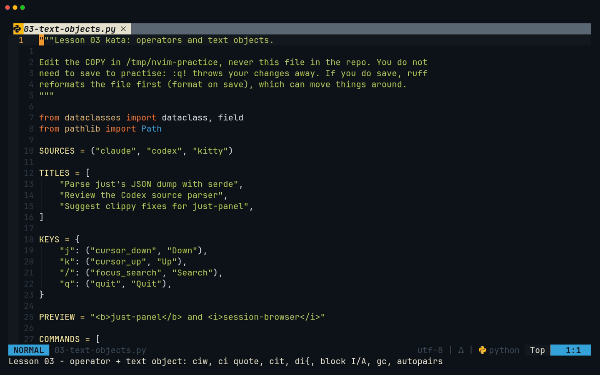
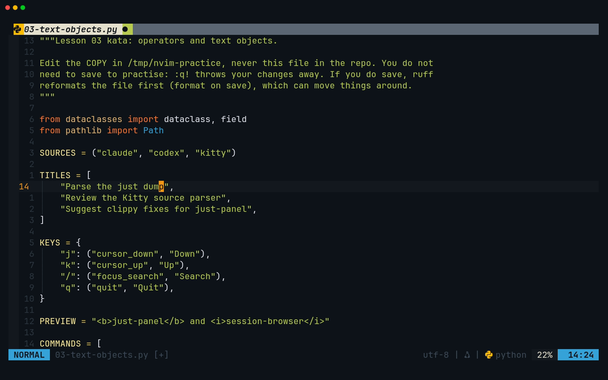
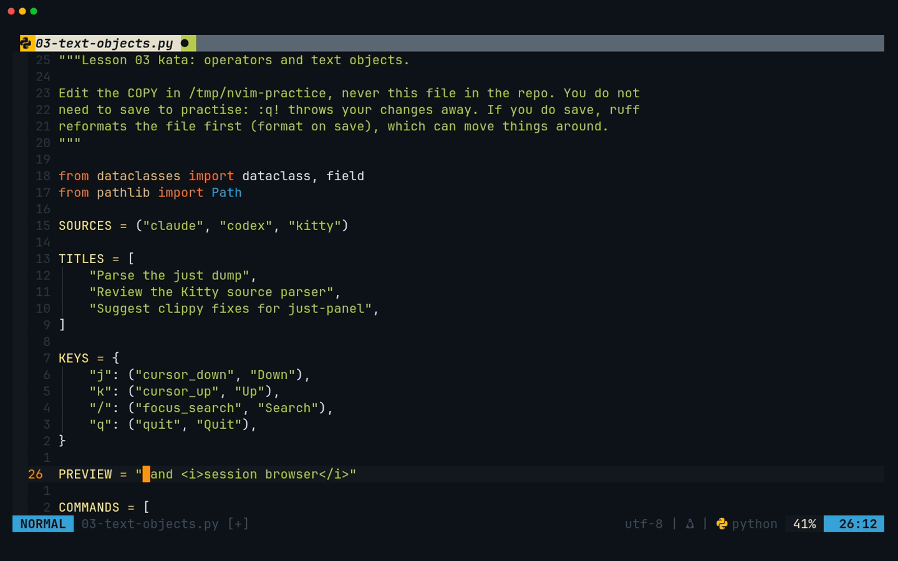
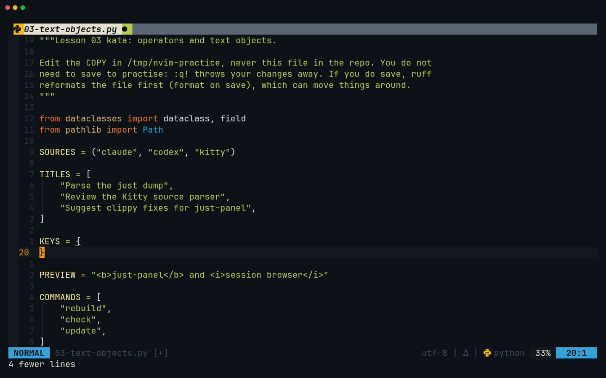
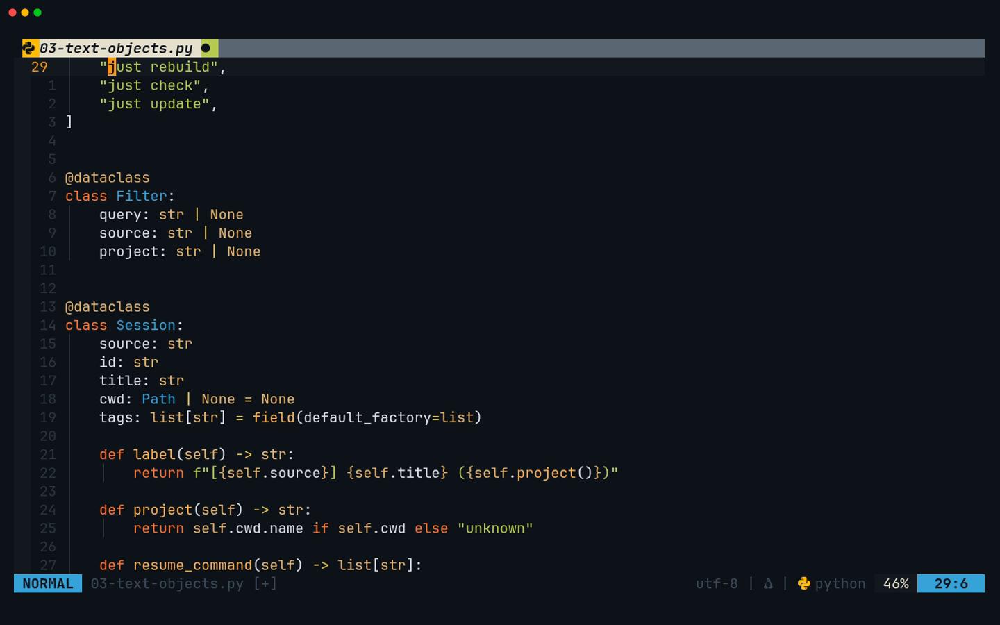
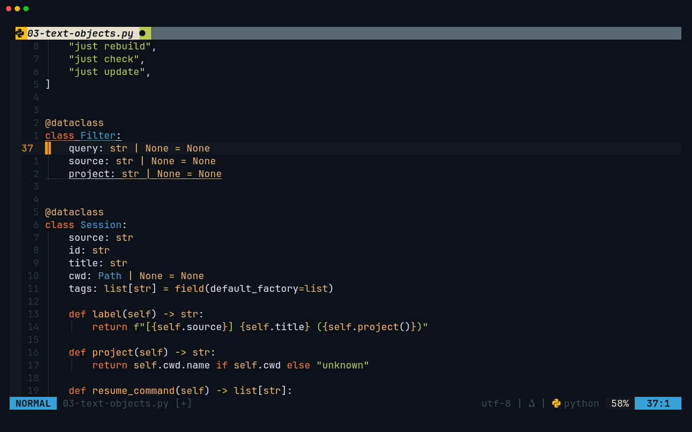
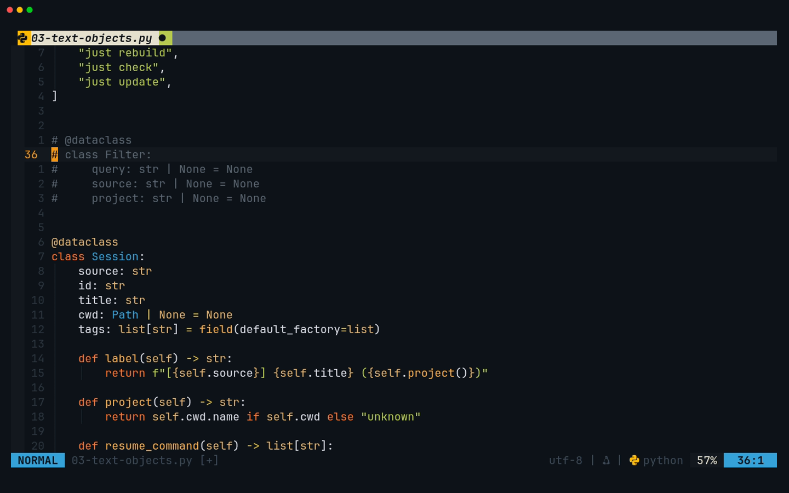
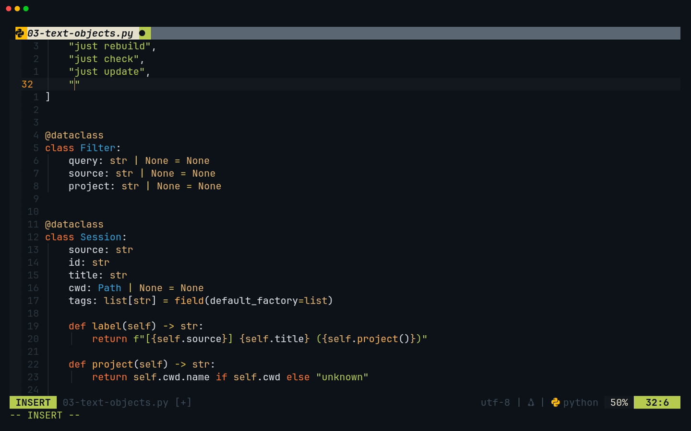

# Lesson 03 — Operators and text objects

**Last Updated**: 27/09/2026
**Version**: 1.0.0
**Maintained By**: Development Team
**Language**: British English (en_GB)
**Timezone**: Europe/London

---

This is the lesson where Neovim starts to feel faster than Zed. Operators such as `d`, `c` and `y` combine with
every motion from lesson 02, and with **text objects** such as `i"`, `a(`, `it` and `ip`. The result is commands
you can say out loud: "change inside quotes", "delete around brackets". Rust and Python code is mostly nested
brackets and strings, so every capstone edit from lesson 06 on uses them. The lesson also covers the two
plugins that change how typing feels in this config: Comment.nvim and nvim-autopairs. The kata is a small
Python file shaped like the session-browser models you will write in lesson 08.

**Part**: 1 — Neovim basics · **Time**: ~75 min · **Previous**: [Lesson 02 — Motions](02-MOTIONS.md) · **Next**: [Lesson 04 — Search, registers and macros](04-SEARCH-REGISTERS-MACROS.md)

## Objectives

By the end of this lesson you can:

- build commands from **operator + motion** (`dw`, `c$`, `y}`, `dt,`) and use the line forms (`dd` `cc` `yy`)
  and the shortcuts (`D` `C` `x` `r` `~` `J`);
- put text back with `p`/`P` and predict whether it lands on a new line or inside the current one;
- change case with `gu`/`gU` and indent with `>`/`<`/`=`;
- use the text objects `iw` `aw` `i"` `a"` `i(` `a(` `i{` `a{` `it` `at` `ip` with any operator, and from
  outside the object where Neovim allows it;
- select with `v`, `V` and `<C-v>`, and type into many lines at once with block `I` and `A`;
- comment code with Comment.nvim (`gcc`, `gc{motion}`, `gco`, `gcO`, `gcA`, `gbc`);
- predict what nvim-autopairs adds as you type;
- repeat any of these with `.`.

## Before you start

- You have finished [lesson 02](02-MOTIONS.md). The drills use `{N}G0` and `f`/`t` constantly.
- Open the Python kata from your copies (re-copy it first if you edited it before):

  ```bash
  # from ~/Repos/personal/nix-config
  mkdir -p /tmp/nvim-practice
  cp docs/NEOVIM-COURSE/practice/03-text-objects.py /tmp/nvim-practice/
  cd /tmp/nvim-practice
  nvim 03-text-objects.py
  ```

- Two language servers attach to Python files, pyright and ruff (neovim.nix:397-409). The kata passes both
  cleanly, so no diagnostic signs appear. If one does appear after an edit, the edit broke the Python. `u`
  takes it back.
- **Do not save this kata.** Saving runs ruff format (neovim.nix:953, 974-977), which may reflow your edits.
  You never need to save to practise: `:q!` and a fresh `cp` reset everything.
- Every `d`, `c`, `x` and `y` in this lesson also goes to your **system clipboard** (neovim.nix:257). Lesson 04
  explains why and how to avoid it. For now, do not keep anything precious on the clipboard while you practise.

## Keys in this lesson

| Keys | Mode | Action | Where it comes from |
| --- | --- | --- | --- |
| `d{motion}` / `dd` / `D` | Normal | delete over the motion / the line / to the end of the line | Neovim default |
| `c{motion}` / `cc` / `C` | Normal | delete and enter Insert mode (change) | Neovim default |
| `y{motion}` / `yy` / `Y` | Normal | yank (copy); `Y` = `y$` | Neovim default |
| `p` / `P` | Normal | put after / before the cursor (below / above for whole lines) | Neovim default |
| `x` / `r{c}` / `~` | Normal | delete a character / replace it with `{c}` / toggle its case | Neovim default |
| `J` / `gJ` | Normal | join the next line on (with / without a space) | Neovim default |
| `gu{motion}` / `gU{motion}` | Normal | lower / upper case (`guu`, `gUU` for the line) | Neovim default |
| `>{motion}` / `<{motion}` / `={motion}` | Normal | indent / dedent / re-indent (`>>`, `<<`, `==` for the line) | Neovim default |
| `iw` `aw` | after an operator, or in Visual | inner word / word plus its space | Neovim default |
| `i"` `a"` (also `i'` `a'`) | after an operator, or in Visual | inside / around a quoted string | Neovim default |
| `i(` `a(` (`ib` `ab`), `i[` `a[` | after an operator, or in Visual | inside / around brackets | Neovim default |
| `i{` `a{` (`iB` `aB`) | after an operator, or in Visual | inside / around braces | Neovim default |
| `it` `at` | after an operator, or in Visual | inside / around an XML/HTML tag element | Neovim default |
| `ip` `ap` | after an operator, or in Visual | paragraph / paragraph plus the blank line after it | Neovim default |
| `v` / `V` / `<C-v>` | Normal | Visual: characters / lines / a block | Neovim default |
| `o` / `gv` | Visual / Normal | jump to the other end of the selection / reselect the last selection | Neovim default |
| `I` / `A` | Visual block | insert before / append after the block on every line | Neovim default |
| `gcc` / `[count]gcc` | Normal | toggle a line comment on this line / on N lines | Comment.nvim default |
| `gc{motion}` / `gc` | Normal / Visual | toggle line comments over a motion / the selection | Comment.nvim default |
| `gbc` / `gb{motion}` / `gb` | Normal / Normal / Visual | toggle a **block** comment | Comment.nvim default |
| `gco` / `gcO` / `gcA` | Normal | add a comment below / above / at the end of the line, and Insert | Comment.nvim default |
| `gc` | after an operator | the comment block under the cursor (`dgc`) | Neovim default |
| `(` `[` `{` `"` `'` | Insert | also insert the closing character | nvim-autopairs default |
| `.` | Normal | repeat the last change, operator and text object included | Neovim default |

## Walkthrough

The whole lesson in one recording ([MP4](../media/03-operators-and-text-objects/03-operators-and-text-objects.mp4)):



### 1. The grammar: operator + motion

An operator waits for a motion and acts on everything the motion covers:

| Operator | Does | Doubled (whole line) | To the end of the line |
| --- | --- | --- | --- |
| `d` | delete | `dd` | `D` |
| `c` | delete, then Insert mode | `cc` | `C` |
| `y` | yank (copy) | `yy` | `Y` |

Any motion from lesson 02 fits: `dw` (to the next word), `d$`, `d}` (to the next blank line), `dt,` (up to the
next comma), `y%` (to the matching bracket). Counts multiply: `d2w` and `2dw` both delete two words, and `3dd`
deletes three lines.

**Try it (line 58, `return ["claude", "--resume", self.id]`).**

1. `58G0f"` puts the cursor on the first `"`. `dt,` deletes `"claude"`, leaving `return [, "--resume", self.id]`.
   `u`.
2. From the same place, `ct]` then type `self.id` and `<Esc>`: the line becomes `return [self.id]`. `u`.
3. `54G`, then `cc`: the whole line is replaced by an empty, correctly indented line in Insert mode. Type
   `return None`, `<Esc>`, `u`. (Typing quotes or brackets here would take several `u` presses to undo:
   Gotcha 2.)

> **Tip:** Pause after `d`, `c` or `y` and which-key lists the motions and text objects you can type next (its
> presets plugin). Typing at normal speed never shows it.

### 2. Putting text back: `p` and `P`

`p` puts the last deleted or yanked text **after** the cursor and `P` puts it **before**. What "after" means
depends on what you took. Whole lines (`dd`, `yy`, `dap`) go on new lines below or above. Anything smaller goes
inside the current line.

**Try it.**

- `11G`, `yyp`: `SOURCES = …` is duplicated on the line below. `u`.
- `20G`, `ddp`: the `"j"` and `"k"` lines swap. `u`.
- `11G0`, `xp`: `SOURCES` becomes `OSURCES`. `x` took the `S`, `p` put it after the `O`. `u`.

### 3. Small edits without Insert mode: `x` `r` `~` `J` `gu` `gU`

| Keys | Example (cursor on the first letter) | Result |
| --- | --- | --- |
| `x` | `SOURCES` | `OURCES` |
| `r-` | `lint_rust` (on the `_`) | `lint-rust` |
| `~~~` | `abc` | `ABC` (each `~` toggles one character and moves on) |
| `gUiw` | `source` | `SOURCE` |
| `guu` / `gUU` | `lint-rust` | the whole line lower / upper case |
| `J` / `gJ` | `TITLES = [` + next line | joined with a space / with the indentation kept |

**Try it.** `44G^gUiw` turns `source: str` into `SOURCE: str`. `u`. Then `13G` `J`: line 13 becomes
`TITLES = [ "Parse just's JSON dump with serde",`. `u`.

### 4. Text objects: `i` for inside, `a` for around

A text object is a thing, not a direction. `iw` is "this word", `i"` is "inside these quotes", `a(` is "these
brackets and what is in them". After an operator (or in Visual mode), the object is found **around the
cursor**, wherever the cursor is inside it:

| Object | `i…` covers | `a…` covers |
| --- | --- | --- |
| `w` | the word | the word plus the space after it |
| `"` `'` | the text between the quotes | the quotes too |
| `(` `)` `b` | inside the brackets | the brackets too |
| `[` `]` | inside the square brackets | the brackets too |
| `{` `}` `B` | inside the braces | the braces too |
| `t` | the text between `<tag>` and `</tag>` | the whole element, tags included |
| `p` | the paragraph (block of non-blank lines) | plus the blank lines after it |

For quotes and brackets, Neovim 0.12.5 also looks **forward on the current line** when the cursor is before
the object. `ci"` at the start of a line changes the first string on it, and `ci(` does the same for the
first bracket pair. Tags do not do this (Gotcha 7).

**Try it (words and quotes).**

1. `15G0fC` (onto `Codex`), `ciw`, type `Kitty`, `<Esc>`: `"Review the Kitty source parser",`.
2. `14G0` (the start of the line, before the string), `ci"`, type `Parse the just dump`, `<Esc>`. The whole
   title is replaced.
3. `vi"` on the same line selects the string without the quotes, so you can see what `i"` covers. `<Esc>`.
4. `daw` on a word removes it and one space. `diw` leaves the space behind.



**Try it (tags, line 26: `PREVIEW = "<b>just-panel</b> and <i>session-browser</i>"`).**

1. `26G0fi` puts the cursor on the `i` of `<i>`. `cit`, type `session browser`, `<Esc>`: only the text between
   `<i>` and `</i>` changes.
2. `0fj`, `dat`: the whole `<b>just-panel</b>` element goes. `u`.



**Try it (brackets and braces).**

1. `20G`, `di{`: the four `KEYS` entries vanish, leaving `KEYS = {` and `}`. `u`.
2. `51G0f(` puts the cursor on the `(` of `({self.project()})`. `di(` deletes `{self.project()}` and leaves `()`.
   `u`. `da(` deletes the brackets as well. `u`.
3. Nesting: `63G$h` puts the cursor on the `)` of the inner tuple `(s.source, s.title)`. `ci(`, type `s.title`,
   `<Esc>` changes only the inner pair. `u`. `c2i(` (a count selects the next pair **out**) changes everything
   inside `sorted( … )`.



**Try it (paragraphs).** `20G`, `yip` (the whole `KEYS = { … }` block), then `P`: the block appears twice. `u`.
`37G`, `dap`: the `Filter` class and both blank lines after it go (7 lines). `u`.

### 5. Visual mode: select first, then act

`v` selects characters, `V` whole lines and `<C-v>` a rectangular block. Extend the selection with any motion or
text object (`vi"`, `Vip`, `v3w`), then press an operator: `d`, `c`, `y`, `>`, `gU`, `gc`. In Visual mode `o`
jumps to the other end of the selection, and `gv` (in Normal mode) reselects the last one.

> **Gotcha:** In Visual mode, `p` **swaps**: it replaces the selection with what you yanked, and what it
> replaced becomes the new yank. Pasting the same text over a second selection then pastes the wrong thing.
> Visual `P` replaces without touching your yank. Use `P` when you paste one word over several.

**Block insert and append.** In block mode `I` types in front of the block on every line and `A` types after
it. The other lines fill in when you press `<Esc>`. `$` stretches a block to each line's own end, however long.

**Try it.**

1. `29G0f"l` (the `r` of `rebuild`), `<C-v>`, `2j` (three lines), `I`, type `just` and a space, `<Esc>`:
   `"just rebuild"`, `"just check"`, `"just update"`.
2. `37G0`, `<C-v>`, `2j`, `$`, `A`, type a space and `= None`, `<Esc>`: all three `Filter` fields get a
   default, although the lines have different lengths. A red `E` may flash beside the lower two for a moment:
   pyright checked the file while only the first line had its default, and the error clears when it rechecks.





> **Zed habit:** Where you would add a cursor per line in Zed, use `<C-v>` + `I`/`A`. For "the same edit on
> many matches", lesson 04's `cgn` + `.` and macros go further.

### 6. Indenting: `>` `<` `=`

`>>` and `<<` shift one line by `shiftwidth`. With a motion or text object they shift more: `>ip` shifts the
paragraph, and `>` in Visual mode shifts the selection. `=` re-indents instead of shifting. It asks the file
type's indent rules (here treesitter's, neovim.nix:613) where each line should be: `==` for one line, `=ip`
for a paragraph.

`shiftwidth` is 2 in this config (neovim.nix:218-219), but Neovim's Python file-type plugin sets 4 for `.py`
files (PEP 8). So `>>` moves four spaces in the kata and two in a `.txt` file.

**Try it.** `37G`, `>ip`: the whole `Filter` class moves right by 4. `u`. Then `44G`, `>>`, `j`, `.`: two fields
shifted, one key each. `u` `u`.

> **Tip:** In Python, indentation is syntax, so `=` can only guess. For real reformatting, the tool is ruff on
> save, which [lesson 11](11-COMPLETION-FORMATTING-DIAGNOSTICS.md) covers.

### 7. Comments with Comment.nvim

The config loads Comment.nvim with its defaults (neovim.nix:758). Its maps replace Neovim's built-in `gc` and
`gcc`, and it adds more:

| Keys | Result in the Python kata |
| --- | --- |
| `gcc` | `        return …` becomes `        # return …` (indentation kept); `gcc` again removes it |
| `3gcc` | three lines, from the cursor down |
| `gc2j` / `gcip` | the lines a motion or text object covers |
| `V` … `gc` | the selected lines |
| `gco` / `gcO` | a new `# ` line below / above in Insert mode, indented by the file type's indent rules (Comment.nvim runs `==` on it) |
| `gcA` | two spaces and `# ` appended to the end of the line (PEP 8 style), in Insert mode |
| `gbc` | a **block** comment. Python has none, so Comment.nvim says `python doesn't support block comments!`; in Rust `gbc` gives `/* let x = 1; */` |
| `dgc` | Neovim's own text object: deletes the whole comment block under the cursor |

**Try it.**

1. `36G`, `gcip`: the `@dataclass` and `class Filter` block is commented, five `# ` lines. `u`.
2. `54G`, `gcc`, then `gcc` again: on, then off.
3. `57G`, `3gcc`: the three lines of the `if`/`return`/`return` body. `u`.
4. `53G`, `gco`, type `show the project path`, `<Esc>`: a comment line inside `project()`. `u`.
5. `37G`, `gcc`, then `j` and `.`: two `Filter` fields commented with one command and one dot. `u` `u`.



### 8. nvim-autopairs: closers appear as you type

nvim-autopairs runs with its defaults (neovim.nix:764). In Insert mode:

| You type | You get | Why |
| --- | --- | --- |
| `(` | `()` with the cursor inside | the pair is inserted |
| `"` in Python | `""` | quotes pair too, `'` as well |
| `)` or `"` when the same character is already next | the cursor steps over it | no doubled closer |
| `<BS>` between an empty pair | both characters go | `map_bs` default |
| `<CR>` between `{}`, `[]` or `()` | the closer moves to its own line | `map_cr` default |
| `(` or `"` right before a letter or digit | just `(` or `"` | no pair when the next character is a word character |
| `let recipes = vec![` at the end of a line | `let recipes = vec![]` | the `[` pairs. Lesson 04's kata supplies this line for you, and its macros run with autopairs off |

**Try it.** `31G`, `o`, then `"`: you see `""` with the cursor between. Type `lint`, then `"` (it steps over the
closing quote) and `,`, then `<Esc>`. The new line reads `"lint",`, with no doubled quote.



### 9. `.` repeats operators too

`.` replays the whole last change: operator, motion or text object, and anything typed after `c`. That makes
"do it once, then move and `.`" the habit for repeated edits. `gcc` `j` `.`, `>>` `j` `.` and `ciwKitty<Esc>`
then `w` `.` all work. [Lesson 04](04-SEARCH-REGISTERS-MACROS.md) adds `cgn`, which makes `.` jump to the next
search match by itself.

## Gotchas in this config

1. **Comment.nvim, not the built-in commenting** (neovim.nix:758). `gcc` and `gc` are Comment.nvim's. The
   built-in `gc` text object (`dgc`) still works. `gbc` needs a language with block comments: Python prints
   `python doesn't support block comments!`, while Rust gives `/* … */`. Plain `.txt` files have no comment
   syntax at all, so `gcc` fails there with a `[Comment.nvim]` warning. Markdown gets `<!-- … -->`.
2. **Autopairs types for you** (neovim.nix:764). Watch for the closer it adds. In a visual-block append,
   `$A(` gives `()` on **every** line. It also splits undo: each pair it adds starts a new undo step, so after
   `cc` and typing `return "?"`, one `u` leaves `return ""` and it takes three to get the line back. It is
   switched off while a macro records or runs (lesson 04). It is not wired to completion either, so autopairs
   adds nothing when you accept an item from the completion menu: a Python function arrives without brackets
   (lesson 11).
3. **Every delete and yank hits the system clipboard** (`clipboard=unnamedplus`, neovim.nix:257). `x`, `dd`,
   `ciw` and `yy` all overwrite what you copied in the browser, and `p` pastes the clipboard. Lesson 04 covers
   `"0`, `"_` and named registers.
4. **Visual `p` swaps your yank.** After `viwp` the replaced word is what `p` pastes next. Visual `P` keeps
   your yank.
5. **Indent width depends on the file type.** 2 spaces by default (neovim.nix:218-219), 4 in Python (Neovim's
   Python file-type plugin), so `>>` differs between files.
6. **Saving rewrites Python** (ruff format, neovim.nix:953 and 974-977). The kata is ruff-clean, so a plain save
   of an unchanged file changes nothing, but after edits ruff may reflow lines. Use `:q!` to leave, or
   `:noautocmd w` to save without formatting.
7. **`it`/`at` do not look ahead.** `ci"` and `ci(` find the next pair on the line when the cursor is before it.
   `cit` does not, and fails unless the cursor is inside the element or on one of its tags.

## Drills

Start each drill from a fresh copy (`cp …/practice/03-text-objects.py /tmp/nvim-practice/`) or `u` back to
the original. Every answer was checked on this file.

1. Line 16 is `"Suggest clippy fixes for just-panel",`. Change `clippy` to `rustfmt` with one command, starting
   from `16G0`.

   <details><summary>Answer</summary>

   `fc` (onto `clippy`), then `ciwrustfmt<Esc>`. `cw` works too from the start of the word. `ciw` works from
   anywhere inside it.
   </details>

2. Replace the whole title on line 15 without moving to the string first.

   <details><summary>Answer</summary>

   `15G0`, then `ci"` and type the new title, `<Esc>`. From before the string, `i"` finds the first quoted
   string on the line. The `0` matters: `15G` alone keeps your column, which can be past the closing quote,
   where `ci"` finds nothing.
   </details>

3. On line 58, `return ["claude", "--resume", self.id]`, turn the list into `["claude", "--continue"]` with one
   text-object change.

   <details><summary>Answer</summary>

   `58G0f[`, then `ci[` and type `"claude", "--continue"`, `<Esc>`. While typing, autopairs adds each closing
   `"`, and typing `"` steps over it, so the result has no doubled quotes.
   </details>

4. Empty the `KEYS` dictionary but keep `KEYS = {` and `}`. Then delete the whole assignment, braces included.

   <details><summary>Answer</summary>

   `20G`, `di{`. For the whole thing: `u`, then `20G`, `da{` leaves `KEYS = ` (the text before the brace is not
   part of the object). `dap` on line 19 would delete the whole paragraph instead.
   </details>

5. Give every `COMMANDS` entry (lines 29-31) a `just ` prefix inside the quotes, in one edit.

   <details><summary>Answer</summary>

   `29G0f"l`, `<C-v>`, `2j`, `Ijust <Esc>`. The block starts on the first letter inside the quotes, so `I`
   inserts there on all three lines.
   </details>

6. Comment out the whole `resume_command` method (lines 56-59) with one command, then undo it.

   <details><summary>Answer</summary>

   `56G`, `gcip`. The method is a paragraph, so this comments lines 56-59. (`gc3j` from line 56 does the same.)
   `u`.
   </details>

7. On line 63, change only the sort key tuple `(s.source, s.title)` to `(s.title)`. Then show how to change
   **all** of `sorted`'s arguments instead.

   <details><summary>Answer</summary>

   `63G$h` puts the cursor on the tuple's `)`, then `ci(` `s.title` `<Esc>`. For all the arguments, `c2i(`: the
   count selects the next bracket pair out.
   </details>

8. You yanked the word `claude` and want to paste it over `codex` **and** over `kitty` on line 11. Which paste
   key keeps working for the second word, and why?

   <details><summary>Answer</summary>

   Visual `P`. From `11G0fc` (on `claude`): `yiw`, `;` (onto `codex`), `viwP`, `fk`, `viwP` gives
   `("claude", "claude", "claude")`. With visual `p` the first paste puts `codex` into the unnamed register,
   so the second one inserts `codex`: `("claude", "claude", "codex")`.
   </details>

## Recap

- Operator + motion: `d` `c` `y` with any motion. Doubled for the line (`dd` `cc` `yy`), capital for "to the end"
  (`D` `C` `Y`).
- `p`/`P` put after/before, and whole lines land on their own lines.
- Text objects (`iw` `i"` `i(` `i{` `it` `ip` and their `a` forms) act on the thing around the cursor. Quotes
  and brackets are also found ahead on the line.
- `v` `V` `<C-v>` select first. Block `I`/`A` edit many lines at once, and `$` handles ragged ends.
- `>` `<` `=` indent. The width is 2, or 4 in Python.
- Comment.nvim: `gcc`, `gc{motion}`, `gco`/`gcO`/`gcA`; `gbc` only where the language has block comments.
- Autopairs adds closers; typing the closer steps over it.
- `.` repeats the whole change.

Next, [lesson 04](04-SEARCH-REGISTERS-MACROS.md) turns single edits into many: search and replace across a file,
registers you choose, and macros that transform a list of recipe names into Rust.

## Recording

- **Tape:** [`tapes/03-operators-and-text-objects.tape`](../tapes/03-operators-and-text-objects.tape). Run it
  from `docs/NEOVIM-COURSE/` with `vhs tapes/03-operators-and-text-objects.tape`.
- **Fixture:** `fixtures/03-operators-and-text-objects/03-text-objects.py`, an exact copy of
  `practice/03-text-objects.py`. Keep the two identical. The fixture must stay clean under `ruff check`,
  `ruff format --check` and pyright, because pyright and ruff attach during the recording and any diagnostic
  sign would show up. The tape waits 3 s after opening for them to settle, and never saves.
- **Outputs** in `media/03-operators-and-text-objects/`: `03-operators-and-text-objects.gif`,
  `03-operators-and-text-objects.mp4` and:

  | Screenshot | Shows |
  | --- | --- |
  | `ciw-ci-quote.png` | line 15 after `ciw` (`Kitty`) and line 14 after `ci"` from before the string |
  | `tags.png` | line 26 after `cit` on the `<i>` element and `dat` on the `<b>` element |
  | `di-brace.png` | `KEYS = {` and `}` after `di{` |
  | `block-insert.png` | `"just rebuild"`, `"just check"`, `"just update"` after block `I` |
  | `block-append.png` | the three `Filter` fields after block `$A` ` = None` |
  | `gcip.png` | the `Filter` class commented by `gcip` |
  | `autopairs.png` | `""` with the cursor between, straight after typing one `"` |

- **Manual steps:** none, but recording **replaces your system clipboard** with fixture text, because `c` and `d`
  write to it (`clipboard=unnamedplus`). Copy anything you need somewhere safe first. The tape never presses `"`
  in Normal or Visual mode, `<C-r>` or `:reg`, so which-key's register list, which would show your clipboard,
  never appears. It points `CLAUDE_CONFIG_DIR` at a throwaway folder, so claudecode.nvim's lock file never lands
  in your real `~/.claude/ide`.
- **VHS version:** `vhs --version` must print 0.12.1, which the config builds (0.12.0 exits 0 and writes nothing);
  if it prints 0.12.0, `just rebuild` first ([Appendix B](../appendices/B-RECORDING-WITH-VHS.md#first-make-sure-vhs-is-0121)).
- **Check after every run:** `media/03-operators-and-text-objects/` actually contains
  `03-operators-and-text-objects.gif`, `03-operators-and-text-objects.mp4` and all seven PNGs above, and no
  diagnostic sign appears in the sign column of any frame.
