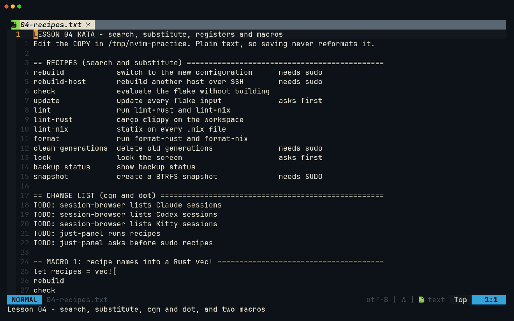
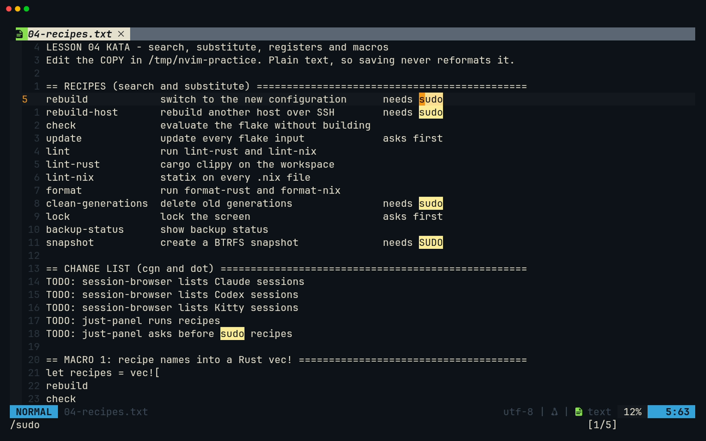
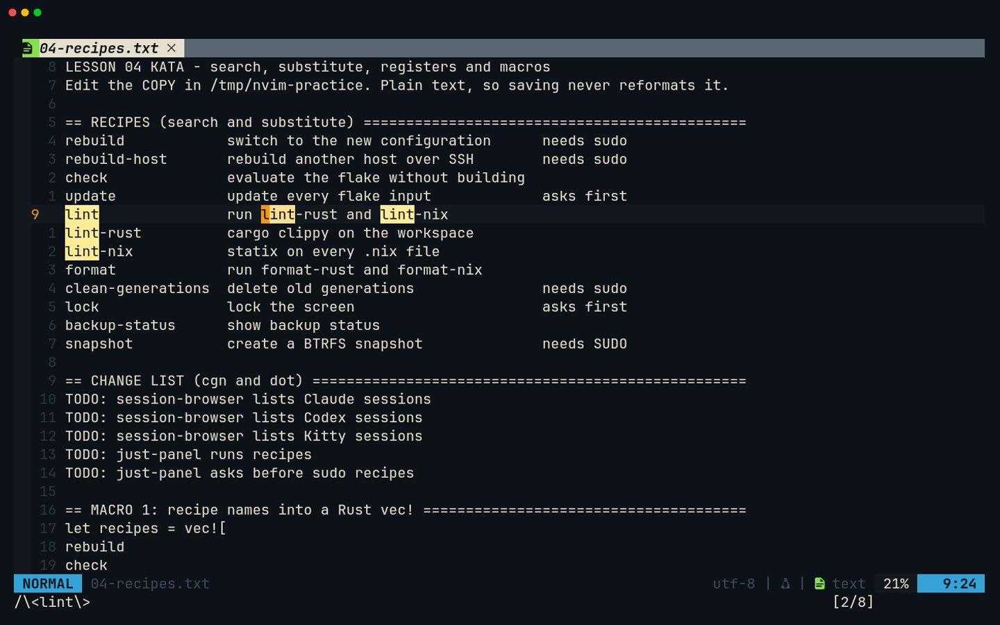
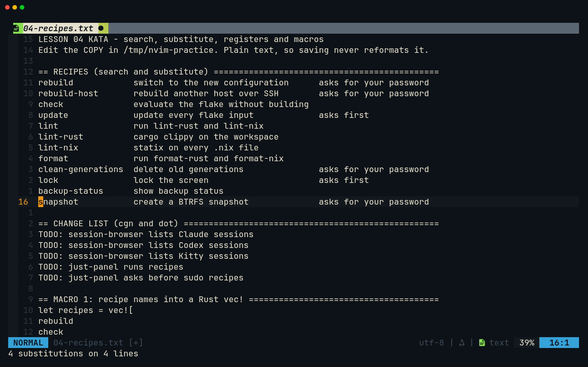
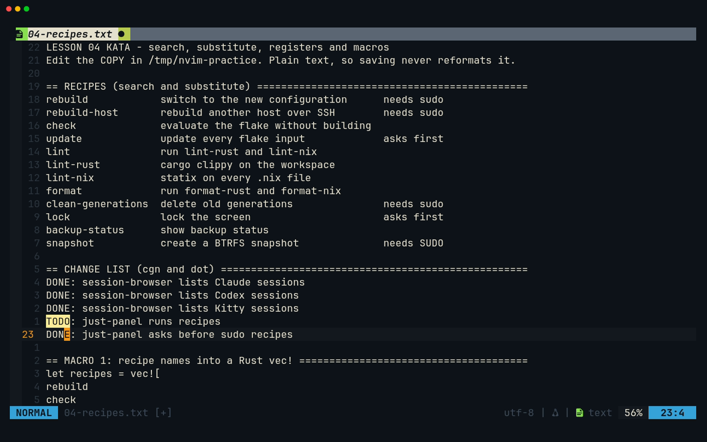
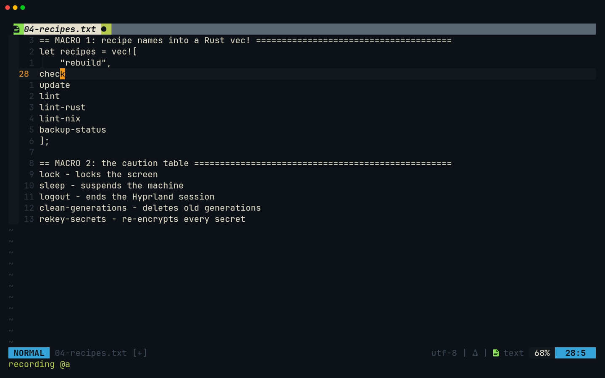
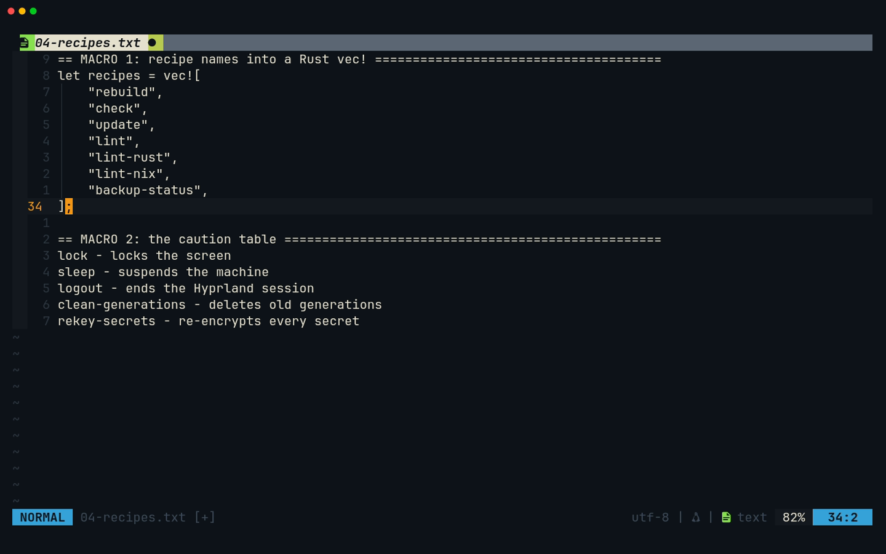
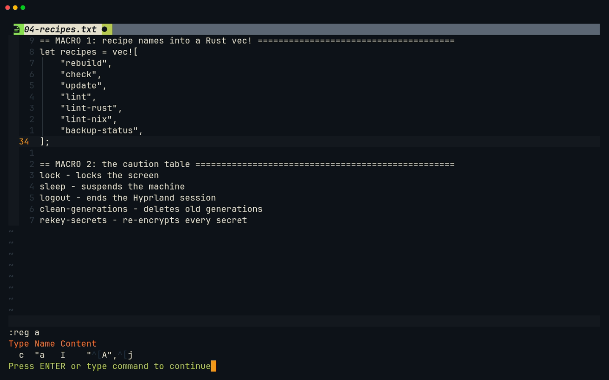
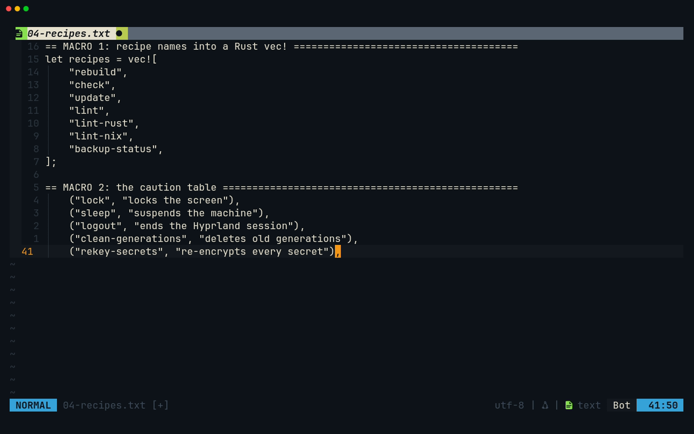

# Lesson 04 — Search, registers and macros

**Last Updated**: 27/09/2026
**Version**: 1.0.0
**Maintained By**: Development Team
**Language**: British English (en_GB)
**Timezone**: Europe/London

---

Search is the fastest motion there is, and `:s` and `cgn` turn one edit into fifty. Macros record any sequence of
keys and replay it as a small program. This lesson ends with two macros. One turns a list of recipe names into
Rust `vec![…]` entries. The other builds a table shaped exactly like the caution table just-panel gets in
[lesson 16](16-JUST-PANEL-RUNNING-RECIPES.md). On the way, registers explain where every yank and delete
actually goes. In this config that includes your system clipboard, which matters more than it sounds.

**Part**: 1 — Neovim basics · **Time**: ~75 min · **Previous**: [Lesson 03 — Operators and text objects](03-OPERATORS-AND-TEXT-OBJECTS.md) · **Next**: [Lesson 05 — Your keybindings](05-YOUR-KEYBINDINGS.md)

## Objectives

By the end of this lesson you can:

- search with `/` `?` `n` `N` `*` `#`, predict how case is matched (`ignorecase` + `smartcase`), and clear the
  highlight with `<leader>h`;
- substitute with `:s` using ranges and the `g` `c` `i` `I` `n` flags, and match whole words with `\<…\>`;
- change matches one at a time with `cgn` and `.`, skipping the ones you want to keep;
- run a command on every matching line with `:g` and `:v`;
- choose a register (`"a`, `"A`, `"0`, `"_`, `"+`), read them with `:reg`, and explain what
  `clipboard=unnamedplus` does to every yank and delete;
- record, replay and repeat macros (`qa` … `q`, `@a`, `@@`, `6@a`, `:normal @a` over a range).

## Before you start

- You have finished [lesson 03](03-OPERATORS-AND-TEXT-OBJECTS.md).
- Open the kata from a fresh copy:

  ```bash
  # from ~/Repos/personal/nix-config
  mkdir -p /tmp/nvim-practice
  cp docs/NEOVIM-COURSE/practice/04-recipes.txt /tmp/nvim-practice/
  cd /tmp/nvim-practice
  nvim 04-recipes.txt
  ```

- It is plain text, so saving it never reformats anything. The line numbers in this lesson refer to the fresh
  copy. After the macros, `cp` it again.
- If a password or anything private is on your clipboard, clear it first (copy something harmless). This lesson
  shows your registers on screen, and one of them **is** the clipboard (section 7).

## Keys in this lesson

On first use: `<leader>` is **Space** (neovim.nix:210), so `<leader>h` is Space then `h`.

| Keys | Mode | Action | Where it comes from |
| --- | --- | --- | --- |
| `/{pattern}<CR>` / `?{pattern}<CR>` | Normal | search forward / backward | Neovim default |
| `n` / `N` | Normal | next match in the same / opposite direction | Neovim default |
| `*` / `#` | Normal | search forward / backward for the whole word under the cursor | Neovim default |
| `<leader>h` | Normal | clear the search highlight (`:nohlsearch`) | config (neovim.nix:66) |
| `<C-l>` | Normal | move to the window on the right, **not** clear the highlight | config (neovim.nix:71) |
| `:[range]s/{pat}/{rep}/[flags]` | Command-line | substitute | Neovim default |
| `gn` / `cgn` / `dgn` | Normal | select / change / delete the next match | Neovim default |
| `:[range]g/{pat}/{cmd}` / `:v/{pat}/{cmd}` | Command-line | run `{cmd}` on lines that match / do not match | Neovim default |
| `"{reg}` + a command | Normal | use register `{reg}`: `"ayy`, `"ap`, `"_dd`, `"0p` | Neovim default |
| `"` on its own | Normal, Visual | a list of every register, shown at once, **clipboard included** | which-key default (registers plugin) |
| `<C-r>{reg}` | Insert, Command-line | insert a register's contents (which-key lists them too) | Neovim default |
| `:reg {names}` | Command-line | show registers, e.g. `:reg a` | Neovim default |
| `q{a-z}` … `q` | Normal | record a macro into a register / stop recording | Neovim default |
| `@{a-z}` / `@@` / `{N}@a` | Normal | run a macro / run the last one again / run it N times | Neovim default |
| `:[range]normal @a` | Command-line | run macro `a` once on every line of the range | Neovim default |

## Walkthrough

The whole lesson in one recording ([MP4](../media/04-search-registers-macros/04-search-registers-macros.mp4)):



### 1. Searching: `/` `?` `n` `N`, and how case is matched

`/sudo` then `<CR>` jumps to the next `sudo`. `?` searches backwards. `n` repeats the search in the same direction
and `N` in the other. Three options in the config shape how it feels (neovim.nix:227-230):

- `incsearch`: matches light up **while you type** the pattern;
- `hlsearch`: they stay lit after `<CR>`, until you clear them;
- `ignorecase` + `smartcase`: an all-lower-case pattern ignores case, and a pattern with any capital letter
  matches case exactly. `\c` anywhere in the pattern forces "ignore case" and `\C` forces "exact case".

The bottom right shows where you are, e.g. `[2/5]`. At the end of the file the search wraps to the top, and the
counter says so with a `W` in front: `W [1/5]`.

**Try it.**

1. `/sudo` `<CR>`: five matches light up. Three are `needs sudo`, one is `needs SUDO` on line 16 (lower-case
   pattern, so case is ignored) and one is `before sudo recipes` on line 23.
2. `n` `n` `n`, then `N`.
3. `/SUDO` `<CR>` finds only line 16. `/\Csudo` finds the four lower-case ones.



### 2. Clearing the highlight: `<leader>h`, not `<C-l>`

Highlights stay until you clear them. Press `<leader>h` (Space, then `h`) for `:nohlsearch` (neovim.nix:66). The
next `n` or search lights them up again.

In stock Neovim, `<C-l>` clears the highlight and redraws. This config uses `<C-l>` for "window right"
(neovim.nix:71) like `<C-h>`/`<C-j>`/`<C-k>`, so it no longer clears anything (Gotcha 1). `:noh` `<CR>` also
works.

**Try it.** Press Space then `h`: the highlights go. `n`: they come back.

### 3. `*` and `#`: the word under the cursor

`*` searches forward for the word under the cursor, wrapped in word boundaries (`\<lint\>`). `#` searches
backwards. They follow `ignorecase` but **not** `smartcase`, so `*` on `Session` also finds `session`.

The word boundaries use the same definition of "word" as `w` (lesson 02), and `-` is not part of a word. So
`*` on the recipe `lint` also stops inside `lint-rust` and `lint-nix`.

**Try it.** `9G0` then `*`. The cursor jumps along line 9 to the `lint` inside `lint-rust`, and the counter reads
`[2/8]`: eight matches on six lines. To find only the recipe named `lint`, anchor it instead: `/^lint ` (line
start, `lint`, a space) has exactly one match. Then press Space `h`.



### 4. Substitute: `:s`

`:s/{pattern}/{replacement}/{flags}` replaces on the current line. Put a **range** in front for more lines:

| Range | Lines |
| --- | --- |
| (none) | the cursor line |
| `%` | the whole file |
| `5,16` | lines 5 to 16 |
| `'<,'>` | the last Visual selection (typing `:` in Visual mode fills this in) |

| Flag | Meaning |
| --- | --- |
| (none) | only the first match on each line |
| `g` | every match on each line |
| `c` | confirm each one: `y` yes, `n` no, `a` all, `q` quit, `l` this one and stop |
| `i` / `I` | ignore case / match case exactly, whatever `smartcase` says |
| `n` | change nothing, just count the matches |

The pattern follows `ignorecase` + `smartcase` like `/` does. `\<` and `\>` mark word boundaries.

**Try it.**

1. `:%s/sudo//gn` `<CR>` reports `5 matches on 5 lines` and changes nothing.
2. `:%s/needs sudo/asks for your password/` `<CR>` reports `4 substitutions on 4 lines`: the lower-case pattern
   also caught `needs SUDO`. `u` undoes the lot in one step.
3. `:5,16s/asks first/asks before running/gc` `<CR>`, then `y` for each of the two prompts.



> **Gotcha:** `:%s/\<lint\>/check/g` also rewrites `lint-rust` to `check-rust`, because `-` ends a word. When a
> name contains hyphens, anchor on what surrounds it instead (`^lint `, `lint:`).

### 5. `cgn` and `.`: change matches one by one

`gn` selects the next match of the last search, so `cgn` changes it. Because `cgn` is a single change, `.`
repeats it on the next match. `n` moves the cursor **onto** the next match, and `.` then changes that one. To
skip a match, press `n` twice.

**Try it (lines 19-23).**

1. `/TODO` `<CR>` (the first match is line 19).
2. `cgn`, type `DONE`, `<Esc>`. Line 19 now starts `DONE:`.
3. `.` `.` changes lines 20 and 21.
4. Keep line 22 as `TODO`: `n` (onto line 22), `n` (onto line 23), then `.`. Line 23 becomes `DONE:`.
5. Space `h` to clear the highlight.



> **Why:** compared with `:s///gc`, `cgn` shows you each match in context before you decide, and you can move
> around between presses.

### 6. `:g`: a command on every matching line

`:g/{pattern}/{command}` runs an Ex command on every line that matches. `:v` (or `:g!`) runs it on every line
that does **not** match. `d` deletes, and `normal {keys}` runs Normal-mode keys on each line.

**Try it.**

1. `:5,16g/asks first/normal A - confirm` `<CR>` appends ` - confirm` to lines 8 and 14. One `u` undoes both.
2. `:5,16v/sudo/d` `<CR>` keeps only the four sudo recipes in the table. `u`.

> **Tip:** `:normal` is not a macro, so nvim-autopairs is active inside it. `normal A (confirm)` still gives the
> right text, but autopairs splits the change into several undo steps, and one `u` leaves `()` behind. Keep
> bracket-free text in `:g … normal`, or press `u` until the line is clean.

> **Gotcha:** without a range, `:g` covers the whole file. `:g/^lint/d` deletes six lines: the three in the recipe
> table **and** `lint`, `lint-rust` and `lint-nix` in the macro section.

### 7. Registers, and your system clipboard

Every `y`, `d`, `c`, `x` and `s` stores text in a **register**, and `p` puts one back. Put `"` and a register name
in front of a command to choose which one: `"ayy` yanks the line into `a`, and `"ap` puts it.

| Register | Holds |
| --- | --- |
| `""` (unnamed) | what `p` uses. With this config it is the same as `"+`, the system clipboard |
| `"0` | your last **yank**. Deletes do not touch it |
| `"1` … `"9` | your last deletes of a line or more. Each new one pushes the others down |
| `"-` | your last small delete (within one line) |
| `"a` … `"z` | yours to name. `"A` … `"Z` **append** to the same register |
| `"+` / `"*` | the system clipboard / the primary selection |
| `"_` | the black hole: whatever goes in is gone, and no other register changes |
| `"/` | the last search pattern |
| `".` `":` `"%` | read-only: the last inserted text, the last command line, the file's name |

The config sets `clipboard=unnamedplus` (neovim.nix:257), with `wl-clipboard` and `xclip` on Neovim's `PATH`
(neovim.nix:197-198). Everything that normally goes to the unnamed register goes to the **system clipboard**
too:

- every `yy`, `dd`, `ciw`, and even a single `x`, replaces what you last copied in the browser or Zed;
- `p` pastes whatever is on the system clipboard, so text copied elsewhere pastes straight in;
- `"0p` still pastes your last yank after deletes have replaced the clipboard;
- `"_d`, `"_x` and `"_c` delete **without** touching the clipboard or any other register;
- a named register (`"ayy`) leaves the clipboard alone.

**Try it.**

1. `5G` `"ayy`, then `16G` `"Ayy` (capital: append). `34G` `"ap` puts both lines below `];`. `:reg a` `<CR>`
   shows the register. `u`.
2. `5G` `yy` (yank the `rebuild` line), `7G` `dd` (delete `check`). Now `p` puts the **deleted** `check` line
   and `"0p` puts the **yanked** `rebuild` line. `u` `u` `u`.
3. `15G` `"_dd` deletes `backup-status`. `p` then puts whatever was on the clipboard before, because the
   black hole left it alone. `u` `u`.

Typing `"` in Normal mode makes which-key open a list of **all** registers with their contents, straight
away (its registers plugin has no delay). `<C-r>` in Insert or Command-line mode does the same. That list
includes `"+` and `"*`, which means whatever is on your clipboard (Gotcha 5). Press the register's name to
continue, or `<Esc>`.

### 8. Macros: record keys, replay them

`qa` starts recording into register `a`, and the bottom line shows `recording @a`. Every key you press is
recorded until you press `q` again. `@a` replays it, `@@` replays the last macro again, and `6@a` runs it six
times. A macro stops at the first command that fails, such as `j` on the last line of the file.

Two habits make macros reliable:

- **Start from a known place.** `0`, `^`, `I` and `A` behave the same whatever the column.
- **End on the next item.** Finish with `j`, so the macro can be repeated straight away.

nvim-autopairs is switched off while a macro records or runs (its `disable_in_macro` default), so quotes and
brackets are recorded exactly as you type them.

**Macro 1: recipe names into a Rust `vec!` (lines 26-34).** Lines 27-33 hold seven bare recipe names between
`let recipes = vec![` and `];`.

1. `27G0` puts the cursor on `rebuild`.
2. `qa`. Check that `recording @a` appears.
3. `I` + four spaces + `"`, `<Esc>`: the line reads `    "rebuild`.
4. `A` + `",`, `<Esc>`: `    "rebuild",`.
5. `j`, then `q` to stop recording.
6. Six names are left: `6@a`.





```rust
let recipes = vec![
    "rebuild",
    "check",
    "update",
    "lint",
    "lint-rust",
    "lint-nix",
    "backup-status",
];
```

A macro is just text in a register. `:reg a` `<CR>` shows `I    "^[A",^[j`, where `^[` is `<Esc>`.



> **Tip:** Instead of a count, give the macro a range. Select lines 28-33 with `V`, type `:normal @a` (Neovim
> fills in `'<,'>`) and `<CR>`. Or type `:28,33normal @a` `<CR>`. The macro runs once per line and cannot run past
> the range.

**Macro 2: the caution table (lines 37-41).** Each line reads `name - reason`, and the goal is
`    ("name", "reason"),`: the shape of just-panel's `CAUTION` table in
[lesson 16](16-JUST-PANEL-RUNNING-RECIPES.md).

1. `37G0`, then `qb`.
2. `0i` + four spaces + `("`, `<Esc>`: `    ("lock - locks the screen`.
3. `f` + Space: onto the next space after the cursor, the one straight after the name (names have no
   spaces, and the cursor is already past the four you typed).
4. `3s` replaces three characters (` - `) and enters Insert mode. Type `", "`, `<Esc>`.
5. `A` + `"),`, `<Esc>`, then `j`, then `q`.
6. `4@b` for the other four lines.



```rust
    ("lock", "locks the screen"),
    ("sleep", "suspends the machine"),
    ("logout", "ends the Hyprland session"),
    ("clean-generations", "deletes old generations"),
    ("rekey-secrets", "re-encrypts every secret"),
```

> **Tip:** To fix a macro, edit it as text. Open a scratch line with `o<Esc>`, put the macro there with `"ap`,
> correct the keys, then yank the line back into the register with `0"ay$` and delete the scratch line with
> `"_dd`.

## Gotchas in this config

1. **`<C-l>` no longer clears the search highlight.** The config maps it to "window right" (neovim.nix:71). Use
   `<leader>h` (neovim.nix:66) or `:noh`.
2. **`smartcase` surprises.** A lower-case pattern also matches upper case (`/needs sudo` hits `needs SUDO`).
   `*` and `#` ignore `smartcase` altogether. Force exact case with `\C` or the `I` flag.
3. **`-` ends a word.** `*`, `\<lint\>` and `:s/\<lint\>/…/` all match inside `lint-rust`. Anchor on the
   surroundings (`^lint `) for hyphenated names.
4. **Every yank and delete is on your system clipboard** (`clipboard=unnamedplus`, neovim.nix:257). A stray `x`
   replaces the URL you just copied. Use `"0p` for your last yank, `"_d` to delete without touching anything,
   and named registers for things you want to keep.
5. **Registers show your clipboard.** Pressing `"` (Normal, Visual) or `<C-r>` (Insert, Command-line) makes
   which-key list every register at once, `"+` and `"*` included, and so does a bare `:reg`. Mind this when
   sharing your screen or recording. `:reg a` shows just one register.
6. **Visual `p` swaps your register** ([lesson 03](03-OPERATORS-AND-TEXT-OBJECTS.md)). Visual `P` does not.
7. **Autopairs is off in macros but on when you type.** A macro records `"` as one `"`, but typing
   `let recipes = vec![` by hand gives `vec![]`, because nvim-autopairs adds the `]` (neovim.nix:764). That is why
   the kata supplies the `vec![` and `];` lines.
8. **A big count does not know where your list ends.** A macro only stops when a command fails, so `100@a` on
   Macro 1 would carry on through `];`, the blank line and Macro 2's lines, to the end of the file. Use the exact
   count or a range (`:28,33normal @a`).
9. **`cgn` then `n` does not skip.** `n` moves onto the next match, and `.` changes the match under the cursor.
   Press `n` twice to skip one.

## Drills

Use a fresh copy of `04-recipes.txt` for each drill. Every answer was checked on this file.

1. How many lines mention sudo in any case? How many in lower case only? Change nothing.

   <details><summary>Answer</summary>

   `:%s/sudo//gn` gives `5 matches on 5 lines`. `:%s/\Csudo//gn` gives 4 (the one missing is `SUDO` on line 16).
   </details>

2. With the cursor at the start of line 9 (`lint`), you press `*`. Where does the cursor go, and how many matches
   are there? Then find the `lint` recipe line and nothing else.

   <details><summary>Answer</summary>

   It stays on line 9 and jumps to the `lint` inside `lint-rust` (`[2/8]`). `*` searches `\<lint\>`, and `-` is not
   a word character, so there are 8 matches on 6 lines. `/^lint ` matches only line 9.
   </details>

3. In the change list, turn `session-browser` into `session browser` on lines 19 and 21 but not on line 20.

   <details><summary>Answer</summary>

   `gg`, `/session-browser` `<CR>` (line 19), `cgn` `session browser` `<Esc>`, then `n` (line 20), `n` (line 21),
   `.`.
   </details>

4. Collect the `rebuild` and `snapshot` lines (5 and 16) in one register, and paste both below `];` (line 34).

   <details><summary>Answer</summary>

   `5G` `"ayy`, `16G` `"Ayy` (capital appends), `34G` `"ap`.
   </details>

5. You press `yy` on line 5, then `dd` on line 7. What do `p` and `"0p` each put?

   <details><summary>Answer</summary>

   `p` puts the deleted `check …` line (the delete replaced the unnamed register, which is also your clipboard).
   `"0p` puts the yanked `rebuild …` line, because register `0` only changes on a yank.
   </details>

6. Delete line 15 without losing what is on your system clipboard.

   <details><summary>Answer</summary>

   `15G` `"_dd`. The black-hole register takes the line, and the clipboard and every other register are
   unchanged.
   </details>

7. You recorded Macro 1 on line 27. Why is `100@a` a bad idea here, and what are two good ways to do the other
   six lines?

   <details><summary>Answer</summary>

   A macro only stops when a command fails, and here that is `j` on the last line of the file. `100@a` would
   quote `];`, the blank line and all of Macro 2's section. Use `6@a`, or run it on exactly those lines with
   `:28,33normal @a` (or `V` over lines 28-33, then `:normal @a`).
   </details>

8. Record Macro 2 on line 37 and apply it to the rest. Why does `f` + Space always find the right place?

   <details><summary>Answer</summary>

   `37G0` `qb` `0i    ("<Esc>` `f<Space>` `3s", "<Esc>` `A"),<Esc>` `j` `q`, then `4@b`. After `<Esc>` the cursor
   sits on the `"` you typed, past the four new spaces. Recipe names contain no spaces, so the next space is
   always the one before `-`, and `3s` replaces exactly ` - `.
   </details>

## Recap

- `/` `?` `n` `N` search. `*` `#` search the word under the cursor. A lower-case pattern ignores case, and a
  capital makes it exact. `\c` and `\C` force it.
- Clear highlights with `<leader>h`. `<C-l>` is a window key here.
- `:[range]s/pat/rep/flags` with `%`, `g`, `c`, `n`. `cgn` + `.` changes matches one at a time (`n n` skips one).
- `:g/pat/cmd` and `:v/pat/cmd` act on matching lines. Give them a range.
- Registers: `"0` last yank, `"a`-`"z` yours, `"A` appends, `"_` discards, `"+` is the clipboard. With
  `unnamedplus`, plain yanks, deletes and puts all go through the clipboard.
- Macros: `qa` … `q`, `@a`, `@@`, `N@a`, or `:[range]normal @a`. Start from a known place and end on the next
  line.

Part 1 ends here. [Lesson 05](05-YOUR-KEYBINDINGS.md) shows how every key in this config is defined and how to
inspect any of them, before the capstones start in lesson 06.

## Recording

- **Tape:** [`tapes/04-search-registers-macros.tape`](../tapes/04-search-registers-macros.tape). Run it from
  `docs/NEOVIM-COURSE/` with `vhs tapes/04-search-registers-macros.tape`.
- **Fixture:** `fixtures/04-search-registers-macros/04-recipes.txt`, an exact copy of `practice/04-recipes.txt`.
  Keep the two identical, because the tape uses the lesson's line numbers (9, 19-23, 25-41).
- **Outputs** in `media/04-search-registers-macros/`: `04-search-registers-macros.gif`,
  `04-search-registers-macros.mp4` and:

  | Screenshot | Shows |
  | --- | --- |
  | `search.png` | `/sudo`: five matches lit, including `needs SUDO` |
  | `star.png` | `*` on `lint`: the search `\<lint\>`, the cursor inside `lint-rust`, `[2/8]` |
  | `substitute.png` | `4 substitutions on 4 lines` after `:%s/needs sudo/asks for your password/` |
  | `cgn.png` | lines 19-21 and 23 changed to `DONE`, line 22 skipped |
  | `recording.png` | `recording @a` with line 27 done and the cursor on `check` |
  | `macro-vec.png` | the seven `vec!` entries after `6@a` |
  | `reg-a.png` | `:reg a` showing `I    "^[A",^[j` |
  | `macro-caution.png` | the five caution-table entries after `4@b` |

- **Privacy:** the tape never presses `"` in Normal or Visual mode or `<C-r>` anywhere, and it shows only
  `:reg a`, so which-key's register list never appears on screen. As a second guard, its hidden setup
  overwrites your clipboard **and** primary selection with the text `nvim-course` (`wl-copy`, hence
  `Require wl-copy`) before Neovim starts. It never saves the file, and it points `CLAUDE_CONFIG_DIR` at a
  throwaway folder so claudecode.nvim's lock file never lands in your real `~/.claude/ide`.
- **Manual steps:** none, but recording **replaces your system clipboard and primary selection**. Both first
  hold `nvim-course`; the clipboard then ends up holding fixture text, because `cgn` and `s` write to it
  (`clipboard=unnamedplus`). Copy anything you need somewhere safe first.
- **VHS version:** `vhs --version` must print 0.12.1, which the config builds (0.12.0 exits 0 and writes nothing);
  if it prints 0.12.0, `just rebuild` first ([Appendix B](../appendices/B-RECORDING-WITH-VHS.md#first-make-sure-vhs-is-0121)).
- **Check after every run:** `media/04-search-registers-macros/` actually contains
  `04-search-registers-macros.gif`, `04-search-registers-macros.mp4` and all eight PNGs above.
