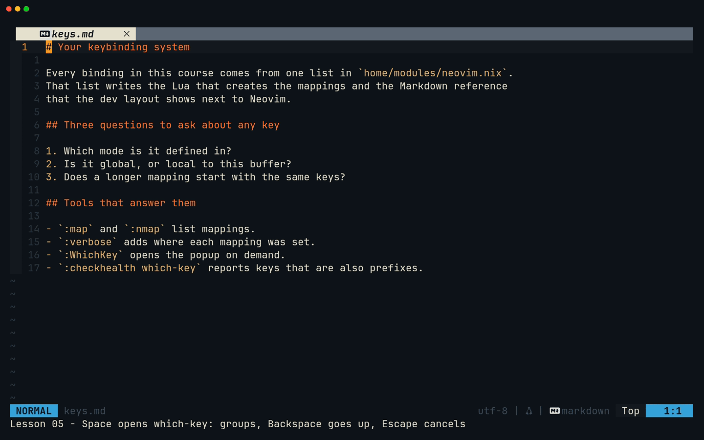
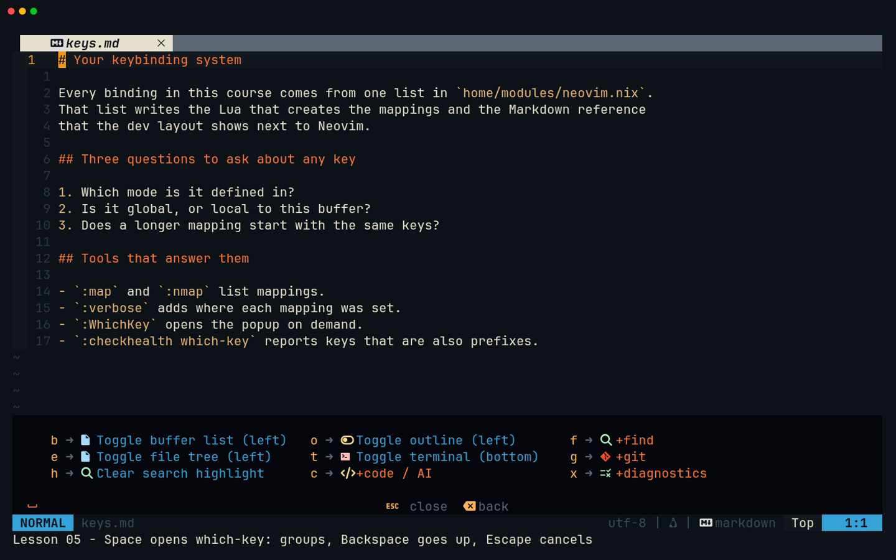
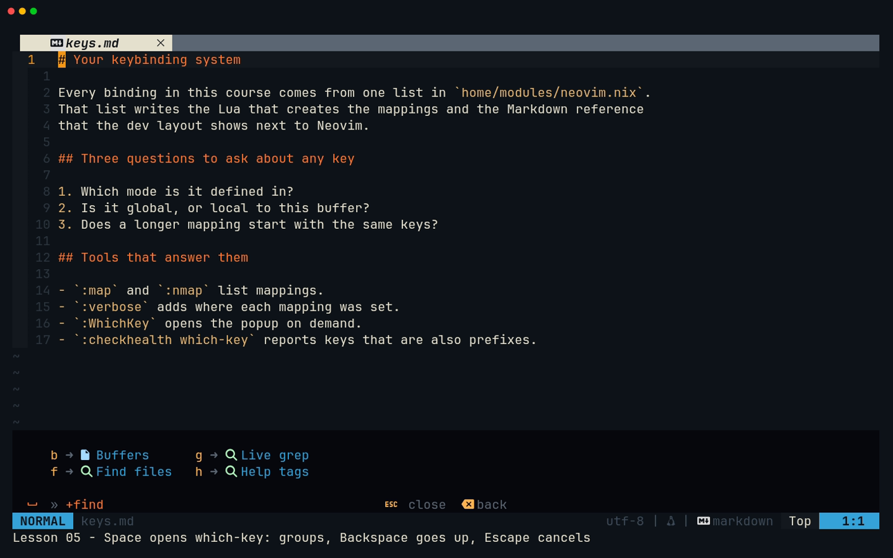
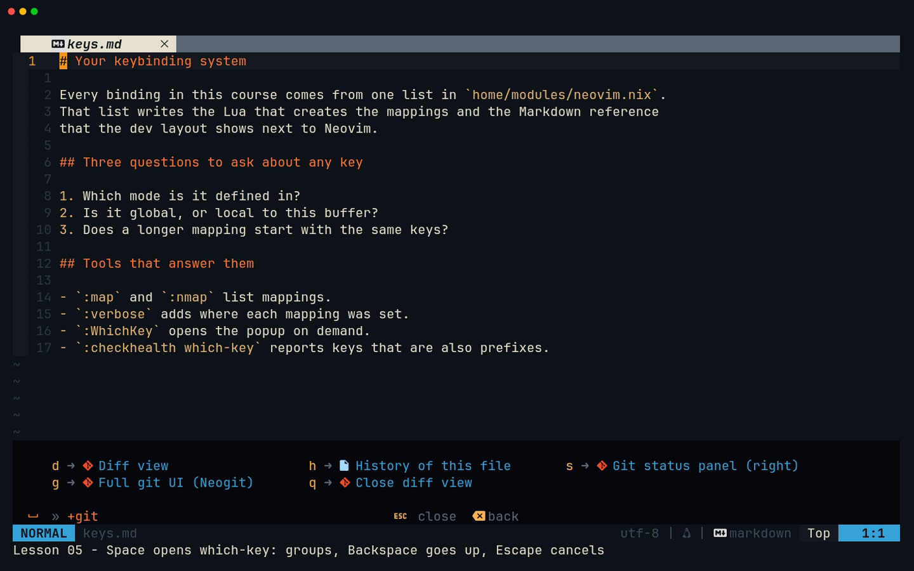
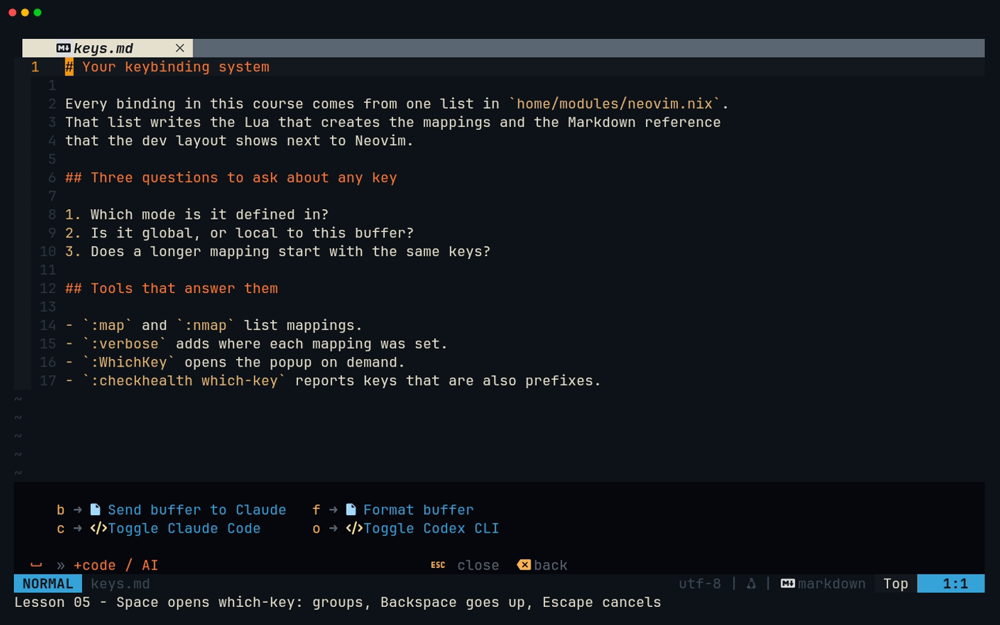
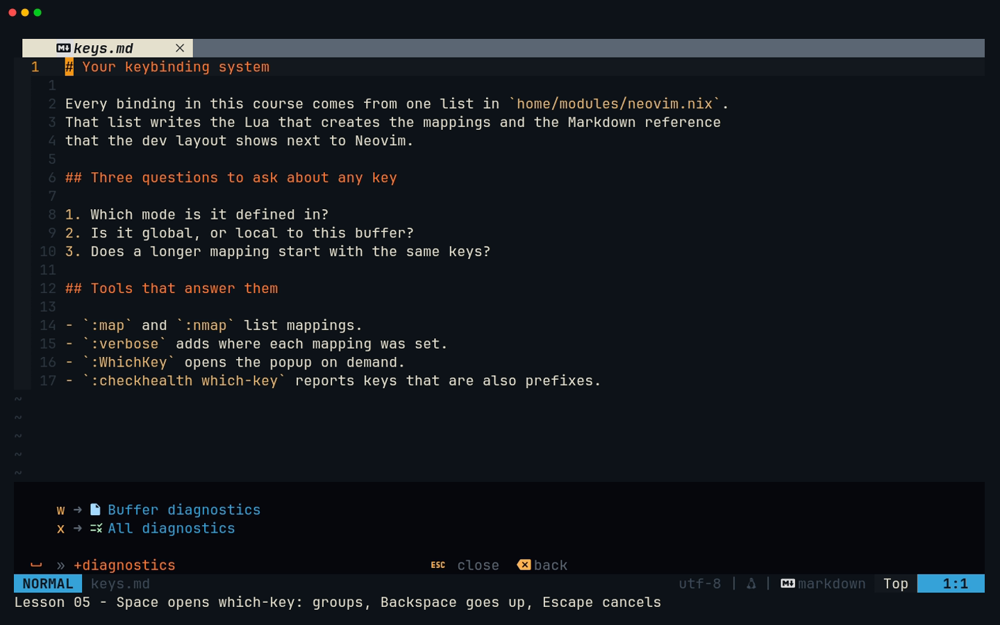
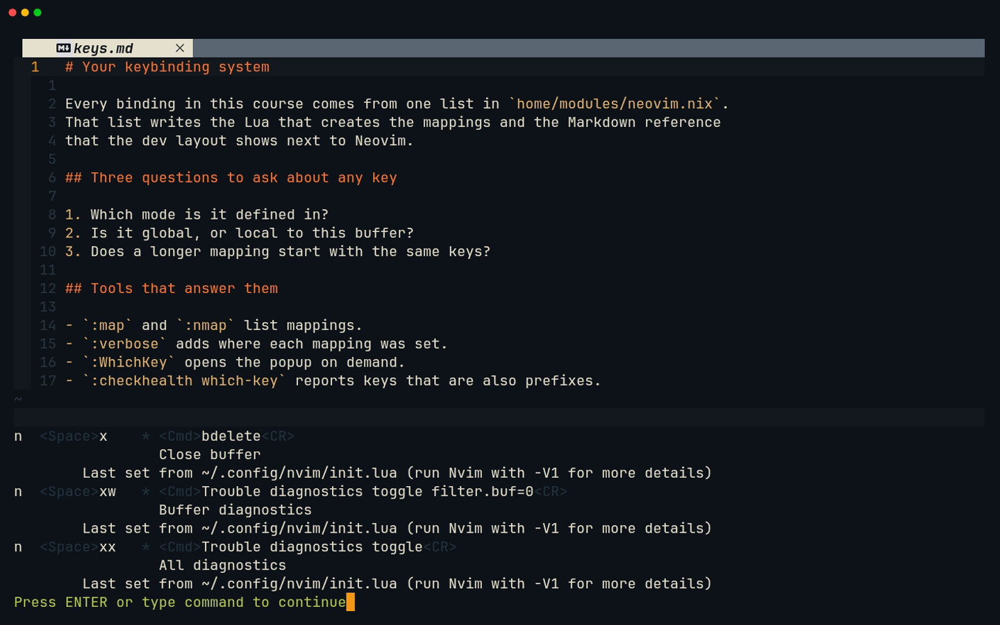

# Lesson 05 — Your keybindings

**Last Updated**: 27/09/2026
**Version**: 1.0.0
**Maintained By**: Development Team
**Language**: British English (en_GB)
**Timezone**: Europe/London

---

This lesson turns your keybindings from a list you memorise into a system you can read. It covers where every
binding comes from and how to see them all with one key. It also covers why some keys wait before they act, and which
plugin panels quietly replace your keys while you are inside them. From lesson 06 onwards every capstone step is a key
press in a tree, a terminal, a picker or a git panel. When one of those keys "does nothing" or does something
surprising, the tools in this lesson show you why in seconds.

**Part**: 2 — Your keybindings · **Time**: ~60 min · **Previous**: [Lesson 04 — Search, registers and macros](04-SEARCH-REGISTERS-MACROS.md) · **Next**: [Lesson 06 — Terminal](06-TERMINAL.md)

## Objectives

By the end of this lesson you can:

- open the which-key popup with Space, move through its groups, go up a level with Backspace and cancel with Escape;
- explain how one Nix list in `home/modules/neovim.nix` produces both your mappings and `KEYBINDS.md`, and what a
  `docOnly` entry is;
- say which of your keys exist only when a language server is attached, and why;
- predict what `<leader>x` and `gr` do when you pause after them, and use the safe alternatives;
- apply the precedence rule (buffer-local beats global) and name the panels that shadow your keys;
- inspect any key with `:map`, `:verbose nmap`, `:WhichKey` and `:checkhealth which-key`;
- recognise the Neovim 0.12 default keys that sit alongside yours;
- start Neovim from Hyprland with the RETURN family and find your way around the dev-layout windows.

## Before you start

- You have finished lessons [00](00-SETUP-AND-ORIENTATION.md) to [04](04-SEARCH-REGISTERS-MACROS.md). You can move,
  edit, search and quit (`:q`, `:qa!`) without thinking about it.
- You are on `laptop-intel` running the **full** `laptop-intel` configuration. `dev-layout` and `just` are installed
  only by the full configuration (Gotcha 11).
- Open a plain terminal: `SUPER + RETURN`, then `SUPER + 0` (new windows open on workspace 10). Then go to the
  repository:

  ```bash
  # any directory
  cd ~/Repos/personal/nix-config
  ```

- The drills open real repository files (`README.md`, `justfile`, `home/modules/neovim.nix`) to **look** at them.
  Do not save them. Format-on-save would rewrite them. Leave with `:qa!`.
- There is no capstone milestone here. Both capstones start in [lesson 06](06-TERMINAL.md) (JP0 + SB0), and nothing
  is committed until [lesson 12](12-GIT.md).

## Keys in this lesson

In this table `<leader>` means **Space** (`vim.g.mapleader = ' '`, neovim.nix:210).

| Keys | Mode | Action | Where it comes from |
| --- | --- | --- | --- |
| `<leader>`, then wait | Normal (and Visual) | which-key popup listing everything under Space | config (neovim.nix:210), which-key default |
| `<BS>` / `<Esc>` in the popup | popup | up one level / close without running anything | which-key default |
| `<C-d>` / `<C-u>` in the popup | popup | scroll a long popup | which-key default |
| `<leader>x` | Normal | close buffer (`:bdelete`), but only after a 300 ms pause | config (neovim.nix:63) |
| `<leader>xx` / `<leader>xw` | Normal | Trouble: all diagnostics / this buffer's | config (neovim.nix:55-56) |
| `gr` | Normal | LSP references, after a 300 ms wait | config (LSP buffer-local) |
| `grr` `grn` `gra` `gri` `grt` `grx` | Normal (`gra` also Visual) | references, rename, code action, implementation, type definition, run codelens | Neovim 0.12 default |
| `<leader>o`, then `q` | Normal | open the outline (the cursor moves into it) / close it from inside | config (neovim.nix:26), aerial default |
| `<leader>e` | Normal | open the file tree (the cursor moves into it) | config (neovim.nix:24) |
| `<C-h>` `<C-l>` | Normal | window left / right | config (neovim.nix:68, :71) |
| `:map {lhs}`, `:nmap {lhs}`, `:xmap {lhs}` | Command | list mappings whose keys start with `{lhs}` | Neovim default |
| `:nmap <buffer>` | Command | list only this buffer's Normal-mode mappings | Neovim default |
| `:verbose nmap {lhs}` | Command | the same, plus where each mapping was set | Neovim default |
| `:WhichKey [mode] [keys]` | Command | open the popup on demand | which-key default |
| `:checkhealth which-key`, then `q` | Command | report keys that are also prefixes; `q` closes the report | which-key default, Neovim default |
| `<C-\><C-n>` | Terminal | leave Terminal mode (none of your keys work inside it) | Neovim default |
| `SUPER + RETURN` / `+ SHIFT` / `+ CTRL` / `+ ALT` | Hyprland | Kitty / nix-config Neovim layout / picker layout / bare `nvim` | config (config/hypr/60-keybinds.lua:25-28) |
| `SUPER + 0` | Hyprland | go to workspace 10, where the plain and bare-`nvim` Kitty windows open on laptop-intel | config (config/hypr/60-keybinds.lua:159-163; devices/laptop-intel.lua:115-121) |
| `SUPER + H/J/K/L` | Hyprland | move focus between Kitty windows | config (config/hypr/60-keybinds.lua:129-132) |

## Walkthrough

### 1. Space opens the map

Your leader key is **Space** (neovim.nix:210-211). Most of your personal bindings start with it. The rest are Ctrl
keys, `<Tab>`/`<S-Tab>`, and Vim-style LSP keys such as `gd`, `K` and `[d`. You do not need to remember them all,
because which-key watches for a pause.

which-key runs with its defaults (`wk.setup()`, neovim.nix:842-843). At the pinned revision these are:

- **Classic layout:** a panel along the bottom of the screen.
- **Delay:** the popup appears **200 ms** after a prefix key and then waits for you.
- **Groups:** the config only adds four group labels (neovim.nix:844-849): `<leader>f` **find**, `<leader>g` **git**,
  `<leader>c` **code / AI** and `<leader>x` **diagnostics**. The popup shows a group with a `+` in front, for example
  `+find`.
- **Descriptions:** every other label is the `desc` of the mapping itself (comment at neovim.nix:839-841).

Inside the popup:

| Key | Effect |
| --- | --- |
| a listed key | opens that group or runs that binding |
| `<BS>` (Backspace) | goes up one level |
| `<Esc>` | closes the popup and runs nothing |
| `<C-d>` / `<C-u>` | scrolls a popup that does not fit |

The popup is for when you hesitate. If you type a whole sequence briskly (`Space f f`), it never appears.

**Try it**

```bash
# in ~/Repos/personal/nix-config
nvim README.md
```

1. Press `Space` and wait.
2. Press `f` to open the find group, then `<BS>` to go back up.
3. Press `g` to open the git group, then `<Esc>`.
4. Press `Space`, wait, press `c`, then `<Esc>`.
5. Press `Space`, wait **until the popup is showing**, press `x`, then `<Esc>`.

**What you should see**



[MP4](../media/05-your-keybindings/05-your-keybindings.mp4)

The root popup lists the Panels keys `b` `e` `o` `t` and `h` (clear search highlight), plus the four groups:
`c → +code / AI`, `f → +find`, `g → +git` and `x → +diagnostics`. Nerd Font icons sit in front of most labels. The
bottom line reminds you of the `close` and `back` keys.



After `f`, the popup shows `b` Buffers, `f` Find files, `g` Live grep and `h` Help tags. After `g`, it shows `d` `g`
`h` `q` and `s`, the five Git keys.





After `c`, it shows `b` Send buffer to Claude, `c` Toggle Claude Code, `f` Format buffer and `o` Toggle Codex CLI.
`<leader>cs` is missing because it is a Visual-mode key (step 8 shows how to find it).



After a slow `x`, it shows `w` Buffer diagnostics and `x` All diagnostics. Your buffer was **not** closed, even though
`<leader>x` is "Close buffer". Step 5 explains why.



> **Zed habit:** in Zed you reach for the command palette when you forget a key. Here, Space followed by a pause is the
> palette for your own bindings. Every label in it is the same text you will find in `KEYBINDS.md`.

### 2. One list, two outputs

Every global binding lives in **one Nix list**: `keymaps`, at neovim.nix:23-72. Each entry has a `group`, an `lhs`
(the keys), an `rhs` (what runs) and a `desc`. It may also have `mode` or `docOnly`. Here is an excerpt (lines 34-38,
55-59 and 63, unchanged):

```nix
# home/modules/neovim.nix (excerpt)
    { group = "Git";    lhs = "<leader>gs"; rhs = "<cmd>Neotree toggle git_status right<CR>"; desc = "Git status panel (right)"; }
    { group = "Git";    lhs = "<leader>gg"; rhs = "<cmd>Neogit<CR>";                desc = "Full git UI (Neogit)"; }
    { group = "Git";    lhs = "<leader>gd"; rhs = "<cmd>DiffviewOpen<CR>";          desc = "Diff view"; }
    { group = "Git";    lhs = "<leader>gq"; rhs = "<cmd>DiffviewClose<CR>";         desc = "Close diff view"; }
    { group = "Git";    lhs = "<leader>gh"; rhs = "<cmd>DiffviewFileHistory %<CR>"; desc = "History of this file"; }
    # …
    { group = "Diagnostics"; lhs = "<leader>xx"; rhs = "<cmd>Trouble diagnostics toggle<CR>";              desc = "All diagnostics"; }
    { group = "Diagnostics"; lhs = "<leader>xw"; rhs = "<cmd>Trouble diagnostics toggle filter.buf=0<CR>"; desc = "Buffer diagnostics"; }
    { group = "Diagnostics"; lhs = "<leader>ld"; desc = "Line diagnostic";     docOnly = true; }
    { group = "Diagnostics"; lhs = "[d";         desc = "Previous diagnostic"; docOnly = true; }
    { group = "Diagnostics"; lhs = "]d";         desc = "Next diagnostic";     docOnly = true; }
    # …
    { group = "Buffers"; lhs = "<leader>x";  rhs = "<cmd>bdelete<CR>";   desc = "Close buffer"; }
```

Nix renders that list twice:

1. **The mappings.** Entries marked `docOnly` are filtered out at neovim.nix:78. `renderKeymap` (:80-85) then turns
   each remaining entry into a Lua call. The mode defaults to `"n"` (Normal) unless the entry sets `mode` (:82). The
   result is pasted into your `init.lua` at neovim.nix:871. Two of the generated lines are:

   ```lua
   vim.keymap.set('n', '<leader>gg', '<cmd>Neogit<CR>', { desc = 'Full git UI (Neogit)', noremap = true, silent = true })
   vim.keymap.set('n', '<leader>x', '<cmd>bdelete<CR>', { desc = 'Close buffer', noremap = true, silent = true })
   ```

2. **The reference.** **All** entries, `docOnly` included, become `~/.config/nvim/KEYBINDS.md` (neovim.nix:89-105,
   written at :1002). It has one section per group, in the order the groups first appear: Panels, Find, Git, AI, Code,
   Diagnostics, Buffers, Windows. The generated Diagnostics section is:

   ```markdown
   ## Diagnostics

   | Key | Action |
   | --- | --- |
   | `<leader>xx` | All diagnostics |
   | `<leader>xw` | Buffer diagnostics |
   | `<leader>ld` | Line diagnostic |
   | `[d` | Previous diagnostic |
   | `]d` | Next diagnostic |
   ```

For every generated key, the popup, `KEYBINDS.md` and `:map` all show the same `desc` text, because it is the same
string. That is the point of the design. The comment at neovim.nix:10-17 calls it the "single source of truth". The
one at :861-865 warns that a `vim.keymap.set` added by hand "would work but would be missing from the on-screen
reference". For the same reason, toggleterm's own `open_mapping` is left unset (neovim.nix:770-773).

**Try it**

```bash
# in ~/Repos/personal/nix-config
less ~/.config/nvim/KEYBINDS.md
```

Press `q` to leave `less`. Inside Neovim, `:view ~/.config/nvim/KEYBINDS.md` opens the file read-only, and `:bd`
closes it again.

**What you should see:** it starts with `# Neovim keybinds` and "Leader is `<Space>`. Generated from
`home/modules/neovim.nix` — do not edit by hand". Then come the eight sections, each a two-column `Key | Action` table.
There is **no mode column** and no hint of which keys are `docOnly`. So `<leader>cs` looks like any other key, even
though it only works in Visual mode (Gotcha 5).

> **Tip:** to add or change a binding, edit the `keymaps` list, run `just rebuild`, and the mapping, `KEYBINDS.md` and
> the which-key label all change together. [Lesson 22](22-MAKING-THE-CONFIG-YOURS.md) walks you through it. Do not
> hand-edit `KEYBINDS.md`. Home Manager rewrites it on every rebuild.

### 3. `docOnly` entries and why the LSP keys are buffer-local

Twelve of the 41 entries are `docOnly = true`: all nine in **Code** and three in **Diagnostics** (`<leader>ld`, `[d`,
`]d`). The comment at neovim.nix:19-22 gives the meaning: "documented here, defined elsewhere". They are defined in two
other places:

- **Eleven are set when a language server attaches.** An `LspAttach` autocommand (neovim.nix:335-360) runs
  `vim.keymap.set` with `{ buffer = ev.buf, … }` (:338). That creates a **buffer-local** mapping, which exists only in
  the buffer the server attached to. These keys only make sense where a server can answer them (comment at :867-869).
  In a Markdown file or a terminal there is no `gd`, `K` or `<leader>ca` from your config.
- **`<leader>cf` (Format buffer) is global.** It is set by hand at neovim.nix:987-989 for Normal **and** Visual mode,
  because it calls conform through a Lua function. A string `rhs` cannot express that. It is global so that it also
  reaches Markdown, which conform formats but no server covers (:980-981).

The config's own comments show the precedence rule from step 7 at work, twice:

- Signature help moved from `<C-k>` to `<leader>k`. The buffer-local `<C-k>` was "shadowing the global `<C-k>`
  window-up binding in every buffer with a server attached" (neovim.nix:345-350).
- The line diagnostic went to `<leader>ld`, not `<leader>e`. "A buffer-local binding here would shadow" the neo-tree
  toggle (:355-358).

There is one visible side effect. The LSP mappings are created **without a `desc`** (:338), so which-key has nothing to
print for them. In a buffer with a server attached:

- `k` appears at the top of the Space popup with a **blank** label. which-key lists buffer-local keys first.
- `l` and `r` appear as `+1 keymap`, because no group label exists for `<leader>l` or `<leader>r`.
- Inside `+code / AI` there is an `a` with a blank label.

`KEYBINDS.md` and step 4 are where their names live.

**Try it**

```bash
# in ~/Repos/personal/nix-config
nvim home/modules/neovim.nix
```

Wait a few seconds for the Nix language server (`nil`, neovim.nix:561) to start. Then run:

```vim
:nmap <buffer>
```

**What you should see:** a list of this buffer's own mappings. Each line has an `@` after the `*`, which marks it as
buffer-local. The list includes `gd`, `gD`, `gi`, `gr`, `K`, `[d`, `]d`, `<Space>k`, `<Space>rn`, `<Space>ca` and
`<Space>ld`, none with a description line. You will also see entries described `which-key-trigger` (step 8 explains
those). Now press `Space` and wait: `k`, `l` and `r` are in the popup. If none of the LSP keys appear, no server
attached. [Lesson 10](10-LSP.md) shows `:checkhealth vim.lsp`. Leave with `:qa!`.

### 4. Tour of every global binding

Every entry in the `keymaps` list, grouped as in `KEYBINDS.md`, with the lesson that teaches it properly. "LSP only"
marks the buffer-local `docOnly` keys from step 3.

| Group | Keys | Mode | What it does | neovim.nix | Taught in |
| --- | --- | --- | --- | --- | --- |
| Panels | `<leader>e` | n | toggle file tree (left; the cursor moves in) | :24 | [07](07-TREE.md) |
| Panels | `<leader>b` | n | toggle buffer list (left) | :25 | [08](08-FILE-PANE.md) |
| Panels | `<leader>o` | n | toggle outline (left; the cursor moves in) | :26 | [09](09-PROJECT-PANE.md) |
| Panels | `<leader>t` | n | toggle terminal (bottom) | :27 | [06](06-TERMINAL.md) |
| Find | `<leader>ff` `<leader>fg` `<leader>fb` `<leader>fh` | n | Telescope: files, live grep, buffers, help tags | :29-32 | [09](09-PROJECT-PANE.md) |
| Git | `<leader>gs` | n | git status panel (right) | :34 | [12](12-GIT.md) |
| Git | `<leader>gg` | n | Neogit, in its own tab | :35 | [12](12-GIT.md) |
| Git | `<leader>gd` `<leader>gq` `<leader>gh` | n | Diffview open, close, history of this file | :36-38 | [12](12-GIT.md) |
| AI | `<leader>cc` `<leader>cb` | n | toggle Claude Code; send this buffer to Claude | :40-41 | [13](13-CLAUDE-CODE-AND-CODEX.md) |
| AI | `<leader>cs` | **v only** | send the selection to Claude | :42 | [13](13-CLAUDE-CODE-AND-CODEX.md) |
| AI | `<leader>co` | n | toggle the Codex terminal | :43 | [06](06-TERMINAL.md), [13](13-CLAUDE-CODE-AND-CODEX.md) |
| Code | `<leader>cf` | n, v | format buffer (conform; global) | :46, :987-989 | [11](11-COMPLETION-FORMATTING-DIAGNOSTICS.md) |
| Code | `<leader>ca` `<leader>rn` | n, LSP only | code action; rename symbol | :45, :47 | [10](10-LSP.md) |
| Code | `gd` `gD` `gi` `gr` `K` `<leader>k` | n, LSP only | definition, declaration, implementation, references, hover, signature help | :48-53 | [10](10-LSP.md) |
| Diagnostics | `<leader>xx` `<leader>xw` | n | Trouble: all diagnostics; this buffer's | :55-56 | [11](11-COMPLETION-FORMATTING-DIAGNOSTICS.md) |
| Diagnostics | `<leader>ld` `[d` `]d` | n, LSP only | line diagnostic float; previous / next diagnostic | :57-59 | [10](10-LSP.md) |
| Buffers | `<Tab>` `<S-Tab>` | n | next / previous buffer | :61-62 | [08](08-FILE-PANE.md) |
| Buffers | `<leader>x` | n | close buffer (`:bdelete`, after a pause) | :63 | [08](08-FILE-PANE.md), this lesson |
| Buffers | `<C-s>` | n | save (`:w`) | :64 | [01](01-MODES-AND-SURVIVAL.md) |
| Buffers | `<C-q>` | n | `:q`, which closes a **window**, not Neovim | :65 | [01](01-MODES-AND-SURVIVAL.md), [08](08-FILE-PANE.md) |
| Buffers | `<leader>h` | n | clear search highlight | :66 | [04](04-SEARCH-REGISTERS-MACROS.md) |
| Windows | `<C-h>` `<C-j>` `<C-k>` `<C-l>` | n | move to the window left / down / up / right | :68-71 | [08](08-FILE-PANE.md) |

Three patterns to notice:

- **Everything is Normal mode** except `<leader>cs` (Visual) and `<leader>cf` (Normal and Visual). There are **no**
  Insert-mode or Terminal-mode entries (Gotcha 7). The completion keys you meet in lesson 11 belong to nvim-cmp and only
  work in Insert mode.
- **`<leader>c` holds two KEYBINDS.md sections.** The popup's `+code / AI` group mixes global keys (`cc`, `cb`, `co`,
  `cf`), a Visual-only key (`cs`) and an LSP-only key (`ca`).
- **`<leader>rn`, `<leader>ld` and `<leader>k` sit outside any labelled group**, and they exist only in LSP buffers.

[Appendix A](../appendices/A-CHEATSHEET.md) repeats this table with the cmp keys, the defaults worth knowing and the
keys inside each plugin.

### 5. The 300 ms clock: prefixes that are also mappings

Neovim has to decide when a key sequence is finished. If one mapping is a prefix of another, the sequence is
**ambiguous**. `<leader>x` is a prefix of `<leader>xx`, for example. After the shorter one, Neovim waits for more keys
until `'timeoutlen'` runs out, and only then runs the shorter mapping. Neovim's default wait is 1000 ms. Your config
sets **300 ms** (neovim.nix:270).

which-key adds its own rule on top. Its source says: "a node can be both a keymap and a group; when it's both, we honor
`timeoutlen` and `nowait`".

- If the next key arrives **within 300 ms of Space**, which-key hands the keys back to Neovim, which then does its own
  300 ms ambiguity wait.
- If you have already paused, which-key treats the key as the group and shows its popup.

The config avoids this on purpose for `<leader>f`, because "a mapping on the prefix itself makes every one of those
wait out 'timeoutlen'" (neovim.nix:983-986). `<leader>x` is the one prefix that still carries an action of its own:

| What you type | What happens |
| --- | --- |
| `Space x x`, briskly | Trouble opens with all diagnostics |
| `Space x w`, briskly | Trouble opens with this buffer's diagnostics |
| `Space x` together, then stop | after 300 ms, `:bdelete` closes the current buffer |
| `Space`, pause until the popup shows, then `x` | the `+diagnostics` popup; `x`/`w` open Trouble and `<Esc>` cancels. "Close buffer" cannot be chosen from here |
| `:bd` | closes the buffer at once, no timing involved |

The same shape appears in every buffer with a language server. Your buffer-local `gr` (References, neovim.nix:343) is a
prefix of Neovim's global `grn`, `gra`, `grr`, `gri`, `grt` and `grx` (step 6). It is not marked `<nowait>`, so:

- **Quick `gr`:** Neovim waits 300 ms for a third key, then shows references.
- **`g`, pause, `r`:** the popup lists those six `gr…` defaults instead, and your `gr` does not run.
- **`grr`:** the same references with no wait.

> **Why:** a 300 ms wait is short enough that you rarely notice it on `gr`. On `<leader>x` it matters more, because
> what runs after the wait is destructive. [Lesson 26](26-FIX-CLOSE-BUFFER-KEY.md) moves close-buffer to
> `<leader>q`.

**Try it**

```bash
# in ~/Repos/personal/nix-config
nvim README.md justfile
```

Both files show as tabs in the bufferline at the top. Type `Space x` together and take your hands off the keyboard.

**What you should see:** after a moment `README.md` disappears from the bufferline and `justfile` fills the window.
Reopen it with `:e README.md`. Then press `Space`, wait for the popup, press `x`, and note that `+diagnostics` opens and
nothing closes. Press `<Esc>`, then `:qa!`.

### 6. Neovim 0.12 defaults that coexist with yours

Neovim 0.12.5 creates default mappings at start-up, **before** your `init.lua` runs. A mapping of yours with the same
mode and keys replaces the default. All the others stay available.

| Keys | Mode | Default action | Since | How it meets your config |
| --- | --- | --- | --- | --- |
| `grn` | n | LSP rename | 0.11 | same job as `<leader>rn` |
| `gra` | n, x | LSP code action | 0.11 | your `<leader>ca` is Normal-only; `gra` also works on a Visual selection |
| `grr` | n | LSP references | 0.11 | your `gr` without the 300 ms wait |
| `gri` | n | LSP implementation | 0.11 | same job as your `gi` |
| `grt` | n | LSP type definition | 0.12 | your config has no other type-definition key |
| `grx` | n | run LSP codelens | 0.12 | – |
| `gO` | n | document symbols into the location list | 0.11 | in Markdown and help files it is a table of contents; `<leader>o` is the panel version |
| `<C-s>` | i, s | LSP signature help | 0.11 | no clash: your `<C-s>` save is Normal mode only |
| `[d` `]d` | n | previous / next diagnostic (takes a count) | 0.10 | replaced in LSP buffers by yours: always ±1, with a float |
| `[D` `]D` | n | first / last diagnostic | 0.11 | not replaced |
| `<C-w>d` | n | diagnostic float | 0.10 | same as `<leader>ld`, but works in every buffer |
| `[q` `]q` (`[Q` `]Q`) | n | previous / next (first / last) quickfix entry | 0.11 | used in [lesson 09](09-PROJECT-PANE.md) |
| `[b` `]b` | n | `:bprevious` / `:bnext` | 0.11 | same as `<S-Tab>` / `<Tab>` |
| `[l` `]l` | n | previous / next location-list entry | 0.11 | – |

The `gr…` keys are global, but they only do something useful where a server is attached.

Your config also **replaces** a few built-ins that you might know from elsewhere:

- `<C-l>` no longer redraws or clears the search highlight. It is window-right (neovim.nix:71), so use `<leader>h`
  instead (:66).
- In LSP buffers, `gi` is no longer "insert where you last stopped inserting".
- `<Tab>` also takes over `<C-i>` (jump forward), even in Kitty. [Lesson 02](02-MOTIONS.md) covers this.
  [Lesson 23](23-FIX-JUMP-FORWARD.md) maps `<C-i>` explicitly, which gives jump-forward back in Kitty.

### 7. Precedence: the buffer-local mapping wins

When a key is mapped both globally and locally to the current buffer, Neovim uses the **buffer-local** one. `:map`
marks buffer-local mappings with `@`. Plugins use this to give their own windows their own keys. So inside a panel,
some of your keys mean something else. Nothing is broken: you are in a different buffer. Leave the panel (usually with
`<C-h>`/`<C-l>` or `q`) and your keys come back.

> **Zed habit:** Zed scopes bindings with a `context` in its keymap, so the project panel has keys the editor does not.
> Buffer-local mappings are Neovim's version of that. The panel's key wins while you are in the panel.

| Where you are | Key | Meaning there | Your meaning, lost there | More in |
| --- | --- | --- | --- | --- |
| neo-tree (`<leader>e`, `<leader>b`, `<leader>gs`) | `<Tab>` | select (tag) the node | next buffer | [07](07-TREE.md) |
| neo-tree | `<C-s>` | quick-jump labels | save | [07](07-TREE.md) |
| neo-tree | `<Space>` | expand / collapse the node, so no which-key popup appears in the tree | the which-key popup | [07](07-TREE.md) |
| neo-tree git panel (`<leader>gs`) | `gg` | **commit and push** | (Vim's "go to top") | [12](12-GIT.md) |
| aerial outline (`<leader>o`) | `<C-j>` `<C-k>` | move and scroll the source | window down / up | [09](09-PROJECT-PANE.md) |
| aerial outline | `<C-s>` | jump to the symbol in a split | save | [09](09-PROJECT-PANE.md) |
| Telescope prompt, after `<Esc>` to Normal mode | `<C-q>` | send results to quickfix and open it | quit window | [09](09-PROJECT-PANE.md) |
| Telescope prompt, in Normal mode | `<Tab>` `<S-Tab>` | toggle selection | next / previous buffer | [09](09-PROJECT-PANE.md) |
| Telescope prompt, in Normal mode | `<C-k>` | scroll the preview sideways (right) | window up | [09](09-PROJECT-PANE.md) |
| Neogit status (`<leader>gg`) | `<Tab>` | toggle fold | next buffer | [12](12-GIT.md) |
| Neogit status | `<C-s>` | **stage everything** | save | [12](12-GIT.md) |
| Neogit status | `<C-j>` `<C-k>` | peek down / up | window down / up | [12](12-GIT.md) |
| Diffview tab (`<leader>gd`, `<leader>gh`) | `<Tab>` `<S-Tab>` | next / previous file's diff | buffers | [12](12-GIT.md) |
| Diffview tab | `<leader>e` / `<leader>b` | focus / toggle the diffview file panel | tree / buffer list | [12](12-GIT.md) |
| Diffview tab | `<leader>co` / `<leader>cb` / `<leader>ca` | choose OURS / BASE / ALL for a conflict | Codex / send buffer / code action | [12](12-GIT.md) |
| Trouble list (`<leader>xx`) | `<C-s>` | jump to the item in a split | save | [11](11-COMPLETION-FORMATTING-DIAGNOSTICS.md) |
| Terminal mode (`<leader>t`, `<leader>co`, `<leader>cc`) | every key except `<C-\>` | goes to the program | **all** of your keys | [06](06-TERMINAL.md), [13](13-CLAUDE-CODE-AND-CODEX.md) |
| any buffer with a language server | `gi` `gd` `gD` `[d` `]d` | your LSP keys | Neovim's built-in versions | [10](10-LSP.md) |

Three rows deserve a second look:

- **Neogit `<C-s>` and the neo-tree git panel's `gg`** turn a harmless reflex (save, go to top) into a git action.
- **Diffview removes your LSP `<leader>ca`** from the buffers it touched and does not put it back after
  `:DiffviewClose`. [Lesson 12](12-GIT.md) covers the recovery.
- **Terminal mode is not a shadow at all.** Your mappings are Normal-mode only, so in a terminal every key, including
  `<C-h>` and Space, goes to the shell, Codex or Claude. Press `<C-\><C-n>` first, then your keys work.

Your window keys `<C-h>` and `<C-l>` survive in the tree and the outline. Neither plugin maps them, so they are always
the way out of a side panel.

Inside neo-tree, Space itself is a neo-tree key that waits for more input, so a brisk `Space e` still reaches your
global `<leader>e` and closes the tree (checked with the pinned neo-tree 3.42.0 and which-key). There is simply no
popup there, and after a pause Space expands or collapses the entry under the cursor instead.

### 8. Inspecting any key

Four tools answer "what does this key do here, and who set it?".

**`:map` and its mode variants.** `:nmap`, `:xmap`, `:imap`, `:tmap` and plain `:map` list the mappings whose keys
**start with** what you give them. `:nmap <leader>` lists every Normal-mode Space mapping. `:nmap <buffer>` lists only
this buffer's Normal-mode mappings. Reading a line:

```text
n  <Space>x    * <Cmd>bdelete<CR>
                 Close buffer
n  gr          *@<Lua 129: …/runtime/lua/vim/lsp/buf.lua:868>
```

- The first column is the mode: `n` Normal, `v` Visual and Select, `x` Visual, `i` Insert, `t` Terminal, and a space
  for Normal, Visual, Select and Operator-pending together.
- `<leader>` is shown as the key it stands for, `<Space>`.
- `*` means "not remappable". Every one of yours is.
- `@` means **buffer-local**. That line wins over a global line with the same keys.
- Then comes the right-hand side: a command (`<Cmd>…<CR>`) or a Lua function with the file and line it was defined
  in.
- An indented line underneath is the `desc`. Your LSP maps have none (step 3).

You will also see buffer-local maps described `which-key-trigger`. which-key installs one on each prefix key (Space,
`g`, `z`, `[`, `]`, …) so that it can open its popup. It skips any key a plugin has already mapped in that buffer,
which is why there is no popup inside neo-tree.

**`:verbose`** adds a "Last set from" line under each mapping.

```vim
:verbose nmap <leader>x
```



You get three mappings: `<Space>x` Close buffer, `<Space>xw` Buffer diagnostics and `<Space>xx` All diagnostics.
Seeing three lines is exactly why `<leader>x` waits. Each one says `Last set from` followed by your generated
`init.lua` and "(run Nvim with -V1 for more details)". Started as `nvim -V1 …`, Neovim prints a line number instead.
That number is in the generated `init.lua`, not in `neovim.nix`.

A test render on Ubuntu shows the path as `~/.config/nvim/init.lua` (verify on laptop-intel). Either way, the source you edit
is always the `keymaps` list. Press `<Enter>` to dismiss the listing.

**`:WhichKey [mode] [keys]`** opens the popup without the pause:

- `:WhichKey` shows every Normal-mode key.
- `:WhichKey <leader>c` shows the code / AI group.
- `:WhichKey x <leader>c` shows the same group for **Visual** mode: `f` Format buffer and `s` Send selection to
  Claude.

The mode letter is one of `n i x s o t c` (default `n`). There is no `v`: use `x` for Visual. The four group labels
from neovim.nix:844-849 are Normal-mode only, because which-key gives a spec without a `mode` the mode `n`. In the
Visual popup, `<leader>c` therefore appears as `c → +2 keymaps`, not `+code / AI`.

**`:checkhealth which-key`** opens a report in a new tab. `q` closes it. The section that matters is
"checking for overlapping keymaps", which lists every key that is both a mapping and a prefix. It only knows about
buffers which-key has already seen. Run it from a buffer with a language server and you get something like this
(trimmed; the `gc` line comes from commenting and is harmless):

```text
checking for overlapping keymaps ~
- ⚠️ WARNING In mode `n`, <gr> overlaps with <grr>, <grt>, <grx>, <gra>, <gri>, <grn>:
- ⚠️ WARNING In mode `n`, <<Space>x> overlaps with <<Space>xx>, <<Space>xw>:
  - <<Space>x>: diagnostics
  - <<Space>xx>: All diagnostics
  - <<Space>xw>: Buffer diagnostics
- ✅ OK Overlapping keymaps are only reported for informational purposes.
```

These warnings are information, not errors. They are the two waits from step 5. Ignore any lines about icon providers.

### 9. Outside Neovim: the Hyprland RETURN family and the dev layout

Neovim is started by Hyprland keys. The RETURN family mirrors the Z family (Zed) one-for-one, so a modifier means the
same thing in both (comment at config/hypr/60-keybinds.lua:12-24):

| Modifier | RETURN family (Neovim in Kitty) | Z family (Zed) |
| --- | --- | --- |
| none | `SUPER + RETURN`: a plain Kitty terminal (:25), on workspace 10 (`SUPER + 0`) | `SUPER + Z`: a new Zed window (:34) |
| `SHIFT` | `SUPER + SHIFT + RETURN`: `dev-layout --nvim`, the nix-config layout on workspace 2 (:26) | `SUPER + SHIFT + Z`: `dev-layout`, the same layout with Zed (:50) |
| `CTRL` | `SUPER + CTRL + RETURN`: `dev-layout-pick --nvim`, a wofi picker that builds a layout on the next free workspace from 3-5 (:27) | `SUPER + CTRL + Z`: `dev-layout-pick`, the same with Zed (:51) |
| `ALT` | `SUPER + ALT + RETURN`: `kitty -e nvim`, one bare `nvim` in `$HOME` with no layout (:28), also on workspace 10 | – |

`SUPER + ALT + RETURN` runs a bare `nvim`, so Neovim opens its own dock layout: tree on the left, terminal at the bottom
(neovim.nix:889-905). The two `dev-layout` keys build three Kitty windows:

```text
┌──────────────────────────────────────┬─────────────────────────────┐
│                                      │ less ~/.config/nvim/        │
│  nvim  (75 % of the screen)          │      KEYBINDS.md            │
│  bare start, so the dock layout      ├─────────────────────────────┤
│  opens: tree left, terminal bottom   │ free shell (for claude,     │
│                                      │ codex, just …)              │
└──────────────────────────────────────┴─────────────────────────────┘
```

- **Top right** is your generated keybinding reference, running in `less` (rust/dev-layout/src/main.rs:346-368).
  `/` searches it, as in Neovim. If `KEYBINDS.md` is missing, the pane is a plain shell instead (:374-380). If you
  close it, run `less ~/.config/nvim/KEYBINDS.md` again in the free shell.
- **Bottom right** is a free shell in the project directory, meant for running `claude` and `codex` outside the editor
  (main.rs:348-349).
- **Moving between these windows** is Hyprland's job: `SUPER + H/J/K/L` (config/hypr/60-keybinds.lua:129-132).
  `<C-h/j/k/l>` only move between windows **inside** Neovim. Hyprland also moves focus to whatever window is under the
  mouse pointer, so keep it parked.

> **Gotcha:** `SUPER + SHIFT + RETURN` does nothing new if workspace 2 already holds **any** window. It just focuses
> workspace 2 (main.rs:243-252). A Zed nix-config layout there blocks the Neovim one, so close it first.

## Gotchas in this config

1. **`<leader>x` closes the buffer if you stop after it.** It is both `:bdelete` and the `+diagnostics` prefix
   (neovim.nix:55-56, :63, :848). **Fix:** type `Space x x` or `Space x w` in one go. Close buffers with `:bd` when in
   doubt. [Lesson 26](26-FIX-CLOSE-BUFFER-KEY.md) moves close-buffer to `<leader>q`.
2. **`gr` waits 300 ms in LSP buffers.** It is a prefix of the 0.11/0.12 `gr…` defaults (neovim.nix:343). **Fix:** use
   `grr` for instant references.
3. **LSP keys have blank labels in which-key.** They are set without a `desc` (neovim.nix:338). `<leader>l` and
   `<leader>r` show as `+1 keymap`. **Workaround:** read their names in `KEYBINDS.md` or the step 4 table.
4. **LSP keys exist only where a server is attached.** `<leader>ca`, `<leader>rn`, `<leader>k`, `<leader>ld`, `gd`,
   `gD`, `gi`, `gr`, `K`, `[d` and `]d` do nothing in Markdown files, terminals or panels. **Check:** `:nmap <buffer>`.
5. **`<leader>cs` is Visual-only, and `KEYBINDS.md` does not say so.** The file has no mode column (neovim.nix:94).
   In the Visual-mode popup the group appears as `+2 keymaps`, because the group labels are Normal-only
   (neovim.nix:844-849). **Use:** select with `V`, then `Space c s`. `:WhichKey x <leader>c` shows the Visual-mode
   keys.
6. **`<C-l>` no longer clears the search highlight.** It moves to the window on the right (neovim.nix:71). **Use:**
   `<leader>h` (:66).
7. **None of your keys work in Terminal mode.** Every generated mapping is Normal (or Visual) mode (neovim.nix:82).
   Inside `<leader>t`, Codex or Claude, press `<C-\><C-n>` first. Do not "fix" this by mapping `<Esc>` in Terminal
   mode: Claude Code and Codex use Escape themselves ([lesson 13](13-CLAUDE-CODE-AND-CODEX.md)).
8. **Muscle memory inside panels.** `<C-s>` stages everything in Neogit and `gg` commits **and pushes** in the neo-tree
   git panel (step 7). **Habit:** leave a panel before saving.
9. **Hand-written `vim.keymap.set` drifts.** A mapping added outside the `keymaps` list works but never reaches
   `KEYBINDS.md` or gets its which-key label from there (neovim.nix:861-865). **Fix:** add it to the list
   ([lesson 22](22-MAKING-THE-CONFIG-YOURS.md)).
10. **`SUPER + /` is the Hyprland cheat sheet, not Neovim's** (config/hypr/60-keybinds.lua:79). So is the
    laptop's `SUPER + Escape` dashboard (config/hypr/devices/laptop-intel.lua:258). The Neovim reference is
    `~/.config/nvim/KEYBINDS.md`, shown in the dev layout's
    top-right pane. `docs/NEOVIM-SETUP.md` is stale: it lists `<C-k>` for signature help, `<leader>f` for format and
    `<leader>e` for the diagnostic float. Trust `KEYBINDS.md`.
11. **The layout keys need the full configuration.** `dev-layout` and `just` are installed only by
    `laptop-intel` (full). `dev-layout-pick` exists from the desktop stage on (home/modules/hyprland.nix:135), but
    all it does is call `dev-layout`. So on the staged `-dev`, `-productivity` and `-creative` configurations,
    `SUPER + SHIFT + RETURN` and `SUPER + CTRL + RETURN` fail.

## Drills

1. **Read the system.** Without opening Neovim, answer from step 2 and step 3:
   - (a) Why is `<leader>cf` `docOnly` even though it is a global mapping?
   - (b) How many entries in `keymaps` actually become `vim.keymap.set` calls from the generator?

   <details><summary>Answer</summary>

   (a) It needs a Lua function (a closure that calls conform), and the generator can only write a string `rhs`. So it
   is defined by hand at neovim.nix:987-989 and listed as `docOnly` so that it still appears in `KEYBINDS.md`.
   (b) 29 of the 41 entries: 41 minus the 12 `docOnly` ones (nine Code, three Diagnostics).

   </details>

2. **Feel the clock.** In `~/Repos/personal/nix-config` run `nvim README.md justfile`. Type `Space x` together and
   stop. Reopen with `:e README.md`. Then type `Space`, wait for the popup, press `x`. What happened each time, and why
   are they different?

   <details><summary>Answer</summary>

   The first time, `README.md` closed after about 300 ms. `x` arrived within `timeoutlen` of Space, so which-key
   passed `<Space>x` to Neovim. Neovim waited 300 ms for a possible `x` or `w` and then ran `:bdelete`. The second
   time, `x` arrived after the timeout, so which-key opened the `+diagnostics` group (`w`, `x`) and nothing closed.
   `<Esc>` leaves it. Quit with `:qa!`.

   </details>

3. **Read a listing.** In any buffer run `:verbose nmap <leader>x`. How many mappings are listed, which one is the
   buffer-close, and how can you tell none of them is buffer-local?

   <details><summary>Answer</summary>

   Three: `<Space>x` (`<Cmd>bdelete<CR>`, "Close buffer"), `<Space>xw` and `<Space>xx` (the two Trouble commands).
   None has an `@` after the `*`, so all three are global. Each "Last set from" line points at your generated
   `init.lua`. Two longer mappings start with `<Space>x`, which is why that key waits.

   </details>

4. **Discover a shadowed key yourself.** Run `nvim README.md` and press `<leader>o`. The outline opens on the left and
   the cursor moves into it. Now run `:nmap <C-j>`. Then press `<C-l>` to go back to `README.md` and run `:nmap <C-j>`
   again. Explain the difference. Finally, press `<leader>e` to open the tree, run `:nmap <C-s>` there, and say what
   `<C-s>` does in the tree.

   <details><summary>Answer</summary>

   In the outline you see **two** lines for `<C-J>`: aerial's, marked `@` (buffer-local; it moves down a line and
   scrolls the source), and your global Window down. The `@` line wins, so `<C-j>` moves through the outline instead
   of going to the window below. `<C-h>` and `<C-l>` are not mapped by aerial, which is why `<C-l>` still got you out.
   In `README.md` only your global `<C-j>` is listed. In the tree, `:nmap <C-s>` shows neo-tree's buffer-local `<C-s>`
   (quick-jump labels) above your global Save, so `<C-s>` does **not** save there. Close the panels with `<leader>o`
   and `<leader>e` (or `q` inside them), then `:qa!`.

   </details>

5. **The `gr` wait and the missing labels.** Run `nvim home/modules/neovim.nix` and give the Nix server a few
   seconds. Run `:verbose nmap gr`. Then press `Space` and wait. Which keys in the popup have no description, and
   why?

   <details><summary>Answer</summary>

   `:verbose nmap gr` lists your buffer-local `gr` (with `@`, a Lua function from `vim/lsp/buf.lua`) above the six
   global defaults `grn` `gra` `grr` `gri` `grt` `grx`. So your `gr` is an ambiguous prefix and waits 300 ms; `grr` is
   the instant version. In the Space popup, `k` has a blank label and `l`/`r` show `+1 keymap`. Inside `+code / AI`,
   `a` is blank. They are the LSP keys, created in `LspAttach` without a `desc` (neovim.nix:338). If none of this
   appears, the server did not attach ([lesson 10](10-LSP.md)).

   </details>

6. **Where did `<leader>cs` go?** In `README.md`, press `Space c` and wait: is `s` listed? Press `<Esc>`, then select a
   line with `V`, press `Space`, wait, and press `c`. Press `<Esc>` twice (popup, then Visual mode). Finally run
   `:WhichKey x <leader>c` from Normal mode.

   <details><summary>Answer</summary>

   In Normal mode `+code / AI` shows only `b`, `c`, `f` and `o`. In Visual mode the Space popup holds a single entry,
   `c → +2 keymaps`. The group label is Normal-mode only, so it is missing here. Inside it are `f` Format buffer and
   `s` Send selection to Claude, the only two keys defined for Visual mode (neovim.nix:42, :987).
   `:WhichKey x <leader>c` shows the same Visual-mode group without selecting anything.

   </details>

7. **Ask the health check.** Still in `home/modules/neovim.nix` with the server attached, run
   `:checkhealth which-key`. Which overlaps are reported under "checking for overlapping keymaps", and which of them
   came from your config?

   <details><summary>Answer</summary>

   `<Space>x` overlapping `<Space>xx` and `<Space>xw` (from your `keymaps` list), and `gr` overlapping the six `gr…`
   defaults (your LSP `gr` against Neovim 0.12's). You will probably also see a harmless `gc`/`gcc` overlap from
   commenting. The report says these are "only reported for informational purposes". Press `q` to close the report,
   then `:qa!`.

   </details>

8. **Pick the right launcher.** (a) Which key gives you the nix-config Neovim layout, and what is in each of its three
   windows? (b) You press it and nothing new appears, only workspace 2 with Zed in it. Why? (c) Inside that layout, how
   do you move from Neovim to the keybinding pane?

   <details><summary>Answer</summary>

   (a) `SUPER + SHIFT + RETURN` (`dev-layout --nvim`). Neovim takes 75 % on the left and opens its dock layout.
   Top right is `less ~/.config/nvim/KEYBINDS.md`. Bottom right is a free shell in the repository.
   (b) `dev-layout` is idempotent: if workspace 2 holds any window it only focuses it
   (rust/dev-layout/src/main.rs:243-252). Close the Zed layout first.
   (c) With Hyprland's `SUPER + L`, then `SUPER + K`/`SUPER + J` between the two right-hand panes. `<C-l>` would only
   move between windows inside Neovim.

   </details>

## Recap

- **Space, then pause:** which-key shows everything under your leader. Letters open groups (`+find`, `+git`,
  `+code / AI`, `+diagnostics`), `<BS>` goes up and `<Esc>` cancels.
- **One `keymaps` list** in `home/modules/neovim.nix` (lines 23-72) generates the mappings **and**
  `~/.config/nvim/KEYBINDS.md`. `docOnly` entries are documented there but defined elsewhere: the LSP keys in
  `LspAttach`, and `<leader>cf` by hand.
- **LSP keys are buffer-local.** They exist only where a server is attached and have no which-key descriptions.
- **Prefix plus mapping means a 300 ms wait.** `<leader>x` closes the buffer if you stop after it, and `gr` waits;
  `:bd` and `grr` avoid the wait.
- **Buffer-local beats global.** Panels (neo-tree, aerial, Telescope, Neogit, Diffview, Trouble) replace some of your
  keys inside them, and Terminal mode ignores all of them until `<C-\><C-n>`.
- **Inspect, don't guess:** `:nmap {keys}`, `:nmap <buffer>`, `:verbose nmap {keys}`, `:WhichKey [mode] [keys]` and
  `:checkhealth which-key`.
- **Outside Neovim:** the RETURN family mirrors the Z family. `SUPER + SHIFT + RETURN` gives the nix-config layout with
  `KEYBINDS.md` in the top-right pane, and `SUPER + H/J/K/L` moves between its windows.

Next, [lesson 06](06-TERMINAL.md) opens the terminal dock and scaffolds both capstones.

## Recording

- **Tape:** `tapes/05-your-keybindings.tape`. Run it from `docs/NEOVIM-COURSE/` on laptop-intel (full configuration):

  ```bash
  # in ~/Repos/personal/nix-config/docs/NEOVIM-COURSE
  vhs tapes/05-your-keybindings.tape
  ```

- **Fixture:** `fixtures/05-your-keybindings/keys.md`, a short Markdown note. The hidden setup copies it to
  `/tmp/nvim-course/05-your-keybindings` and opens it with `nvim -i NONE keys.md`. Markdown gets no language server
  here, so the popup shows only the global keys. Nothing is saved, and no real repository or Claude/Codex data is on
  screen. claudecode.nvim's lock file goes to the throwaway `/tmp/nvim-course/05-your-keybindings.claude`, never to
  your `~/.claude`.
- **Outputs:** `media/05-your-keybindings/05-your-keybindings.gif` and
  `media/05-your-keybindings/05-your-keybindings.mp4`.

| Screenshot | Shows | Used in |
| --- | --- | --- |
| `media/05-your-keybindings/leader.png` | root popup: `b e h o t` and `+code / AI`, `+find`, `+git`, `+diagnostics` | step 1 |
| `media/05-your-keybindings/leader-f.png` | `+find`: `b f g h` | step 1 |
| `media/05-your-keybindings/leader-g.png` | `+git`: `d g h q s` | step 1 |
| `media/05-your-keybindings/leader-c.png` | `+code / AI`: `b c f o` | step 1 |
| `media/05-your-keybindings/leader-x.png` | `+diagnostics`: `w x`, with the buffer still open | step 1 |
| `media/05-your-keybindings/verbose-x.png` | `:verbose nmap <leader>x`: three mappings with "Last set from" lines | step 8 |

- **Manual steps:** none. Keep the mouse pointer parked away from the recording, and do not type while it runs.
  Record it before you apply lessons [24](24-FIX-COUNTED-TERMINAL-TOGGLE.md) and [26](26-FIX-CLOSE-BUFFER-KEY.md)
  and the gitsigns keys in [lesson 28](28-GOING-FURTHER.md): they change the popups and the `:verbose` listing it
  shows ([Appendix B](../appendices/B-RECORDING-WITH-VHS.md#record-in-this-order)).
- **Timing that must not change:** the tape waits about 1 s between `Space` and `x`. That is longer than `timeoutlen`
  (300 ms), so which-key opens `+diagnostics` instead of closing the buffer. Every popup is anchored with `Wait+Screen`
  on a description that appears only in the popup or the `:verbose` output.
- **VHS version:** `vhs --version` must print 0.12.1, which the config builds (0.12.0 exits 0 and writes nothing);
  if it prints 0.12.0, `just rebuild` first ([Appendix B](../appendices/B-RECORDING-WITH-VHS.md#first-make-sure-vhs-is-0121)).
- **Check each recording:**
  - `media/05-your-keybindings/` actually contains the GIF, the MP4 and all six PNGs.
  - The root popup has no `k`, `l` or `r` entries. If it does, a server attached to the fixture.
  - `leader-x.png` still shows `keys.md`.
  - `verbose-x.png` shows all three mappings and the hit-enter prompt.
  - The "Last set from" path agrees with step 8. Update the text if laptop-intel shows a different path.
- **Dry run:** the tape was rendered on Ubuntu against a stand-in configuration with VHS 0.12.1, and all six
  screenshots matched the descriptions above. It has not yet been recorded with the real configuration on
  laptop-intel.
