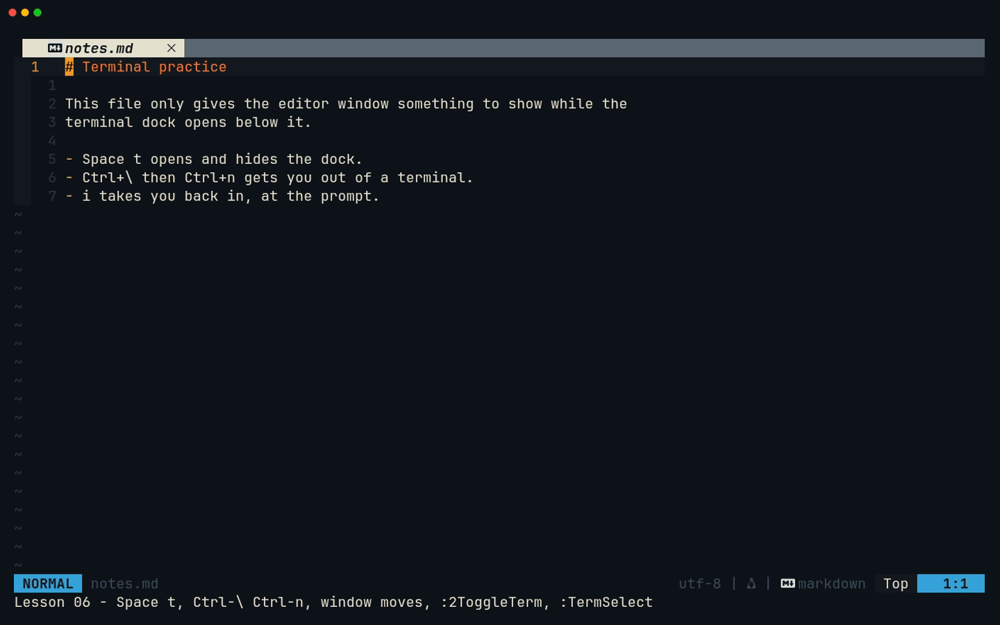
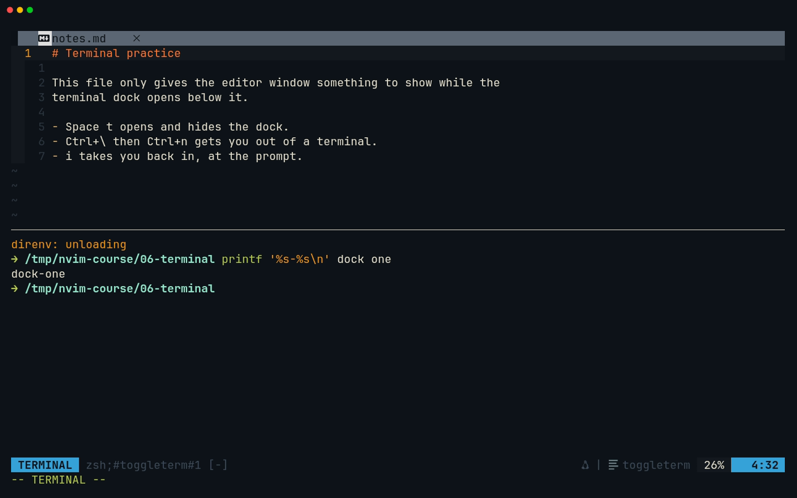
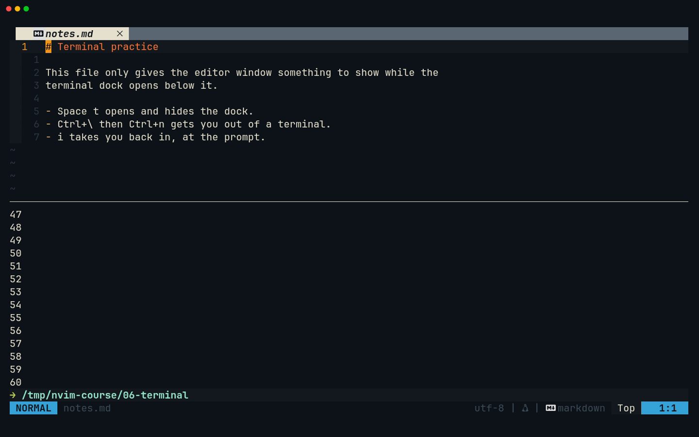
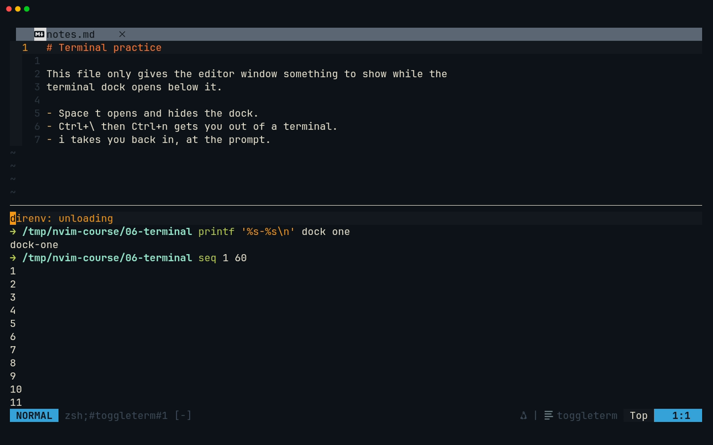
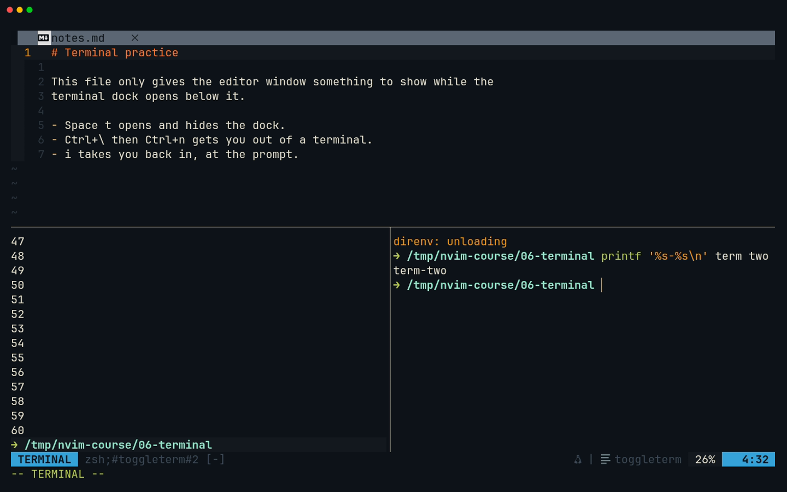
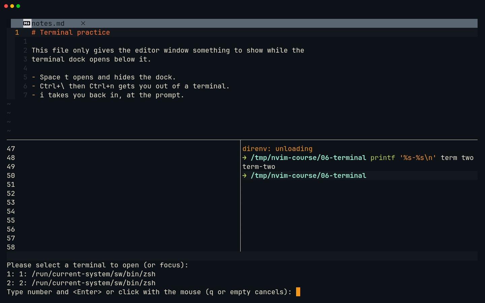

# Lesson 06 — Terminal

**Last Updated**: 27/09/2026
**Version**: 1.0.0
**Maintained By**: Development Team
**Language**: British English (en_GB)
**Timezone**: Europe/London

---

From this lesson on you build two real programs, and the terminal dock at the bottom of Neovim is where you
build and run them. You learn to open and hide it with one key, to get out of it (none of your keys work
inside it until you do), to run several numbered terminals side by side, and to scroll, search and copy their
output with ordinary Vim keys. You also learn what is different about the shell inside it on this machine:
which Rust toolchain answers, why `just` always means the nix-config justfile, and why `git commit` opens Zed.
Then you scaffold both capstones from two terminals and run them: just-panel prints `Hello, world!` and
session-browser opens its first window.

**Part**: 3 — Workspace · **Time**: ~90 min · **Previous**: [Lesson 05 — Your keybindings](05-YOUR-KEYBINDINGS.md) · **Next**: [Lesson 07 — Tree](07-TREE.md)

## Objectives

By the end of this lesson you can:

- open, hide and bring back the terminal dock with `<leader>t` (Space t), and say what its "smart toggle" does;
- switch between Terminal mode and Normal mode with `<C-\><C-n>` and `i`, and predict which mode a terminal
  comes back in;
- leave a terminal for another window and come back, without the mouse;
- scroll, search and yank a terminal's output in Normal mode;
- run numbered terminals with `:2ToggleTerm`, `:TermNew`, `:TermSelect`, `:ToggleTermSetName` and
  `:ToggleTermToggleAll`, and explain why `2<leader>t` does not reach terminal 2;
- send a command to a terminal from any window with `:TermExec`;
- name the three environment traps of this machine's shells: two Rust toolchains, the `JUST_*` variables and
  an `EDITOR` that opens Zed;
- scaffold just-panel (milestone JP0) and session-browser (milestone SB0) and run both.

## Before you start

- You have finished lessons [00](00-SETUP-AND-ORIENTATION.md) to [05](05-YOUR-KEYBINDINGS.md). In particular
  you can use `:s`, the black-hole register `"_` and the clipboard register `+`
  ([lesson 04](04-SEARCH-REGISTERS-MACROS.md)).
- You are on `laptop-intel` running the **full** `laptop-intel` configuration.
- For this lesson, start Neovim **from a shell inside the repository**, not from a Hyprland key. Step 9
  explains why: this way Neovim and its terminals agree on which Rust toolchain they use.

  ```bash
  # in a Kitty terminal (SUPER + RETURN, then SUPER + 0)
  cd ~/Repos/personal/nix-config && nvim
  ```

  A bare `nvim` opens the dock layout: the tree on the left, the editor on the right and a terminal across the
  bottom (neovim.nix:889-905).
- Neither capstone exists yet. In the dock terminal, `ls rust` lists no `just-panel`, and `ls python` says
  there is no such directory.
- Run `git status --short` once and note what it prints, so that you can tell your changes apart later. There
  is no milestone to be at: this lesson creates JP0 and SB0. Nothing is committed until
  [lesson 12](12-GIT.md).

## Keys in this lesson

In this table `<leader>` means **Space** (`vim.g.mapleader = ' '`, neovim.nix:210).

| Keys | Mode | Action | Where it comes from |
| --- | --- | --- | --- |
| `<leader>t` | Normal | smart toggle: hide every open terminal, or bring back the ones you hid | config (neovim.nix:27) |
| `<C-\><C-n>` | Terminal | leave Terminal mode for Normal mode | Neovim default |
| `<C-\><C-o>` | Terminal | run one Normal-mode command, then return to Terminal mode | Neovim default |
| `i` `a` `I` `A` | Normal, in a terminal | back into Terminal mode, at the prompt | Neovim default |
| `<C-h>` `<C-j>` `<C-k>` `<C-l>` | Normal | window left / down / up / right | config (neovim.nix:68-71) |
| `<C-w>p` | Normal | back to the previous window | Neovim default |
| `<C-u>` `<C-d>` `gg` `G` `/` `n` `V` `y` | Normal, in a terminal | scroll, search and yank the output | Neovim default |
| `:ToggleTerm`, `:2ToggleTerm` | Command | smart toggle / toggle terminal 2 (created if needed) | toggleterm default |
| `:TermNew` | Command | open a new terminal with the next free number | toggleterm default |
| `:2ToggleTermSetName python` | Command | give terminal 2 a name for the lists | toggleterm default |
| `:TermSelect` | Command | pick a terminal from a numbered list; `:TermSelect!` also lists hidden ones | toggleterm default |
| `:ToggleTermToggleAll` | Command | open every terminal if none is open, otherwise close them all | toggleterm default |
| `:TermExec cmd="…"` | Command | type a command into a terminal from any window | toggleterm default |
| `<leader>co` | Normal | toggle the hidden Codex terminal (lesson 13) | config (neovim.nix:43) |
| `:put +`, `:0put +` | Command | paste the clipboard as whole lines below the cursor line / above line 1 | Neovim default |
| `:noautocmd w` | Command | save without format-on-save | Neovim default |
| `SUPER + RETURN` | Hyprland | a plain Kitty terminal | config (config/hypr/60-keybinds.lua:25) |
| `SUPER + H/J/K/L` | Hyprland | move focus between Kitty windows | config (config/hypr/60-keybinds.lua:129-132) |

## Walkthrough

### 1. The dock and `<leader>t`

The terminal across the bottom is [toggleterm.nvim](https://github.com/akinsho/toggleterm.nvim). The config sets
it up at neovim.nix:774-780:

| Option | Value | Effect |
| --- | --- | --- |
| `direction` | `'horizontal'` | a split along the bottom, not a floating window |
| `size` | `15` | 15 rows high |
| `start_in_insert` | `true` | a new terminal starts in Terminal mode, ready for typing |
| `persist_size` | `true` | if you resize it, it keeps that size for the rest of the session |
| `shade_terminals` | `false` | same background as your code |

The comment above it (neovim.nix:770-773) explains why toggleterm's own `open_mapping` is left unset: every key
in this config comes from the `keymaps` list, so that `KEYBINDS.md` stays true. The only key is therefore
`<leader>t` (Space t, neovim.nix:27), which runs `:ToggleTerm`.

`:ToggleTerm` without a number is a **smart toggle**:

- if any terminal window is open, it closes all of them and remembers which ones were open;
- if none is open, it brings back the ones it remembered, or else the lowest-numbered terminal (terminal 1,
  created if no terminal exists yet).

Closing only hides the window. The shell inside keeps running, with its history and its current directory.

On a bare start the dock layout has already created terminal 1: the `VimEnter` autocmd runs
`Neotree show filesystem left`, then `ToggleTerm`, then moves the cursor back to the editing window
(neovim.nix:896-903).

**Try it**

1. Press `Space t`. The terminal disappears.
2. Press `Space t` again. It comes back, and this time the cursor is inside it.
3. Look at the mode on the status line. If it reads `NORMAL`, press `i` (step 2 explains why that can happen).
4. Type `pwd` and press Enter.

**What you should see**



[MP4](../media/06-terminal/06-terminal.mp4)

The status line reads `TERMINAL`, and `pwd` prints the repository path.



> **Zed habit:** Zed's terminal panel keeps Zed's workspace shortcuts working while it has focus. Neovim's
> terminal does not: until you leave Terminal mode, every key goes to the shell.

### 2. Terminal mode, and how to leave it

A terminal window has two modes of its own.

- **Terminal mode** (`TERMINAL` on the status line). Every key except `<C-\>` goes to the program
  (`:help terminal-input`). Your config defines no Terminal-mode mappings at all: the generator writes Normal
  and Visual mode only (neovim.nix:82). So Space types a space, `<C-h>` is Backspace for the shell, `<C-l>`
  clears the shell's screen, and `<Esc>` goes to zsh.
- **Normal mode** (`NORMAL`). The terminal is now a read-only buffer. Every Normal-mode key works, yours
  included.

The switches:

| From | Keys | To |
| --- | --- | --- |
| Terminal mode | `<C-\><C-n>` (Ctrl+\, then Ctrl+n) | Normal mode |
| Normal mode | `i`, `a`, `I` or `A` | Terminal mode, with the cursor back at the prompt |
| Terminal mode | `<C-\><C-o>` then one Normal-mode command | that command runs, then you are back in Terminal mode |

On the laptop's UK layout `\` is its own key, left of `Z`, so `<C-\>` is Ctrl plus that key. (The external
HyperX keyboard is set to the US layout, config/hypr/devices/laptop-intel.lua:274-277, where `\` sits above
Enter.)

toggleterm also **remembers the mode you left a terminal in** (`persist_mode`, on by default and not changed
here). Leave it in Normal mode and it comes back in Normal mode. `start_in_insert` only applies to a terminal
that has never been left yet.

**Try it**

1. In the terminal, type `ls` and press Enter.
2. Press `<C-\><C-n>`. The status line says `NORMAL`.
3. Press `Space t` to hide the dock, then `Space t` to bring it back.
4. The terminal is still in Normal mode. Press `i`, and you are back at the prompt.

**What you should see:** the mode changes from `TERMINAL` to `NORMAL` and back again, and the `ls` output
stays where it was.

> **Gotcha:** do not "fix" this by mapping `<Esc>` to `<C-\><C-n>` in Terminal mode. Claude Code and Codex use
> Escape themselves ([lesson 13](13-CLAUDE-CODE-AND-CODEX.md)). [Lesson 28](28-GOING-FURTHER.md) shows
> Terminal-mode window keys that leave Escape alone.

### 3. Getting out of the terminal, and back in

Leave Terminal mode first, then use your window keys (neovim.nix:68-71): `<C-\><C-n>`, then `<C-k>`.

One detail matters here. toggleterm opens the dock with a `botright split`, so terminal 1 runs across the full
width, under the tree **and** the editor. `<C-k>` goes to the window above the **cursor's column**:

- with the cursor in the leftmost 30 columns (the tree is 30 columns wide, neovim.nix:649) you land in the tree;
- further right, you land in the editor.

Your zsh prompt shows the whole path, so at a fresh prompt the cursor is usually past column 30 and you land in
the editor. After `gg` or a search it may be further left, and you land in the tree. So look where you landed:
from the tree, `<C-l>` takes you to the editor. `<C-w>p` ("previous window", a Neovim default) is the other
reliable key: it goes back to exactly where you came from.

From the editor, `<C-j>` goes down into the terminal. You arrive in whichever mode you left it in.

**Try it**

1. In the terminal, press `<C-\><C-n>`, then `<C-k>`. Note where you landed.
2. If it was the tree, press `<C-l>`. You are in the editor.
3. Press `<C-j>`. You are back in the terminal, in Normal mode. Press `i`.
4. Press `<C-\><C-n>`, `<C-k>`, then `<C-w>p`. You are back in the terminal.

**What you should see:** the cursor moves between windows, and the status line shows which buffer has it.



### 4. Reading the output: scroll, search, yank

In Normal mode a terminal is an ordinary read-only buffer, so the keys from lessons 02 to 04 work on its
output:

| Keys | Effect |
| --- | --- |
| `<C-u>` / `<C-d>` | half a page up / down |
| `gg` / `G` | top of the scrollback / the bottom |
| `/text`, `n`, `N` | search the output |
| `V`, a motion, `y` | yank whole lines; `yy` yanks one |
| `i` | back to the prompt (the view jumps to the bottom) |

- Terminal buffers have no line numbers: Neovim turns `number` and `relativenumber` off for them. Search
  instead of counting.
- Because `clipboard=unnamedplus` (neovim.nix:257), every yank also lands in the system clipboard. You can paste
  it into another buffer with `p`, or into any other program.
- Neovim 0.12 also maps `[[` and `]]` in a terminal to jump between shell prompts, but only when the shell
  marks its prompts (OSC 133). Whether your zsh does is not established (verify on laptop-intel).

**Try it**

1. In the terminal, run `seq 1 200`.
2. `<C-\><C-n>`, then `gg`: the top of the scrollback.
3. `/150` and Enter, then `yy`.
4. `G`, then `i`: back at the prompt.
5. `<C-\><C-n>`, then `<C-k>` (and `<C-l>` if you landed in the tree). In the editor, `:enew` gives you an empty
   scratch buffer. Press `p`: `150` appears. Throw the buffer away with `:bd!`.

**What you should see:** `gg` shows the first lines of the session; the search puts the cursor on `150`; the
pasted line is exactly the terminal's line.



### 5. More than one terminal

toggleterm numbers its terminals, and a number before `:ToggleTerm` picks one:

| Command | Effect |
| --- | --- |
| `:2ToggleTerm` | open terminal 2, creating it if needed; if it is open, hide it |
| `:1ToggleTerm` | the same for terminal 1 |
| `:TermNew` | open a new terminal with the next free number |
| `:1ToggleTermSetName rust` | name terminal 1 `rust`; the name shows in `:TermSelect` |
| `:TermSelect` | a numbered list of terminals; type the number and press Enter to open or focus that one |
| `:ToggleTermToggleAll` | if no terminal is open, open all of them; otherwise close all of them |

- A second bottom terminal opens **beside** the first, splitting the dock in two: toggleterm splits an open
  terminal window vertically rather than stacking another one.
- A new terminal starts in **Neovim's** working directory (`:pwd`), not in the directory another terminal has
  `cd`'d to.
- With two terminals open, `<leader>t` hides both and brings both back.
- In the `:TermSelect` list each line reads "position: number: name". Until you set a name, the name is the
  shell's path. `q` or an empty Enter cancels.

**The count trap.** `2<leader>t` does **not** open terminal 2. `<leader>t` is a `<cmd>ToggleTerm<CR>` mapping
(neovim.nix:27), and a `<Cmd>` mapping never enters Command-line mode (`:help <Cmd>`), so the `2` you typed never
reaches `:ToggleTerm`. You get the plain smart toggle instead, which closes whatever is open. Type `:2ToggleTerm`.
[Lesson 24](24-FIX-COUNTED-TERMINAL-TOGGLE.md) makes `<leader>t` count-aware: `2<leader>t` then opens terminal 2.

**Try it**

1. In terminal 1, press `<C-\><C-n>`, then type `:2ToggleTerm` and press Enter. Terminal 2 opens on the right
   half of the dock, in Terminal mode.
2. Run `pwd` in it: Neovim's working directory, the repository root.
3. `<C-\><C-n>`, then `:1ToggleTermSetName shell` and `:2ToggleTermSetName scratch`.
4. `:TermSelect`, then `1` and Enter: the cursor moves to terminal 1.
5. `Space t` hides both terminals; `Space t` brings both back.
6. In Normal mode (`<C-\><C-n>` if needed), type `2`, then `Space t`, and watch: both terminals close. That
   was the smart toggle, not terminal 2. `Space t` again.

**What you should see**





> **Gotcha:** the hidden Codex terminal (step 7) also takes a number. Codex does not start until you first press
> `<leader>co`, but from then on it holds the lowest number that was free at that moment: `2` if only the dock's
> terminal 1 existed. After that, `:2ToggleTerm` opens **Codex**, not a new shell. `:TermSelect` shows which
> numbers your shells have, and `:TermNew` always picks a free one.

### 6. Sending a command from anywhere: `:TermExec`

`:TermExec` types a command into a terminal and presses Enter for you, without you going there:

```vim
:TermExec cmd="git status --short"
```

- Without a number it uses the lowest-numbered shell terminal (normally 1), opening its window if you had
  closed it. `:2TermExec cmd="…"` uses terminal 2.
- The cursor stays in your window. Add `go_back=0` to follow the command into the terminal.
- `cmd` needs its quotes. `%` in it expands like on the command line: from a file,
  `:TermExec cmd="wc -l %:p"` counts that file's lines.
- Do not put a single quote inside `cmd`: the pinned toggleterm re-quotes the value with single quotes
  internally, and the first `'` cuts the command short.
- `dir=some/path` only counts when `:TermExec` creates the terminal. An existing terminal stays in whatever
  directory its shell is in.

**Try it**

In the editor, run `:TermExec cmd="git status --short"`.

**What you should see:** terminal 1 shows the command and its output, and the cursor is still in the editor.

### 7. The hidden Codex terminal (a pointer)

`<leader>co` (neovim.nix:43) runs `:CodexToggle`, which toggles a toggleterm terminal of its own that runs
`codex` (neovim.nix:787-797). It is created with `hidden = true`, which keeps it out of the normal terminal
commands:

- `<leader>t`, a plain `:ToggleTerm`, `:ToggleTermToggleAll` and a plain `:TermSelect` never show it (a
  numbered `:2ToggleTerm` can: see the gotcha in step 5);
- `:TermSelect!` (with `!`) lists it along with your shells;
- if Codex is the **only** terminal open, `<leader>t` does nothing: hide Codex with `<leader>co` first.

Do not start it yet. [Lesson 13](13-CLAUDE-CODE-AND-CODEX.md) covers signing in, permissions and using it
safely.

### 8. Terminals outside Neovim

You also have Kitty terminals, which are separate programs:

- **The dev layout's bottom-right shell** (`SUPER + SHIFT + RETURN`): a free shell in the repository
  (rust/dev-layout/src/main.rs:347-349).
- **A plain Kitty** (config/hypr/60-keybinds.lua:25): `SUPER + RETURN`, then `SUPER + 0` (new windows open on
  workspace 10).

`SUPER + H/J/K/L` moves between Kitty windows; `<C-h/j/k/l>` only moves between Neovim's own windows.

Use a Kitty window for a full-screen program that needs more than 15 rows, or for a job that must outlive
Neovim: quitting Neovim (`:qa` or `:qa!`) ends every terminal inside it, and whatever runs there.

### 9. The environment inside your terminals

The dock terminal runs your zsh in the repository, so everything your zsh configuration does applies there.
Three things bite in this course.

**a. Two Rust toolchains.** The repository's `.envrc` is `use flake`, and direnv trusts everything under
`~/Repos` (home/stages/dev.nix:23-31). So the first prompt in the repository loads the flake's development shell,
which puts nixpkgs' `cargo`, `rustc`, `rust-analyzer`, `clippy` and `rustfmt` first on `PATH`, together with
`pkg-config` and OpenSSL (flake.nix:384-416). You see a few `direnv:` lines when it loads; the very first load
can take a while.

Anything **not** started from such a shell uses rustup's toolchain instead, the system's only other Rust
(modules/software/development.nix:82-84). That includes a Neovim started by `SUPER + SHIFT + RETURN`, which Kitty
runs directly (`kitty -e nvim`, not through zsh). The two cases:

| How Neovim was started | Neovim's `cargo` and rust-analyzer | The dock terminal's `cargo` |
| --- | --- | --- |
| `nvim` from a zsh inside the repository (this lesson) | nixpkgs, from the dev shell | nixpkgs, from the dev shell |
| `SUPER + SHIFT + RETURN` (dev layout) | rustup | nixpkgs, from the dev shell |

rustup's `cargo` only works after a one-off set-up. If you have never done it, do it now in the dock terminal
([lesson 10](10-LSP.md) relies on it). The first command downloads the stable toolchain, with `clippy` and
`rustfmt`, which takes a few minutes:

```bash
# in any directory (once per machine)
rustup default stable
rustup component add rust-analyzer
```

Both toolchains build the capstone. It matters for rust-analyzer in [lesson 10](10-LSP.md), and for one more
reason now: outside the dev shell, a build of the **whole** workspace fails on `openssl-sys`, because
`wireguard-helper` and `malware-scanner` need OpenSSL (the comment on `build-rust`, justfile:297-300). Every
cargo command in this course therefore names the crate: `cargo build -p just-panel`.

**b. `just` always means the nix-config justfile.** zsh exports `JUST_JUSTFILE` and `JUST_WORKING_DIRECTORY`,
both pointing at this repository (home/modules/shell.nix:78-80). So a bare `just` in **any** directory runs
the nix-config recipes. To run another justfile, clear both for that command:
`env -u JUST_JUSTFILE -u JUST_WORKING_DIRECTORY just --list`. just-panel reads `JUST_JUSTFILE` too, which
[lesson 14](14-JUST-PANEL-TUI-SKELETON.md) comes back to.

**c. `git commit` opens Zed.** `core.editor` is `zeditor --wait` (home/modules/git.nix:21), and so are
`EDITOR` and `VISUAL` (home/stages/dev.nix:74-77). A `git commit` typed in any terminal opens a Zed window
and waits for you to close it. That is one reason this course commits nothing until
[lesson 12](12-GIT.md), which commits from inside Neovim with Neogit. If it happens anyway, close the Zed tab
without saving a message: git aborts a commit with an empty message.

**Try it**

In the dock terminal:

```bash
# in ~/Repos/personal/nix-config
command -v cargo
cargo --version
echo "$JUST_JUSTFILE"
git config core.editor
```

Then, in the editor, run `:echo exepath('cargo')`.

**What you should see:** `command -v cargo` prints a `/nix/store/…` path and `cargo --version` a 1.98 release:
the dev shell's toolchain. `$JUST_JUSTFILE` is the repository's `justfile`, and the editor is
`zeditor --wait`. `:echo exepath('cargo')` prints the same `/nix/store/…` path, because this Neovim was
started from that shell. In a Neovim from `SUPER + SHIFT + RETURN` it would print rustup's `cargo` instead
(verify the exact path on laptop-intel).

## Gotchas in this config

1. **None of your keys work in Terminal mode.** Every generated mapping is Normal or Visual mode
   (neovim.nix:82), and toggleterm adds none. **Fix:** `<C-\><C-n>` first. Do not map `<Esc>` for it
   (step 2).
2. **A terminal comes back in Normal mode.** toggleterm remembers the mode you left it in (`persist_mode`).
   **Fix:** press `i`.
3. **`2<leader>t` is not terminal 2.** The `<cmd>` mapping drops the count and does the smart toggle
   (neovim.nix:27). **Fix:** `:2ToggleTerm`. [Lesson 24](24-FIX-COUNTED-TERMINAL-TOGGLE.md) makes `<leader>t`
   count-aware: `2<leader>t` then opens terminal 2.
4. **`:2ToggleTerm` can open Codex.** Once `<leader>co` has created the Codex terminal, it holds a number,
   often 2 (neovim.nix:787-797). **Fix:** check with `:TermSelect`, and use `:TermNew` for a fresh shell.
5. **`<leader>t` does nothing.** Only the hidden Codex terminal is open, and `<leader>t` never touches hidden
   terminals. **Fix:** `<leader>co` to hide Codex, or `:1ToggleTerm`.
6. **`<C-k>` from the dock lands in the tree.** The dock spans the full width, and `<C-k>` picks the window
   above the cursor's column. **Fix:** `<C-l>` from the tree, or `<C-w>p` to go back where you came from.
7. **`cd` in a shell does not move Neovim.** `:e some/path` is relative to Neovim's working directory
   (`:pwd`), and new terminals start there too. **Fix:** give `:e` paths from the repository root, as this
   lesson does.
8. **Two Rust toolchains.** The dev shell's nixpkgs toolchain in the terminals; rustup's in a Neovim started by
   a Hyprland key (flake.nix:384-416, development.nix:82-84). **Fix:** start Neovim from a shell in the
   repository when the difference matters, and always pass `-p just-panel`.
9. **`just` runs the nix-config recipes from anywhere.** `JUST_JUSTFILE` and `JUST_WORKING_DIRECTORY` are
   exported by zsh (shell.nix:78-80). **Fix:** `env -u JUST_JUSTFILE -u JUST_WORKING_DIRECTORY just …` for
   another justfile.
10. **`git commit` opens Zed** (git.nix:21, dev.nix:74-77). **Fix:** do not commit from a terminal; lesson 12
    commits with Neogit.
11. **Saving a TOML file reformats it.** TOML is not in conform's list, so format-on-save falls back to the
    taplo language server (neovim.nix:933-936, :974-977), which may re-align the whole file. **Fix:** save
    `Cargo.toml` and `pyproject.toml` with `:noautocmd w` in this course.
12. **Pasting code by typing it is fragile.** In Insert mode autopairs adds closing brackets and quotes, and
    Enter with the completion menu open accepts an item instead of starting a new line (neovim.nix:305).
    **Fix:** paste whole lines with `:put +` (see the milestone).
13. **Quitting kills what runs in the terminals.** `:qa` does not ask about running terminal jobs: it quits,
    and every shell, build or app in a terminal ends with Neovim (checked with Neovim 0.12.5 and toggleterm).
    Only unsaved files make it refuse (E37/E162). **Fix:** let a long build finish first, or run it in a Kitty
    window (step 8); `:wa` before you quit.

## Drills

1. **Which key does what here?** You are at the prompt of terminal 1 in Terminal mode and press `<C-h>`, then
   `Space t`. What happens each time, and what do you type instead to reach the tree?

   <details><summary>Answer</summary>

   `<C-h>` goes to zsh as a Backspace and deletes a character. `Space t` types a space and a `t` at the prompt.
   Your mappings are Normal mode only. Press `<C-\><C-n>` first, then `<C-k>`: that lands in the tree or the
   editor, depending on the cursor's column. From the editor, `<C-h>` reaches the tree. (`<C-h>` straight from
   the dock does nothing: the dock spans the full width, so there is no window to its left.)

   </details>

2. **Predict the mode.** You press `<C-\><C-n>` in terminal 1, then `Space t` twice. Which mode is terminal 1
   in, why, and what do you press to type at the prompt again?

   <details><summary>Answer</summary>

   Normal mode (`NORMAL` on the status line): toggleterm restores the mode you left a terminal in
   (`persist_mode`, on by default). `start_in_insert` only applies to a terminal you have never left. `i`
   returns to the prompt.

   </details>

3. **The count trap.** With terminal 1 open, type `2` and then `Space t`. What happens? How do you really open
   terminal 2, and how do you then jump between the two without the mouse?

   <details><summary>Answer</summary>

   Terminal 1 closes: the count never reaches `:ToggleTerm`, so it is the smart toggle. `:2ToggleTerm` opens
   terminal 2. `:TermSelect`, a number and Enter jump to a terminal; `<C-\><C-n>` then `<C-h>` / `<C-l>` also
   move between the two halves of the dock.

   </details>

4. **Copy a result.** Run `cargo --version` in the dock terminal and put that line into a new scratch buffer
   without retyping it.

   <details><summary>Answer</summary>

   `<C-\><C-n>`, `k` onto the version line (or `/cargo 1` and Enter), `yy`. Then `<C-k>` (and `<C-l>` if you
   landed in the tree), `:enew`, `p`. `:bd!` throws the scratch buffer away.

   </details>

5. **Stay where you are.** From the editor, run `ls rust` in terminal 1 without leaving the editor, then run
   `pwd` in terminal 2 and follow it there.

   <details><summary>Answer</summary>

   `:TermExec cmd="ls rust"` (terminal 1, the cursor stays put), then `:2TermExec cmd="pwd" go_back=0` (the
   cursor goes with it). If terminal 1's shell has `cd`'d elsewhere, `ls rust` runs there, not in the
   repository root.

   </details>

6. **Which toolchain?** Start a second Neovim with `SUPER + SHIFT + RETURN`. In that Neovim, compare
   `:echo exepath('cargo')` with `command -v cargo` in its dock terminal. Why can they differ, and why do the
   milestones still build?

   <details><summary>Answer</summary>

   Kitty starts that Neovim directly, so it never loads the dev shell: its `cargo` is rustup's. The dock
   terminal is a zsh in the repository, so direnv loads the flake's dev shell and its nixpkgs `cargo` comes
   first. Both toolchains build just-panel, and `-p just-panel` keeps cargo away from the crates that need
   OpenSSL outside the dev shell. Quit that second Neovim with `:qa!`.

   </details>

7. **Whose justfile?** In terminal 2, `cd python/session-browser` (after the milestone) and run
   `just --list | head -3`. Whose recipes are these, and how would you list a justfile of your own there?

   <details><summary>Answer</summary>

   nix-config's: zsh exports `JUST_JUSTFILE` and `JUST_WORKING_DIRECTORY` for every shell. For a local
   justfile, clear both for that one command:
   `env -u JUST_JUSTFILE -u JUST_WORKING_DIRECTORY just --list`.

   </details>

## Milestone JP0 + SB0

**Goal:** both capstones exist and run. `rust/just-panel` is a new member of the Rust workspace and prints
`Hello, world!`. `python/session-browser` is a uv project whose app opens a window with a title bar and a key
bar, and quits with `q`. Terminal 1 works in `rust/`, terminal 2 in `python/session-browser/`.

### Step 0: two named terminals

Work in the dock layout from "Before you start". You need terminal 1 on the left of the dock and terminal 2 on
the right:

1. If the dock is hidden, `Space t` brings it back.
2. If terminal 2 is missing, `<C-\><C-n>` (if needed) and `:2ToggleTerm`.
3. From Normal mode, name them:

   ```vim
   :1ToggleTermSetName rust
   :2ToggleTermSetName python
   ```

4. In each terminal run `cd ~/Repos/personal/nix-config`, so that both start from the repository root.

From now on, "terminal 1" means `rust` and "terminal 2" means `python`. To get into a terminal from the editor:
`<C-j>`, then `<C-h>` or `<C-l>` for the left or right half, then `i` if the status line says `NORMAL`.

> **Tip: pasting this lesson's code.** Copy a code block from the rendered page, or yank it from this file's
> Markdown source in Neovim (`V`, a motion, `y`). Either way it lands in the system clipboard, the `+` register
> (`clipboard=unnamedplus`, neovim.nix:257). Then paste **whole lines** with `:put`, which always works
> linewise (`:help :put`):
>
> - **a new, empty file:** `:0put +` puts the block above line 1, then `:$d _` removes the empty line the file
>   started with;
> - **replacing a whole file:** `:%d _` empties it first (the black-hole register keeps your clipboard intact),
>   then as for a new file;
> - **below a given line:** put the cursor on that line, then `:put +`.
>
> This never goes through Insert mode, so autopairs and the completion menu cannot change the text. Check that
> the file's last line is the block's last line, then save: `:w`, or `:noautocmd w` for TOML files.

### Step 1: JP0, a new workspace member

In terminal 1:

```bash
# in ~/Repos/personal/nix-config (terminal 1)
cd rust
cargo --version
cargo new just-panel
```

`cargo --version` shows the dev shell's toolchain (step 9). `cargo new` reports that it is creating a binary
(application) package, then that it is **adding `just-panel` as a member of the workspace**. Inside a workspace
it inherits the shared settings and edits `rust/Cargo.toml` itself. Inside this git repository it creates no
nested `.git` and no `.gitignore`. If it stops because the destination already exists, an earlier attempt left
the folder behind: in `rust/`, `rm -r just-panel` and `git restore Cargo.toml Cargo.lock`, then run `cargo new`
again.

It wrote two files. Leave both exactly as they are:

`rust/just-panel/Cargo.toml`

```toml
[package]
name = "just-panel"
version.workspace = true
edition.workspace = true
authors.workspace = true
license.workspace = true

[dependencies]
```

`rust/just-panel/src/main.rs`

```rust
fn main() {
    println!("Hello, world!");
}
```

The four `.workspace = true` lines take the version, edition, authors and licence from `[workspace.package]` in
`rust/Cargo.toml`. If `rust/` is expanded in the tree on the left, `just-panel` has already appeared there on
its own ([lesson 07](07-TREE.md) explains how).

### Step 2: tidy the members list

`cargo new` added the member, but not neatly. Look at the change:

```bash
# in ~/Repos/personal/nix-config/rust (terminal 1)
git diff Cargo.toml
```

If the diff does not fit in the terminal, git shows it in the `less` pager: press `q` to leave it. cargo
squeezes the new name onto the `dev-layout` line, ahead of that line's comment (cargo 1.92 and the dev
shell's 1.98 both do this). This is the before (an excerpt of `rust/Cargo.toml`):

```toml
    "tpm-manage",        # TPM2 management
    "dev-layout", "just-panel",        # Hyprland dev layout launcher
    # "security-wrapper",  # Phase 10 - Future security wrapper for OpenBao
```

And this is the after you want: `dev-layout` back as it was, and `just-panel` on its own line with its own
comment.

```toml
    "tpm-manage",        # TPM2 management
    "dev-layout",        # Hyprland dev layout launcher
    "just-panel",        # TUI control panel for the justfile
    # "security-wrapper",  # Phase 10 - Future security wrapper for OpenBao
```

If a newer cargo ever writes the line differently, the goal stays the same: end with exactly the "after"
lines.

1. Leave the terminal: `<C-\><C-n>`, `<C-k>`, and `<C-l>` if you landed in the tree.
2. `:e rust/Cargo.toml` (relative to Neovim's working directory, the repository root).
3. `/"just-panel"` and Enter: the cursor is on the squeezed line.
4. `:s/ "just-panel",//` and Enter. The line is the original `dev-layout` line again.

Copy this line, with its four leading spaces:

```toml
    "just-panel",        # TUI control panel for the justfile
```

5. With the cursor still on the `dev-layout` line, `:put +` puts it on the line below.
6. Save **without** formatting: `:noautocmd w` (Gotcha 11).
7. Back in terminal 1, `git diff Cargo.toml` again. Expect a single added line, the `just-panel` one, and
   nothing else.

### Step 3: run just-panel, then check it

```bash
# in ~/Repos/personal/nix-config/rust (terminal 1)
cargo run -p just-panel
```

It compiles one small crate and prints `Hello, world!`. It also adds a `just-panel` entry to
`rust/Cargo.lock`, which is expected.

**Check it:**

```bash
# in ~/Repos/personal/nix-config/rust (terminal 1)
cargo build -p just-panel
cargo test -p just-panel
cargo clippy -p just-panel --all-targets -- -D warnings
cargo fmt -p just-panel --check
```

| Command | Expect |
| --- | --- |
| `cargo build -p just-panel` | `Finished`, with no `warning` lines |
| `cargo test -p just-panel` | `running 0 tests` and `test result: ok. 0 passed` |
| `cargo clippy …` | `Finished`, with no `warning` lines |
| `cargo fmt … --check` | no output at all |

### Step 4: SB0, a uv project

Move to terminal 2: from terminal 1, `<C-\><C-n>` and `<C-l>`, then `i` if the status line says `NORMAL`.
(`:TermSelect`, `2` and Enter also get you there.) Then create the project:

```bash
# in ~/Repos/personal/nix-config (terminal 2)
mkdir -p python && cd python
uv init --python '>=3.12' --vcs none --author-from none \
  --description "Browse and resume Claude Code, Codex and Kitty sessions" session-browser
cd session-browser
```

What the flags do:

- `--python '>=3.12'` becomes `requires-python = ">=3.12"`. The quotes matter: in zsh a bare `>` is a
  redirect.
- `--vcs none` makes no `.git` and no `.gitignore`. You are inside the repository's git already.
- `--author-from none` leaves your git identity out of `pyproject.toml`.
- `--description` fills the `description` line.

uv writes `pyproject.toml`, an empty `README.md`, `.python-version` and `src/session_browser/__init__.py`, which
holds a hello-world `main()`. `.python-version` names the Python uv found on this machine: leave it as uv wrote
it. If `uv init` refuses because the project already exists, an earlier attempt left it behind: in `python/`,
`rm -r session-browser`, then run the `uv init` command again.

Now the dependencies:

```bash
# in ~/Repos/personal/nix-config/python/session-browser (terminal 2)
uv add textual
uv add --dev pytest pytest-asyncio 'pytest-textual-snapshot>=1.1' textual-dev
uv run session-browser
```

- `uv add textual` creates `.venv/` and `uv.lock` and records `textual>=8.2.8` (or a newer version, if one
  has been released since this was written). uv copies packages into
  `.venv/` rather than linking them, because zsh sets `UV_LINK_MODE=copy` (shell.nix:76).
- `uv add --dev …` records the test and development tools in a `dev` group. `pytest-textual-snapshot>=1.1` is
  pinned on purpose: without the pin uv picks an older plugin that writes its snapshot images with the wrong
  file extension ([lesson 21](21-SESSION-BROWSER-TESTING-AND-SHIPPING.md)).
- `uv run session-browser` runs uv's hello-world and prints `Hello from session-browser!`.

### Step 5: the minimal app, a `.gitignore` and the lint rules

Three edits, all in the editor (`<C-\><C-n>`, `<C-k>`, and `<C-l>` if you landed in the tree). Use the paste
tip from Step 0.

**1. Replace the hello-world with a minimal Textual app.** `:e python/session-browser/src/session_browser/__init__.py`,
then `:%d _`, `:0put +`, `:$d _` and `:w`. The file must read:

`python/session-browser/src/session_browser/__init__.py`

```python
"""Browse, search and resume Claude Code, Codex and Kitty sessions."""

from textual.app import App, ComposeResult
from textual.widgets import Footer, Header


class SessionBrowser(App[None]):
    """For now just the frame: a title bar, a key bar and a way out."""

    TITLE = "Session browser"
    BINDINGS = [("q", "quit", "Quit")]

    def compose(self) -> ComposeResult:
        yield Header()
        yield Footer()


def main() -> None:
    SessionBrowser().run()
```

`main()` stays in `__init__.py` because that is where uv's `[project.scripts]` entry points
(`session_browser:main`), so `uv run session-browser` keeps working without touching `pyproject.toml`.
Format-on-save runs ruff on it (neovim.nix:953); the code is already formatted, so nothing changes. If pyright
underlines the `textual` imports, ignore it for now: [lesson 10](10-LSP.md) shows why it cannot see `.venv` yet.

**2. Create `.gitignore`.** The repository's own `.gitignore` has no Python entries, so the project brings its
own. `:e python/session-browser/.gitignore`, then `:0put +`, `:$d _` and `:w`:

`python/session-browser/.gitignore`

```gitignore
# Python-generated files
__pycache__/
*.py[oc]
build/
dist/
wheels/
*.egg-info

# Virtual environments
.venv

# Tool caches
.pytest_cache/
.ruff_cache/
```

**3. Add the lint rules.** `:e python/session-browser/pyproject.toml`, `G` to the last line, `o` then `<Esc>`
to add an empty line, then `:put +` this block below it, and save with `:noautocmd w`:

```toml
[tool.ruff.lint]
# The default rules plus import sorting (I), pyupgrade (UP), bugbear (B) and
# simplify (SIM): they catch real mistakes without burying a small project in
# style noise.
select = ["E", "W", "F", "I", "UP", "B", "SIM"]
```

The whole file should now read as below. Two kinds of line are whatever uv wrote on your machine, and that is
fine. The version numbers in `dependencies` and the `dev` group are the newest releases on PyPI when you ran
`uv add`, so yours may be newer. The lower bound in `[build-system]` is the version of the uv that ran
`uv init`: laptop-intel's uv 0.12.16 writes `requires = ["uv_build>=0.12.16,<0.13.0"]`, not the `0.12.5`
shown here. Like `.python-version`, leave that line as uv wrote it.

`python/session-browser/pyproject.toml`

```toml
[project]
name = "session-browser"
version = "0.1.0"
description = "Browse and resume Claude Code, Codex and Kitty sessions"
readme = "README.md"
requires-python = ">=3.12"
dependencies = [
    "textual>=8.2.8",
]

[project.scripts]
session-browser = "session_browser:main"

[build-system]
requires = ["uv_build>=0.12.5,<0.13.0"]
build-backend = "uv_build"

[dependency-groups]
dev = [
    "pytest>=8.4.2",
    "pytest-asyncio>=1.4.0",
    "pytest-textual-snapshot>=1.1",
    "textual-dev>=1.8.0",
]

[tool.ruff.lint]
# The default rules plus import sorting (I), pyupgrade (UP), bugbear (B) and
# simplify (SIM): they catch real mistakes without burying a small project in
# style noise.
select = ["E", "W", "F", "I", "UP", "B", "SIM"]
```

### Step 6: run session-browser, then check it

Back in terminal 2 (`<C-j>`, then `<C-l>`, which does nothing if you are already in the right half, then `i`
if the status line says `NORMAL`):

```bash
# in ~/Repos/personal/nix-config/python/session-browser (terminal 2)
uv run session-browser
```

The app takes over terminal 2: a title bar reading **Session browser** at the top, and a key bar at the bottom
listing `q` **Quit**. You are still in Terminal mode, so your keys go to the app: press `q` and you are back at
the prompt. (`<C-\><C-n>` still gets you out of Terminal mode while the app runs.)

> **Tip:** the dock is only 15 rows high and half the width. For a bigger view, run the app in a Kitty window
> instead (step 8), or give the terminal the full height with `<C-\><C-n>` then `<C-w>_`. Because of
> `persist_size`, the new height sticks; `:resize 15` puts it back.

**Check it:**

```bash
# in ~/Repos/personal/nix-config/python/session-browser (terminal 2)
uv sync
uv run pytest -q
uvx ruff check
uvx ruff format --check
```

| Command | Expect |
| --- | --- |
| `uv sync` | finishes without installing anything new |
| `uv run pytest -q` | `no tests ran`, exit status 5 (`echo $?` shows it). That is correct: there are no tests until lesson 07 |
| `uvx ruff check` | `All checks passed!` |
| `uvx ruff format --check` | the files are reported as already formatted (2 of them at this point) |

### Step 7: run both, and look at what changed

Run each project from its own terminal. `:TermSelect` and a number jump between them.

- Terminal 1: `cargo run -p just-panel` prints `Hello, world!`.
- Terminal 2: `uv run session-browser` opens the app; `q` quits it.

Then, in either terminal:

```bash
# in any directory inside the repository
(cd ~/Repos/personal/nix-config && git status --short)
```

The parentheses run the `cd` in a subshell, so the terminal stays where it was. Besides whatever you noted in
"Before you start", you should see:

```text
 M rust/Cargo.lock
 M rust/Cargo.toml
?? python/
?? rust/just-panel/
```

`rust/target/` and `python/session-browser/.venv/` are not listed: git ignores them. Do not commit: the first
commits happen in [lesson 12](12-GIT.md).

Stuck? Compare with [examples/just-panel/JP0](../examples/just-panel/JP0/) and
[examples/session-browser/SB0](../examples/session-browser/SB0/) — see [examples/README.md](../examples/README.md).

## Recap

- **`<leader>t`** is a smart toggle: it hides every open terminal, or brings back the ones it hid. The shells
  keep running while hidden.
- **Terminal mode** sends every key but `<C-\>` to the program. `<C-\><C-n>` leaves it; `i` goes back to the
  prompt. toggleterm remembers which mode you left each terminal in.
- **Out of the dock:** `<C-\><C-n>`, then `<C-k>`; from the left of the dock that is the tree, so `<C-l>` or
  `<C-w>p`.
- **Output** is a read-only buffer in Normal mode: `gg`, `/`, `V` and `y` work, and yanks reach the clipboard.
- **Numbered terminals:** `:2ToggleTerm`, `:TermNew`, `:ToggleTermSetName`, `:TermSelect`,
  `:ToggleTermToggleAll`. `2<leader>t` is not terminal 2. `:TermExec cmd="…"` types a command for you.
- **This machine's shells:** the dev shell's Rust in terminals inside the repository, `just` always meaning the
  nix-config justfile, and `git commit` opening Zed.
- **JP0 + SB0:** `rust/just-panel` is a workspace member that prints `Hello, world!`, and
  `python/session-browser` is a uv project with a minimal Textual app. Nothing is committed.

Next, [lesson 07](07-TREE.md) opens the file tree and creates both capstones' module files from it.

## Recording

- **Tape:** `tapes/06-terminal.tape`. Run it from `docs/NEOVIM-COURSE/` on laptop-intel (full configuration):

  ```bash
  # in ~/Repos/personal/nix-config/docs/NEOVIM-COURSE
  vhs tapes/06-terminal.tape
  ```

- **Repository:** the tape neither reads nor writes the repository, so it can be recorded at any milestone.
- **Fixture:** `fixtures/06-terminal/notes.md`, a short Markdown note (no language server attaches). The
  hidden setup copies it to `/tmp/nvim-course/06-terminal` and opens it with `nvim -i NONE notes.md`, so there
  is no tree, and no terminal until `Space t`. claudecode.nvim's lock file goes to the throwaway
  `/tmp/nvim-course/06-terminal.claude`, never to your `~/.claude`.
- **The shell:** the terminals run `$SHELL`, which VHS inherits from the shell you start it from: on laptop-intel
  your zsh, so they show your usual prompt with the fixture path. Check that the prompt shows nothing you would not
  publish. The tape sets `ZSH_AUTOSUGGEST_HISTORY_IGNORE "*"`, so zsh-autosuggestions cannot show lines from your
  shell history ([Appendix B](../appendices/B-RECORDING-WITH-VHS.md#privacy-guards)). There is no `.envrc` in the
  fixture, so direnv loads nothing.
- **VHS version:** `vhs --version` must print 0.12.1, which the config builds (0.12.0 exits 0 and writes nothing);
  if it prints 0.12.0, `just rebuild` first ([Appendix B](../appendices/B-RECORDING-WITH-VHS.md#first-make-sure-vhs-is-0121)).
- **Outputs:** `media/06-terminal/06-terminal.gif` and `media/06-terminal/06-terminal.mp4`.

| Screenshot | Shows | Used in |
| --- | --- | --- |
| `media/06-terminal/terminal-open.png` | terminal 1 at the bottom, in Terminal mode, after a `printf` | step 1 |
| `media/06-terminal/normal-scrollback.png` | Normal mode in the terminal after `seq 1 60` and `gg`: the top of the scrollback | step 4 |
| `media/06-terminal/window-up.png` | after `<C-\><C-n>` and `<C-k>`: the cursor in `notes.md`, the terminal below in Normal mode | step 3 |
| `media/06-terminal/two-terminals.png` | terminals 1 and 2 side by side after `:2ToggleTerm` | step 5 |
| `media/06-terminal/termselect.png` | the `:TermSelect` list waiting for a number | step 5 |

- **Manual steps:** none. Keep the mouse pointer parked away from the recording, and do not type while it runs.
- **Anchors:** `TERMINAL` and `NORMAL` are the status line's mode names. `dock-one` and `term-two` are the
  **output** of `printf '%s-%s\n' dock one` and `… term two`: the typed commands show those words with a space,
  so each wait only ends once the command has run.
- **Check each recording:**
  - `media/06-terminal/` actually contains the GIF, the MP4 and all five PNGs.
  - `terminal-open.png` shows `TERMINAL` and the line `dock-one` above a fresh prompt.
  - `window-up.png` has the cursor in `notes.md` and `NORMAL` on the status line.
  - `two-terminals.png` shows the dock split in two, `term-two` in the right half.
  - `termselect.png` lists two terminals. If it lists only one, `:2ToggleTerm` did not create terminal 2.
  - In the GIF, the final `Space t` hides both terminals and the next one brings both back.
