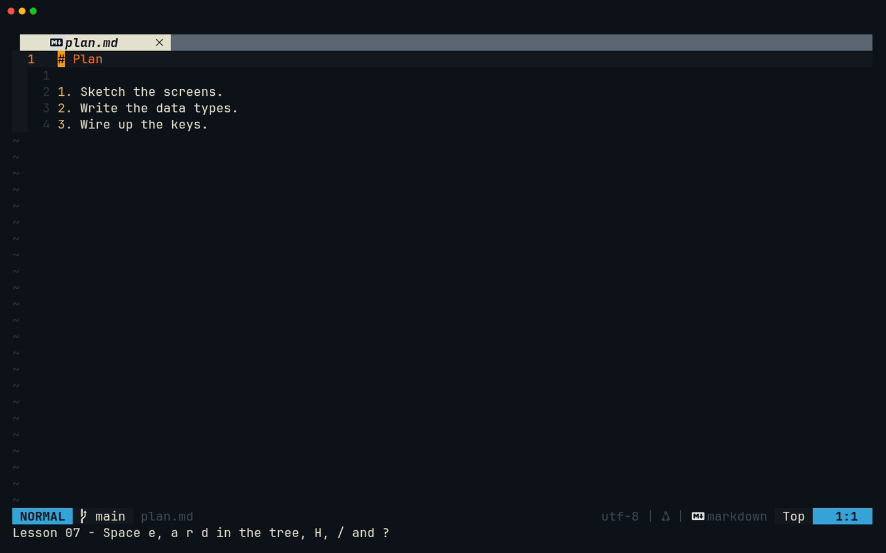
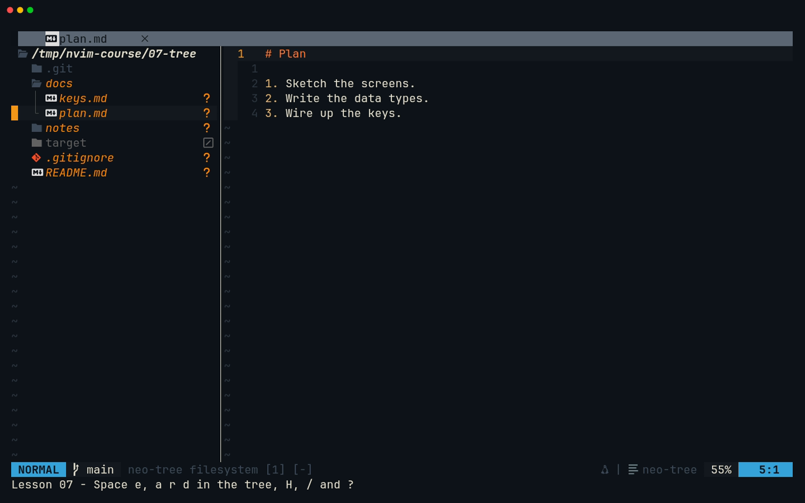
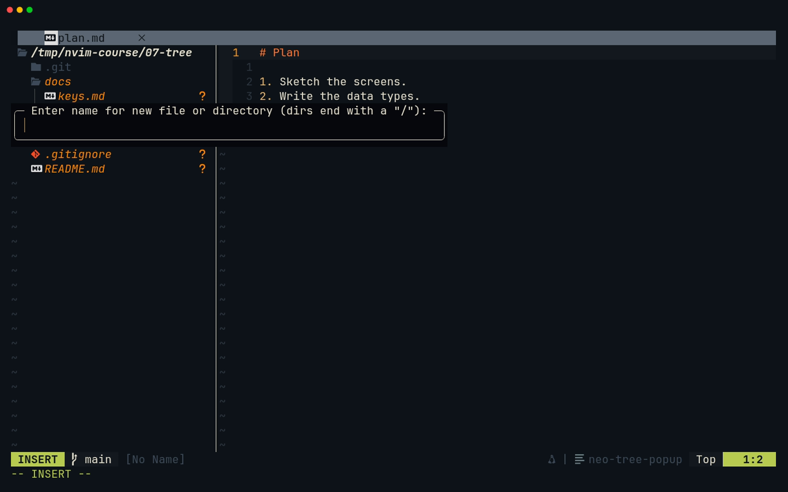
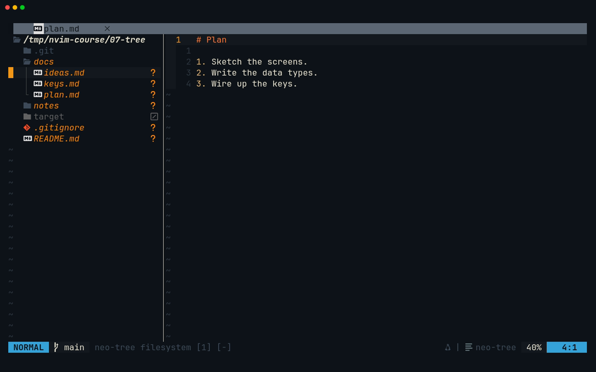
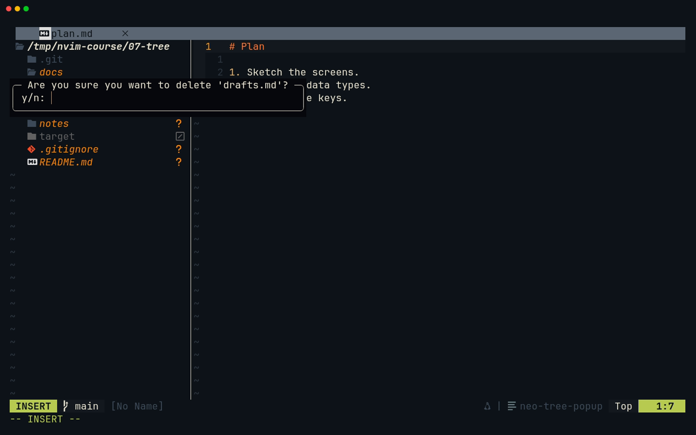
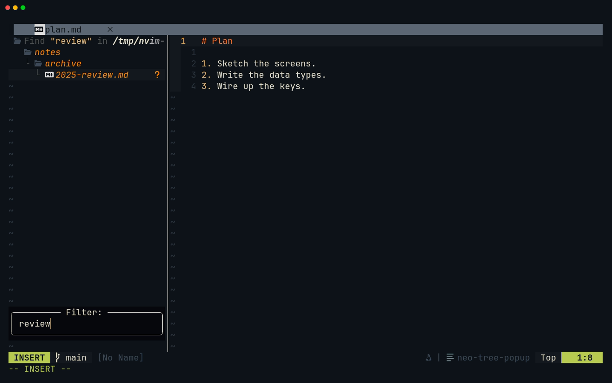
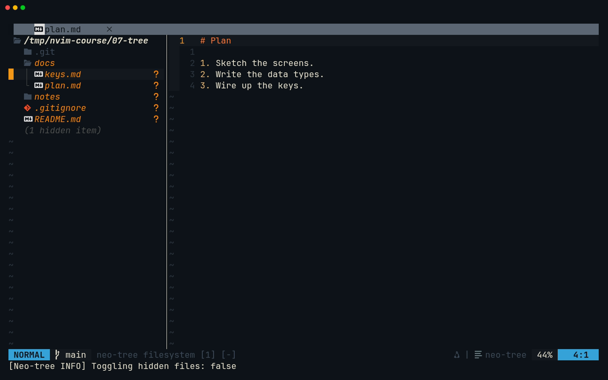
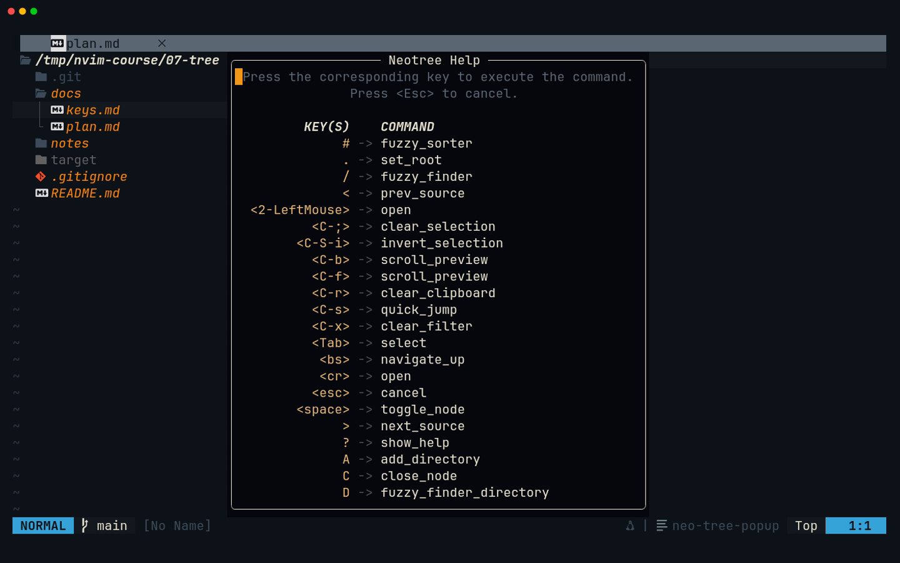

# Lesson 07 — Tree

**Last Updated**: 27/09/2026
**Version**: 1.0.0
**Maintained By**: Development Team
**Language**: British English (en_GB)
**Timezone**: Europe/London

---

This lesson is about the **Tree**: the neo-tree filesystem explorer on the left (`<leader>e`, that is Space e)
and every file operation you do from it. (In this course the **File Pane** is the editing area with its
buffers, windows and splits, taught in [lesson 08](08-FILE-PANE.md); the **Project Pane** is the whole-project
view of docks, search and outline, taught in [lesson 09](09-PROJECT-PANE.md).) You learn to move through the
tree, to create, rename, copy, move and delete files and folders without touching the mouse, to filter it, and
to read what this config makes it show: git status, diagnostics and dimmed ignored files. You also learn which
of your keys mean something else while you are in it. Then you give both capstones their module layout, every
file created from the tree.

**Part**: 3 — Workspace · **Time**: ~75 min · **Previous**: [Lesson 06 — Terminal](06-TERMINAL.md) · **Next**: [Lesson 08 — File Pane](08-FILE-PANE.md)

## Objectives

By the end of this lesson you can:

- open, enter, leave and close the tree, and explain why `<leader>e` from the editor closes an open tree;
- move through it, expand and collapse folders, change its root, and let it follow the file you are editing;
- create files and folders with `a` (a trailing `/` makes a folder), several at once with braces;
- rename (`r`, `b`), copy and move (`c`, `m`, and `y` / `x` / `p`) and delete (`d`, `T`) from the tree;
- open a file in a split or a tab, preview it and show its details;
- filter the tree with `/`, `f` and `D`, and show or hide ignored files with `H`;
- read its git and diagnostic marks and say which config line produces each effect;
- name the keys the tree takes over, and find any of its keys with `?`;
- create the module files of just-panel (JP1) and session-browser (SB1) from the tree, and check both.

## Before you start

- You have finished [lesson 06](06-TERMINAL.md): milestones **JP0** and **SB0** are done.
  `cargo run -p just-panel` in `rust/` prints `Hello, world!`, `uv run session-browser` in
  `python/session-browser/` opens the app, and nothing is committed.
- The walkthrough uses a **throwaway practice tree**, so you can delete things freely. Make it from the course
  fixture, turn it into a git repository (for the git marks), and give it one ignored folder:

  ```bash
  # in ~/Repos/personal/nix-config
  L=/tmp/nvim-course/07-tree
  rm -rf "$L" && mkdir -p "$L" && cp -r docs/NEOVIM-COURSE/fixtures/07-tree/. "$L"
  cd "$L" && git init -q && printf 'target/\n' > .gitignore
  mkdir -p target && printf 'build output\n' > target/output.txt
  nvim
  ```

  A bare `nvim` opens the dock layout: the tree on the left, the editor on the right, a terminal across the
  bottom (neovim.nix:889-905). The tree's root is Neovim's working directory, here `/tmp/nvim-course/07-tree`.
- The milestone at the end goes back to the repository.

## Keys in this lesson

In this table `<leader>` means **Space** (`vim.g.mapleader = ' '`, neovim.nix:210). The rows marked
"Normal (tree)" mean this only **inside the tree**: neo-tree maps them buffer-locally and sets no global keys of
its own.

| Keys | Mode | Action | Where it comes from |
| --- | --- | --- | --- |
| `<leader>e` | Normal | open the tree and move into it; if it is open, close it | config (neovim.nix:24) |
| `<C-h>` / `<C-l>` | Normal | window left (into the tree) / right (back to the editor) | config (neovim.nix:68, :71) |
| `:pwd` | Command | show Neovim's working directory, which is the tree's root | Neovim default |
| `j` `k` `gg` `G` | Normal (tree) | move, as in any buffer | Neovim default |
| `<CR>` | Normal (tree) | open a file in the editor, or expand / collapse a folder | neo-tree default |
| `<Space>` | Normal (tree) | expand / collapse (waits 300 ms for a `<leader>` key) | neo-tree default |
| `C` / `z` | Normal (tree) | collapse this folder (or its parent) / collapse everything | neo-tree default |
| `<BS>` / `.` | Normal (tree) | root up one level / root at the folder under the cursor | neo-tree default |
| `a` / `A` | Normal (tree) | add a file (trailing `/` = folder) / add a folder | neo-tree default |
| `r` / `b` | Normal (tree) | rename / rename without touching the extension | neo-tree default |
| `c` / `m` | Normal (tree) | copy / move, typing the destination | neo-tree default |
| `y` / `x` / `p` | Normal (tree) | mark for copy / mark for cut / paste the marked entries here | neo-tree default |
| `d` / `T` | Normal (tree) | delete (asks first) / move to the trash (asks first) | neo-tree default |
| `s` / `S` / `t` | Normal (tree) | open in a vertical split / a horizontal split / a new tab | neo-tree default |
| `P` / `<Esc>` | Normal (tree) | toggle a floating preview / end the preview | neo-tree default |
| `i` | Normal (tree) | show a "File Details" popup (path, size, dates, git code) | neo-tree default |
| `/` / `D` / `f` / `<C-x>` | Normal (tree) | filter as you type / folders only / filter on Enter / clear the filter | neo-tree default |
| `H` | Normal (tree) | show or hide filtered (here: git-ignored) entries | neo-tree default |
| `[g` / `]g` | Normal (tree) | previous / next changed file that git tracks (untracked and ignored ones are skipped) | neo-tree default |
| `<C-s>` | Normal (tree) | jump labels: type one to jump to that entry | neo-tree default |
| `R` | Normal (tree) | rescan the disk | neo-tree default |
| `<` / `>` | Normal (tree) | previous / next source: filesystem, buffers, git_status | neo-tree default |
| `?` | Normal (tree) | list every key of the tree; press one to run it | neo-tree default |
| `q` | Normal (tree) | close the tree | neo-tree default |
| `<CR>` / `<Esc>` | tree prompt | confirm / cancel the name you are typing | neo-tree default |
| `y` then `<CR>` | delete prompt | confirm the deletion; anything else cancels | neo-tree default |

## Walkthrough

### 1. Open, enter, leave, close

`<leader>e` (Space e) runs `Neotree toggle filesystem left` (neovim.nix:24). Neo-tree's default action is
**focus**, so opening the tree also moves the cursor into it. `toggle` means that if the tree is already open,
focused or not, the same key **closes** it.

That gives four moves:

| You are | You want | Press |
| --- | --- | --- |
| in the editor, tree closed | the tree, cursor in it | `<leader>e` |
| in the editor, tree open | the cursor in the tree | `<C-h>` (window left), **not** `<leader>e` |
| in the tree | back to the editor | `<C-l>` (neo-tree does not map it) |
| in the tree | the tree gone | `q`, or `<leader>e` |

The dock layout opens the tree with `Neotree show` (neovim.nix:896), which keeps the cursor in the editor. So
after a bare start the tree is open and you reach it with `<C-h>`. It is 30 columns wide, on the left
(neovim.nix:649).

**Try it**

1. In the practice Neovim, press `<C-h>`. The cursor is in the tree.
2. Press `<C-l>`. Back in the editor.
3. Press `Space e`. The tree closes: it was open.
4. Press `Space e` again. It opens, and the cursor is in it.

**What you should see**



[MP4](../media/07-tree/07-tree.mp4)

The top line is the root, `/tmp/nvim-course/07-tree`. Below it come the folders (`.git` first, because dotfiles
are shown, then `docs`, `notes` and `target`), then the files (`.gitignore`, `README.md`). (The recording opened
`docs/plan.md` first, so in it `docs` is already expanded.) `target` is greyed out, with the ignored mark (a box
with a slash through it) on the right. Everything else in the fresh repository is untracked: drawn in orange,
with an orange `?` on the right. Two folders have no mark: `.git`, which git never reports on (so it keeps the
theme's plain grey folder colour), and, in the recording, `docs`, because neo-tree hides a folder's mark while
it is expanded and leaves it to the files inside. Steps 7 and 8 explain the marks.



> **Zed habit:** Zed's project panel is the same idea. Here the whole panel is driven by single keys, and
> `<C-h>` / `<C-l>` move between it and your code, exactly as between any two windows.

### 2. Moving around

The tree is a buffer, so `j`, `k`, `gg`, `G`, `<C-d>` and `<C-u>` move as usual. On top of that:

| Keys | Effect |
| --- | --- |
| `<CR>` | on a folder: expand or collapse it; on a file: open it in the editor and move there |
| `<Space>` | expand or collapse. neo-tree lets this key wait 300 ms, so that a brisk `Space e` still reaches your `<leader>e` |
| `C` | collapse the folder under the cursor, or the one the file under the cursor is in |
| `z` | collapse every folder |
| `<BS>` | move the root up one level |
| `.` | make the folder under the cursor the root |
| `<C-s>` | letters appear next to the entries; type one to jump there (and open or toggle it) |
| `[g` / `]g` | previous / next changed file that git already tracks (wraps round). Untracked and ignored entries are skipped, so in the fresh practice repository, where everything is untracked, they go nowhere |

Three behaviours come from the config or from neo-tree's defaults:

- **Files open in the editor, never in a panel.** `open_files_do_not_replace_types` (neovim.nix:643-646) lists
  the terminal, the outline, Trouble, quickfix and the git panels. `<CR>` never puts a file into one of those
  windows, so it cannot push your terminal out of the dock.
- **The tree follows the file you edit.** `follow_current_file` is on (neovim.nix:650). Open a file any way
  you like (`:e`, Telescope, a jump) and the tree expands to it and puts its cursor on it. Folders it opened
  this way close again when it follows the next file.
- **The root is Neovim's working directory, both ways round.** neo-tree's `bind_to_cwd` default ties them
  together. `.` and `<BS>` therefore change `:pwd`, and with it where `:e path` looks, where Telescope
  searches, and where a new terminal starts. `:cd` in turn moves the tree.

**Try it**

1. In the tree, put the cursor on `docs` and press `<CR>`. It expands: `keys.md`, `plan.md`.
2. `j` onto `plan.md`, `<CR>`. The file opens in the editor and the cursor goes with it.
3. `<C-h>` back to the tree. The cursor is still on `plan.md`.
4. Put the cursor on `notes`, press `<CR>`, then `C`: it expands and collapses.
5. On `docs`, press `.`, then run `:pwd`. The root and the working directory are both `…/07-tree/docs`.
6. Press `<BS>` and `:pwd` again: both are back at `…/07-tree`.

**What you should see:** the folder arrows open and close, the tree's top line changes with `.` and `<BS>`, and
`:pwd` always agrees with it.

### 3. Creating files and folders: `a` and `A`

`a` opens a small prompt with a rounded border (`popup_border_style`, neovim.nix:634) titled "Enter name for
new file or directory (dirs end with a "/"):".

- **Where it goes:** into the folder under the cursor, or next to the file under the cursor. (neo-tree's default
  `insert_as = "child"`.)
- **A name ending in `/`** makes a folder: `drafts/`. `A` makes a folder without the slash.
- **A path** creates any missing folders on the way: `2026/january.md`.
- **Braces** make several at once: `{one,two,three}.md` creates three files, `notes.txt{,.bak}` two.
- **Afterwards** the cursor sits on the new entry in the tree. The file is **not** opened: press `<CR>` for that.
- **An existing name** only gets a "File already exists" warning. Nothing is overwritten.
- **`<Esc>`** closes the prompt without creating anything.

**Try it**

1. Put the cursor on `docs/plan.md` and press `a`. Type `ideas.md` and press Enter. `docs/ideas.md` appears,
   with the cursor on it.
2. `a` again, `drafts/`, Enter: a folder `docs/drafts`, the cursor on it.
3. With the cursor on `drafts`, `a`, `{one,two}.md`, Enter: two files **inside** `drafts`.
4. `<CR>` on `one.md` opens it. Type a line, `:w`, then `<C-h>` back to the tree.

**What you should see**





> **Zed habit:** in Zed you create files from the project panel's context menu. Here `a`, a name and Enter do it
> from the keyboard, and one line such as `tests/{conftest,test_app}.py` makes a folder and two files at once.

### 4. Renaming, copying and moving

| Keys | Prompt | What to type |
| --- | --- | --- |
| `r` | `Enter new name for "<name>":`, pre-filled with the current name, cursor at the end | the new name (a buffer that has the file open is renamed with it) |
| `b` | `Enter new base name for "<name>":`, pre-filled without the extension | the new base name; the extension stays |
| `c` | `Copy "<name>" to:`, pre-filled with the name | a new name, or a path relative to the file's folder, such as `../copy.md` or `old/copy.md` |
| `m` | `Move "<name>" to:`, pre-filled the same way | the destination, as for `c` |

The pre-filled name is where the copy would go, and you edit it. Missing folders in the destination are
created. If the destination already exists, neo-tree asks again with `<name> already exists. Please enter a
new name:`; nothing is overwritten.

`y`, `x` and `p` work without typing: `y` marks the entry under the cursor for copying (press it again to
unmark), `x` marks it for moving, and `p` on a folder, or on a file inside it, copies or moves everything marked
into that folder. This is neo-tree's own clipboard, not the system one, so it never touches what you yanked in
the editor. `<C-r>` clears the marks.

**Try it**

1. On `docs/ideas.md`, press `r`. Backspace over the name, type `todo.md`, Enter.
2. On `todo.md`, `c`, then change the name to `../todo-copy.md`, Enter: a copy at the root.
3. On `todo-copy.md`, `x`, move the cursor onto `notes`, `p`: it moves into `notes`.
4. On `README.md`, `b`: the prompt shows `README` only. `<Esc>` cancels.

**What you should see:** each change appears at once, and the tree keeps its cursor near your last action.

### 5. Deleting: `d` (and `T`)

`d` opens a prompt titled "Are you sure you want to delete '<name>'?" with ` y/n: ` inside. Type `y` and press
Enter. Anything else, `<Esc>` included, cancels.

- A folder is deleted with everything in it. neo-tree's source has a warning for folders that are not empty,
  but in 3.42.0 it never fires (its check compares the file's details with the word `"directory"`, which is
  never equal), so the title looks the same for an empty folder and a full one. Read the name.
- The entry is removed from the disk at once. Neovim's `u` cannot bring it back, and neither can git if it was
  never committed.

`T` moves the entry to the trash instead, after the same kind of question ("Are you sure you want to trash
'<name>'?"), and `u` in the tree undoes the last trash. neo-tree uses `gio trash` when `gio` is installed,
otherwise its own freedesktop trash (verify on laptop-intel which one runs, and that your file manager's trash
shows the file). If `gio` refuses, neo-tree only prints a warning and the file stays where it was: on Ubuntu,
`gio` refuses files under `/tmp` ("Can’t move to Rubbish Bin on system internal mounts"), so `T` may not work
in the practice tree.

**Try it**

1. On `docs/todo.md`, press `d`, then `y` and Enter. It is gone.
2. On `docs/drafts`, press `d`. The title only names `drafts`, with no word about the two files in it. Press
   `<Esc>`: nothing happens.

**What you should see**



### 6. Opening elsewhere, previewing, details

| Keys | Effect |
| --- | --- |
| `s` / `S` / `t` | open the file in a vertical split / a horizontal split / a new tab |
| `P` | toggle preview mode: a floating window shows the file under the cursor as you move |
| `l` | move into the preview window |
| `<C-f>` / `<C-b>` | scroll the preview without leaving the tree |
| `<Esc>` | end preview mode |
| `i` | a "File Details" popup: name, path, type, size, dates, and the git code when the file has one; `<Esc>` or Enter closes it |
| `e` | let the tree grow wider when a name does not fit |
| `w` | **dead here**: it needs the `nvim-window-picker` plugin, which is not installed |

**Try it**

1. On `docs/keys.md`, press `P`, then `j` and `k`: the preview follows the cursor. `<Esc>` ends it.
2. On `README.md`, `s`: it opens in a new vertical split to the right of the editor, and the cursor goes with
   it. `:q` closes that split again (splits are [lesson 08](08-FILE-PANE.md)), then `<C-h>` takes you back to
   the tree. (From the split itself, `<C-h>` would first land in the editor window between it and the tree.)
3. On `notes/scratch.txt` (expand `notes` first), `i`: size and dates. `<Esc>` closes the popup.

### 7. Finding things, and the dimmed entries

| Keys | Prompt title | Behaviour |
| --- | --- | --- |
| `/` | `Filter:` | fuzzy filter as you type. `<C-n>` / `<C-p>` (or the arrow keys) move through the results; `<CR>` opens the selected entry and clears the filter; `<Esc>` closes and clears |
| `D` | `Filter Directories:` | the same, folders only |
| `f` | `Search:` | applies the filter when you press Enter, and **keeps** it; `<C-x>` clears it |
| `#` | `Filter:` | like `/`, with the matches ranked by how well they score |

The filters search the whole tree under the root, collapsed folders included, using `fd` (which the config
puts on Neovim's `PATH`, neovim.nix:194).

**Dimmed entries and `H`.** neo-tree can hide dotfiles and git-ignored files. This config shows all of them
(neovim.nix:654-658):

- `hide_dotfiles = false`: `.git/`, `.gitignore` and, in the repository, `.envrc` and `.claude/` are ordinary
  entries.
- `hide_gitignored = true` together with `visible = true`: git-ignored entries are **shown, but dimmed**. In the
  practice tree that is `target/`; in the repository it is `rust/target/` (large: do not expand it) and, since
  lesson 06, `python/session-browser/.venv/`.

`H` toggles whether those filtered entries are shown at all, and neo-tree reports the new state
("Toggling hidden files: false", then `true`).

`o` opens an "Order by" menu; the second key picks the order (`on` name, `om` modified, `os` size, `ot` type,
`og` git status, `od` diagnostics, `oc` created).

**Try it**

1. Press `/`, type `review`. The tree shrinks to `notes/archive/2025-review.md`. Press `<Esc>`: the whole tree
   is back.
2. `/` and `scratch`, then `<CR>`: `scratch.txt` opens in the editor and the filter is gone. `<C-h>` back.
3. `f`, `plan`, Enter: the filter stays after Enter. `<C-x>` clears it.
4. `H`: `target/` disappears. `H` again: it is back, dimmed.

**What you should see**





### 8. What this config changes

Every option below is in `require('neo-tree').setup` (neovim.nix:632-669). Everything else is neo-tree 3.42.0's
default.

| Setting (line) | Effect you see |
| --- | --- |
| `close_if_last_window = true` (:633) | the tree never stays behind as the only window in a tab |
| `popup_border_style = 'rounded'` (:634) | the rounded prompts of steps 3 to 5 |
| `enable_git_status = true` (:635) | git marks: untracked, modified, staged and ignored entries look different, and a collapsed folder shows that something inside it changed |
| `enable_diagnostics = true` (:636) | files with language-server errors or warnings get a diagnostic mark |
| `sources = { 'filesystem', 'buffers', 'git_status' }` (:637) | the three things `<` / `>` cycle through in the same window |
| `open_files_do_not_replace_types = { … }` (:643-646) | `<CR>` never opens a file into the terminal, the outline, Trouble, quickfix or a git panel |
| `window = { position = 'left', width = 30 }` (:649) | the tree's place and width |
| `follow_current_file.enabled = true` (:650) | the tree reveals the file you are editing |
| `use_libuv_file_watcher = true` (:653) | the tree watches the disk: files made in a terminal (`cargo new`, `uv init`, `rm`) appear or vanish without `R`. The comment above it names the reason: a `nixos-rebuild` writing into the tree |
| `filtered_items = { visible = true, hide_dotfiles = false, hide_gitignored = true }` (:654-658) | dotfiles shown normally, ignored entries shown dimmed, `H` toggles them |

The `git_status` source (`<leader>gs`, on the right, neovim.nix:661-663) and the `buffers` source (`<leader>b`,
neovim.nix:665-668) are the same plugin with other contents: lessons [12](12-GIT.md) and
[08](08-FILE-PANE.md).

> **Gotcha:** `>` in the tree switches the **same** window to the buffers list, and `>` again to git_status.
> In the git_status source `gg` commits **and pushes**, `A` stages everything without asking, and `gr` reverts a
> file ([lesson 12](12-GIT.md)). If you cycled there by accident, `<` twice takes you back to the files.

### 9. Keys the tree takes over, and `?`

Inside the tree neo-tree's buffer-local maps beat your global ones ([lesson 05](05-YOUR-KEYBINDINGS.md), step 7):

| Key | In the tree | Normally |
| --- | --- | --- |
| `<Tab>` | tag the entry as selected | next buffer (neovim.nix:61) |
| `<C-s>` | jump labels | save (neovim.nix:64) |
| `<Space>` | expand / collapse; no which-key popup appears in the tree | the which-key popup for `<leader>` |
| `/` and `?` | filter, and this key list | search forward and backward |
| `f`, `t` | filter on Enter, open in a tab | jump to / till a character |
| `H`, `l` | toggle filtered entries, focus the preview | top of the screen, right |
| `.` | set the root | repeat the last change |
| `q` | close the tree | record a macro |
| `c`, `d`, `x`, `y`, `p`, `r`, `s`, `S` | file operations | editing |
| `u`, `<C-r>` | undo the last trash, clear the marks | undo, redo |
| `<C-f>`, `<C-b>` | scroll the preview | scroll a page |

Still yours: `j`, `k`, `gg`, `G`, `<C-d>`, `<C-u>`, `:`, and the window keys `<C-h>` / `<C-j>` / `<C-k>` /
`<C-l>` (neo-tree maps none of them). `<leader>` keys work too if you type them briskly, within 300 ms of
Space.

`?` opens a popup that starts "Press the corresponding key to execute the command. Press <Esc> to cancel." and
lists every key with its command. Pressing a listed key runs it; `<Esc>` closes the list.

**Try it**

In the tree, press `?`, read the list, then `<Esc>`. Press `<C-s>`, then one of the letters that appear.

**What you should see**



## Gotchas in this config

1. **`<leader>e` closes an open tree.** It is a toggle (neovim.nix:24). **Fix:** `<C-h>` to reach an open tree
   from the editor; `<leader>e` only when it is closed.
2. **Ignored folders are visible.** `rust/target/` (large) and `python/session-browser/.venv/` show up dimmed
   (neovim.nix:654-658). **Fix:** leave them collapsed, or `H`.
3. **`.` and `<BS>` move Neovim, not only the tree.** neo-tree's `bind_to_cwd` changes the working directory,
   so `:e` paths, Telescope and new terminals follow. **Fix:** check `:pwd`; `<BS>` back up to the repository
   root, or `:cd ~/Repos/personal/nix-config`.
4. **`<` / `>` can land you in the git_status source,** where `gg`, `A` and `gr` change your repository
   (neovim.nix:637). **Fix:** `<` back to filesystem; never press `gg` there.
5. **`d` is final, and silent about what a folder holds.** There is no undo for a deleted file, an untracked
   file is not in git either, and neo-tree 3.42.0 never warns that a folder is not empty. **Fix:** read the name
   in the prompt's title before `y`. Use `T` when in doubt.
6. **Muscle memory inside the tree.** `<C-s>` shows jump labels instead of saving, `<Tab>` tags an entry
   instead of switching buffers, `/` filters instead of searching (step 9). **Fix:** `<C-l>` out of the tree
   first.
7. **`w` only prints a message about a window picker.** The plugin it needs is not installed. **Fix:** `s`, `S`
   or `t`.
8. **`y` / `x` / `p` are not the system clipboard.** They mark entries for the tree only. **Fix:** in the tree,
   `y` then `p`; in files, your usual registers.
9. **Saving a TOML file reformats it.** Format-on-save falls back to the taplo language server
   (neovim.nix:933-936, :974-977). **Fix:** `:noautocmd w` for `Cargo.toml` and `pyproject.toml` in this course.
10. **New modules look broken for a moment.** rust-analyzer may flag a new `.rs` file as not part of the crate
    until `main.rs` declares it with `mod`, and pyright may not resolve `textual` or `pytest` imports until
    [lesson 10](10-LSP.md) points it at `.venv`. **Fix:** finish the milestone; trust the terminal checks.

## Drills

Drills 1 to 5 use the practice tree; 6 to 8 the repository.

1. **Nested in one go.** Create `notes/2026/` holding `january.md` and `february.md` with a single `a`.

   <details><summary>Answer</summary>

   Put the cursor on `notes` (or on a file inside it), `a`, then `2026/{january,february}.md` and Enter. The
   braces make two paths, and neo-tree creates the missing `2026` folder for each.

   </details>

2. **Rename versus base name.** Rename `docs/keys.md` to `docs/shortcuts.md`, then rename it to
   `docs/shortcuts.txt`, each time typing as little as possible.

   <details><summary>Answer</summary>

   `b` on `keys.md` shows `keys`: replace it with `shortcuts`, Enter (the `.md` stays). Then `r` on
   `shortcuts.md`: three Backspaces remove `.md`, type `.txt`, Enter.

   </details>

3. **Copy without typing.** Put a copy of `README.md` into `docs` without typing a path.

   <details><summary>Answer</summary>

   `y` on `README.md`, then the cursor on `docs` (or any file in it), then `p`. `c` would also work, but you
   would type `docs/README.md` into its prompt.

   </details>

4. **A safe delete.** Delete the `notes/archive` folder and its file with one confirmation, and cancel the first
   time.

   <details><summary>Answer</summary>

   `d` on `archive`: the title asks "Are you sure you want to delete 'archive'?" and does not mention the file
   inside. `<Esc>` cancels. `d` again, `y`, Enter removes the folder and its file together.

   </details>

5. **Where am I?** Press `.` on `notes`, then open a new terminal with `:TermNew` and run `pwd`. Explain the
   result, and undo the change of root.

   <details><summary>Answer</summary>

   `pwd` prints `…/07-tree/notes`: `.` changed Neovim's working directory (`bind_to_cwd`), and a new terminal
   starts there. In the tree, `<BS>` moves the root, and the working directory, back up. To hide the terminals,
   `<C-\><C-n>` first, then `Space t`.

   </details>

6. **Let the tree find it.** In the repository Neovim, run `:e rust/just-panel/src/main.rs`, then `<C-h>`.
   Where is the tree's cursor, and why?

   <details><summary>Answer</summary>

   On `main.rs`, inside the expanded `rust/just-panel/src`: `follow_current_file` (neovim.nix:650) reveals the
   file you are editing. This is the quickest way to put the tree's cursor where you want to create a file.

   </details>

7. **Walk the changes.** After the milestone, in the repository tree, put the cursor on any file and press `]g`
   a few times. Which files does it visit, and which does it skip?

   <details><summary>Answer</summary>

   Only changed files that git already tracks: `rust/Cargo.lock` and `rust/Cargo.toml` (plus anything else you
   had changed before lesson 06). neo-tree 3.42.0's `]g` skips entries whose git status is untracked (`?`) or
   ignored (`!`), and it only lands on files, never folders. So `python/`, `rust/just-panel/` and every new file
   inside them are skipped, even though they are what you just made; so are unchanged files. It wraps round at
   the end. To see the untracked files, use the git marks in the tree or `git status --short`.

   </details>

8. **Find a file in a big tree.** After the milestone (it creates the file), open
   `rust/just-panel/src/sections.rs` from the tree without expanding anything by hand.

   <details><summary>Answer</summary>

   `/`, type `sections`, move to `rust/just-panel/src/sections.rs` with `<C-n>` if another match is first,
   then `<CR>`: it opens and the filter clears.

   </details>

## Milestone JP1 + SB1

**Goal:** both capstones get their module layout, and every new file is created from the tree.

- **just-panel (JP1):** five modules, each holding only a one-line module doc; `main.rs` gets a crate doc with a
  module map and the five `mod` lines; `Cargo.toml` gets a `[[bin]]` section. It still prints
  `Hello, world!`, with no warnings.
- **session-browser (SB1):** the app moves to `app.py`; `models.py`, `actions.py` and a `sources` package with
  one module per tool, each holding only a docstring; a `tests` folder with a test that imports every module;
  `pyproject.toml` points the script at `app.py` and configures pytest. 8 tests pass.

A module that holds only its doc comment has no code, so nothing can be unused: both projects stay free of
warnings until the next lessons fill the files in.

### Step 0: back in the repository

Quit the practice Neovim with `:qa!`. Start the repository's, and set up the two terminals as in lesson 06:

```bash
# in a Kitty terminal
cd ~/Repos/personal/nix-config && nvim
```

1. Terminal 1 is the dock's terminal. If terminal 2 is missing, `:2ToggleTerm` from Normal mode.
2. `:1ToggleTermSetName rust` and `:2ToggleTermSetName python`.
3. In terminal 1, `cd rust`. In terminal 2, `cd python/session-browser`.

To paste code, use lesson 06's method ([Step 0 tip](06-TERMINAL.md#step-0-two-named-terminals)): copy a
block, then `:0put +` and `:$d _` in a new file, `:%d _` first to replace a whole file, `:w` to save
(`:noautocmd w` for TOML).

### Step 1: JP1, five module files

1. `:e rust/just-panel/src/main.rs`, then `<C-h>`. The tree's cursor is on `main.rs` (drill 6).
2. `a`, type `justfile.rs`, Enter. The cursor is on the new file.
3. `<CR>` opens it. Paste its line (below), `:w`, then `<C-h>` back to the tree.
4. `a`, type `{sections,app,ui,runner}.rs`, Enter: four more files next to `main.rs`.
5. For each of them: move onto it, `<CR>`, paste its line, `:w`, `<C-h>`.

`rust/just-panel/src/justfile.rs`

```rust
//! The justfile model: recipes and their parameters, loaded from `just --dump`.
```

`rust/just-panel/src/sections.rs`

```rust
//! Section banners: which `# ====` heading each recipe sits under in the source.
```

`rust/just-panel/src/app.rs`

```rust
//! The panel's state, and what each key press does to it.
```

`rust/just-panel/src/ui.rs`

```rust
//! Drawing the panel with ratatui.
```

`rust/just-panel/src/runner.rs`

```rust
//! Running a recipe in the real terminal and taking the screen back afterwards.
```

`//!` is an inner doc comment: it documents the module the file is, and `cargo doc` shows it as the module's
summary.

### Step 2: JP1, `main.rs` and `Cargo.toml`

**`main.rs`.** Put the cursor on `main.rs` in the tree, `<CR>`, then replace the whole file (`:%d _`,
`:0put +`, `:$d _`) with the following, and `:w`:

`rust/just-panel/src/main.rs`

```rust
//! just-panel: a terminal control panel for a justfile.
//!
//! Lists the recipes of a justfile under the section banners of the file
//! itself, shows what the selected recipe does, and runs it in the real
//! terminal.
//!
//! MODULES
//!
//!   justfile   what a recipe is, and loading recipes with `just --dump`
//!   sections   which `# ====` banner each recipe sits under
//!   app        the panel's state, and what each key press does to it
//!   ui         drawing that state with ratatui
//!   runner     handing the terminal to a recipe and taking it back

mod app;
mod justfile;
mod runner;
mod sections;
mod ui;

fn main() {
    println!("Hello, world!");
}
```

The five `mod` lines tell the compiler the files are part of the crate. They are in alphabetical order because
that is how `rustfmt` sorts them, so format-on-save leaves them alone.

**`Cargo.toml`.** `:e rust/just-panel/Cargo.toml` (the tree follows: it is the entry just below `src` and its
files), and replace the whole file with the following. Save with `:noautocmd w`.

`rust/just-panel/Cargo.toml`

```toml
[package]
name = "just-panel"
version.workspace = true
edition.workspace = true
authors.workspace = true
license.workspace = true

[[bin]]
name = "just-panel"
path = "src/main.rs"

[dependencies]
```

The only change from JP0 is the `[[bin]]` section: every crate in `rust/` names its binary this way,
`dev-layout` included (rust/dev-layout/Cargo.toml:8-10).

**Check it:**

```bash
# in ~/Repos/personal/nix-config/rust (terminal 1)
cargo build -p just-panel
cargo test -p just-panel
cargo clippy -p just-panel --all-targets -- -D warnings
cargo fmt -p just-panel --check
cargo run -p just-panel
```

| Command | Expect |
| --- | --- |
| `cargo build -p just-panel` | `Finished`, with no `warning` lines |
| `cargo test -p just-panel` | `running 0 tests` and `test result: ok. 0 passed` |
| `cargo clippy …` | `Finished`, with no `warning` lines |
| `cargo fmt … --check` | no output at all |
| `cargo run -p just-panel` | `Hello, world!` |

### Step 3: SB1, the package layout

Six new modules, created from the tree:

1. `:e python/session-browser/src/session_browser/__init__.py`, then `<C-h>`. The cursor is on `__init__.py`.
2. `a`, `app.py`, Enter; `<CR>`; paste the whole of `app.py` (below); `:w`; `<C-h>`.
3. `a`, `{models,actions}.py`, Enter. Open each, paste its line, `:w`, `<C-h>`.
4. `a`, `sources/`, Enter: a folder, with the cursor on it.
5. With the cursor on `sources`, `a`, `{__init__,claude,codex,kitty}.py`, Enter: four files **inside**
   `sources`. Open each, paste its line, `:w`, `<C-h>`.

`python/session-browser/src/session_browser/app.py`

```python
"""The Textual app: the session list, the preview and the key bindings."""

from textual.app import App, ComposeResult
from textual.widgets import Footer, Header


class SessionBrowser(App[None]):
    """For now just the frame: a title bar, a key bar and a way out."""

    TITLE = "Session browser"
    BINDINGS = [("q", "quit", "Quit")]

    def compose(self) -> ComposeResult:
        yield Header()
        yield Footer()


def main() -> None:
    SessionBrowser().run()
```

It is SB0's app, moved; only the first line, the module docstring, is new.

`python/session-browser/src/session_browser/models.py`

```python
"""Plain data types shared by the sources, the actions and the app."""
```

`python/session-browser/src/session_browser/actions.py`

```python
"""Turn a session into the command that resumes or opens it."""
```

`python/session-browser/src/session_browser/sources/__init__.py`

```python
"""Session sources: one module per tool that keeps its sessions on disk."""
```

`python/session-browser/src/session_browser/sources/claude.py`

```python
"""Claude Code sessions, read from ~/.claude/projects."""
```

`python/session-browser/src/session_browser/sources/codex.py`

```python
"""Codex sessions, read from ~/.codex/sessions."""
```

`python/session-browser/src/session_browser/sources/kitty.py`

```python
"""Kitty session files, read from ~/.local/share/kitty/sessions."""
```

**`__init__.py` shrinks to its docstring.** The app now lives in `app.py`. Put the cursor on `__init__.py` in
the tree, `<CR>`, replace the whole file with this one line, and `:w`:

`python/session-browser/src/session_browser/__init__.py`

```python
"""Browse, search and resume Claude Code, Codex and Kitty sessions."""
```

### Step 4: SB1, tests and `pyproject.toml`

**The tests folder.** In the editor, `:e python/session-browser/pyproject.toml` (you edit it in a moment
anyway), then `<C-h>`: the tree's cursor is on `pyproject.toml`. `a` creates next to it, in the project folder:

1. `a`, `tests/`, Enter: the folder, with the cursor on it.
2. `a`, `{conftest,test_imports}.py`, Enter: two files inside `tests`. Open each, paste, `:w`, `<C-h>`.

`python/session-browser/tests/conftest.py`

```python
"""Shared pytest fixtures."""
```

`python/session-browser/tests/test_imports.py`

```python
"""Every module in the package imports cleanly, stubs included."""

import importlib

import pytest

MODULES = [
    "session_browser",
    "session_browser.actions",
    "session_browser.app",
    "session_browser.models",
    "session_browser.sources",
    "session_browser.sources.claude",
    "session_browser.sources.codex",
    "session_browser.sources.kitty",
]


@pytest.mark.parametrize("name", MODULES)
def test_module_imports(name: str) -> None:
    importlib.import_module(name)
```

One parametrised test, eight cases: it proves that every stub imports cleanly and gives pytest something to run.

**`pyproject.toml`: two changes.** This excerpt, a diff against SB0, shows both:

```diff
 [project.scripts]
-session-browser = "session_browser:main"
+session-browser = "session_browser.app:main"
@@ … @@
+[tool.pytest.ini_options]
+# Textual's Pilot tests are coroutines; "auto" runs every `async def test_*`
+# without a @pytest.mark.asyncio on each one.
+asyncio_mode = "auto"
+testpaths = ["tests"]
+
 [tool.ruff.lint]
```

- The script entry follows `main()` into `app.py`.
- `asyncio_mode = "auto"` is for the Textual tests of later lessons; `testpaths` tells pytest where the tests
  are. The block waited until now because, with `testpaths` set and no `tests` folder, pytest prints a
  confusing warning.

In the `pyproject.toml` buffer (`<C-l>` from the tree):

1. `/session_browser:main` and Enter, then `:s/session_browser:main/session_browser.app:main/` and Enter.
2. Copy this block:

```toml
[tool.pytest.ini_options]
# Textual's Pilot tests are coroutines; "auto" runs every `async def test_*`
# without a @pytest.mark.asyncio on each one.
asyncio_mode = "auto"
testpaths = ["tests"]
```

3. `/^\[tool.ruff.lint\]` and Enter: the cursor is on that header.
4. `:put! +` puts the block **above** the header and leaves the cursor on its last line, `testpaths = …`.
5. `o` then `<Esc>`: an empty line between the new block and `[tool.ruff.lint]`.
6. `:noautocmd w`.

The file now reads as follows. As in lesson 06, the version numbers are whatever uv wrote on your machine
(on laptop-intel the `[build-system]` line reads `uv_build>=0.12.16,<0.13.0`).

`python/session-browser/pyproject.toml`

```toml
[project]
name = "session-browser"
version = "0.1.0"
description = "Browse and resume Claude Code, Codex and Kitty sessions"
readme = "README.md"
requires-python = ">=3.12"
dependencies = [
    "textual>=8.2.8",
]

[project.scripts]
session-browser = "session_browser.app:main"

[build-system]
requires = ["uv_build>=0.12.5,<0.13.0"]
build-backend = "uv_build"

[dependency-groups]
dev = [
    "pytest>=8.4.2",
    "pytest-asyncio>=1.4.0",
    "pytest-textual-snapshot>=1.1",
    "textual-dev>=1.8.0",
]

[tool.pytest.ini_options]
# Textual's Pilot tests are coroutines; "auto" runs every `async def test_*`
# without a @pytest.mark.asyncio on each one.
asyncio_mode = "auto"
testpaths = ["tests"]

[tool.ruff.lint]
# The default rules plus import sorting (I), pyupgrade (UP), bugbear (B) and
# simplify (SIM): they catch real mistakes without burying a small project in
# style noise.
select = ["E", "W", "F", "I", "UP", "B", "SIM"]
```

**Check it:**

```bash
# in ~/Repos/personal/nix-config/python/session-browser (terminal 2)
uv sync
uv run pytest -q
uvx ruff check
uvx ruff format --check
uv run session-browser
```

| Command | Expect |
| --- | --- |
| `uv sync` | updates the environment, including the new script entry |
| `uv run pytest -q` | `8 passed` |
| `uvx ruff check` | `All checks passed!` |
| `uvx ruff format --check` | the files are reported as already formatted (11 of them now) |
| `uv run session-browser` | the same window as in lesson 06, now started from `app.py`; `q` quits |

### Step 5: look at it in the tree

`<C-h>` into the tree and look at both projects:

- `rust/just-panel/src` holds six `.rs` files; `python/session-browser/src/session_browser` holds `app.py`,
  `models.py`, `actions.py` and the `sources` folder, and `tests` sits next to `src`.
- The new folders carry the untracked git mark, and `rust/Cargo.toml` the modified one.
- `.venv/`, `.pytest_cache/`, `.ruff_cache/` and `__pycache__/` are dimmed: the project's `.gitignore` from
  lesson 06 ignores them. `H` hides them.
- `]g` jumps between `rust/Cargo.lock` and `rust/Cargo.toml`, the tracked files you changed. It skips the new,
  untracked files (drill 7).

In a terminal, `(cd ~/Repos/personal/nix-config && git status --short)` still shows the same four entries as
at the end of lesson 06: the new files are inside the two untracked folders. Do not commit yet:
[lesson 12](12-GIT.md) does that.

Stuck? Compare with [examples/just-panel/JP1](../examples/just-panel/JP1/) and
[examples/session-browser/SB1](../examples/session-browser/SB1/) — see [examples/README.md](../examples/README.md).

## Recap

- **`<leader>e`** opens the tree and moves into it, and closes it if it is open. `<C-h>` enters an open tree;
  `<C-l>` leaves it; `q` closes it.
- **Moving:** `<CR>` opens files and folders, `C` and `z` collapse, `.` and `<BS>` move the root **and** Neovim's
  working directory, `<C-s>` jumps by label, `[g` and `]g` visit changed files that git tracks. The tree
  follows the file you edit.
- **Files:** `a` creates (a trailing `/` makes a folder, braces make several, paths create folders), `r` and `b`
  rename, `c` and `m` copy and move by typing, `y` / `x` / `p` without typing, `d` deletes after `y`, `T`
  trashes.
- **Finding:** `/` filters as you type, `f` on Enter, `D` folders only, `<C-x>` clears; `H` hides the dimmed
  ignored entries.
- **This config** shows dotfiles, dims ignored files, marks git and diagnostic state, watches the disk, and
  never opens a file into a panel.
- **Inside the tree** `<Tab>`, `<C-s>`, `/`, `?`, `q` and many letters are neo-tree's; `?` lists them all.
- **JP1 + SB1:** both capstones have their module layout. just-panel builds without warnings and
  session-browser passes 8 tests. Nothing is committed.

Next, [lesson 08](08-FILE-PANE.md) works in the editing area: buffers, windows and splits, with the first data
types typed side by side with the spec.

## Recording

- **Tape:** `tapes/07-tree.tape`. Run it from `docs/NEOVIM-COURSE/` on laptop-intel (full configuration):

  ```bash
  # in ~/Repos/personal/nix-config/docs/NEOVIM-COURSE
  vhs tapes/07-tree.tape
  ```

- **Repository:** the tape neither reads nor writes the repository, so it can be recorded at any milestone.
- **Fixture:** `fixtures/07-tree/` (a `README.md`, `docs/plan.md`, `docs/keys.md`, `notes/scratch.txt` and
  `notes/archive/2025-review.md`; Markdown and plain text, so no language server attaches). The hidden setup
  copies it to `/tmp/nvim-course/07-tree`, runs `git init -q`, writes a `.gitignore` holding `target/` and
  creates `target/output.txt`, exactly like the practice setup in "Before you start". It then opens
  `nvim -i NONE docs/plan.md`, so the tree follows `plan.md` when it opens. The throwaway repository has no
  commits and no remote. claudecode.nvim's lock file goes to `/tmp/nvim-course/07-tree.claude`, outside the
  tree and outside your `~/.claude`.
- **Outputs:** `media/07-tree/07-tree.gif` and `media/07-tree/07-tree.mp4`.
- **VHS version:** `vhs --version` must print 0.12.1, which the config builds (0.12.0 exits 0 and writes nothing);
  if it prints 0.12.0, `just rebuild` first ([Appendix B](../appendices/B-RECORDING-WITH-VHS.md#first-make-sure-vhs-is-0121)).

| Screenshot | Shows | Used in |
| --- | --- | --- |
| `media/07-tree/tree.png` | the tree after `Space e`: `docs` expanded, the cursor on `plan.md`, `target` dimmed | step 1 |
| `media/07-tree/add-prompt.png` | the rounded "Enter name for new file or directory" prompt | step 3 |
| `media/07-tree/added.png` | `docs/ideas.md` created, the cursor on it | step 3 |
| `media/07-tree/delete-confirm.png` | "Are you sure you want to delete 'drafts.md'?" with the ` y/n: ` prompt | step 5 |
| `media/07-tree/hidden-toggled.png` | after `H`: `target` is gone | step 7 |
| `media/07-tree/fuzzy-filter.png` | the `/` filter showing `notes/archive/2025-review.md` | step 7 |
| `media/07-tree/help.png` | the `?` key list | step 9 |

- **What the tape does:** `Space e`; `j`, `<CR>` and `C` on `notes`; `k` back to `plan.md`; `a` `ideas.md`;
  `r` to `drafts.md` (Backspaces, then the new name: `drafts.md` sorts into the same place as `ideas.md`, so
  the cursor stays on the renamed file); `d`, `y`, Enter; `H` twice; `/` `review`, `<Esc>`; `?`, `<Esc>`; `q`.
- **Manual steps:** none. Keep the mouse pointer parked away from the recording, and do not type while it runs.
- **Anchors:** every `Wait` matches text that exists only in the UI it waits for: `.gitignore` (the tree),
  "Enter name", "Enter new name", "delete 'drafts.md'" (the prompts), "Filter:" and `2025-review` (the filter),
  "Press the corresponding key" (the key list). None of them appears in a fixture file that is on screen, or in
  the caption. If the delete prompt names another file, the wait times out and the recording stops rather than
  deleting the wrong file on camera.
- **Check each recording:**
  - `media/07-tree/` actually contains the GIF, the MP4 and all seven PNGs.
  - `tree.png` shows `target` greyed out with the ignored mark, and orange `?` marks on `notes`, `keys.md`,
    `plan.md`, `.gitignore` and `README.md` (`.git` and the expanded `docs` have none). If there are no `?`
    marks, `git init` did not run.
  - `added.png` has the cursor on `ideas.md` inside `docs`.
  - `delete-confirm.png` names `drafts.md`.
  - `hidden-toggled.png` has no `target` entry; the GIF shows it coming back after the second `H`.
