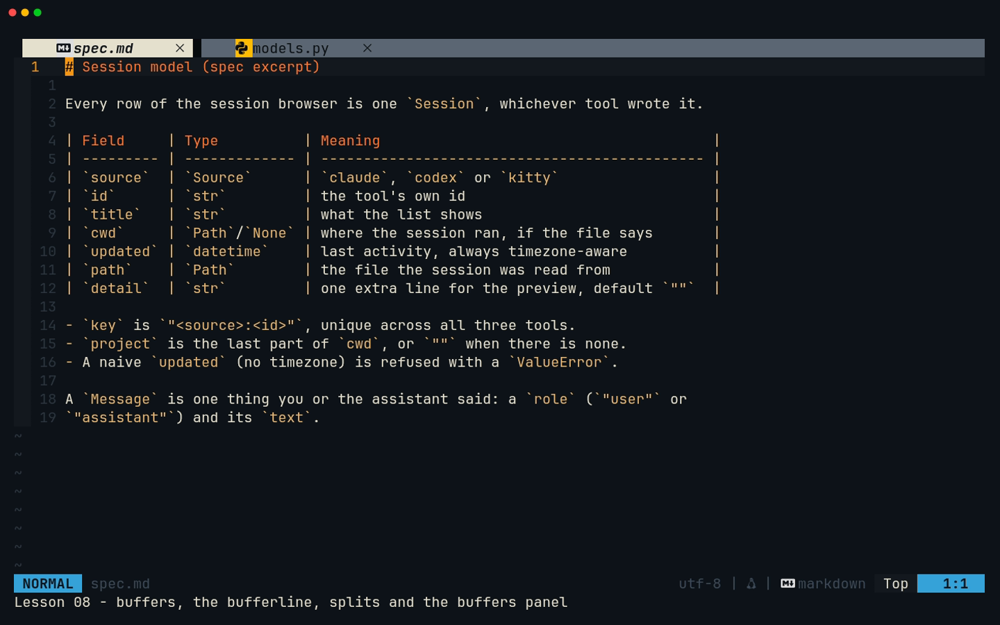
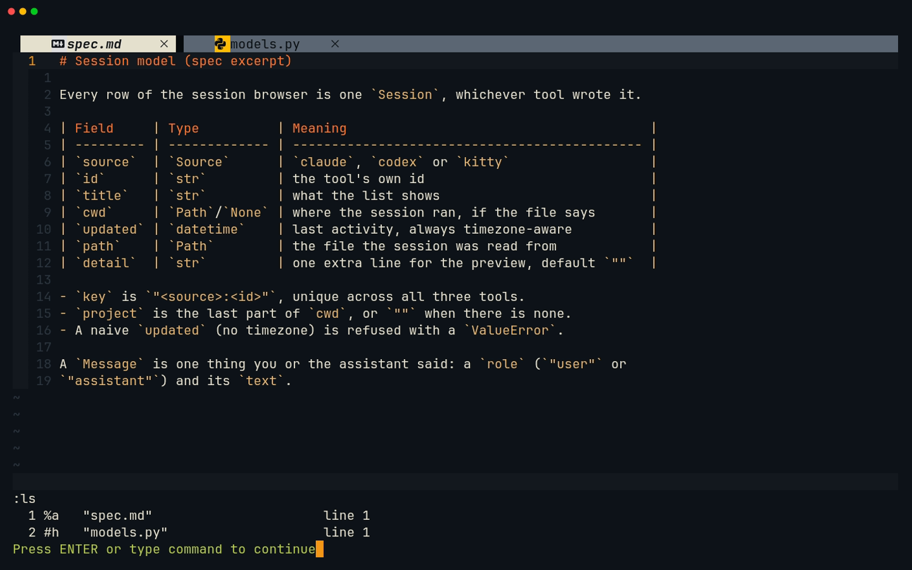
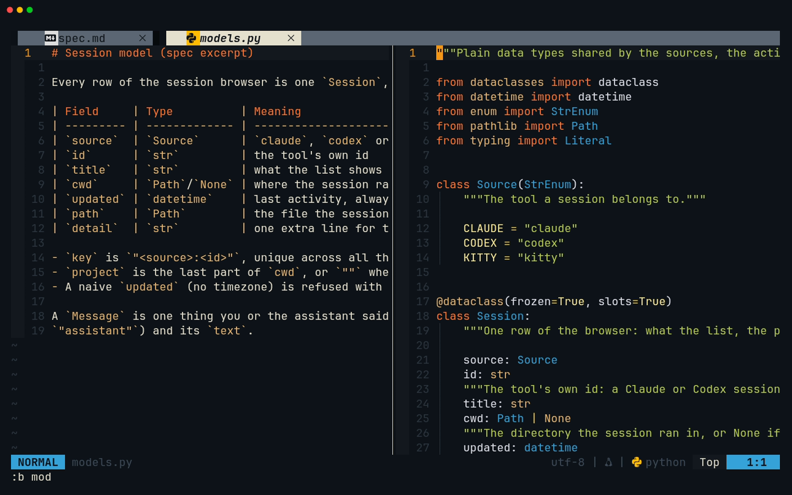
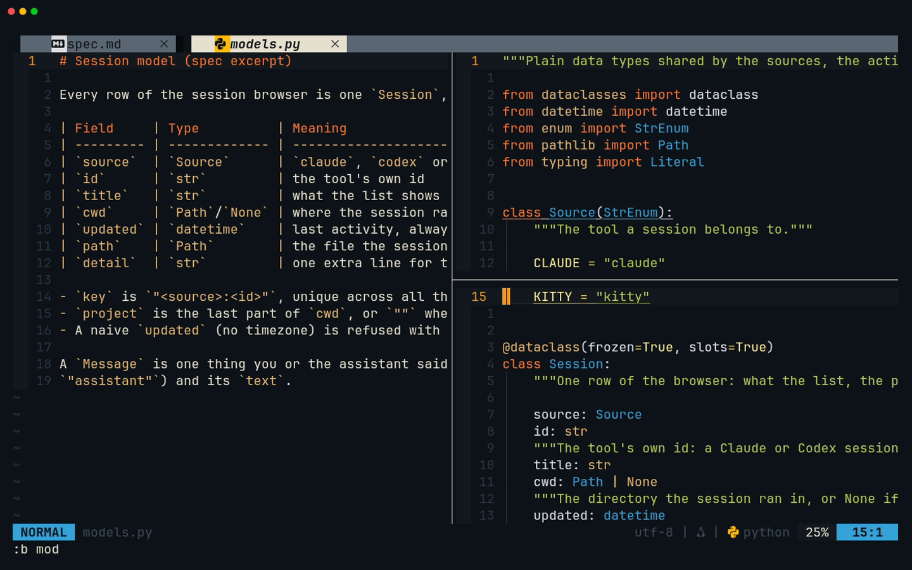
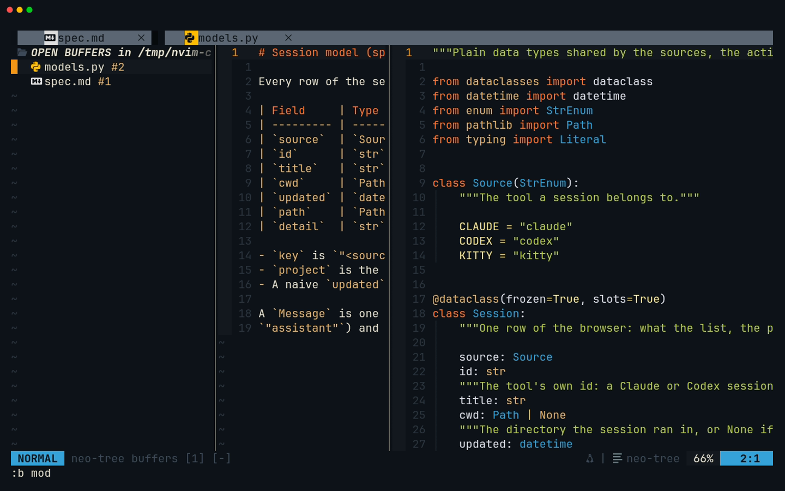
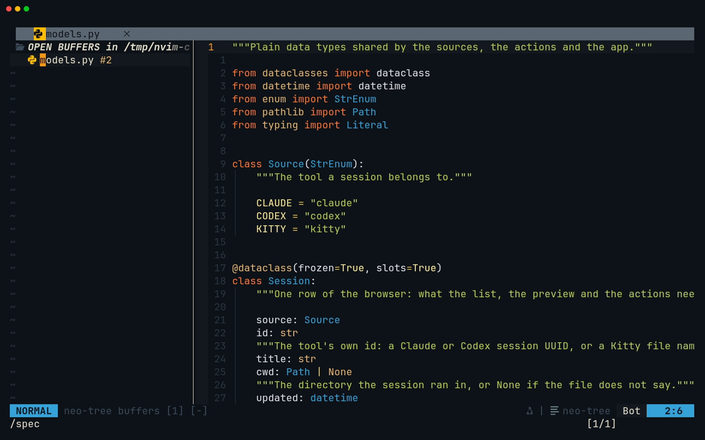

# Lesson 08 — File Pane

**Last Updated**: 27/09/2026
**Version**: 1.0.0
**Maintained By**: Development Team
**Language**: British English (en_GB)
**Timezone**: Europe/London

---

The capstones are a dozen files each, and you will want the spec beside the code, the test under the function
and last week's file one keystroke away. This lesson teaches the three things Neovim uses for that: **buffers**
(files held in memory), **windows** (views onto buffers, which you split, move between and resize) and **tabs**
(whole layouts of windows). You learn to switch buffers from the bufferline, to close one without wrecking your
layout, which your config's `<leader>x` (Space x) can do, and to keep a two- or three-window layout under control with
your `<C-h/j/k/l>` keys. Then you use a vertical split to type the plain data types of both capstones with
their spec open beside them: milestones JP2 and SB2.

**Part**: 3 — Workspace · **Time**: ~100 min · **Previous**: [Lesson 07 — Tree](07-TREE.md) · **Next**: [Lesson 09 — Project Pane](09-PROJECT-PANE.md)

The course splits the editor into three areas. This lesson is the **File Pane**:

| Name | What it means in this config | Lesson |
|---|---|---|
| **File Pane** | The editing area: buffers, windows, splits, the bufferline, and the neo-tree *buffers* panel (`<leader>b`) | this one |
| **Tree** | The neo-tree *filesystem* explorer (`<leader>e`) and every file operation done from it | [07](07-TREE.md) |
| **Project Pane** | The whole-project view: the dock layout, the dev-layout windows, Telescope, the Aerial outline, quickfix | [09](09-PROJECT-PANE.md) |

## Objectives

By the end of this lesson you can:

- explain the difference between a buffer, a window and a tab, and read `:ls`;
- switch buffers with `<Tab>`/`<S-Tab>`, `]b`/`[b`, `:b` with part of a name, and `<C-^>`;
- split the screen with `<C-w>v`, `<C-w>s`, `:vsplit` and `:split`, and move between windows with `<C-h/j/k/l>`;
- resize and close windows with `<C-w>=`, `<C-w>_`, `<C-w>|`, `<C-w>o`, `<C-w>c` and `<C-q>`;
- close a buffer with `<leader>x` or `:bd`, predict which windows go with it, and keep your layout with
  `:bp | bd #`;
- use the neo-tree buffers panel (`<leader>b`) and delete buffers from it with `d`;
- open, switch and close tabs, and recognise the tabs that Neogit and Diffview open;
- say what `laststatus=3` and `splitkeep=screen` change;
- save and quit many files at once with `:wa` and `:qa`;
- finish milestones **JP2** and **SB2**: the data types of both capstones, typed with the spec in a split.

## Before you start

- You have finished [Lesson 07](07-TREE.md): milestones **JP1** and **SB1** are done. That means these files
  exist, and every module except `main.rs` and `app.py` holds only a one-line doc comment or docstring:

  ```text
  rust/just-panel/Cargo.toml
  rust/just-panel/src/main.rs            crate doc, module map, five `mod` lines
  rust/just-panel/src/{app,justfile,runner,sections,ui}.rs
  python/session-browser/src/session_browser/{__init__,app,models,actions}.py
  python/session-browser/src/session_browser/sources/{__init__,claude,codex,kitty}.py
  python/session-browser/tests/conftest.py
  python/session-browser/tests/test_imports.py
  ```

- Both projects pass their checks. In a terminal (`<leader>t`, where `<leader>` is Space, or any Kitty shell):

  ```bash
  # in ~/Repos/personal/nix-config/rust
  cargo build -p just-panel
  ```

  ```bash
  # in ~/Repos/personal/nix-config/python/session-browser
  uv run pytest -q
  ```

  Expect `Finished` with no `warning` lines, then `8 passed`.
- For the walkthrough you use a throwaway copy of two small files, the same ones the lesson's recording uses.
  Open a Kitty terminal (`SUPER + RETURN`, then `SUPER + 0`: new windows open on workspace 10) and run:

  ```bash
  # in a Kitty terminal (SUPER + RETURN, then SUPER + 0)
  cd ~/Repos/personal/nix-config
  L=/tmp/nvim-course/08-file-pane
  rm -rf "$L" && mkdir -p "$L" && cp -r docs/NEOVIM-COURSE/fixtures/08-file-pane/. "$L" && cd "$L"
  nvim spec.md models.py
  ```

  `spec.md` is a short spec for session-browser's data model; `models.py` is the code that implements it. Two file
  arguments mean no dock layout (neovim.nix:892): just the first file, full screen.

## Keys in this lesson

| Keys | Mode | Action | Where it comes from |
|---|---|---|---|
| `<Tab>` / `<S-Tab>` | n | Next / previous buffer (`:bnext` / `:bprevious`) | config (neovim.nix:61-62) |
| `]b` / `[b` | n | Next / previous buffer | Neovim 0.12 default |
| `]B` / `[B` | n | Last / first buffer | Neovim 0.12 default |
| `:ls` | c | List the buffers, with their numbers and flags | Neovim default |
| `:b {N}`, `:b {part of name}` | c | Show buffer N, or the buffer whose name matches, in this window | Neovim default |
| `<C-^>` (`:b#`) | n | Back to the alternate buffer, the one this window showed before | Neovim default |
| `<C-w>v` / `<C-w>s` | n | Split this window side by side / one above the other (same buffer in both) | Neovim default |
| `:vsplit {file}` / `:split {file}` | c | Split and show `{file}` in the new window | Neovim default |
| `:vnew` / `:new` | c | Split with a new, empty buffer | Neovim default |
| `<C-h>` `<C-j>` `<C-k>` `<C-l>` | n | Move to the window left / below / above / right | config (neovim.nix:68-71) |
| `<C-w>w` / `<C-w>p` | n | Next window / the window you were in last | Neovim default |
| `<C-w>=` | n | Make all windows (almost) the same size | Neovim default |
| `<C-w>_` / `<C-w>\|` | n | Make this window as tall / as wide as possible; with a count, exactly that size | Neovim default |
| `<C-w>+` `<C-w>-` / `<C-w>>` `<C-w><` | n | Taller, shorter / wider, narrower (by the count, default 1) | Neovim default |
| `<C-w>o` | n | Close every other window in this tab (`:only`) | Neovim default |
| `<C-w>c` | n | Close this window (`:close`); never quits Neovim | Neovim default |
| `<C-q>` | n | `:q` on this window | config (neovim.nix:65) |
| `<leader>x` | n | Close buffer (`:bdelete`), after a 300 ms wait | config (neovim.nix:63) |
| `:bd`, `:bd!` | c | Close the buffer / and throw its changes away | Neovim default |
| `:bp`, then `:bd #` | c | Close the buffer but keep this window (step 7 types both on one line) | Neovim default |
| `<leader>b` | n | Toggle the neo-tree buffers panel on the left; the cursor moves into it | config (neovim.nix:25) |
| `<CR>` / `d` / `q` / `?` | n (buffers panel) | Open the buffer / delete it / close the panel / list the panel's keys | neo-tree default |
| `:tabnew [file]`, `:tabclose`, `:tabonly`, `:tabs` | c | New tab / close it / close the others / list tabs and their windows | Neovim default |
| `gt` / `gT` / `{N}gt` / `g<Tab>` | n | Next / previous / Nth / last-used tab | Neovim default |
| `<C-w>T` | n | Move this window into a new tab of its own | Neovim default |
| `<C-s>` | n | Save (`:w`) | config (neovim.nix:64) |
| `:setlocal nomodifiable` | c | Make this buffer refuse every change (`E21`), for a file you only read | Neovim default |
| `:wa` / `:qa` / `:wqa` | c | Save every changed buffer / quit / save all and quit | Neovim default |

## Walkthrough

![Lesson 08 recording: two buffers in the bufferline, `<Tab>` and `]b` to switch, `:ls`, `:b` with part of a name, a vertical split, moving and resizing windows, the buffers panel, and `d` deleting a buffer together with its window](../media/08-file-pane/08-file-pane.gif)

[MP4](../media/08-file-pane/08-file-pane.mp4)

### 1. Buffers, windows and tabs

Three words, three different things:

- A **buffer** is a file's text held in memory. Opening a file makes a buffer; it stays in memory, listed, until
  you delete it, even when nothing on screen shows it (a **hidden** buffer). Your unsaved changes live in the
  buffer, not in a window.
- A **window** is a view onto one buffer. You can have several windows, and two windows can show the same buffer:
  type in one and the other updates. Closing a window never deletes its buffer.
- A **tab** (tab page) is a whole layout of windows. Each tab has its own windows; all tabs share the same
  buffers.

```text
 BUFFERS (in memory)              TAB 1 (a layout)                        TAB 2 (another layout)
 ┌─────────────────────┐          ┌──────────────────┬─────────────────┐  ┌───────────────────────┐
 │ 1  spec.md          │◀─────────│ window: spec.md  │ window:         │  │ window: models.py     │
 │ 2  models.py        │◀────┬────│                  │ models.py       │  │ (a second view of     │
 │ 3  notes.md  hidden │     │    │                  ├─────────────────┤  │  buffer 2)            │
 └─────────────────────┘     └────│                  │ window:         │  └───────────────────────┘
   the bufferline lists these     │                  │ models.py again │
   (all of them, in every tab)    └──────────────────┴─────────────────┘
```

Buffer 3 is loaded but no window shows it, so it is hidden. Deleting buffer 2 would affect three windows in
two tabs. Closing any one of those windows would affect no buffer at all.

> **Zed habit:** in Zed a tab is an open file, and closing the tab closes the file. Here the "tabs" along the top
> are the **bufferline**, a list of buffers. Neovim's own tabs are closer to separate Zed workspaces: whole
> layouts you flip between. Zed's split panes are Neovim's windows.

### 2. The bufferline, `<Tab>` and `]b`

The line across the top is bufferline.nvim in `buffers` mode (neovim.nix:722-730). Each entry is a listed buffer.
The current one is highlighted; an unsaved one shows `●` instead of its close icon. The config also sets
`diagnostics = 'nvim_lsp'` (neovim.nix:726), so a buffer with language-server errors is marked there too. There
are no numbers on the entries (`numbers = 'none'`, :725).

Two sets of keys walk the list:

- `<Tab>` and `<S-Tab>` run `:bnext` and `:bprevious` (neovim.nix:61-62).
- `]b` and `[b` do the same; they are Neovim 0.11+ defaults. `]B` and `[B` jump to the last and first buffer.

Both wrap around at the ends.

**Try it:** press `<Tab>`, then `<S-Tab>`, then `]b` and `[b`.

**You should see** the window switch between `spec.md` and `models.py`, and the highlight in the bufferline move
with it.



> **Gotcha:** `<Tab>` is a Normal-mode map in ordinary buffers only. In Insert mode it drives the completion
> menu, and several panels map it for themselves: neo-tree (select a node), Telescope (select a result),
> Neogit (fold) and Diffview (next file). And, as [lesson 02](02-MOTIONS.md) showed, `<C-i>` runs `:bnext` too,
> so jumplist-forward is gone.

### 3. `:ls`, `:b` and the alternate buffer

`:ls` lists the buffers. For example:

```text
  1 %a   "spec.md"                      line 1
  2 #h   "models.py"                    line 1
```

| Flag | Meaning |
|---|---|
| `%` | the buffer in the current window |
| `#` | the **alternate** buffer: the one this window showed before |
| `a` / `h` | active (shown in a window) / hidden (loaded, not shown) |
| `+` | changed since it was last saved |

A buffer that has never been shown (like `models.py` before you first visit it) has no `a` or `h` and says
`line 0`.

`:b` takes a number or any part of a name:

- `:b 2` or `:b2` goes to buffer 2.
- `:b mod` goes to `models.py`. A name that **starts** with what you typed wins, then one that **ends** with it.
- `:b e` fails with `E93: More than one match for e`: both names contain an `e` in the middle. `<Tab>` after
  `:b ` completes and cycles through the names instead.
- `<C-^>` (`:b#`) flips back to the alternate buffer. Pressed twice it returns you where you started.

**Try it:** `:ls`, then `<CR>` to dismiss the `Press ENTER` prompt. Then `:b e`, `:b mod`, `:b spec`, and finally
`<C-^>` twice.

**You should see** the list above (numbers may differ), the red `E93` message, then the window switching
between the two files.



> **Tip:** `<C-^>` is Ctrl with `^` or `6`. If your keyboard layout makes it awkward, or it does nothing in Kitty,
> `:b#` does the same (verify on laptop-intel).

### 4. Splits

A split divides the current window in two. Both halves show the same buffer until you change one of them.

- `<C-w>v` splits side by side; `<C-w>s` splits one above the other.
- `:vsplit {file}` and `:split {file}` split and open a file in the new window in one go.
- `:vnew` and `:new` split with a new, empty buffer.

Your config puts new windows **right** of and **below** the current one (`splitright` at neovim.nix:249 and
:260, `splitbelow` at :261), and the cursor moves into the new window. That `splitright` is also what puts the
git_status panel on the right, where Zed's git panel sits (comment at neovim.nix:244-246).

**Try it:** with `spec.md` showing, press `<C-w>v`, then `:b mod`.

**You should see** `spec.md` on the left and `models.py` on the right, with the cursor on the right.



### 5. Moving between windows

`<C-h>`, `<C-j>`, `<C-k>` and `<C-l>` move to the window left, below, above and right (neovim.nix:68-71). They
are your shortcuts for Neovim's `<C-w>h`, `<C-w>j`, `<C-w>k` and `<C-w>l`, which still work. Two more are worth
knowing: `<C-w>w` cycles through every window in turn, and `<C-w>p` jumps back to the window you were in last.

**Try it:** `<C-h>`, then `<C-l>`, then `<C-w>p` twice.

**You should see** the cursor, the cursorline and the file name in the statusline follow you between the halves.

> **Gotcha:** these keys are Normal-mode maps. In a terminal window they go to the shell: press `<C-\><C-n>`
> first ([lesson 06](06-TERMINAL.md)). Inside the Aerial outline, `<C-j>` and `<C-k>` are Aerial's own keys
> ([lesson 09](09-PROJECT-PANE.md)); `<C-l>` still gets you out (the outline sits at the far left edge, so
> `<C-h>` has nowhere to go).

### 6. Sizing and closing windows

| Keys | What they do |
|---|---|
| `<C-w>=` | Share the space evenly |
| `<C-w>_` / `<C-w>\|` | This window as tall / as wide as it can be; `10<C-w>_` makes it exactly 10 rows |
| `<C-w>+` `<C-w>-` | 1 row taller / shorter; `5<C-w>+` is 5 rows |
| `<C-w>>` `<C-w><` | 1 column wider / narrower; `10<C-w>>` is 10 columns |
| `<C-w>o` | Keep only this window; the others close, their buffers stay (hidden) |
| `<C-w>c` | Close this window; on the last window it refuses (`E444`) instead of quitting |
| `<C-q>` | `:q` on this window (neovim.nix:65); on the last window it quits Neovim |

`:resize 15` and `:vertical resize 60` set sizes by command.

**Try it:** in the right-hand window press `<C-w>s`. Then `<C-w>_`, then `<C-w>=`. Finally `<C-q>`.

**You should see** three windows (the right half split in two, both showing `models.py`), the lower one grow to
nearly full height, all three even out, then the lower one close. The new lower window does not start at line 1:
it starts at the line that was already on that part of the screen (line 15 in the recording), and the cursor
moves there. That is `splitkeep = 'screen'` (neovim.nix:248) keeping the text still (step 9). If two lines turn
up underlined (in the recording, `class Source(StrEnum):` and `KITTY = "kitty"`), they are not errors:
indent-blankline (neovim.nix:750-752) underlines the first and last line of the block the cursor has landed in.



> **Gotcha:** `<C-w>o` is thorough: in the dock layout it also closes the tree and the terminal. Their buffers
> survive (the shell keeps running, hidden), and `<leader>e` and `<leader>t` bring them back.

### 7. Closing a buffer: `<leader>x` and `:bd`

`<leader>x` (Space x) runs `:bdelete` (neovim.nix:63). It is also the prefix of `<leader>xx` and `<leader>xw`, the
Trouble lists (neovim.nix:55-56), and the which-key group `+diagnostics` (neovim.nix:848). As
[lesson 05](05-YOUR-KEYBINDINGS.md) showed, that makes it timing-sensitive:

| What you type | What happens |
|---|---|
| `Space x` together, then nothing | after 300 ms (`timeoutlen`, neovim.nix:270), `:bdelete` runs |
| `Space x x` or `Space x w`, briskly | a Trouble list opens; nothing is closed |
| `Space`, pause for the popup, then `x` | the `+diagnostics` popup; "Close buffer" cannot be chosen from there |
| `:bd` | closes the buffer at once |

When in doubt, type `:bd`. Two more things apply to both:

- **Unsaved changes stop it.** `E89: No write since last change for buffer N (add ! to override)`. Save first, or
  `:bd!` to throw the changes away.
- **Every window showing the buffer closes with it**, as long as another listed buffer exists to go on with.
  Neovim's `:help :bdelete` says so: "Any windows for this buffer are closed." Only when it was your **last**
  listed buffer does one window stay, showing an empty buffer (any other windows on it still close).

That second rule is what surprises people. In a split, `<leader>x` does not just empty one side: that side
disappears. In the dock layout, the editing window disappears and leaves the tree and the terminal. With just
the tree and one editing window (and another buffer listed, so the window is not kept), neo-tree is left on its
own, and because the config sets `close_if_last_window = true` (neovim.nix:633), neo-tree then quits Neovim. It
checks for unsaved changes first: if any buffer has some, it opens a window for that buffer instead (neo-tree
3.42.0, `plugin/neo-tree.lua`; verify on laptop-intel).

To get rid of a buffer but keep the window, switch the window away first and then delete the buffer you left,
which is now the alternate one:

```vim
:bp | bd #
```

**Try it:** you have `spec.md` on the left and `models.py` on the right.

1. `<C-h>` into the `spec.md` window, then `:bd`. The window closes, `spec.md` leaves the bufferline and
   `models.py` fills the screen.
2. `:vsplit spec.md`. It opens on the right (`splitright`), with the cursor in it.
3. In that window, `:bp | bd #`.

**You should see** after step 3 two windows, both showing `models.py`, and only `models.py` in the bufferline.
Finish with `<C-w>o`, then `:e spec.md` and `:vsplit models.py`, to get the two-window layout back.

> **Why:** buffers and windows are separate things, and `:bdelete` works on the buffer. It closes the views of
> it rather than guess what they should show instead. `:bp | bd #` makes that choice for the current window
> before the delete happens.

### 8. The buffers panel: `<leader>b`

`<leader>b` toggles neo-tree's **buffers** source on the left, 30 columns wide (neovim.nix:25, :665-668). Like
`<leader>e`, it moves the cursor into the panel. It lists every open buffer under its folder, and
`follow_current_file` (neovim.nix:667) puts the cursor on the file you came from.

Inside the panel:

| Keys | What they do |
|---|---|
| `j` / `k`, `/text` | Move, search (ordinary Vim) |
| `<CR>` | Open that buffer in the window you came from |
| `d` | **Delete** that buffer. Use `d`, not `bd`: `b` alone is a nowait panel key, so `bd` may never arrive |
| `?` | List every key the panel knows |
| `q` | Close the panel (or `<leader>b` again) |
| `<C-h>` `<C-l>` | Leave the panel for the window beside it |

`d` deletes much like `:bd`: it refuses a buffer with unsaved changes, and every window showing the buffer
closes, even when it is the last buffer you have. So `d` on your only buffer leaves the panel on its own, and
neo-tree then quits Neovim (step 7).

**Try it:** from the `models.py` window on the right: `<leader>b`, then `/spec` and `<CR>` to put the cursor on
`spec.md`, then `d`, then `q`.

**You should see** the panel open with both buffers, then `spec.md` vanish from the panel, from the bufferline
**and** from the screen, its window closing with it. `q` leaves `models.py` alone on screen.





> **Gotcha:** `<leader>b` and `<leader>e` both open on the left. Whether the buffers panel replaces an open file
> tree or sits beside it is not settled (verify on laptop-intel); either way, `q` or the same key again closes it.

### 9. One statusline, and text that stays put

Two options change how splits look and behave (neovim.nix:236-248, with the reasons in the comment above them):

- **`laststatus = 3`** (:247): one global statusline at the bottom, for the current window only. Other windows
  have no statusline of their own; thin lines separate them. To tell which window is active, look for the cursor,
  the cursorline (`cursorline`, :251) and the file name in lualine at the bottom.
- **`splitkeep = 'screen'`** (:248): when a horizontal split, the terminal dock or a panel opens or closes, the text
  in the other windows keeps its place on screen instead of scrolling. If the cursor would end up hidden,
  Neovim moves it and records the old position in the jumplist (`:help 'splitkeep'`), so `<C-o>` takes you back.

**Try it:** in `models.py`, press `G`, then `<leader>t`. The terminal dock opens and takes the cursor in
Terminal mode, so press `<C-\><C-n>` before `<leader>t` closes it again.

**You should see** the lines at the top of `models.py` stay where they are while the terminal comes and goes.

### 10. Tabs

A tab is a separate layout. You meet them without asking: Neogit opens in a tab of its own (`kind = 'tab'`,
neovim.nix:813-817; [lesson 12](12-GIT.md)), and so does Diffview.

| Keys | What they do |
|---|---|
| `:tabnew` / `:tabnew {file}` | A new tab, empty or with the file |
| `<C-w>T` | Move the current window into a new tab |
| `gt` / `gT` | Next / previous tab |
| `2gt` | Tab 2 |
| `g<Tab>` | The tab you were in last |
| `:tabs` | List the tabs and what each window shows |
| `:tabclose` / `:tabonly` | Close this tab / close all the others |

Each tab keeps its own windows. The bufferline still lists **buffers**, the same ones in every tab, so it does
not tell you which tab you are in. bufferline marks the tab pages at its right-hand end when there is more than
one (verify on laptop-intel); `:tabs` always tells you.

**Try it:** `:tabnew spec.md`, then `gT`, `gt`, `:tabs`, and `:tabclose`.

**You should see** a fresh full-screen layout with `spec.md`, your old layout again after `gT`, the list of two
tabs, and finally one tab again.

> **Tip:** the dock layout (tree and terminal) belongs to the tab it was opened in. A new tab starts with one
> window; `<leader>e` gives it a tree of its own.

### 11. Saving and quitting many files

- `:wa` saves every changed buffer, hidden ones included. `<C-s>` (neovim.nix:64) saves only the current one.
- `:qa` quits every window in every tab. With unsaved changes anywhere it refuses with "No write since last
  change" (`E37`, or `E162` naming the buffer). `:ls` shows the culprit with a `+`.
- `:wqa` saves everything and quits. `:qa!` quits and throws every change away.

Saving runs format-on-save (conform, neovim.nix:974-977) for each buffer that is written.

**Try it:** change a line in both files, `:qa` (refused), `:wa`, then `:qa`. The files are throwaway copies.
Start `nvim spec.md models.py` again in the same folder for the drills.

## Gotchas in this config

1. **`<leader>x` waits, or does something else.** It runs `:bdelete` only 300 ms after a brisk `Space x`, and a
   pause after Space turns it into the `+diagnostics` popup (neovim.nix:55-56, :63, :270, :848).
   **Fix:** `:bd`. [Lesson 26](26-FIX-CLOSE-BUFFER-KEY.md) moves close-buffer to `<leader>q`.
2. **Closing a buffer closes its windows.** `<leader>x`, `:bd` and the buffers panel's `d` close every window
   that shows the buffer. With only the tree or the buffers panel left, neo-tree's `close_if_last_window`
   (neovim.nix:633) quits Neovim (verify on laptop-intel). **Fix:** `:bp | bd #` keeps the window. If the
   editing window has gone, `<C-h>` into the tree and `<CR>` on a file: with no editing window left, neo-tree
   opens a new split for it.
3. **`d` in the buffers panel, not `bd`.** `b` is a panel key of its own (rename the file's base name), and
   whether `bd` still gets through depends on how neo-tree orders its keys (verify on laptop-intel). **Fix:** `d`.
4. **`<Tab>` is shadowed in panels** (neo-tree, Telescope, Neogit, Diffview) and in Insert mode, and `<C-i>` is
   `<Tab>` too (lesson 02). **Fix:** leave the panel first (`<C-h>`/`<C-l>`, or `q`), then `<Tab>`. Not `]b`
   either while you are in a panel: it is `:bnext`, and it acts on the panel's own window.
5. **`]b` and `<Tab>` follow buffer numbers.** After `:BufferLineMoveNext`/`:BufferLineMovePrev` the bufferline's
   order differs from `:bnext` order. **Fix:** use `:BufferLineCycleNext`/`:BufferLineCyclePrev` if you reorder.
6. **`<C-w>o` closes the docks** (tree and terminal) as well as your splits. **Fix:** `<leader>e`, `<leader>t`.
7. **`<C-q>` is `:q`.** It closes only the current window while others remain, and quits Neovim on the last one.
   **Fix:** `:qa` to leave; `<C-w>c` when you only ever want to close a window.
8. **Hidden buffers still count.** Closing a window with unsaved changes keeps them in a hidden buffer, and `:qa`
   refuses later. **Fix:** `:wa`, or `:ls` and look for `+`.
9. **Comment markers continue.** In Rust files, Enter after a `//`, `///` or `//!` line, and `o` or `O` on one,
   start the new line with the same marker (the Rust filetype plugin adds `r` and `o` to `formatoptions`).
   **Fix:** type only the text on continued lines. Where the new line should be code or blank, press `<C-w>` in
   Insert mode: it deletes the marker and keeps the indent.
10. **Enter can accept a completion.** When the completion menu is open, `<CR>` confirms the highlighted item
    (`select = true`, neovim.nix:305). **Fix:** `<C-e>` closes the menu first ([lesson 11](11-COMPLETION-FORMATTING-DIAGNOSTICS.md)).

## Drills

1. Only `models.py` is on screen. Show `spec.md` on the right of it and put the cursor back in `models.py`.
   <details><summary>Answer</summary>

   `:vsplit spec.md` (it opens on the right because of `splitright`), then `<C-h>`. `<C-w>p` works too.
   </details>

2. Close the right-hand window without losing `spec.md` from the bufferline.
   <details><summary>Answer</summary>

   From that window, `<C-q>` or `<C-w>c`. A window closing never deletes its buffer: `:ls` still lists `spec.md`,
   now with `h` (hidden).
   </details>

3. `:ls` lists `tests/test_models.py` as buffer 3, hidden. Get to it with the fewest keys.
   <details><summary>Answer</summary>

   `:b3` then `<CR>`. `:b test` also works, as long as no other buffer name starts with `test`.
   </details>

4. `spec.md` and `models.py` are side by side and you are in the `spec.md` window. Get rid of the `spec.md`
   buffer without the split collapsing.
   <details><summary>Answer</summary>

   `:bp | bd #`. The window switches to the previous buffer, then the alternate buffer (`spec.md`) is deleted.
   Both windows now show `models.py`.
   </details>

5. You pressed Space, looked at the popup, pressed `x`, and a `+diagnostics` list appeared instead of the buffer
   closing. What happened, and what now?
   <details><summary>Answer</summary>

   The pause after Space made which-key treat `x` as the diagnostics group; "Close buffer" is not reachable from
   the popup. `<Esc>`, then `:bd`, or `Space x` briskly and wait.
   </details>

6. Make the window below exactly 10 rows high, then give everything equal space again.
   <details><summary>Answer</summary>

   In that window, `10<C-w>_` (or `:resize 10`). Then `<C-w>=`.
   </details>

7. Look at `models.py` on its own in a fresh layout without disturbing your splits, then come back.
   <details><summary>Answer</summary>

   `:tabnew models.py`, then `gT` to come back. `:tabclose` in the new tab when you are done. `<C-w>T` on a
   `models.py` window does the same by moving that window into a new tab.
   </details>

8. `:qa` refuses with "No write since last change". Find the buffer and deal with it.
   <details><summary>Answer</summary>

   `:ls` and look for the `+` flag; `:b N` to see it. Then `:w` to keep the change or `:e!` to throw it away, or
   `:wa` to save every changed buffer at once.
   </details>

## Milestone JP2 + SB2

**Goal:** the plain data types of both capstones, typed with the spec open beside the code:

- **JP2:** `rust/just-panel/src/justfile.rs` gains `Recipe`, `Parameter`, `ParameterKind` and `Dependency`, and
  `main.rs` gains a crate-level `#![allow(dead_code)]` with a comment saying why.
- **SB2:** `python/session-browser/src/session_browser/models.py` gains `Source`, `Session` and `Message`, and
  `tests/test_models.py` tests them.

No serde and no parsing yet: that is lesson 10. Nothing is committed until lesson 12.

Start Neovim in the repository root: `SUPER + SHIFT + RETURN` for the dev layout, or `cd
~/Repos/personal/nix-config && nvim`. The tree takes 30 columns and the terminal 15 rows: `<leader>e` and
`<leader>t` hide them while you type, and bring them back when you need them.

> **Tip: typing this code.** Type it: the point is the editing. Three things in this config get in the way, and
> each has a quick answer:
>
> - **Closers appear by themselves** (nvim-autopairs, [lesson 03](03-OPERATORS-AND-TEXT-OBJECTS.md)). Type `{`,
>   press `<CR>` between the braces, and the `}` is already on the line below. Do not type another: when the
>   body is done, `<Esc>` then `j` puts you on the `}`, and `o` opens the line after it.
> - **Comment markers continue** in Rust (Gotcha 9). Type only the text on continued lines; where the next line
>   is code or blank, `<C-w>` deletes the marker.
> - **Enter can accept a completion** (Gotcha 10). `<C-e>` closes the menu first.
>
> If a file fights you, pasting is allowed: see the tip in [lesson 06](06-TERMINAL.md), milestone step 0.

### The spec excerpts

You will open this lesson file in a split and read these while you type. The headings start with `####` so that
a search can find them.

#### JP2 spec excerpt

`just --dump --dump-format json` describes every recipe. JP2 models the part of it the panel needs, with plain
Rust types (no serde yet). Here is the course's demo `fuzz` recipe, cut down to those fields and laid out
compactly. To see it yourself, run `jq '.recipes.fuzz | {name, doc, parameters: [.parameters[] | {name, kind,
default}], dependencies, private}' docs/NEOVIM-COURSE/fixtures/just/dump.json` from the repository root:

```json
{
  "name": "fuzz",
  "doc": "Run a fuzz target for TIME seconds (Ctrl+C stops it early)",
  "parameters": [
    { "name": "TARGET", "kind": "singular", "default": null },
    { "name": "TIME", "kind": "singular", "default": "5" }
  ],
  "dependencies": [],
  "private": false
}
```

| Type | Fields | Notes |
|---|---|---|
| `Recipe` | `name`, `doc: Option<String>`, `parameters`, `dependencies`, `private: bool` | `doc` is only the comment line directly above the recipe |
| `Parameter` | `name`, `kind`, `default: Option<String>` | `None` means the parameter is required |
| `ParameterKind` | `Singular` (`NAME`), `Plus` (`+NAME`), `Star` (`*NAME`) | `rebuild *ARGS` is a `Star` |
| `Dependency` | `recipe` | `lint: lint-rust lint-nix` has two |

#### SB2 spec excerpt

Every row of the session browser is one `Session`, whichever tool wrote it. The same text is in
`docs/NEOVIM-COURSE/fixtures/08-file-pane/spec.md`.

| Field | Type | Meaning |
|---|---|---|
| `source` | `Source` | `claude`, `codex` or `kitty` |
| `id` | `str` | the tool's own id |
| `title` | `str` | what the list shows |
| `cwd` | `Path` / `None` | where the session ran, if the file says |
| `updated` | `datetime` | last activity, always timezone-aware |
| `path` | `Path` | the file the session was read from |
| `detail` | `str` | one extra line for the preview, default `""` |

- `key` is `"<source>:<id>"`, unique across all three tools.
- `project` is the last part of `cwd`, or `""` when there is none.
- A naive `updated` (no timezone) is refused with a `ValueError`.

A `Message` is one thing you or the assistant said: a `role` (`"user"` or `"assistant"`) and its `text`.

### Step 1: the JP2 layout

```vim
:e rust/just-panel/src/justfile.rs
:vsplit docs/NEOVIM-COURSE/lessons/08-FILE-PANE.md
/^#### JP2
```

Press `<CR>` after the search, then `zt` to put the excerpt at the top of the window, and
`:setlocal nomodifiable`. The lesson is only for reading: if you later start typing in the wrong window,
Neovim refuses with `E21: Cannot make changes, 'modifiable' is off` instead of changing the course file,
which a later `:wa` would save and prettier reformat. `<C-h>` takes you back to `justfile.rs`. You now have
the code on the left and the spec on the right:

```text
┌────────────────────────────────────┬──────────────────────────────────────┐
│ rust/just-panel/src/justfile.rs    │ docs/NEOVIM-COURSE/lessons/          │
│ (you type here)                    │ 08-FILE-PANE.md                      │
│                                    │ #### JP2 spec excerpt                │
│                                    │                                      │
└────────────────────────────────────┴──────────────────────────────────────┘
```

### Step 2: type the JP2 types

`justfile.rs` has one line, its module doc. Put the cursor on it and press `o`: the new line starts with `//!`
(Gotcha 9), so `<C-w>` to clear it, then Enter for the blank line, and type the rest. The whole file:

```rust
//! The justfile model: recipes and their parameters, loaded from `just --dump`.

/// One recipe, as `just --dump --dump-format json` describes it.
#[derive(Debug)]
pub struct Recipe {
    pub name: String,
    /// The comment line directly above the recipe. Only the last line of a
    /// longer comment block makes it into the dump.
    pub doc: Option<String>,
    pub parameters: Vec<Parameter>,
    /// Recipes that just runs before this one.
    pub dependencies: Vec<Dependency>,
    /// Named `_like-this` or marked `[private]`: `just --list` hides it, and
    /// so does the panel.
    pub private: bool,
}

/// One parameter of a recipe, e.g. `TIME="300"` in `fuzz TARGET TIME="300"`.
#[derive(Debug)]
pub struct Parameter {
    pub name: String,
    pub kind: ParameterKind,
    /// The default value, or `None` when the parameter is required.
    pub default: Option<String>,
}

/// How many values a parameter takes on the command line.
#[derive(Debug, Clone, Copy, PartialEq, Eq)]
pub enum ParameterKind {
    /// `NAME`: exactly one.
    Singular,
    /// `+NAME`: one or more.
    Plus,
    /// `*NAME`: any number, including none.
    Star,
}

/// A recipe that has to run before another one.
#[derive(Debug)]
pub struct Dependency {
    pub recipe: String,
}
```

Save with `<C-s>`. Rust is formatted on save by rust-analyzer's rustfmt (neovim.nix:974-977), so a stray space
fixes itself, but a missing brace does not. If rust-analyzer is already running (lesson 10 sets it up properly),
a `W` sign appears beside each of the four types a moment after saving: nothing uses them yet.

### Step 3: the `allow` in `main.rs`, in a split below

Nothing calls these types until lesson 14 wires up the TUI, so the compiler would warn that every one of them is
unused. Open `main.rs` **below** `justfile.rs`, from the `justfile.rs` window:

```vim
:split rust/just-panel/src/main.rs
```

`splitbelow` puts it under `justfile.rs`, in the left column only. The change, as a diff against JP1:

```diff
 //!   runner     handing the terminal to a recipe and taking it back
 
+// Until lesson 14 wires these modules into `main`, nothing calls the code
+// they contain, so every type and function would be reported as unused.
+// Silence that one lint for the whole crate for now: JP5 deletes this line,
+// and from then on the compiler checks again that everything is used.
+#![allow(dead_code)]
+
 mod app;
 mod justfile;
```

To type it: `/^mod app` and `<CR>`, then `O` to open a line above. Type the first comment line; Enter continues
the `//` for you, so type only the text of the next three. After the fourth, press Enter and `<C-w>` to clear the
`//`, type `#![allow(dead_code)]`, press Enter once more for the blank line, and `<Esc>`. The whole file
afterwards:

```rust
//! just-panel: a terminal control panel for a justfile.
//!
//! Lists the recipes of a justfile under the section banners of the file
//! itself, shows what the selected recipe does, and runs it in the real
//! terminal.
//!
//! MODULES
//!
//!   justfile   what a recipe is, and loading recipes with `just --dump`
//!   sections   which `# ====` banner each recipe sits under
//!   app        the panel's state, and what each key press does to it
//!   ui         drawing that state with ratatui
//!   runner     handing the terminal to a recipe and taking it back

// Until lesson 14 wires these modules into `main`, nothing calls the code
// they contain, so every type and function would be reported as unused.
// Silence that one lint for the whole crate for now: JP5 deletes this line,
// and from then on the compiler checks again that everything is used.
#![allow(dead_code)]

mod app;
mod justfile;
mod runner;
mod sections;
mod ui;

fn main() {
    println!("Hello, world!");
}
```

`<C-s>`. `<C-w>=` evens out the three windows. Your layout is now:

```text
┌────────────────────────────────────┬──────────────────────────────────────┐
│ justfile.rs                        │ 08-FILE-PANE.md (JP2 spec excerpt)   │
├────────────────────────────────────┤                                      │
│ main.rs                            │                                      │
└────────────────────────────────────┴──────────────────────────────────────┘
```

> **Why:** the `allow` is scoped to one lint and carries its reason. The alternative, calling each type from
> `main` just to silence the compiler, would be code you delete later anyway. JP5 removes the line, and from then
> on the compiler checks again that everything is used.

### Step 4: check JP2

In a terminal (`<leader>t`, or a Kitty shell):

```bash
# in ~/Repos/personal/nix-config/rust
cargo build -p just-panel
cargo test -p just-panel
cargo clippy -p just-panel --all-targets -- -D warnings
cargo fmt -p just-panel --check
```

| Command | Expect |
|---|---|
| `cargo build -p just-panel` | `Finished`, with no `warning` lines |
| `cargo test -p just-panel` | `running 0 tests` and `test result: ok. 0 passed` |
| `cargo clippy …` | `Finished`, with no `warning` lines |
| `cargo fmt … --check` | no output at all |

**See the `allow` at work:** in `main.rs`, `dd` on the `#![allow(dead_code)]` line, `<C-s>`, and build again.
Four warnings appear: ``struct `Recipe` is never constructed``, the same for `Parameter` and `Dependency`, and
``enum `ParameterKind` is never used``, ending with `generated 4 warnings`. Then `u` and `<C-s>` to put the line
back, and build once more to see them go.

### Step 5: the SB2 layout, in a tab of its own

Keep the JP2 layout: give SB2 a new tab.

```vim
:tabnew python/session-browser/src/session_browser/models.py
:vsplit docs/NEOVIM-COURSE/lessons/08-FILE-PANE.md
/^#### SB2
```

`<CR>`, `zt`, then `<C-h>` back to `models.py`. (The lesson is the same buffer as in tab 1, so it is still
`nomodifiable`.) Then open the test file below it; it does not exist yet, so this makes a new buffer that
becomes a file when you save:

```vim
:split python/session-browser/tests/test_models.py
```

```text
TAB 1: JP2                          TAB 2: SB2
┌──────────────┬──────────────┐     ┌─────────────────┬──────────────────────────┐
│ justfile.rs  │ spec (JP2)   │     │ models.py       │ 08-FILE-PANE.md          │
├──────────────┤              │     ├─────────────────┤ (SB2 spec excerpt)       │
│ main.rs      │              │     │ test_models.py  │                          │
└──────────────┴──────────────┘     └─────────────────┴──────────────────────────┘
```

`gT` and `gt` flip between the two layouts. The bufferline shows all five buffers in both tabs.

### Step 6: type the SB2 model and its tests

`<C-k>` up to `models.py`. It holds only its docstring; `o` below it and type. The whole file:

```python
"""Plain data types shared by the sources, the actions and the app."""

from dataclasses import dataclass
from datetime import datetime
from enum import StrEnum
from pathlib import Path
from typing import Literal


class Source(StrEnum):
    """The tool a session belongs to."""

    CLAUDE = "claude"
    CODEX = "codex"
    KITTY = "kitty"


@dataclass(frozen=True, slots=True)
class Session:
    """One row of the browser: what the list, the preview and the actions need."""

    source: Source
    id: str
    """The tool's own id: a Claude or Codex session UUID, or a Kitty file name."""
    title: str
    cwd: Path | None
    """The directory the session ran in, or None if the file does not say."""
    updated: datetime
    """Time of the last activity. Always timezone-aware, see `__post_init__`."""
    path: Path
    """The file the session was read from."""
    detail: str = ""
    """One extra line for the preview: a git branch, tab and window counts..."""

    def __post_init__(self) -> None:
        # Sessions from all three tools are sorted together by `updated`, and
        # Python refuses to compare a naive datetime with an aware one. Reject
        # a naive one here, where it is made, rather than in the middle of a
        # sort far away from the code that got it wrong.
        if self.updated.tzinfo is None:
            raise ValueError(f"{self.key}: 'updated' has no timezone")

    @property
    def key(self) -> str:
        """Unique across all three tools, so it can be the table's row key."""
        return f"{self.source}:{self.id}"

    @property
    def project(self) -> str:
        """The last part of the working directory: the name you know it by."""
        return self.cwd.name if self.cwd else ""


@dataclass(frozen=True, slots=True)
class Message:
    """One thing you or the assistant said, for the preview pane."""

    role: Literal["user", "assistant"]
    text: str
```

The string under an attribute (`"""The tool's own id…"""`) is an attribute docstring: pyright shows it when you
hover the attribute with `K` in lesson 10. In Python, Enter after a line ending in `:` indents the next line,
and `<C-d>` in Insert mode takes one level of indent back off (`:help i_CTRL-D`). Python comments do not
continue by themselves.

`<C-s>`. Python is formatted on save with ruff (neovim.nix:953).

`<C-j>` down to `test_models.py` and type:

```python
"""The data types behave the way the rest of the app assumes."""

from dataclasses import FrozenInstanceError
from datetime import UTC, datetime
from pathlib import Path

import pytest

from session_browser.models import Session, Source

WHEN = datetime(2026, 9, 24, 9, 47, tzinfo=UTC)
SESSION = Session(
    source=Source.CLAUDE,
    id="4b1f6c2e",
    title="Parse the just dump JSON",
    cwd=Path("/tmp/nvim-course/nix-config/rust/just-panel"),
    updated=WHEN,
    path=Path("4b1f6c2e.jsonl"),
)


def test_key_is_unique_across_sources() -> None:
    codex = Session(Source.CODEX, SESSION.id, "Same id", None, WHEN, Path("x.jsonl"))

    assert SESSION.key == "claude:4b1f6c2e"
    assert codex.key != SESSION.key


def test_project_is_the_last_part_of_cwd() -> None:
    assert SESSION.project == "just-panel"


def test_project_is_empty_without_cwd() -> None:
    kitty = Session(Source.KITTY, "x.kitty-session", "x", None, WHEN, Path("x"))

    assert kitty.project == ""


def test_sessions_are_immutable() -> None:
    with pytest.raises(FrozenInstanceError):
        SESSION.title = "Renamed"  # pyright: ignore[reportAttributeAccessIssue]


def test_naive_datetime_is_rejected() -> None:
    with pytest.raises(ValueError, match="timezone"):
        Session(Source.KITTY, "x", "x", None, datetime(2026, 9, 24), Path("x"))
```

`:wa` saves everything in every tab.

> **Gotcha:** pyright may mark `import pytest` (and `textual` in `app.py`) with "could not be resolved". Neovim's
> pyright does not see the project's `.venv` yet. The tests still run; [lesson 10](10-LSP.md) fixes the editor
> side.

### Step 7: check SB2

The terminal dock belongs to tab 1, so `gT` first, then `<leader>t`. A Kitty shell works just as well.

```bash
# in ~/Repos/personal/nix-config/python/session-browser
uv sync
uv run pytest -q
uvx ruff check
uvx ruff format --check
uvx pyright --pythonpath .venv/bin/python
```

| Command | Expect |
|---|---|
| `uv sync` | resolves and finds everything installed |
| `uv run pytest -q` | `13 passed`: the 8 import tests from SB1 and your 5 new ones |
| `uvx ruff check` | `All checks passed!` |
| `uvx ruff format --check` | the files reported as already formatted (12 with ruff 0.16; another version may count differently) |
| `uvx pyright --pythonpath .venv/bin/python` | `0 errors, 0 warnings, 0 informations` |

Plain `uvx pyright`, without `--pythonpath`, reports 4 errors, all "Import … could not be resolved" for `textual`
and `pytest`. That is the same blind spot as the editor's, and lesson 10 fixes both.

### Step 8: tidy up

In tab 2, `<C-l>` into the `08-FILE-PANE.md` window and `:bd`. The lesson buffer goes, and so does every window
that showed it, the one in tab 1 included: Gotcha 2 working for you. Then `:tabclose` closes the SB2 layout; its
buffers stay listed. `:wa` if anything is unsaved.

**Check it:** `cargo build -p just-panel` and `uv run pytest -q` as above, one last time. Do not commit: the first
commits happen in [lesson 12](12-GIT.md).

Stuck? Compare with [examples/just-panel/JP2](../examples/just-panel/JP2/) and
[examples/session-browser/SB2](../examples/session-browser/SB2/) — see [examples/README.md](../examples/README.md).

## Recap

- A **buffer** is a file in memory, a **window** is a view onto one, a **tab** is a layout of windows. The
  bufferline lists buffers.
- Switch buffers with `<Tab>`/`<S-Tab>` or `]b`/`[b`, jump with `:b {part}` or `:b N`, flip back with `<C-^>`
  (`:b#`). `:ls` shows `%`, `#`, `a`, `h` and `+`.
- Split with `<C-w>v`/`<C-w>s` or `:vsplit`/`:split {file}`; new windows open right and below. Move with
  `<C-h/j/k/l>`; `<C-w>p` goes back.
- Size with `<C-w>=`, `<C-w>_`, `<C-w>|` and counts; close with `<C-w>c`, `<C-q>` or `<C-w>o` (which takes the
  docks too).
- `<leader>x` and `:bd` close a buffer **and every window showing it**. `:bp | bd #` keeps the window. The
  buffers panel (`<leader>b`) deletes with `d`, by the same rules.
- `laststatus=3` gives one statusline; `splitkeep=screen` keeps text still as docks open and close.
- Tabs: `:tabnew`, `gt`/`gT`, `:tabclose`. Neogit and Diffview open their own.
- `:wa`, `:qa`, `:wqa` work on everything at once.
- **JP2 + SB2:** `justfile.rs` has the recipe model and `main.rs` its commented `allow`; `models.py` has
  `Source`, `Session` and `Message`, with 5 tests. Nothing is committed.

Next, [lesson 09](09-PROJECT-PANE.md) zooms out to the whole project: the dock layout, Telescope, the outline and
quickfix.

## Recording

- **Tape:** [`tapes/08-file-pane.tape`](../tapes/08-file-pane.tape). Run it from `docs/NEOVIM-COURSE/` on
  laptop-intel (full configuration):

  ```bash
  # in ~/Repos/personal/nix-config/docs/NEOVIM-COURSE
  vhs tapes/08-file-pane.tape
  ```

- **VHS version:** `vhs --version` must print 0.12.1, which the config builds (0.12.0 exits 0 and writes nothing);
  if it prints 0.12.0, `just rebuild` first ([Appendix B](../appendices/B-RECORDING-WITH-VHS.md#first-make-sure-vhs-is-0121)).
- **Outputs:** `media/08-file-pane/08-file-pane.gif` and `media/08-file-pane/08-file-pane.mp4`.
- **Repository:** the tape neither reads nor writes the repository, so it can be recorded at any milestone.
- **Fixture:** `fixtures/08-file-pane/` (`spec.md` and the SB2 `models.py`). The hidden setup copies it to
  `/tmp/nvim-course/08-file-pane` and starts `nvim -i NONE spec.md models.py`, so there is no dock layout.
  pyright and ruff attach to `models.py` but report nothing: it imports only the standard library. claudecode.nvim's
  lock file goes to the throwaway `/tmp/nvim-course/08-file-pane.claude`. Nothing is saved.
- **Screenshots** (all in `media/08-file-pane/`):

  | File | Shows | Step |
  |---|---|---|
  | `bufferline.png` | `spec.md` full screen, both buffers in the bufferline | 2 |
  | `ls.png` | `:ls` output above the `Press ENTER` prompt | 3 |
  | `vsplit.png` | `spec.md` left, `models.py` right after `<C-w>v` and `:b mod` | 4 |
  | `three-windows.png` | The right half split again and evened out with `<C-w>=` | 6 |
  | `buffers-panel.png` | The neo-tree buffers panel on the left, cursor on `models.py` | 8 |
  | `buffer-deleted.png` | After `d` on `spec.md`: its window has closed as well | 8 |

- **Manual steps:** none. The tape never presses `"` or `<C-r>`, so which-key's register list (and with it your
  clipboard) never appears.
- **Check after every run:** `media/08-file-pane/` actually contains the GIF, the MP4 and all six PNGs above. An
  exit code of 0 proves nothing on its own.
- **Check before publishing:** every frame shows only the two fixture files and the `/tmp/nvim-course` path.
