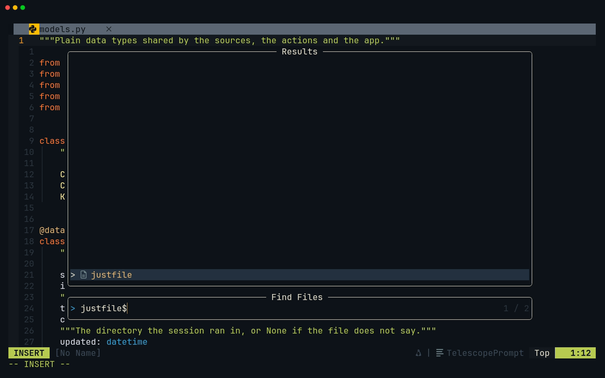
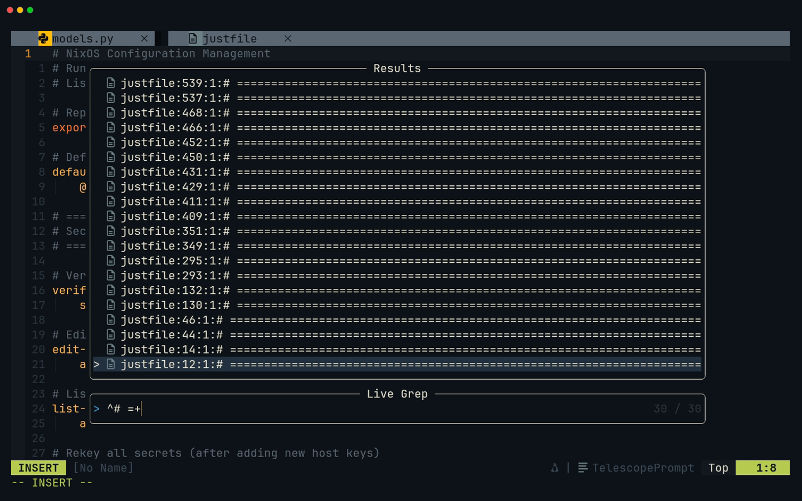
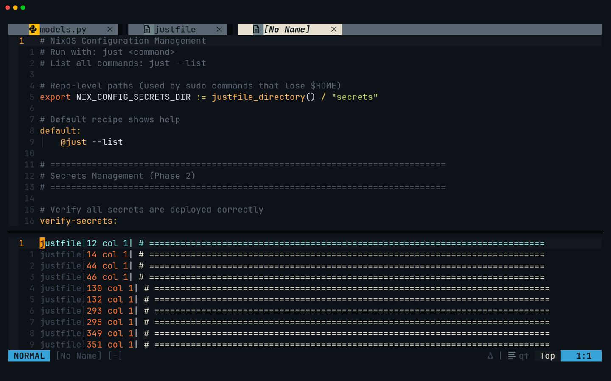
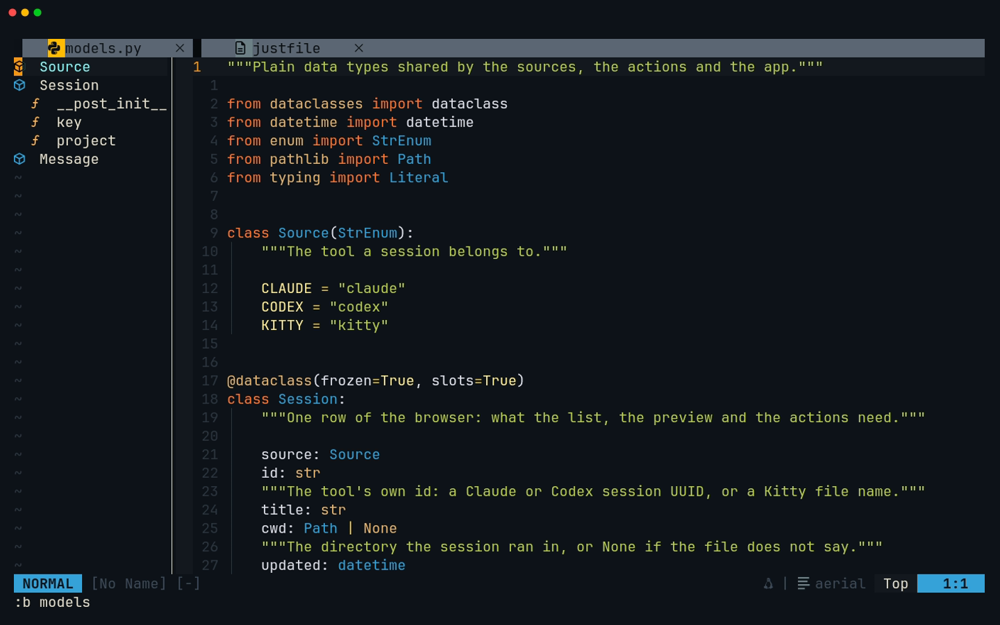

# Lesson 09 — Project Pane

**Last Updated**: 27/09/2026
**Version**: 1.0.0
**Maintained By**: Development Team
**Language**: British English (en_GB)
**Timezone**: Europe/London

---

Lesson 08 was about the files in front of you. This one is about the whole project: which files exist, where a
string lives, what shape a file has, and a worklist of places to visit in order. You learn the dock layout and
the dev-layout windows around Neovim, Telescope's file finder and live grep (and the ignore list in your config
that hides more than it should), the Aerial outline, and the quickfix list. There is no code to write. Instead
the milestone uses these tools to investigate the two formats your capstones parse next: the section banners of
the repository's justfile, which just-panel's banner parser (JP4) reads, and the Claude Code, Codex and Kitty
session files that session-browser's sources (SB3 and SB4) read.

**Part**: 3 — Workspace · **Time**: ~90 min · **Previous**: [Lesson 08 — File Pane](08-FILE-PANE.md) · **Next**: [Lesson 10 — LSP](10-LSP.md)

The course splits the editor into three areas (in the keys below, `<leader>` is Space). This lesson is the
**Project Pane**:

| Name | What it means in this config | Lesson |
|---|---|---|
| **File Pane** | The editing area: buffers, windows, splits, the bufferline, and the neo-tree *buffers* panel (`<leader>b`) | [08](08-FILE-PANE.md) |
| **Tree** | The neo-tree *filesystem* explorer (`<leader>e`) and every file operation done from it | [07](07-TREE.md) |
| **Project Pane** | The whole-project view: the dock layout, the dev-layout windows, Telescope, the Aerial outline, quickfix | this one |

## Objectives

By the end of this lesson you can:

- name the panels of the dock layout, the key that toggles each, and the Zed panel each one stands in for;
- move between the dev layout's Kitty windows, read `KEYBINDS.md` in its `less` pane, and say what
  `SUPER + SHIFT + RETURN` and `SUPER + CTRL + RETURN` do when their workspace is already in use;
- find a file with `<leader>ff` using fuzzy and fzf query syntax;
- search the project with `<leader>fg` using a ripgrep regex, and scope a search to one file or folder;
- predict what the config's Telescope ignore list hides, and get at those files anyway;
- drive a picker from the keyboard, including `<Esc>`, `<C-c>`, splits and tabs;
- send results to the quickfix list with `<C-q>` and walk it with `<CR>`, `]q`, `[q`, `:colder` and `:cdo`;
- open the Aerial outline with `<leader>o` and move around a file with it;
- describe the banner shapes JP4 will parse and the line shapes SB3 and SB4 will parse.

## Before you start

- You have finished [Lesson 08](08-FILE-PANE.md): milestones **JP2** and **SB2** are done. In a terminal
  (`<leader>t`, where `<leader>` is Space, or a Kitty shell):

  ```bash
  # in ~/Repos/personal/nix-config/rust
  cargo build -p just-panel
  ```

  ```bash
  # in ~/Repos/personal/nix-config/python/session-browser
  uv run pytest -q
  ```

  Expect `Finished` with no `warning` lines, then `13 passed`.
- This lesson only reads. You do not save anything in the repository; one step edits a throwaway copy in `/tmp`.
- Open the dev layout with `SUPER + SHIFT + RETURN`. If workspace 2 is already taken by something else, close those
  windows first (step 2), or open a Kitty terminal (`SUPER + RETURN`, then `SUPER + 0`: new windows open on
  workspace 10) and run `cd ~/Repos/personal/nix-config && nvim`. Either way you want a **bare** `nvim` in the
  repository root, which gives you the dock layout.

## Keys in this lesson

| Keys | Mode | Action | Where it comes from |
|---|---|---|---|
| `SUPER + SHIFT + RETURN` | Hyprland | The nix-config Neovim layout on workspace 2; only focuses workspace 2 if anything is there | config (config/hypr/60-keybinds.lua:26) |
| `SUPER + CTRL + RETURN` | Hyprland | wofi picker, then a Neovim layout on the first free workspace from 3 to 5 | config (60-keybinds.lua:27) |
| `SUPER + H` / `J` / `K` / `L` | Hyprland | Focus the Kitty window left / below / above / right | config (60-keybinds.lua:129-132) |
| `j` `k`, `/text`, `n` `N`, `g` `G`, `q` | `less` | Scroll, search, next / previous match, top / bottom, quit (and close that pane) | `less` default |
| `<leader>e` / `<leader>gs` / `<leader>t` | n | Tree (left) / git status panel (right) / terminal dock (bottom) | config (neovim.nix:24, :34, :27) |
| `<leader>o` | n | Toggle the Aerial outline (far left); the cursor moves into it | config (neovim.nix:26) |
| `<leader>ff` | n | Telescope: find files | config (neovim.nix:29) |
| `<leader>fg` | n | Telescope: live grep (ripgrep regex) | config (neovim.nix:30) |
| `<leader>fb` | n | Telescope: open buffers | config (neovim.nix:31) |
| `<leader>fh` | n | Telescope: help tags | config (neovim.nix:32) |
| `<C-n>` `<C-p>` (or `<Down>` `<Up>`) | i (picker) | Next / previous result | telescope default |
| `<CR>` / `<C-x>` / `<C-v>` / `<C-t>` | i, n (picker) | Open / in a split below / in a split beside / in a new tab | telescope default |
| `<C-u>` `<C-d>` | i, n (picker) | Scroll the preview up / down | telescope default |
| `<Tab>` / `<S-Tab>` | i, n (picker) | Mark a result and move on (multi-select) | telescope default |
| `<C-q>` / `<M-q>` | i, n (picker) | Send all results / the marked ones to a new quickfix list, and open it | telescope default |
| `<C-/>` / `?` | i / n (picker) | Show the picker's keys | telescope default |
| `<C-c>` | i (picker) | Close the picker | telescope default |
| `<Esc>` | i / n (picker) | Leave the prompt for Normal mode / close the picker | telescope default |
| `j` `k`, `gg` `G`, `H` `M` `L` | n (picker) | Move in the results | telescope default |
| `<C-space>` | i (live grep) | Refine the current results with a fuzzy (fzf syntax) filter | telescope default |
| `<M-d>` | i, n (buffers picker) | Delete the highlighted buffer | telescope default |
| `<CR>` | n (quickfix) | Jump to that entry, in the window above | Neovim default |
| `]q` `[q` / `]Q` `[Q` | n | Next / previous quickfix entry / last / first | Neovim 0.12 default |
| `:copen` `:cclose` `:cc {N}` | c | Open / close the quickfix window, jump to entry N | Neovim default |
| `:colder` `:cnewer` `:chistory` | c | Older / newer quickfix list, list them all | Neovim default |
| `:grep {args}` | c | Run ripgrep into the quickfix list (`grepprg` is `rg --vimgrep -uu`) | Neovim default |
| `:cdo {cmd}` / `:cfdo {cmd}` | c | Run a command on every entry / every file in the list | Neovim default |
| `<CR>` / `p` | n (outline) | Jump to the symbol / show it in the code but stay in the outline | aerial default |
| `{` `}` / `[[` `]]` | n (outline) | Previous / next symbol / up the tree backwards / forwards | aerial default |
| `o` `za` / `l` `h` / `zR` `zM` | n (outline) | Toggle / open / close a node; open all / close all | aerial default |
| `<C-j>` `<C-k>` | n (outline) | Down / up one line and show that symbol | aerial default (shadows neovim.nix:69-70) |
| `<C-v>` `<C-s>` | n (outline) | Jump to the symbol in a vertical / horizontal split | aerial default |
| `q` / `?` | n (outline) | Close the outline / list its keys | aerial default |
| `:AerialNext` `:AerialPrev` | c | Next / previous symbol, from the code | aerial default |

## Walkthrough

![Lesson 09 recording: find the justfile with `<leader>ff`, live grep for `^# =+`, send the results to quickfix with `<C-q>`, step with `<CR>` and `]q`, then the Aerial outline of models.py](../media/09-project-pane/09-project-pane.gif)

[MP4](../media/09-project-pane/09-project-pane.mp4)

### 1. The dock layout, and what it stands in for

A bare `nvim` runs the startup autocmd (neovim.nix:889-905): the file tree on the left, the terminal across the
bottom, the cursor in the editing window. That is "the shape Zed actually starts in: project_panel open, the
other docks present but toggled on demand" (comment at neovim.nix:877-881). Every other panel is one key away:

```text
┌──────────────────── Neovim: 75 % of the screen in the dev layout ─────────────────────┐
│ bufferline                                                                            │
├───────────┬───────────┬───────────────────────────┬───────────────────┬───────────────┤
│ outline   │ tree      │ editing windows           │ git status        │ Claude Code   │
│ <leader>o │ <leader>e │ (lesson 08)               │ <leader>gs        │ <leader>cc    │
│ aerial,   │ neo-tree, │                           │ neo-tree,         │ right, 30 %   │
│ far left  │ 30 cols   │                           │ 40 cols           │ (lesson 13)   │
├───────────┴───────────┴───────────────────────────┴───────────────────┴───────────────┤
│ terminal dock <leader>t (toggleterm, 15 rows)                                         │
├───────────────────────────────────────────────────────────────────────────────────────┤
│ quickfix :copen (10 rows)                                                             │
└───────────────────────────────────────────────────────────────────────────────────────┘
  One statusline (lualine). Neogit (<leader>gg) and Diffview (<leader>gd) open in tabs of their own.
  Not to scale; the exact nesting depends on the order you open things.
```

| Zed | This config | Key | Source |
|---|---|---|---|
| Project panel (left) | neo-tree filesystem, left, 30 columns | `<leader>e` | neovim.nix:24, :621-626, :649 |
| Outline panel | Aerial, at the far left edge | `<leader>o` | neovim.nix:26, :672-692 |
| Git panel (right) | neo-tree git_status, right, 40 columns | `<leader>gs` | neovim.nix:34, :621-626, :662 |
| Terminal dock (bottom) | toggleterm, bottom, 15 rows | `<leader>t` | neovim.nix:27, :770-780 |
| Full git UI | Neogit, in a tab | `<leader>gg` | neovim.nix:35, :809-817 |
| File finder, project search | Telescope | `<leader>ff`, `<leader>fg` | neovim.nix:29-30, :699-704 |

The startup layout deliberately does not open the outline and the git panel as well: in the dev layout Neovim
has 75 % of a 1920-pixel screen, and "a tree plus an outline plus a git panel would leave roughly 60 columns for
code" (neovim.nix:883-885). Open them when you need them, and close them again with the same key.

**Try it:** `<leader>gs`, look, then `q`. `<leader>e` twice (close the tree, open it again: opening also moves
the cursor into it; `<C-l>` gets you out).

**You should see** the git status panel on the right, listing the capstone files you have not committed yet, and
the tree go and come back.

> **Gotcha:** in the git status panel, `gg` commits **and pushes**, `A` stages everything with no question, and
> `gr` reverts a file. Look, do not touch, until [lesson 12](12-GIT.md).

### 2. The dev layout around Neovim

`SUPER + SHIFT + RETURN` runs `dev-layout --nvim` (60-keybinds.lua:26): three Kitty windows on workspace 2, all
started in `~/Repos/personal/nix-config` (or `$DEV_LAYOUT_NIX_CONFIG`).

```text
┌──────────────────────────── workspace 2 ─────────────────────────────┐
│ Kitty "nixcfg-nvim": nvim (dock layout), 75 %      │ Kitty:          │
│                                                    │ less KEYBINDS.md│
│                                                    ├─────────────────┤
│                                                    │ Kitty: zsh      │
└────────────────────────────────────────────────────┴─────────────────┘
```

- **Top right** runs `less ~/.config/nvim/KEYBINDS.md`, your generated key reference (rust/dev-layout/src/main.rs:344-380).
  `less` keys: `j`/`k` scroll, `/Windows` and `<CR>` search, `n`/`N` next and previous match, `g`/`G` top and
  bottom. `q` quits `less`, and because that Kitty window exists only to run `less`, the pane closes with it.
- **Bottom right** is a free shell, "where `claude` and `codex` get run when you would rather have them outside
  the editor" (main.rs:348-349).
- **Two levels of window keys:** `SUPER + H/J/K/L` move between the Kitty windows (60-keybinds.lua:129-132);
  `<C-h/j/k/l>` move between Neovim's windows inside the left one (neovim.nix:68-71).

Neither launch key ever piles a layout on top of another:

- **`SUPER + SHIFT + RETURN`** checks workspace 2 first. If **any** window is there, it only focuses workspace 2
  and builds nothing (main.rs:237-252). A second press never stacks a second layout, but a Zed nix-config layout
  (`SUPER + SHIFT + Z`), or a leftover `less` pane, blocks the Neovim one. To rebuild, close everything on
  workspace 2 (`SUPER + Q` on each window), then press it again.
- **`SUPER + CTRL + RETURN`** runs `dev-layout-pick --nvim` (60-keybinds.lua:27). wofi lists the folders two
  levels under `~/Repos`, such as `personal/nix-config`, with the prompt "Dev space (nvim)"; `<Esc>` cancels
  quietly (home/modules/hyprland.nix:135-178). The layout goes to the **first free workspace from 3 to 5**
  (main.rs:41-56, :658-675), with a lock so two quick presses cannot pick the same one. When all three are
  busy, a notification says "No free workspace in the dev pool (3-5)". Errors arrive as notifications because a
  keybind's output goes nowhere (main.rs:22-27).

The picker offers `<account>/<project>` folders only, so it cannot open `rust/just-panel` directly. From a
shell you can: `dev-layout --new --nvim rust/just-panel` (from the repository root) builds a pool layout rooted
at the crate, so Telescope and the tree see only its files.

**Try it:** `SUPER + L`, then `SUPER + K` to reach the `less` pane. Type `/Find` and `<CR>`, then `n`, then `g`.
`SUPER + H` takes you back to Neovim. Do not press `q` there.

**You should see** `less` jump to the `## Find` table (then to the next match, then back to the top) while
Neovim stays as it was.

> **Tip:** the same reference inside Neovim: `:view ~/.config/nvim/KEYBINDS.md`, then `<leader>o` for an outline
> of its sections (step 9).

### 3. Find a file: `<leader>ff`

`<leader>ff` opens Telescope's `find_files` (neovim.nix:29). A picker has three parts: a **prompt** at the
bottom where you type, the **results** above it with the best match nearest the prompt, and a **preview** on the
right. The preview is left out when Neovim is narrower than 120 columns (telescope's `preview_cutoff`), which is
probably why the recording, at about 115 columns, shows none.

What it lists: telescope asks `rg --files` (ripgrep is on Neovim's path, neovim.nix:191-199), so

- git-ignored files are left out (`rust/target/`, `.venv/`, `.direnv/`);
- hidden files and folders, names starting with `.`, are left out too. `:Telescope find_files hidden=true`
  includes them;
- then the config's ignore list removes some more (step 6).

Matching is **fuzzy** and sorted by fzf-native (`load_extension('fzf')`, neovim.nix:704): type a few letters in
order and the best matches rise. Lower-case matches any case; one capital letter makes the whole query
case-sensitive. fzf-native also understands fzf's query syntax:

| You type | Matches |
|---|---|
| `jfrs` | fuzzy: `j`, `f`, `r`, `s` in that order, e.g. `rust/just-panel/src/justfile.rs` |
| `'justfile` | the exact text `justfile`, anywhere in the path |
| `^justfile` | paths that **start** with `justfile`: only the one in the repository root |
| `.rs$` | paths that **end** with `.rs` |
| `!docs` | paths that do **not** contain `docs` |
| `just-panel .rs$` | a space means AND: both must match |

A lone `|` between terms means OR: `.nix$ | .lua$` lists Nix and Lua files.

**Try it:** `<leader>ff`, type `^justfile`, `<CR>`.

**You should see** exactly one result before you press `<CR>`, the repository's `justfile`, and then that file
open in the editing window.



The recording types `justfile$` instead: its folder holds `justfile` and `models.py` only, so the suffix alone is
enough.

### 4. Driving a picker

The prompt starts in Insert mode. Its keys (telescope's defaults at the pinned revision):

| Keys | What they do |
|---|---|
| `<C-n>` / `<C-p>`, `<Down>` / `<Up>` | Next / previous result |
| `<CR>` | Open in the current window |
| `<C-x>` / `<C-v>` / `<C-t>` | Open in a split below / a split beside / a new tab (lesson 08) |
| `<C-u>` / `<C-d>` | Scroll the preview |
| `<Tab>` / `<S-Tab>` | Mark the result and move on, to act on several |
| `<C-q>` / `<M-q>` | All results / the marked ones to a new quickfix list (step 8) |
| `<C-/>` | Show every key of this picker |
| `<C-c>` | Close |
| `<Esc>` | Leave the prompt for **Normal mode**; `<Esc>` again closes |

In Normal mode, `j`/`k` move, `gg`/`G` go to the ends, `H`/`M`/`L` to the top, middle and bottom of the list,
and `?` shows the keys.

> **Gotcha:** three habits misfire in a picker. `<Esc>` does not close it the first time; use `<C-c>`. `<C-j>`
> does nothing (telescope blocks it on purpose), and there is no `<C-k>` for "previous": `<C-k>` scrolls the
> preview sideways. And your `<C-q>` (quit window) and `<Tab>` (next buffer) are the picker's own keys here.

### 5. Search the project: `<leader>fg`

`<leader>fg` opens `live_grep` (neovim.nix:30). On every keystroke it runs ripgrep with your prompt as the
pattern, over the files `rg` would search from Neovim's working directory. So the prompt is a **ripgrep
regex**, not fzf syntax: `'` and `!` are just characters, and `$` means the end of a line. Case is smart: all
lower-case ignores case, one capital makes it exact (`--smart-case` in telescope's default grep arguments).

| You type | Finds |
|---|---|
| `splitkeep` | lines containing `splitkeep` |
| `^# =+` | lines that **start** with `#`, a space, and one or more `=` |
| `^\s*vim\.opt\.split` | option lines, however indented (`\s` is whitespace, `\.` a real dot) |

Alternation works too: `leader>(ff|fg)` finds either binding.

Each result reads `path:line:column:text`. While a regex is half-typed (`^(ff` with no `)`), ripgrep rejects it
and the list stays empty until it is valid again.

To narrow the results further, press `<C-space>`: the current results stay, and the prompt becomes a **fuzzy**
filter over them with fzf syntax (its title changes to "Find Word (…)").

To search one file or folder instead of the whole repository, run the picker with `search_dirs`, a
comma-separated list of paths:

```vim
:Telescope live_grep search_dirs=justfile
:Telescope find_files search_dirs=docs/NEOVIM-COURSE/fixtures/sessions
```

**Try it:** `<leader>fg`, type `^# =+`, and read the results; then `<C-c>`. Then
`:Telescope live_grep search_dirs=justfile` and the same regex.

**You should see** the first time, the justfile's lines mixed with lines from course files that copy its banner
style (the practice and fixture files; about 70 lines from four files at the time of writing). The second time,
only `justfile`: 30 lines.



### 6. What the ignore list hides

The config sets one Telescope default (neovim.nix:699-703):

```lua
file_ignore_patterns = { "node_modules", ".git", "__pycache__", "target" }
```

Telescope drops every result whose path matches one of these with Lua's `string.find`, and they are **Lua
patterns**, not plain text and not globs: a `.` means "any character". It applies to find_files and live_grep
alike, and to every other picker that shows files. So:

| Pattern | Meant to hide | Also hides in this repository |
|---|---|---|
| `".git"` | the `.git/` folder | anything with some character followed by `git`: `home/modules/git.nix` (`/git`), `secrets/github-ssh-*.age`, `docs/NEOVIM-COURSE/tapes/12-git.tape`, `fixtures/12-git/…`; with `hidden=true` it still hides `.gitignore` and `.github/` |
| `"target"` | `rust/target/` | any path containing `target`: all six `rust/fuzz/fuzz_targets/*.rs` |

For the capstones: `target` hides nothing under `rust/just-panel/src/` today, but name a module
`target_picker.rs` and it vanishes from both pickers. `python/session-browser/.gitignore` never shows, even with
`hidden=true`. And live grep silently drops matches inside those files: search for `zeditor` and among the
results are `home/stages/dev.nix`, `home/modules/shell.nix` and `neovim.nix` (plus Hyprland and course files), but
never `home/modules/git.nix`, the file that makes Zed git's editor.

**Try it:** `<leader>ff`, type `git.nix`. Nothing. `<C-c>`.

When a file seems to be missing:

- `:e home/modules/git.nix` with `<Tab>` completion, or the tree (`<leader>e`, and `/` to filter), are not
  affected;
- `:grep` (step 8) runs ripgrep directly, with no ignore list;
- the fix belongs in the config: escape the patterns so they mean what they say, for example `"%.git/"` and
  `"/target/"`. [Lesson 22](22-MAKING-THE-CONFIG-YOURS.md) shows how to change the config safely.

### 7. Buffers and help: `<leader>fb`, `<leader>fh`

- `<leader>fb` lists your open buffers (neovim.nix:31), with the same keys. `<M-d>` deletes the highlighted buffer,
  and like `:bd` it closes the windows showing it (lesson 08).
- `<leader>fh` searches Neovim's help tags (neovim.nix:32): try `quickfix`, `CTRL-W_=` or `splitkeep`. `<CR>`
  opens the help page. (Leave the quotes off `'splitkeep'`: in this prompt a leading `'` is fzf syntax.)

### 8. Quickfix: a list of places

The **quickfix list** is Neovim's list of locations: file, line, column and a line of text. Build it from any
picker with `<C-q>`, then work through it.

- `<C-q>` in a picker sends every result to a **new** quickfix list and opens the quickfix window at the bottom
  (`botright copen`), cursor inside. Its title is the picker and your prompt, e.g. `Live Grep (^# =+)`.
- `<CR>` on an entry jumps there, in the window above.
- `]q` / `[q` go to the next / previous entry from anywhere; `[Q` / `]Q` to the first / last (Neovim 0.11+
  defaults).
- `:cc 5` jumps to entry 5. `:copen` opens the window again, `:cclose` closes it; so does `<C-q>` inside it,
  because there `<C-q>` is your `:q` (neovim.nix:65).
- Every `<C-q>` adds a list rather than replacing one: `:colder` and `:cnewer` step between them, `:chistory`
  lists them.

> **Gotcha:** right after `<C-q>`, the list's current entry is the first one, but you have not been there yet. So
> `]q` goes to the **second**. Press `<CR>` on the first line (or `[Q`) to start at the top.

**Try it:** `:Telescope live_grep search_dirs=justfile`, `^# =+`, `<C-q>`. Then `<CR>`, `]q`, `]q`.

**You should see** the quickfix window with 30 lines like `justfile|12 col 1| # ====…`, then the cursor in the
justfile on the first ruler, on the second ruler two lines below it, then on the first ruler of the next banner.



![After `<CR>` and `]q` twice: the cursor on the third entry](../media/09-project-pane/cnext.png)

`:grep` fills the quickfix list without a picker. Neovim 0.12 sets `grepprg` to `rg --vimgrep -uu` when ripgrep
is installed, so it searches everything, hidden and ignored files included, and it knows nothing of Telescope's
ignore list. It jumps to the first match. If a `Press ENTER` prompt appears, press `<CR>`.

`:cdo {cmd}` runs a command at every entry; `:cfdo {cmd}` once in every file. Together they are a project-wide
search and replace. Try it on a throwaway copy of the course's demo justfile:

```bash
# in ~/Repos/personal/nix-config (a terminal)
mkdir -p /tmp/nvim-course/09-cdo
cp docs/NEOVIM-COURSE/fixtures/just/justfile /tmp/nvim-course/09-cdo/
```

```vim
:grep 'demo:' /tmp/nvim-course/09-cdo/justfile
:copen
:cdo s/demo:/example:/ | update
:grep 'demo:' /tmp/nvim-course/09-cdo/justfile
```

**You should see** 16 entries in the quickfix window, then `:cdo` visit each one, change it and save the file, and
the second `:grep` find nothing: an empty list. `:colder` shows the first list again. To finish, `:cclose`, then
in the window showing the copy `:bp | bd #`, which drops the copy and keeps the window (lesson 08).

### 9. The outline: `<leader>o`

`<leader>o` runs `:AerialToggle` (neovim.nix:26). Without a `!`, the command moves the cursor **into** the
outline. The config puts it on the far left edge of the screen (`default_direction = 'left'`,
`placement = 'edge'`), no wider than 30 columns or 20 % of the screen, whichever is less (`max_width = { 30, 0.2 }`,
neovim.nix:676-680). It takes symbols from the language server first, then treesitter, then Markdown headings and
man pages (`backends`, neovim.nix:691), so it also outlines a file whose server has not started.

What it lists: by default only types and functions (classes, structs, enums, interfaces, modules, functions and
methods). Fields, enum variants and constants are left out, so `justfile.rs` shows four lines: `Recipe`,
`Parameter`, `ParameterKind` and `Dependency`.

Keys inside the outline (aerial's defaults):

| Keys | What they do |
|---|---|
| `j` / `k` | Move (plain Vim) |
| `<CR>` | Jump to the symbol; the cursor goes to the code |
| `p` | Show the symbol in the code, stay in the outline |
| `<C-j>` / `<C-k>` | Down / up one line and show that symbol |
| `{` / `}` | Previous / next symbol |
| `[[` / `]]` | Up the tree, backwards / forwards |
| `o` or `za`, `l`, `h` | Toggle, open, close a node; `zR` opens all, `zM` closes all |
| `<C-v>` / `<C-s>` | Jump to the symbol in a vertical / horizontal split |
| `q` | Close the outline |
| `?` | List every key |

The outline follows the window you opened it from (`attach_mode = 'window'`, neovim.nix:686): switch that window
to another buffer and the outline switches too.

**Try it:** `:e python/session-browser/src/session_browser/models.py`, `<leader>o`, then `j`, `j`, `<CR>`. Then
`<leader>o` again to close it.

**You should see** `Source`, `Session` (with its methods under it) and `Message`, the cursor move down the list,
then jump into the code at the symbol you chose.



> **Gotcha:** `{` and `}` are symbol jumps **inside the outline only**. In the code they are still Vim's paragraph
> motions: the config adds no global symbol keys. From the code use `:AerialNext` and `:AerialPrev`, or Neovim's
> `gO`, which lists the document's symbols in the location list (`]l`/`[l` to walk it) where a language server
> is attached.

## Gotchas in this config

1. **`<Esc>` does not close a picker the first time.** It leaves the prompt for Normal mode. **Fix:** `<C-c>`, or
   `<Esc>` twice.
2. **No `<C-j>`/`<C-k>` in a picker.** `<C-j>` does nothing and `<C-k>` scrolls the preview. **Fix:** `<C-n>`/`<C-p>`
   or the arrow keys.
3. **The live grep prompt is a regex, not fzf syntax.** `'foo`, `!bar` or a stray `(` do not do what they do in
   `find_files`. **Fix:** plain words or a real regex; `<C-space>` to filter the results with fzf syntax.
4. **The ignore list hides too much.** `".git"` hides `home/modules/git.nix`, `secrets/github-ssh-*.age` and
   everything named `*-git*`; `"target"` hides `rust/fuzz/fuzz_targets/` (neovim.nix:701). **Fix:** `:e`, the tree,
   or `:grep`; escape the patterns in the config (lesson 22).
5. **Dotfiles are hidden in `find_files`.** **Fix:** `:Telescope find_files hidden=true` (still not `.gitignore`).
6. **`]q` after `<C-q>` skips the first result.** **Fix:** `<CR>` on the first line, or `[Q`.
7. **`<C-q>` means three things.** Quit window in a normal buffer, send-to-quickfix in a picker, and close the
   quickfix window when you are in it (neovim.nix:65).
8. **The outline takes the cursor** (`AerialToggle` without `!`) and borrows `<C-j>`/`<C-k>`. **Fix:** `<C-l>` to
   leave (the outline sits at the far left edge, so `<C-h>` has nowhere to go), `q` to close.
9. **`q` in the `less` pane closes it for good**, and `SUPER + SHIFT + RETURN` will not rebuild the layout while
   anything remains on workspace 2 (main.rs:243-252). **Fix:** `:view ~/.config/nvim/KEYBINDS.md` in Neovim, or
   `less ~/.config/nvim/KEYBINDS.md` in the bottom-right shell.
10. **Focus follows the mouse** (`follow_mouse = 1`, config/hypr/30-input.lua:12): a pointer over another Kitty
    window takes your keys there. **Fix:** park the pointer.
11. **The right edge gets crowded.** The git status panel (40 columns) and Claude Code (30 %) both open on the
    right of a Neovim that already has only 75 % of the screen. **Fix:** close one before opening the other.

## Drills

1. With `<leader>ff`, open `rust/dev-layout/src/main.rs` in as few keystrokes as you can.
   <details><summary>Answer</summary>

   Something like `dev main` (two fuzzy terms, both must match) then `<CR>`. `'dev-layout main.rs$` is exact.
   </details>

2. You typed `'splitkeep` into live grep and got nothing. Why?
   <details><summary>Answer</summary>

   Live grep sends the prompt to ripgrep as a regex, so the `'` is a literal quote character, and no line
   contains `'splitkeep` (the config writes `vim.opt.splitkeep`). Type `splitkeep`.
   </details>

3. `<leader>ff` then `git.nix` finds nothing, although `home/modules/git.nix` exists. Explain, then open it.
   <details><summary>Answer</summary>

   The ignore pattern `".git"` is a Lua pattern where `.` is any character, so `/git` in `home/modules/git.nix`
   matches it. Open it with `:e home/modules/git.nix` (`<Tab>` completes the path) or from the tree.
   </details>

4. Find every `TODO` under `rust/` and visit them one by one.
   <details><summary>Answer</summary>

   `:Telescope live_grep search_dirs=rust`, type `TODO`, `<C-q>`, then `<CR>` on the first line and `]q` for
   each next one. (`:grep TODO rust` works without a picker, but it also searches ignored folders such as
   `rust/target/`, which is slow and noisy.)
   </details>

5. You made a second search and sent it to quickfix too. Get the first list back.
   <details><summary>Answer</summary>

   `:colder`. `:cnewer` goes forward again; `:chistory` lists every list.
   </details>

6. In the outline, `<C-j>` scrolled the code instead of taking you to the window below. Why, and how do you get
   out?
   <details><summary>Answer</summary>

   Aerial maps `<C-j>`/`<C-k>` in its window (down/up and scroll), which shadows your window keys. `<C-l>` still
   works (Aerial does not map it), or `q` closes the outline.
   </details>

7. Show the outline of `models.py` without leaving the code window.
   <details><summary>Answer</summary>

   `:AerialToggle!` (with `!` the cursor stays where it is). `<leader>o` runs the command without `!`.
   </details>

8. You pressed `q` in the top-right pane of the dev layout and it vanished. Read the keybind reference again.
   <details><summary>Answer</summary>

   In Neovim: `:view ~/.config/nvim/KEYBINDS.md`. Or in the bottom-right shell:
   `less ~/.config/nvim/KEYBINDS.md`. To get the full layout back: `:qa` in Neovim, `SUPER + Q` on the shell,
   then `SUPER + SHIFT + RETURN`.
   </details>

## Milestone: investigation (designs JP4, explores SB3 and SB4)

**Goal:** before you write a parser, look at what it parses. With the tools from this lesson, and without
changing any file in the repository, work out:

- **for JP4** (lesson 11): how the repository's justfile marks its sections, so just-panel can group recipes
  under them;
- **for SB3 and SB4** (lessons 10 and 11): which lines of a Claude Code, Codex or Kitty session file carry the
  title, the working directory and the time.

Keep notes if you like, in a file outside the repository, for example `:e /tmp/nvim-course/09-notes.md`. Nothing
is committed.

### Part A: the justfile's banners (JP4)

To `just`, the section banners are ordinary comments. `just --dump` does not mention them and lists recipes
alphabetically, and the justfile uses no `[group]` attributes, so the file itself is the only record of how its
recipes are grouped.

1. **Open it.** `<leader>ff`, `^justfile`, `<CR>`.
2. **Grep the rulers, scoped to the file.** `:Telescope live_grep search_dirs=justfile`, then type `^# =+`.
   30 results. `<C-q>`.
3. **Walk them.** `<CR>` on the first quickfix line, then `]q` repeatedly, watching the line numbers in the
   quickfix window: 12 and 14, 44 and 46, 130 and 132 … The rulers come in **pairs, two lines apart, with the
   title on the line between**. Thirty rulers make 15 banners:

   | # | Title (the line between the rulers) | Line |
   |---|---|---|
   | 1 | Secrets Management (Phase 2) | 13 |
   | 2 | Encryption Management | 45 |
   | 3 | NixOS System Management | 131 |
   | 4 | Development | 294 |
   | 5 | Fuzzing (Security Testing) | 350 |
   | 6 | Linting and Formatting | 410 |
   | 7 | Git and Version Control | 430 |
   | 8 | Cleanup | 451 |
   | 9 | Network | 467 |
   | 10 | Session Control | 538 |
   | 11 | Information | 560 |
   | 12 | VPN Management (Phase 6: Wireguard + Mullvad) | 583 |
   | 13 | Malware Scanner (Phase 7) | 642 |
   | 14 | Storage Management (Phase 8) | 702 |
   | 15 | Installation (Phase 1) | 855 |

   Line numbers are as of this writing; yours move whenever the justfile changes. (Lesson 28 adds eight
   lines above the Fuzzing banner, so after it everything from the Fuzzing banner down is eight higher.)
4. **The sub-sections.** `:Telescope live_grep search_dirs=justfile` again, now `^# -+`: 3 results, lines 706,
   769 and 808. `<C-q>` (a second list). `<CR>` on each: here the title is on the line **above** the ruler, and
   there is no ruler above the title. All three sit inside banner 14: Restic Backup Management, ZFS Management
   and RAID Management. `:colder` takes you back to the banner list (`:cnewer` would go forward again).
5. **The odd ones.** In the banner list, `:cc 19` (the first ruler of banner 10, Session Control) and read on:
   a free-form `#` paragraph follows the banner, then a blank line, then `lock`'s own comment and the recipe.
   `:cc 27` (banner 14): after a blank line the banner is followed by a sub-section, so the section itself holds
   no recipes. And go to the top of the file (`gg`): `default` sits above the first banner, in no section at all.
6. **One regex for both kinds.** `^# [=-]+$` finds all 33 ruler lines at once. Try it in the scoped live grep.

What JP4's parser will do, written down from what you saw:

- A **section** is three lines: a ruler of `=`, a `# Title` line, a ruler of `=`.
- A **sub-section** is two lines: a `# Title` line directly above a ruler of `-`. It belongs to the section above
  it and is named "Section / Sub-section", for example "Storage Management (Phase 8) / ZFS Management".
- A **recipe** is a line that starts in the first column, whose first word comes before a `:`. Indented lines are
  recipe bodies, and anything with `:=` is an assignment, not a recipe.
- Recipes before the first banner have no section. A section with no recipes of its own is left out.
- Everything else, including the Session Control paragraph, is ignored.

### Part B: the session files (SB3 and SB4)

The course ships synthetic session files: invented text in the real shapes. Never point these searches at your
real `~/.claude` or `~/.codex`.

1. **What is there.** `<leader>ff`, then `'fixtures/sessions/` (exact text). 14 files: six under `claude/`, five
   under `codex/`, two under `kitty/`, and a README. Add ` .jsonl$` to the query (with the space): only the ten
   JSON Lines files remain.
2. **The README's outline.** Take ` .jsonl$` off the query again (Backspace) so the README is back in the list,
   move to `docs/NEOVIM-COURSE/fixtures/sessions/README.md` and press `<CR>`. Then `<leader>o`: its title and sections, from Layout to Editing. `<CR>` on **Deliberate traps** takes you to that
   table in the README: every row is a trap a parser must survive. `<leader>o` closes the outline again (not `q`:
   the cursor is in the README now, where `q` starts recording a macro).
3. **Claude Code.** `:Telescope live_grep search_dirs=docs/NEOVIM-COURSE/fixtures/sessions/claude`, then try each
   of these, one at a time. Each result line is one JSON object; `<CR>` opens the file at that line, and
   `:setlocal wrap` shows all of it (the config sets `nowrap`, neovim.nix:224).

   | Query | What you find | What SB3 does with it |
   |---|---|---|
   | `"type":"ai-title"` | 4 lines in 3 files; the just-panel session has two (lines 14 and 18) | the **last** title wins |
   | `"isSidechain":true` | only the sub-agent file under `…/subagents/` | sub-agent transcripts are not listed |
   | `"cwd":"` | a working directory on most lines; in the nix-config session it changes halfway | the **first** `cwd` is the project |
   | `"isMeta":true`, `<command-name>`, `<local-command-` | one line each, in the just-panel session, before its first real prompt | entries you did not type: never a title |
   | `<task-notification>`, `<pasted_content>` | one line each, in the session-browser session | the same |
   | `"timestamp":"` | a time on every message line | the newest is "updated" |

   One session has no `ai-title` at all (the session-browser one): its title is the first prompt you typed.
4. **Codex.** Same again with `search_dirs=docs/NEOVIM-COURSE/fixtures/sessions/codex`:

   | Query | What you find | What SB4 does with it |
   |---|---|---|
   | `"type":"session_meta"` | line 1 of each rollout (the sub-agent rollout has two) | must be the first line |
   | `"thread_source":"subagent"` | one rollout | sub-agent rollouts are not listed |
   | `thread_name` | two lines in `session_index.jsonl` | the index's name is the title |
   | `"type":"UserMessage"` | one line in each of the three user rollouts | the title when the index has none |
   | `environment_context` | injected context near the start of the three user rollouts | never a title |

   The 26/09 rollout is not in the index, so its title comes from its first `UserMessage`.
5. **Kitty.** `search_dirs=docs/NEOVIM-COURSE/fixtures/sessions/kitty`, query `^(cd|launch|new_tab)`: the lines
   that shape a session. The title is the file name; the working directory is the first `cd`; counting
   `new_tab` and `launch` lines gives a summary such as "2 tabs, 4 windows" for `just-panel.kitty-session`
   (its first three `launch` lines, before any `new_tab`, open the first tab).

### Check it

You can answer these without looking again:

1. How many banners and sub-sections does the justfile have, and where is a sub-section's title?
   <details><summary>Answer</summary>

   15 banners and 3 sub-sections (all in Storage Management). A banner's title is between its two `=` rulers; a
   sub-section's title is on the line above its `-` ruler.
   </details>

2. Which title does the just-panel Claude session get, and why?
   <details><summary>Answer</summary>

   "Parse just's JSON dump with serde": it has two `ai-title` lines and the last one wins.
   </details>

3. Which session files must the browser skip?
   <details><summary>Answer</summary>

   Claude's sub-agent transcript (`isSidechain: true`, under `subagents/`) and Codex's sub-agent rollout
   (`thread_source: "subagent"`).
   </details>

4. Where does the working directory of a Kitty session come from?
   <details><summary>Answer</summary>

   The first `cd` line in the session file.
   </details>

Stuck? The parsers you are designing towards are
[examples/just-panel/JP4/just-panel/src/sections.rs](../examples/just-panel/JP4/just-panel/src/sections.rs)
(lesson 11) and the session sources in
[examples/session-browser/SB4/src/session_browser/sources/](../examples/session-browser/SB4/src/session_browser/sources/)
(lessons 10 and 11) — see [examples/README.md](../examples/README.md).

## Recap

- **Dock layout:** tree `<leader>e` left, outline `<leader>o` far left, git status `<leader>gs` right, terminal
  `<leader>t` bottom; Neogit and Diffview in tabs. Open panels when you need them.
- **Dev layout:** `SUPER + H/J/K/L` between Kitty windows, `<C-h/j/k/l>` inside Neovim. `less` keys `/`, `n`,
  `N`, `g`, `G`; `q` closes the pane. `SUPER + SHIFT + RETURN` only focuses an occupied workspace 2;
  `SUPER + CTRL + RETURN` picks a project for workspaces 3 to 5.
- **`<leader>ff`:** fuzzy, with fzf syntax (`'exact`, `^start`, `end$`, `!not`, space = AND, `|` = OR). Dotfiles
  and git-ignored files are not listed.
- **`<leader>fg`:** a ripgrep regex, smart case. `<C-space>` refines with fzf syntax;
  `:Telescope live_grep search_dirs=…` scopes it.
- **The ignore list** is Lua patterns: `.git` and `target` hide more than meant. `:e`, the tree and `:grep` are
  not affected.
- **Pickers:** `<C-c>` closes, `<Esc>` only leaves Insert mode; `<C-x>`/`<C-v>`/`<C-t>` open in splits or a tab.
- **Quickfix:** `<C-q>` from a picker makes a new list; `<CR>`, `]q`/`[q`, `[Q`/`]Q`, `:cc N`, `:colder`;
  `:grep` and `:cdo … | update` for search and replace.
- **Outline:** `<leader>o` takes the cursor; `<CR>`, `p`, `{`/`}` inside; types and functions only.
- **Investigation:** 15 banners (three-line shape) and 3 sub-sections (two-line shape) for JP4; last `ai-title`,
  first `cwd`, skipped sub-agents, index names and first `cd` for SB3 and SB4.

Next, [lesson 10](10-LSP.md) turns on the language servers and writes the first real parsers: JP3 and SB3.

## Recording

- **Tape:** [`tapes/09-project-pane.tape`](../tapes/09-project-pane.tape). Run it from `docs/NEOVIM-COURSE/` on
  laptop-intel (full configuration):

  ```bash
  # in ~/Repos/personal/nix-config/docs/NEOVIM-COURSE
  vhs tapes/09-project-pane.tape
  ```

- **What it records:** the worked example's SB2 `models.py`
  ([examples/session-browser/SB2](../examples/session-browser/SB2/)) and a read-only copy of the repository's own
  `justfile`, so it needs no tags and no course progress: record it whenever you like. The hidden setup copies
  both into `/tmp/nvim-course/09-project-pane` and works on those copies; nothing is saved and nothing is
  written to the repository. A folder with a single banner file keeps the grep results, their order and the
  quickfix list identical on every run. Recipes added to the justfile later (lesson 28 adds some) only move
  line numbers, which the tape does not depend on.
- **VHS:** after `just rebuild`, `vhs --version` must print `0.12.1`; 0.12.0 exits 0 and writes nothing
  ([Appendix B](../appendices/B-RECORDING-WITH-VHS.md#first-make-sure-vhs-is-0121)).
- **Outputs:** `media/09-project-pane/09-project-pane.gif` and `media/09-project-pane/09-project-pane.mp4`.
- **The screen:** 1440 pixels at font size 20 gives roughly 115 columns (the exact number depends on the font;
  verify on laptop-intel). That is under Telescope's 120-column `preview_cutoff`, so the pickers should show no
  preview. claudecode.nvim's lock file goes to the throwaway `/tmp/nvim-course/09-project-pane.claude`.
- **Screenshots** (all in `media/09-project-pane/`):

  | File | Shows | Step |
  |---|---|---|
  | `find-files.png` | `find_files` with `justfile$` typed and one result | 3 |
  | `live-grep.png` | `live_grep` for `^# =+`, every result in `justfile` | 5 |
  | `quickfix.png` | The quickfix window after `<C-q>` | 8 |
  | `cnext.png` | After `<CR>` and `]q` twice: the cursor on the third ruler | 8 |
  | `aerial.png` | The Aerial outline of `models.py` on the far left | 9 |

- **Manual steps:** none. The dev layout (step 2) is not recorded: VHS drives one terminal, not Hyprland.
  [Lesson 00](00-SETUP-AND-ORIENTATION.md) has a diagram of it.
- **Check after every run:** `media/09-project-pane/` actually contains the GIF, the MP4 and all five PNGs above.
  An exit code of 0 proves nothing on its own.
- **Check before publishing:** the frames show the repository's justfile and the worked example's `models.py`.
  Nothing else.
