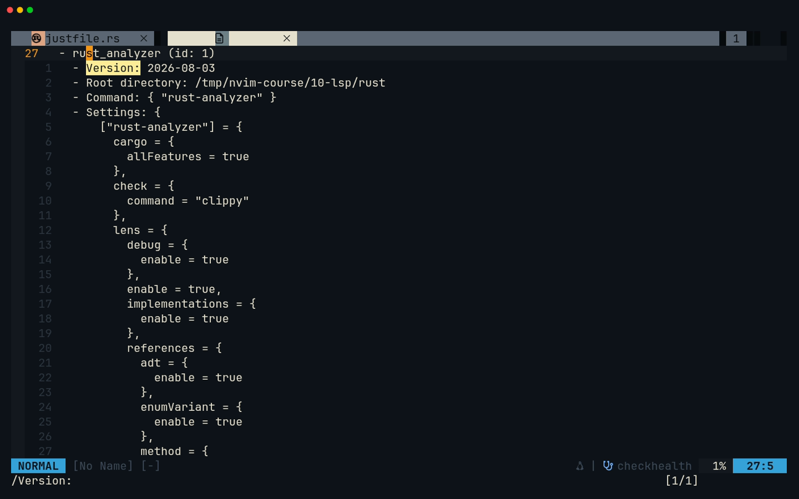
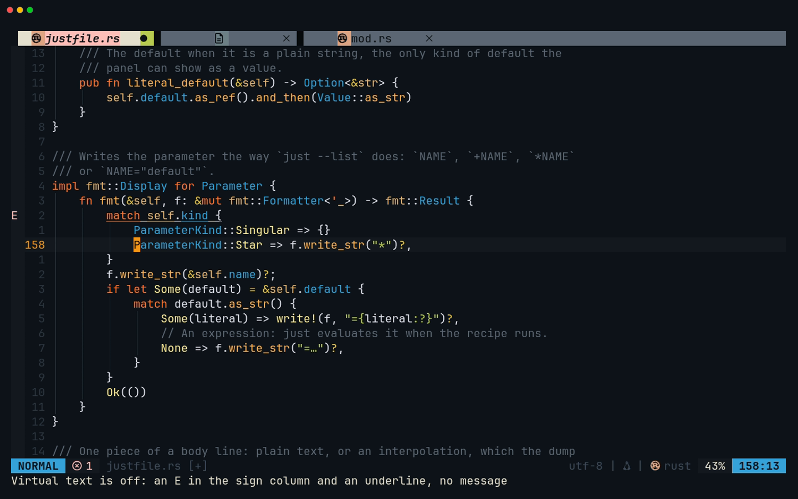
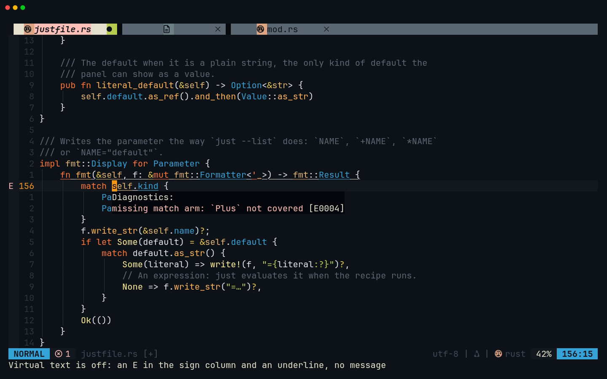
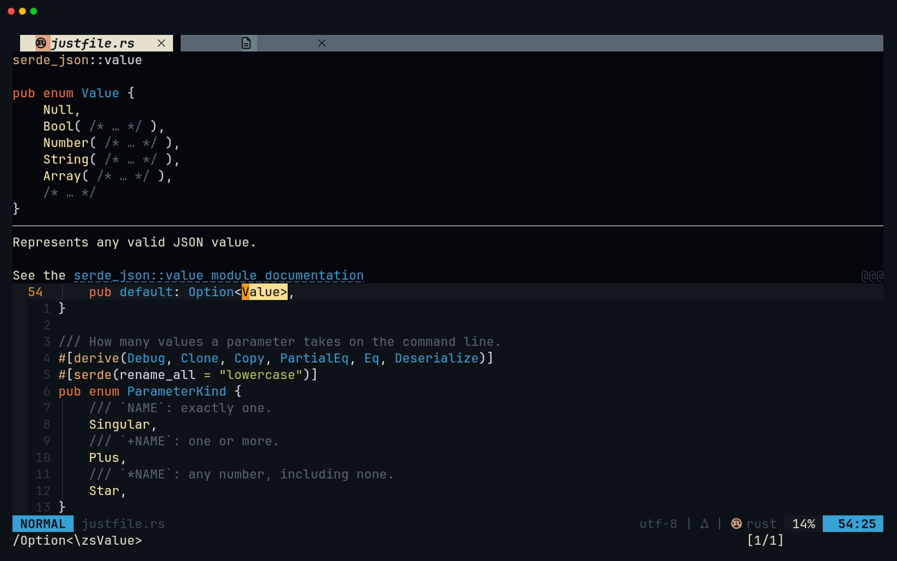
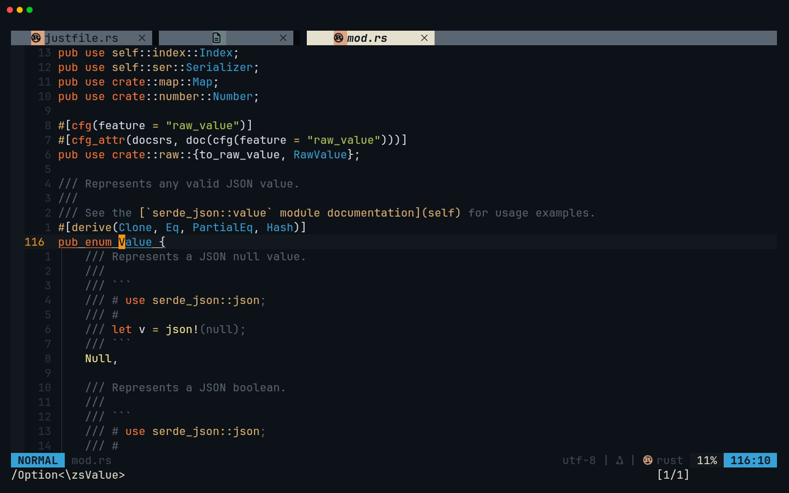
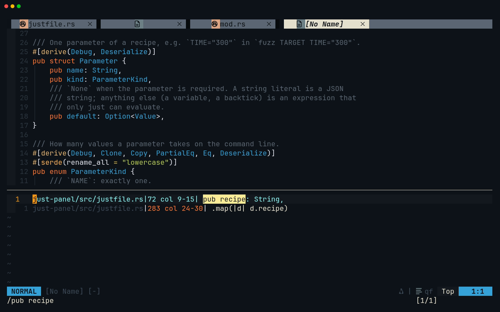

# Lesson 10 — LSP

**Last Updated**: 27/09/2026
**Version**: 1.0.0
**Maintained By**: Development Team
**Language**: British English (en_GB)
**Timezone**: Europe/London

---

A language server is the part of your editor that understands the code: it knows what `Value` is, where
`Deserialize` is defined, which lines use a field, and why a file does not compile. This lesson connects you to
the servers your config runs and teaches the keys that ask them questions, with one twist of this config at the
centre: errors are never printed in the text, so you learn to go and read them. You use all of it on real work.
just-panel learns to read `just --dump` with serde (JP3), and session-browser learns to read Claude Code's
transcripts (SB3). On the way you meet the two traps that would otherwise cost you an afternoon: two different
Rust toolchains, and a Python type checker that cannot see uv's virtual environment.

**Part**: 4 — Code intelligence · **Time**: ~150 min · **Previous**: [Lesson 09 — Project Pane](09-PROJECT-PANE.md) · **Next**: [Lesson 11 — Completion, formatting and diagnostics](11-COMPLETION-FORMATTING-DIAGNOSTICS.md)

## Objectives

By the end of this lesson you can:

- name the language servers this config starts for Rust, Python and TOML, and check which ones are attached to a
  buffer with `:checkhealth vim.lsp`;
- tell which rust-analyzer Neovim is running (rustup's or the flake dev shell's) and choose deliberately;
- read an error with virtual text off: the sign column, `]d` and `[d`, `<leader>ld` (`<leader>` is Space, so
  Space l d), `<C-w>d`;
- let the server write code for you with `<leader>ca`: add a missing `use`, fill in match arms;
- read documentation with `K` and signatures with `<leader>k`, then go to a definition with `gd` and come back with
  `<C-o>`;
- list references with `gr` (or `grr`) and rename with `<leader>rn`, and say why renaming a serde field broke the
  tests;
- make pyright see a uv project's `.venv` with `[tool.pyright]`, and explain the `diagnosticsMode` typo;
- finish milestones **JP3** and **SB3**.

## Before you start

- You have finished [lesson 09](09-PROJECT-PANE.md). Milestones **JP2** and **SB2** (from [lesson 08](08-FILE-PANE.md))
  are in place:
  - `rust/just-panel/src/justfile.rs` holds the plain types `Recipe`, `Parameter`, `ParameterKind` and
    `Dependency`, with no serde yet, and `src/main.rs` starts with `#![allow(dead_code)]`;
  - `python/session-browser/src/session_browser/models.py` holds `Source`, `Session` and `Message`, and
    `sources/claude.py` is still a one-line docstring.
- You are on laptop-intel with the **full** `laptop-intel` configuration.
- rustup is set up (lesson 06): `rustup component list --installed` lists `rust-analyzer`, `clippy` and `rustfmt`.
  If rust-analyzer is missing, run `rustup component add rust-analyzer`.
- The Python project has its virtual environment. In a terminal, check both capstones:

  ```bash
  # in ~/Repos/personal/nix-config/rust
  cargo test -p just-panel
  ```

  Expect `test result: ok. 0 passed`: JP2 has no tests yet.

  ```bash
  # in ~/Repos/personal/nix-config/python/session-browser
  uv sync
  uv run pytest -q
  ```

  Expect `13 passed`.
- **How to start Neovim for this lesson.** Open a Kitty window (`SUPER + RETURN`, then `SUPER + 0`: new windows open
  on workspace 10) and start Neovim from the repository, so that the editor and your terminals share one Rust
  toolchain (step 2 explains why):

  ```bash
  # in a Kitty window (SUPER + RETURN, then SUPER + 0)
  cd ~/Repos/personal/nix-config && nvim
  ```

  Bare `nvim` gives you the dock layout: the tree on the left and a terminal at the bottom. `<leader>` is
  **Space**, so `<leader>t` (Space t) toggles that terminal.
- **The completion menu will pop up while you type.** Lesson 11 teaches it properly. Until then, one rule: when a
  menu is open and you want a new line, press `<C-e>` (close the menu) **before** Enter. Enter on an open menu
  inserts the first suggestion (neovim.nix:305).
- Nothing is committed until [lesson 12](12-GIT.md).

## Keys in this lesson

| Keys | Mode | Action | Where it comes from |
| --- | --- | --- | --- |
| `K` | n | hover: documentation for the name under the cursor; press again to go into the float | config (LSP buffer-local, neovim.nix:344) |
| `q` (inside a hover or diagnostic float) | n | close the float; moving the cursor in the file closes it too | Neovim default |
| `<leader>k` | n | signature help for the call the cursor is in | config (LSP buffer-local, neovim.nix:350) |
| `<C-s>` | i | signature help while you type the arguments | Neovim 0.12 default |
| `gd` | n | go to definition | config (LSP buffer-local, neovim.nix:340) |
| `gD` | n | go to declaration | config (LSP buffer-local, neovim.nix:341) |
| `gi` | n | go to implementation(s) | config (LSP buffer-local, neovim.nix:342) |
| `grt` | n | go to the type's definition | Neovim 0.12 default |
| `<C-o>` / `<C-t>` | n | back to where you jumped from (jump list / tag stack) | Neovim default |
| `gr` | n | references into the quickfix list, after a 300 ms wait | config (LSP buffer-local, neovim.nix:343) |
| `grr` | n | references, with no wait | Neovim 0.12 default |
| `<leader>rn` / `grn` | n | rename the symbol everywhere | config (LSP buffer-local, neovim.nix:351) / Neovim 0.12 default |
| `<leader>ca` | n | code actions: a numbered list, pick with a number and Enter | config (LSP buffer-local, neovim.nix:352) |
| `gra` | n, x | code actions, also on a Visual selection | Neovim 0.12 default |
| `]d` / `[d` | n | next / previous diagnostic, with its float (always one step) | config (LSP buffer-local, neovim.nix:353-354) |
| `]D` / `[D` | n | last / first diagnostic in the buffer | Neovim 0.12 default |
| `<leader>ld` | n | the diagnostics of the cursor line, in a float | config (LSP buffer-local, neovim.nix:358) |
| `<C-w>d` | n | the same float, in any buffer | Neovim default |
| `]q` / `[q`, `:cclose` | n, c | next / previous quickfix entry; close the quickfix window | Neovim 0.12 default, Neovim default |
| `:checkhealth vim.lsp` | c | which servers are enabled, which are attached, with their root, command and settings | Neovim default |
| `:lsp restart [name]` | c | restart a language server | Neovim 0.12 default |
| `<C-u>` (in the rename prompt) | c | clear the prompt before typing the new name | Neovim default |

Every `config (LSP buffer-local)` key exists only in a buffer that a language server has attached to, and has no
description, so which-key shows it with a blank label ([lesson 05](05-YOUR-KEYBINDINGS.md), step 3).

## Walkthrough

Steps 1 and 2 look at the servers themselves. Steps 3 to 9 build **JP3** with rust-analyzer's help, and steps 10
to 12 build **SB3** with pyright's. The finished files are in the [Milestone](#milestone-jp3--sb3) section: when a
step says "type", that is where the text is. Keep this page open next to Neovim.

The recording shows steps 1, 4, 6, 8 and 9 on a copy of the finished JP3 code in `/tmp/nvim-course/10-lsp/rust`, so
its root directory reads that rather than `~/Repos/personal/nix-config/rust`:


[MP4](../media/10-lsp/10-lsp.mp4)

### 1. The servers, and how to see which one is attached

A language server is a separate program that reads your project and answers questions over the Language Server
Protocol (LSP): diagnostics, hover text, definitions, references, renames, code actions, completion and
formatting. Neovim is the client. Your config starts these for the capstones:

| Files | Server | Binary | Settings worth knowing | Lines |
| --- | --- | --- | --- | --- |
| Rust | `rust_analyzer` | **from `PATH`** (rustup, or the dev shell: step 2) | its checks run `clippy` instead of `cargo check`; every Cargo feature on | neovim.nix:425-438 |
| Python | `pyright` | pinned to the Nix store | `typeCheckingMode = "basic"`, and a misspelt `diagnosticsMode` (step 12) | neovim.nix:397-407 |
| Python | `ruff` (`ruff server`) | pinned to the Nix store | lint diagnostics and fixes (lesson 11) | neovim.nix:409 |
| TOML (`Cargo.toml`, `pyproject.toml`) | `taplo` | pinned to the Nix store | formats TOML when you save | neovim.nix:562 |
| Nix, Lua | `nil_ls`, `lua_ls` | pinned to the Nix store | – | neovim.nix:551-561 |

How they are wired:

- A small helper, `lsp(name, opts)` (neovim.nix:391-394), merges your overrides onto nvim-lspconfig's defaults
  (the command, filetypes and root markers of each server) and enables the server. Neovim then starts it the first
  time you open a matching file, rooted at the nearest project marker.
- Every server gets the same capabilities (neovim.nix:374-380). One line there is load-bearing: without
  `diagnostic.dynamicRegistration = false`, Python files show no diagnostics at all (the comment at
  neovim.nix:365-373 explains why).
- When a server attaches, an `LspAttach` autocommand (neovim.nix:335-360) creates the buffer-local keys in the table
  above. They exist only in that buffer.
- All the pinned servers are the same store paths Zed uses (neovim.nix:382-384). rust-analyzer is the exception
  (neovim.nix:426).

> **Zed habit:** Zed starts language servers for you and shows problems inline, on hover and in its diagnostics
> panel. Neovim runs the same servers, but you ask them questions with keys, and in this config you go to the
> error rather than the error coming to you (step 4).

**Try it**

1. Open the Rust file you will work on: `:e rust/just-panel/src/justfile.rs`.
2. Wait. The first time, rust-analyzer loads the whole Rust workspace and runs `cargo clippy` over it, which can
   take a minute or more. Later starts are quicker.
3. Run `:checkhealth vim.lsp`. The report opens in a new tab page. Search for the client with `/Version:`, then
   read the block around it.
4. Press `q` to close the report. `q` closes only its tab page: the report's buffer (`health://`) stays in the
   bufferline as a tab with no name, as in the recording. `:bd` instead of `q` closes both.

**What you should see**

Under **vim.lsp: Active Clients** there is one block for rust-analyzer, roughly:

```text
- rust_analyzer (id: 1)
  - Version: <what the binary reports about itself>
  - Root directory: ~/Repos/personal/nix-config/rust
  - Command: { "rust-analyzer" }
  - Settings: { ["rust-analyzer"] = { cargo = { allFeatures = true }, check = { command = "clippy" }, lens = { … } } }
  - Attached buffers: <this buffer's number>
```

(The settings are printed over several lines. `lens`, the code-lens options, comes from nvim-lspconfig's
defaults for rust-analyzer, which your settings are merged onto.) The **Version** is the binary's own: the dev
shell's rust-analyzer, built by nixpkgs, reports its release date (`2026-08-03` in the recording), while rustup's
reports the Rust release it belongs to, such as `1.94.0` (the kind of number steps 3 and 5 quote). Three things to
notice:

- **The root is `rust/`, not `rust/just-panel/`.** nvim-lspconfig asks cargo for the *workspace* root, so the crate
  only gets analysed because it is listed in `members` in `rust/Cargo.toml`, which `cargo new` did in lesson 06.
- **The command is a bare name**, `rust-analyzer`, found on `PATH`. Which one that is depends on how you started
  Neovim: that is step 2.
- **`cargo` and `check` are your settings** (neovim.nix:427-438): `check = { command = "clippy" }` is why clippy's
  warnings will appear in the editor.



The section **vim.lsp: Enabled Configurations** lists every server the config enables, with a warning for any
whose command is not installed. That is the first place to look when a server never attaches
([appendix C](../appendices/C-TROUBLESHOOTING.md)).

### 2. Which rust-analyzer? The two Rust toolchains

neovim.nix:426 leaves rust-analyzer to `PATH` ("rust-analyzer comes from rustup"). On laptop-intel two toolchains
can answer to that name:

- **rustup**, a system package (modules/software/development.nix:82-84). You set it up once with
  `rustup default stable && rustup component add rust-analyzer`.
- **The flake's dev shell** (flake.nix:384-402): nixpkgs' Rust 1.98 `cargo`, `rustc`, `rust-analyzer`, `clippy` and
  `rustfmt`, plus `pkg-config` and OpenSSL. The repository's `.envrc` says `use flake`, and direnv is allowed to load
  it anywhere under `~/Repos` (home/stages/dev.nix:23-31). So any zsh whose working directory is inside the repo has
  the dev shell's tools first on `PATH`.

Which one Neovim gets depends on how it started:

| How you started Neovim | Its environment | rust-analyzer and cargo it runs |
| --- | --- | --- |
| `nvim` typed in a zsh inside the repo (this lesson) | the dev shell, loaded by direnv | nixpkgs' (Rust 1.98) |
| `SUPER + SHIFT + RETURN` or `SUPER + CTRL + RETURN` (the dev layouts run `kitty --class … -e nvim`) | Hyprland's, with no zsh and so no direnv | rustup's |
| `SUPER + ALT + RETURN` (`kitty -e nvim`) | the same | rustup's |

The terminal inside Neovim (`<leader>t`) is always a zsh, so inside the repo it always has the dev shell. Start
Neovim from the dev layout and the editor checks your code with rustup's toolchain while `cargo test` in the
terminal uses nixpkgs'. Usually that only means two slightly different clippy versions. It can also mean that
rust-analyzer's workspace-wide clippy check stops at `openssl-sys`, which `wireguard-helper` and `malware-scanner`
need and which only the dev shell provides. Those errors belong to other crates and never change just-panel's
own results (verify on laptop-intel).

**Try it**

In Neovim:

```vim
:lua print(vim.fn.exepath('rust-analyzer'))
```

Then in `<leader>t`:

```bash
# in ~/Repos/personal/nix-config (Space t)
command -v rust-analyzer
rust-analyzer --version
rustup which rust-analyzer
```

**What you should see**

- `exepath` prints the file Neovim runs. Started as in this lesson, it is a `/nix/store/…` path, the same as
  `command -v rust-analyzer` in the terminal, and `rust-analyzer --version` matches the **Version** line of step 1.
- `rustup which rust-analyzer` shows rustup's own binary, which the dev layouts would have run instead.

> **Tip:** you do not have to give up the dev layout. Either accept the difference (the terminal is the one that
> counts for `cargo test`), or start Neovim from the repo shell whenever you work on just-panel. Restarting only the
> server (`:lsp restart rust_analyzer`) does not switch toolchains, because the server inherits Neovim's `PATH`.

### 3. Start JP3: dependencies, then an error you cannot see

JP3 teaches `justfile.rs` to deserialise the output of `just --dump --dump-format json` with serde. First the
dependencies.

**Try it**

1. `:e rust/just-panel/Cargo.toml` and add the three lines under `[dependencies]` shown in
   [JP3 step 1](#jp3-step-1-dependencies). Save with `<C-s>`. taplo formats TOML when you save and leaves this file
   as it is.
2. `:e rust/just-panel/src/justfile.rs`. Add `Deserialize` to the end of all four `#[derive(...)]` lists:
   `#[derive(Debug)]` becomes `#[derive(Debug, Deserialize)]` (three times) and
   `#[derive(Debug, Clone, Copy, PartialEq, Eq)]` becomes `#[derive(Debug, Clone, Copy, PartialEq, Eq, Deserialize)]`.
3. Look at the file for a moment. Then save with `<C-s>` and wait a few seconds.

> **Tip:** four identical edits are a macro ([lesson 04](04-SEARCH-REGISTERS-MACROS.md)). `/derive(Debug` and
> Enter, then `qa`, `f)`, `i, Deserialize`, `<Esc>`, `n`, `q` records the first one, and `3@a` does the other three.

**What you should see**

- **Before saving:** nothing. rust-analyzer's own checks run as you type, but (in rust-analyzer 1.92, the version
  this was checked with) they do not report an unknown derive macro. The compiler does.
- **After saving:** rust-analyzer runs `cargo clippy` (it does so after every save, and once at start-up). A few
  seconds later there is an **`E`** in the sign column on each derive line and a thin underline under
  `Deserialize`, but **no error text anywhere in the buffer**. An **`H`** (hint) also appears near the top of the
  file, and the bufferline marks `justfile.rs` as having errors (`diagnostics = 'nvim_lsp'`, neovim.nix:726).

The underline and the letters are all you get, because Neovim turned inline diagnostic text (`virtual_text`) off by
default in 0.11 and your config never turns it back on. Step 4 is how you read the message.

### 4. Read a diagnostic with virtual text off

A **diagnostic** is one problem a server reports: an error (`E`), a warning (`W`), information (`I`) or a hint (`H`),
attached to a range of text. Four ways to read one:

| Keys | What it does | Best for |
| --- | --- | --- |
| `]d` / `[d` | jump to the next / previous diagnostic **and** open its float | walking through the problems in a file |
| `<leader>ld` | float with every diagnostic on the cursor line | the line you are on |
| `<C-w>d` | the same float, built into Neovim | any buffer, even one without a server |
| `]D` / `[D` | jump to the last / first diagnostic, no float | getting to the end or start fast |

The float closes when you move the cursor. Press `<leader>ld` twice to go into it (to scroll or yank a long
message), and `q` to leave.

**Try it**

1. `gg`, then `]d`. You land on the hint near the top. Read the float.
2. `]d` again. You land on the first derive line. Read the float.
3. Stay on that line and press `<leader>ld`, then move the cursor. Then `<C-w>d`.
4. `]D` jumps to the last diagnostic, `[D` back to the first.

**What you should see**

- The hint says `` consider importing this derive macro: `use serde::Deserialize;` ``. It sits where the `use` line
  would go.
- The error says `` cannot find derive macro `Deserialize` in this scope ``, with `rustc` as its source: the
  compiler's own message, via clippy.

The recording shows the same thing for a different error (a match arm deleted from the finished JP3 code, as in
step 7): one `E` in the sign column and an underline under `self.kind`, then the float that `]d` opens.

Not every underline is a diagnostic. indent-blankline (neovim.nix:750-752) draws the thin vertical indent guides, and
it also underlines the first line of the block the cursor is in: `match self.kind {` while the cursor is on a match
arm, the whole `fn fmt(…)` line in the second screenshot. That is why the recording presses `{` (up to the blank line
above the `impl`'s comment) before the first screenshot: outside every block, only the error's underline is left.





> **Gotcha:** your `]d` and `[d` (neovim.nix:353-354) always move exactly one diagnostic, so `3]d` moves one. In
> buffers without a server, Neovim's own `]d` is back and does take a count. For a whole list, use Trouble
> (`<leader>xx`, [lesson 11](11-COMPLETION-FORMATTING-DIAGNOSTICS.md)).

### 5. Code actions: let rust-analyzer write the `use` lines

A **code action** is an edit the server offers for the code under the cursor: add an import, fill in missing code,
apply a compiler suggestion, restructure something. `<leader>ca` asks for them and shows a numbered list at the
bottom of the screen, titled `Code actions:`. Type the number and press Enter. Enter on its own, or `q`, cancels.

**Try it**

1. Put the cursor on `Deserialize` in the first derive line and press `<leader>ca`.
2. Choose `` Import `serde::Deserialize` ``. With rust-analyzer 1.92 it was number 1. The number can differ between
   versions, so read the titles rather than typing `1` by habit.
3. Save with `<C-s>`. After clippy has run again, the signs are gone.
4. Now the first real JP3 change. In `struct Parameter`, change `pub default: Option<String>,` to
   `pub default: Option<Value>,`. Save. An `E` appears: `` cannot find type `Value` in this scope ``.
5. `<leader>ca` on `Value`, choose `` Import `serde_json::Value` ``, save again.

**What you should see:** `use serde::Deserialize;` and then `use serde_json::Value;` appear near the top of the
file, and after each save the signs clear. These are exactly two of the `use` lines of the finished file.

> **Why `Value`?** A parameter's default in the dump is a JSON string for a literal (`TIME="5"`), but an array
> for anything just has to evaluate, such as a variable or a backtick. `Option<String>` would reject those, so the
> field keeps whatever JSON is there, and a helper reads it as a string when it is one.

The same list offered other actions too, such as `` Qualify as `serde::Deserialize` `` (write the full path instead
of importing). Code actions are context-sensitive: they depend on what is under the cursor and on the diagnostics
of that line. `<leader>ca` is Normal mode only. For a Visual selection, use Neovim's `gra`.

### 6. Hover and signature help

`K` asks the server what the name under the cursor is. `<leader>k` (not `<C-k>`, which is window-up: the comment at
neovim.nix:345-349 explains the move) shows the signature of the function call the cursor is in. In Insert mode,
Neovim's own `<C-s>` does the same while you type the arguments.

**Try it**

1. Put the cursor on `Value` in `pub default: Option<Value>,` and press `K`.
2. Press `K` again: the cursor goes into the float. Scroll with `j`/`k`, then press `q`.
3. Press `K` on `Deserialize` in `use serde::Deserialize;`.

**What you should see:** for `Value`, a float headed `serde_json::value`, then `pub enum Value {` with its variants
(`Null`, `Bool`, `Number`, `String`, `Array`, …) and below a rule the documentation, starting "Represents any valid
JSON value." For `Deserialize`, serde's documentation of the trait. The float only gets the rows on one side of the
cursor line. If it is cut short (`@@@` at its last line), press `K` again to go in and scroll, or first move the line
out of the middle of the window with `zb` or `zt`: the recording presses `zb`.



Signature help needs a call, so you try it in step 7, when you type `parse`.

### 7. Type the rest of JP3, with "Fill match arms"

Now make `justfile.rs` match [JP3 step 3](#jp3-step-3-justfilers) exactly. Your derives and two `use` lines are
already right. Around them, the file gains:

- a longer module comment, and the other `use` lines;
- `Dump`, the one field of the dump the panel reads;
- the serde attribute `#[serde(rename_all = "lowercase")]` on `ParameterKind`, because the dump writes
  `"singular"`, `"plus"` and `"star"`;
- two new `Recipe` fields, `attributes` and `body`, kept as `Value` because their shape varies;
- helper methods, `impl fmt::Display for Parameter`, and the functions `parse`, `load` and `just_command`;
- eight unit tests, which read the fixture from [JP3 step 2](#jp3-step-2-the-test-fixture) (do that step first).

Two moments on the way are worth doing the server's way.

**Signature help.** In `parse`, type up to `serde_json::from_str(` and press `<C-s>` (Insert mode): the signature
appears above the cursor. Finish the line, `<Esc>`, put the cursor inside the brackets and press `<leader>k`.

**Fill match arms.** When you reach `impl fmt::Display for Parameter`, type the `fn fmt(...)` line and, as its
first statement, only this:

```rust
        match self.kind {}
```

Then `<Esc>`. This time an `E` appears **without saving**: a missing match arm is one of rust-analyzer's own checks.
(A second error, about the return type, may join it until the function ends with `Ok(())`. Ignore it for now.)
With the cursor on `self.kind`, press `<leader>ca` and choose `Fill match arms`.

**What you should see:** rust-analyzer writes one arm per variant, each with `todo!()` as a placeholder:

```rust
        match self.kind {
            ParameterKind::Singular => todo!(),
            ParameterKind::Plus => todo!(),
            ParameterKind::Star => todo!(),
        }
```

Replace the three bodies with the finished file's: `{}`, `f.write_str("+")?` and `f.write_str("*")?`. The `E`
goes as soon as all three arms exist; `todo!()` compiles, it just panics if it ever runs.

When the whole file is typed, save and run the tests in `<leader>t`:

```bash
# in ~/Repos/personal/nix-config/rust (Space t)
cargo test -p just-panel
```

Expect `test result: ok. 8 passed`. If a test fails, compare your file with the milestone's line by line: the
tests compare exact strings.

### 8. Go to definition, and back

`gd` jumps to where the name under the cursor is defined, even in another crate. Neovim records where you came from
twice over: in the jump list (`<C-o>` goes back, [lesson 02](02-MOTIONS.md)) and in the tag stack (`<C-t>` goes
back). When a name has several definitions, you get the quickfix list instead of a jump: move to an entry and press
Enter.

**Try it**

1. `gd` on `Value` in `pub default: Option<Value>,`. Look around, then `<C-o>`.
2. `gd` on `Deserialize` in `use serde::Deserialize;`, then `<C-t>`.
3. `gd` on `Deserialize` inside `#[derive(Debug, Deserialize)]`, then `<C-o>`.
4. In `parse`, put the cursor on `dump` in `let dump: Dump = …` and press `grt` (type definition).
5. `gd` on `ParameterKind` in `pub kind: ParameterKind,`, then `<C-o>`.

**What you should see**

1. serde_json's `src/value/mod.rs`, on `pub enum Value {`, with `#[derive(Clone, Eq, PartialEq, Hash)]` just above
   it. The file lives in cargo's download cache, `~/.cargo/registry/src/…/serde_json-1.0.151/`.
2. `serde_core-1.0.229/src/de/mod.rs`, at `pub trait Deserialize<'de>`. serde keeps the trait in its `serde_core`
   crate and re-exports it.
3. `serde_derive-1.0.229/src/lib.rs`: the derive macro that writes the `Deserialize` code for your structs. The
   same name leads to a different place depending on where you ask.
4. `struct Dump {` in your own file.
5. `pub enum ParameterKind {`, in the same file.



The version numbers in those paths are the ones the course was checked with. Yours follow `rust/Cargo.lock`, which
already pins these crates for the other tools: at the time of writing serde_json 1.0.149 and serde, serde_core and
serde_derive 1.0.228, so expect `serde_json-1.0.149/` and `serde_core-1.0.228/`. You land on the same definitions.

> **Gotcha:** files you reach this way are the crates' own sources in cargo's cache, shared by every project on the
> machine. Read them, never edit them. They stay in the bufferline until you close them.

`gi` (implementations) on a type lists its `impl` blocks. `gD` (declaration) also exists, but for Rust `gd` is the
one you want. In buffers with a server, your `gi` replaces Neovim's own `gi` (insert where you last stopped
inserting).

### 9. References, rename, and a serde trap

`gr` lists every use of the name under the cursor in the quickfix list, which opens at the bottom with the cursor in
it. Enter jumps to an entry; from the file, `]q` and `[q` step through the list, and `:cclose` closes it.

**Try it (references)**

1. In `struct Dependency`, put the cursor on `recipe` in `pub recipe: String,`.
2. Type `gr` and wait. Then `:cclose` and try `grr`.

**What you should see:** a quickfix window at the bottom (its statusline says `qf`) with two entries: the field
itself and `.map(|d| d.recipe)` in the test `reads_dependencies_and_attributes`. `gr` takes about a third of a second
longer than `grr`: your `gr` is a prefix of Neovim's `grn`, `gra`, `grr`, `gri`, `grt` and `grx`, so Neovim waits
`timeoutlen` (300 ms, neovim.nix:270) to see whether you meant one of them.



If `gr` says `No references found` straight after Neovim started, rust-analyzer was still busy. Its answer came
back as "content modified", which Neovim does not show. Wait a few seconds and ask again.

Now rename that field, and watch what the compiler cannot see.

**Try it (rename)**

1. Cursor still on `recipe`, press `<leader>rn`. The prompt reads `New Name: recipe`.
2. `<C-u>` clears it. Type `name` and press Enter. Both places change.
3. Save, and run the tests:

   ```bash
   # in ~/Repos/personal/nix-config/rust (Space t)
   cargo test -p just-panel
   ```

4. Back in `justfile.rs`, press `u`: the rename was one change, so one undo brings `recipe` back in both places
   (if it does not, press `u` again). Save, and run the tests again.

**What you should see:** after the rename everything compiles, but six of the eight tests fail with
`` missing field `name` at line 1 column 641 ``. After the undo, all eight pass again.

> **Why:** rust-analyzer renamed every *Rust* use of the field, exactly as promised. But `#[derive(Deserialize)]`
> reads each field from the JSON key with the same name, so the struct now asks the dump for a key called `name`
> that the dump does not have. A serde field name is a file format. To rename such a field in Rust only, you would
> keep the key with `#[serde(rename = "recipe")]`. The tests caught it, which is what the tests are for.

### 10. SB3: pyright cannot see the venv

Switch to the Python capstone. At SB2 the project has a `.venv` made by uv, and `uv run pytest` passes. Neovim
disagrees.

**Try it (before)**

1. `:e python/session-browser/src/session_browser/app.py`. Wait a moment.
2. `gg`, then `]d`.
3. `:e python/session-browser/tests/test_models.py`, `gg`, `]d`.
4. `:checkhealth vim.lsp`, and find the `pyright` and `ruff` clients. `q`.

**What you should see:** `E` on lines 3 and 4 of `app.py`, and the floats say `Import "textual.app" could not be
resolved` and `Import "textual.widgets" could not be resolved`. In `test_models.py`: `Import "pytest" could not be
resolved`. Both Python servers are attached, with the root directory `~/Repos/personal/nix-config/python/session-browser`
(the folder holding `pyproject.toml`).

**Why.** pyright looks for the Python environment in this order: `venvPath` + `venv` from its configuration, then a
`python.pythonPath` setting, then whichever `python` is first on `PATH`. Neither of the first two is set, and the
`python` on `PATH` is the system Python 3.14, which has never heard of Textual or pytest. `uv run` works because uv
always uses the project's `.venv`; pyright knows nothing about uv. Started from the dev layout, Neovim sees the
same system Python, so the error is not about how you launch it.

**The fix** is two lines in `pyproject.toml`, [SB3 step 1](#sb3-step-1-point-pyright-at-the-venv). They also fix
`pyright` on the command line, whatever shell you use.

**Try it (after)**

1. `:e python/session-browser/pyproject.toml` and add the `[tool.pyright]` table from SB3 step 1.
2. Save with **`:noautocmd w`**, not `<C-s>`. A plain save runs format-on-save, and for TOML that is taplo, which
   rewrites this file: it pulls the short `dependencies = [...]` list onto one line and re-indents the dev
   dependencies with two spaces. `:noautocmd w` writes the file without running any autocommand, so without the
   formatter, which conform runs in a `BufWritePre` autocommand. Lesson 11 covers formatting.
3. `:lsp restart pyright`, so pyright reads its configuration again.
4. Go back to `app.py` with `:b app.py`, then `gg`, `]d`.
5. In `<leader>t`:

   ```bash
   # in ~/Repos/personal/nix-config/python/session-browser (Space t)
   pyright
   ```

**What you should see:** no signs in `app.py`, and `]d` finds nothing to move to. `K` on `App` in
`from textual.app import App, ComposeResult` now shows Textual's documentation. The command-line check ends with
`0 errors, 0 warnings, 0 informations`.

> **Tip:** two other ways out, both worse. Start Neovim from a shell where you have run
> `source .venv/bin/activate`, which works until the day you forget. Or run `:LspPyrightSetPythonPath` with the
> path to `.venv/bin/python` (a command nvim-lspconfig adds to Python buffers), which lasts one session.

### 11. SB3 with the Python servers

Now type SB3's Python files, in the order of [SB3 steps 2 to 6](#sb3-step-2-the-test-fixtures): the fixtures first,
then `sources/__init__.py`, `sources/claude.py`, `tests/conftest.py` and `tests/test_claude.py`. The keys you used
on Rust work the same here. Try these on the way (the float texts are pyright 1.1.414's; the pinned pyright on
laptop-intel may lay them out slightly differently):

- **`K` on a dataclass attribute.** `models.py` documents each field with a docstring under it. In
  `test_claude.py`, put the cursor on `updated` in `assert session.updated == datetime(...)` and press `K`: the float
  shows `(variable) updated: datetime` and below it "Time of the last activity. Always timezone-aware, see
  `__post_init__`." That is why SB2 wrote those docstrings.
- **`K` on your own function.** In the same file, `K` on `load_sessions` in `claude.load_sessions()` shows its
  signature, `def load_sessions(root: Path | None = None) -> list[Session]`, and its docstring.
- **`gd` across modules.** In `claude.py`, `gd` on `read_entries` opens `sources/__init__.py` at its definition.
  `<C-o>` comes back.
- **`<leader>k` in a constructor call.** Inside the `Session(` call at the end of `read_session`, `<leader>k` lists
  the fields in order with their types, so you can check the keyword arguments against them.
- **`gr` on `one_line`** in `sources/__init__.py` lists where the titles are shortened.

When all six steps are done, run the [SB3 checks](#check-sb3). Expect `24 passed`.

### 12. The `diagnosticsMode` typo

The pyright settings (neovim.nix:402) say `diagnosticsMode = "workspace"`. Pyright's setting is called
`diagnosticMode`, without the s. An unknown key is ignored without a word, so the real key keeps the value that
nvim-lspconfig's defaults for pyright give it, `openFilesOnly` (pyright's own default too): pyright reports problems
only in files you have open.

**Try it**

```vim
:lua =vim.lsp.get_clients({ name = 'pyright' })[1].config.settings
```

**What you should see:** under `analysis`, both keys side by side:

```text
      diagnosticMode = "openFilesOnly",
      diagnosticsMode = "workspace",
```

`diagnosticMode` comes from nvim-lspconfig's defaults (v2.11.0, `lsp/pyright.lua`), which your settings are merged
onto, and it is the one pyright reads. `diagnosticsMode` is the config's misspelt key, which pyright ignores. The
other entries, `autoSearchPaths`, `useLibraryCodeForTypes` and `pyright = { disableTaggedHints = true }`, come from
the same defaults.

What it means for you now: a type error in a Python file you have not opened does not appear in Neovim at all, not
even in Trouble. Run `pyright` (or the milestone's `uvx pyright`) in the project before you trust a clean editor.
[Lesson 25](25-FIX-PYRIGHT-DIAGNOSTIC-MODE.md) fixes the key and discusses whether you want workspace mode.

## Gotchas in this config

- **No inline error text.** Neovim 0.11 turned `virtual_text` off by default and the config never turns it on, so
  errors are an `E` in the sign column, an underline and a mark in the bufferline. Read them with `]d`,
  `<leader>ld`, `<C-w>d`, or the Trouble list (lesson 11).
- **Compiler errors appear only after you save.** rust-analyzer's own checks (a missing match arm, for example)
  update as you type. rustc's and clippy's run as `cargo clippy` after each save and once at start-up, and replace
  the old ones only when that run finishes.
- **`gr` waits 300 ms.** It is a prefix of Neovim's `grn` `gra` `grr` `gri` `grt` `grx`. `grr` does the same with no
  wait.
- **`]d` and `[d` ignore counts** in buffers with a server (neovim.nix:353-354). They also pass Neovim 0.12's
  deprecated `float` option. That is silent until Neovim 0.13, so nothing to do yet.
- **LSP keys exist only where a server is attached,** and they have no descriptions: in which-key, `k` has a blank
  label and `l` and `r` show as `+1 keymap`. `<leader>k` is signature help, not `<C-k>` (window-up).
- **`<leader>ca` is Normal mode only.** Use `gra` on a Visual selection. Inside a Diffview tab `<leader>ca` means
  "choose all versions", and Diffview deletes the LSP map when it closes ([lesson 12](12-GIT.md)): `gra` still works.
- **In LSP buffers `gi`, `gd` and `gD` replace Neovim's built-in meanings.** `gi` there is "go to implementation",
  not "insert where I stopped".
- **Two Rust toolchains.** Neovim started from a repo shell runs the dev shell's rust-analyzer; started from the dev
  layout, rustup's. Check with `:lua print(vim.fn.exepath('rust-analyzer'))`. `:lsp restart` cannot switch: restart
  Neovim from the right place.
- **rust-analyzer's root is the workspace** (`rust/`). A crate missing from `members` gets no analysis. After editing
  `rust/Cargo.toml`, rust-analyzer normally reloads by itself; if it does not, `:LspCargoReload` (from nvim-lspconfig)
  or `:lsp restart rust_analyzer`.
- **pyright does not know about uv.** Without `[tool.pyright] venvPath = "."` and `venv = ".venv"`, every third-party
  import is "could not be resolved", in Neovim and on the command line.
- **`diagnosticsMode` is a typo** for `diagnosticMode`, so pyright only checks open files.
  [Lesson 25](25-FIX-PYRIGHT-DIAGNOSTIC-MODE.md) fixes it.
- **Saving TOML reformats it.** TOML has no conform formatter, so format-on-save falls back to taplo
  (neovim.nix:933-936, :974-977), which collapses short arrays and re-indents with two spaces. `pyproject.toml`
  changes shape; `rust/just-panel/Cargo.toml` does not. Save TOML you want untouched with `:noautocmd w`.
- **Never save a fixture from Neovim.** The copies in `tests/fixtures` must stay byte-identical to the course's
  (lesson 12 checks it), and format-on-save would rewrite JSON with prettier. Look at them with `:view` or leave
  with `:q!`.
- **"No references found" right after start-up** means rust-analyzer was still indexing. Ask again.

## Drills

1. In `justfile.rs`, find every use of `Parameter::is_variadic`, jump to the one in a test, then get back to where
   you started.

   <details><summary>Answer</summary>

   Cursor on `is_variadic` in `pub fn is_variadic(&self)`, then `grr` (or `gr` and wait). The quickfix list holds the
   definition and `recipe("rebuild").parameters[0].is_variadic()` in `reads_parameters_and_their_defaults`. Move to
   that entry and press Enter. `:cclose`, then `<C-o>` until you are back.

   </details>

2. Without scrolling, find out what type `parse` deserialises into and where that type is defined.

   <details><summary>Answer</summary>

   In `parse`, cursor on `dump` in `let dump: Dump = …` and `grt` jumps to `struct Dump {`. `gd` on `Dump` in the
   same line does the same. `<C-o>` to return.

   </details>

3. Show the documentation of `anyhow::Context` without leaving `justfile.rs`, then open its source and come back.

   <details><summary>Answer</summary>

   `K` on `Context` in `use anyhow::{bail, Context, Result};`. Then `gd` on it opens anyhow's source in cargo's
   cache, and `<C-o>` (or `<C-t>`) returns.

   </details>

4. Delete the `ParameterKind::Star` arm in `impl fmt::Display for Parameter` (do not save). Read the error three
   different ways, then put the line back.

   <details><summary>Answer</summary>

   `dd` on the arm. An `E` appears on `match self.kind {` without saving, because a missing match arm is one of
   rust-analyzer's own checks. Then any three of: `gg` and `]d` (jump plus float); `<leader>ld` on that line;
   `<C-w>d` on that line; `<leader>xw` (Trouble, lesson 11). The message is `` missing match arm: `Star` not covered ``.
   `u` restores the arm.

   </details>

5. Rename the local variable `words` in `Recipe::signature` to `parts`, check that it still compiles, then undo.
   Why is this rename safe when step 9's was not?

   <details><summary>Answer</summary>

   Cursor on `words`, `<leader>rn` (or `grn`), `<C-u>`, `parts`, Enter. Three lines change. Save; the tests pass.
   `u`, then save again. It is safe because a local variable is invisible outside the function: no JSON key, no
   public API, no other file depends on its name.

   </details>

6. Which rust-analyzer is Neovim using right now, and which version is it?

   <details><summary>Answer</summary>

   `:lua print(vim.fn.exepath('rust-analyzer'))` gives the file. A `/nix/store/…` path means the dev shell's; any
   other path means rustup's. `:checkhealth vim.lsp` shows the version the server reported, on the **Version** line
   of the `rust_analyzer` client.

   </details>

7. Open `python/session-browser/tests/test_models.py`. How can you tell, in two keys, that pyright now sees the
   venv?

   <details><summary>Answer</summary>

   `gg` then `]d`: no `Import "pytest" could not be resolved` (with nothing else wrong, `]d` has nothing to jump
   to). Or `K` on `pytest` in `import pytest` now describes the module (`(module) pytest`) instead of showing nothing.

   </details>

8. You typed `3]d` in a Rust file and moved one diagnostic. Why, and what moves three?

   <details><summary>Answer</summary>

   In buffers with a server, `]d` is the config's version, which hard-codes a step of one (neovim.nix:354). Press
   `]d` three times, or open the list with `<leader>xw` and move in it. In a buffer without a server, Neovim's own
   `]d` takes the count.

   </details>

## Milestone JP3 + SB3

**Goal.** just-panel can parse `just --dump --dump-format json` leniently, so dumps from just 1.46 (Ubuntu) and
1.58 (laptop-intel) both work, and it can build the `just` command for a justfile. session-browser can list Claude
Code sessions from `CLAUDE_CONFIG_DIR` (or `~/.claude`), reading only the two ends of each transcript, and pyright
sees the project's venv. Every test runs against synthetic fixtures copied from the course, never against your real
justfile or your real sessions.

> **Tip:** type the parts the walkthrough asks for, because that is where the language servers help: the
> derives, the two imports, `Fill match arms`, the calls you read with `K` and `<leader>k`. The rest, and the
> long test modules above all, you may paste. Copy a block from the rendered page and use lesson 06's method
> ([Step 0 tip](06-TERMINAL.md#step-0-two-named-terminals)): `:%d _`, `:0put +` and `:$d _` replace a whole
> file without going through Insert mode. Save TOML with `:noautocmd w`, and never save a fixture from Neovim.

### JP3 step 1: dependencies

The workspace already declares all three crates: `anyhow` at `rust/Cargo.toml:32`, `serde` and `serde_json` at
`rust/Cargo.toml:43-44`. The crate only has to ask for them. The whole of `rust/just-panel/Cargo.toml`:

```toml
[package]
name = "just-panel"
version.workspace = true
edition.workspace = true
authors.workspace = true
license.workspace = true

[[bin]]
name = "just-panel"
path = "src/main.rs"

[dependencies]
anyhow = { workspace = true }
serde = { workspace = true }
serde_json = { workspace = true }
```

Nothing else in `rust/Cargo.toml` changes. The first build adds the three names to just-panel's entry in
`rust/Cargo.lock`. All three are in the lock already, for the other tools.

### JP3 step 2: the test fixture

The tests compile the course's sample dump into the binary with `include_str!`, so they never run `just` or read
a file at run time. Copy it exactly:

```bash
# in ~/Repos/personal/nix-config
mkdir -p rust/just-panel/tests/fixtures
cp docs/NEOVIM-COURSE/fixtures/just/dump.json rust/just-panel/tests/fixtures/dump.json
cmp docs/NEOVIM-COURSE/fixtures/just/dump.json rust/just-panel/tests/fixtures/dump.json
```

`cmp` prints nothing when the copy is identical. `dump.json` is the unedited output of just 1.46 for
`docs/NEOVIM-COURSE/fixtures/just/justfile`, one long line. Its `source` field holds the path of the machine it
was made on. Nothing reads that field.

### JP3 step 3: `justfile.rs`

The whole of `rust/just-panel/src/justfile.rs`. It replaces the JP2 file. `main.rs` does not change: its
`#![allow(dead_code)]` stays until lesson 14 calls this code.

```rust
//! The justfile model: recipes and their parameters, loaded from `just --dump`.
//!
//! `just --dump --dump-format json` describes a justfile in far more detail
//! than the panel needs, and its shape grows between just releases: 1.58 (on
//! NixOS) adds parameter fields that 1.46 (on Ubuntu) does not have. So these
//! types pick out only the fields the panel uses. Serde skips every other
//! field, and the ones whose shape varies (defaults, attributes, recipe
//! bodies) stay a `serde_json::Value` and are read with care.

use std::collections::BTreeMap;
use std::fmt;
use std::path::Path;
use std::process::Command;

use anyhow::{bail, Context, Result};
use serde::Deserialize;
use serde_json::Value;

/// The parts of a dump the panel reads.
#[derive(Deserialize)]
struct Dump {
    /// Keyed by name, so alphabetical: source order is not in the dump.
    recipes: BTreeMap<String, Recipe>,
}

/// One recipe, as `just --dump --dump-format json` describes it.
#[derive(Debug, Deserialize)]
pub struct Recipe {
    pub name: String,
    /// The comment line directly above the recipe. Only the last line of a
    /// longer comment block makes it into the dump.
    pub doc: Option<String>,
    pub parameters: Vec<Parameter>,
    /// Recipes that just runs before this one.
    pub dependencies: Vec<Dependency>,
    /// Named `_like-this` or marked `[private]`: `just --list` hides it, and
    /// so does the panel.
    pub private: bool,
    /// `"private"` for a bare attribute, `{"group": "rust"}` for one with a
    /// value.
    pub attributes: Vec<Value>,
    /// One array per line, holding text and `{{…}}` interpolations.
    pub body: Value,
}

/// One parameter of a recipe, e.g. `TIME="300"` in `fuzz TARGET TIME="300"`.
#[derive(Debug, Deserialize)]
pub struct Parameter {
    pub name: String,
    pub kind: ParameterKind,
    /// `None` when the parameter is required. A string literal is a JSON
    /// string; anything else (a variable, a backtick) is an expression that
    /// only just can evaluate.
    pub default: Option<Value>,
}

/// How many values a parameter takes on the command line.
#[derive(Debug, Clone, Copy, PartialEq, Eq, Deserialize)]
#[serde(rename_all = "lowercase")]
pub enum ParameterKind {
    /// `NAME`: exactly one.
    Singular,
    /// `+NAME`: one or more.
    Plus,
    /// `*NAME`: any number, including none.
    Star,
}

/// A recipe that has to run before another one.
#[derive(Debug, Deserialize)]
pub struct Dependency {
    pub recipe: String,
}

impl Recipe {
    /// The recipe as `just --list` shows it, e.g. `fuzz TARGET TIME="300"`.
    pub fn signature(&self) -> String {
        let mut words = vec![self.name.clone()];
        words.extend(self.parameters.iter().map(Parameter::to_string));
        words.join(" ")
    }

    /// The body as text, one string per line, with `{{NAME}}` standing in for
    /// an interpolated variable and `{{…}}` for anything more involved. Good
    /// for reading, not for running.
    pub fn body_lines(&self) -> Vec<String> {
        let Some(lines) = self.body.as_array() else {
            return Vec::new();
        };
        lines
            .iter()
            .map(|line| {
                line.as_array()
                    .into_iter()
                    .flatten()
                    .map(fragment)
                    .collect()
            })
            .collect()
    }

    /// Whether the body runs `sudo`, which stops to ask for a password.
    ///
    /// This is a plain word search, so it cannot tell a real `sudo` from one
    /// inside an `echo`. That is deliberate: the course's demo justfile only
    /// echoes its "sudo" commands, and still gets the confirmation dialog.
    pub fn needs_sudo(&self) -> bool {
        self.body_lines().iter().any(|line| {
            line.split(|c: char| !(c.is_alphanumeric() || c == '-' || c == '_'))
                .any(|word| word == "sudo")
        })
    }

    /// The `[group('…')]` the recipe belongs to, if any.
    pub fn group(&self) -> Option<&str> {
        self.attribute("group").and_then(Value::as_str)
    }

    /// The question just asks before running a `[confirm]` recipe, or `None`
    /// when the recipe has no such attribute.
    pub fn confirm_prompt(&self) -> Option<String> {
        let prompt = self.attribute("confirm")?;
        Some(match prompt.as_str() {
            Some(prompt) => prompt.to_string(),
            // A bare `[confirm]` is `null`, and just asks this instead.
            None => format!("Run recipe `{}`?", self.name),
        })
    }

    /// The value of an attribute such as `[group('rust')]`. Bare attributes
    /// like `[private]` are plain strings in the dump, so they never match.
    fn attribute(&self, name: &str) -> Option<&Value> {
        self.attributes
            .iter()
            .find_map(|attribute| attribute.get(name))
    }
}

impl Parameter {
    /// `+NAME` and `*NAME` take any number of words; `NAME` takes one.
    pub fn is_variadic(&self) -> bool {
        self.kind != ParameterKind::Singular
    }

    /// The default when it is a plain string, the only kind of default the
    /// panel can show as a value.
    pub fn literal_default(&self) -> Option<&str> {
        self.default.as_ref().and_then(Value::as_str)
    }
}

/// Writes the parameter the way `just --list` does: `NAME`, `+NAME`, `*NAME`
/// or `NAME="default"`.
impl fmt::Display for Parameter {
    fn fmt(&self, f: &mut fmt::Formatter<'_>) -> fmt::Result {
        match self.kind {
            ParameterKind::Singular => {}
            ParameterKind::Plus => f.write_str("+")?,
            ParameterKind::Star => f.write_str("*")?,
        }
        f.write_str(&self.name)?;
        if let Some(default) = &self.default {
            match default.as_str() {
                Some(literal) => write!(f, "={literal:?}")?,
                // An expression: just evaluates it when the recipe runs.
                None => f.write_str("=…")?,
            }
        }
        Ok(())
    }
}

/// One piece of a body line: plain text, or an interpolation, which the dump
/// writes as an array holding one expression.
fn fragment(piece: &Value) -> String {
    if let Some(text) = piece.as_str() {
        return text.to_string();
    }
    let kind = piece.pointer("/0/0").and_then(Value::as_str);
    let name = piece.pointer("/0/1").and_then(Value::as_str);
    match (kind, name) {
        (Some("variable"), Some(name)) => ["{{", name, "}}"].concat(),
        _ => "{{…}}".to_string(),
    }
}

/// Parses the output of `just --dump --dump-format json`: every recipe,
/// private ones included, in alphabetical order.
pub fn parse(json: &str) -> Result<Vec<Recipe>> {
    let dump: Dump = serde_json::from_str(json).context("unexpected `just --dump` output")?;
    Ok(dump.recipes.into_values().collect())
}

/// Asks `just` itself to describe `justfile`.
///
/// Letting just read the file, rather than parsing it here, means the panel
/// sees exactly the recipes, parameters and defaults that just will run.
pub fn load(justfile: &Path) -> Result<Vec<Recipe>> {
    let output = just_command(justfile)
        .args(["--dump", "--dump-format", "json"])
        .output()
        .context("could not run `just`: is it installed?")?;
    if !output.status.success() {
        bail!(
            "`just --dump` failed: {}",
            String::from_utf8_lossy(&output.stderr).trim()
        );
    }
    parse(&String::from_utf8_lossy(&output.stdout))
}

/// A `just` command aimed at `justfile`, running in the justfile's directory.
///
/// Both flags matter. On laptop-intel, zsh exports `JUST_JUSTFILE` and
/// `JUST_WORKING_DIRECTORY` for the nix-config repo, and an inherited
/// `JUST_WORKING_DIRECTORY` beats the justfile's own directory unless
/// `--working-directory` is passed as well.
///
/// `justfile` should be absolute (`main` makes it so): the parent of a
/// bare `justfile` is an empty path, and just rejects an empty
/// `--working-directory`.
pub fn just_command(justfile: &Path) -> Command {
    let mut command = Command::new("just");
    command
        .arg("--justfile")
        .arg(justfile)
        .arg("--working-directory")
        .arg(justfile.parent().unwrap_or(Path::new("/")));
    command
}

#[cfg(test)]
mod tests {
    use super::*;

    /// `just --dump` of the course's demo justfile, made with just 1.46. It is
    /// compiled in, so the tests never run `just` or read files at run time.
    const DUMP: &str = include_str!("../tests/fixtures/dump.json");

    fn recipe(name: &str) -> Recipe {
        parse(DUMP)
            .unwrap()
            .into_iter()
            .find(|recipe| recipe.name == name)
            .unwrap()
    }

    #[test]
    fn parses_every_recipe_in_alphabetical_order() {
        let names: Vec<String> = parse(DUMP).unwrap().into_iter().map(|r| r.name).collect();
        assert_eq!(names.len(), 15);
        assert_eq!(names.first().map(String::as_str), Some("_stamp"));
        assert!(names.is_sorted());
        assert!(recipe("_stamp").private);
        assert!(!recipe("check").private);
    }

    #[test]
    fn reads_parameters_and_their_defaults() {
        let fuzz = recipe("fuzz");
        let [target, time] = &fuzz.parameters[..] else {
            panic!("fuzz should have two parameters");
        };
        assert_eq!(target.kind, ParameterKind::Singular);
        assert_eq!(target.default, None);
        assert_eq!(time.literal_default(), Some("5"));
        assert!(recipe("rebuild").parameters[0].is_variadic());
    }

    #[test]
    fn shows_signatures_like_just_list() {
        assert_eq!(recipe("check").signature(), "check");
        assert_eq!(recipe("fuzz").signature(), r#"fuzz TARGET TIME="5""#);
        assert_eq!(recipe("rebuild").signature(), "rebuild *ARGS");
        assert_eq!(recipe("snapshot").signature(), r#"snapshot SUBVOL NAME="""#);
    }

    #[test]
    fn reads_dependencies_and_attributes() {
        let lint: Vec<String> = recipe("lint")
            .dependencies
            .into_iter()
            .map(|d| d.recipe)
            .collect();
        assert_eq!(lint, ["lint-rust", "lint-nix"]);
        assert_eq!(recipe("lint-rust").group(), Some("rust"));
        assert_eq!(
            recipe("update").confirm_prompt().as_deref(),
            Some("Update every flake input? (demo: nothing changes)")
        );
        assert_eq!(recipe("check").group(), None);
        assert_eq!(recipe("check").confirm_prompt(), None);
    }

    #[test]
    fn renders_the_body_with_interpolations() {
        assert_eq!(
            recipe("edit-secret").body_lines(),
            [r#"@echo "demo: would open secrets/{{SECRET}}.age in your editor""#]
        );
        assert_eq!(
            recipe("rebuild").body_lines().first().map(String::as_str),
            Some("#!/usr/bin/env bash")
        );
    }

    #[test]
    fn spots_sudo_as_a_whole_word() {
        assert!(recipe("rebuild").needs_sudo());
        assert!(recipe("snapshot").needs_sudo());
        assert!(!recipe("check").needs_sudo());

        let pseudo: Recipe = serde_json::from_str(
            r#"{"name": "tty", "doc": null, "parameters": [], "dependencies": [],
                "private": false, "attributes": [], "body": [["open a pseudo-terminal"]]}"#,
        )
        .unwrap();
        assert!(!pseudo.needs_sudo());
    }

    /// just 1.58 adds `flag`, `min`, `max` and `multiple` to parameters, lets
    /// `value` be an expression and adds a top-level `module_path`. None of it
    /// may break parsing.
    #[test]
    fn accepts_a_dump_from_a_newer_just() {
        let json = r#"{
            "module_path": "",
            "recipes": {
                "deploy": {
                    "name": "deploy", "namepath": "deploy", "doc": "Deploy a host",
                    "attributes": [{"confirm": null}, "no-cd"], "body": [], "dependencies": [],
                    "parameters": [{
                        "name": "HOST", "kind": "singular", "default": ["variable", "host"],
                        "export": false, "flag": false, "help": null, "long": null, "short": null,
                        "max": null, "min": null, "multiple": false, "pattern": null,
                        "value": ["variable", "host"]
                    }],
                    "priors": 0, "private": false, "quiet": false, "shebang": false
                }
            }
        }"#;
        let recipes = parse(json).unwrap();
        let deploy = &recipes[0];
        assert_eq!(deploy.signature(), "deploy HOST=…");
        assert_eq!(deploy.parameters[0].literal_default(), None);
        assert_eq!(
            deploy.confirm_prompt().as_deref(),
            Some("Run recipe `deploy`?")
        );
    }

    #[test]
    fn aims_just_at_the_justfile_and_its_directory() {
        let command = just_command(Path::new("/repo/justfile"));
        let args: Vec<_> = command.get_args().collect();
        assert_eq!(
            args,
            [
                "--justfile",
                "/repo/justfile",
                "--working-directory",
                "/repo"
            ]
        );
    }
}
```

### Check JP3

```bash
# in ~/Repos/personal/nix-config/rust
cargo build -p just-panel
cargo test -p just-panel
cargo clippy -p just-panel --all-targets -- -D warnings
cargo fmt -p just-panel --check
```

Expect a warning-free build, `test result: ok. 8 passed`, no clippy output past `Finished`, and no output at all
from the format check. `-p just-panel` keeps each command to your crate, so it works with either toolchain.

Stuck? Compare with [examples/just-panel/JP3](../examples/just-panel/JP3/) — see [examples/README.md](../examples/README.md).

### SB3 step 1: point pyright at the venv

An excerpt of `python/session-browser/pyproject.toml`: add the lines marked `+` between the pytest and ruff
tables. Save with `:noautocmd w` (step 10 explains why).

```diff
--- a/python/session-browser/pyproject.toml
+++ b/python/session-browser/pyproject.toml
@@ -29,6 +29,13 @@
 asyncio_mode = "auto"
 testpaths = ["tests"]
 
+[tool.pyright]
+# Use uv's virtualenv. Without these two lines pyright analyses the code against
+# whichever `python` is first on PATH, and every `import textual` or `import
+# pytest` is reported as "could not be resolved", in Neovim and on the CLI.
+venvPath = "."
+venv = ".venv"
+
 [tool.ruff.lint]
 # The default rules plus import sorting (I), pyupgrade (UP), bugbear (B) and
 # simplify (SIM): they catch real mistakes without burying a small project in
```

### SB3 step 2: the test fixtures

The tests read synthetic Claude Code, Codex and Kitty sessions: invented conversations about building these two
capstones, with every path under `/tmp/nvim-course/…`. Copy the whole folder, README included:

```bash
# in ~/Repos/personal/nix-config
mkdir -p python/session-browser/tests/fixtures
cp -r docs/NEOVIM-COURSE/fixtures/sessions/. python/session-browser/tests/fixtures/
diff -r docs/NEOVIM-COURSE/fixtures/sessions python/session-browser/tests/fixtures
```

`diff -r` prints nothing when the copy is identical: 14 files, of which SB3 uses the Claude ones and SB4 the rest.

### SB3 step 3: `sources/__init__.py`

The helpers every source shares. The whole of `python/session-browser/src/session_browser/sources/__init__.py`:

```python
"""Session sources: one module per tool that keeps its sessions on disk.

Claude Code and Codex both write JSON Lines: one JSON object per line, appended
as the conversation goes. Both formats are internal to their tools and change
between releases, so the helpers here are defensive. A line that does not
parse, or parses to something other than an object, is skipped rather than
allowed to hide the whole session.
"""

import json
import os
from datetime import UTC, datetime
from io import BufferedIOBase
from itertools import islice
from pathlib import Path
from typing import Any

type Entry = dict[str, Any]
"""One parsed line of a JSON Lines session file."""

HEAD_LINES = 30
"""Lines read from the top of a file: enough to reach the first `cwd`."""

TAIL_BYTES = 256 * 1024
"""Bytes read from the bottom of a file: enough to reach the latest title."""


def read_entries(file: BufferedIOBase) -> list[Entry]:
    """Parse the first HEAD_LINES lines and the last TAIL_BYTES of a file.

    Transcripts grow to megabytes, but the facts the list needs sit at the two
    ends: the working directory near the top, the latest title and timestamp
    near the bottom. On a real store of 168 transcripts (315 MB), parsing just
    the ends took 0.35 s against 1.5 s for every line, and the gap grows with
    your history. A file shorter than the two parts together is read once,
    whole.
    """
    lines = list(islice(file, HEAD_LINES))
    head_end = file.tell()
    size = file.seek(0, os.SEEK_END)
    start = max(head_end, size - TAIL_BYTES)
    file.seek(start)
    tail = file.read().splitlines()
    if start > head_end:
        # We jumped into the middle of the file, so the first "line" is almost
        # always the back half of a real one. Drop it: if the jump happened to
        # land on a line boundary, one whole line from the middle is lost,
        # which never matters for what the list shows.
        tail = tail[1:]
    return [entry for line in lines + tail if (entry := parse_line(line)) is not None]


def parse_line(line: bytes) -> Entry | None:
    """The line as a dict, or None if it is not a JSON object."""
    try:
        entry = json.loads(line)
    except ValueError:  # malformed JSON and invalid UTF-8 both end up here
        return None
    return entry if isinstance(entry, dict) else None


def parse_timestamp(value: object) -> datetime | None:
    """Parse an ISO 8601 time such as 2026-09-24T09:47:35.120Z, else None."""
    if not isinstance(value, str):
        return None
    try:
        when = datetime.fromisoformat(value)
    except ValueError:
        return None
    # Both tools write UTC with a trailing Z. A time without any offset would
    # be naive, which Session rejects, so read it as UTC too.
    return when if when.tzinfo else when.replace(tzinfo=UTC)


def modified(path: Path) -> datetime:
    """The file's modification time, as a timezone-aware datetime."""
    return datetime.fromtimestamp(path.stat().st_mtime, tz=UTC)


def one_line(text: str, width: int = 80) -> str:
    """Collapse all whitespace and cut to `width` characters, for titles."""
    text = " ".join(text.split())
    return text if len(text) <= width else text[: width - 1] + "…"
```

### SB3 step 4: `sources/claude.py`

The whole of `python/session-browser/src/session_browser/sources/claude.py`:

```python
"""Claude Code sessions, read from ~/.claude/projects.

Each session is <config dir>/projects/<encoded cwd>/<session id>.jsonl. The
encoded cwd is the working directory with every character that is not a letter
or a digit replaced by "-". That is lossy (/, . and _ all become -), so the real
directory comes from the `cwd` field of the entries, never from the name.
"""

import os
import re
from pathlib import Path

from session_browser.models import Message, Session, Source
from session_browser.sources import (
    Entry,
    modified,
    one_line,
    parse_timestamp,
    read_entries,
)

INJECTED = re.compile(
    r"<(command-[\w-]+|local-command-[\w-]+|task-notification|pasted_content)>"
)
"""User entries Claude Code writes for you: slash commands and their output,
background task notices and pasted blocks. None of them is something you typed."""


def config_dir() -> Path:
    """Where Claude Code keeps its data.

    CLAUDE_CONFIG_DIR is Claude Code's own override. Honouring it keeps the
    browser reading the same store as `claude` itself, and lets the tests and
    the course tapes point both at synthetic fixtures.
    """
    return Path(os.environ.get("CLAUDE_CONFIG_DIR") or Path.home() / ".claude")


def load_sessions(root: Path | None = None) -> list[Session]:
    """One Session per main transcript under `root` (default: config_dir())."""
    projects = (root or config_dir()) / "projects"
    sessions = []
    # Sub-agent transcripts sit one level deeper, in <session>/subagents/, so
    # this pattern only ever matches the main sessions.
    for path in sorted(projects.glob("*/*.jsonl")):
        try:
            sessions.append(read_session(path))
        except OSError:  # deleted or unreadable since the glob listed it
            continue
    return sessions


def read_session(path: Path) -> Session:
    """Build a Session from one transcript, reading only its two ends."""
    with path.open("rb") as file:
        entries = read_entries(file)
    cwd = next((e["cwd"] for e in entries if isinstance(e.get("cwd"), str)), None)
    branch = next(
        (e["gitBranch"] for e in entries if isinstance(e.get("gitBranch"), str)), ""
    )
    # Claude Code re-appends its generated title as the conversation moves on,
    # so the last one is the current one.
    titles = [
        e["aiTitle"]
        for e in entries
        if e.get("type") == "ai-title" and isinstance(e.get("aiTitle"), str)
    ]
    prompts = [text for e in entries if (text := user_text(e))]
    times = [when for e in entries if (when := parse_timestamp(e.get("timestamp")))]

    if titles:
        title = titles[-1]
    elif prompts:
        title = prompts[0]
    else:
        title = "(untitled)"

    return Session(
        source=Source.CLAUDE,
        id=path.stem,  # the file name is the session id
        title=one_line(title),
        cwd=Path(cwd) if cwd else None,
        updated=max(times) if times else modified(path),
        path=path,
        detail=f"git branch {branch}" if branch else "",
    )


def recent_messages(path: Path, limit: int = 6) -> list[Message]:
    """The last `limit` prompts and replies of a transcript, oldest first."""
    with path.open("rb") as file:
        entries = read_entries(file)
    messages = []
    for entry in entries:
        if text := user_text(entry):
            messages.append(Message("user", text))
        elif text := assistant_text(entry):
            messages.append(Message("assistant", text))
    return messages[-limit:]


def user_text(entry: Entry) -> str:
    """What you typed in this entry, or "" if it is not a prompt of yours."""
    if entry.get("type") != "user" or entry.get("isMeta"):
        return ""
    text = _message_text(entry)
    return "" if INJECTED.match(text) else text


def assistant_text(entry: Entry) -> str:
    """What Claude wrote in this entry; "" for tool calls and thinking."""
    return _message_text(entry) if entry.get("type") == "assistant" else ""


def _message_text(entry: Entry) -> str:
    """The text blocks of an entry's message, joined. Tool results have none."""
    message = entry.get("message")
    content = message.get("content") if isinstance(message, dict) else None
    if isinstance(content, list):
        content = "\n".join(
            block["text"]
            for block in content
            if isinstance(block, dict)
            and block.get("type") == "text"
            and isinstance(block.get("text"), str)
        )
    return content.strip() if isinstance(content, str) else ""
```

### SB3 step 5: `tests/conftest.py`

This fixture runs for every test. It points `CLAUDE_CONFIG_DIR` at the copied fixtures and moves `HOME` to a
temporary folder, so no test can ever read your real sessions. The whole of
`python/session-browser/tests/conftest.py`:

```python
"""Shared pytest fixtures."""

from pathlib import Path

import pytest

FIXTURES = Path(__file__).parent / "fixtures"


@pytest.fixture(autouse=True)
def synthetic_stores(tmp_path: Path, monkeypatch: pytest.MonkeyPatch) -> None:
    """Point every test at the synthetic fixtures, never at your real sessions.

    HOME moves as well, so anything that falls back to ~/.claude finds an empty
    temporary directory instead of your history.
    """
    monkeypatch.setenv("HOME", str(tmp_path))
    monkeypatch.setenv("CLAUDE_CONFIG_DIR", str(FIXTURES / "claude"))
```

### SB3 step 6: `tests/test_claude.py`

The whole of `python/session-browser/tests/test_claude.py`:

```python
"""The Claude Code source, run against the synthetic transcripts in fixtures/."""

import json
from datetime import UTC, datetime
from pathlib import Path

import pytest

from session_browser.models import Message, Session, Source
from session_browser.sources import TAIL_BYTES, claude

JUST_PANEL = "4b1f6c2e-8d3a-4f7b-9c1e-2a5d7e9f0b13"
BROWSER = "9e7d2a41-3c6b-4e8f-a1d2-5b7c9e0f3a64"
NIX_CONFIG = "c2a8e5f0-6b4d-4a19-8e3c-7f1b2d4a6c85"
PROTOTYPE = "e5b3d7a9-1f2c-4d6e-b8a0-3c5e7f9b1d26"


@pytest.fixture
def sessions() -> dict[str, Session]:
    return {session.id: session for session in claude.load_sessions()}


def test_lists_main_transcripts_but_not_subagents(
    sessions: dict[str, Session],
) -> None:
    assert sorted(sessions) == sorted([JUST_PANEL, BROWSER, NIX_CONFIG, PROTOTYPE])
    assert all(session.source is Source.CLAUDE for session in sessions.values())


def test_title_is_the_last_ai_title(sessions: dict[str, Session]) -> None:
    assert sessions[JUST_PANEL].title == "Parse just's JSON dump with serde"


def test_title_falls_back_to_the_first_prompt_you_typed(
    sessions: dict[str, Session],
) -> None:
    assert sessions[BROWSER].title == (
        "How do I read a Claude Code transcript without parsing the whole file?"
    )


def test_cwd_is_where_the_session_started(sessions: dict[str, Session]) -> None:
    # This session later moved into python/session-browser.
    assert sessions[NIX_CONFIG].cwd == Path("/tmp/nvim-course/nix-config")
    assert sessions[NIX_CONFIG].project == "nix-config"


def test_malformed_line_does_not_hide_the_session(
    sessions: dict[str, Session],
) -> None:
    session = sessions[NIX_CONFIG]

    assert session.title == "Add a justfile recipe for the session-browser tests"
    assert session.updated == datetime(2026, 9, 26, 20, 5, 12, 904000, tzinfo=UTC)


def test_detail_names_the_git_branch(sessions: dict[str, Session]) -> None:
    assert sessions[JUST_PANEL].detail == "git branch main"
    assert sessions[PROTOTYPE].detail == ""


def test_recent_messages_are_what_was_said(sessions: dict[str, Session]) -> None:
    messages = claude.recent_messages(sessions[JUST_PANEL].path, limit=10)

    # The tool call and its result between the first two replies carry no text.
    assert [m.role for m in messages] == [
        "user",
        "assistant",
        "assistant",
        "user",
        "assistant",
    ]
    assert messages[0].text.startswith("Parse the output of `just --dump")
    assert messages[-1] == Message(
        "assistant",
        "Added `parses_star_parameters`, which checks that the `kind` of ARGS is "
        "`star`.",
    )


def test_recent_messages_keeps_only_the_last_few(
    sessions: dict[str, Session],
) -> None:
    messages = claude.recent_messages(sessions[JUST_PANEL].path, limit=2)

    assert [m.role for m in messages] == ["user", "assistant"]


def test_long_transcript_is_read_from_both_ends(tmp_path: Path) -> None:
    filler = {"type": "attachment", "attachment": {"type": "x" * 100}}
    lines = [
        {"type": "user", "cwd": "/tmp/nvim-course/big", "message": {"content": "Hi"}},
        *[filler] * 5000,
        {"type": "ai-title", "aiTitle": "Found at the bottom"},
        {"type": "system", "timestamp": "2026-09-27T08:00:00.000Z"},
    ]
    path = tmp_path / "projects" / "-tmp-nvim-course-big" / "big.jsonl"
    path.parent.mkdir(parents=True)
    path.write_text("".join(json.dumps(line) + "\n" for line in lines))
    assert path.stat().st_size > 2 * TAIL_BYTES

    [session] = claude.load_sessions(tmp_path)

    assert session.cwd == Path("/tmp/nvim-course/big")
    assert session.title == "Found at the bottom"
    assert session.updated == datetime(2026, 9, 27, 8, tzinfo=UTC)


def test_missing_store_has_no_sessions(tmp_path: Path) -> None:
    assert claude.load_sessions(tmp_path / "nowhere") == []


def test_config_dir_defaults_to_dot_claude_in_home(
    tmp_path: Path, monkeypatch: pytest.MonkeyPatch
) -> None:
    monkeypatch.delenv("CLAUDE_CONFIG_DIR")

    assert claude.config_dir() == tmp_path / ".claude"
```

### Check SB3

```bash
# in ~/Repos/personal/nix-config/python/session-browser
uv sync
uv run pytest -q
uvx ruff check
uvx ruff format --check
uvx pyright
```

Expect `24 passed`, `All checks passed!` from ruff, `14 files already formatted`, and
`0 errors, 0 warnings, 0 informations` from pyright. `ruff` and `pyright` are also installed system-wide
(modules/software/development.nix:106, :184), so `ruff check`, `ruff format --check` and `pyright` without `uvx`
check the same things if `uvx` cannot fetch its copies (verify on laptop-intel).

Stuck? Compare with [examples/session-browser/SB3](../examples/session-browser/SB3/) — see [examples/README.md](../examples/README.md).

## Recap

- Your config starts rust-analyzer (from `PATH`), pyright and ruff (pinned), taplo for TOML, and more. When one
  attaches, the LSP keys appear in that buffer only. `:checkhealth vim.lsp` shows who is attached, with root,
  command and settings.
- rust-analyzer comes from the dev shell when you start `nvim` in a repo shell, and from rustup when a Hyprland key
  starts it. Check with `vim.fn.exepath`, and pick one on purpose.
- Errors are not printed in the text. `]d` and `[d` jump and show the float, `<leader>ld` and `<C-w>d` show the line's,
  `]D` and `[D` go to the ends. Compiler and clippy results arrive after a save.
- `<leader>ca` offers edits: imports, match arms, compiler suggestions. `K` explains, `<leader>k` and Insert-mode
  `<C-s>` show signatures.
- `gd` (and `grt`, `gi`) jump; `<C-o>` or `<C-t>` return. `gr` (or `grr`) lists references in quickfix, and
  `<leader>rn` renames. A serde field's name is also a JSON key, so the tests are the real check.
- pyright needs `[tool.pyright] venvPath = "."` and `venv = ".venv"` to see a uv project, and because of a typo it
  only checks open files.
- JP3 parses the just dump with 8 tests; SB3 reads Claude Code sessions with 24 tests in all.

## Recording

- **Tape:** [`tapes/10-lsp.tape`](../tapes/10-lsp.tape). Run it from `docs/NEOVIM-COURSE/` on laptop-intel (full
  configuration), in a zsh inside the repository so that direnv has loaded the dev shell. VHS passes that
  environment on, so the recording uses the dev shell's rust-analyzer, as this lesson does (step 2). Any shell with
  `rust-analyzer` and `cargo` on `PATH` also works: the worked example is a one-crate workspace without OpenSSL.

  ```bash
  # in ~/Repos/personal/nix-config/docs/NEOVIM-COURSE
  vhs tapes/10-lsp.tape
  ```

- **What it records:** the worked example [examples/just-panel/JP3](../examples/just-panel/JP3/), the milestone
  this lesson ends with, not your own crate, so it needs no tags and no course progress: record it whenever you
  like. The hidden setup copies the example to `/tmp/nvim-course/10-lsp/rust`, in the repository's layout, and
  opens `just-panel/src/justfile.rs` there. It never opens your capstone and never writes to the repository: it
  deletes one line in the buffer, undoes it, and quits with `:qa!`. rust-analyzer's own `cargo clippy` builds
  into `/tmp/nvim-course/cargo-target`, the target directory every capstone tape shares, and claudecode.nvim's
  lock file goes to the throwaway `/tmp/nvim-course/10-lsp.claude`. The tape also points Neovim's state folder
  (`XDG_STATE_HOME`) at `/tmp/nvim-course/10-lsp/state`, so the LSP log that `:checkhealth vim.lsp` names is
  written there and not under your home directory.
- **VHS:** after `just rebuild`, `vhs --version` must print `0.12.1`; 0.12.0 exits 0 and writes nothing
  ([Appendix B](../appendices/B-RECORDING-WITH-VHS.md#first-make-sure-vhs-is-0121)).
- **Fixture:** `fixtures/10-lsp/wait-for-rust-analyzer.lua`, a helper that the hidden setup copies to
  `/tmp/nvim-course/10-lsp` and runs. It waits until rust-analyzer answers a hover with serde_json's documentation
  and has then been quiet for 8 seconds, so the tape never races the server.
- **Outputs:** `media/10-lsp/10-lsp.gif` and `media/10-lsp/10-lsp.mp4`.

| Screenshot | Shows | Used in |
| --- | --- | --- |
| `media/10-lsp/checkhealth.png` | `:checkhealth vim.lsp`, the `rust_analyzer` client: Version, Root directory `/tmp/nvim-course/10-lsp/rust` (the copied worked example), Command, Settings | step 1 |
| `media/10-lsp/hover.png` | `K` on `Value`: `pub enum Value` and "Represents any valid JSON value." | step 6 |
| `media/10-lsp/definition.png` | after `gd`: serde_json's `value/mod.rs` at `pub enum Value` | step 8 |
| `media/10-lsp/references.png` | `grr` on `recipe`: two entries in the quickfix list | step 9 |
| `media/10-lsp/sign.png` | a deleted match arm: `E` in the sign column, an underline under `self.kind`, no message; the cursor on the blank line above, outside every block | step 4 |
| `media/10-lsp/diagnostic-float.png` | `]d` from the top: the float saying `missing match arm` | step 4 |

- **Manual steps:** none. Park the mouse pointer away from the window, and do not type while it runs.
- **Timing:** a cold start (nothing built yet in `/tmp/nvim-course/cargo-target`) makes rust-analyzer build serde
  and serde_json and clippy-check the example first. The hidden setup allows up to 600 s for that, so the first
  run can look stuck: it is not. The target directory is kept between runs, so a second run is quick.
- **Check each recording:**
  - `media/10-lsp/` actually contains the GIF, the MP4 and all six PNGs. An empty folder after a run that exited 0
    means VHS 0.12.0 did the rendering.
  - `checkhealth.png` shows a `Version` line, and the root is `/tmp/nvim-course/10-lsp/rust`, not
    `…/rust/just-panel`.
  - The first frames of the health report (in the GIF and the MP4, before `/Version:` scrolls) show the LSP log
    path. It must read `/tmp/nvim-course/10-lsp/state/nvim/lsp.log`, never a path under `/home`. If it shows your
    home directory, the tape's `Env XDG_STATE_HOME` line is missing: do not publish that recording.
  - `definition.png` is serde_json's source, not a quickfix list. If it is a list, rust-analyzer found two
    definitions: update step 8.
  - `sign.png` shows no message text in the buffer. If it does, something turned virtual text on: fix that before
    publishing, because this lesson depends on it being off. Its only underline is under `self.kind`, and the `E`
    is on the `match self.kind {` line.
  - `hover.png` shows the whole float, with no `@@@` at its last line.
  - `diagnostic-float.png` says `missing match arm`. If rust-analyzer's wording has changed on laptop-intel, update
    step 4, drill 4 and the tape's anchor together.
