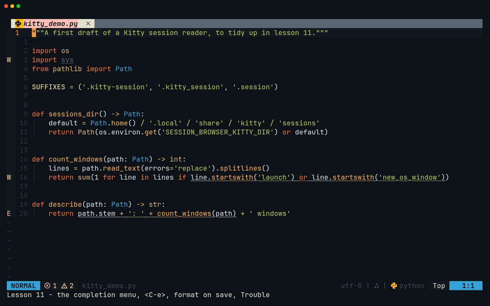
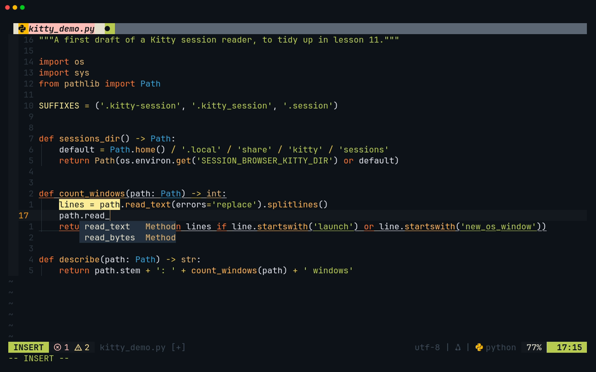
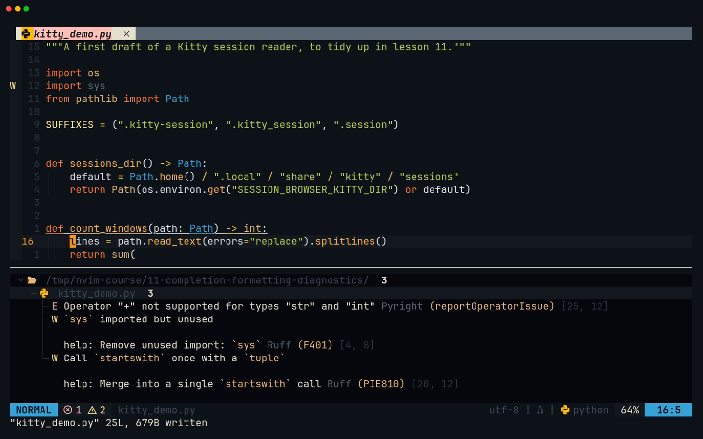
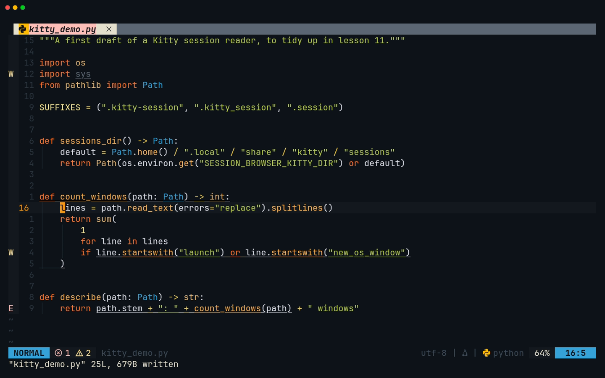

# Lesson 11 — Completion, formatting and diagnostics

**Last Updated**: 27/09/2026
**Version**: 1.0.0
**Maintained By**: Development Team
**Language**: British English (en_GB)
**Timezone**: Europe/London

---

In lesson 10 the language servers learnt to answer questions. In this one they help you write, and something
else tidies up after you. You drive the completion menu from the keyboard, and you learn the one key in it that
quietly replaces your words. You expand snippets and jump through their fields. You find out which tool rewrites
each file when you save, and how to save without it. You work through every problem in the project from one list,
Trouble. The capstones supply the practice: just-panel's banner parser (JP4), whose first draft clippy objects to
and a code action fixes, and session-browser's Codex and Kitty sources (SB4), where ruff rewrites your quotes and
line lengths every time you save.

**Part**: 4 — Code intelligence · **Time**: ~150 min · **Previous**: [Lesson 10 — LSP](10-LSP.md) · **Next**: [Lesson 12 — Git](12-GIT.md)

## Objectives

By the end of this lesson you can:

- open the completion menu, move through it with and without inserting, confirm an item and back out of the menu,
  without ever losing a new line to `<CR>`;
- expand a snippet, jump between its fields, and list the snippets for a filetype;
- say which tool formats a Python, Rust, TOML or Markdown file when you save, format on demand with `<leader>cf`
  (`<leader>` is Space, so Space c f), find out why a formatter failed with `:ConformInfo`, and save without
  formatting;
- open Trouble for the whole project (`<leader>xx`) or one buffer (`<leader>xw`), move through it and jump from it;
- apply clippy's suggested fix with a code action;
- finish milestones **JP4** and **SB4**.

## Before you start

- You have finished [lesson 10](10-LSP.md): milestones **JP3** and **SB3** are done.

  ```bash
  # in ~/Repos/personal/nix-config/rust
  cargo test -p just-panel
  ```

  Expect `test result: ok. 8 passed`.

  ```bash
  # in ~/Repos/personal/nix-config/python/session-browser
  uv run pytest -q
  ```

  Expect `24 passed`.
- Start Neovim from a shell in the repository, as in lesson 10, so that rust-analyzer and your terminal use the
  same toolchain (lesson 10, step 2):

  ```bash
  # in a Kitty window (SUPER + RETURN, then SUPER + 0; new windows open on workspace 10)
  cd ~/Repos/personal/nix-config && nvim
  ```

- `command -v ruff` prints a path. The system `ruff` (modules/software/development.nix:184) is what formats Python
  when you save, because the project's venv does not contain one.
- In this lesson `<leader>` is **Space**. Nothing is committed until [lesson 12](12-GIT.md).

## Keys in this lesson

The completion keys work in Insert mode while the menu is open, unless the table says otherwise.

| Keys | Mode | Action | Where it comes from |
| --- | --- | --- | --- |
| `<C-Space>` | i | open the completion menu now | config (neovim.nix:303) |
| `<C-n>` / `<C-p>` | i | next / previous item, **inserting** its text; opens the menu if it is closed | nvim-cmp default |
| `<Down>` / `<Up>` | i | next / previous item without inserting | nvim-cmp default |
| `<Tab>` / `<S-Tab>` | i, s | menu open: next / previous item. Menu closed: expand a snippet or jump to its next / previous field. Otherwise a real Tab | config (neovim.nix:306-323) |
| `<C-y>` | i | confirm the item you selected | nvim-cmp default |
| `<CR>` | i | confirm, taking the **first** item if you selected none | config (neovim.nix:305) |
| `<C-e>` | i | close the menu and put back what you typed | config (neovim.nix:304) |
| `<C-b>` / `<C-f>` | i | scroll the documentation window beside the menu | config (neovim.nix:301-302) |
| `:LuaSnipListAvailable` | c | list the snippets for this buffer's filetype | LuaSnip default |
| `<C-s>` | n | save; format-on-save runs first | config (neovim.nix:64, :974-977) |
| `<leader>cf` | n, v | format the buffer (in Visual mode, the selection) now | config (neovim.nix:987-989) |
| `:ConformInfo` | c | the formatters for this buffer, and conform's log file | conform default |
| `:noautocmd w` | c | save without running format-on-save | Neovim default |
| `<leader>xx` | n | Trouble: every diagnostic | config (neovim.nix:55) |
| `<leader>xw` | n | Trouble: this buffer's diagnostics | config (neovim.nix:56) |
| `<C-j>` | n | window down: from the file into the Trouble list | config (neovim.nix:69) |
| `<CR>` / `o` | n (Trouble) | jump to the item / jump and close Trouble | Trouble default |
| `}` or `]]` / `{` or `[[` | n (Trouble) | next / previous item | Trouble default |
| `p` / `P` | n (Trouble) | preview the item / turn automatic preview off and on | Trouble default |
| `s` / `gb` | n (Trouble) | step through the severity filter / toggle "this buffer only" | Trouble default |
| `<c-s>` / `<c-v>` | n (Trouble) | open the item in a horizontal / vertical split | Trouble default |
| `?` / `q` | n (Trouble) | help / close | Trouble default |
| `]d` | n | next diagnostic, with its float | config (LSP buffer-local, neovim.nix:354) |
| `<leader>ca` | n | code actions, including a compiler's suggested fix | config (LSP buffer-local, neovim.nix:352) |

## Walkthrough

Steps 1 to 3 are the completion menu and snippets, step 4 is formatting, steps 5 to 7 build **JP4** with clippy and
Trouble, and steps 8 and 9 build **SB4** with ruff's formatter. The files are in the
[Milestone](#milestone-jp4--sb4) section. The recording shows the same keys on a small untidy Python file: the
menu, `<C-e>`, format on save, and Trouble.



[MP4](../media/11-completion-formatting-diagnostics/11-completion-formatting-diagnostics.mp4)

### 1. The completion menu

nvim-cmp opens a menu of suggestions as you type in Insert mode, and when you type a character the server treats
as a trigger, such as `.` or `::`. Where the suggestions come from (neovim.nix:325-331):

- **First:** `nvim_lsp` (the language server: rust-analyzer, pyright) and `luasnip` (snippets, step 3).
- **Only if the first group has nothing:** `buffer` (words from open buffers) and `path` (file names).

Each row shows the text and its kind: `Method`, `Field`, `Function`, `Snippet`, `Text` and so on. With
`completeopt = 'menu,menuone,noselect'` (neovim.nix:273) nothing is selected until you move, so typing on simply
narrows the list.

| To… | Press |
| --- | --- |
| move and see the text in place | `<C-n>` / `<C-p>` (also `<Tab>` / `<S-Tab>`) |
| move without touching the text | `<Down>` / `<Up>` |
| accept what you selected | `<C-y>` |
| back out, restoring exactly what you typed | `<C-e>` |
| open the menu when it is not showing | `<C-Space>` |
| scroll the documentation window beside it | `<C-b>` / `<C-f>` |

**Try it.** Start JP4: do [JP4 step 1](#jp4-step-1-the-test-fixture) (the fixture), then open
`rust/just-panel/src/sections.rs`. It still holds JP1's one-line comment. Type the finished file from
[JP4 step 3](#jp4-step-3-sectionsrs) from the top. When you reach the first line of `parse`,
`let lines: Vec<&str> = source.lines().collect();`, type only up to `source.li` and stop.

1. Look at the menu. Press `<C-n>` three times, then `<C-p>` once, and watch the text after `source.` change.
2. Press `<C-e>`. The menu closes and the line reads `source.li` again.
3. Press `<C-Space>`. The menu is back.
4. Use `<Down>` until `lines` is highlighted (the text does not change as you move), then `<C-y>`.
5. Type `.collect();` and stop typing the file for now. Steps 2 to 4 use it for practice, and step 5 finishes it.

**What you should see:** rust-analyzer's methods of `&str` whose names match `li`, with `lines` near the top, each
marked `Method`. `<C-y>` on `lines` inserts `lines()`: rust-analyzer adds the brackets itself and leaves the cursor
after them.

The recording shows the same menu in Python: pyright's two matches for `path.read_`.



> **Zed habit:** in Zed, Tab or Enter accepts a completion. Here `<C-y>` is the deliberate "yes", `<Tab>` only
> moves, and Enter is the trap in step 2.

### 2. The `<CR>` trap

`<CR>` is mapped to `cmp.mapping.confirm({ select = true })` (neovim.nix:305). With the menu open, **Enter accepts
the first item even if you never selected it**. You meant a new line; you got a word.

It bites most at the end of a line. You finish typing a name, the menu happens to be showing something that
matches, you press Enter, and the name is replaced by a longer one (or gains brackets) and no new line appears.

**Try it.** Open a new line below `let lines …` (`o`), type `let x = Vec::ne`, then press Enter.

**What you should see:** no new line. The first suggestion was accepted instead, probably `Vec::new()`. Press `u`,
then type it again, and this time press `<C-e>` before Enter: now Enter makes a new line. Delete the practice line
(`dd`, twice if needed).

The habit to build: **when the menu is open and you want a new line, `<C-e>` then Enter.** Accept things with
`<C-y>`, which only confirms what you selected. If you would rather Enter only ever confirmed an item you selected,
the edit is `select = false` at neovim.nix:305; [lesson 22](22-MAKING-THE-CONFIG-YOURS.md) shows how to change the
config safely.

### 3. Snippets

A snippet is a template with **fields**: you type a short trigger, it expands into code, and the cursor jumps from
field to field for you to fill in. The config uses LuaSnip with the friendly-snippets collection, loaded per
filetype the first time you open such a buffer (neovim.nix:291). For Rust that includes `test`, `modtest`, `fn`,
`impl-trait`, `derive`, `match` and `if-let`; for Python `def`, `deft`, `class`, `ifmain`, `for` and `try`.

Two ways to expand one:

- **From the menu.** Snippets appear in the menu with the kind `Snippet`. Select one and press `<C-y>`.
- **With the menu closed.** Type the trigger, `<C-e>` if the menu opened, then `<Tab>`. `<Tab>` expands the trigger
  right before the cursor.

Inside an expanded snippet, `<Tab>` jumps to the next field and `<S-Tab>` back. A field's placeholder text is
selected when you arrive (Select mode), so typing replaces it.

**Try it.** In `sections.rs`, run `:LuaSnipListAvailable`. Page through with Space and leave with `q`. Then practise
on a spare line at the end of the file (you delete it afterwards):

1. `G`, `o`, and type `test`. `<C-e>` if the menu opened, then `<Tab>`.
2. The name field, `name`, is selected. Type `practice`.
3. `<Tab>`: the body field, `todo!();`, is selected. Type `assert_eq!(1 + 1, 2);`, then `<Esc>`.
4. Delete the four practice lines: `G` goes to the last of them, `3k` up to `#[test]`, then `4dd`.

**What you should see:** the list shows the Rust snippets, each with its trigger and a description. You may also see
snippets for relm4 (a GTK framework): friendly-snippets files them under Rust too (verify on laptop-intel). Ignore
them. The `test` snippet expands to:

```rust
#[test]
fn name() {
    todo!();
}
```

indented to where you typed it, with `name` selected.

> **Tip:** `<Tab>` means three things in Insert mode, tried in order: next menu item, then snippet expand or jump,
> then a real Tab. If `<Tab>` "does nothing useful", look at whether the menu is open.

### 4. What formats your file when you save

Every save runs **format-on-save** first: conform.nvim formats the buffer, then Neovim writes it
(`format_on_save = { timeout_ms = 3000, lsp_format = 'fallback' }`, neovim.nix:974-977). conform uses the formatter
the config lists for the filetype. For a filetype with none, `lsp_format = 'fallback'` asks the language server
to format instead.

| Files | Formatter | How it is found | Lines |
| --- | --- | --- | --- |
| Python | `ruff format` (conform's `ruff_format`) | the first `ruff` on `PATH`: a venv's copy only if that venv is on `PATH`, else the system one | neovim.nix:953, :959-964 |
| Rust | rustfmt | no conform entry, so rust-analyzer formats, by running rustfmt from its toolchain | neovim.nix:933-936 |
| TOML | taplo | no conform entry, so the taplo server formats | neovim.nix:933-936, :562 |
| Markdown, JSON, YAML, JS/TS, CSS, HTML, GraphQL | prettier | `PATH`, project-local first | neovim.nix:939-952 |
| sh, bash | shfmt with `-ci` | pinned to the Nix store | neovim.nix:954-955, :965-969 |
| Nix, Lua | their language servers: `nil` formats Nix with nixfmt and `lua_ls` formats Lua, and both rewrite the whole file (checked on the real config; [lesson 22](22-MAKING-THE-CONFIG-YOURS.md), step 7) | no conform entry | neovim.nix:933-936, :551, :561 |

Three more tools:

- **`<leader>cf`** (neovim.nix:987-989) formats now, without saving. It runs in the background (`async = true`), and
  in Visual mode it formats just the selection when the formatter can. It is global, so it works in Markdown too.
- **`:ConformInfo`** opens a report: the formatters configured for this buffer and whether each is available, and
  the path of conform's log. If a save ever says `Formatter failed. See :ConformInfo for details`, start there.
- **`:noautocmd w`** saves without running any autocommand, so without formatting: conform formats in a
  `BufWritePre` autocommand. The config has no switch to turn format-on-save off, so this is the way to save a
  file exactly as it is: a fixture, a generated file, a `pyproject.toml` you do not want taplo to re-shape
  (lesson 10, step 10), or a Nix or Lua file of the config, where one plain save reflows the whole file.

**Try it.** In `sections.rs`, run `:ConformInfo` and read it, then `q`. Open any Python file of the capstone and run
it again.

**What you should see:** for the Rust buffer, no conform formatter for `rust`, so formatting falls to the language
server. For the Python buffer, `ruff_format`, marked as available. Both reports also give the log file's path.

> **Gotcha:** format-on-save runs on **every** filetype. Saving a Markdown note runs prettier, saving JSON runs
> prettier, saving TOML runs taplo. Undo a surprise with `u`, and never save the capstones' test fixtures from
> Neovim.

### 5. JP4's first draft, and a warning you did not write

The banner parser walks the justfile line by line. At each line it asks: is this a `# ====` banner, or a `# Title`
over a `# ----` rule (a sub-section)? The first draft of that question is ordinary Rust.

**Try it**

1. Finish typing `sections.rs` from [JP4 step 3](#jp4-step-3-sectionsrs), carrying on from `source.lines()`. For the
   `let title = …` statement inside the `for` loop, type the **first draft** from
   [JP4 step 2](#jp4-step-2-the-first-draft-of-the-loop) instead.
2. Type the tests at the bottom, starting each `#[test] fn` with the `test` snippet from step 3. Save.
3. In `<leader>t`, run the tests and then clippy the way the milestone checks it:

   ```bash
   # in ~/Repos/personal/nix-config/rust (Space t)
   cargo test -p just-panel
   cargo clippy -p just-panel --all-targets -- -D warnings
   ```

**What you should see**

- A few seconds after the save, a sign on the line `} else if let Some(title) = sub_banner(&lines[index..]) {`. That
  line carries a warning (`W`) and a hint (`H`), and the sign column has room for one letter, so you see one of them.
  No text in the buffer, as always.
- `test result: ok. 12 passed`: the draft is correct.
- clippy fails with `` error: manual implementation of `Option::map` ``, and the help below it shows the replacement
  it suggests (`help: try`). `-D warnings` turns clippy's warnings into errors, which is how the milestone check
  treats them. In the editor it is only a warning.

> **Why clippy objects:** `if let Some(x) = … { Some(…) } else { None }` is what `Option::map` does. clippy's
> `manual_map` lint prefers the method: shorter, and it says what it means.

### 6. Trouble: every problem in one list

Trouble lists diagnostics in a window at the bottom (neovim.nix:803 sets it up with its defaults). The window opens
**without taking the cursor** (`focus = false`), so you stay in the file.

| Keys | Opens |
| --- | --- |
| `<leader>xx` | every diagnostic Neovim knows about, grouped by file |
| `<leader>xw` | only the current buffer's (`filter.buf=0`) |

Both toggle: the same keys close the list again. Type them briskly: `<leader>x` on its own is "close buffer" after a
300 ms pause ([lesson 05](05-YOUR-KEYBINDINGS.md), step 5).

Inside the list:

| Keys | Does |
| --- | --- |
| `}` or `]]` / `{` or `[[` | next / previous item |
| `j` / `k` | plain cursor movement; the file previews the item under the cursor |
| `<CR>` | jump to the item; the list stays open |
| `o` | jump to the item and close the list |
| `p` / `P` | preview the item / switch automatic preview off and on |
| `s` | severity filter: each press moves on, from errors only to warnings, information, hints, then no filter |
| `gb` | toggle "current buffer only": what `<leader>xw` sets from outside |
| `<c-s>` / `<c-v>` | open the item in a horizontal / vertical split. Here `<c-s>` is not Save |
| `dd` | remove an item from the list (not from the code) |
| `zo` / `zc`, `zR` / `zM` | open / close a group; open / close all groups |
| `?` / `q` | help / close |

**Try it**

1. In `sections.rs`, press `<leader>xw`.
2. `<C-j>` moves the cursor down into the list.
3. `}` to the first item, then `<CR>`: the cursor lands on the warning in the file.
4. `<C-j>` back into the list, press `s` a few times and watch the list change, then `q`.
5. Press `<leader>xx`.

**What you should see:** in the buffer list, `sections.rs` with two items, the `manual_map` warning (source `clippy`)
and its `try:` hint. `<leader>xx` may show more: rust-analyzer checks the **whole** workspace with clippy, so any
warnings in the repository's other crates appear too. Outside the dev shell that can include `openssl-sys` errors
(lesson 10, step 2). `gb` or `<leader>xw` narrows the list to the file you are working on.

The recording shows Trouble on the Python file: ruff's unused import, pyright's error and pyright's hint.



### 7. Apply clippy's fix with a code action

Compiler suggestions that a tool can apply by itself (rustc's and clippy's "help: try" lines) come through
rust-analyzer as **quick fixes**: code actions attached to the diagnostic.

**Try it**

1. `gg`, then `]d`: the cursor lands on the warning and its float opens.
2. `<leader>ca`. The list holds rust-analyzer's own refactorings, such as `Replace if let with match` and
   `Extract into variable`, and one entry that starts with `` try: `{ sub_banner(&lines[index..]).map( `` and runs
   on (its line breaks show as `\n`). That one is clippy's suggestion. Type its number and Enter.
3. Look at the result, then save with `<C-s>`.

**What you should see**

- After the code action, the draft's `else if … else { None }` becomes one crowded `else { … }` block holding
  `sub_banner(&lines[index..]).map(|title| match banner_title { … })`.
- After the save, rustfmt (through rust-analyzer) lays it out, and the statement is exactly the finished code in
  JP4 step 3:

  ```rust
          } else {
              sub_banner(&lines[index..]).map(|title| match banner_title {
                  Some(parent) => format!("{parent} / {title}"),
                  None => title.to_string(),
              })
          };
  ```

- A few seconds later clippy has run again and the sign is gone.

Now run the [JP4 checks](#check-jp4): 12 tests, and clippy with `-D warnings` is clean.

> **Tip:** the same fix from the terminal is `cargo clippy --fix -p just-panel --allow-dirty` followed by
> `cargo fmt -p just-panel`. `--allow-dirty` is needed because nothing is committed yet. Back in the editor window,
> `:checktime` reloads the file that cargo changed.

### 8. SB4: ruff rewrites what you type

Now the Python half. Do [SB4 step 1](#sb4-step-1-testsconftestpy) (two new lines in `conftest.py`), then type
`sources/codex.py`, `sources/kitty.py` and their tests from SB4 steps 2 to 5. Let format-on-save show you ruff's
style on the way.

**Try it (quotes)**

In `sources/kitty.py`, type the first definitions the way many people do by habit, with single quotes:

```python
SUFFIXES = ('.kitty-session', '.kitty_session', '.session')
```

and in `sessions_dir()`:

```python
    default = Path.home() / '.local' / 'share' / 'kitty' / 'sessions'
    return Path(os.environ.get('SESSION_BROWSER_KITTY_DIR') or default)
```

Save with `<C-s>`.

**What you should see:** every `'` becomes `"`, exactly as in the milestone's `kitty.py`. ruff's formatter, like
black, prefers double quotes.

**Try it (line length)**

1. In `sources/codex.py`, type the import from `session_browser.sources` on **one** line:

   ```python
   from session_browser.sources import Entry, modified, one_line, parse_line, parse_timestamp, read_entries
   ```

2. In `tests/test_codex.py`, type this whole test as two long lines:

   ```python
   def test_updated_is_the_last_activity_not_the_index_time(sessions: dict[str, Session]) -> None:
       assert sessions[REVIEW].updated == datetime(2026, 9, 24, 10, 31, 9, 877000, tzinfo=UTC)
   ```

3. Save each file.

**What you should see:** lines longer than 88 columns (ruff's default) are rewritten to the milestone's layout.
The import becomes a bracketed list, one name per line with a trailing comma. The test becomes:

```python
def test_updated_is_the_last_activity_not_the_index_time(
    sessions: dict[str, Session],
) -> None:
    assert sessions[REVIEW].updated == datetime(
        2026, 9, 24, 10, 31, 9, 877000, tzinfo=UTC
    )
```

The recording shows the same thing on a small draft file: quotes and a 100-column line, before and after `<C-s>`.




> **Why this is good news:** you never have to format Python by hand, and `uvx ruff format --check` in the milestone
> passes by construction. The catch is the other side: format-on-save only **formats**. It does not sort imports
> or fix lint findings. Those are ruff's *linter*, which reports through the `ruff` language server (step 9).

### 9. Python completion and the linter

A few differences from Rust, worth knowing before you type about 440 lines of Python:

- **pyright completes names only.** Accepting `read_text` inserts `read_text`, with no brackets. Type `(` yourself.
  nvim-autopairs closes it, but it is not connected to the completion menu, so it never adds one for you.
- **Signature help while typing.** After `monkeypatch.setenv(` in `conftest.py`, press `<C-s>` (Insert mode) to see
  the parameters.
- **ruff's diagnostics.** The ruff server reports lint findings as you type: an unused import (`F401`), import
  order (`I001`, because the project selects rule `I`), and the other rules in `[tool.ruff.lint]`. `<leader>ca` on
  one lists ruff's fixes for it (verify their exact titles on laptop-intel). From the terminal,
  `uvx ruff check --fix` applies every safe fix at once.
- **pyright only checks open files** (the `diagnosticsMode` typo, lesson 10, step 12). `<leader>xx` shows problems
  in the files you have open, nothing else. Run `uvx pyright` before you trust it.
- **The zstd import.** `codex.py` imports `compression.zstd` only under `if sys.version_info >= (3, 14):`. pyright
  analyses for the venv's Python. Without that gate, a 3.12 venv would report the import as missing even though
  the code never runs it there.

When all five SB4 steps are typed, run the [SB4 checks](#check-sb4).

## Gotchas in this config

- **`<CR>` confirms the first item** whenever the menu is open (`select = true`, neovim.nix:305). `<C-e>` before
  Enter for a new line; `<C-y>` to accept deliberately.
- **`<Tab>` with the menu open moves in the menu.** It only expands or jumps through a snippet when the menu is
  closed.
- **No completion menu on the `:` command line.** `cmp-cmdline` is installed (neovim.nix:132) but never set up.
  Neovim's own `<Tab>` completion still works there.
- **Completing a Python function adds no brackets.** nvim-autopairs is not wired to nvim-cmp; type `(`.
- **Every save formats, every filetype.** Python through ruff, Rust through rust-analyzer, TOML through taplo,
  Markdown and JSON through prettier. There is no off switch in the config; `:noautocmd w` saves as-is, and `u`
  undoes a formatting you did not want.
- **A formatter is looked up on `PATH`** for Python and prettier files (neovim.nix:959-964): a project's own
  prettier in `node_modules` wins, and a venv's `ruff` wins only when that venv is on `PATH`. `Formatter failed`
  sends you to `:ConformInfo`.
- **Rust formatting needs rustfmt** in the toolchain rust-analyzer runs from. If saving a `.rs` file never
  reformats it, check that toolchain (lesson 10, step 2) and `rustup component add rustfmt`.
- **Format-on-save gives up after 3 seconds** (`timeout_ms = 3000`). A slow formatter on a huge file can leave it
  unformatted; `<leader>cf` runs without that limit because it is asynchronous.
- **clippy findings arrive after a save**, not while you type, and only once `cargo clippy` has finished.
- **Trouble does not take focus** when it opens: `<C-j>` goes into it. Inside it, `<c-s>` opens a split instead of
  saving, and `j`/`k` are plain movement.
- **`<leader>x` is also "close buffer".** Type `<leader>xx` and `<leader>xw` briskly, or the buffer closes after
  300 ms.
- **`<leader>xx` shows the whole workspace's clippy results**, other crates included, and only open files for
  Python.

## Drills

1. With the menu open after `source.li`, move to `lines` without changing the text on screen, then back out
   completely so the line reads `source.li` again.

   <details><summary>Answer</summary>

   `<Down>` (not `<C-n>`, which inserts as it moves) until `lines` is highlighted, then `<C-e>`. `<C-e>` closes the
   menu and restores what you typed, whichever way you moved.

   </details>

2. You typed `let sections = Vec::new` at the end of a line, the menu is open, and you want a new line. What do you
   press, and what would Enter alone have done?

   <details><summary>Answer</summary>

   `<C-e>` then Enter. Enter alone confirms the first menu item (`select = true`), for example turning `Vec::new`
   into `Vec::new()` or into a longer name, and inserts no new line.

   </details>

3. In the tests of `sections.rs`, write a new, empty test called `smoke` using a snippet, and fill in its body with
   `assert!(true);`. Then delete it.

   <details><summary>Answer</summary>

   On an empty line in `mod tests`: `test`, `<C-e>` if the menu opened, `<Tab>`, type `smoke`, `<Tab>`, type
   `assert!(true);`, `<Esc>`. Delete the four lines with `dap` if blank lines surround them, or `4dd` from the
   `#[test]` line. (clippy would flag `assert!(true)` as pointless, which is fine for a drill you delete.)

   </details>

4. Save `python/session-browser/README.md` without prettier touching it. Then find out, without saving, what would
   format it.

   <details><summary>Answer</summary>

   `:noautocmd w` saves it as it is. `:ConformInfo` in that buffer shows `prettier` for `markdown`
   (neovim.nix:951), and whether a `prettier` is available on `PATH`.

   </details>

5. Which formatter runs when you save `rust/just-panel/Cargo.toml`, and why is it not listed in conform's
   `formatters_by_ft`?

   <details><summary>Answer</summary>

   taplo, the TOML language server (neovim.nix:562). TOML has no entry in `formatters_by_ft` (neovim.nix:939-957),
   so `lsp_format = 'fallback'` hands the buffer to the attached server that can format it (comment at
   neovim.nix:933-936).

   </details>

6. Show only the errors (not warnings or hints) of the current buffer in Trouble, then jump to the first one and
   close the list in one key.

   <details><summary>Answer</summary>

   `<leader>xw`, `<C-j>` into the list, `s` once (the first press filters to errors), `}` to the first item, then `o`
   (jump and close).

   </details>

7. Put the first draft of the `let title = …` statement back into `sections.rs` and fix it again, this time without
   a code action.

   <details><summary>Answer</summary>

   Replace the statement with JP4 step 2's draft and save. In `<leader>t`, in `rust/`:
   `cargo clippy --fix -p just-panel --allow-dirty`, then `cargo fmt -p just-panel`. Back in Neovim, `:checktime`
   reloads the file. The statement matches JP4 step 3 again, and
   `cargo clippy -p just-panel --all-targets -- -D warnings` is clean.

   </details>

8. List the Python snippets whose trigger starts with `def`, and expand the one that writes a return type.

   <details><summary>Answer</summary>

   In a `.py` buffer, `:LuaSnipListAvailable`. Five triggers start with `def`: `def` ("Function"), `deft`
   ("Function w/ return type"), `defm` ("Method"), `defmt` ("Method w/ return type") and `defi` ("Init method").
   On an empty line, `deft`, `<C-e>` if the menu opened, `<Tab>`: the name field is selected, and `<Tab>` moves on
   to the parameters, the return type (`None`) and the body (`pass`). `<Esc>`, then `u` to remove it.

   </details>

## Milestone JP4 + SB4

**Goal.** just-panel knows which `# ====` section banner each recipe sits under, in the justfile's own order, which
`just --dump` cannot tell it. session-browser reads Codex threads (with their names from `session_index.jsonl`,
sub-agents skipped, compressed rollouts on Python 3.14) and Kitty session files. Everything is tested against the
course's fixtures, and both projects are clean under clippy, rustfmt, ruff and pyright.

> **Tip:** type what the walkthrough asks you to type (the completion practice in `sections.rs`, the first
> draft of the loop, the single-quoted lines and long lines ruff rewrites), because that is where this
> lesson's tools act. The rest, and the test modules above all, you may paste with lesson 06's method
> ([Step 0 tip](06-TERMINAL.md#step-0-two-named-terminals)): `:%d _`, `:0put +` and `:$d _` replace a whole
> file. A pasted `sections.rs` already holds clippy's version, so to see step 5's warning and step 7's fix,
> put JP4 step 2's draft in place of its `let title = …` statement (drill 7 does exactly this).

### JP4 step 1: the test fixture

The parser's tests read the course's demo justfile, compiled in with `include_str!` like the dump:

```bash
# in ~/Repos/personal/nix-config
cp docs/NEOVIM-COURSE/fixtures/just/justfile rust/just-panel/tests/fixtures/justfile
cmp docs/NEOVIM-COURSE/fixtures/just/justfile rust/just-panel/tests/fixtures/justfile
```

`cmp` prints nothing when the copy is identical. The demo justfile has 15 recipes and 6 banners (the last one split
into two sub-sections), with `default` above the first banner, as in the real file. Every recipe only echoes,
sleeps or prints the time.

### JP4 step 2: the first draft of the loop

**Not the final code.** Type this for the `let title = …` statement in step 5 of the walkthrough, so that clippy
has something to say. It is correct (the tests pass), and step 7 replaces it with clippy's version.

```rust
        let title = if let Some(title) = banner(&lines[index..]) {
            banner_title = Some(title);
            Some(title.to_string())
        } else if let Some(title) = sub_banner(&lines[index..]) {
            Some(match banner_title {
                Some(parent) => format!("{parent} / {title}"),
                None => title.to_string(),
            })
        } else {
            None
        };
```

### JP4 step 3: `sections.rs`

The whole of `rust/just-panel/src/sections.rs`, as it is after step 7. It replaces JP1's one-line file.

```rust
//! Section banners: which `# ====` heading each recipe sits under in the source.
//!
//! To just, the banners in a justfile are ordinary comments: they are not in
//! `just --dump`, which also lists recipes alphabetically. The file itself is
//! the only record of how its recipes are grouped and ordered, so this module
//! reads the source text. On the repo's justfile these rules put all 131
//! recipes in the same order as `just --summary --unsorted`.
//!
//! BANNERS
//!
//!   # ==========              a section: a title line between two `=`
//!   # Secrets Management      rulers
//!   # ==========
//!
//!   # Restic Backup           a sub-section: a title line directly above a
//!   # ----------              `-` ruler, inside the section above it

/// A run of recipes under one heading, in source order.
#[derive(Debug, PartialEq, Eq)]
pub struct Section {
    /// `None` for recipes above the first banner. A sub-section is titled
    /// "Section / Sub-section".
    pub title: Option<String>,
    pub recipes: Vec<String>,
}

/// Splits a justfile's source into its sections. Sections without recipes
/// (such as a banner that only holds sub-sections) are left out.
pub fn parse(source: &str) -> Vec<Section> {
    let lines: Vec<&str> = source.lines().collect();
    let mut sections = Vec::new();
    let mut current = Section {
        title: None,
        recipes: Vec::new(),
    };
    // The title of the `=` banner above, which names its sub-sections.
    let mut banner_title = None;

    for (index, line) in lines.iter().enumerate() {
        let title = if let Some(title) = banner(&lines[index..]) {
            banner_title = Some(title);
            Some(title.to_string())
        } else {
            sub_banner(&lines[index..]).map(|title| match banner_title {
                Some(parent) => format!("{parent} / {title}"),
                None => title.to_string(),
            })
        };

        if let Some(title) = title {
            let next = Section {
                title: Some(title),
                recipes: Vec::new(),
            };
            sections.push(std::mem::replace(&mut current, next));
        } else if let Some(name) = recipe_name(line) {
            current.recipes.push(name.to_string());
        }
    }
    sections.push(current);
    sections.retain(|section| !section.recipes.is_empty());
    sections
}

/// The title of a `# ====` / `# Title` / `# ====` banner starting at the
/// first of `lines`.
fn banner<'a>(lines: &[&'a str]) -> Option<&'a str> {
    match lines {
        [open, text, close, ..] if is_ruler(open, '=') && is_ruler(close, '=') => title(text),
        _ => None,
    }
}

/// The title of a `# Title` / `# ----` sub-section banner starting at the
/// first of `lines`.
fn sub_banner<'a>(lines: &[&'a str]) -> Option<&'a str> {
    match lines {
        [text, rule, ..] if is_ruler(rule, '-') => title(text),
        _ => None,
    }
}

/// The text of a comment that starts in the first column.
fn comment(line: &str) -> Option<&str> {
    line.strip_prefix('#').map(str::trim)
}

/// A comment made of one repeated character, like `# ======`.
fn is_ruler(line: &str, ruler: char) -> bool {
    comment(line).is_some_and(|text| text.len() >= 3 && text.chars().all(|c| c == ruler))
}

/// A comment with words in it: not a ruler, and not an empty `#`.
fn title(line: &str) -> Option<&str> {
    comment(line).filter(|text| text.chars().any(char::is_alphanumeric))
}

/// The name of the recipe that `line` starts, if it is a recipe header such
/// as `fuzz TARGET TIME="300":` or `@quiet:`.
///
/// A header starts in the first column, and its first word, the name, comes
/// before a `:`. Indented lines belong to a recipe body, and a `:=` marks an
/// assignment, an `alias` or a `set` line instead.
fn recipe_name(line: &str) -> Option<&str> {
    if line.starts_with(char::is_whitespace) || line.contains(":=") {
        return None;
    }
    let (header, _) = line.split_once(':')?;
    let name = header.trim_start_matches('@').split_whitespace().next()?;
    name.chars()
        .all(|c| c.is_alphanumeric() || c == '_' || c == '-')
        .then_some(name)
}

#[cfg(test)]
mod tests {
    use super::*;

    /// The course's demo justfile, compiled in like the dump.
    const JUSTFILE: &str = include_str!("../tests/fixtures/justfile");
    const DUMP: &str = include_str!("../tests/fixtures/dump.json");

    fn names(sections: Vec<Section>) -> Vec<String> {
        sections.into_iter().flat_map(|s| s.recipes).collect()
    }

    #[test]
    fn groups_recipes_under_their_banners() {
        let sections = parse(JUSTFILE);
        let titles: Vec<Option<&str>> = sections.iter().map(|s| s.title.as_deref()).collect();
        assert_eq!(
            titles,
            [
                None,
                Some("Secrets Management"),
                Some("NixOS System Management"),
                Some("Development"),
                Some("Cleanup"),
                Some("Session Control"),
                Some("Storage Management / Backups"),
                Some("Storage Management / Snapshots"),
            ]
        );
        assert_eq!(sections[1].recipes, ["edit-secret", "rekey-secrets"]);
        assert_eq!(sections[6].recipes, ["backup-status", "_stamp"]);
    }

    /// The same order as `just --summary --unsorted`, plus the private
    /// `_stamp`, which `--summary` leaves out.
    #[test]
    fn keeps_source_order() {
        assert_eq!(
            names(parse(JUSTFILE)),
            [
                "default",
                "edit-secret",
                "rekey-secrets",
                "rebuild",
                "check",
                "update",
                "fuzz",
                "lint",
                "lint-rust",
                "lint-nix",
                "clean-cache",
                "lock",
                "backup-status",
                "_stamp",
                "snapshot",
            ]
        );
    }

    /// The parser and just agree on which recipes exist.
    #[test]
    fn finds_every_recipe_that_just_knows_about() {
        let mut parsed = names(parse(JUSTFILE));
        parsed.sort();
        let dumped: Vec<String> = crate::justfile::parse(DUMP)
            .unwrap()
            .into_iter()
            .map(|recipe| recipe.name)
            .collect();
        assert_eq!(parsed, dumped);
    }

    #[test]
    fn skips_lines_that_are_not_recipe_headers() {
        let source = r#"
export NAME := "value"
alias b := build
set shell := ["bash", "-c"]
# Note: comments can contain colons
[group('demo')]
build:
    echo "indented: part of the body"
@quiet URL="https://example.org":
"#;
        assert_eq!(names(parse(source)), ["build", "quiet"]);
    }
}
```

The test `finds_every_recipe_that_just_knows_about` calls `crate::justfile::parse` from JP3, so the parser and just
must agree on which recipes exist. Nothing else in the crate changes.

### Check JP4

```bash
# in ~/Repos/personal/nix-config/rust
cargo build -p just-panel
cargo test -p just-panel
cargo clippy -p just-panel --all-targets -- -D warnings
cargo fmt -p just-panel --check
```

Expect a warning-free build, `test result: ok. 12 passed`, no clippy findings, and no output from the format check.

### SB4 step 1: `tests/conftest.py`

Two new lines point the other two sources at the fixtures. The whole of `python/session-browser/tests/conftest.py`:

```python
"""Shared pytest fixtures."""

from pathlib import Path

import pytest

FIXTURES = Path(__file__).parent / "fixtures"


@pytest.fixture(autouse=True)
def synthetic_stores(tmp_path: Path, monkeypatch: pytest.MonkeyPatch) -> None:
    """Point every test at the synthetic fixtures, never at your real sessions.

    HOME moves as well, so anything that falls back to ~/.claude finds an empty
    temporary directory instead of your history.
    """
    monkeypatch.setenv("HOME", str(tmp_path))
    monkeypatch.setenv("CLAUDE_CONFIG_DIR", str(FIXTURES / "claude"))
    monkeypatch.setenv("CODEX_HOME", str(FIXTURES / "codex"))
    monkeypatch.setenv("SESSION_BROWSER_KITTY_DIR", str(FIXTURES / "kitty"))
```

### SB4 step 2: `sources/codex.py`

The whole of `python/session-browser/src/session_browser/sources/codex.py`:

```python
"""Codex sessions, read from ~/.codex/sessions.

Each thread is one rollout file, sessions/YYYY/MM/DD/rollout-<time>-<id>.jsonl,
whose first line is a `session_meta` entry describing it. The names Codex gives
threads live separately, in session_index.jsonl.
"""

import errno
import os
import sys
from io import BufferedIOBase, BytesIO
from pathlib import Path

from session_browser.models import Message, Session, Source
from session_browser.sources import (
    Entry,
    modified,
    one_line,
    parse_line,
    parse_timestamp,
    read_entries,
)

# Codex can compress rollouts older than a week (an experimental feature, off
# by default). Python 3.14 reads zstd with no extra dependency; older Pythons,
# and a 3.14 built without libzstd, simply skip the compressed files. The
# version check comes first so pyright, analysing for 3.12, does not flag an
# import that cannot exist there.
if sys.version_info >= (3, 14):
    try:
        from compression import zstd
    except ImportError:
        zstd = None
else:
    zstd = None

SUFFIXES = (".jsonl", ".jsonl.zst") if zstd else (".jsonl",)


def codex_home() -> Path:
    """Where Codex keeps its data: CODEX_HOME (Codex's own override) or ~/.codex."""
    return Path(os.environ.get("CODEX_HOME") or Path.home() / ".codex")


def load_sessions(root: Path | None = None) -> list[Session]:
    """One Session per thread you started under `root` (default: codex_home())."""
    root = root or codex_home()
    names = read_index(root / "session_index.jsonl")
    sessions = []
    for path in sorted((root / "sessions").glob("*/*/*/rollout-*")):
        if not path.name.endswith(SUFFIXES):
            continue
        try:
            session = read_session(path, names)
        except OSError:  # deleted or unreadable since the glob listed it
            continue
        if session is not None:
            sessions.append(session)
    return sessions


def read_index(path: Path) -> dict[str, str]:
    """Map thread id to the name Codex gave it. A later line wins."""
    try:
        lines = path.read_bytes().splitlines()
    except OSError:  # no threads named yet
        return {}
    names = {}
    for line in lines:
        entry = parse_line(line) or {}
        thread_id, name = entry.get("id"), entry.get("thread_name")
        if isinstance(thread_id, str) and isinstance(name, str) and name:
            names[thread_id] = name
    return names


def read_session(path: Path, names: dict[str, str]) -> Session | None:
    """Build a Session from one rollout, or None if it is not yours to resume."""
    with open_rollout(path) as file:
        entries = read_entries(file)
    meta = _session_meta(entries)
    # Sub-agent threads are ones Codex spawned for itself. They are missing
    # from session_index.jsonl too, and resuming one on its own makes no sense.
    if meta is None or meta.get("thread_source") == "subagent":
        return None
    thread_id, cwd, git = meta.get("id"), meta.get("cwd"), meta.get("git")
    if not isinstance(thread_id, str):
        return None
    branch = git.get("branch") if isinstance(git, dict) else None
    prompts = [text for e in entries if (text := user_text(e))]
    times = [when for e in entries if (when := parse_timestamp(e.get("timestamp")))]
    title = names.get(thread_id) or (prompts[0] if prompts else "(untitled)")

    return Session(
        source=Source.CODEX,
        id=thread_id,
        title=one_line(title),
        cwd=Path(cwd) if isinstance(cwd, str) else None,
        # Not the index's updated_at: that records when the thread was named,
        # which can be an hour before its last message.
        updated=max(times) if times else modified(path),
        path=path,
        detail=f"git branch {branch}" if isinstance(branch, str) and branch else "",
    )


def recent_messages(path: Path, limit: int = 6) -> list[Message]:
    """The last `limit` prompts and replies of a rollout, oldest first."""
    with open_rollout(path) as file:
        entries = read_entries(file)
    messages = []
    for entry in entries:
        if text := user_text(entry):
            messages.append(Message("user", text))
        elif text := assistant_text(entry):
            messages.append(Message("assistant", text))
    return messages[-limit:]


def open_rollout(path: Path) -> BufferedIOBase:
    """Open a rollout for reading, decompressing it if it ends in .zst."""
    if path.suffix != ".zst" or zstd is None:
        return path.open("rb")
    # Decompress it all at once. A damaged or half-written archive then fails
    # here, as the OSError every caller already handles for an unreadable
    # file, rather than halfway through reading it with a ZstdError that no
    # caller expects and that would crash the app.
    try:
        return BytesIO(zstd.decompress(path.read_bytes()))
    except zstd.ZstdError as error:
        raise OSError(errno.EIO, f"damaged zstd file ({error})") from error


def user_text(entry: Entry) -> str:
    """What you typed in this entry, or ""."""
    return _item_text(entry, "UserMessage")


def assistant_text(entry: Entry) -> str:
    """What Codex replied in this entry, or ""."""
    return _item_text(entry, "AgentMessage")


def _item_text(entry: Entry, item_type: str) -> str:
    """The text of a finished conversation item of the given type.

    The same words appear again as `response_item` messages, but those also
    carry context Codex injects (<environment_context>, developer notes), so
    only the `item_completed` events are read.
    """
    payload = entry.get("payload")
    if entry.get("type") != "event_msg" or not isinstance(payload, dict):
        return ""
    item = payload.get("item")
    if payload.get("type") != "item_completed" or not isinstance(item, dict):
        return ""
    content = item.get("content")
    if item.get("type") != item_type or not isinstance(content, list):
        return ""
    # User blocks are typed "text" and agent blocks "Text"; both hold `text`.
    return "\n".join(
        block["text"]
        for block in content
        if isinstance(block, dict) and isinstance(block.get("text"), str)
    ).strip()


def _session_meta(entries: list[Entry]) -> Entry | None:
    """The payload of the first line, which in a rollout is always session_meta."""
    if entries and entries[0].get("type") == "session_meta":
        payload = entries[0].get("payload")
        if isinstance(payload, dict):
            return payload
    return None
```

### SB4 step 3: `sources/kitty.py`

The whole of `python/session-browser/src/session_browser/sources/kitty.py`:

```python
"""Kitty session files, read from ~/.local/share/kitty/sessions.

A session file is a plain-text list of commands (layout, cd, new_tab, launch,
...) that `kitty --session <file>` replays to build tabs and windows. The
browser lists the files in one directory. It does not ask running kitty
instances what they have open: that needs remote control, which is off here.
"""

import os
from pathlib import Path

from session_browser.models import Session, Source
from session_browser.sources import modified

SUFFIXES = (".kitty-session", ".kitty_session", ".session")
"""The extensions kitty itself looks for when it scans a directory."""


def sessions_dir() -> Path:
    """SESSION_BROWSER_KITTY_DIR, else the directory kitty's own docs use."""
    default = Path.home() / ".local" / "share" / "kitty" / "sessions"
    return Path(os.environ.get("SESSION_BROWSER_KITTY_DIR") or default)


def load_sessions(directory: Path | None = None) -> list[Session]:
    """One Session per session file in `directory` (default: sessions_dir())."""
    directory = Path(os.path.expanduser(directory or sessions_dir()))  # see _resolve
    sessions = []
    for path in sorted(directory.glob("*")):
        if not path.name.endswith(SUFFIXES):
            continue
        try:
            sessions.append(read_session(path))
        except OSError:  # a directory with a session-like name, or unreadable
            continue
    return sessions


def read_session(path: Path) -> Session:
    """Build a Session from a session file: its name, first cd and a summary."""
    cwd: Path | None = None
    tabs = windows = 0
    in_tab = False
    for line in path.read_text(errors="replace").splitlines():
        # Split the way kitty does: a keyword, then the rest of the line after
        # the first spaces or tabs.
        words = line.split(maxsplit=1)
        keyword = words[0] if words else ""
        argument = words[1].strip() if len(words) > 1 else ""
        if keyword == "cd" and argument and cwd is None:
            cwd = _resolve(argument, path.parent)
        elif keyword == "new_tab":
            tabs, in_tab = tabs + 1, True
        elif keyword == "new_os_window":
            in_tab = False
        elif keyword == "launch":
            # A window launched before any new_tab opens the first tab itself.
            if not in_tab:
                tabs, in_tab = tabs + 1, True
            windows += 1

    return Session(
        source=Source.KITTY,
        id=path.name,
        title=path.stem,
        cwd=cwd,
        updated=modified(path),
        path=path,
        detail=f"{_count(tabs, 'tab')}, {_count(windows, 'window')}",
    )


def _resolve(argument: str, base: Path) -> Path:
    """Read a cd argument the way kitty does: ~ and $VARS expanded, and a
    relative path taken from the session file's own directory."""
    # os.path.expanduser, as kitty uses, leaves a ~user that does not exist on
    # this machine as it is. Path.expanduser would raise RuntimeError instead.
    path = Path(os.path.expanduser(os.path.expandvars(argument)))
    return path if path.is_absolute() else base / path


def _count(number: int, noun: str) -> str:
    return f"{number} {noun}" if number == 1 else f"{number} {noun}s"
```

### SB4 step 4: `tests/test_codex.py`

The whole of `python/session-browser/tests/test_codex.py`:

```python
"""The Codex source, run against the synthetic rollouts in fixtures/."""

import shutil
from datetime import UTC, datetime
from pathlib import Path

import pytest

from session_browser.models import Message, Session, Source
from session_browser.sources import codex

REVIEW = "019a2b3c-4d5e-7f60-8a1b-2c3d4e5f6a71"
CLIPPY = "019a3c4d-5e6f-7a81-9b2c-3d4e5f6a7b82"
UNNAMED = "019a4d5e-6f7a-7b92-8c3d-4e5f6a7b8c93"


@pytest.fixture
def sessions() -> dict[str, Session]:
    return {session.id: session for session in codex.load_sessions()}


def test_lists_your_threads_but_not_subagents(sessions: dict[str, Session]) -> None:
    assert sorted(sessions) == sorted([REVIEW, CLIPPY, UNNAMED])
    assert all(session.source is Source.CODEX for session in sessions.values())


def test_title_comes_from_the_index(sessions: dict[str, Session]) -> None:
    assert sessions[REVIEW].title == "Review the Codex source parser"


def test_title_falls_back_to_the_first_prompt(sessions: dict[str, Session]) -> None:
    title = sessions[UNNAMED].title

    # Not the <environment_context> message: Codex injects that one.
    assert title == "Explain what ~/.codex/session_index.jsonl is for."


def test_updated_is_the_last_activity_not_the_index_time(
    sessions: dict[str, Session],
) -> None:
    assert sessions[REVIEW].updated == datetime(
        2026, 9, 24, 10, 31, 9, 877000, tzinfo=UTC
    )


def test_cwd_and_branch_come_from_session_meta(sessions: dict[str, Session]) -> None:
    session = sessions[CLIPPY]

    assert session.cwd == Path("/tmp/nvim-course/nix-config/rust/just-panel")
    assert session.detail == "git branch main"


def test_recent_messages_are_what_was_said(sessions: dict[str, Session]) -> None:
    messages = codex.recent_messages(sessions[CLIPPY].path)

    assert messages == [
        Message(
            "user",
            "Run cargo clippy on just-panel and suggest fixes for the warnings.",
        ),
        Message(
            "assistant",
            "Two warnings: a needless borrow in app.rs and a redundant clone in "
            "dump.rs. Both are safe to fix.",
        ),
    ]


def test_missing_store_has_no_sessions(tmp_path: Path) -> None:
    assert codex.load_sessions(tmp_path / "nowhere") == []


def test_codex_home_defaults_to_dot_codex_in_home(
    tmp_path: Path, monkeypatch: pytest.MonkeyPatch
) -> None:
    monkeypatch.delenv("CODEX_HOME")

    assert codex.codex_home() == tmp_path / ".codex"


def test_reads_zstd_compressed_rollouts(
    sessions: dict[str, Session], tmp_path: Path
) -> None:
    zstd = pytest.importorskip("compression.zstd")  # Python 3.14 and later
    original = sessions[CLIPPY].path
    day = tmp_path / "sessions" / "2026" / "09" / "25"
    day.mkdir(parents=True)
    with zstd.open(day / f"{original.name}.zst", "wb") as file:
        file.write(original.read_bytes())
    shutil.copy(original.parents[4] / "session_index.jsonl", tmp_path)

    [session] = codex.load_sessions(tmp_path)

    assert session.title == "Suggest clippy fixes for just-panel"
    assert len(codex.recent_messages(session.path)) == 2


def test_damaged_zstd_rollout_is_skipped(tmp_path: Path) -> None:
    zstd = pytest.importorskip("compression.zstd")  # Python 3.14 and later
    day = tmp_path / "sessions" / "2026" / "09" / "25"
    day.mkdir(parents=True)
    whole = zstd.compress(b'{"type": "session_meta"}\n' * 100)
    (day / "rollout-2026-09-25T10-00-00-cut.jsonl.zst").write_bytes(whole[:20])
    (day / "rollout-2026-09-25T10-00-01-junk.jsonl.zst").write_bytes(b"not zstd")

    assert codex.load_sessions(tmp_path) == []
    with pytest.raises(OSError, match="damaged zstd file"):
        codex.recent_messages(day / "rollout-2026-09-25T10-00-01-junk.jsonl.zst")
```

### SB4 step 5: `tests/test_kitty.py`

The whole of `python/session-browser/tests/test_kitty.py`:

```python
"""The Kitty source, run against the synthetic session files in fixtures/."""

import os
from datetime import UTC, datetime
from pathlib import Path

import pytest

from session_browser.models import Session, Source
from session_browser.sources import kitty


@pytest.fixture
def sessions() -> dict[str, Session]:
    return {session.title: session for session in kitty.load_sessions()}


def test_lists_session_files_by_name(sessions: dict[str, Session]) -> None:
    assert sorted(sessions) == ["just-panel", "session-browser"]
    assert all(session.source is Source.KITTY for session in sessions.values())


def test_cwd_is_the_first_cd(sessions: dict[str, Session]) -> None:
    assert sessions["just-panel"].cwd == Path(
        "/tmp/nvim-course/nix-config/rust/just-panel"
    )


def test_detail_counts_tabs_and_windows(sessions: dict[str, Session]) -> None:
    # just-panel launches three windows before its first new_tab: that is a tab.
    assert sessions["just-panel"].detail == "2 tabs, 4 windows"
    assert sessions["session-browser"].detail == "1 tab, 3 windows"


def test_updated_is_the_file_modification_time(
    sessions: dict[str, Session],
) -> None:
    session = sessions["session-browser"]
    mtime = os.stat(session.path).st_mtime

    # Compare datetimes, not floats: a datetime keeps whole microseconds and the
    # file system nanoseconds, so .timestamp() is often a little off st_mtime.
    assert session.updated == datetime.fromtimestamp(mtime, tz=UTC)


def test_relative_cd_is_read_from_the_file_directory(tmp_path: Path) -> None:
    (tmp_path / "work.kitty-session").write_text("cd src\nlaunch\n")
    (tmp_path / "home.session").write_text("cd ~/notes\nlaunch\n")
    (tmp_path / "notes.txt").write_text("cd /not/a/session\n")

    sessions = {s.title: s for s in kitty.load_sessions(tmp_path)}

    assert sorted(sessions) == ["home", "work"]
    assert sessions["work"].cwd == tmp_path / "src"
    assert sessions["home"].cwd == tmp_path / "notes"  # HOME is tmp_path in tests


def test_lines_are_split_the_way_kitty_splits_them(tmp_path: Path) -> None:
    # A tab after the keyword, and a user who does not exist on this machine.
    (tmp_path / "tabbed.kitty-session").write_text("cd\t/tmp/work\nlaunch\tzsh\n")
    (tmp_path / "shared.kitty-session").write_text("cd ~nobody-here/work\nlaunch\n")

    sessions = {s.title: s for s in kitty.load_sessions(tmp_path)}

    assert sessions["tabbed"].cwd == Path("/tmp/work")
    assert sessions["tabbed"].detail == "1 tab, 1 window"
    # Left as it is, like kitty does, so it is relative to the file's folder.
    assert sessions["shared"].cwd == tmp_path / "~nobody-here" / "work"


def test_sessions_dir_defaults_to_kittys_own(
    tmp_path: Path, monkeypatch: pytest.MonkeyPatch
) -> None:
    monkeypatch.delenv("SESSION_BROWSER_KITTY_DIR")

    assert kitty.sessions_dir() == tmp_path / ".local/share/kitty/sessions"
```

### Check SB4

```bash
# in ~/Repos/personal/nix-config/python/session-browser
uv sync
uv run pytest -q
uvx ruff check
uvx ruff format --check
uvx pyright
```

- **pytest:** the count depends on the Python in the venv, which is the version in `.python-version`
  (`cat .python-version`). On 3.14 expect `41 passed`. On 3.12 expect `39 passed, 2 skipped`: the two zstd tests
  need Python 3.14's `compression.zstd` and skip themselves without it.
- **ruff:** `All checks passed!` and `16 files already formatted`.
- **pyright:** `0 errors, 0 warnings, 0 informations`.

As in lesson 10, the system `ruff` and `pyright` give the same answers without `uvx` (verify on laptop-intel).

Stuck? Compare with [examples/just-panel/JP4](../examples/just-panel/JP4/) and
[examples/session-browser/SB4](../examples/session-browser/SB4/) — see [examples/README.md](../examples/README.md).

## Recap

- The completion menu: `<C-n>`/`<C-p>` move and insert, `<Down>`/`<Up>` move only, `<C-y>` accepts, `<C-e>` backs
  out, `<C-Space>` opens it. **Enter accepts the first item**, so `<C-e>` before Enter.
- Snippets: pick a `Snippet` item and `<C-y>`, or close the menu and `<Tab>` after the trigger. `<Tab>`/`<S-Tab>` move
  between fields. `:LuaSnipListAvailable` lists them.
- Every save formats first: ruff for Python, rustfmt through rust-analyzer, taplo for TOML, prettier for Markdown
  and JSON. `<leader>cf` formats now, `:ConformInfo` explains, `:noautocmd w` skips it.
- Trouble: `<leader>xx` everything, `<leader>xw` this buffer; `<C-j>` into it; `}`/`{`, `<CR>`, `o`, `s`, `gb`, `q`.
- Compiler suggestions are code actions: `]d` to the warning, `<leader>ca`, pick the `try:` entry, save.
- JP4 groups recipes under their banners (12 tests); SB4 reads Codex and Kitty sessions.

## Recording

- **Tape:** `tapes/11-completion-formatting-diagnostics.tape`. Run it from `docs/NEOVIM-COURSE/` on laptop-intel
  (full configuration):

  ```bash
  # in ~/Repos/personal/nix-config/docs/NEOVIM-COURSE
  vhs tapes/11-completion-formatting-diagnostics.tape
  ```

- **VHS version:** `vhs --version` must print 0.12.1, which the config builds (0.12.0 exits 0 and writes nothing);
  if it prints 0.12.0, `just rebuild` first ([Appendix B](../appendices/B-RECORDING-WITH-VHS.md#first-make-sure-vhs-is-0121)).
- **Fixture:** `fixtures/11-completion-formatting-diagnostics/`, copied to
  `/tmp/nvim-course/11-completion-formatting-diagnostics` by the hidden setup. It is a standard-library-only Python
  project: `pyproject.toml` (so pyright and ruff find a root), `kitty_demo.py` (deliberately untidy: single quotes,
  one 100-column line, an unused `import sys`, and a `str + int` that pyright rejects), and
  `wait-for-diagnostics.lua`, which the setup runs so the recording starts only once ruff and pyright have both
  reported. The tape saves only that `/tmp` copy. No capstone file, real repository or personal data is on screen.
  It points `CLAUDE_CONFIG_DIR` at a throwaway folder, so claudecode.nvim's lock file never lands in your real
  `~/.claude/ide`.
- **Needs:** `ruff` on `PATH` (the tape's `Require ruff`), and pyright from the config. No venv.
- **Outputs:** `media/11-completion-formatting-diagnostics/11-completion-formatting-diagnostics.gif` and
  `media/11-completion-formatting-diagnostics/11-completion-formatting-diagnostics.mp4`.

| Screenshot | Shows | Used in |
| --- | --- | --- |
| `media/11-completion-formatting-diagnostics/start.png` | `kitty_demo.py` before saving: single quotes, the 100-column line, signs but no messages | step 8 |
| `media/11-completion-formatting-diagnostics/completion.png` | the menu after `path.read_`: `read_text` and `read_bytes` (Method) | step 1 |
| `media/11-completion-formatting-diagnostics/formatted.png` | after `<C-s>`: double quotes, the long line split | step 8 |
| `media/11-completion-formatting-diagnostics/trouble.png` | `<leader>xx`: ruff's `imported but unused`, pyright's operator error and its hint, under `kitty_demo.py` | step 6 |

- **Manual steps:** none. Park the mouse pointer away from the window, and do not type while it runs.
- **Timing that must not change:** Space x x is typed as one string at 60 ms per key. Slower, and `<leader>x` closes
  the buffer after 300 ms. The menu is never confirmed, because Enter or `<C-y>` would insert whichever item happens
  to be first; `<C-e>` and `u` put the file back before the save.
- **Check each recording:**
  - `media/11-completion-formatting-diagnostics/` actually contains the GIF, the MP4 and all four PNGs. An empty
    folder after a run that exited 0 means VHS 0.12.0 did the rendering.
  - `completion.png` shows both `read_text` and `read_bytes`. If only one, pyright's answer was cut short: re-record.
  - `formatted.png` shows `".kitty-session"` in double quotes and the `return sum(` line split.
  - `trouble.png` lists items from `kitty_demo.py` only.
  - The GIF's last frames show the file, not an empty buffer: if Trouble's `<CR>` step closed something, check the
    `<leader>xx` timing.
