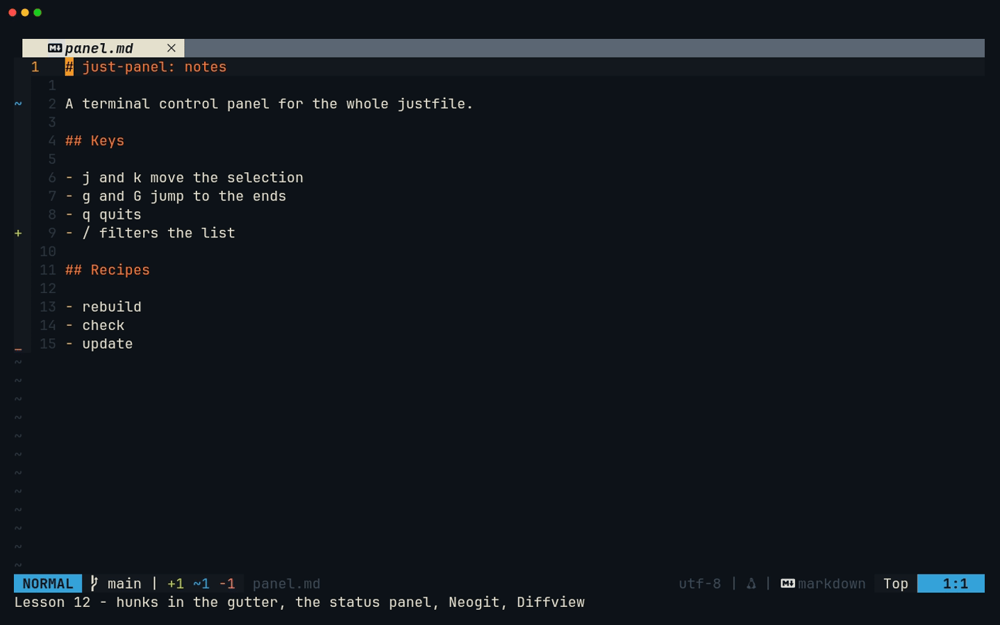
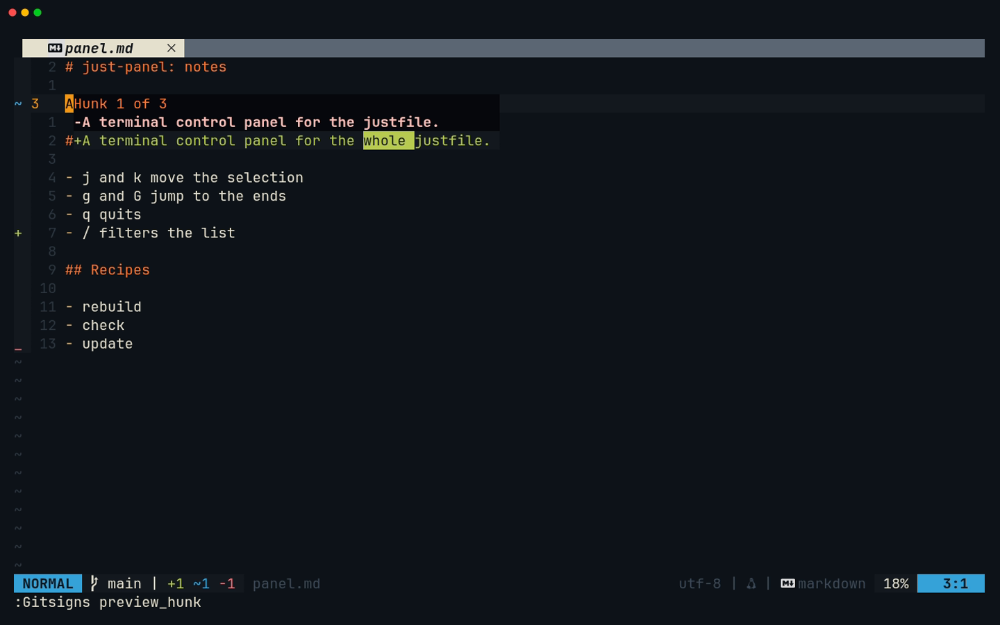
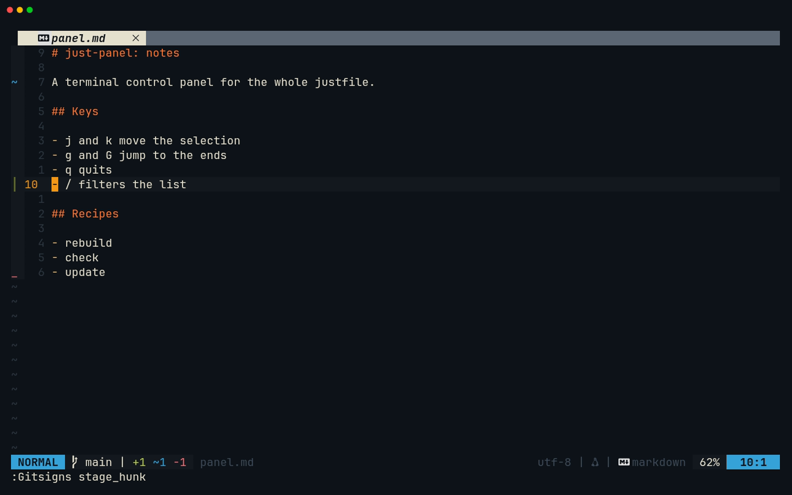
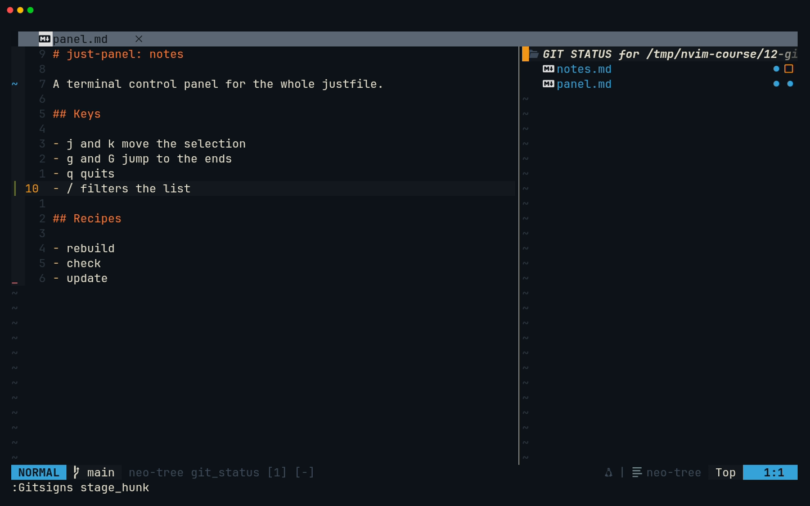
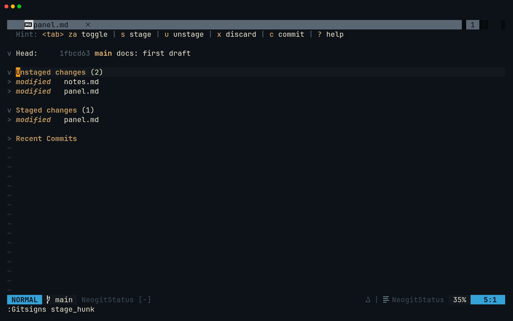
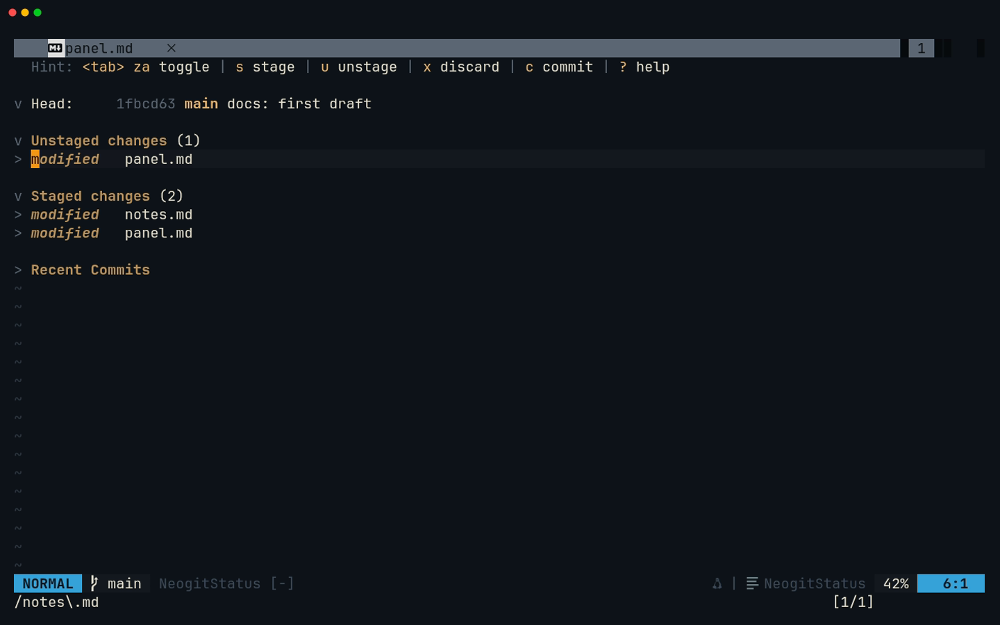
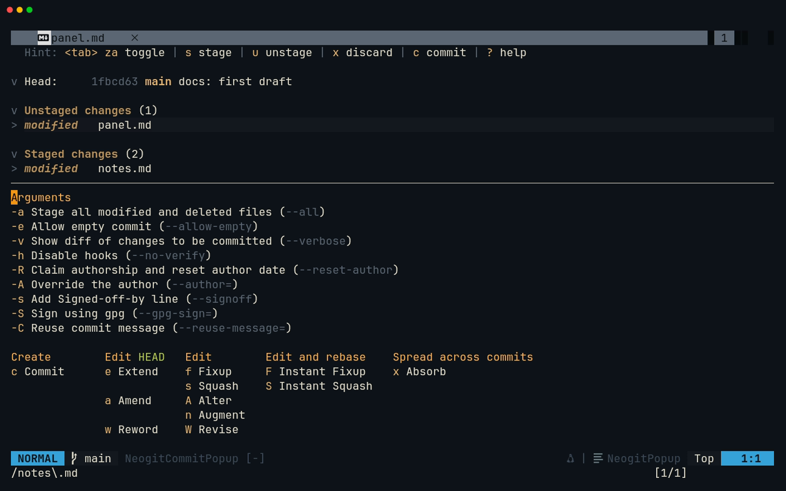
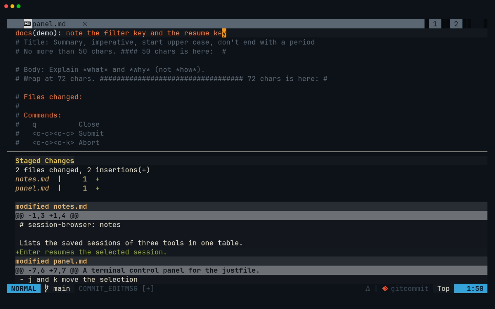
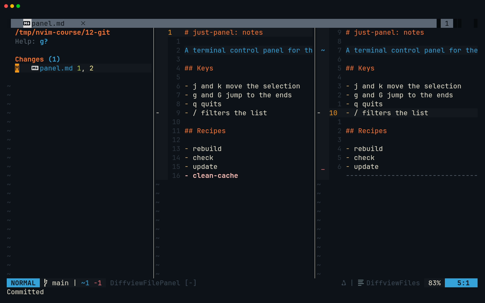

# Lesson 12 — Git

**Last Updated**: 27/09/2026
**Version**: 1.0.0
**Maintained By**: Development Team
**Language**: British English (en_GB)
**Timezone**: Europe/London

---

Five lessons of capstone work are sitting uncommitted in your working tree. In this lesson you learn the four
git tools this config gives you (gitsigns in the gutter, the neo-tree git_status panel, Neogit and Diffview,
plus fugitive for one-offs) on a throwaway practice repo, then use them to turn JP0–JP4 and SB0–SB4 into three
clean, reviewed commits, staged hunk by hunk, and tag them `course/jp4` and `course/sb4`. From here on every
milestone ends in a commit, and in lesson 13 git becomes the one undo that covers both AI tools.

**Part**: 5 — Git and AI · **Time**: ~100 min · **Previous**: [Lesson 11 — Completion, formatting and diagnostics](11-COMPLETION-FORMATTING-DIAGNOSTICS.md) · **Next**: [Lesson 13 — Claude Code and Codex](13-CLAUDE-CODE-AND-CODEX.md)

## Objectives

- Check which identity signs your commits, and know why `git commit` in a terminal opens Zed.
- Read the gutter signs, then jump to, preview, stage, unstage and reset single hunks with `:Gitsigns`.
- Use the git_status panel for a quick overview and folder-level staging, and avoid its three dangerous keys.
- Stage files, hunks and line ranges in Neogit and write commit messages in its editor.
- Review what is staged in Diffview before committing, and know which of your bindings Diffview borrows.
- Use fugitive for `:Git` one-offs, blame and a quick split diff, and close each with the right key.
- Commit JP0–JP4 and SB0–SB4 as three logical commits in the repo's commit style, and tag the milestones.

## Before you start

- You have finished [Lesson 11](11-COMPLETION-FORMATTING-DIAGNOSTICS.md): milestones **JP4** and **SB4** are done,
  and nothing has been committed yet.
- Both capstones pass their checks. In a terminal (a Kitty window, or `<leader>t` in Neovim, where
  `<leader>` is Space) run:

  ```bash
  # in ~/Repos/personal/nix-config/rust
  cargo test -p just-panel
  cargo clippy -p just-panel --all-targets -- -D warnings
  cargo fmt -p just-panel --check
  ```

  Expect `test result: ok. 12 passed`, then no warnings and no output from the format check.

  ```bash
  # in ~/Repos/personal/nix-config/python/session-browser
  uv run pytest -q
  uvx ruff check
  uvx ruff format --check
  uvx pyright
  ```

  Expect `39 passed, 2 skipped` if your `.python-version` says 3.12, or `41 passed` on 3.14 (the two skipped
  tests need Python 3.14's zstd support). Ruff reports `All checks passed!` and `16 files already formatted`, and
  pyright reports 0 errors.
- The test fixtures are exact copies of the course's. No output means identical:

  ```bash
  # in ~/Repos/personal/nix-config
  diff -r docs/NEOVIM-COURSE/fixtures/sessions python/session-browser/tests/fixtures
  cmp docs/NEOVIM-COURSE/fixtures/just/justfile rust/just-panel/tests/fixtures/justfile
  cmp docs/NEOVIM-COURSE/fixtures/just/dump.json rust/just-panel/tests/fixtures/dump.json
  ```

- `git status --short` in `~/Repos/personal/nix-config` shows at least these four lines. Anything else is not
  part of this milestone and stays out of the commits:

  ```text
   M rust/Cargo.lock
   M rust/Cargo.toml
  ?? python/
  ?? rust/just-panel/
  ```

## Keys in this lesson

| Keys | Mode | Action | Where it comes from |
|---|---|---|---|
| `<leader>gs` | n | Toggle the git_status panel (right, 40 columns) | config (neovim.nix:34) |
| `<leader>gg` | n | Open Neogit in a new tab | config (neovim.nix:35) |
| `<leader>gd` | n | Open Diffview: working tree against the index | config (neovim.nix:36) |
| `<leader>gq` | n | Close Diffview | config (neovim.nix:37) |
| `<leader>gh` | n | Diffview history of the current file | config (neovim.nix:38) |
| `:Gitsigns nav_hunk next` / `prev` / `first` / `last` | Command | Jump to an unstaged hunk | gitsigns default (no keymaps configured; signs at neovim.nix:736-744) |
| `:Gitsigns preview_hunk` / `preview_hunk_inline` | Command | Show a hunk's old and new text | gitsigns default |
| `:Gitsigns stage_hunk`, `:'<,'>Gitsigns stage_hunk` | Command | Stage the hunk or the selected lines; on a staged hunk, unstage it | gitsigns default |
| `:Gitsigns reset_hunk` | Command | Put the hunk back to the index version, in the buffer | gitsigns default |
| `:Gitsigns blame_line` / `toggle_current_line_blame` / `blame` | Command | Who changed this line, and in which commit | gitsigns default |
| `:Gitsigns setqflist all` | Command | Every hunk in the repo into the quickfix list | gitsigns default |
| `@:` | n | Repeat the last command line | Neovim default |
| `ga` / `gu` / `gt` | n (git_status panel) | Stage / unstage / toggle the file or folder under the cursor | neo-tree default |
| `A` | n (git_status panel) | `git add -A`, with **no** confirmation | neo-tree default |
| `gr` | n (git_status panel) | Revert the file to HEAD (asks first) | neo-tree default |
| `gc` / `gg` / `gp` | n (git_status panel) | Commit / commit **and push** / push | neo-tree default |
| `<CR>`, `?`, `q` | n (git_status panel) | Open or expand, help, close | neo-tree default |
| `s` / `u` | n, v (Neogit status) | Stage / unstage the file, hunk or selected lines under the cursor | neogit default |
| `S` / `U` / `<c-s>` | n (Neogit status) | Stage modified files / unstage everything / stage **everything** | neogit default |
| `x` | n, v (Neogit status) | Discard (asks first) | neogit default |
| `<tab>` or `za`, `{` / `}`, `<c-n>` / `<c-p>` | n (Neogit status) | Fold, previous/next hunk header, next/previous section | neogit default |
| `c` then `c` | n (Neogit status) | Commit popup, then Commit | neogit default |
| `<c-c><c-c>` / `<c-c><c-k>` | n, i (Neogit commit editor) | Commit / abort | neogit default |
| `$`, `?`, `q` | n (Neogit status) | Git commands Neogit ran, help, close the tab | neogit default |
| `<Tab>` / `<S-Tab>` | n (Diffview) | Next / previous file's diff | diffview default (shadows neovim.nix:61-62) |
| `<leader>e` / `<leader>b` | n (Diffview) | Focus / toggle the file panel | diffview default (shadows neovim.nix:24-25) |
| `-` or `s`, `S`, `U` | n (Diffview file panel) | Stage toggle, stage all, unstage all | diffview default |
| `]c` / `[c`, `do` / `dp` | n (any diff) | Next/previous change, take/put a hunk | Neovim default |
| `:Git`, `:Git commit`, `:Git blame`, `:Gvdiffsplit` | Command | fugitive: summary, commit, blame, split diff | vim-fugitive default |
| `s` `u` `=` `cc` `gq` `g?` | n (`:Git` summary) | Stage, unstage, inline diff, commit, close, help | vim-fugitive default |

## Walkthrough

You learn every tool on a throwaway repo first, so the dangerous keys cannot hurt anything real. It is the
same repo the lesson's recording uses: `panel.md` has three unstaged hunks (a changed line 3, an added line 10,
a deleted last line) and `notes.md` has one added line.

Open a Kitty terminal (`SUPER + RETURN`, then `SUPER + 0`: new windows open on workspace 10), not Neovim's own
terminal, because you are about to start Neovim:

```bash
# in ~/Repos/personal/nix-config
C=$PWD/docs/NEOVIM-COURSE/fixtures/12-git
L=/tmp/nvim-course/12-git
rm -rf "$L" && mkdir -p "$L" && cp -r "$C/v1/." "$L" && cd "$L"
git init -q -b main
git config user.name "Course Demo"
git config user.email "demo@example.invalid"
git add . && git commit -q -m "docs: first draft"
cp -r "$C/v2/." .
nvim panel.md
```



[MP4](../media/12-git/12-git.mp4)

### 1. Who signs your commits

`home/modules/git.nix` deliberately has no `[user]` block (git.nix:11-17). Your identity comes only from
`includeIf` rules: a repo under `~/Repos/personal/` loads `~/.gitconfig-personal` (git.nix:63-65), and the
Syntek and Missional Gen folders load their own files. Anywhere else git has no configured identity: it
either refuses to commit ("Author identity unknown") or guesses one from your user and host names. That is
why the practice repo above set a demo identity with `git config` (no `--global`), which writes to that
repo's own `.git/config` only.

**Try it** in the practice repo's terminal (`<leader>t` inside Neovim opens a shell in the same folder):

```bash
# in /tmp/nvim-course/12-git
git config --show-origin user.email
```

**You should see** `file:.git/config` followed by `demo@example.invalid`. The same command in
`~/Repos/personal/nix-config` must show the file `~/.gitconfig-personal` (spelt out with your home folder) and
the personal address from git.nix:107. You check that for real at the start of the milestone.

### 2. Why `git commit` in a terminal opens Zed

`core.editor` is `zeditor --wait` (git.nix:21), and `EDITOR`/`VISUAL` are the same (home/stages/dev.nix:75-76).
So `git commit` without `-m`, typed in `<leader>t` or any Kitty terminal, opens the message in a Zed window and
the terminal waits until you close that Zed tab.

**Try it**, but do not commit:

```bash
# in /tmp/nvim-course/12-git
git config core.editor
echo "$EDITOR"
```

**You should see** `zeditor --wait` twice. In this course you commit with **Neogit** (step 8) or **fugitive's
`:Git commit`** (step 10). Both open the message inside Neovim whatever `core.editor` says.

> **Gotcha:** the justfile's `just commit MESSAGE` runs `git add -A` before it commits (justfile:434-436), so
> it sweeps every change and every untracked file into one commit. Never use it for hunk-by-hunk work.

### 3. Read the gutter

gitsigns marks every line that differs from the **index** (what `git add` would commit), and it diffs the
**buffer**, not the file on disk, so a sign appears as you type, before you save. The config sets only the
glyphs for unstaged hunks (neovim.nix:736-744):

| Sign | Meaning |
|---|---|
| `+` | Added line |
| `~` | Changed line (also used for a change that deleted lines too) |
| `_` | Lines deleted **below** this line |
| `‾` | Lines deleted above the first line |

Staged hunks keep a sign too, in gitsigns' own default style (`┃`, or `▁`/`▔` for deletions), because
`signs_staged_enable` is on by default and the config does not restyle it.

**Try it:** look at the sign column of `panel.md` (`signcolumn=yes`, so it never jumps).

**You should see** `~` on line 3, `+` on line 10 and `_` on line 16, the last line, marking the deleted `- clean-cache` below it.


> **Gotcha:** gitsigns does not attach to **untracked** files (`attach_to_untracked` is off by default), so a
> brand-new file such as `rust/just-panel/src/sections.rs` shows no signs at all until you stage it.

### 4. Move between hunks and preview them

gitsigns has **no keymaps** in this config (neovim.nix:736-744 sets signs only), so you drive it from the
command line. `:Gitsigns ` followed by `<Tab>` completes the subcommand names.

- `:Gitsigns nav_hunk next` / `prev` jump to the next or previous unstaged hunk, and `first` / `last` to the
  ends.
- `:Gitsigns preview_hunk` opens a float with the old (`-`) and new (`+`) lines. Running it again moves the
  cursor into the float; moving the cursor in the buffer closes it.
- `:Gitsigns preview_hunk_inline` shows the old lines inside the buffer instead.
- `@:` repeats the last command line, so `:Gitsigns nav_hunk next` once and `@:` after that walks the file.

**Try it:** `gg`, then `:Gitsigns nav_hunk next`, then `:Gitsigns preview_hunk`.

**You should see** the cursor on line 3 and a float with `-A terminal control panel for the justfile.` above
`+A terminal control panel for the whole justfile.`. Press `j` and the float closes.



`:Gitsigns setqflist all` puts every hunk in every modified file of the repo into the quickfix list. Walk it
with `]q` / `[q` (Neovim 0.12 defaults), the way you walked search results in
[Lesson 09](09-PROJECT-PANE.md).

### 5. Stage, unstage and reset one hunk

- `:Gitsigns stage_hunk` stages the hunk under the cursor. On a hunk that is **already staged** it unstages it
  (gitsigns 2.x replaced `undo_stage_hunk` with this toggle).
- In Visual mode, `:'<,'>Gitsigns stage_hunk` stages only the selected lines of a hunk. Typing `:` in Visual
  mode inserts the `'<,'>` for you.
- `:Gitsigns reset_hunk` puts the hunk back to its index version **in the buffer**. It is an ordinary edit:
  `u` brings the hunk back, and nothing reaches the disk until you save.
- `:Gitsigns blame_line` shows who last changed the line and in which commit;
  `:Gitsigns toggle_current_line_blame` shows the same as faint text at the end of the line.

**Try it:**

1. `:Gitsigns nav_hunk next` until the cursor is on line 10, then `:Gitsigns stage_hunk`.
2. `:Gitsigns stage_hunk` again (unstaged), and once more (staged again). Leave it staged.
3. `:Gitsigns nav_hunk first` goes to line 3. `:Gitsigns reset_hunk` puts the old sentence back; `u` undoes it.
4. On line 1, `:Gitsigns blame_line`.

**You should see** line 10's `+` turn into the staged `┃` while lines 3 and 16 keep their unstaged signs. Note
that `nav_hunk` skips staged hunks: its default target is unstaged changes only. The blame float names
`Course Demo` and `docs: first draft`. The `+1 ~1 -1` in the statusline is lualine's count of unstaged lines,
not gitsigns': it refreshes only when you enter the buffer again or save it, so it still shows `+1` straight
after `stage_hunk`.



> **Zed habit:** Zed's gutter "Stage" and "Restore" buttons are `:Gitsigns stage_hunk` and
> `:Gitsigns reset_hunk` here.

### 6. The git_status panel (`<leader>gs`)

`<leader>gs` runs `Neotree toggle git_status right` (neovim.nix:34): a 40-column panel on the right edge
(neovim.nix:661-663) listing every changed, staged and untracked file of the repo as a tree, with each
untracked file shown individually. The cursor moves into it.

| Key | What it does |
|---|---|
| `<CR>` | Open the file, or expand/collapse a folder |
| `ga` / `gu` | `git add` / `git reset` the file **or folder** under the cursor |
| `gt` | Toggle between staged and unstaged |
| `?` / `q` | Help / close the panel |

**Try it:** `<leader>gs`, move to `notes.md`, `ga`, then `gu`, then `q`.

**You should see** `notes.md` change status and change back, and the panel close.



> **Gotcha:** three keys in this panel do far more than their neighbours. **`A`** runs `git add -A` on the
> whole repo with no confirmation. **`gr`** reverts the file to HEAD (`git checkout HEAD -- <file>`, after a yes/no
> question), throwing away its changes. **`gg`** asks for a message, commits, and then **pushes** straight away,
> so the usual "go to the top" does not exist here: use `1G` or `:1`. Also `d` deletes the file from disk
> (after a question), as in the filesystem tree. Keep this panel for looking, `ga` and `gu`.

### 7. Neogit (`<leader>gg`)

`<leader>gg` opens Neogit's status buffer in its own tab (`kind = 'tab'`, neovim.nix:813-817). From the top:
the `Head:` line (branch and last commit), then **Untracked files**, **Unstaged changes**, **Staged changes**
and **Recent Commits**, each shown only when it has something in it. Files start folded.

| Key | What it does |
|---|---|
| `j` / `k`, `<c-n>` / `<c-p>` | Move, and jump to the next/previous section |
| `<tab>` (or `za`) | Fold or unfold the item under the cursor, to see its diff |
| `{` / `}` | Previous/next hunk header inside an unfolded diff |
| `s` / `u` | Stage / unstage the file, hunk or line range under the cursor |
| `V` then `s` / `u` / `x` | Stage, unstage or discard exactly the selected lines, or several files at once |
| `x` | Discard the item under the cursor (asks first) |
| `S` / `U` | Stage every modified tracked file / unstage everything |
| `$` | The git commands Neogit has run, handy when something surprises you |
| `?` | Every key, grouped into actions and popups |
| `q` | Close Neogit's tab |

On a **section title**, `s` acts on the whole section: `s` on "Untracked files" stages every untracked item.
An untracked folder shows as one entry (`python/`) because Neogit asks git for its default untracked listing,
so `s` on it stages the whole folder.

**Try it:** `<leader>gg`. Put the cursor on `notes.md` under Unstaged changes (`j`, or search `/notes\.md` and
`<CR>`), press `s`, then `<leader>h` to clear the search highlight. Then `<tab>` on `panel.md` under
Unstaged changes to see its two remaining hunks, and `<tab>` again to fold it.

**You should see** `notes.md` move to Staged changes, next to `panel.md`, which is listed twice: its staged
line 10 under Staged changes and its other two hunks under Unstaged changes.





> **Gotcha:** buffer-local keys win, so inside Neogit's status `<c-s>` is **stage everything**
> (`git add --all`, untracked files included), not save. `<tab>` folds instead of `:bnext`, and `<c-j>`/`<c-k>`
> peek at the next/previous file instead of moving between windows. Neogit lives in its own tab, so leave it
> with `q` (or `gt`/`gT`) rather than window keys.

### 8. Write the commit in Neogit's editor

`c` opens the **commit popup**: switches such as `-a` (all) and actions such as `c` Commit, `e` Extend and
`a` Amend. `c` again opens the commit editor in a new tab, with the staged diff in a split below it. The
editor is an ordinary `gitcommit` buffer, pre-filled with your template (`commit.template = ~/.gitmessage`,
git.nix:31-33) and git's `#` comment lines, which git strips. Neogit adds a `# Commands:` block of its own
(line 10 with this template) that lists the keys below.

| Key | What it does |
|---|---|
| `<c-c><c-c>` | Commit (works in Normal and Insert mode). `ZZ` and `:wq` do the same |
| `<c-c><c-k>` | Abort: no commit. `ZQ` does the same |
| `q` | Close; if you changed the message it asks whether to save |

The repo's commit style is Conventional Commits with a scope and a **lower-case** summary, for example
`fix(network): wg-arwyn outbound-only, own endpoint bypass, restart on secret change`, then a blank line and a
body of `-` bullets or prose wrapped at about 72 columns. The history mostly uses `feat` and `fix`, with some
`docs`, `chore` and `refactor`; the template also lists `style` and `test`.
(`~/.gitmessage` says "start upper case"; the history does not, and the history wins.)

**Try it:** in the status buffer press `c`, then `c`. In the editor press `Esc` if you are in Insert mode,
`gg`, then `cc`, and type `docs(demo): note the filter key and the resume key`. `Esc`, then `<c-c><c-c>`.

**You should see** the editor tab close and the `Head:` line show your new commit. In `panel.md` (press `q`
to leave Neogit) line 10's sign has gone: it is committed.





> **Tip:** friendly-snippets registers commit-message snippets for `gitcommit` buffers, and the buffer source
> suggests words as you type, so a completion menu often sits under the cursor. With the menu open, `<CR>`
> accepts the first item instead of starting a new line (lesson 11): close the menu with `<C-e>` first, or end
> the line with `Esc`. For longer messages, paste instead of typing (see the milestone).

### 9. Review before you commit: Diffview

`<leader>gd` runs `:DiffviewOpen` (neovim.nix:36) in a new tab. With no revision it compares the working tree
with the index, and the file panel on the left lists **Changes** (not yet staged, untracked files included)
and **Staged changes** (what the next commit will contain). Staged changes appears only when something is
staged, so after the commit in step 8 the panel shows Changes alone. Each file opens as a side-by-side diff
(`enhanced_diff_hl = true`, neovim.nix:819-821).

| Key | What it does |
|---|---|
| `<Tab>` / `<S-Tab>` | Next / previous file |
| `]c` / `[c` | Next / previous change inside the diff (Neovim) |
| `<leader>e` / `<leader>b` | Focus / toggle the file panel |
| `j` / `k`, `<CR>` | Move in the file panel, open a file's diff |
| `-` (or `s`), `S`, `U` | In the file panel: stage toggle, stage all, unstage all |
| `g?` | Help for the current view |
| `<leader>gq` | Close Diffview (there is **no** `q`) |

`:DiffviewOpen --staged` shows only the staged changes against HEAD, which is exactly "what am I about to
commit". `<leader>gh` runs `:DiffviewFileHistory %`: every commit that touched this file, each opening as a diff.

**Try it:** `<leader>gd`, `<Tab>` through the files, `<leader>e` to reach the panel, `<leader>gq` to close.

**You should see** `panel.md` under Changes, with the changed line 3 and the deleted last line highlighted.



Diffview's keys are **buffer-local and win** over yours while its tab is open, and it deletes them again when
you leave:

| Your key | Normally | Inside a Diffview tab |
|---|---|---|
| `<leader>co` | Toggle Codex (neovim.nix:43) | Choose OURS for the conflict under the cursor |
| `<leader>cb` | Send buffer to Claude (neovim.nix:41) | Choose BASE for the conflict |
| `<leader>ca` | LSP code action (neovim.nix:352) | Choose ALL versions of the conflict |
| `<leader>e` | Toggle the file tree (neovim.nix:24) | Focus Diffview's file panel |
| `<leader>b` | Toggle the buffer list (neovim.nix:25) | Toggle Diffview's file panel |
| `<Tab>` / `<S-Tab>` | `:bnext` / `:bprevious` (neovim.nix:61-62) | Next / previous file |

Outside a conflict the `<leader>c*` choices do nothing, so the only visible effect is that Codex and Claude do
not answer. Toggle them from another tab (`gt`) or close Diffview first. `<leader>cc`, `<leader>cf` and
`<leader>cs` are not shadowed.

> **Gotcha:** `<leader>ca` is the one that does not come back. Your code-action map is buffer-local (set when
> the LSP attaches), Diffview overwrites it in the real file's buffer, and on `<leader>gq` it deletes its own map
> without restoring yours. For the rest of the session use `gra`, Neovim 0.12's built-in code-action key, which
> is global and untouched. `:lsp restart` should re-run the attach and bring `<leader>ca` back (verify on
> laptop-intel).

Merge conflicts: run `:DiffviewOpen` during a merge or rebase and conflicted files get their own section and a
three-way layout. `]x` / `[x` jump between conflicts, `<leader>co` / `<leader>ct` / `<leader>cb` /
`<leader>ca` choose OURS / THEIRS / BASE / ALL for the conflict under the cursor, `dx` deletes it, `2do` /
`3do` take the OURS / THEIRS hunk, and `g<C-x>` cycles layouts. You will not need this in the course, but now
you know why Diffview wants those `<leader>c` keys.

### 10. Fugitive for one-offs

vim-fugitive is installed with no configuration and no keymaps. `:Git {args}` runs any git command
(`:G` is the short form); a command that needs an editor, such as `commit`, opens it in a split inside Neovim.

- `:Git` alone opens a summary in a split: `s` / `u` stage / unstage the file or hunk under the cursor,
  `=` shows its diff inline, `cc` commits, `g?` lists every key, and **`gq` closes it**. Plain `q` is not
  mapped: it would start recording a macro.
- `:Git commit` writes the message in a split; `:wq` (or `<C-s>` then `<C-q>`) commits, and quitting with an
  empty message aborts, as with plain git.
- `:Git blame` opens a scroll-bound blame column on the left: `<CR>` jumps to that commit's patch, **`gq`**
  closes it.
- `:Git log --oneline` shows its output in a split. `gq` closes that too.
- `:Gvdiffsplit` diffs the file against the index in a vertical split (index on the left). Look with `]c` /
  `[c`, then close it by moving to the left window and pressing `<C-q>`; fugitive switches diff mode off in the
  file's window for you.

**Try it:** `:Git`, then `=` on `panel.md`, then `gq`. Then, in `panel.md`, `:Git blame`, `gq`,
`:Gvdiffsplit`, `<C-h>`, `<C-q>`.

**You should see** each view open and close, and `panel.md` end up in a single window without diff colouring.

Quit the practice Neovim with `:qa!` when you are done; the practice repo can stay or go.

## Gotchas in this config

- **Identity comes only from `includeIf`.** No default `[user]` exists (git.nix:11-17), so a repo outside
  `~/Repos/personal/`, `~/Repos/syntek/` or `~/Repos/missional-gen/` cannot commit until you set an identity
  in that repo. A local `user.email` in `.git/config` beats the include, so check with
  `git config --show-origin user.email` before the first commit in a checkout.
- **`git commit` opens Zed** (`core.editor`, `EDITOR`, `VISUAL` are all `zeditor --wait`: git.nix:21,
  dev.nix:75-76), and the terminal hangs until you close that tab. Commit with Neogit or `:Git commit`, or use
  `git commit -m "…"` for a one-line message.
- **gitsigns has no keymaps.** Use `:Gitsigns …` and `@:`. Do not copy the gitsigns README's `<leader>h…` /
  `<leader>t…` maps: `<leader>h` and `<leader>t` are already maps here (neovim.nix:66, :27), so they would become
  prefixes that wait for `timeoutlen`. [Lesson 28](28-GOING-FURTHER.md) adds hunk keys: `]h`/`[h`, `<leader>gp`,
  `<leader>ga`, `<leader>gr` and `<leader>gb`.
- **`nav_hunk` skips staged hunks** (its default target is unstaged changes).
- **Untracked files have no gitsigns signs** until they are staged.
- **git_status panel:** `A` stages everything with no question, `gr` reverts a file, `gg` commits **and
  pushes**, `d` deletes from disk. `gg` is not "top of list" there.
- **Neogit shadows your keys:** `<c-s>` stages everything, `<tab>` folds, `<c-j>`/`<c-k>` peek.
- **Diffview shadows** `<leader>co`, `<leader>cb`, `<leader>ca`, `<leader>e`, `<leader>b`, `<Tab>` and
  `<S-Tab>` in its tab, has **no `q`** (use `<leader>gq`), and leaves `<leader>ca` deleted afterwards (use `gra`).
- **Fugitive closes with `gq`**, not `q`.
- **Saving `rust/Cargo.toml` reformats it.** TOML is not in conform's list, so format-on-save falls back to the
  taplo language server (neovim.nix:933-936, :974-977) and may re-align the whole file. If that has already
  happened, you will find extra whitespace hunks in `Cargo.toml` during the milestone.
- **`:GBrowse` does not work for GitHub:** it needs a provider plugin such as rhubarb.vim, which is not
  installed.

## Drills

1. In a file with two hunks, stage only the second without opening Neogit.
   <details><summary>Answer</summary>

   `:Gitsigns nav_hunk last` (or `nav_hunk next` twice), then `:Gitsigns stage_hunk`.
   </details>

2. You staged a hunk with gitsigns and changed your mind. How do you unstage it from the buffer?
   <details><summary>Answer</summary>

   Put the cursor on the staged hunk and run `:Gitsigns stage_hunk` again: on a staged hunk it unstages. (Neogit:
   `u` on the hunk under Staged changes.)
   </details>

3. A hunk has ten added lines and only lines 3 to 5 belong in this commit. Give two ways.
   <details><summary>Answer</summary>

   In the buffer: `V` over those three lines, then `:'<,'>Gitsigns stage_hunk`. In Neogit: unfold the file with
   `<tab>`, `V` over the three lines inside the hunk, then `s`.
   </details>

4. In the git_status panel you want to jump to the first file. Why not `gg`, and what instead?
   <details><summary>Answer</summary>

   In that panel `gg` is "commit and push". Use `1G` or `:1`.
   </details>

5. You are in Neogit's commit editor and realise you staged the wrong file. Leave without committing.
   <details><summary>Answer</summary>

   `<c-c><c-k>` (or `ZQ`). Then fix the staging in the status buffer.
   </details>

6. After reviewing in Diffview and closing it with `<leader>gq`, `<leader>ca` does nothing in the file you
   reviewed. Why, and how do you get a code action now?
   <details><summary>Answer</summary>

   Diffview replaced the buffer-local LSP map with its own "choose ALL" map and deleted it on close without
   restoring yours. Use `gra`, the global Neovim 0.12 default for code actions.
   </details>

7. You typed `git commit` in `<leader>t` and the terminal seems stuck. What happened, and how do you get out?
   <details><summary>Answer</summary>

   Git opened the message in Zed (`core.editor = zeditor --wait`) and is waiting. Close that Zed tab: an empty
   message aborts the commit. Then commit from Neogit or `:Git commit`.
   </details>

8. `:Git blame` is open on the left. Close it.
   <details><summary>Answer</summary>

   `gq` in the blame window. `q` would start recording a macro.
   </details>

## Milestone JP0–JP4 + SB0–SB4: the first commits

**Goal:** three commits on `main`, each one building and passing its own tests, made hunk by hunk and reviewed
before committing:

1. `feat(just-panel): …` with the whole crate, the one-line `members` change and the `Cargo.lock` entry.
2. `feat(session-browser): …` with the uv project and the data model.
3. `feat(session-browser): …` with the three session sources, their tests and fixtures.

The session-browser split works because `models.py`, `app.py` and their tests import nothing from `sources/`.
just-panel stays one commit because `main.rs` declares all five modules, so no smaller set of its files compiles.

> **Tip:** paste the commit messages below rather than typing them: copy one from the rendered page, then
> press `p` in Normal mode on the editor's empty first line. `clipboard=unnamedplus` (neovim.nix:257) makes the
> system clipboard the default register, and git strips any blank lines left above the message. If you yank
> from this file's Markdown source instead, the blocks carry three spaces of list indentation: right after
> `p`, `:'[,']s/^   //` removes them from the pasted lines.

Start Neovim in the repo root (bare `nvim` gives you the dock layout), or use `SUPER + SHIFT + RETURN`:

```bash
# in a Kitty terminal
cd ~/Repos/personal/nix-config && nvim
```

### Step 1: check the identity

In `<leader>t`:

```bash
# in ~/Repos/personal/nix-config
git config --show-origin user.email
git config user.name
```

The origin must be `~/.gitconfig-personal` (spelt out with your home folder) and the values those of
git.nix:106-107. If the origin is `file:.git/config` instead, a local setting is overriding the include (this
happens in checkouts that were copied rather than cloned). Remove it and check again:

```bash
# in ~/Repos/personal/nix-config
git config --local --unset user.email
git config --local --unset user.name
git config --show-origin user.email
```

### Step 2: commit 1, just-panel

1. **The workspace member, one hunk.** `:e rust/Cargo.toml`, then `:Gitsigns nav_hunk first` and
   `:Gitsigns preview_hunk`. You want exactly this added line, below `"dev-layout",`:

   ```toml
       "just-panel",        # TUI control panel for the justfile
   ```

   With the cursor on it, `:Gitsigns stage_hunk`. Then run `:Gitsigns nav_hunk next`: if it finds
   another hunk (for example whitespace from taplo, see Gotchas), preview it and leave it **unstaged**; it is
   not part of this commit. If you want rid of it, `x` on that hunk in Neogit discards it by changing the file
   on disk directly, so no format-on-save runs to put it back.
2. **The lockfile.** `<leader>gg`. Under Unstaged changes, `<tab>` on `rust/Cargo.lock` to read its diff: a new
   `[[package]]` block with `name = "just-panel"` whose dependencies are `anyhow`, `serde` and `serde_json`,
   all of which were in the lock already. `<tab>` to fold it, then `s` on the file. If you see other changes in
   the lockfile, do not hand-edit it: find out which cargo command made them before you commit.
3. **The crate.** Still in Neogit, `s` on the untracked `rust/just-panel/` entry.
4. **Review.** `q` to leave Neogit, then `<leader>gd`. Under **Staged changes** you should have exactly these
   11 files, and nothing from `python/`:

   ```text
   rust/Cargo.lock
   rust/Cargo.toml
   rust/just-panel/Cargo.toml
   rust/just-panel/src/app.rs
   rust/just-panel/src/justfile.rs
   rust/just-panel/src/main.rs
   rust/just-panel/src/runner.rs
   rust/just-panel/src/sections.rs
   rust/just-panel/src/ui.rs
   rust/just-panel/tests/fixtures/dump.json
   rust/just-panel/tests/fixtures/justfile
   ```

   `<Tab>` through them and read each diff. Anything wrong: `-` on it in the file panel unstages it. Then
   `<leader>gq`.
5. **Commit.** `<leader>gg`, `c`, `c`, and write:

   ```text
   feat(just-panel): add the crate with the justfile model and banner parser

   - rust/Cargo.toml: add just-panel to the workspace members.
   - rust/Cargo.lock: the entry cargo wrote for just-panel.
   - rust/just-panel: the module layout (app, justfile, runner, sections,
     ui), a lenient serde model of `just --dump --dump-format json`, and
     the parser that groups recipes under the justfile's `# ====`
     banners. 12 unit tests against the course's demo justfile and its
     dump, both compiled in from tests/fixtures.
   ```

   `<c-c><c-c>`, then `q`.

### Step 3: commit 2, the session-browser project and data model

This time you stage by folder in the git_status panel, where every untracked file is listed on its own.

1. `<leader>gs`. Expand folders with `<CR>` until you can see inside `python/session-browser/`.
2. `ga` on the `session-browser` folder: everything in it is staged (the venv and caches stay out, because
   the project's `.gitignore` excludes them).
3. Take back what belongs to commit 3, with `gu` on each of these:
   - the folder `src/session_browser/sources`
   - the folder `tests/fixtures`
   - `tests/test_claude.py`, `tests/test_codex.py`, `tests/test_imports.py`, `tests/test_kitty.py`
4. `q`, then `<leader>gg` and check that Staged changes holds exactly these 11 files:

   ```text
   python/session-browser/.gitignore
   python/session-browser/.python-version
   python/session-browser/README.md
   python/session-browser/pyproject.toml
   python/session-browser/src/session_browser/__init__.py
   python/session-browser/src/session_browser/actions.py
   python/session-browser/src/session_browser/app.py
   python/session-browser/src/session_browser/models.py
   python/session-browser/tests/conftest.py
   python/session-browser/tests/test_models.py
   python/session-browser/uv.lock
   ```

   A file too many: `u` on it. The same selection works in Neogit alone: `s` on `python/`, then `V` over the
   unwanted entries under Staged changes and `u`.
5. `c`, `c`, and write:

   ```text
   feat(session-browser): uv project with the session data model

   - uv project (src layout, package session_browser): Textual, the dev
     tools, ruff's rule set, and pyright pointed at the uv venv.
   - .gitignore for the venv, bytecode and tool caches: the repo's own
     .gitignore has no Python entries.
   - app.py: the Textual frame (title bar, key bar, q quits).
   - models.py: Source, Session and Message, with 5 tests.
   ```

   `<c-c><c-c>`, then `q`.

### Step 4: commit 3, the session sources, with fugitive

1. `<leader>gs`, `ga` on the `session-browser` folder again: it stages what is left. `q`.
2. `:Git` and check the Staged list: `src/session_browser/sources/` (four files), the four `test_*.py` files
   from step 3, and `tests/fixtures/` (14 files), 22 files in all. `gq`.
3. `:Git commit`. The message opens in a split with your template, in Normal mode. Put this on the first
   line and below it:

   ```text
   feat(session-browser): read Claude Code, Codex and Kitty sessions

   - sources/__init__.py: defensive JSON Lines helpers: head and tail
     reads, malformed lines skipped, timestamps without an offset read
     as UTC.
   - sources/claude.py, codex.py and kitty.py: one loader per tool, with
     CLAUDE_CONFIG_DIR, CODEX_HOME and SESSION_BROWSER_KITTY_DIR
     overrides.
   - 36 more tests against synthetic stores in tests/fixtures, a copy of
     docs/NEOVIM-COURSE/fixtures/sessions, so no test reads real sessions.
   ```

   `Esc`, then `:wq`. The commit runs as the split closes.

### Step 5: tag the two milestones

A tag is a fixed name for one commit. Two local tags mark where the capstones stand at the end of this lesson:
`course/jp4` on the just-panel commit and `course/sb4` on the last session-browser commit. They are there so you
can diff against and return to this milestone later: `git diff course/jp4 -- rust/just-panel` lists everything
you have changed in just-panel since, and `:DiffviewOpen course/jp4` shows the same in Neovim. The capstone
lessons after this one add more (`course/jp5`, `course/sb5` and so on).

Tag the commits, in the terminal:

```bash
# in ~/Repos/personal/nix-config
git tag course/sb4
git tag course/jp4 HEAD~2
```

`git tag NAME` tags `HEAD`, your third commit. `HEAD~2` is two commits before it: the just-panel commit, as long
as you made the three commits in the order above. The tags are lightweight and local: a plain `git push` does not
send tags, and you do not push anyway. A tag in the wrong place goes with `git tag -d course/jp4`; then tag again.
(From Neovim, fugitive's `:Git tag …` runs the same commands.)

### Check it

```bash
# in ~/Repos/personal/nix-config
git log --oneline --decorate -3
git tag --list 'course/*'
git show --stat course/jp4
git status --short
```

`git log` lists your three commits, newest first: the newest carries `tag: course/sb4` and the oldest
`tag: course/jp4`. `git tag` lists `course/jp4` and `course/sb4`. `git show --stat course/jp4` lists the 11
just-panel files. `git status --short` no longer mentions `rust/Cargo.toml`, `rust/Cargo.lock`, `rust/just-panel/` or
`python/`, unless you deliberately left a whitespace hunk in `rust/Cargo.toml`. Then run the checks from
"Before you start" once more: they pass exactly as before, because committing changed no files.

> **Tip:** a commit with the wrong files or the wrong message is easy to take back, because nothing has
> left your machine. `git reset --soft HEAD~1` (in `<leader>t`) undoes the last commit and leaves its
> changes staged, ready to fix and commit again; run it once per commit you want to undo. For a message or
> a forgotten file only, stage the fix and use Neogit's commit popup: `c`, then `a` (Amend). If you had
> already tagged the commit, tag again afterwards: `git tag -d course/jp4`, then `git tag course/jp4 …`.

Do not push. The commits stay local until you decide otherwise.

Stuck? Compare with [examples/just-panel/JP4](../examples/just-panel/JP4/) and
[examples/session-browser/SB4](../examples/session-browser/SB4/) — see [examples/README.md](../examples/README.md).

## Recap

- Identity comes from `includeIf` only; check `git config --show-origin user.email` in a new checkout.
- `git commit` in a terminal opens Zed; commit with Neogit (`c` `c`, `<c-c><c-c>`) or `:Git commit`.
- gitsigns: signs for unstaged (`+ ~ _ ‾`) and staged hunks; `:Gitsigns nav_hunk`, `preview_hunk`,
  `stage_hunk` (toggles), `reset_hunk`, `blame_line`, and `@:` to repeat.
- git_status panel (`<leader>gs`): `ga`/`gu` on files and folders; never `A`, `gr` or `gg` by accident.
- Neogit (`<leader>gg`): `s`/`u`/`x` on files, hunks and Visual selections; `<tab>` to unfold; `q` to leave.
- Diffview (`<leader>gd`/`<leader>gq`): read the Staged changes list before committing; it borrows
  `<leader>co/cb/ca/e/b` and `<Tab>` while open, and `gra` replaces the lost `<leader>ca`.
- fugitive: `:Git`, `:Git blame`, `:Git log`, all closed with `gq`.
- JP0–JP4 and SB0–SB4 are now three commits in the repo's `type(scope): summary` style, tagged `course/jp4`
  and `course/sb4` (local tags, never pushed).

## Recording

- **Tape:** [`tapes/12-git.tape`](../tapes/12-git.tape). Run it from `docs/NEOVIM-COURSE/` on laptop-intel:
  `vhs tapes/12-git.tape`.
- **VHS version:** `vhs --version` must print 0.12.1, which the config builds (0.12.0 exits 0 and writes nothing);
  if it prints 0.12.0, `just rebuild` first ([Appendix B](../appendices/B-RECORDING-WITH-VHS.md#first-make-sure-vhs-is-0121)).
- **Outputs:** `media/12-git/12-git.gif` and `media/12-git/12-git.mp4`.
- **Screenshots** (all in `media/12-git/`):

  | File | Shows | Step |
  |---|---|---|
  | `signs.png` | `panel.md` with `~` on line 3, `+` on line 10, `_` on line 16 | 3 |
  | `preview-hunk.png` | The `preview_hunk` float for line 3 | 4 |
  | `staged-sign.png` | Line 10 in the staged style after `stage_hunk` | 5 |
  | `git-status-panel.png` | The git_status panel on the right | 6 |
  | `neogit-status.png` | Neogit with Staged changes, Unstaged changes and Recent Commits | 7 |
  | `neogit-staged.png` | `notes.md` moved to Staged changes after `s` | 7 |
  | `commit-popup.png` | The commit popup after `c` | 8 |
  | `commit-editor.png` | The commit editor with the message on line 1 | 8 |
  | `diffview.png` | Diffview with the remaining changes of `panel.md` | 9 |

- **Manual steps:** none. The hidden setup builds its own throwaway repo in `/tmp/nvim-course/12-git` with a demo
  identity and no remote, so nothing is pushed and no real repo is touched. The tape also sets
  `GIT_AUTHOR_NAME`, `GIT_AUTHOR_EMAIL`, `GIT_COMMITTER_NAME` and `GIT_COMMITTER_EMAIL` to the demo identity, so
  your own name and address cannot reach the demo log, and points `CLAUDE_CONFIG_DIR` at a throwaway folder, so
  claudecode.nvim's lock file never lands in your real `~/.claude/ide`. Your global git config still applies in
  the demo repo, which is why your `~/.gitmessage` template appears in the commit editor.
- **Check before publishing:**
  - `media/12-git/` actually contains `12-git.gif`, `12-git.mp4` and all nine PNGs. An empty folder after a run
    that exited 0 means VHS 0.12.0 did the rendering.
  - The commit editor frame shows your commit template (it is in this repo already, so nothing private), and
    every other frame shows only the demo files and the `Course Demo` identity.
