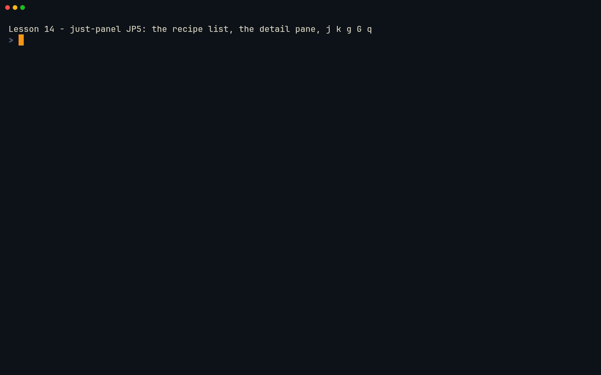
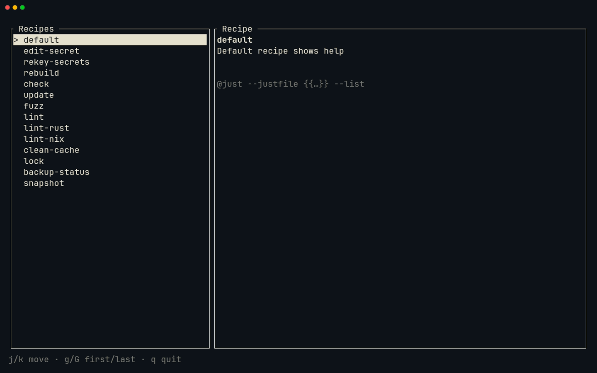
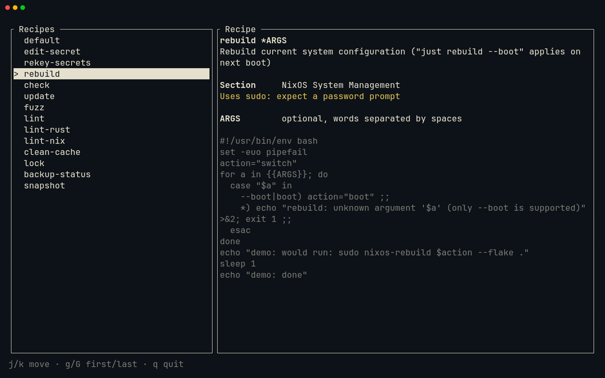
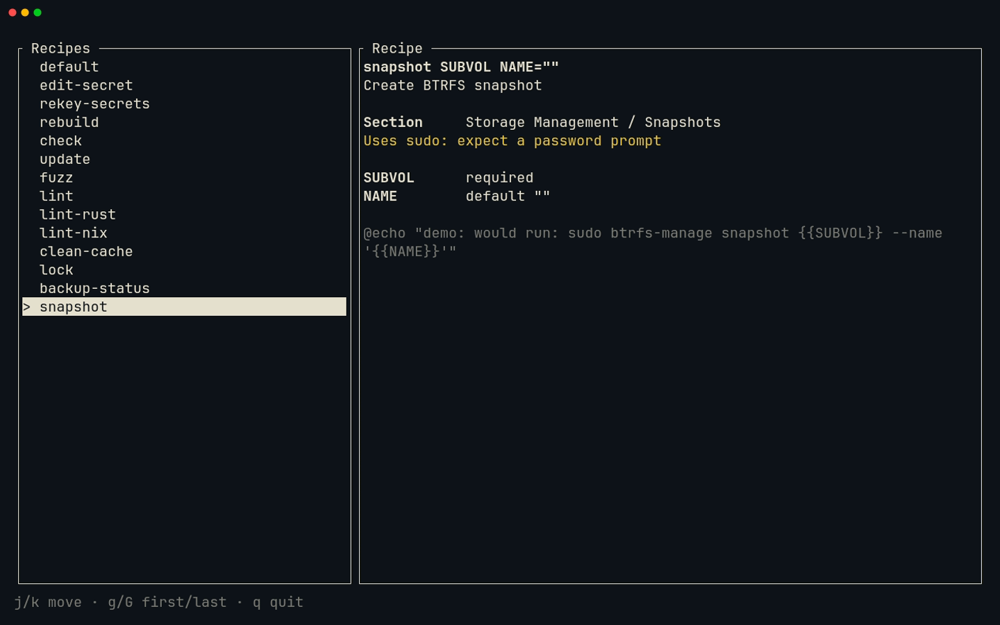

# Lesson 14 — just-panel: TUI skeleton

**Last Updated**: 27/09/2026
**Version**: 1.0.0
**Maintained By**: Development Team
**Language**: British English (en_GB)
**Timezone**: Europe/London

---

So far just-panel is a tested library behind a `main` that prints `Hello, world!`. In this lesson it becomes a
terminal app: a ratatui event loop that loads a justfile through `just --dump`, lists its recipes in the order the
file has them, shows the selected recipe in a detail pane, and answers to `j`, `k`, `g`, `G` and `q`. You build it
the Neovim way. Telescope jumps between files, `app.rs` and `ui.rs` sit side by side, `gd` and `K` read ratatui's
own source and docs, `:TermExec` runs the panel in a terminal inside Neovim, and Trouble shows what clippy thinks.
The milestone ends with a Neogit commit and a local tag, `course/jp5`, so you can diff against and return to this
milestone later.

**Part**: 6 — Build just-panel · **Time**: ~120 min · **Previous**: [Lesson 13 — Claude Code and Codex](13-CLAUDE-CODE-AND-CODEX.md) · **Next**: [Lesson 15 — just-panel: sections and filter](15-JUST-PANEL-SECTIONS-AND-FILTER.md)

## Objectives

- Add ratatui to the workspace and the crate, and save TOML files without a surprise reformat.
- Explain ratatui's immediate-mode model: every frame draws the whole screen from your state.
- Split the screen with `Layout` and `Constraint`, and draw a stateful `List` whose `ListState` outlives each frame.
- Read key events safely: presses only, Ctrl+C as a key, other Ctrl and Alt chords ignored.
- Load a justfile through `just --dump` with an explicit, absolute path.
- Move around Rust code with `<leader>ff` (`<leader>` is Space), splits, `gd`, `K` and `<C-o>`, and rename across
  files with `<leader>rn`.
- Run the panel inside Neovim with `:TermExec`, and read errors, warnings and clippy findings in Trouble.
- Commit JP5 with Neogit and tag it `course/jp5`.

## Before you start

- You have finished [Lesson 13](13-CLAUDE-CODE-AND-CODEX.md). JP4 is committed, together with the crate's
  `AGENTS.md` and `CLAUDE.md`, and possibly the four parser tests Claude drafted.
- Nothing in the crate is left uncommitted. This should print nothing:

  ```bash
  # in ~/Repos/personal/nix-config
  git status --short rust/
  ```

- The crate passes its checks:

  ```bash
  # in ~/Repos/personal/nix-config/rust
  cargo test -p just-panel
  cargo clippy -p just-panel --all-targets -- -D warnings
  cargo fmt -p just-panel --check
  ```

  Expect `test result: ok. 12 passed`, plus the tests you kept in lesson 13 (16 if you kept all four). Every test
  count this lesson quotes is the course's own; add yours to it. The other two commands print no warnings.
- The test fixtures are still exact copies of the course's (no output means identical):

  ```bash
  # in ~/Repos/personal/nix-config
  cmp docs/NEOVIM-COURSE/fixtures/just/justfile rust/just-panel/tests/fixtures/justfile
  cmp docs/NEOVIM-COURSE/fixtures/just/dump.json rust/just-panel/tests/fixtures/dump.json
  ```

  If `cmp` reports a difference, copy them across again, exactly as the crate had them since JP4:
  `cp docs/NEOVIM-COURSE/fixtures/just/{justfile,dump.json} rust/just-panel/tests/fixtures/`.
- `just --version` prints `just 1.58.0`. The panel runs `just` itself, and only the full `laptop-intel` config
  installs it (`modules/core/common.nix:88`).
- Start Neovim from a Kitty terminal (`SUPER + RETURN`, then `SUPER + 0`: new windows open on workspace 10):

  ```bash
  # in a Kitty terminal
  cd ~/Repos/personal/nix-config/rust && nvim just-panel/src/main.rs
  ```

  Three things follow from starting it this way. Neovim's working directory is `rust/`, and every path in this
  lesson is relative to it. The file argument skips the startup dock layout (neovim.nix:892). And the zsh you
  typed that in has already loaded the repo's dev shell through direnv (`.envrc` is `use flake`), so Neovim and
  its language server inherit that toolchain; lesson 10 has the details.

> **Gotcha:** `SUPER + SHIFT + RETURN` (the dev layout) starts Neovim with `kitty … -e nvim`, not through zsh,
> so it gets rustup's toolchain and no dev shell. rust-analyzer checks the whole workspace, and two crates in it
> (`wireguard-helper` and `malware-scanner`) need openssl's development files, which only the dev shell
> provides, so its clippy run can fail on their openssl-sys build (verify on laptop-intel). Start Neovim from
> zsh for this lesson.

## Keys in this lesson

`<leader>` is Space. The panel's own keys are in a separate table in step 6: they belong to your program, not to
Neovim.

| Keys | Mode | Action | Where it comes from |
|---|---|---|---|
| `<leader>ff` | n | Telescope: find a file by name (`ui.rs`, `panel main`, `panel cargo`) | config (neovim.nix:29) |
| `<leader>fb` | n | Telescope: switch to an open buffer | config (neovim.nix:31) |
| `:e {file}` | c | Edit a file, relative to the working directory | Neovim default |
| `ggVGp` | n | Replace the whole buffer with the clipboard | Neovim default (`clipboard=unnamedplus`, neovim.nix:257) |
| `<C-s>` | n | Save; Rust is formatted on save by rust-analyzer | config (neovim.nix:64; format on save :974-977) |
| `:noautocmd w` | c | Save without format-on-save | Neovim default |
| `:wa` | c | Save every modified buffer | Neovim default |
| `15G`, `6dd` | n | Go to line 15; delete six lines | Neovim default |
| `<C-w>v` | n | Split the window; the new one opens on the right | Neovim default (`splitright`, neovim.nix:249) |
| `<C-w>s` | n | Split the window; the new one opens below | Neovim default (`splitbelow`, neovim.nix:261) |
| `<C-h>` `<C-j>` `<C-k>` `<C-l>` | n | Move to the window left / below / above / right | config (neovim.nix:68-71) |
| `<C-q>` | n | Close the current window | config (neovim.nix:65) |
| `gd` | n | Go to the definition, also inside library sources | config (LSP buffer-local, neovim.nix:340) |
| `K` | n | Hover documentation | config (LSP buffer-local, neovim.nix:344) |
| `<C-o>` | n | Jump back to where you were | Neovim default |
| `<C-d>` / `<C-u>` | n | Scroll half a page down / up | Neovim default |
| `grr` | n | References into the quickfix list (`gr` does the same after a 300 ms wait) | Neovim 0.12 default (`gr`: config, LSP buffer-local, neovim.nix:343) |
| `<leader>rn` | n | Rename the symbol under the cursor in every file | config (LSP buffer-local, neovim.nix:351) |
| `<C-u>` | c | Delete everything typed before the cursor (clears the rename prompt) | Neovim default |
| `]d` / `[d` | n | Next / previous diagnostic, with a float | config (LSP buffer-local, neovim.nix:353-354) |
| `<leader>ld` | n | Diagnostic float for the cursor line | config (LSP buffer-local, neovim.nix:358) |
| `<leader>xx` | n | Trouble: every diagnostic, clippy's included | config (neovim.nix:55) |
| `<CR>`, `q` | n (Trouble) | Jump to the item; close Trouble | trouble.nvim default |
| `:TermExec cmd="…" go_back=0` | c | Run a command in the first ordinary terminal and leave the cursor there | toggleterm default |
| `<leader>t` | n | Show or hide the bottom terminal | config (neovim.nix:27) |
| `<C-\><C-n>` | t | Leave Terminal mode for Normal mode | Neovim default |
| `i` | n (terminal buffer) | Back into Terminal mode: keys go to the program again | Neovim default |
| `<C-w>_` / `<C-w>=` | n | Make the window as tall as possible / make all windows equal | Neovim default |
| `5<C-a>` / `5<C-x>` | n | Add 5 to / subtract 5 from the number under or after the cursor | Neovim default |
| `<leader>gg` | n | Neogit status, in a new tab | config (neovim.nix:35) |
| `<tab>`, `s`, `S`, `c` `c`, `q` | n (Neogit status) | Fold, stage, stage all modified, commit popup then Commit, close | neogit default |
| `<c-c><c-c>` | n, i (Neogit commit editor) | Make the commit | neogit default |

## Walkthrough

JP5 touches six files: the two `Cargo.toml` files, and `main.rs`, `app.rs` and `ui.rs`, which you replace
completely. Their full text is in the [Milestone](#milestone-jp5-a-working-panel) section at the end, as Listings
1 to 5. The steps below tell you when to put each one in place and explain what it does as you go.

> **Tip:** paste the listings rather than typing them. Copy one from the rendered page, then in Neovim, in Normal
> mode, press `ggVGp`: `gg` goes to the first line, `V` starts a linewise selection, `G` stretches it to the last
> line, and `p` puts the clipboard over it. `clipboard=unnamedplus` (neovim.nix:257) makes the system clipboard
> the default register. Afterwards the clipboard holds the text you replaced, so copy each listing afresh. Typing
> long code in Insert mode invites the completion menu's `<CR>` trap from lesson 11.

### 1. Add ratatui to the workspace and to the crate

ratatui draws the screen. It talks to the terminal through crossterm, and ratatui 0.30 re-exports the crossterm
it was built with as `ratatui::crossterm`. So the crate depends on ratatui alone and writes
`use ratatui::crossterm::event::…`: one crossterm version, and no second one drifting in. clap is already a
workspace dependency (other tools in `rust/` use it); just-panel adds clap's `env` feature, which lets
`--justfile` fall back to an environment variable.

**Try it.**

1. `:e Cargo.toml` opens `rust/Cargo.toml` (the path is relative to `rust/`). Type `/colored` and press `<CR>`:
   the cursor lands on `colored = "2.1"` under `# CLI and terminal`. Press `o` to open a line below it, type
   `ratatui = "0.30"`, and press `<Esc>`. Compare with Listing 1.
2. Save with `:noautocmd w`. TOML is not in conform's formatter list, so a plain save falls through to the taplo
   language server's formatter (neovim.nix:933-936, :974-977), which can re-align the whole file and leave you
   whitespace changes to explain at commit time. `:noautocmd` skips format-on-save for that one write.
3. `<leader>ff` (Space, then `f`, `f`), then type `panel cargo`.
   Telescope's fuzzy syntax treats the two words as "both must match", so the top result is
   `just-panel/Cargo.toml`. Press `<CR>`.
4. Make its `[dependencies]` read exactly as Listing 2: a `clap` line and a `ratatui` line, in alphabetical order
   between `anyhow` and `serde`. Save with `:noautocmd w` again.

**What you should see:** nothing yet; nothing uses ratatui. Cargo fetches it, and adds it to `rust/Cargo.lock`,
the first time something builds or checks the crate: rust-analyzer's check after your next save of a `.rs` file,
or the `cargo run` in step 6.

> **Zed habit:** Zed's file finder is Telescope's `<leader>ff` here, and Zed's "go back" is `<C-o>`.

### 2. Delete the dead-code allowance and watch the warnings arrive

Since JP2, `main.rs` has carried `#![allow(dead_code)]`, because nothing called the crate's code. JP5 wires
everything into `main`, so the allowance goes, and from now on the compiler checks again that everything is used.

**Try it.**

1. `<leader>fb`, type `main`, `<CR>`: back to `main.rs`.
2. `15G` puts the cursor on line 15, the first of four comment lines above the attribute. `6dd` deletes lines 15
   to 20: the comments, `#![allow(dead_code)]` and the blank line after it. Line 15 is now `mod app;`.
3. `<C-s>`. Saving runs rustfmt through rust-analyzer, and then rust-analyzer's check, which in this config is
   clippy (`check.command = "clippy"`, neovim.nix:431).
4. After a moment (this first check also fetches and compiles ratatui, so it can take a minute or so),
   `<leader>xx` (Space `x` `x`, typed briskly). Trouble opens at the bottom with warnings
   for `justfile.rs` and `sections.rs`, such as ``function `load` is never used``.

**What you should see:** Trouble lists the warnings grouped by file, but the cursor stays in `main.rs`: Trouble
does not take focus by default. `<C-j>` moves into it, `j` and `k` move through the list, `<CR>` jumps to an item,
and `q` closes it. In the code itself a warning is only a sign in the sign column: the config never turns on
Neovim's virtual text, which has been off by default since 0.11. `]d` jumps to the next diagnostic in the buffer
and opens a float, and `<leader>ld` shows the float for the cursor line.

> **Gotcha:** `<leader>x` on its own closes the buffer (neovim.nix:63), and it is also the start of `<leader>xx`
> and `<leader>xw`. Type `<leader>xx` in one quick movement; pause after the first `x` and you close the buffer
> instead.

### 3. `main.rs`: the terminal, the command line and the event loop

Put Listing 3 into `main.rs` (`ggVGp`, then `<C-s>`).

Three ideas carry the whole file.

**Terminal lifecycle.** `ratatui::run(|terminal| …)` switches the terminal into *raw mode* (every key arrives at
once, unechoed, with no line editing) and onto the *alternate screen* (a separate screen that full-screen programs
draw on, so your shell's scrollback is still there when you quit). It also installs a panic hook that switches
both back. Then it calls your closure, and restores the terminal however the closure ends. One consequence of raw mode:
Ctrl+C is no longer a signal that kills the program. It arrives as an ordinary key press, so quitting on it is
your code's job.

**Immediate-mode rendering.** ratatui keeps no widgets between frames. Each time round the loop,
`terminal.draw(|frame| ui::render(frame, app))` calls your render function, which builds every widget afresh from
the state in `App` and draws the whole screen into a buffer. ratatui compares that buffer with the previous frame
and writes only the cells that changed. So the only thing to keep in sync is the state; the screen follows it.

**The event loop.** Draw, wait for one event, update the state, repeat. An excerpt from Listing 3:

```rust
/// Draw, wait for a key, update the state, repeat.
fn event_loop(terminal: &mut DefaultTerminal, app: &mut App) -> io::Result<()> {
    loop {
        terminal.draw(|frame| ui::render(frame, app))?;
        match event::read()? {
            // Presses only: a terminal that also reports key releases would
            // otherwise move the selection twice per keystroke.
            Event::Key(key) if key.kind == KeyEventKind::Press => {
                if let Some(Action::Quit) = app.handle_key(key) {
                    return Ok(());
                }
            }
            // Nothing to do for a resize: the next draw picks up the new size.
            _ => {}
        }
    }
}
```

`event::read()` blocks until something happens. A key event carries a *kind*: `Press`, `Repeat` or `Release`.
Terminals only report releases when a program asks for them, and this one does not, so on Linux every key arrives
as a `Press`. Filtering on `KeyEventKind::Press` anyway is the portable habit that the ratatui docs use. A resize
is an event too, and the next `draw` picks up the new size by itself.

The start of `main` finds the justfile. Another excerpt from Listing 3, which continues with the call to
`ratatui::run`:

```rust
/// A terminal control panel for a justfile.
#[derive(Parser)]
#[command(version)]
struct Cli {
    /// The justfile to load. Its recipes run in its own directory.
    #[arg(short = 'f', long, env = "JUST_JUSTFILE", default_value = "justfile")]
    justfile: PathBuf,
}

fn main() -> Result<()> {
    let cli = Cli::parse();
    // An absolute path gives just a real directory to run recipes in: see
    // `justfile::just_command`. Not `fs::canonicalize`, which also resolves
    // symlinks: for a justfile that home-manager links in from the Nix
    // store, the recipes would then run inside the store, not where `just`
    // itself runs them.
    let justfile = path::absolute(&cli.justfile)?;
    let source = fs::read_to_string(&justfile)
        .with_context(|| format!("cannot read {}", justfile.display()))?;
    let recipes = justfile::load(&justfile)?;
    let mut app = App::new(recipes, sections::parse(&source));
```

- `-f`/`--justfile` falls back to `$JUST_JUSTFILE`, then to `justfile` in the current directory. On laptop-intel,
  zsh exports `JUST_JUSTFILE` for the nix-config justfile (home/modules/shell.nix:79), which step 7 makes use of.
- `std::path::absolute` makes the path absolute without resolving symlinks. `fs::canonicalize` would resolve them,
  and `just` runs a symlinked justfile's recipes in the link's directory, not the target's: with a justfile that
  Home Manager links in from the Nix store, a canonicalised path would move the recipes into the store.
- The source is read before `just` runs, so a wrong path fails with `cannot read …` and nothing is spawned.
- `justfile::load`, your JP3 code, runs `just --justfile F --working-directory <dir of F> --dump --dump-format json`.
  Both flags are passed explicitly because zsh also exports `JUST_WORKING_DIRECTORY` (home/modules/shell.nix:80),
  and an inherited one beats the justfile's own directory unless `--working-directory` is given.

**Try it.** Put the cursor on `load` in `justfile::load(&justfile)` and press `gd`: you land on `pub fn load` in
`justfile.rs`. On `just_command` inside it, `gd` again. `<C-o>` twice takes you back to `main.rs`.

**What you should see:** Trouble now shows errors instead of warnings, because `main.rs` uses things that do not
exist yet, such as ``unresolved imports `crate::app::Action`, `crate::app::App` `` and ``cannot find function
`render` in module `ui` `` (your rustc may word them slightly differently). While the crate does not compile,
clippy's lints wait, so the dead-code warnings are gone for now.

### 4. `app.rs`: the state, and what each key does to it

`<leader>ff`, type `app.rs`, `<CR>`. The crate is the only one in `rust/` with an `app.rs`, so there is one match.
Put Listing 4 in it and save.

`App` is everything the panel knows: the recipes in source order, each with the banner it sits under, and a
`ListState`. The `ListState` holds the selected row and how far the list has scrolled. ratatui updates the scroll
offset while it draws, so the state has to outlive a frame, which is why it lives in `App` rather than in the
render function.

`App::new` merges the two things you built in lessons 10 and 11: the dump (alphabetical, private recipes
included) and the banner sections (source order). Private recipes are left out, as `just --list` leaves them out;
anything the banner parser missed goes into an "Other" section at the end.

`handle_key` only changes the state and returns what the loop should do next, so every key can be tested
without a terminal (lesson 17). An excerpt from Listing 4:

```rust
    /// Updates the state for one key press.
    pub fn handle_key(&mut self, key: KeyEvent) -> Option<Action> {
        // In raw mode Ctrl+C arrives as an ordinary key press rather than as
        // a signal, so quitting on it is up to us.
        if key.modifiers.contains(KeyModifiers::CONTROL) && key.code == KeyCode::Char('c') {
            return Some(Action::Quit);
        }
        // Other keys count only without Ctrl or Alt: crossterm reports
        // Ctrl+Q as a `q` with the CONTROL modifier, and Ctrl+Q is not `q`.
        let ctrl_or_alt = KeyModifiers::CONTROL | KeyModifiers::ALT;
        if key.modifiers.intersects(ctrl_or_alt) {
            return None;
        }
        match key.code {
            KeyCode::Char('q') | KeyCode::Esc => return Some(Action::Quit),
            KeyCode::Char('j') | KeyCode::Down => self.select_next(),
            KeyCode::Char('k') | KeyCode::Up => self.select_previous(),
            KeyCode::Char('g') => self.select_first(),
            KeyCode::Char('G') => self.select_last(),
            _ => {}
        }
        None
    }
```

The Ctrl/Alt rule matters: crossterm reports Ctrl+Q as the character `q` with the `CONTROL` modifier, so a
`match key.code` on its own would make Ctrl+Q quit (and, in lesson 15, make Ctrl+U type a `u` into the filter).

Movement is done by hand. `ListState` has `select_next`, `select_previous` and `select_last`, but they cannot know
how long the list is until it is drawn: `select_last` stores `usize::MAX` and leaves the render to clamp it. Until
then, `selected()` would point past the last recipe. The four `select_*` helpers at the bottom of the file
clamp themselves, and `k` on the first recipe simply stays put.

**Try it.**

1. Put the cursor on `ListState` in the `use ratatui::widgets::ListState;` line and press `K`: a float shows
   ratatui's documentation for it. Move the cursor and the float closes.
2. On `Recipe` in `use crate::justfile::Recipe;`, `gd` takes you to your JP2 struct in `justfile.rs`. `<C-o>`
   comes back.

**What you should see:** in Trouble, the `app` errors are gone; the one about `ui::render` is still there.

### 5. `ui.rs` beside `app.rs`: layout, the stateful list and the detail pane

1. `<C-w>v` splits the window: the new one opens on the right (`splitright`, neovim.nix:249), showing `app.rs`
   too.
2. In the right-hand window, `<leader>ff`, type `ui.rs`, `<CR>`. Now `app.rs` is on the left and `ui.rs` on the
   right, and `<C-h>` / `<C-l>` move between them.
3. Put Listing 5 into `ui.rs` and save.

Reading `ui.rs` with `app.rs` next to it shows the split between state and drawing.

**Layout and Constraint.** `render` cuts the screen into rectangles before drawing anything. An excerpt from
Listing 5:

```rust
pub fn render(frame: &mut Frame, app: &mut App) {
    let [main, status] =
        Layout::vertical([Constraint::Min(0), Constraint::Length(1)]).areas(frame.area());
    let [list, detail] =
        Layout::horizontal([Constraint::Percentage(35), Constraint::Min(0)]).areas(main);
    render_list(frame, list, app);
    render_detail(frame, detail, app.selected());
    render_status(frame, status);
}
```

`Layout::vertical` stacks areas top to bottom: `Min(0)` takes whatever is left, and `Length(1)` is exactly one
row, for the key hints. `Layout::horizontal` then gives the list 35 % of the width and the detail pane the rest.
`areas` returns an array whose length comes from the pattern on the left (`[main, status]`). If the number of
constraints does not match it, the program panics when it draws, so change both together.

**The stateful list.** `render_list` builds a `List` from the recipe names every frame and draws it with the
state from `App` (excerpt from Listing 5):

```rust
fn render_list(frame: &mut Frame, area: Rect, app: &mut App) {
    let items: Vec<ListItem> = app
        .entries
        .iter()
        .map(|entry| ListItem::new(entry.recipe.name.as_str()))
        .collect();
    let list = List::new(items)
        .block(Block::bordered().title(" Recipes "))
        .highlight_style(Style::new().reversed())
        .highlight_symbol("> ");
    frame.render_stateful_widget(list, area, &mut app.list);
}
```

`render_stateful_widget` hands ratatui the widget and a `&mut` to its state: the widget is thrown away after the
frame, and the `ListState` keeps the selection and the scroll offset for the next one. The selected row is drawn
reversed, with `> ` in front of it.

**The detail pane** is a `Paragraph` of `Line`s inside a bordered `Block`, wrapped at the pane's width
(`Wrap { trim: false }` keeps the body's indentation). `field()` pads each label to 12 columns, and `.bold()`,
`.dim()` and `.yellow()` come from ratatui's `Stylize` trait, which is why it is imported. The pane shows the
recipe's signature and description, its section, group, dependencies, `[confirm]` prompt and a sudo warning when
there are any, a hint for each parameter, and the body.

**Try it.**

1. In `ui.rs`, put the cursor on `List` in the `use ratatui::widgets::{…}` line and press `gd`. You land in
   ratatui's own source, in the `ratatui-widgets` crate's `list.rs` under `~/.cargo/registry/src/`. Scroll with
   `<C-d>` through its builder methods: `block`, `highlight_style`, `highlight_symbol`, and `scroll_padding`,
   which lesson 15 uses. Read, do not edit. `<C-o>` takes you back.
2. `K` on `Percentage` in `render`, and on `Wrap` in `render_detail`, shows their documentation.

**What you should see:** Trouble shows nothing under `just-panel` any more. (If you closed it, `<leader>xx`
opens it again; with no diagnostics at all, Trouble says so instead of opening.) If something is left, `]d` in
that file takes you to it; compare the file with its listing.

### 6. Run it inside Neovim with `:TermExec`

```vim
:TermExec cmd="cargo run -p just-panel -- -f ../docs/NEOVIM-COURSE/fixtures/just/justfile" go_back=0
```

`:TermExec` sends a command to the first ordinary toggleterm terminal (the one `<leader>t` shows), and creates it
at the bottom if it does not exist yet. The hidden Codex terminal (`<leader>co`) is never picked. `cmd` must be
quoted, and `go_back=0` leaves the cursor in the terminal instead of taking it back to your code. The command runs
in that terminal's current directory: `rust/` if this Neovim started it and you have not changed directory in it
since. If in doubt, type `pwd` in the terminal first. The path after `-f` is the course's demo justfile, whose
recipes only ever echo; JP5 cannot run recipes anyway.

The first build compiles the panel and anything rust-analyzer's check has not compiled yet, so give it a moment.
By now `rust/Cargo.lock` lists ratatui and its dependencies; you commit it with the rest.

If the keys below move a cursor over the terminal's text instead of moving the panel's selection, the terminal
buffer is in Normal mode: press `i` and your keys go to the panel.



[MP4](../media/14-just-panel-tui-skeleton/14-just-panel-tui-skeleton.mp4)

**What you should see:** the panel, drawn inside Neovim's terminal. On the left, a box titled ` Recipes ` lists
the demo justfile's 14 public recipes in source order, from `default` to `snapshot`; the private `_stamp` is not
among them. The selected recipe is reversed and marked `> `. On the right, ` Recipe ` shows the selected recipe:
`default` has no section line, because it sits above the first banner. The bottom row reads
`j/k move · g/G first/last · q quit`.



The terminal is only 15 rows tall (neovim.nix:776), so the list scrolls. For more room, press `<C-\><C-n>` (the
terminal buffer goes to Normal mode), `<C-w>_` (the window takes all the height it can), then `i` (Terminal mode
again: your keys go to the panel). A resize is an event, so the panel redraws at the new size straight away.

These are the keys your panel answers to. They are the panel's own, written in `app.rs`, and none of Neovim's
bindings apply while you are in Terminal mode:

| Key | What the panel does |
|---|---|
| `j` / Down | Next recipe |
| `k` / Up | Previous recipe (stays put on the first) |
| `g` / `G` | First / last recipe |
| `q`, Esc, Ctrl+C | Quit |
| Ctrl or Alt with anything else | Nothing |

**Try it.**

1. `j` `j`: `rekey-secrets`, with `Section     Secrets Management` under its description.
2. `j`: `rebuild *ARGS`. It shows `Uses sudo: expect a password prompt` in yellow (the demo only echoes a sudo
   command, but the word is in the body), `ARGS        optional, words separated by spaces`, and the shebang body
   in dim text.

   

3. Down, Down: the arrows do what `j` does, and on `update` the pane shows its `Confirm` line. Up: back to
   `check`, as `k` would.
4. `G`: `snapshot`, with two parameter hints: `SUBVOL      required` and `NAME        default ""`.

   

5. `k`: `backup-status`, whose `Runs first` line names `_stamp`, the private recipe the list leaves out.
6. `g`, then `k`: back at `default`, and `k` does nothing there.
7. Ctrl+Q: nothing happens. Alt+j: nothing moves either.
8. `q`: the panel quits and the terminal shows the shell prompt again.

Then `<C-\><C-n>`, `<C-w>=` if you made the terminal taller, and `<C-k>` to go back to your code. `<leader>t`
hides the terminal; the shell in it keeps running.

> **Gotcha:** in Terminal mode every key except `<C-\>` goes to the program. `<Esc>` does not take you back to
> Neovim: it reaches the panel, and the panel quits on Esc. `<C-\><C-n>` is the way out, and the config has no
> Terminal-mode maps, so `<C-h>`/`<C-j>`/`<C-k>`/`<C-l>` and your `<leader>` keys only work after it.

### 7. Point it at the real justfile, read-only

In the terminal (`<leader>t` if it is hidden, then `i` if your keys do not reach the shell):

```bash
# in ~/Repos/personal/nix-config/rust
echo $JUST_JUSTFILE
cargo run -p just-panel
```

`echo` prints the path of the nix-config justfile: zsh exports it everywhere (home/modules/shell.nix:79). With no
`-f`, clap falls back to that variable, so the panel loads the repo's real justfile: 131 recipes at the time of
writing. This is safe. JP5 cannot run a recipe; the only command it runs is `just --dump`, which reads the file.

**What you should see:** many more recipes. `G` goes to the last one, `gen-hardware`, in the section
`Installation (Phase 1)`. Browse a few: the sudo warning appears on dozens of them, which is why lesson 16 asks
before running any of those. `build-rust`'s description reads
``present — a bare `cargo build` outside the dev shell fails on openssl-sys.``, which is the last of its three
comment lines: `just --dump` keeps only the last line of a comment block. `q` to quit.

An explicit `-f` always beats the variable, which is why every demo in this course passes one.

### 8. Rename across files with `<leader>rn`

A rename through the language server changes every use of a symbol, in every file, and nothing else.

**Try it.**

1. In `app.rs`, put the cursor on `Entry` in `pub struct Entry`. `<leader>rn` opens a `New Name:` prompt with
   `Entry` already filled in. `<C-u>` clears it; type `Item` and press `<CR>`.
2. Look at `ui.rs` in the right-hand window: the import is now `use crate::app::{App, Item};`, and
   `render_detail` takes an `Option<&Item>` and matches `Item { section, recipe }`.
3. Rename it back: cursor on `Item`, `<leader>rn`, `<C-u>`, `Entry`, `<CR>`. Then `:wa`, because a rename edits
   buffers without saving them.

**What you should see:** both files are exactly as the listings have them again. `cargo fmt -p just-panel --check`
in the terminal prints nothing.

> **Why:** a search-and-replace works on text. It changes every `Entry` it meets, in comments, strings and
> unrelated types of the same name, and only in the files you run it on. rust-analyzer renames the symbol itself,
> everywhere it is used and nowhere else.

### 9. Check, then commit

`:wa`, then `<leader>xx` once more: nothing under `just-panel`. Run the checks from
[Check it](#check-it) in the terminal, then commit and tag as the Milestone section describes.

## Gotchas in this config

- **Saving a `Cargo.toml` reformats it.** TOML falls through to taplo's formatter on save (neovim.nix:933-936,
  :974-977). Save TOML with `:noautocmd w` when you want only your own change in the diff.
- **`JUST_JUSTFILE` and `JUST_WORKING_DIRECTORY` are set in every zsh** (home/modules/shell.nix:79-80). Without
  `-f`, just-panel loads the nix-config justfile. JP3's `just_command` passes `--working-directory` explicitly,
  because an inherited `JUST_WORKING_DIRECTORY` would otherwise decide where recipes run.
- **Esc in a Neovim terminal goes to the program.** It quits the panel; `<C-\><C-n>` is the only way to Normal
  mode, and window keys (`<C-h/j/k/l>`) do nothing until then.
- **The terminal is 15 rows** (neovim.nix:776). `<C-\><C-n>`, `<C-w>_`, `i` for a taller one; `<C-w>=` afterwards.
  For a full-size run, use a Kitty window: the dev layout's bottom-right shell is made for it.
- **`:TermExec` uses the first ordinary terminal, in its current directory.** If a panel is still running there,
  the command is typed into the panel, not the shell: quit the panel first.
- **Virtual text is off.** Errors and warnings are only signs until you ask: `]d` (which ignores a count here,
  neovim.nix:353-354), `<leader>ld`, `<C-w>d`, or Trouble.
- **`<leader>xx` is a race against `<leader>x`.** A pause after the first `x` closes the buffer (neovim.nix:63).
- **Trouble does not take focus,** `j`/`k` inside it are plain cursor motions, and `q` closes it.
- **`gd` into a library opens its registry source as a normal buffer.** It is not yours to edit (a change there
  would silently alter every build on this machine). `<C-o>` back; the buffer stays in the bufferline until you
  `:bd` it.
- **rust-analyzer runs clippy over the whole workspace** (neovim.nix:427-438), so Trouble can show findings from
  other crates too. Look under `just-panel` only. Outside the dev shell, two of those crates fail on openssl-sys
  (verify on laptop-intel).
- **Two toolchains.** A zsh inside the repo uses the dev shell's Rust (nixpkgs, 1.98); a Neovim started without
  zsh uses rustup's. The checks pass with either, but run them from the same kind of shell you started Neovim
  from, so that rust-analyzer and your terminal agree.
- **The lockfile moves more than you might expect.** Adding ratatui adds dozens of crates to `rust/Cargo.lock` and
  moves a few crates the other tools already use (bitflags, time and their neighbours) to newer versions, so every
  tool in `rust/` rebuilds at the next `just rebuild`. Run `just test-rust` once (it runs the whole workspace's
  tests in the dev shell) before you rely on that rebuild.
- **`main.rs` is not unique.** Every tool in `rust/` has one: type `panel main` in `<leader>ff`, not `main`.

## Drills

1. Open `sections.rs` in a new window below `ui.rs`, then close that window again.
   <details><summary>Answer</summary>

   `<C-l>` to the `ui.rs` window, `<C-w>s` (the new window opens below: `splitbelow`, neovim.nix:261),
   `<leader>ff`, `sections`, `<CR>`. `<C-q>` closes the window (neovim.nix:65); the buffer stays loaded.
   </details>

2. In the panel you press `k` on the first recipe. What happens, and which function decides it?
   <details><summary>Answer</summary>

   Nothing moves. `select_previous` in `app.rs` looks for a selectable row before the current one, finds none,
   and `previous.or(current)` keeps the current row. The list does not wrap round.
   </details>

3. Why does Ctrl+Q not quit the panel, when `q` does?
   <details><summary>Answer</summary>

   crossterm reports Ctrl+Q as `KeyCode::Char('q')` with `KeyModifiers::CONTROL`. After its Ctrl+C check,
   `handle_key` returns `None` for any key held with Ctrl or Alt, so the `q` arm never sees it.
   </details>

4. You pressed `<Esc>` in the terminal to get back to your code, and the panel vanished. Why, and what should you
   have pressed?
   <details><summary>Answer</summary>

   In Terminal mode every key except `<C-\>` goes to the program. The panel received Esc and quits on Esc.
   `<C-\><C-n>` leaves Terminal mode; then `<C-k>` moves up to the code.
   </details>

5. List every place that calls `select_first`, without searching the text.
   <details><summary>Answer</summary>

   Cursor on `select_first` in `app.rs`, then `grr` (or `gr`, which waits 300 ms because `grr` and friends start
   with it). The quickfix list opens with the call in `App::new` and the one in `handle_key` for `g` (and possibly
   the definition too). `<CR>` jumps to one; `:cclose` closes the list.
   </details>

6. Give the list 40 % of the width instead of 35 %, see it in the panel, then put it back.
   <details><summary>Answer</summary>

   In `render` in `ui.rs`, put the cursor on `35` and press `5<C-a>`: it becomes `40`. `<C-s>`, then in the
   terminal `q` any running panel and start it again (`:TermExec` with the same command, or Up and Enter in the
   shell). Put it back with `5<C-x>` on the `40` and `<C-s>`.
   </details>

7. The `default` recipe's body shows `@just --justfile {{…}} --list`, but `edit-secret` shows `{{SECRET}}`. Where
   does the difference come from?
   <details><summary>Answer</summary>

   `gd` on `body_lines` in `ui.rs` leads to `justfile.rs`, where `fragment` writes a plain variable as `{{NAME}}`
   and anything else, such as the function call `justfile()`, as `{{…}}`.
   </details>

## Milestone JP5: a working panel

**Goal:** `cargo run -p just-panel -- -f <justfile>` opens a full-screen panel listing that justfile's public
recipes in source order, with a detail pane that follows the selection; `j`/`k`/Down/Up/`g`/`G` move, and `q`,
Esc and Ctrl+C quit, leaving the terminal as it was. The work is committed and tagged `course/jp5`.

### Steps

1. Listing 1 into `rust/Cargo.toml` and Listing 2 into `rust/just-panel/Cargo.toml`, both saved with
   `:noautocmd w` (walkthrough step 1).
2. Delete lines 15–20 of `main.rs`, the `#![allow(dead_code)]` block (step 2).
3. Listings 3, 4 and 5 into `main.rs`, `app.rs` and `ui.rs` (steps 3–5).
4. Build and run it (step 6), then check it and commit it (below).

### Listing 1: rust/Cargo.toml

Only one line changes, under `# CLI and terminal` in `[workspace.dependencies]`:

```diff
 [workspace.dependencies]
 # CLI and terminal
 clap = { version = "4.5", features = ["derive", "cargo"] }
 colored = "2.1"
+ratatui = "0.30"
```

### Listing 2: rust/just-panel/Cargo.toml

```toml
[package]
name = "just-panel"
version.workspace = true
edition.workspace = true
authors.workspace = true
license.workspace = true

[[bin]]
name = "just-panel"
path = "src/main.rs"

[dependencies]
anyhow = { workspace = true }
clap = { workspace = true, features = ["env"] }
ratatui = { workspace = true }
serde = { workspace = true }
serde_json = { workspace = true }
```

### Listing 3: src/main.rs

```rust
//! just-panel: a terminal control panel for a justfile.
//!
//! Lists the recipes of a justfile under the section banners of the file
//! itself, shows what the selected recipe does, and runs it in the real
//! terminal.
//!
//! MODULES
//!
//!   justfile   what a recipe is, and loading recipes with `just --dump`
//!   sections   which `# ====` banner each recipe sits under
//!   app        the panel's state, and what each key press does to it
//!   ui         drawing that state with ratatui
//!   runner     handing the terminal to a recipe and taking it back

mod app;
mod justfile;
mod runner;
mod sections;
mod ui;

use std::fs;
use std::io;
use std::path::{self, PathBuf};

use anyhow::{Context, Result};
use clap::Parser;
use ratatui::crossterm::event::{self, Event, KeyEventKind};
use ratatui::DefaultTerminal;

use crate::app::{Action, App};

/// A terminal control panel for a justfile.
#[derive(Parser)]
#[command(version)]
struct Cli {
    /// The justfile to load. Its recipes run in its own directory.
    #[arg(short = 'f', long, env = "JUST_JUSTFILE", default_value = "justfile")]
    justfile: PathBuf,
}

fn main() -> Result<()> {
    let cli = Cli::parse();
    // An absolute path gives just a real directory to run recipes in: see
    // `justfile::just_command`. Not `fs::canonicalize`, which also resolves
    // symlinks: for a justfile that home-manager links in from the Nix
    // store, the recipes would then run inside the store, not where `just`
    // itself runs them.
    let justfile = path::absolute(&cli.justfile)?;
    let source = fs::read_to_string(&justfile)
        .with_context(|| format!("cannot read {}", justfile.display()))?;
    let recipes = justfile::load(&justfile)?;
    let mut app = App::new(recipes, sections::parse(&source));

    // `ratatui::run` switches the terminal to raw mode and the alternate
    // screen, installs a panic hook that switches it back, hands it to the
    // closure, and restores it however the closure ends.
    ratatui::run(|terminal| event_loop(terminal, &mut app))?;
    Ok(())
}

/// Draw, wait for a key, update the state, repeat.
fn event_loop(terminal: &mut DefaultTerminal, app: &mut App) -> io::Result<()> {
    loop {
        terminal.draw(|frame| ui::render(frame, app))?;
        match event::read()? {
            // Presses only: a terminal that also reports key releases would
            // otherwise move the selection twice per keystroke.
            Event::Key(key) if key.kind == KeyEventKind::Press => {
                if let Some(Action::Quit) = app.handle_key(key) {
                    return Ok(());
                }
            }
            // Nothing to do for a resize: the next draw picks up the new size.
            _ => {}
        }
    }
}
```

### Listing 4: src/app.rs

```rust
//! The panel's state, and what each key press does to it.
//!
//! Nothing in here draws or touches the terminal: `handle_key` only changes
//! the state and tells the event loop what to do next. That keeps every key
//! testable without a terminal (lesson 17).

use std::collections::BTreeMap;
use std::ops::Range;

use ratatui::crossterm::event::{KeyCode, KeyEvent, KeyModifiers};
use ratatui::widgets::ListState;

use crate::justfile::Recipe;
use crate::sections::Section;

/// A recipe, and the banner it sits under in the justfile.
#[derive(Debug)]
pub struct Entry {
    pub section: Option<String>,
    pub recipe: Recipe,
}

/// What the event loop should do after a key press.
#[derive(Debug, PartialEq, Eq)]
pub enum Action {
    Quit,
}

/// Everything the panel knows and shows.
pub struct App {
    /// Every public recipe, in source order.
    pub entries: Vec<Entry>,
    /// The selected row, and how far the list has scrolled. ratatui updates
    /// the scroll offset while drawing, so this has to outlive a frame.
    pub list: ListState,
}

impl App {
    /// Puts the recipes from `just --dump` into the order and sections of the
    /// justfile's source, leaving out private ones as `just --list` does.
    pub fn new(recipes: Vec<Recipe>, sections: Vec<Section>) -> Self {
        let mut by_name: BTreeMap<String, Recipe> = recipes
            .into_iter()
            .filter(|recipe| !recipe.private)
            .map(|recipe| (recipe.name.clone(), recipe))
            .collect();
        let mut entries = Vec::new();
        for section in sections {
            for name in section.recipes {
                if let Some(recipe) = by_name.remove(&name) {
                    let section = section.title.clone();
                    entries.push(Entry { section, recipe });
                }
            }
        }
        // Anything the banner parser missed (a recipe from an `import`, say)
        // still belongs in the panel, so list it last rather than drop it.
        entries.extend(by_name.into_values().map(|recipe| Entry {
            section: Some("Other".to_string()),
            recipe,
        }));

        let mut app = Self {
            entries,
            list: ListState::default(),
        };
        app.select_first();
        app
    }

    /// The selected recipe; `None` only when there are no recipes.
    pub fn selected(&self) -> Option<&Entry> {
        self.list.selected().and_then(|row| self.entries.get(row))
    }

    /// Updates the state for one key press.
    pub fn handle_key(&mut self, key: KeyEvent) -> Option<Action> {
        // In raw mode Ctrl+C arrives as an ordinary key press rather than as
        // a signal, so quitting on it is up to us.
        if key.modifiers.contains(KeyModifiers::CONTROL) && key.code == KeyCode::Char('c') {
            return Some(Action::Quit);
        }
        // Other keys count only without Ctrl or Alt: crossterm reports
        // Ctrl+Q as a `q` with the CONTROL modifier, and Ctrl+Q is not `q`.
        let ctrl_or_alt = KeyModifiers::CONTROL | KeyModifiers::ALT;
        if key.modifiers.intersects(ctrl_or_alt) {
            return None;
        }
        match key.code {
            KeyCode::Char('q') | KeyCode::Esc => return Some(Action::Quit),
            KeyCode::Char('j') | KeyCode::Down => self.select_next(),
            KeyCode::Char('k') | KeyCode::Up => self.select_previous(),
            KeyCode::Char('g') => self.select_first(),
            KeyCode::Char('G') => self.select_last(),
            _ => {}
        }
        None
    }

    /// The rows the selection may rest on.
    ///
    /// Moving is done by hand rather than with `ListState::select_next` and
    /// friends: those do not know how long the list is until it is drawn, so
    /// until then `selected()` could point past the last recipe.
    fn selectable(&self) -> Range<usize> {
        0..self.entries.len()
    }

    fn select_first(&mut self) {
        let first = self.selectable().next();
        self.list.select(first);
    }

    fn select_last(&mut self) {
        let last = self.selectable().next_back();
        self.list.select(last);
    }

    fn select_next(&mut self) {
        let current = self.list.selected();
        let next = self.selectable().find(|&row| Some(row) > current);
        self.list.select(next.or(current));
    }

    fn select_previous(&mut self) {
        let current = self.list.selected();
        let previous = self.selectable().rev().find(|&row| Some(row) < current);
        self.list.select(previous.or(current));
    }
}
```

### Listing 5: src/ui.rs

```rust
//! Drawing the panel with ratatui.
//!
//! Everything here reads the `App` and draws it; the only thing drawing
//! changes is the list's scroll offset, which ratatui keeps in the
//! `ListState`. So a whole screen can be drawn into ratatui's in-memory
//! `TestBackend` and checked in a test (lesson 17).

use ratatui::layout::{Constraint, Layout, Rect};
use ratatui::style::{Style, Stylize};
use ratatui::text::Line;
use ratatui::widgets::{Block, List, ListItem, Paragraph, Wrap};
use ratatui::Frame;

use crate::app::{App, Entry};
use crate::justfile::{Parameter, ParameterKind};

/// Draws the whole screen: the recipes on the left, the selected recipe on
/// the right, and a line of key hints along the bottom.
pub fn render(frame: &mut Frame, app: &mut App) {
    let [main, status] =
        Layout::vertical([Constraint::Min(0), Constraint::Length(1)]).areas(frame.area());
    let [list, detail] =
        Layout::horizontal([Constraint::Percentage(35), Constraint::Min(0)]).areas(main);
    render_list(frame, list, app);
    render_detail(frame, detail, app.selected());
    render_status(frame, status);
}

fn render_list(frame: &mut Frame, area: Rect, app: &mut App) {
    let items: Vec<ListItem> = app
        .entries
        .iter()
        .map(|entry| ListItem::new(entry.recipe.name.as_str()))
        .collect();
    let list = List::new(items)
        .block(Block::bordered().title(" Recipes "))
        .highlight_style(Style::new().reversed())
        .highlight_symbol("> ");
    frame.render_stateful_widget(list, area, &mut app.list);
}

fn render_detail(frame: &mut Frame, area: Rect, entry: Option<&Entry>) {
    let block = Block::bordered().title(" Recipe ");
    let Some(Entry { section, recipe }) = entry else {
        frame.render_widget(Paragraph::new("No recipes").block(block), area);
        return;
    };

    let mut lines = vec![
        Line::from(recipe.signature()).bold(),
        Line::from(recipe.doc.clone().unwrap_or_default()),
        Line::default(),
    ];
    if let Some(section) = section {
        lines.push(field("Section", section));
    }
    if let Some(group) = recipe.group() {
        lines.push(field("Group", group));
    }
    if !recipe.dependencies.is_empty() {
        let names: Vec<&str> = recipe
            .dependencies
            .iter()
            .map(|dependency| dependency.recipe.as_str())
            .collect();
        lines.push(field("Runs first", &names.join(", ")));
    }
    if let Some(prompt) = recipe.confirm_prompt() {
        lines.push(field("Confirm", &prompt));
    }
    if recipe.needs_sudo() {
        lines.push(Line::from("Uses sudo: expect a password prompt").yellow());
    }
    if !recipe.parameters.is_empty() {
        lines.push(Line::default());
        for parameter in &recipe.parameters {
            lines.push(field(&parameter.name, &describe(parameter)));
        }
    }
    lines.push(Line::default());
    for line in recipe.body_lines() {
        lines.push(line.dim().into());
    }

    let detail = Paragraph::new(lines)
        .block(block)
        .wrap(Wrap { trim: false });
    frame.render_widget(detail, area);
}

fn render_status(frame: &mut Frame, area: Rect) {
    let hints = "j/k move · g/G first/last · q quit";
    frame.render_widget(Line::from(hints).dim(), area);
}

/// A `label  value` line, with the label in a column of its own.
fn field(label: &str, value: &str) -> Line<'static> {
    Line::from(vec![
        format!("{label:<12}").bold(),
        value.to_string().into(),
    ])
}

/// How to fill a parameter in, e.g. `default "300"` or `required`.
fn describe(parameter: &Parameter) -> String {
    let mut text = match (&parameter.default, parameter.literal_default()) {
        (Some(_), Some(literal)) => format!("default {literal:?}"),
        (Some(_), None) => "has a default".to_string(),
        (None, _) if parameter.kind == ParameterKind::Star => "optional".to_string(),
        (None, _) => "required".to_string(),
    };
    if parameter.is_variadic() {
        text.push_str(", words separated by spaces");
    }
    text
}
```

`justfile.rs`, `sections.rs`, `runner.rs` and the fixtures do not change in JP5.

### Check it

```bash
# in ~/Repos/personal/nix-config/rust
cargo build -p just-panel
cargo test -p just-panel
cargo clippy -p just-panel --all-targets -- -D warnings
cargo fmt -p just-panel --check
```

- `cargo build` finishes without a single `warning:` line. Now that the allowance is gone, that proves every item
  from JP2 to JP4 is used.
- `cargo test` prints `test result: ok. 12 passed` (plus your lesson 13 tests). JP5 adds no tests; lesson 17
  tests the panel itself.
- clippy and the format check print nothing.

Then run the panel once in a full-size terminal, the dev layout's bottom-right shell or a new Kitty window
(`SUPER + RETURN`, then `SUPER + 0`):

```bash
# in ~/Repos/personal/nix-config/rust
cargo run -p just-panel -- -f ../docs/NEOVIM-COURSE/fixtures/just/justfile
```

- [ ] The detail pane shows `default`. `j` `j` selects `rekey-secrets`; `G` selects `snapshot`, flagged
      `Uses sudo`; `g` goes back to `default`; `k` there stays put; Down moves down.
- [ ] `_stamp` is not in the list.
- [ ] Ctrl+Q does not quit and Alt+j does not move.
- [ ] `q` quits, and the shell behaves normally afterwards: what you type is echoed, and Enter runs it.
- [ ] Start it again: Ctrl+C quits it too.

Optionally, but advisable once after the lockfile change: `just test-rust` (anywhere; it runs the whole
workspace's tests inside the dev shell).

### Commit and tag

1. `<leader>gg`. Under Unstaged changes you should see exactly six files: `rust/Cargo.lock`, `rust/Cargo.toml`,
   `rust/just-panel/Cargo.toml` and the three `src` files. `<tab>` on `rust/Cargo.lock` unfolds its diff: new
   `[[package]]` blocks (ratatui, ratatui-core, ratatui-widgets, ratatui-crossterm, crossterm and many more), a
   few existing crates at new versions, and `clap` and `ratatui` added to `just-panel`'s dependencies. `<tab>`
   folds it again.
2. `s` on each of the six files (or `S`, if these six are the only unstaged changes).
3. `c` `c`, and write:

   ```text
   feat(just-panel): ratatui skeleton with the recipe list and detail pane

   - rust/Cargo.toml, rust/Cargo.lock: ratatui 0.30 (crossterm comes
     through ratatui::crossterm); a few shared crates move up a version.
   - just-panel/Cargo.toml: clap with the env feature, and ratatui.
   - main.rs: -f/--justfile (JUST_JUSTFILE, default ./justfile), made
     absolute without resolving symlinks; ratatui::run and a
     draw/read/update loop on key presses. The dead_code allowance goes.
   - app.rs: App (recipes in source order with their section, and a
     ListState) and handle_key: j/k/Down/Up, g/G, q/Esc/Ctrl+C, other
     Ctrl and Alt chords ignored.
   - ui.rs: the list and detail layout and a key-hint line.
   ```

   `<c-c><c-c>`, then `q`.
4. Tag the commit, so you can diff against and return to this milestone later. In the terminal:

   ```bash
   # in ~/Repos/personal/nix-config
   git tag course/jp5
   git log --oneline --decorate -1
   ```

   The log line ends with `(HEAD -> main, tag: course/jp5)`. Later, `git diff course/jp5 -- rust/just-panel`
   shows everything you have changed since. The tag is local: `git push` does not send tags unless asked, and
   you do not push anyway.

Stuck? Compare with [examples/just-panel/JP5](../examples/just-panel/JP5/) — see [examples/README.md](../examples/README.md).

## Recap

- ratatui 0.30 brings crossterm with it (`ratatui::crossterm`); clap's `env` feature gives `--justfile` its
  fallback.
- `ratatui::run` owns raw mode, the alternate screen and the panic hook; the loop is draw, read, update.
- Immediate mode: state lives in `App`, widgets are rebuilt every frame, and `ListState` survives between frames.
- `Layout` + `Constraint` cut the screen; `areas` must get as many constraints as the pattern has names.
- Key presses only; Ctrl+C is a key in raw mode; other Ctrl and Alt chords are ignored on purpose.
- `std::path::absolute`, not `canonicalize`; explicit `--justfile` and `--working-directory` for `just`.
- Neovim: `<leader>ff`/`<leader>fb`, `<C-w>v`, `gd`/`K`/`<C-o>`, `<leader>rn`, Trouble, `:TermExec … go_back=0`,
  `<C-\><C-n>`, and `:noautocmd w` for TOML.
- JP5 is committed and tagged `course/jp5`.

## Recording

- **Tape:** [`tapes/14-just-panel-tui-skeleton.tape`](../tapes/14-just-panel-tui-skeleton.tape). Run it from
  `docs/NEOVIM-COURSE/` on laptop-intel: `vhs tapes/14-just-panel-tui-skeleton.tape`.
- **What it records:** the worked example [examples/just-panel/JP5](../examples/just-panel/JP5/), not your own
  crate, so it needs no tags and no course progress: record it whenever you like. The hidden setup copies the
  example to `/tmp/nvim-course/14-just-panel-tui-skeleton/rust` with the demo justfile from `fixtures/just/`
  beside it, in the repository's layout, and builds it there into `/tmp/nvim-course/cargo-target`, the target
  directory every capstone tape shares. The first build into it takes a minute or two. Nothing is written to
  the repository.
- **VHS:** after `just rebuild`, `vhs --version` must print `0.12.1`; 0.12.0 exits 0 and writes nothing
  ([Appendix B](../appendices/B-RECORDING-WITH-VHS.md#first-make-sure-vhs-is-0121)).
- **Outputs:** `media/14-just-panel-tui-skeleton/14-just-panel-tui-skeleton.gif` and
  `media/14-just-panel-tui-skeleton/14-just-panel-tui-skeleton.mp4`.
- **Screenshots** (all in `media/14-just-panel-tui-skeleton/`):

  | File | Shows | Step |
  |---|---|---|
  | `start.png` | The panel just after it started: the list, `default` selected, its details | 6 |
  | `rebuild.png` | `rebuild` selected: the sudo warning, the `ARGS` hint, the shebang body | 6 |
  | `last.png` | After `G`: `snapshot` with its two parameter hints | 6 |

- **What it shows:** the panel in a plain full-size shell, started with the same `cargo run` command as step 6,
  rather than inside Neovim's 15-row terminal: the list and detail pane are the subject here.
- **Manual steps:** none.
- **Check before publishing:** `media/14-just-panel-tui-skeleton/` really holds the GIF, the MP4 and the three
  PNGs. The only paths on screen are the `cargo run` command and cargo's `Running` line, which points into
  `/tmp/nvim-course/`. Nothing else from your machine appears.
