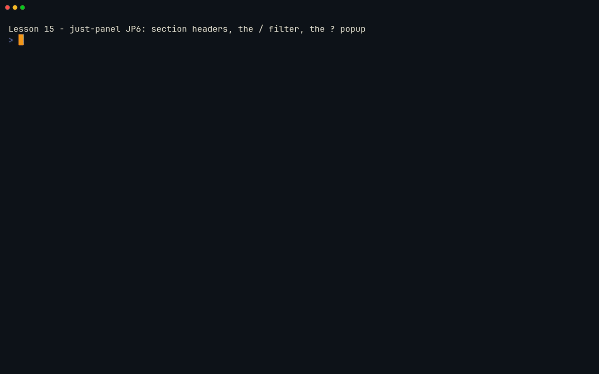
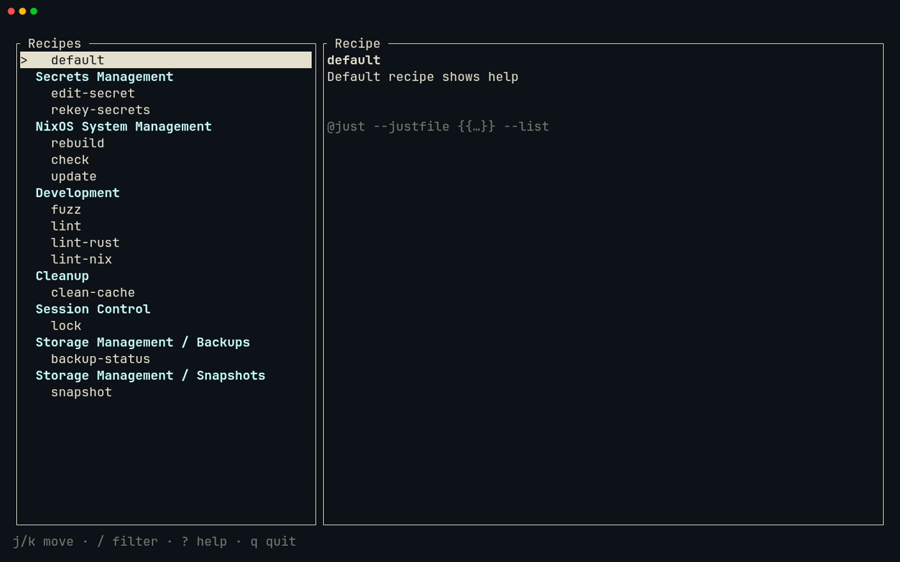
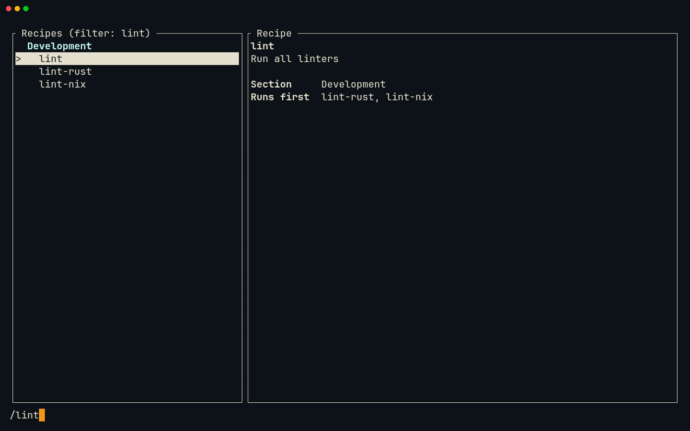
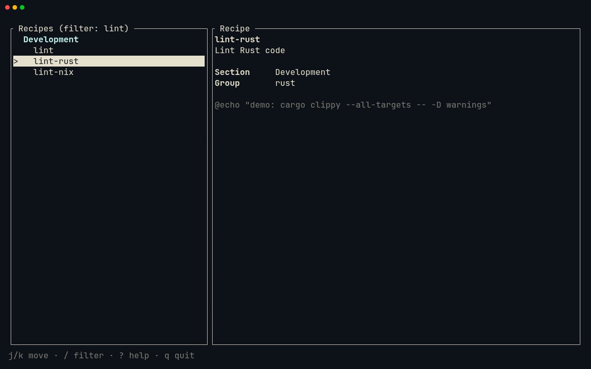
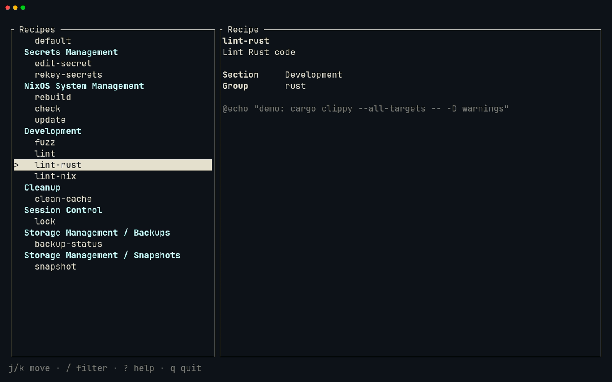
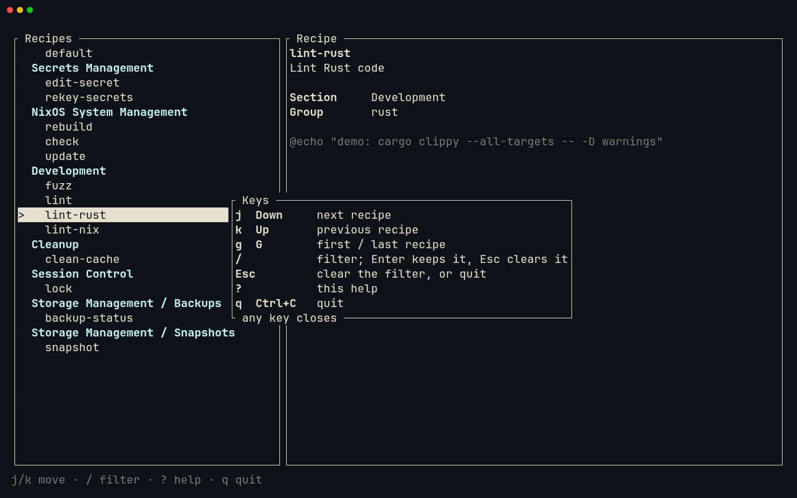

# Lesson 15 — just-panel: sections and filter

**Last Updated**: 27/09/2026
**Version**: 1.0.0
**Maintained By**: Development Team
**Language**: British English (en_GB)
**Timezone**: Europe/London

---

At JP5 the panel is one flat run of names: 14 on the demo justfile, 131 on the real one. This lesson makes it
navigable. The banner parser from lesson 11 puts a header over each section, `/` narrows the list as you type,
and `?` opens a popup that lists the keys. To do that the panel becomes *modal*, with Normal, Filter and Help
modes, which is Neovim's own idea in miniature. On the Neovim side you rework two files in place: Aerial's outline
to find your way round `app.rs`, `grr` to list call sites, `V$%p` to swap a whole function for a new one,
`<leader>ca` to add imports, `ci"` with format-on-save to change a line, gitsigns to walk your changes and
Diffview to review them. The milestone ends with a commit tagged `course/jp6`, so you can diff against and return
to this milestone later.

**Part**: 6 — Build just-panel · **Time**: ~100 min · **Previous**: [Lesson 14 — just-panel: TUI skeleton](14-JUST-PANEL-TUI-SKELETON.md) · **Next**: [Lesson 16 — just-panel: running recipes](16-JUST-PANEL-RUNNING-RECIPES.md)

## Objectives

- Model a list in which not every row can be selected (section headers and recipes), and keep the selection on
  recipes.
- Route keys by mode, and give Esc a meaning in each mode.
- Rebuild the visible rows from a filter, and keep the selection when it still matches.
- Draw a popup (`Clear`, a centred `Rect`, a width measured from its lines), place a real cursor with
  `set_cursor_position`, and keep a header in view with `scroll_padding`.
- Find your way round a file with Aerial (`<leader>o`, where `<leader>` is Space) and `grr`, replace a function
  with `V$%p`, import with `<leader>ca`, and change a string with `ci"`.
- Walk your changes with gitsigns, review them in Diffview, and commit and tag JP6 as `course/jp6`.

## Before you start

- You have finished [Lesson 14](14-JUST-PANEL-TUI-SKELETON.md): JP5 is committed and tagged.

  ```bash
  # in ~/Repos/personal/nix-config
  git tag --list 'course/*'
  git status --short rust/
  ```

  The first command lists `course/jp5`; the second prints nothing.
- The crate passes its checks:

  ```bash
  # in ~/Repos/personal/nix-config/rust
  cargo test -p just-panel
  cargo clippy -p just-panel --all-targets -- -D warnings
  cargo fmt -p just-panel --check
  ```

  Expect `test result: ok. 12 passed`, plus the tests you kept in lesson 13 (16 if you kept all four), and
  silence from the other two.
  The fixtures in `rust/just-panel/tests/fixtures/` do not change in this lesson.
- Start Neovim from a Kitty terminal (`SUPER + RETURN`, then `SUPER + 0`: new windows open on workspace 10),
  with the two files you change side by side:

  ```bash
  # in a Kitty terminal
  cd ~/Repos/personal/nix-config/rust && nvim -O just-panel/src/app.rs just-panel/src/ui.rs
  ```

  `-O` opens each file in its own window, side by side: `app.rs` on the left, `ui.rs` on the right. Starting from
  zsh gives Neovim the repo's dev shell, as in lesson 14.

## Keys in this lesson

`<leader>` is Space. The panel's own keys are in a separate table in step 4.

| Keys | Mode | Action | Where it comes from |
|---|---|---|---|
| `<leader>o` | n | Toggle the Aerial outline on the left; the cursor moves into it | config (neovim.nix:26) |
| `{` / `}`, `<CR>`, `q` | n (Aerial) | Previous / next symbol, jump to it, close the outline | aerial default |
| `<C-h>` / `<C-l>` | n | Window left / right (inside Aerial, `<C-j>`/`<C-k>` scroll instead) | config (neovim.nix:68, :71) |
| `ggVGp` | n | Replace the whole buffer with the clipboard | Neovim default (`clipboard=unnamedplus`, neovim.nix:257) |
| `V$%` then `p` | n, v | From a `fn` line: select the whole function (`$` to its `{`, `%` to the matching `}`), then put the clipboard over it | Neovim default |
| `V2j$%` | n, v | The same, starting two doc-comment lines above the `fn` line | Neovim default |
| `/{text}<CR>`, `<leader>h` | n | Search; clear the search highlight afterwards | Neovim default; config (neovim.nix:66) |
| `ci"` | n | Change the text between the quotes | Neovim default |
| `<C-s>` | n | Save; rustfmt reformats Rust on save | config (neovim.nix:64; format on save :974-977) |
| `]d` / `[d` | n | Next / previous diagnostic, with a float | config (LSP buffer-local, neovim.nix:353-354) |
| `<leader>ca` | n | Code action: here, import the name under the cursor | config (LSP buffer-local, neovim.nix:352) |
| `gra` | n | Code action, the built-in way (still there after Diffview) | Neovim 0.12 default |
| `grr` | n | References into the quickfix list | Neovim 0.12 default |
| `]q` / `[q`, `:cclose` | n, c | Next / previous quickfix entry; close the list | Neovim 0.12 default; Neovim default |
| `K` | n | Hover documentation | config (LSP buffer-local, neovim.nix:344) |
| `:Gitsigns nav_hunk next` | c | Jump to the next change against the last commit | gitsigns default |
| `:Gitsigns preview_hunk` | c | Show a change's old and new lines in a float | gitsigns default |
| `@:` | n | Repeat the last command line | Neovim default |
| `:` then `<Up>` | c | Recall the most recent command line that starts with what you have typed | Neovim default |
| `:TermExec cmd="…" go_back=0` | c | Run a command in the first ordinary terminal and leave the cursor there | toggleterm default |
| `<C-\><C-n>`, `i` | t, n | Leave Terminal mode; go back into it | Neovim default |
| `<C-x>` / `<C-a>` | n | Subtract / add 1 to the number under or after the cursor | Neovim default |
| `<leader>xx` | n | Trouble: every diagnostic | config (neovim.nix:55) |
| `<leader>gd` / `<leader>gq` | n | Open / close Diffview | config (neovim.nix:36-37) |
| `<Tab>` / `<S-Tab>`, `]c` / `[c` | n (Diffview) | Next / previous file; next / previous change | diffview default; Neovim default |
| `<leader>gg`, `s`, `c` `c`, `<c-c><c-c>`, `q` | n (Neogit) | Status, stage, commit popup then Commit, make the commit, close | config (neovim.nix:35); neogit default |

## Walkthrough

JP6 changes two files: `app.rs` (Listing 1) and `ui.rs` (Listing 2), both in the
[Milestone](#milestone-jp6-headers-filter-and-help) section. You replace `app.rs` in one go and then read what
changed; `ui.rs` you edit in place, one function at a time, which is where most of the Neovim technique is.

> **Tip:** as in lesson 14, paste code rather than typing it. Copy a block from the rendered page; the steps say
> what to select before `p` puts it over the selection. `clipboard=unnamedplus` (neovim.nix:257) makes the
> system clipboard the default register, and the text you replace goes into it, so copy each block afresh.

### 1. Where JP6 is going: rows and modes

Two ideas carry the milestone.

**Rows are not entries.** `entries` stays what it was at JP5: every public recipe, in source order, with its
section. What the list shows becomes a separate `Vec<Row>`: a header wherever the section changes, then the
recipes under it. The selection is an index into the rows, so it must never rest on a header. An excerpt from
Listing 1:

```rust
/// One line of the recipe list.
#[derive(Debug, PartialEq, Eq)]
pub enum Row {
    /// A section's title. The selection never rests on one.
    Header(String),
    /// A recipe, as an index into `App::entries`.
    Recipe(usize),
}

/// What the keys do at the moment.
#[derive(Debug, PartialEq, Eq)]
pub enum Mode {
    /// Moving around the list.
    Normal,
    /// Typing a filter after `/`.
    Filter,
    /// The `?` popup is open.
    Help,
}
```

**Modes.** The same key means different things at different times, so `App` gets a `mode`, and `handle_key` asks
the mode before it asks the key:

- **Normal**: `j`/`k`/`g`/`G` move, `/` enters Filter, `?` opens Help, `q` quits, and Esc first clears a kept
  filter, then quits.
- **Filter**: printable keys and Backspace edit the filter and the list updates at once; Enter keeps the filter
  and returns to Normal; Esc clears it and returns to Normal.
- **Help**: any key closes the popup and returns to Normal.

**Try it.** In `app.rs` (the left window), `<leader>o` opens Aerial's outline on the left edge, with the cursor
in it: `Entry`, `Action`, `App` and the functions inside `impl App`. `}` and `{` step from symbol to symbol, and
`<CR>` jumps to the one under the cursor. Look at `selectable` this way, then `<leader>o` again (or `q` from
inside the outline) to close it. The outline is JP5's for now; it grows in step 2.

> **Gotcha:** inside the Aerial window `<C-j>` and `<C-k>` scroll the outline instead of moving between windows.
> `<C-l>` still takes you back to the code.

### 2. `app.rs`: replace it, then read what changed

Put Listing 1 into `app.rs`: `ggVGp` in the left window, then `<C-s>`.

Signs appear in the sign column: gitsigns compares the buffer with your JP5 commit. Walk the changes from the top:
`gg`, then `:Gitsigns nav_hunk next`, then `@:` to repeat it for each following change. Where you want to see what
JP5 had, `:Gitsigns preview_hunk` shows the old and new lines in a float (move the cursor to close it); after that,
type the `nav_hunk` command once more, because `@:` would now repeat the preview. These are the changes, in the
order you meet them.

**`Entry::matches`.** `use std::ops::Range;` goes, and `Entry` gains `matches`: the filter matches the recipe's
name or its description, lower-cased on both sides, so `/btrfs` finds "Create BTRFS snapshot".

**`Row` and `Mode`**, as in step 1. `App` gains the fields `rows`, `mode` and `filter`, and `App::new` ends with
`refresh()` instead of `select_first()`.

**`selected()`** now goes through `selected_index()`, which turns the selected row into an index into `entries`,
and returns `None` when the selection is not on a recipe.

**`handle_key`** keeps its Ctrl+C and Ctrl/Alt checks, then hands the key to the current mode. An excerpt from
Listing 1:

```rust
    /// Updates the state for one key press.
    pub fn handle_key(&mut self, key: KeyEvent) -> Option<Action> {
        // In raw mode Ctrl+C arrives as an ordinary key press rather than as
        // a signal, so quitting on it is up to us.
        if key.modifiers.contains(KeyModifiers::CONTROL) && key.code == KeyCode::Char('c') {
            return Some(Action::Quit);
        }
        // Other keys count only without Ctrl or Alt: crossterm reports
        // Ctrl+Q as a `q` with the CONTROL modifier, and Ctrl+Q is not `q`.
        let ctrl_or_alt = KeyModifiers::CONTROL | KeyModifiers::ALT;
        if key.modifiers.intersects(ctrl_or_alt) {
            return None;
        }
        match self.mode {
            Mode::Normal => return self.normal_key(key),
            Mode::Filter => self.filter_key(key),
            // Any key closes the help.
            Mode::Help => self.mode = Mode::Normal,
        }
        None
    }

    fn normal_key(&mut self, key: KeyEvent) -> Option<Action> {
        match key.code {
            KeyCode::Char('q') => return Some(Action::Quit),
            // Esc backs out of a kept filter before it quits.
            KeyCode::Esc if !self.filter.is_empty() => {
                self.filter.clear();
                self.refresh();
            }
            KeyCode::Esc => return Some(Action::Quit),
            KeyCode::Char('j') | KeyCode::Down => self.select_next(),
            KeyCode::Char('k') | KeyCode::Up => self.select_previous(),
            KeyCode::Char('g') => self.select_first(),
            KeyCode::Char('G') => self.select_last(),
            KeyCode::Char('/') => self.mode = Mode::Filter,
            KeyCode::Char('?') => self.mode = Mode::Help,
            _ => {}
        }
        None
    }
```

The Ctrl/Alt rule from JP5 now protects the filter as well: without it, Ctrl+U would type a `u` into it.

**`filter_key`**: Enter keeps the filter, Esc clears it, Backspace deletes a character, and any other character
is added. Each edit calls `refresh`.

**`refresh`** rebuilds the rows, and it is the heart of the milestone. An excerpt from Listing 1:

```rust
    /// Rebuilds the rows from the filter: matching recipes in source order,
    /// with each section's title above its first match. The selection stays
    /// on the same recipe if it still matches, and moves to the first match
    /// if not.
    fn refresh(&mut self) {
        let selected = self.selected_index();
        let filter = self.filter.to_lowercase();
        self.rows.clear();
        let mut section = None;
        for (index, entry) in self.entries.iter().enumerate() {
            if !entry.matches(&filter) {
                continue;
            }
            if entry.section.as_deref() != section {
                section = entry.section.as_deref();
                if let Some(title) = section {
                    self.rows.push(Row::Header(title.to_string()));
                }
            }
            self.rows.push(Row::Recipe(index));
        }

        let row =
            selected.and_then(|index| self.rows.iter().position(|row| *row == Row::Recipe(index)));
        match row {
            Some(row) => self.list.select(Some(row)),
            None => self.select_first(),
        }
    }
```

A header goes in only when a matching recipe's section differs from the previous one, so a section with no match
disappears with its header, and the recipes above the first banner (`default`) get none. The selection follows
the recipe, not the row number: if the selected recipe still matches it stays selected, wherever its row has
moved to; if not, the first match is selected.

**`selectable`** now yields only the rows that hold a recipe, so the four `select_*` helpers from JP5, unchanged,
skip headers. An excerpt from Listing 1:

```rust
    /// The rows the selection may rest on: recipes, never headers.
    ///
    /// Moving is done by hand rather than with `ListState::select_next` and
    /// friends: those do not know how long the list is until it is drawn, so
    /// until then `selected()` could point past the last recipe.
    fn selectable(&self) -> impl DoubleEndedIterator<Item = usize> + '_ {
        self.rows
            .iter()
            .enumerate()
            .filter_map(|(row, kind)| matches!(kind, Row::Recipe(_)).then_some(row))
    }
```

**Try it.**

1. Put the cursor on `refresh` in `fn refresh` and press `grr`. The quickfix list opens at the bottom with every
   use: the call at the end of `App::new`, the one in `normal_key` (Esc with a filter set), and three in
   `filter_key` (Esc, Backspace, a character), and possibly the definition itself. `]q` and `[q` walk them;
   `:cclose` closes the list.
2. `K` on `then_some` in `selectable` shows the standard library's documentation: it turns `true` into
   `Some(row)` and `false` into `None`, which is exactly what `filter_map` wants.
3. `<leader>o` again: the outline now has `Row`, `Mode`, `normal_key`, `filter_key`, `refresh` and
   `selected_index`.

**What you should see:** the crate still builds, with no new errors or warnings in Trouble, because `ui.rs`
only uses things JP5 already had.

> **Gotcha:** do not run the panel between steps 2 and 3. The selection now counts header rows, but JP5's
> `ui.rs` still draws one row per entry, with no headers, so the highlight lands on the wrong recipe.

### 3. `ui.rs`: edit it in place, one function at a time

`<C-l>` to the right-hand window. Each change below replaces one piece of JP5's `ui.rs` with the matching piece
of Listing 2. The pattern is always the same: copy the new code from this page, get the cursor to the first line of the old
code, select to the end of the function, and `p`.

**3a. The status line, and the help popup after it.** Copy the block below first. Then `/fn render_status` and
`<CR>` puts the cursor on the function's first line. `V$%` selects the whole function: `V` starts a linewise
selection, `$` moves to the `{` at the end of the line, and `%` jumps to the matching `}`. `p` puts the block over
the selection:

```rust
fn render_status(frame: &mut Frame, area: Rect, app: &App) {
    if app.mode == Mode::Filter {
        let line = Line::from(format!("/{}", app.filter));
        // A visible cursor after the text shows that typing goes here.
        frame.set_cursor_position((area.x + line.width() as u16, area.y));
        frame.render_widget(line, area);
        return;
    }
    let hints = "j/k move · / filter · ? help · q quit";
    frame.render_widget(Line::from(hints).dim(), area);
}

/// The keys, as the `?` popup lists them.
const KEYS: &[(&str, &str)] = &[
    ("j  Down", "next recipe"),
    ("k  Up", "previous recipe"),
    ("g  G", "first / last recipe"),
    ("/", "filter; Enter keeps it, Esc clears it"),
    ("Esc", "clear the filter, or quit"),
    ("?", "this help"),
    ("q  Ctrl+C", "quit"),
];

fn render_help(frame: &mut Frame) {
    let lines: Vec<Line> = KEYS.iter().map(|(keys, what)| field(keys, what)).collect();
    // As wide as the longest line, plus the border on each side.
    let width = lines.iter().map(Line::width).max().unwrap_or_default() + 2;
    let area = popup(frame.area(), width as u16, lines.len());
    let help = Paragraph::new(lines).block(
        Block::bordered()
            .title(" Keys ")
            .title_bottom(" any key closes "),
    );
    // Blank the cells underneath first, or the list shows through the gaps.
    frame.render_widget(Clear, area);
    frame.render_widget(help, area);
}

/// A centred area `width` columns wide and tall enough for `lines` lines
/// inside a border.
fn popup(area: Rect, width: u16, lines: usize) -> Rect {
    let height = Constraint::Length(lines as u16 + 2);
    area.centered(Constraint::Length(width), height)
}
```

What it does:

- In Filter mode the status line shows `/` and the filter, and `frame.set_cursor_position` puts a real cursor after
  the text. ratatui hides the cursor on every frame that does not set one, so the cursor only appears while you
  are typing a filter.
- `KEYS` is the help text as data, and `render_help` turns it into lines with the same `field()` as the detail
  pane. The popup is as wide as its longest line plus the two border columns. The first draft of this code
  hard-coded 48 columns; the `/` row needs 49 inside the border, and lost the "it" of "Esc clears it" without any
  test noticing.
- `popup()` asks `Rect::centered` for an area of that width and tall enough for the lines plus the border.
- `Clear` blanks the cells under the popup first. Without it the list would show through wherever the popup's
  text does not cover a cell.

Trouble (`<leader>xx`) now shows errors, among them that `Clear` and `Mode` cannot be found, and that `render`
calls `render_status` with two arguments where it now takes three. The next two edits fix them.

**3b. Import with a code action.** Put the cursor on `Clear` in `frame.render_widget(Clear, area);` and press
`<leader>ca`. Neovim lists the code actions as a numbered menu: type the number of the import from
`ratatui::widgets` and press `<CR>`. There may be another `Clear` on offer, from crossterm's terminal module; that
one is a terminal command, not a widget. Then do the same on `Mode` in `app.mode == Mode::Filter`, choosing the
one from `crate::app`.

The two import lines should now read exactly as in Listing 2, apart from `Row`, which comes in 3d:

```rust
use ratatui::widgets::{Block, Clear, List, ListItem, Paragraph, Wrap};
```

```rust
use crate::app::{App, Entry, Mode};
```

rust-analyzer normally adds the name to the existing `use` line, in the style the file already uses (verify on
laptop-intel). If a line comes out differently, edit it by hand to match.

**3c. `render`, with its doc comment.** Copy the block below. `/Draws the whole` and `<CR>` puts the cursor on
the first line of `render`'s doc comment. `V2j$%` selects from there to the end of the function: `2j` goes down to
the `fn` line, then `$` and `%` as before. Then `p`:

```rust
/// Draws the whole screen: the recipes on the left, the selected recipe on
/// the right, a status line along the bottom, and the help popup over the
/// top when it is open.
pub fn render(frame: &mut Frame, app: &mut App) {
    let [main, status] =
        Layout::vertical([Constraint::Min(0), Constraint::Length(1)]).areas(frame.area());
    let [list, detail] =
        Layout::horizontal([Constraint::Percentage(35), Constraint::Min(0)]).areas(main);
    render_list(frame, list, app);
    render_detail(frame, detail, app.selected());
    render_status(frame, status, app);
    if app.mode == Mode::Help {
        render_help(frame);
    }
}
```

The popup is drawn last, so it lands on top: in immediate mode, whatever is drawn later in a frame overwrites the
cells drawn before it.

**3d. `render_list`.** Copy the block below, then `/fn render_list`, `<CR>`, `V$%` and `p`:

```rust
fn render_list(frame: &mut Frame, area: Rect, app: &mut App) {
    let items: Vec<ListItem> = app
        .rows
        .iter()
        .map(|row| match row {
            Row::Header(title) => ListItem::new(Line::from(title.as_str()).bold().cyan()),
            Row::Recipe(index) => ListItem::new(format!("  {}", app.entries[*index].recipe.name)),
        })
        .collect();
    let title = if app.filter.is_empty() {
        " Recipes ".to_string()
    } else {
        format!(" Recipes (filter: {}) ", app.filter)
    };
    let list = List::new(items)
        .block(Block::bordered().title(title))
        .highlight_style(Style::new().reversed())
        .highlight_symbol("> ")
        // Keep a row of context above and below the selection while
        // scrolling, so the header over a section's first recipe stays in view.
        .scroll_padding(1);
    frame.render_stateful_widget(list, area, &mut app.list);
}
```

The list is now built from `rows`: a header is its title in bold cyan, and a recipe is its name indented by two
spaces, so recipes sit visibly under their header. The title shows the filter while one is set.
`.scroll_padding(1)` is step 5's story.

`Row` is now unknown in this file: `<leader>ca` on it, and this time choose `crate::app::Row`. ratatui has a `Row`
too, for tables, and the menu may offer it as well. The line becomes:

```rust
use crate::app::{App, Entry, Mode, Row};
```

**3e. The empty-list message.** `/No recipes` and `<CR>` puts the cursor inside the string. `ci"` deletes the text
between the quotes and leaves you in Insert mode: type `No recipe matches the filter`, press `<Esc>`, then
`<C-s>`. On save, rustfmt spreads the call over four lines, exactly as Listing 2 has it, because its arguments are
now too long for one line by rustfmt's rules. You changed the words; the formatter did the layout.

Press `<leader>h` to clear the search highlight.

**What you should see:** `<leader>xx` shows nothing under `just-panel`, and `ui.rs` matches Listing 2 line for
line. If anything differs and you cannot see why, replace
the whole file with Listing 2 (`ggVGp`, `<C-s>`).

### 4. Run it

```vim
:TermExec cmd="cargo run -p just-panel -- -f ../docs/NEOVIM-COURSE/fixtures/just/justfile" go_back=0
```

You typed this in lesson 14, so let the command-line history type it for you: `:TermE`, then `<Up>` recalls the
last command that starts that way (Neovim keeps the history between sessions), and `<CR>` runs it. If your keys
then move a cursor over the terminal's text rather than the panel's selection, press `i`.



[MP4](../media/15-just-panel-sections-and-filter/15-just-panel-sections-and-filter.mp4)

**What you should see:** the recipes now sit under their sections: `Secrets Management`, `NixOS System
Management`, `Development`, `Cleanup`, `Session Control`, and the two sub-sections `Storage Management / Backups`
and `Storage Management / Snapshots`. `default` comes first with no header, because it sits above the first
banner. The bottom row reads `j/k move · / filter · ? help · q quit`.



The panel's keys at JP6:

| Mode | Key | What the panel does |
|---|---|---|
| Normal | `j` / Down, `k` / Up | Next / previous recipe; headers are skipped |
| Normal | `g` / `G` | First / last recipe |
| Normal | `/` | Filter mode, editing the current filter |
| Normal | `?` | The help popup |
| Normal | Esc | Clear a kept filter; with no filter, quit |
| Normal | `q`, Ctrl+C | Quit |
| Filter | characters, Backspace | Edit the filter; the list follows every key |
| Filter | Enter | Keep the filter, back to Normal |
| Filter | Esc | Clear the filter, back to Normal |
| Help | any key | Close the popup |
| any | Ctrl with any key but `c`, Alt with any key | Nothing |

**Try it.**

1. `j`: the selection jumps from `default` over the `Secrets Management` header to `edit-secret`.
2. `/`: the bottom row shows `/` with a cursor after it. Type `lint` slowly and watch the list shrink with each
   letter, down to the `Development` header and `lint`, `lint-rust` and `lint-nix`. The title reads
   ` Recipes (filter: lint) `.

   

3. Ctrl+U: nothing is typed into the filter.
4. `<CR>`: the filter stays in the title and the key hints come back. `j` moves to `lint-rust`, whose details
   include `Group       rust`.

   

5. `<Esc>`: the filter is cleared, every section is back, and `lint-rust` is still the selected recipe.

   

6. `?`: the popup opens over the list. Its longest line, `/` followed by
   `filter; Enter keeps it, Esc clears it`, is whole. `<Esc>` closes it without quitting.

   

7. `/zzz`: no recipe matches, the list is empty and the detail pane says `No recipe matches the filter`.
   `<Esc>` brings everything back.
8. `q`.

> **Gotcha:** in Neovim's terminal, `/`, `?` and Esc reach the panel only in Terminal mode. If the terminal buffer
> is in Normal mode, `/` and `?` start a Neovim search through the terminal's text instead (you see the `/` at
> the very bottom of Neovim, not in the panel's status line). `<Esc>` cancels that search; then `i`, and try again.

### 5. The header that scrolled away: `scroll_padding(1)`

The demo justfile is too short to show this; the real one is not. In the terminal:

```bash
# in ~/Repos/personal/nix-config/rust
cargo run -p just-panel
```

That loads the nix-config justfile through `JUST_JUSTFILE`, read-only, as in lesson 14. Press `G` (the last
recipe, `gen-hardware`), then type `/vpn`: the list shrinks to the `VPN Management (Phase 6: Wireguard + Mullvad)`
section, and its header sits above `vpn-init`. `q`.

Now take the padding away and look again:

1. `<C-\><C-n>`, then `<C-k>` up to the code (and `<C-l>` if you land in `app.rs`). In `ui.rs`, search
   `/scroll_padding` and `<CR>`.
2. `<C-x>` turns the `1` into `0`. `<C-s>`.
3. Back in the terminal (`<C-j>`, then `i`), run the same `cargo run -p just-panel`, then `G` and `/vpn` again.
   This time the list starts at `vpn-init`: the header is out of view above it. `q`.
4. Back in `ui.rs`, `<C-a>` on the `0` puts the `1` back. `<C-s>`.

The `ListState` remembers its scroll offset between frames. After `G` it is far down the list. When the filter
shrinks the list, ratatui pulls the offset back only as far as it must to keep the selected row on screen, which
leaves the selection on the top row and its header just above it, off screen. `scroll_padding(1)` asks for one
row of context above and below the selection, and that row is the header. The bug was found exactly like this,
against the real justfile.

### 6. Check, review, commit

`:wa`. Run the checks from [Check it](#check-it) in the terminal. Then review the whole milestone before you
commit it:

1. `<leader>gd` opens Diffview in a new tab: the file panel lists `app.rs` and `ui.rs`, and the diff of the first
   is beside it. `]c` and `[c` move between changes inside a diff, `<Tab>` and `<S-Tab>` between files.
2. Read both diffs. This is the view to catch a stray edit, such as a whitespace change you did not mean.
3. `<leader>gq` closes Diffview.

> **Gotcha:** Diffview puts its own buffer-local maps on the files it shows, including `<leader>ca` (for merge
> conflicts), and deletes them when it closes. Your LSP `<leader>ca` does not come back in those buffers. Use
> `gra`, Neovim's own code-action key, for the rest of the session.

Then commit and tag as the Milestone section describes.

## Gotchas in this config

- **Terminal mode decides who gets `/`, `?` and Esc.** In Terminal mode they go to the panel; in the terminal
  buffer's Normal mode `/` and `?` are Neovim searches, and Esc never takes you out of Terminal mode (it quits the
  panel when no filter is kept). `<C-\><C-n>` is the way out.
- **`/` with a kept filter edits it**, rather than starting a new one: the status line shows the old text after
  the `/`.
- **The import code action offers look-alikes.** ratatui has a `Row` (for tables) and crossterm a `Clear` (a
  terminal command). Pick `crate::app::Row` and `ratatui::widgets::Clear`, and check the `use` lines against
  Listing 2 afterwards.
- **`V$%` needs the `{` at the end of the `fn` line.** Every function in `ui.rs` is written that way. On a
  signature that rustfmt has split over several lines, `$` would land on a `,` and `%` would match the wrong
  thing: select with `V` and `j` instead.
- **`@:` repeats the last command line, whatever it was.** After a `:Gitsigns preview_hunk`, `@:` previews again;
  type the `nav_hunk` command once more.
- **`gr` waits.** Your buffer-local `gr` (neovim.nix:343) is a prefix of Neovim's `grr`, `grn` and friends, so it
  fires only after `timeoutlen` (300 ms, neovim.nix:270). `grr` fires at once.
- **Diffview removes `<leader>ca`** from the buffers it showed (lesson 12). `gra` does the same job.
- **Aerial shadows `<C-j>`/`<C-k>`** inside its window; `q` closes it.
- **Do not run the panel half-way through** (between steps 2 and 3): rows and drawing disagree until `ui.rs`
  catches up.

## Drills

1. What does Esc do in each of the panel's modes?
   <details><summary>Answer</summary>

   Normal with a kept filter: clears the filter and stays open. Normal with no filter: quits. Filter: clears the
   filter and returns to Normal. Help: closes the popup, like any other key. (And in Neovim's terminal, Esc never
   leaves Terminal mode; it always goes to the panel.)
   </details>

2. You type `/snap`, `<CR>`, then `/` again and Backspace four times. What does the screen show, and which recipe
   is selected?
   <details><summary>Answer</summary>

   The second `/` edits the kept filter, so the status line showed `/snap`; four Backspaces empty it. The status
   line shows just `/`, the title is ` Recipes ` again, and every section is back. `snapshot` stays selected,
   because it still matches the (now empty) filter. `<CR>` or Esc returns to Normal mode.
   </details>

3. Use Aerial to jump to `filter_key` in `app.rs`, and come back to where you were.
   <details><summary>Answer</summary>

   `<leader>o`, then `}` (or `j`) until `filter_key` is under the cursor, `<CR>` to jump. `<C-o>` takes you back.
   `<leader>o` closes the outline.
   </details>

4. JP5's `selectable` returned `0..self.entries.len()`. Why does JP6's return an iterator over `rows` instead?
   <details><summary>Answer</summary>

   Not every row can be selected any more: headers sit between the recipes. The iterator yields only the row
   numbers of `Row::Recipe` rows, so `select_next`, `select_previous`, `select_first` and `select_last` skip
   headers without any change of their own.
   </details>

5. Which recipe's description mentions BTRFS? Find it with the panel.
   <details><summary>Answer</summary>

   `/btrfs`: the filter matches descriptions as well as names, and lower-cases both sides, so it finds
   `snapshot` ("Create BTRFS snapshot") under `Storage Management / Snapshots`.
   </details>

6. Why is the help popup's width computed from its lines rather than written down?
   <details><summary>Answer</summary>

   A fixed width goes wrong silently. The first draft used 48 columns; the `/` row needs 49 inside the border,
   so "Esc clears it" lost its last word and no test noticed. Measuring with `Line::width` keeps the popup right
   when the text changes.
   </details>

7. In Neovim's terminal you press `/` and a `/` appears at the very bottom of Neovim, not in the panel. What
   happened, and how do you recover?
   <details><summary>Answer</summary>

   The terminal buffer was in Normal mode, so `/` started a Neovim search. `<Esc>` cancels it, `i` enters
   Terminal mode, and the next `/` reaches the panel.
   </details>

## Milestone JP6: headers, filter and help

**Goal:** the panel shows each section's title over its recipes and never selects a title; `/` filters by name or
description as you type, Enter keeps the filter and Esc clears it while keeping the selection; `?` shows the keys
in a centred popup that any key closes; in Normal mode Esc clears a kept filter before it quits. Committed and
tagged `course/jp6`.

### Steps

1. Listing 1 into `app.rs`, then walk the changes (walkthrough step 2).
2. `ui.rs` edited in place into Listing 2, with three imports from code actions (step 3).
3. Run it on the demo justfile and on the real one (steps 4 and 5).
4. Check, review in Diffview, commit and tag (step 6 and below).

### Listing 1: src/app.rs

```rust
//! The panel's state, and what each key press does to it.
//!
//! Nothing in here draws or touches the terminal: `handle_key` only changes
//! the state and tells the event loop what to do next. That keeps every key
//! testable without a terminal (lesson 17).

use std::collections::BTreeMap;

use ratatui::crossterm::event::{KeyCode, KeyEvent, KeyModifiers};
use ratatui::widgets::ListState;

use crate::justfile::Recipe;
use crate::sections::Section;

/// A recipe, and the banner it sits under in the justfile.
#[derive(Debug)]
pub struct Entry {
    pub section: Option<String>,
    pub recipe: Recipe,
}

impl Entry {
    /// Whether the name or description contains `filter`, which must already
    /// be lower case.
    fn matches(&self, filter: &str) -> bool {
        let doc = self.recipe.doc.as_deref().unwrap_or_default();
        self.recipe.name.to_lowercase().contains(filter) || doc.to_lowercase().contains(filter)
    }
}

/// One line of the recipe list.
#[derive(Debug, PartialEq, Eq)]
pub enum Row {
    /// A section's title. The selection never rests on one.
    Header(String),
    /// A recipe, as an index into `App::entries`.
    Recipe(usize),
}

/// What the keys do at the moment.
#[derive(Debug, PartialEq, Eq)]
pub enum Mode {
    /// Moving around the list.
    Normal,
    /// Typing a filter after `/`.
    Filter,
    /// The `?` popup is open.
    Help,
}

/// What the event loop should do after a key press.
#[derive(Debug, PartialEq, Eq)]
pub enum Action {
    Quit,
}

/// Everything the panel knows and shows.
pub struct App {
    /// Every public recipe, in source order.
    pub entries: Vec<Entry>,
    /// The list as shown: recipes that match the filter, under their
    /// section headers.
    pub rows: Vec<Row>,
    /// The selected row, and how far the list has scrolled. ratatui updates
    /// the scroll offset while drawing, so this has to outlive a frame.
    pub list: ListState,
    pub mode: Mode,
    /// Text that a recipe's name or description must contain, in any case.
    pub filter: String,
}

impl App {
    /// Puts the recipes from `just --dump` into the order and sections of the
    /// justfile's source, leaving out private ones as `just --list` does.
    pub fn new(recipes: Vec<Recipe>, sections: Vec<Section>) -> Self {
        let mut by_name: BTreeMap<String, Recipe> = recipes
            .into_iter()
            .filter(|recipe| !recipe.private)
            .map(|recipe| (recipe.name.clone(), recipe))
            .collect();
        let mut entries = Vec::new();
        for section in sections {
            for name in section.recipes {
                if let Some(recipe) = by_name.remove(&name) {
                    let section = section.title.clone();
                    entries.push(Entry { section, recipe });
                }
            }
        }
        // Anything the banner parser missed (a recipe from an `import`, say)
        // still belongs in the panel, so list it last rather than drop it.
        entries.extend(by_name.into_values().map(|recipe| Entry {
            section: Some("Other".to_string()),
            recipe,
        }));

        let mut app = Self {
            entries,
            rows: Vec::new(),
            list: ListState::default(),
            mode: Mode::Normal,
            filter: String::new(),
        };
        app.refresh();
        app
    }

    /// The selected recipe; `None` when no recipe matches the filter.
    pub fn selected(&self) -> Option<&Entry> {
        self.selected_index().map(|index| &self.entries[index])
    }

    /// Updates the state for one key press.
    pub fn handle_key(&mut self, key: KeyEvent) -> Option<Action> {
        // In raw mode Ctrl+C arrives as an ordinary key press rather than as
        // a signal, so quitting on it is up to us.
        if key.modifiers.contains(KeyModifiers::CONTROL) && key.code == KeyCode::Char('c') {
            return Some(Action::Quit);
        }
        // Other keys count only without Ctrl or Alt: crossterm reports
        // Ctrl+Q as a `q` with the CONTROL modifier, and Ctrl+Q is not `q`.
        let ctrl_or_alt = KeyModifiers::CONTROL | KeyModifiers::ALT;
        if key.modifiers.intersects(ctrl_or_alt) {
            return None;
        }
        match self.mode {
            Mode::Normal => return self.normal_key(key),
            Mode::Filter => self.filter_key(key),
            // Any key closes the help.
            Mode::Help => self.mode = Mode::Normal,
        }
        None
    }

    fn normal_key(&mut self, key: KeyEvent) -> Option<Action> {
        match key.code {
            KeyCode::Char('q') => return Some(Action::Quit),
            // Esc backs out of a kept filter before it quits.
            KeyCode::Esc if !self.filter.is_empty() => {
                self.filter.clear();
                self.refresh();
            }
            KeyCode::Esc => return Some(Action::Quit),
            KeyCode::Char('j') | KeyCode::Down => self.select_next(),
            KeyCode::Char('k') | KeyCode::Up => self.select_previous(),
            KeyCode::Char('g') => self.select_first(),
            KeyCode::Char('G') => self.select_last(),
            KeyCode::Char('/') => self.mode = Mode::Filter,
            KeyCode::Char('?') => self.mode = Mode::Help,
            _ => {}
        }
        None
    }

    fn filter_key(&mut self, key: KeyEvent) {
        match key.code {
            // Enter keeps the filter and goes back to moving around.
            KeyCode::Enter => self.mode = Mode::Normal,
            KeyCode::Esc => {
                self.mode = Mode::Normal;
                self.filter.clear();
                self.refresh();
            }
            KeyCode::Backspace => {
                self.filter.pop();
                self.refresh();
            }
            KeyCode::Char(c) => {
                self.filter.push(c);
                self.refresh();
            }
            _ => {}
        }
    }

    /// Rebuilds the rows from the filter: matching recipes in source order,
    /// with each section's title above its first match. The selection stays
    /// on the same recipe if it still matches, and moves to the first match
    /// if not.
    fn refresh(&mut self) {
        let selected = self.selected_index();
        let filter = self.filter.to_lowercase();
        self.rows.clear();
        let mut section = None;
        for (index, entry) in self.entries.iter().enumerate() {
            if !entry.matches(&filter) {
                continue;
            }
            if entry.section.as_deref() != section {
                section = entry.section.as_deref();
                if let Some(title) = section {
                    self.rows.push(Row::Header(title.to_string()));
                }
            }
            self.rows.push(Row::Recipe(index));
        }

        let row =
            selected.and_then(|index| self.rows.iter().position(|row| *row == Row::Recipe(index)));
        match row {
            Some(row) => self.list.select(Some(row)),
            None => self.select_first(),
        }
    }

    /// The index into `entries` of the selected recipe.
    fn selected_index(&self) -> Option<usize> {
        match self.list.selected().and_then(|row| self.rows.get(row)) {
            Some(Row::Recipe(index)) => Some(*index),
            _ => None,
        }
    }

    /// The rows the selection may rest on: recipes, never headers.
    ///
    /// Moving is done by hand rather than with `ListState::select_next` and
    /// friends: those do not know how long the list is until it is drawn, so
    /// until then `selected()` could point past the last recipe.
    fn selectable(&self) -> impl DoubleEndedIterator<Item = usize> + '_ {
        self.rows
            .iter()
            .enumerate()
            .filter_map(|(row, kind)| matches!(kind, Row::Recipe(_)).then_some(row))
    }

    fn select_first(&mut self) {
        let first = self.selectable().next();
        self.list.select(first);
    }

    fn select_last(&mut self) {
        let last = self.selectable().next_back();
        self.list.select(last);
    }

    fn select_next(&mut self) {
        let current = self.list.selected();
        let next = self.selectable().find(|&row| Some(row) > current);
        self.list.select(next.or(current));
    }

    fn select_previous(&mut self) {
        let current = self.list.selected();
        let previous = self.selectable().rev().find(|&row| Some(row) < current);
        self.list.select(previous.or(current));
    }
}
```

### Listing 2: src/ui.rs

```rust
//! Drawing the panel with ratatui.
//!
//! Everything here reads the `App` and draws it; the only thing drawing
//! changes is the list's scroll offset, which ratatui keeps in the
//! `ListState`. So a whole screen can be drawn into ratatui's in-memory
//! `TestBackend` and checked in a test (lesson 17).

use ratatui::layout::{Constraint, Layout, Rect};
use ratatui::style::{Style, Stylize};
use ratatui::text::Line;
use ratatui::widgets::{Block, Clear, List, ListItem, Paragraph, Wrap};
use ratatui::Frame;

use crate::app::{App, Entry, Mode, Row};
use crate::justfile::{Parameter, ParameterKind};

/// Draws the whole screen: the recipes on the left, the selected recipe on
/// the right, a status line along the bottom, and the help popup over the
/// top when it is open.
pub fn render(frame: &mut Frame, app: &mut App) {
    let [main, status] =
        Layout::vertical([Constraint::Min(0), Constraint::Length(1)]).areas(frame.area());
    let [list, detail] =
        Layout::horizontal([Constraint::Percentage(35), Constraint::Min(0)]).areas(main);
    render_list(frame, list, app);
    render_detail(frame, detail, app.selected());
    render_status(frame, status, app);
    if app.mode == Mode::Help {
        render_help(frame);
    }
}

fn render_list(frame: &mut Frame, area: Rect, app: &mut App) {
    let items: Vec<ListItem> = app
        .rows
        .iter()
        .map(|row| match row {
            Row::Header(title) => ListItem::new(Line::from(title.as_str()).bold().cyan()),
            Row::Recipe(index) => ListItem::new(format!("  {}", app.entries[*index].recipe.name)),
        })
        .collect();
    let title = if app.filter.is_empty() {
        " Recipes ".to_string()
    } else {
        format!(" Recipes (filter: {}) ", app.filter)
    };
    let list = List::new(items)
        .block(Block::bordered().title(title))
        .highlight_style(Style::new().reversed())
        .highlight_symbol("> ")
        // Keep a row of context above and below the selection while
        // scrolling, so the header over a section's first recipe stays in view.
        .scroll_padding(1);
    frame.render_stateful_widget(list, area, &mut app.list);
}

fn render_detail(frame: &mut Frame, area: Rect, entry: Option<&Entry>) {
    let block = Block::bordered().title(" Recipe ");
    let Some(Entry { section, recipe }) = entry else {
        frame.render_widget(
            Paragraph::new("No recipe matches the filter").block(block),
            area,
        );
        return;
    };

    let mut lines = vec![
        Line::from(recipe.signature()).bold(),
        Line::from(recipe.doc.clone().unwrap_or_default()),
        Line::default(),
    ];
    if let Some(section) = section {
        lines.push(field("Section", section));
    }
    if let Some(group) = recipe.group() {
        lines.push(field("Group", group));
    }
    if !recipe.dependencies.is_empty() {
        let names: Vec<&str> = recipe
            .dependencies
            .iter()
            .map(|dependency| dependency.recipe.as_str())
            .collect();
        lines.push(field("Runs first", &names.join(", ")));
    }
    if let Some(prompt) = recipe.confirm_prompt() {
        lines.push(field("Confirm", &prompt));
    }
    if recipe.needs_sudo() {
        lines.push(Line::from("Uses sudo: expect a password prompt").yellow());
    }
    if !recipe.parameters.is_empty() {
        lines.push(Line::default());
        for parameter in &recipe.parameters {
            lines.push(field(&parameter.name, &describe(parameter)));
        }
    }
    lines.push(Line::default());
    for line in recipe.body_lines() {
        lines.push(line.dim().into());
    }

    let detail = Paragraph::new(lines)
        .block(block)
        .wrap(Wrap { trim: false });
    frame.render_widget(detail, area);
}

fn render_status(frame: &mut Frame, area: Rect, app: &App) {
    if app.mode == Mode::Filter {
        let line = Line::from(format!("/{}", app.filter));
        // A visible cursor after the text shows that typing goes here.
        frame.set_cursor_position((area.x + line.width() as u16, area.y));
        frame.render_widget(line, area);
        return;
    }
    let hints = "j/k move · / filter · ? help · q quit";
    frame.render_widget(Line::from(hints).dim(), area);
}

/// The keys, as the `?` popup lists them.
const KEYS: &[(&str, &str)] = &[
    ("j  Down", "next recipe"),
    ("k  Up", "previous recipe"),
    ("g  G", "first / last recipe"),
    ("/", "filter; Enter keeps it, Esc clears it"),
    ("Esc", "clear the filter, or quit"),
    ("?", "this help"),
    ("q  Ctrl+C", "quit"),
];

fn render_help(frame: &mut Frame) {
    let lines: Vec<Line> = KEYS.iter().map(|(keys, what)| field(keys, what)).collect();
    // As wide as the longest line, plus the border on each side.
    let width = lines.iter().map(Line::width).max().unwrap_or_default() + 2;
    let area = popup(frame.area(), width as u16, lines.len());
    let help = Paragraph::new(lines).block(
        Block::bordered()
            .title(" Keys ")
            .title_bottom(" any key closes "),
    );
    // Blank the cells underneath first, or the list shows through the gaps.
    frame.render_widget(Clear, area);
    frame.render_widget(help, area);
}

/// A centred area `width` columns wide and tall enough for `lines` lines
/// inside a border.
fn popup(area: Rect, width: u16, lines: usize) -> Rect {
    let height = Constraint::Length(lines as u16 + 2);
    area.centered(Constraint::Length(width), height)
}

/// A `label  value` line, with the label in a column of its own.
fn field(label: &str, value: &str) -> Line<'static> {
    Line::from(vec![
        format!("{label:<12}").bold(),
        value.to_string().into(),
    ])
}

/// How to fill a parameter in, e.g. `default "300"` or `required`.
fn describe(parameter: &Parameter) -> String {
    let mut text = match (&parameter.default, parameter.literal_default()) {
        (Some(_), Some(literal)) => format!("default {literal:?}"),
        (Some(_), None) => "has a default".to_string(),
        (None, _) if parameter.kind == ParameterKind::Star => "optional".to_string(),
        (None, _) => "required".to_string(),
    };
    if parameter.is_variadic() {
        text.push_str(", words separated by spaces");
    }
    text
}
```

`main.rs`, `justfile.rs`, `sections.rs`, `runner.rs`, both `Cargo.toml` files, `rust/Cargo.lock` and the fixtures
do not change in JP6.

### Check it

```bash
# in ~/Repos/personal/nix-config/rust
cargo build -p just-panel
cargo test -p just-panel
cargo clippy -p just-panel --all-targets -- -D warnings
cargo fmt -p just-panel --check
```

- The build prints no `warning:` lines.
- `cargo test` prints `test result: ok. 12 passed`, plus your lesson 13 tests. JP6 adds no tests; lesson 17 adds
  them for everything you built here.
- clippy and the format check print nothing.

Then run it once in a full-size Kitty window (the dev layout's bottom-right shell, or `SUPER + RETURN`, then
`SUPER + 0`):

```bash
# in ~/Repos/personal/nix-config/rust
cargo run -p just-panel -- -f ../docs/NEOVIM-COURSE/fixtures/just/justfile
```

- [ ] Section and sub-section headers are shown, for example `Storage Management / Backups`, and `j`/`k`/`g`/`G`
      never stop on one.
- [ ] `/lint` shows `/lint` in the status line; Ctrl+U types nothing.
- [ ] Only the matching recipes and their headers are listed.
- [ ] Enter keeps the filter: ` Recipes (filter: lint) ` in the title, and `j` moves.
- [ ] Esc clears it and the selection stays on the same recipe.
- [ ] `?` opens the popup with its longest line whole (`… Esc clears it`); any key closes it.
- [ ] Everything from lesson 14's list still holds: `_stamp` is hidden, Ctrl+Q does not quit, `q` and Ctrl+C
      do, and the shell works normally afterwards.

### Commit and tag

1. `<leader>gg`. Under Unstaged changes: `rust/just-panel/src/app.rs` and `rust/just-panel/src/ui.rs`, nothing
   else. `s` on each.
2. `c` `c`, and write:

   ```text
   feat(just-panel): section headers, a / filter and a ? help popup

   - app.rs: Row (a section header or a recipe) and Mode (normal,
     filter, help). refresh() rebuilds the rows from the filter, with a
     header over each section's first match, and keeps the selection
     while it still matches. j/k/g/G skip headers, and in normal mode
     Esc clears a kept filter before it quits.
   - ui.rs: bold cyan headers over indented recipes, the filter in the
     list title and in the status line with a real cursor, a centred
     help popup as wide as its longest line, and scroll_padding(1) so
     a section's header stays in view above its first recipe.
   ```

   `<c-c><c-c>`, then `q`.
3. Tag the commit, so you can diff against and return to this milestone later. In the terminal:

   ```bash
   # in ~/Repos/personal/nix-config
   git tag course/jp6
   git log --oneline --decorate -2
   ```

   The newer line ends with `(HEAD -> main, tag: course/jp6)`, the older one with `(tag: course/jp5)`. Both tags
   stay local; do not push.

Stuck? Compare with [examples/just-panel/JP6](../examples/just-panel/JP6/) — see [examples/README.md](../examples/README.md).

## Recap

- `entries` hold the recipes; `rows` hold what the list shows, headers included; the selection lives on rows and
  never on a header.
- A `Mode` enum routes keys: Normal, Filter, Help. Esc means something different in each.
- `refresh()` rebuilds the rows on every filter edit and keeps the selected recipe when it still matches.
- A popup is `Clear` plus a widget in a centred `Rect`, drawn last; its width comes from its lines.
- `set_cursor_position` gives a real cursor for text entry; `scroll_padding(1)` keeps a header above its first
  recipe.
- Neovim: Aerial and `grr` to find your way, gitsigns `nav_hunk` and `@:` to walk changes, `V$%p` to swap a
  function, `<leader>ca` for imports (and `gra` after Diffview), `ci"` and format-on-save, `:` + `<Up>` for
  history.
- JP6 is committed and tagged `course/jp6`.

## Recording

- **Tape:** [`tapes/15-just-panel-sections-and-filter.tape`](../tapes/15-just-panel-sections-and-filter.tape). Run
  it from `docs/NEOVIM-COURSE/` on laptop-intel: `vhs tapes/15-just-panel-sections-and-filter.tape`.
- **What it records:** the worked example [examples/just-panel/JP6](../examples/just-panel/JP6/), not your own
  crate, so it needs no tags and no course progress: record it whenever you like. The hidden setup copies the
  example to `/tmp/nvim-course/15-just-panel-sections-and-filter/rust` with the demo justfile from
  `fixtures/just/` beside it, in the repository's layout, and builds it there into
  `/tmp/nvim-course/cargo-target`, the target directory every capstone tape shares. A fresh copy has fresh file
  times, so cargo rebuilds just-panel rather than reuse another milestone's build; the dependencies are built
  only once. Nothing is written to the repository.
- **VHS:** after `just rebuild`, `vhs --version` must print `0.12.1`; 0.12.0 exits 0 and writes nothing
  ([Appendix B](../appendices/B-RECORDING-WITH-VHS.md#first-make-sure-vhs-is-0121)).
- **Outputs:** `media/15-just-panel-sections-and-filter/15-just-panel-sections-and-filter.gif` and
  `media/15-just-panel-sections-and-filter/15-just-panel-sections-and-filter.mp4`.
- **Screenshots** (all in `media/15-just-panel-sections-and-filter/`):

  | File | Shows | Step |
  |---|---|---|
  | `headers.png` | JP6 at start-up: section headers, recipes indented under them | 4 |
  | `filter-typing.png` | Filter mode with `/lint` typed: the status line and the shrunken list | 4 |
  | `filter-kept.png` | After Enter and `j`: `lint-rust` selected, the filter in the title | 4 |
  | `filter-cleared.png` | After Esc: the full list, still on `lint-rust` | 4 |
  | `help.png` | The `?` popup over the list | 4 |

- **What it shows:** the panel in a plain full-size shell, started with the same `cargo run` command as step 4.
  Step 5's experiment on the real justfile is not recorded: the recordings only ever use the demo justfile.
- **Manual steps:** none.
- **Check before publishing:** `media/15-just-panel-sections-and-filter/` really holds the GIF, the MP4 and the
  five PNGs. The only paths on screen are the `cargo run` command and cargo's `Running` line, which points into
  `/tmp/nvim-course/`.
