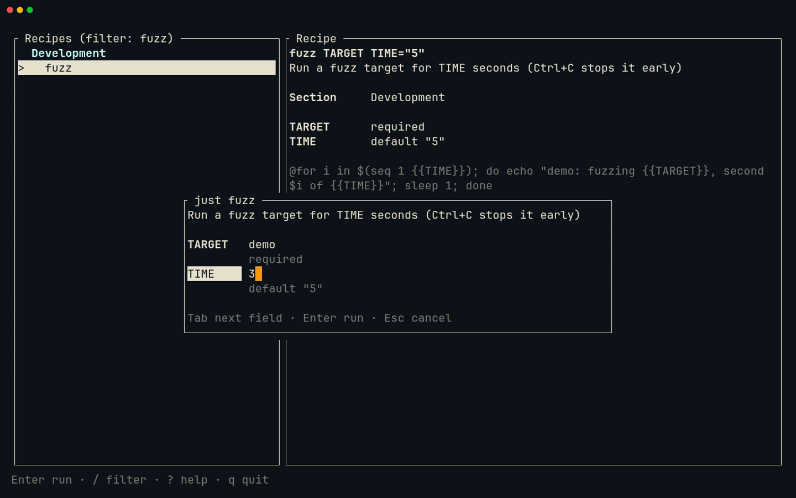
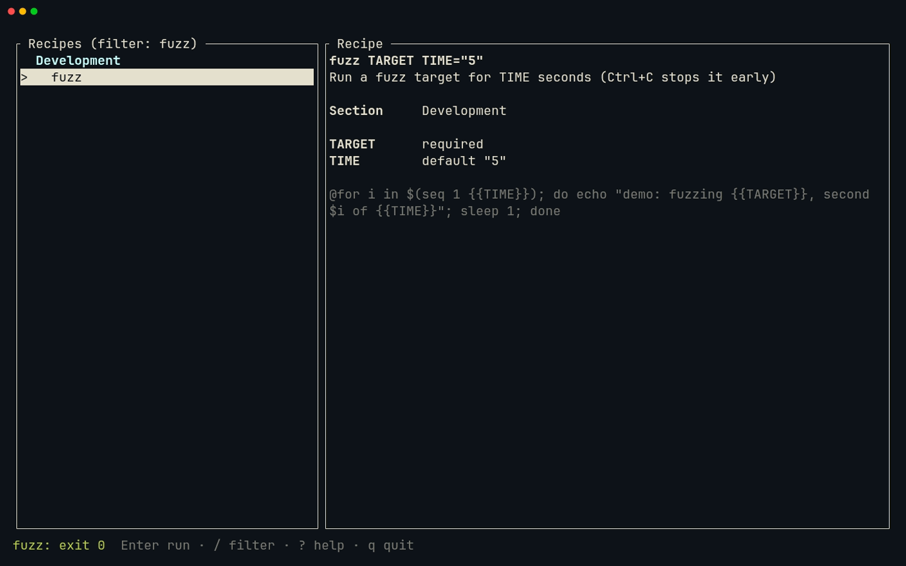
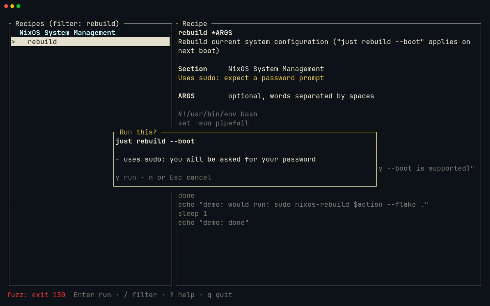
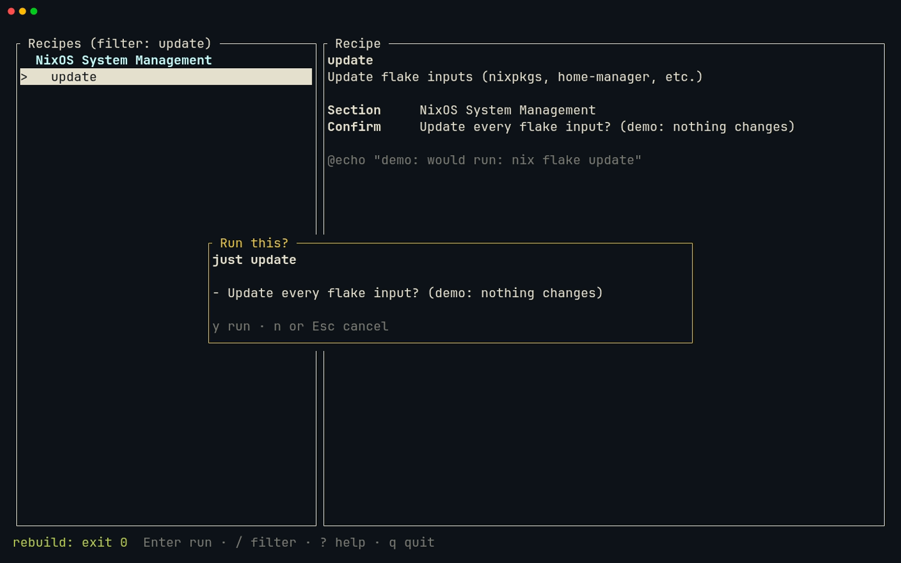

# Lesson 16 — just-panel: running recipes

**Last Updated**: 27/09/2026
**Version**: 1.0.0
**Maintained By**: Development Team
**Language**: British English (en_GB)
**Timezone**: Europe/London

---

Until now just-panel only looks. After this lesson, `Enter` runs the selected recipe. The panel asks for the
recipe's parameters, and asks again before anything that uses `sudo` or ends your session. Then it hands the
whole terminal to `just`, so sudo's password prompt, editors and `Ctrl+C` behave exactly as they do in a shell.
Afterwards it takes the screen back and shows the exit code in its status line. The hand-over is the piece of
TUI plumbing that most tutorials get wrong: you will build it and be able to say why every line is there. In
Neovim you work across four files at once, with Aerial, `gd` into a dependency's source, the compiler's errors
driving the order of your edits, and a macro from lesson 04.

**Part**: 6 — Build just-panel · **Time**: ~120 min · **Previous**: [Lesson 15 — just-panel: sections and filter](15-JUST-PANEL-SECTIONS-AND-FILTER.md) · **Next**: [Lesson 17 — just-panel: testing and shipping](17-JUST-PANEL-TESTING-AND-SHIPPING.md)

## Objectives

- Explain why a recipe must run on the real terminal and not inside the TUI, and why `Command::output()` is
  the wrong tool for it.
- Write the hand-over on the terminal that `ratatui::run` gave you: leave the alternate screen and raw mode,
  show the cursor, run with `status()`, pause, come back, repaint, and drop keys that queued up. Explain why
  calling `ratatui::init()` a second time is the wrong fix.
- Keep `Ctrl+C` for the recipe with a do-nothing SIGINT handler, and say why it must be a handler and not
  `SIG_IGN`.
- Add a parameter prompt and a confirmation dialog as two new modes of the pure `App`, with the argument rules
  that `just` expects.
- Decide what needs a second keypress: `[confirm]` recipes (passed on as `--yes`), recipes that use `sudo`,
  and the names in a `CAUTION` table.
- In Neovim: jump into ratatui's source with `gd` and back with `<C-o>`, find your way round a 400-line file
  with Aerial, let rust-analyzer's diagnostics order your edits, and build a table with a macro.

## Before you start

- You have finished [Lesson 15](15-JUST-PANEL-SECTIONS-AND-FILTER.md): milestone **JP6** is committed and
  tagged `course/jp6` (`git tag --list 'course/*'` lists it), and `git status --short rust/` prints nothing.
- The crate passes its checks. In `<leader>t` (Space, then `t`):

  ```bash
  # in ~/Repos/personal/nix-config/rust
  cargo test -p just-panel
  cargo clippy -p just-panel --all-targets -- -D warnings
  cargo fmt -p just-panel --check
  ```

  Expect `test result: ok. 12 passed`, plus the tests you kept in lesson 13 (16 if you kept all four). This
  lesson adds no tests. Clippy and the format check print nothing else.
- Start Neovim in `rust/`, as in lessons 14 and 15, so that `<leader>t` and cargo start there too:

  ```bash
  # in a Kitty terminal
  cd ~/Repos/personal/nix-config/rust && nvim just-panel/src/runner.rs
  ```

- Keep a second Kitty window for running the panel (`SUPER + RETURN`, then `SUPER + 0`: new windows open on
  workspace 10), then `cd ~/Repos/personal/nix-config/rust`. `SUPER + F11` (config/hypr/60-keybinds.lua:96) makes
  that window full screen while you use the panel. The prompt and the dialogs want room, and `<leader>t` gives the
  panel 15 rows.
- The demo justfile is `../docs/NEOVIM-COURSE/fixtures/just/justfile` from `rust/`. Every recipe in it
  only echoes, prints the time or sleeps, so `Enter` is safe on all of them. The "sudo" in `rebuild` and
  `snapshot` is inside an `echo`.

## Keys in this lesson

| Keys | Mode | Action | Where it comes from |
|---|---|---|---|
| `<leader>t` | n | Toggle the bottom terminal | config (neovim.nix:27) |
| `<C-\><C-n>` | t | Terminal mode to Normal mode | Neovim default |
| `<C-h>` `<C-j>` `<C-k>` `<C-l>` | n | Move to the window left, below, above, right | config (neovim.nix:68-71) |
| `<C-w>v` | n | Split the window vertically | Neovim default |
| `<C-q>` | n | Close the current window (`:q`) | config (neovim.nix:65) |
| `<leader>ff` | n | Find files (Telescope) | config (neovim.nix:29) |
| `<leader>o` | n | Toggle the Aerial outline (the cursor moves into it) | config (neovim.nix:26) |
| `<CR>` / `q` | n (Aerial) | Jump to the symbol / close the outline | aerial default |
| `gd` | n | Go to definition, also into a dependency's source | config (LSP buffer-local, neovim.nix:340) |
| `<C-o>` | n | Back through the jumplist | Neovim default |
| `K` | n | Hover documentation | config (LSP buffer-local, neovim.nix:344) |
| `grr` | n | References, in the quickfix list | Neovim 0.12 default |
| `]d` / `[d` | n | Next / previous diagnostic, with its float | config (LSP buffer-local, neovim.nix:353-354) |
| `<leader>xx` | n | All diagnostics in Trouble | config (neovim.nix:55) |
| `<C-e>` | i | Close the completion menu without choosing | config (neovim.nix:304) |
| `qb` … `q`, `13@b` | n | Record macro `b`, replay it 13 times | Neovim default |
| `:noautocmd w` | c | Save without format-on-save | Neovim default |
| `Enter` | panel | Run the selected recipe (prompt and confirmation first when needed) | just-panel (`app.rs`, this lesson) |
| `Tab` or `Down` / `Shift+Tab` or `Up` | panel prompt | Next / previous field (wraps round) | just-panel (`app.rs`) |
| typing, `Backspace` | panel prompt | Edit the highlighted field | just-panel (`app.rs`) |
| `Enter` / `Esc` | panel prompt | Check the values and run / cancel | just-panel (`app.rs`) |
| `y` / `n` or `Esc` | panel confirmation | Run / cancel. `Enter` does nothing here | just-panel (`app.rs`) |
| `Ctrl+C` | while a recipe runs | Interrupt the recipe; the panel carries on | the terminal, plus just-panel's handler (`runner.rs`) |
| `Enter` | the pause after a run | Back to the panel | just-panel (`runner.rs`) |

## Walkthrough

Steps 1 to 7 explain the design, with experiments that need none of the new code. The
[milestone](#milestone-jp7-enter-runs-the-recipe) then types it, file by file. Each step says which milestone
step it prepares.

![Lesson 16 recording: the fuzz prompt, the hand-over to the real terminal and back, Ctrl+C during a recipe, the sudo confirmation and a [confirm] recipe](../media/16-just-panel-running-recipes/16-just-panel-running-recipes.gif)

[MP4](../media/16-just-panel-running-recipes/16-just-panel-running-recipes.mp4)

### 1. Why a recipe cannot run inside the TUI

The panel runs in **raw mode** on the **alternate screen**. Raw mode hands the program every key as it is
pressed, with no echo, no line editing, and no signals: `Ctrl+C` is an ordinary key, which is how JP5's
`handle_key` gets to see it. The alternate screen is a second screen whose contents vanish when a program
leaves it. That is why your shell's history reappears when you quit the panel.

A recipe expects the opposite. `sudo` reads your password from the terminal device itself, not from its
standard input. `fzf` and editors draw on that device. `nix` prints progress for minutes. So the recipe needs
the real terminal, in its normal state, for as long as it runs.

`std::process::Command` has two ways to run a program and wait for it:

- `output()` captures stdout and stderr and does **not** pass on stdin. `justfile::load` uses it, rightly,
  because it wants the JSON that `just --dump` prints. For a recipe it would be wrong: nothing would appear
  until the recipe ended, and sudo would write its prompt straight over the TUI, because it bypasses the
  pipes.
- `status()` lets the child inherit all three streams, waits, and returns `Ok(ExitStatus)` even when the
  child fails or is killed. That is the one to use.

**Try it.** `<leader>ff`, type `justfile.rs`, `<CR>`. Search with `/\.output(` and `<CR>`, then `w` to land on
`output`, and press `K`.

**What you should see:** a hover float with the standard library's documentation for `output`. It says that
stdout and stderr are captured and that stdin is not inherited from the parent. Any movement closes it. Now
`<leader>t` and type `tty`: it prints `/dev/pts/` and a number. That is the device your shell, and every
program started from it, shares. It is the one sudo opens for your password.

### 2. What `ratatui::run` did for you

Before you undo raw mode and the alternate screen, see exactly what set them up. `<C-\><C-n>` leaves Terminal
mode, `<C-k>` goes back up, and `:e just-panel/src/main.rs` opens the event loop.

**Try it.**

1. `/run(` and `<CR>`: the cursor lands on `run` in `ratatui::run(|terminal| …)`.
2. `gd`. rust-analyzer opens ratatui's own source, `ratatui-0.30.2/src/init.rs`, from your cargo registry:

   ```rust
   pub fn run<F, R>(f: F) -> R
   where
       F: FnOnce(&mut DefaultTerminal) -> R,
   {
       let mut terminal = init();
       let result = f(&mut terminal);
       restore();
       result
   }
   ```

3. `/init()` and `<CR>` puts the cursor on `init` in `let mut terminal = init();`. `gd` again: `init` is
   one line, `try_init().expect(…)`.
4. `/try_init` `<CR>`, `gd`. `try_init` calls `set_panic_hook()`, `enable_raw_mode()`, enters the alternate
   screen and builds a new `Terminal`.
5. `/set_panic_hook` `<CR>`, `gd`: it takes the current panic hook and installs a new one that calls
   `restore()` and then the old hook.
6. `<C-o>` repeatedly until you are back in `main.rs`. Every search and every `gd` was a jump, so it takes
   several presses: seven, if you followed the steps exactly.

**What you should see:** ratatui's `init.rs`, opened from `~/.cargo/registry/src/`: a file you did not
write. Read it, but do not edit it.

So `run` is `init`, your closure, then `restore`. The tempting way to hand the terminal over is
`ratatui::restore()` before the recipe and `ratatui::init()` after it. It even works once. But every `init`
chains **another** panic hook onto the last one and builds a **new** `Terminal`, and the terminal that `run`
lent your closure cannot be swapped for it anyway. So the panel undoes by hand exactly what `try_init` did,
on the terminal it already has, and redoes it afterwards. This is ratatui's "spawn vim" recipe. The recipe
leaves the alternate screen first and then raw mode, which is the order used here. ratatui's own
`try_restore` does it the other way round. Both work.

This prepares milestone step 2 (`run_in_terminal`).

### 3. The hand-over, line by line

This is the body of `run_in_terminal` from `src/runner.rs`, as an excerpt: its comments are replaced by the
numbers of the notes below it.

```rust
stdout().execute(LeaveAlternateScreen)?;   // 1
disable_raw_mode()?;                        // 2
terminal.show_cursor()?;                    // 3

println!("$ {run}");                        // 4
let status = command(justfile, run).status();

match &status {                             // 5
    Ok(status) => println!("\n[just-panel] {status}"),
    Err(error) => println!("\n[just-panel] could not run just: {error}"),
}
print!("Press Enter to return to just-panel ");
stdout().flush()?;
io::stdin().read_line(&mut String::new())?;

stdout().execute(EnterAlternateScreen)?;    // 6
enable_raw_mode()?;
terminal.clear()?;                          // 7
while event::poll(Duration::ZERO)? {        // 8
    event::read()?;
}
status
```

1. **Leave the alternate screen**, so the recipe's output lands on the normal screen, in the scrollback.
2. **Leave raw mode**, so line editing, echo and `Ctrl+C` work as they do in a shell. sudo needs all three.
3. **Show the cursor.** ratatui hides it on every draw that does not place it, and only shows it again when
   the `Terminal` is dropped. A password prompt with no cursor looks as if it has hung.
4. **Say what runs**, as `$ just fuzz demo 3`, then run it with `status()`: `just` inherits the terminal.
5. **Pause.** Going straight back to the alternate screen would hide the output before you had read it. The
   panel prints the exit status and waits for `Enter`, read in cooked mode like any shell prompt.
6. **Take the terminal back**: alternate screen, then raw mode.
7. **Repaint everything.** The screen no longer matches what ratatui last drew, and `clear()` makes the next
   draw repaint all of it. On the way it asks the terminal where its cursor is (the `ESC[6n` query). Kitty
   and VHS answer that query; a terminal that ignored it would stall the resume for about two seconds.
8. **Drop queued keys.** crossterm reads everything the terminal has sent and queues the parsed events. A
   double-tapped `Enter` can arrive in one read. The first starts the run, and without this loop the second
   would start it again the moment the list came back.

This prepares milestone step 2.

### 4. Ctrl+C: one keypress, three processes

While a recipe runs, the terminal is in cooked mode, and there `Ctrl+C` sends SIGINT to every process in the
terminal's foreground process group: the recipe, `just`, **and just-panel**. SIGINT's default action is to
end the process. Without a handler, stopping a recipe would kill the panel too.

The fix is a handler that does nothing. It must be a **handler**, not `SIG_IGN`:

- When a program starts another (`exec`), signals it **handles** are reset to their defaults in the child,
  but signals it **ignores** stay ignored. With `SIG_IGN`, `Ctrl+C` could stop working in anything the panel
  starts.
- `just` happens to install its own SIGINT handler, so recipes run through `just` would still stop even
  then. The panel should not rely on that.

`signal_hook::flag::register(SIGINT, flag)` installs a handler that only sets a flag. Nothing reads the flag:
having a handler at all is the point. In the TUI, raw mode means `Ctrl+C` never becomes a signal, so JP5's
"`Ctrl+C` quits" keeps working.

**Try it.** In `<leader>t` (Terminal mode passes `Ctrl+C` straight to the program):

```bash
# in ~/Repos/personal/nix-config/rust
J=../docs/NEOVIM-COURSE/fixtures/just/justfile
just --justfile $J fuzz demo 10
```

Press `Ctrl+C` after two lines. Then:

```bash
# in ~/Repos/personal/nix-config/rust
echo $?
cargo tree -p just-panel -i signal-hook
```

**What you should see:** `^C`, then ``error: recipe `fuzz` was terminated on line 65 by signal 2``, and
`echo $?` prints `130` (just 1.58; 1.46 capitalises `Recipe`). `cargo tree` shows `signal-hook` already in
your build: crossterm uses it to notice window resizes. So depending on it directly costs no new crate.

```text
signal-hook v0.3.18
├── crossterm v0.29.0
│   └── ratatui-crossterm v0.1.2
│       └── ratatui v0.30.2
│           └── just-panel v0.1.0 (…/rust/just-panel)
└── signal-hook-mio v0.2.5
    └── crossterm v0.29.0 (*)
```

Your version numbers can differ slightly: they come from your `rust/Cargo.lock`. This prepares milestone
steps 1, 2 and 5.

### 5. What `just` checks, and what the panel checks first

**Try it.** Still in `<leader>t`:

```bash
# in ~/Repos/personal/nix-config/rust
just --justfile $J fuzz
echo n | just --justfile $J update
just --justfile $J --yes update
```

**What you should see:**

```text
error: recipe `fuzz` got 0 positional arguments but takes at least 1
usage:
    just fuzz TARGET [TIME]
Update every flake input? (demo: nothing changes) error: recipe `update` was not confirmed
demo: would run: nix flake update
```

So `just` validates arguments itself, and a `[confirm]` recipe reads its answer from stdin. The panel
checks first, in the prompt, so that you see "TARGET is required" there instead of a usage error on the
normal screen. It follows these rules (`runner::arguments`):

| Recipe | Fields as typed | Arguments passed | Rule |
|---|---|---|---|
| `fuzz TARGET TIME="5"` | `demo`, `5` | `demo 5` | String defaults start out typed in, so what you see is what runs |
| `fuzz TARGET TIME="5"` | `demo` with a space either side, (cleared) | `demo` | Values are trimmed. Blank values at the end are left off, so `just` applies its own default |
| `fuzz TARGET TIME="5"` | (blank), `5` | none: "TARGET is required" | A required singular parameter must not be blank |
| `rebuild *ARGS` | `--boot` and `--fast`, two spaces apart | `--boot --fast` | `*NAME` and `+NAME` are split on whitespace, as a shell would split them |
| `rebuild *ARGS` | (blank) | nothing | `*NAME` takes any number of words, including none |
| `snapshot SUBVOL NAME=""` | `home`, (blank) | `home` | A trailing blank is left to `just`, which fills in `""` |
| `A="x" B="x"` | (blank), `b` | `"" b` | A position cannot be skipped, so a blank before a filled value is passed as an empty string |
| `+FILES` | (a space) | none: "FILES needs at least one value" | `+NAME` needs at least one word |

Each argument is a separate argv entry, so a value with spaces reaches `just` intact. What the recipe then
does with it is up to its body: `just` pastes `{{NAME}}` into the command text, so a `"` inside a commit
message breaks `git commit -m "{{MESSAGE}}"` in the real justfile.

For `[confirm]`, the panel shows the recipe's own question in its dialog and, once you have said `y`, passes
`--yes`, so `just` does not ask a second time. This prepares milestone steps 2 and 3.

> **Gotcha:** zsh exports `JUST_WORKING_DIRECTORY` for the nix-config repo (home/modules/shell.nix:80), so the
> commands above ran the demo recipes in the repo root, not in `fixtures/just/`. They only echo, so it made no
> difference. The panel passes `--working-directory` as well as `--justfile` (`justfile::just_command`), so
> its recipes always run where the justfile is.

### 6. What deserves a second keypress

`runner::cautions` collects every reason to ask, in this order:

1. The recipe's `[confirm]` prompt, if it has one.
2. "uses sudo": the word `sudo` anywhere in the recipe's own body. That is a plain word search, so the demo's
   `echo "demo: would run: sudo …"` sets it off on purpose, and you see exactly the dialog a real sudo recipe
   gets. It does not look inside dependencies.
3. Every line of the `CAUTION` table whose name matches. A trailing `*` matches any ending. The names come
   from your real justfile: recipes that end your session (`lock`, `sleep`, `logout`), delete for good
   (`clean-*`, `fuzz-clean`, `quarantine-delete`, `restic-prune`), rewrite secrets (`rekey-*`) or touch raw
   disks (`zfs-pool`, `raid-create`, `raid-fail`, `raid-remove`, `install-nixos`, `gen-hardware`). It is a
   table, not code, so that adding a scary recipe later means adding one line.

In the dialog, `y` runs and `n` or `Esc` cancels. `Enter` does nothing. `Enter` is what opened the dialog, and
pressing it twice must never be enough to run a sudo recipe.

**Try it.** `:e ../docs/NEOVIM-COURSE/fixtures/just/justfile`. `/\<sudo\>` and `<CR>`, then `n`, `n`.
Then `/^\[confirm` and `<CR>`. `:b runner` takes you back.

**What you should see:** the first hit is line 5, the header comment promising that nothing here runs sudo
(it is not a recipe body, so it does not count). `n` visits line 44 in `rebuild` and line 118 in `snapshot`:
the only two recipes that get "uses sudo". The second search lands on line 55, the one `[confirm]` attribute,
above `update`. Those three recipes, plus `rekey-secrets`, `clean-cache` and `lock` from the table, are the
six that ask first in the demo.

### 7. Modes: keeping `app.rs` pure

`app.rs` never touches the terminal, and this lesson keeps it that way. Two new modes carry data:
`Mode::Prompt(Prompt)` holds one text field per parameter, and `Mode::Confirm(Confirm)` holds the run that is
waiting and the reasons. When a run is ready, `handle_key` returns `Action::Run(run)`, and the event loop in
`main.rs` does the I/O: it calls `runner::run_in_terminal`, then reports back with `app.finished(…)`.

```text
Normal ──Enter──▶ begin() ── no parameters ─────────────────▶ start()
                     │                                           │
                     └─ parameters ─▶ Prompt ── Enter, valid ──▶ start()
                                                                 │
                     cautions empty ─▶ Action::Run ─▶ main.rs: run_in_terminal ─▶ app.finished()
                     otherwise      ─▶ Confirm ── y ─▶ Action::Run
                                                ── n or Esc ─▶ Normal
```

Three details matter:

- `Mode` derives `Default` (`Normal`), so `confirm_key` can take the `Confirm` out of the mode with
  `std::mem::take`, leaving `Normal` behind, and move its `run` into the action without cloning it.
- `start` sets the mode back to `Normal` **before** it returns `Action::Run`. The first draft forgot, so the
  prompt reopened after the run and swallowed the next keys.
- The prompt starts with plain-string defaults typed in. A default that is an expression (a variable, a
  backtick) shows as "has a default" and starts blank, so `just` evaluates it. The focused field shows the
  end of a value that is too long to fit, because that is where you type.

**Try it.** `:e just-panel/src/app.rs`, then `<leader>o`. The cursor moves into Aerial's outline on the left: `Entry`,
`Row`, `Mode`, `Action`, `App` and its methods. Move to `handle_key`, press `<CR>` and the file jumps there;
`<leader>o` again closes the outline.

**What you should see:** the outline you will extend in milestone step 3, with `normal_key`, `filter_key`,
`refresh` and the `select_*` helpers under `App`.

## Gotchas in this config

- **A bare `cargo run` loads the real justfile.** just-panel looks for `-f`, then `$JUST_JUSTFILE`, then
  `./justfile`, and zsh exports `JUST_JUSTFILE` for the nix-config justfile (home/modules/shell.nix:79). From
  now on `Enter` really runs recipes. Always pass `-f ../docs/NEOVIM-COURSE/fixtures/just/justfile` while you
  develop.
- **`<CR>` accepts a completion.** rust-analyzer's completion menu is often open while you type Rust, and
  `<CR>` there confirms the first item (neovim.nix:305) instead of starting a new line. Press `<C-e>` first,
  or `<Esc>` and `o`.
- **`<C-s>` saves in Normal mode only.** In Insert mode it is Neovim's signature help. `<Esc>` first.
- **Saving `rust/Cargo.toml` can reformat it.** TOML falls through to the taplo language server
  (neovim.nix:933-936, :974-977), which may re-align the whole file. Save both manifests with
  `:noautocmd w`, so the diff is only the line you added.
- **`gr` waits.** The buffer-local `gr` is also the prefix of Neovim 0.12's `grr`, `grn`, `gra`, so it waits
  `timeoutlen` (300 ms, neovim.nix:270) before listing references. `grr` is instant.
- **rust-analyzer runs clippy on save** (neovim.nix:427-431), so dead-code warnings appear while the files
  are only half done. The milestone tells you which ones to expect after each step.
- **The panel in `<leader>t` works, but it is cramped.** In Terminal mode every key except `<C-\>` goes to the
  panel, `Ctrl+C` included, and Neovim's terminal answers the cursor query that `clear()` sends. Run in
  Neovim 0.12.5's own terminal, the hand-over, the pause and `Ctrl+C` (exit 130, panel alive) all behave.
  But 15 rows (neovim.nix:776) leave little room for the prompt: `<C-\><C-n>`, `<C-w>_`, `i` first, or use
  Kitty.
- **Keys typed during a run go to the recipe.** Once the panel has handed the terminal over, a key belongs to
  the recipe or to the "Press Enter" pause. A second `Enter` pressed just too late skips the pause; the output
  stays on the normal screen, which you see after quitting.
- **`Ctrl+C` at the pause does nothing.** The handler catches it and the pause keeps waiting. Press `Enter`.
- **`--yes` reaches dependencies.** A `[confirm]` recipe runs with `--yes`, and `just` then also
  auto-confirms any `[confirm]` recipe it runs as a dependency.
- **`Esc` quits the panel when no filter is set.** With a kept filter, the first `Esc` clears it and the
  second quits.

## Drills

1. You are in `app.rs` on the call `runner::cautions(recipe)`. Read the function and come back.
   <details><summary>Answer</summary>

   `w` until the cursor is on `cautions`, `gd` opens `runner.rs` at the definition, `<C-o>` returns. (`K`
   shows its doc comment without leaving the file.)
   </details>

2. A recipe is `deploy +HOSTS`. What does the prompt accept, and what reaches `just` when you type `web db`?
   <details><summary>Answer</summary>

   At least one word; a blank field gives "HOSTS needs at least one value". `web db` is split on whitespace
   into two arguments, `web` and `db`.
   </details>

3. In the prompt for `snapshot SUBVOL NAME=""` you type `home` and leave NAME as it is. What runs? And with
   SUBVOL blank?
   <details><summary>Answer</summary>

   `just snapshot home`: the trailing blank is left off and `just` fills in its default. With SUBVOL blank the
   prompt stays open with "SUBVOL is required". (snapshot then asks "uses sudo" before it runs.)
   </details>

4. You add a recipe `wipe-cache` to the real justfile that deletes a cache for good. How do you make the panel
   ask first?
   <details><summary>Answer</summary>

   Add a line to `CAUTION` in `src/runner.rs`, for example `("wipe-*", "deletes a cache for good"),`. With
   the lesson 04 macro, type `wipe-* - deletes a cache for good` on its own line and replay `@b` on it.
   </details>

5. Why would `SIG_IGN` for SIGINT be wrong, when the recipes you run go through `just` and still stop?
   <details><summary>Answer</summary>

   An ignored signal stays ignored across `exec` in every program the panel starts, while a handled one is
   reset to the default. Recipes through `just` still stop only because `just` installs its own handler; the
   panel should not depend on that.
   </details>

6. Why does `start()` set `self.mode = Mode::Normal` before returning `Action::Run`?
   <details><summary>Answer</summary>

   Otherwise the prompt would still be the mode when the panel came back from the run: it would reopen and
   swallow the next keys.
   </details>

7. You typed `KeyCode::Enter => return self.begin(),`, pressed `<CR>`, and a completion was inserted instead
   of a new line. What happened, and how do you avoid it?
   <details><summary>Answer</summary>

   The completion menu was open and `<CR>` confirms its first item (`select = true`, neovim.nix:305). Undo
   with `u`; next time press `<C-e>` to close the menu first, or leave Insert mode with `<Esc>` and open the
   new line with `o`.
   </details>

8. After a build, Trouble lists `function run_in_terminal is never used`. Is something wrong?
   <details><summary>Answer</summary>

   Not yet: nothing calls it until `main.rs` is wired up in milestone step 5. The warning goes away then. If
   it stays, check the `Some(Action::Run(run))` arm in `event_loop`.
   </details>

## Milestone JP7: Enter runs the recipe

**Goal:** `Enter` runs the selected recipe. Recipes with parameters open a prompt first; recipes with
`[confirm]`, `sudo` or a name in `CAUTION` wait for `y`. The recipe runs on the real terminal, `Ctrl+C` stops
it without killing the panel, and the status line keeps the last exit code. Six files change:
`rust/Cargo.toml`, `rust/just-panel/Cargo.toml`, and `runner.rs`, `app.rs`, `ui.rs` and `main.rs` in
`rust/just-panel/src/`. No test changes: lesson 17 adds them. It ends with a commit tagged `course/jp7`.

The order below follows the compiler. After each step, `<C-s>` saves (rust-analyzer formats Rust on save),
`<leader>xx` shows what is still missing, and the text says what you should see.

> **Tip:** type the code: it is the Neovim practice. If you paste instead, copy a block from the rendered page
> and press `p` in Normal mode: `clipboard=unnamedplus` (neovim.nix:257) makes the system clipboard the
> default register. For the diffs, type only the `+` lines, in the places the context lines show. A hunk
> header such as `@@ -38,20 +41,74 @@` means "around line 38 of the old file": `:38` and `<CR>` jumps there.

### Step 1: signal-hook in both manifests

`:e Cargo.toml` (the workspace's). `/Process execution` and `<CR>`, then `j` onto `which = "6.0"`, `o`, and
type the new line. `<Esc>` and `:noautocmd w`:

```toml
# Process execution
which = "6.0"
signal-hook = "0.3"
```

Then `:e just-panel/Cargo.toml` (the crate's own manifest) and add the last line. `:noautocmd w`. The whole file:

```toml
[package]
name = "just-panel"
version.workspace = true
edition.workspace = true
authors.workspace = true
license.workspace = true

[[bin]]
name = "just-panel"
path = "src/main.rs"

[dependencies]
anyhow = { workspace = true }
clap = { workspace = true, features = ["env"] }
ratatui = { workspace = true }
serde = { workspace = true }
serde_json = { workspace = true }
signal-hook = { workspace = true }
```

### Step 2: `src/runner.rs`

The file holds only its one-line doc comment. `:e just-panel/src/runner.rs`, `ggdG` to empty it, and write the whole
module:

```rust
//! Running a recipe in the real terminal and taking the screen back afterwards.
//!
//! Recipes do not run inside the TUI. `sudo` reads its password from the
//! terminal device itself, editors and `fzf` draw on it, and some recipes
//! print for minutes: they all need the real terminal, in its normal state.
//! So the panel steps aside, lets just have the terminal, and comes back when
//! just exits.

use std::io::{self, stdout, Write};
use std::path::Path;
use std::process::{Command, ExitStatus};
use std::sync::atomic::AtomicBool;
use std::sync::Arc;
use std::time::Duration;

use ratatui::crossterm::event;
use ratatui::crossterm::terminal::{
    disable_raw_mode, enable_raw_mode, EnterAlternateScreen, LeaveAlternateScreen,
};
use ratatui::crossterm::ExecutableCommand;
use ratatui::DefaultTerminal;
use signal_hook::consts::SIGINT;

use crate::app::Run;
use crate::justfile::{self, Parameter, ParameterKind, Recipe};

/// Recipes that deserve a second keypress although the justfile never asks:
/// they end the session you are sitting in, delete something for good, or
/// rewrite secrets or disks. A trailing `*` matches any ending.
///
/// The rule is a table rather than code so that it is easy to extend: when
/// you add a recipe you would hate to run by accident, add its name here.
/// Recipes that run `sudo` or carry `[confirm]` are asked about anyway (see
/// `cautions`), so they need no entry.
const CAUTION: &[(&str, &str)] = &[
    ("lock", "locks the screen"),
    ("sleep", "suspends the machine"),
    ("logout", "ends the Hyprland session"),
    ("clean-*", "deletes build output or old generations"),
    ("fuzz-clean", "deletes fuzzing crashes and corpus"),
    ("rekey-*", "re-encrypts every secret"),
    ("quarantine-delete", "deletes a quarantined file for good"),
    ("restic-prune", "deletes old backup snapshots"),
    ("zfs-pool", "creates a ZFS pool on raw disks"),
    ("raid-create", "builds a RAID array on raw disks"),
    ("raid-fail", "marks a disk in an array as failed"),
    ("raid-remove", "removes a disk from an array"),
    ("install-nixos", "installs NixOS onto a disk"),
    ("gen-hardware", "overwrites hardware-configuration.nix"),
];

/// Every reason to ask before running `recipe`; empty when it can just run.
pub fn cautions(recipe: &Recipe) -> Vec<String> {
    let mut reasons = Vec::new();
    if let Some(prompt) = recipe.confirm_prompt() {
        reasons.push(prompt);
    }
    if recipe.needs_sudo() {
        reasons.push("uses sudo: you will be asked for your password".to_string());
    }
    for (pattern, reason) in CAUTION {
        let matched = match pattern.strip_suffix('*') {
            Some(prefix) => recipe.name.starts_with(prefix),
            None => recipe.name == *pattern,
        };
        if matched {
            reasons.push(reason.to_string());
        }
    }
    reasons
}

/// Turns what was typed into the prompt into just's positional arguments,
/// or explains what is missing.
///
/// - A required `NAME` must not be blank.
/// - `+NAME` needs at least one word and `*NAME` takes any number. Both are
///   split on whitespace, as a shell would split them.
/// - Blank values at the end are left off, so just fills in its own
///   defaults. A blank before a filled-in value is passed as an empty string,
///   because a position cannot be skipped.
pub fn arguments(parameters: &[Parameter], values: &[String]) -> Result<Vec<String>, String> {
    let filled = values
        .iter()
        .rposition(|value| !value.trim().is_empty())
        .map_or(0, |last| last + 1);
    let mut args = Vec::new();
    for (index, (parameter, value)) in parameters.iter().zip(values).enumerate() {
        let value = value.trim();
        match parameter.kind {
            ParameterKind::Singular if value.is_empty() && parameter.default.is_none() => {
                return Err(format!("{} is required", parameter.name));
            }
            ParameterKind::Singular if index < filled => args.push(value.to_string()),
            ParameterKind::Singular => {}
            ParameterKind::Plus if value.is_empty() => {
                return Err(format!("{} needs at least one value", parameter.name));
            }
            ParameterKind::Plus | ParameterKind::Star => {
                args.extend(value.split_whitespace().map(str::to_string));
            }
        }
    }
    Ok(args)
}

/// The `just` invocation for `run`. Each argument is a separate argv entry,
/// so a value with spaces reaches just intact; what the recipe then does with
/// it depends on how its body uses `{{…}}`.
pub fn command(justfile: &Path, run: &Run) -> Command {
    let mut command = justfile::just_command(justfile);
    if run.yes {
        command.arg("--yes");
    }
    command.arg(&run.recipe).args(&run.args);
    command
}

/// Runs `run` in the real terminal, waits for it, and takes the screen back.
///
/// This is ratatui's "spawn vim" recipe, applied to the terminal we already
/// have. Calling `ratatui::restore` and then `ratatui::init` would also get
/// the terminal back, but `init` builds a second `Terminal` and chains
/// another panic hook each time, and the terminal that `ratatui::run` handed
/// us cannot be swapped for a new one anyway.
pub fn run_in_terminal(
    terminal: &mut DefaultTerminal,
    justfile: &Path,
    run: &Run,
) -> io::Result<ExitStatus> {
    // Hand the terminal over: leave the alternate screen so the output lands
    // in the normal scrollback, and leave raw mode so that line editing,
    // password prompts and Ctrl+C work as they do in a shell.
    stdout().execute(LeaveAlternateScreen)?;
    disable_raw_mode()?;
    // Drawing hides the cursor, and a password prompt without one looks hung.
    terminal.show_cursor()?;

    println!("$ {run}");
    // `status` shares our stdin, stdout and stderr with just, and waits.
    let status = command(justfile, run).status();

    // Going straight back to the alternate screen would hide the output
    // before anyone had read it.
    match &status {
        Ok(status) => println!("\n[just-panel] {status}"),
        Err(error) => println!("\n[just-panel] could not run just: {error}"),
    }
    print!("Press Enter to return to just-panel ");
    stdout().flush()?;
    io::stdin().read_line(&mut String::new())?;

    stdout().execute(EnterAlternateScreen)?;
    enable_raw_mode()?;
    // The screen no longer shows what ratatui last drew, so make the next
    // draw repaint all of it.
    terminal.clear()?;
    // Throw away keys that arrived before the run but were not handled yet,
    // such as the second press of a double-tapped Enter. Back in the list
    // they would act at once, and could start the same recipe again.
    while event::poll(Duration::ZERO)? {
        event::read()?;
    }
    status
}

/// Keeps Ctrl+C for the recipe rather than the panel.
///
/// In the TUI, raw mode turns Ctrl+C into an ordinary key press. While a
/// recipe runs, though, the terminal is back in its normal mode, where Ctrl+C
/// sends SIGINT to every process in the terminal's foreground process group:
/// the recipe, just, and just-panel as well. Left alone, that would kill the
/// panel along with the recipe.
///
/// A handler that does nothing fixes that. It must be a handler, not SIG_IGN:
/// an ignored signal stays ignored in every program we start, so Ctrl+C could
/// stop working in recipes (just happens to install its own handler, but the
/// panel should not rely on that), whereas `exec` resets handled signals to
/// their defaults.
///
/// signal-hook is already built into the panel, because crossterm uses it to
/// notice window resizes, so this costs no extra crate. Its handler sets a
/// flag, which nothing needs to read: having a handler at all is the point.
pub fn survive_ctrl_c() -> io::Result<()> {
    signal_hook::flag::register(SIGINT, Arc::new(AtomicBool::new(false)))?;
    Ok(())
}
```

**The `CAUTION` table with a macro.** Whether you type the module or paste it, you can leave the fourteen
entries between `const CAUTION: &[(&str, &str)] = &[` and `];` out and build them with lesson 04's macro 2.
Do it in a scratch buffer: there, nothing indents the lines for you, and the macro expects them to start in
column 1.

1. `:enew` opens an empty buffer. Copy this list from the rendered page, `p` to paste it, then `/^lock` and
   `<CR>` to put the cursor on its first line:

   ```text
   lock - locks the screen
   sleep - suspends the machine
   logout - ends the Hyprland session
   clean-* - deletes build output or old generations
   fuzz-clean - deletes fuzzing crashes and corpus
   rekey-* - re-encrypts every secret
   quarantine-delete - deletes a quarantined file for good
   restic-prune - deletes old backup snapshots
   zfs-pool - creates a ZFS pool on raw disks
   raid-create - builds a RAID array on raw disks
   raid-fail - marks a disk in an array as failed
   raid-remove - removes a disk from an array
   install-nixos - installs NixOS onto a disk
   gen-hardware - overwrites hardware-configuration.nix
   ```

2. Record the macro exactly as in lesson 04: `0`, `qb`, `0i` + four spaces + `("`, `<Esc>`, `f` + Space,
   `3s` + `", "` + `<Esc>`, `A` + `"),` + `<Esc>`, `j`, `q`.
3. `13@b` converts the other thirteen. Each line now reads like `    ("lock", "locks the screen"),`.
4. `:%y` yanks the whole buffer, and `:bd!` throws the scratch buffer away, which shows `runner.rs` again
   (`:b runner` if it does not). `/^const CAUTION` and `<CR>`, then `p` puts the entries under that line.

`<C-s>`. **What you should see:** `<leader>xx` lists one error, `unresolved import crate::app::Run` (E0432):
`Run` arrives in step 3. `<leader>xx` again closes Trouble; in the file, `]d` jumps to the error and shows
it in a float.

### Step 3: `src/app.rs`

`:e just-panel/src/app.rs`. Eight hunks, top to bottom. `<leader>o` and `<CR>` on a symbol is the quick way to each
place.

> **Tip:** `<C-w>v` splits the window, and `:e just-panel/src/runner.rs` in the new half keeps `arguments` and
> `cautions` in view while you write the handlers that call them. `<C-h>` and `<C-l>` move between the halves; `<C-q>`
> closes the one you are in (it is `:q`, neovim.nix:65).

**Imports.** The runner module, and two things from std for the new types:

```diff
--- a/rust/just-panel/src/app.rs
+++ b/rust/just-panel/src/app.rs
@@ -5,11 +5,14 @@
 //! testable without a terminal (lesson 17).
 
 use std::collections::BTreeMap;
+use std::fmt;
+use std::process::ExitStatus;
 
 use ratatui::crossterm::event::{KeyCode, KeyEvent, KeyModifiers};
 use ratatui::widgets::ListState;
 
 use crate::justfile::Recipe;
+use crate::runner;
 use crate::sections::Section;
 
 /// A recipe, and the banner it sits under in the justfile.
```

**Two new modes, the types they carry, and a new action.** `Mode` gains `Default`; `Run` gets a `Display` so
the confirmation and the hand-over can print it as you would type it:

```diff
@@ -38,20 +41,74 @@
 }
 
 /// What the keys do at the moment.
-#[derive(Debug, PartialEq, Eq)]
+#[derive(Debug, Default, PartialEq, Eq)]
 pub enum Mode {
     /// Moving around the list.
+    #[default]
     Normal,
     /// Typing a filter after `/`.
     Filter,
     /// The `?` popup is open.
     Help,
+    /// Asking for the parameters of the recipe about to run.
+    Prompt(Prompt),
+    /// Waiting for `y` before running something that deserves a second look.
+    Confirm(Confirm),
+}
+
+/// The parameter prompt: one text field per parameter of `entries[entry]`.
+#[derive(Debug, PartialEq, Eq)]
+pub struct Prompt {
+    pub entry: usize,
+    pub values: Vec<String>,
+    /// The field that typing goes into.
+    pub focus: usize,
+    /// Why the last Enter did not run the recipe.
+    pub error: Option<String>,
+}
+
+/// A run waiting for confirmation, and the reasons for asking.
+#[derive(Debug, PartialEq, Eq)]
+pub struct Confirm {
+    pub run: Run,
+    pub reasons: Vec<String>,
+}
+
+/// A recipe for the event loop to run.
+#[derive(Debug, PartialEq, Eq)]
+pub struct Run {
+    pub recipe: String,
+    pub args: Vec<String>,
+    /// Pass `--yes`: the panel has already asked the recipe's `[confirm]`
+    /// question, so just should not ask it a second time.
+    pub yes: bool,
+}
+
+/// Writes the run the way you would type it, e.g. `just rebuild --boot`.
+impl fmt::Display for Run {
+    fn fmt(&self, f: &mut fmt::Formatter<'_>) -> fmt::Result {
+        write!(f, "just {}", self.recipe)?;
+        for arg in &self.args {
+            write!(f, " {arg}")?;
+        }
+        Ok(())
+    }
+}
+
+/// How the last run ended, for the status line.
+#[derive(Debug, PartialEq, Eq)]
+pub struct LastRun {
+    pub recipe: String,
+    /// `None` when just was killed by a signal instead of exiting.
+    pub code: Option<i32>,
 }
 
 /// What the event loop should do after a key press.
 #[derive(Debug, PartialEq, Eq)]
 pub enum Action {
     Quit,
+    /// Step aside and run a recipe in the real terminal.
+    Run(Run),
 }
 
 /// Everything the panel knows and shows.
```

**The last run, for the status line:** a field, its starting value, and `finished`:

```diff
@@ -67,6 +124,7 @@
     pub mode: Mode,
     /// Text that a recipe's name or description must contain, in any case.
     pub filter: String,
+    pub last_run: Option<LastRun>,
 }
 
 impl App {
@@ -100,6 +158,7 @@
             list: ListState::default(),
             mode: Mode::Normal,
             filter: String::new(),
+            last_run: None,
         };
         app.refresh();
         app
@@ -110,6 +169,12 @@
         self.selected_index().map(|index| &self.entries[index])
     }
 
+    /// Records how a run ended, for the status line.
+    pub fn finished(&mut self, recipe: String, status: ExitStatus) {
+        let code = status.code();
+        self.last_run = Some(LastRun { recipe, code });
+    }
+
     /// Updates the state for one key press.
     pub fn handle_key(&mut self, key: KeyEvent) -> Option<Action> {
         // In raw mode Ctrl+C arrives as an ordinary key press rather than as
```

**Routing keys:** the two new modes get their own handlers, and `Enter` in Normal mode begins a run:

```diff
@@ -128,6 +193,8 @@
             Mode::Filter => self.filter_key(key),
             // Any key closes the help.
             Mode::Help => self.mode = Mode::Normal,
+            Mode::Prompt(_) => return self.prompt_key(key),
+            Mode::Confirm(_) => return self.confirm_key(key),
         }
         None
     }
@@ -145,6 +212,7 @@
             KeyCode::Char('k') | KeyCode::Up => self.select_previous(),
             KeyCode::Char('g') => self.select_first(),
             KeyCode::Char('G') => self.select_last(),
+            KeyCode::Enter => return self.begin(),
             KeyCode::Char('/') => self.mode = Mode::Filter,
             KeyCode::Char('?') => self.mode = Mode::Help,
             _ => {}
```

**The handlers, and `begin`/`start`.** They go between `filter_key` and `refresh`:

```diff
@@ -173,6 +241,91 @@
         }
     }
 
+    fn prompt_key(&mut self, key: KeyEvent) -> Option<Action> {
+        let Mode::Prompt(prompt) = &mut self.mode else {
+            return None;
+        };
+        let fields = prompt.values.len();
+        match key.code {
+            KeyCode::Esc => self.mode = Mode::Normal,
+            KeyCode::Tab | KeyCode::Down => prompt.focus = (prompt.focus + 1) % fields,
+            KeyCode::BackTab | KeyCode::Up => prompt.focus = (prompt.focus + fields - 1) % fields,
+            KeyCode::Backspace => {
+                prompt.values[prompt.focus].pop();
+            }
+            KeyCode::Char(c) => prompt.values[prompt.focus].push(c),
+            KeyCode::Enter => {
+                let parameters = &self.entries[prompt.entry].recipe.parameters;
+                match runner::arguments(parameters, &prompt.values) {
+                    Ok(args) => {
+                        let entry = prompt.entry;
+                        return self.start(entry, args);
+                    }
+                    Err(error) => prompt.error = Some(error),
+                }
+            }
+            _ => {}
+        }
+        None
+    }
+
+    fn confirm_key(&mut self, key: KeyEvent) -> Option<Action> {
+        match key.code {
+            // Not Enter: Enter opened this dialog, and pressing it twice
+            // must not be enough to run a sudo recipe by accident.
+            KeyCode::Char('y') => {
+                if let Mode::Confirm(confirm) = std::mem::take(&mut self.mode) {
+                    return Some(Action::Run(confirm.run));
+                }
+            }
+            KeyCode::Char('n') | KeyCode::Esc => self.mode = Mode::Normal,
+            _ => {}
+        }
+        None
+    }
+
+    /// Enter on a recipe: ask for its parameters first if it has any.
+    fn begin(&mut self) -> Option<Action> {
+        let index = self.selected_index()?;
+        let parameters = &self.entries[index].recipe.parameters;
+        if parameters.is_empty() {
+            return self.start(index, Vec::new());
+        }
+        // Plain-string defaults start out typed in, so what you see is what
+        // runs. Clear a trailing one to leave it to just.
+        let values = parameters
+            .iter()
+            .map(|parameter| parameter.literal_default().unwrap_or_default().to_string())
+            .collect();
+        self.mode = Mode::Prompt(Prompt {
+            entry: index,
+            values,
+            focus: 0,
+            error: None,
+        });
+        None
+    }
+
+    /// Runs `entries[index]` with `args`, unless `runner::cautions` finds a
+    /// reason to ask first.
+    fn start(&mut self, index: usize, args: Vec<String>) -> Option<Action> {
+        let recipe = &self.entries[index].recipe;
+        let reasons = runner::cautions(recipe);
+        let run = Run {
+            recipe: recipe.name.clone(),
+            args,
+            yes: recipe.confirm_prompt().is_some(),
+        };
+        if reasons.is_empty() {
+            // Close the prompt, if it is open, so the panel comes back to
+            // the list after the run.
+            self.mode = Mode::Normal;
+            return Some(Action::Run(run));
+        }
+        self.mode = Mode::Confirm(Confirm { run, reasons });
+        None
+    }
+
     /// Rebuilds the rows from the filter: matching recipes in source order,
     /// with each section's title above its first match. The selection stays
     /// on the same recipe if it still matches, and moves to the first match
```

`<C-s>`. With the cursor on `arguments` in `runner::arguments(parameters, &prompt.values)`, `gd` checks that it
resolves to the function you wrote in step 2; `<C-o>` comes back.

**What you should see:** no errors. `cargo build -p just-panel` in `<leader>t` prints five warnings: field
`last_run` is never read, and `finished`, `command`, `run_in_terminal` and `survive_ctrl_c` are never used.
Steps 4 and 5 use them.

### Step 4: `src/ui.rs`

`:e just-panel/src/ui.rs`. Six hunks: the imports, a `match` for the popups, the status line, a row in `KEYS`, the two
new popups, and `tail`.

```diff
--- a/rust/just-panel/src/ui.rs
+++ b/rust/just-panel/src/ui.rs
@@ -11,12 +11,11 @@
 use ratatui::widgets::{Block, Clear, List, ListItem, Paragraph, Wrap};
 use ratatui::Frame;
 
-use crate::app::{App, Entry, Mode, Row};
-use crate::justfile::{Parameter, ParameterKind};
+use crate::app::{App, Confirm, Entry, Mode, Prompt, Row};
+use crate::justfile::{Parameter, ParameterKind, Recipe};
 
 /// Draws the whole screen: the recipes on the left, the selected recipe on
-/// the right, a status line along the bottom, and the help popup over the
-/// top when it is open.
+/// the right, a status line along the bottom, and any popup over the top.
 pub fn render(frame: &mut Frame, app: &mut App) {
     let [main, status] =
         Layout::vertical([Constraint::Min(0), Constraint::Length(1)]).areas(frame.area());
@@ -25,8 +24,11 @@
     render_list(frame, list, app);
     render_detail(frame, detail, app.selected());
     render_status(frame, status, app);
-    if app.mode == Mode::Help {
-        render_help(frame);
+    match &app.mode {
+        Mode::Help => render_help(frame),
+        Mode::Prompt(prompt) => render_prompt(frame, &app.entries[prompt.entry].recipe, prompt),
+        Mode::Confirm(confirm) => render_confirm(frame, confirm),
+        Mode::Normal | Mode::Filter => {}
     }
 }
 
```

The status line puts the last run first, green for exit code 0 and red otherwise, and now starts its hints
with `Enter run`:

```diff
@@ -114,8 +116,21 @@
         frame.render_widget(line, area);
         return;
     }
-    let hints = "j/k move · / filter · ? help · q quit";
-    frame.render_widget(Line::from(hints).dim(), area);
+    let mut status = Vec::new();
+    if let Some(last) = &app.last_run {
+        let outcome = match last.code {
+            Some(code) => format!("{}: exit {code}", last.recipe),
+            None => format!("{}: killed by a signal", last.recipe),
+        };
+        status.push(if last.code == Some(0) {
+            outcome.green()
+        } else {
+            outcome.red()
+        });
+        status.push("  ".into());
+    }
+    status.push("Enter run · / filter · ? help · q quit".dim());
+    frame.render_widget(Line::from(status), area);
 }
 
 /// The keys, as the `?` popup lists them.
@@ -123,6 +138,7 @@
     ("j  Down", "next recipe"),
     ("k  Up", "previous recipe"),
     ("g  G", "first / last recipe"),
+    ("Enter", "run the selected recipe"),
     ("/", "filter; Enter keeps it, Esc clears it"),
     ("Esc", "clear the filter, or quit"),
     ("?", "this help"),
```

The prompt draws one field per parameter with a hint under it, highlights the label of the field you type
into, and places the terminal's cursor at the end of that field. The confirmation has a yellow border, the
run as you would type it, and one line per reason:

```diff
@@ -144,6 +160,70 @@
     frame.render_widget(help, area);
 }
 
+/// One field per parameter, each with a hint, and the cursor in the field
+/// being typed into.
+fn render_prompt(frame: &mut Frame, recipe: &Recipe, prompt: &Prompt) {
+    let label_width = recipe.parameters.iter().map(|p| p.name.len()).max();
+    let label_width = label_width.unwrap_or_default() + 2;
+    // What fits of a value: the popup, less its border, the label, the
+    // space after the label and a column for the cursor.
+    let width = frame.area().width.min(64);
+    let room = usize::from(width).saturating_sub(label_width + 4);
+    let mut lines = vec![
+        Line::from(recipe.doc.clone().unwrap_or_default()),
+        Line::default(),
+    ];
+    let mut cursor = (0, 0);
+    for (index, (parameter, value)) in recipe.parameters.iter().zip(&prompt.values).enumerate() {
+        let label = format!("{:<label_width$}", parameter.name);
+        let line = if index == prompt.focus {
+            // Typing happens at the end, so that is the part to show.
+            let value = tail(value, room);
+            let line = Line::from(vec![label.reversed(), " ".into(), value.into()]);
+            cursor = (line.width(), lines.len());
+            line
+        } else {
+            Line::from(vec![label.bold(), " ".into(), value.clone().into()])
+        };
+        lines.push(line);
+        let hint = format!("{:label_width$} {}", "", describe(parameter));
+        lines.push(hint.dim().into());
+    }
+    lines.push(Line::default());
+    lines.push(match &prompt.error {
+        Some(error) => error.clone().red().into(),
+        None => "Tab next field · Enter run · Esc cancel".dim().into(),
+    });
+
+    let area = popup(frame.area(), width, lines.len());
+    let title = format!(" just {} ", recipe.name);
+    frame.render_widget(Clear, area);
+    frame.render_widget(
+        Paragraph::new(lines).block(Block::bordered().title(title)),
+        area,
+    );
+    // Inside the border: one column in, one row down.
+    let (x, y) = cursor;
+    frame.set_cursor_position((area.x + 1 + x as u16, area.y + 1 + y as u16));
+}
+
+/// The run that is waiting, why the panel is asking, and the keys to answer.
+fn render_confirm(frame: &mut Frame, confirm: &Confirm) {
+    let mut lines = vec![Line::from(confirm.run.to_string()).bold(), Line::default()];
+    for reason in &confirm.reasons {
+        lines.push(Line::from(format!("- {reason}")));
+    }
+    lines.push(Line::default());
+    lines.push("y run · n or Esc cancel".dim().into());
+
+    let area = popup(frame.area(), 64, lines.len());
+    let block = Block::bordered()
+        .title(" Run this? ")
+        .border_style(Style::new().yellow());
+    frame.render_widget(Clear, area);
+    frame.render_widget(Paragraph::new(lines).block(block), area);
+}
+
 /// A centred area `width` columns wide and tall enough for `lines` lines
 /// inside a border.
 fn popup(area: Rect, width: u16, lines: usize) -> Rect {
```

`tail` goes after `popup`:

```diff
@@ -151,6 +231,17 @@
     area.centered(Constraint::Length(width), height)
 }
 
+/// The end of `text`: as much of it as fits in `room` columns.
+fn tail(text: &str, room: usize) -> &str {
+    let mut tail = text;
+    while Line::from(tail).width() > room {
+        let mut chars = tail.chars();
+        chars.next();
+        tail = chars.as_str();
+    }
+    tail
+}
+
 /// A `label  value` line, with the label in a column of its own.
 fn field(label: &str, value: &str) -> Line<'static> {
     Line::from(vec![
```

`<C-s>`. **What you should see:** `cargo build -p just-panel` now warns four times; `last_run` is read by the
status line.

### Step 5: `src/main.rs`

`:e just-panel/src/main.rs`. Install the handler before the TUI starts, pass the justfile into the loop, and handle
`Action::Run`:

```diff
--- a/rust/just-panel/src/main.rs
+++ b/rust/just-panel/src/main.rs
@@ -20,7 +20,7 @@
 
 use std::fs;
 use std::io;
-use std::path::{self, PathBuf};
+use std::path::{self, Path, PathBuf};
 
 use anyhow::{Context, Result};
 use clap::Parser;
@@ -51,25 +51,29 @@
     let recipes = justfile::load(&justfile)?;
     let mut app = App::new(recipes, sections::parse(&source));
 
+    runner::survive_ctrl_c().context("cannot install the Ctrl+C handler")?;
     // `ratatui::run` switches the terminal to raw mode and the alternate
     // screen, installs a panic hook that switches it back, hands it to the
     // closure, and restores it however the closure ends.
-    ratatui::run(|terminal| event_loop(terminal, &mut app))?;
+    ratatui::run(|terminal| event_loop(terminal, &mut app, &justfile))?;
     Ok(())
 }
 
 /// Draw, wait for a key, update the state, repeat.
-fn event_loop(terminal: &mut DefaultTerminal, app: &mut App) -> io::Result<()> {
+fn event_loop(terminal: &mut DefaultTerminal, app: &mut App, justfile: &Path) -> io::Result<()> {
     loop {
         terminal.draw(|frame| ui::render(frame, app))?;
         match event::read()? {
             // Presses only: a terminal that also reports key releases would
             // otherwise move the selection twice per keystroke.
-            Event::Key(key) if key.kind == KeyEventKind::Press => {
-                if let Some(Action::Quit) = app.handle_key(key) {
-                    return Ok(());
+            Event::Key(key) if key.kind == KeyEventKind::Press => match app.handle_key(key) {
+                Some(Action::Quit) => return Ok(()),
+                Some(Action::Run(run)) => {
+                    let status = runner::run_in_terminal(terminal, justfile, &run)?;
+                    app.finished(run.recipe, status);
                 }
-            }
+                None => {}
+            },
             // Nothing to do for a resize: the next draw picks up the new size.
             _ => {}
         }
```

`<C-s>`. **What you should see:** `<leader>xx` is empty.

### Step 6: check it

```bash
# in ~/Repos/personal/nix-config/rust
cargo build -p just-panel
cargo test -p just-panel
cargo clippy -p just-panel --all-targets -- -D warnings
cargo fmt -p just-panel --check
```

Expect no warnings, `test result: ok. 12 passed` (plus the tests you kept in lesson 13), and silence from
clippy and the format check. `git diff --stat` lists the six files and `rust/Cargo.lock`, whose `just-panel`
entry now lists `signal-hook`.

### Step 7: run it on the demo justfile

In your Kitty window (`SUPER + F11` for room). Inside Neovim, lesson 14's
`:TermExec cmd="cargo run -p just-panel -- -f ../docs/NEOVIM-COURSE/fixtures/just/justfile" go_back=0` works
too, after `<C-w>_` gives the terminal the height (see [Gotchas](#gotchas-in-this-config)):

```bash
# in ~/Repos/personal/nix-config/rust
cargo run -p just-panel -- -f ../docs/NEOVIM-COURSE/fixtures/just/justfile
```

1. **A recipe with no parameters.** `j` four times to `check`, `Enter`. The panel steps aside, prints
   `$ just check`, the recipe's two lines, `[just-panel] exit status: 0` and `Press Enter to return to
   just-panel`. `Enter`: the list is back and the status line starts with a green `check: exit 0`.
2. **The prompt.** `/fuzz`, `Enter` (keeps the filter), `Enter` (begins the run). The prompt ` just fuzz `
   opens with TIME already `5`. Type `demo`, `Tab` to TIME, `Backspace`, `3`.

   

3. **The hand-over.** `Enter`. The normal screen shows the command, three lines of output, the exit status
   and the pause.

   ![The normal screen during the hand-over: $ just fuzz demo 3, three lines of output, [just-panel] exit status: 0 and the Press Enter prompt](../media/16-just-panel-running-recipes/handover.png)

   `Enter` again, and the panel is back with `fuzz: exit 0`.

   

4. **`Ctrl+C`.** `Enter`, `demo`, `Tab`, `Backspace`, `10`, `Enter`. After two lines, `Ctrl+C`. `just`
   reports the recipe terminated by signal 2 and the panel prints `exit status: 130`, still alive.

   ![Ctrl+C during the run: error: recipe fuzz was terminated on line 65 by signal 2, then [just-panel] exit status: 130](../media/16-just-panel-running-recipes/ctrl-c.png)

   `Enter`: the status line shows `fuzz: exit 130` in red.
5. **A blank required field.** `Esc` (clears the filter), `/edit`, `Enter`, `Enter`, then `Enter` on the
   empty SECRET field: the prompt's bottom line, `Tab next field · Enter run · Esc cancel`, turns into a red
   `SECRET is required`. `Esc` closes the prompt.
6. **The sudo confirmation.** `Esc`, `/rebuild`, `Enter`, `Enter`, type `--boot`, `Enter`. The dialog
   ` Run this? ` shows `just rebuild --boot` and `- uses sudo: you will be asked for your password`. Press
   `Enter`: nothing happens. Press `n`: back to the list, nothing ran.

   

   Now `Enter` (the prompt again), type `--boot`, `Enter`, `y`: it runs and prints
   `demo: would run: sudo nixos-rebuild boot --flake .`. `Enter` to come back.
7. **A `[confirm]` recipe.** `Esc`, `/update`, `Enter`, `Enter`. The dialog shows the justfile's own
   question. `y` runs `just --yes update`, and `just` does not ask again. The normal screen prints
   `$ just update`: the `$` line shows the run the way you would type it and leaves the `--yes` out, and no
   question appears before `demo: would run: nix flake update`. `Enter` at the pause.

   

8. **A name in the table.** `Esc`, `/lock`, `Enter`, `Enter`: the dialog gives the reason `locks the screen`.
   `n`.
9. **A double tap.** `Esc`, `g`, `j` four times to `check`, and press `Enter` twice quickly. It runs once.
   `Enter` at the pause, then `q` to quit.

### Step 8: commit and tag

`<leader>gg`. Stage `rust/Cargo.toml`, `rust/Cargo.lock` and the five files under `rust/just-panel/` (`s` on
each; check each hunk you are unsure about with `<tab>`), then `c` `c`:

```text
feat(just-panel): run recipes in the real terminal

- Enter runs the selected recipe. A prompt asks for its parameters,
  with string defaults typed in, and checks them the way just would.
- Recipes with [confirm], sudo or a name in the CAUTION table wait for
  y. [confirm] recipes then run with --yes, so just does not ask again.
- The panel hands the terminal to just (alternate screen and raw mode
  off, cursor on), pauses for Enter, takes it back and drops queued
  keys, so a double-tapped Enter runs a recipe once.
- A do-nothing SIGINT handler keeps the panel alive when Ctrl+C stops a
  recipe. signal-hook is already in the build through crossterm.
- The status line shows the last recipe's exit code.
```

`<c-c><c-c>` commits, then `q` closes Neogit. Tag the commit, so you can diff against and return to this
milestone later, in the terminal:

```bash
# in ~/Repos/personal/nix-config
git tag course/jp7
```

The tag stays local; do not push.

### Check it

```bash
# in ~/Repos/personal/nix-config
git log --oneline --decorate -1
git show --stat HEAD
git status --short rust/
```

The log line ends with `(HEAD -> main, tag: course/jp7)`; `--stat` lists `rust/Cargo.toml`,
`rust/Cargo.lock`, `rust/just-panel/Cargo.toml` and `src/app.rs`, `src/main.rs`, `src/runner.rs`, `src/ui.rs`;
`git status` prints nothing. The four cargo checks from step 6 still pass.

Stuck? Compare with [examples/just-panel/JP7](../examples/just-panel/JP7/) — see [examples/README.md](../examples/README.md).

## Recap

- A recipe needs the real terminal: `status()` inherits it, `output()` does not.
- The hand-over, on the terminal `ratatui::run` lent you: leave the alternate screen, leave raw mode, show the
  cursor, run, print the status, pause, enter the alternate screen, enable raw mode, `clear()`, drain the
  event queue. Never `ratatui::init()` twice.
- `Ctrl+C` in cooked mode signals the whole foreground group. A do-nothing handler (signal-hook's
  `flag::register`) saves the panel; `SIG_IGN` would be inherited by every child.
- The panel validates parameters the way `just` does, asks before `[confirm]`, sudo and `CAUTION` recipes,
  never takes `Enter` as yes, and passes `--yes` after a `[confirm]`.
- JP7 is committed and tagged `course/jp7`.
- `app.rs` stays pure: new modes carry the data, `Action::Run` hands the work to `main.rs`.
- Neovim: `gd` into a dependency and `<C-o>` back, Aerial for a long file, Trouble as the to-do list,
  `:noautocmd w` for manifests, `<C-e>` before `<CR>` when the menu is open, and a macro for a table.

## Recording

- **Tape:** [`tapes/16-just-panel-running-recipes.tape`](../tapes/16-just-panel-running-recipes.tape). Run it
  from `docs/NEOVIM-COURSE/` on laptop-intel: `vhs tapes/16-just-panel-running-recipes.tape`.
- **What it records:** the worked example [examples/just-panel/JP7](../examples/just-panel/JP7/), not your own
  crate, so it needs no tags and no course progress: record it whenever you like. The hidden setup copies the
  example to `/tmp/nvim-course/16-just-panel-running-recipes/rust` with the demo justfile from `fixtures/just/`
  beside it, in the repository's layout, and builds it there into `/tmp/nvim-course/cargo-target`, the target
  directory every capstone tape shares. Nothing is written to the repository.
- **VHS:** after `just rebuild`, `vhs --version` must print `0.12.1`; 0.12.0 exits 0 and writes nothing
  ([Appendix B](../appendices/B-RECORDING-WITH-VHS.md#first-make-sure-vhs-is-0121)).
- **Outputs:** `media/16-just-panel-running-recipes/16-just-panel-running-recipes.gif` and
  `media/16-just-panel-running-recipes/16-just-panel-running-recipes.mp4`.
- **Screenshots** (all in `media/16-just-panel-running-recipes/`):

  | File | Shows | Milestone step |
  |---|---|---|
  | `prompt.png` | The fuzz prompt with TARGET `demo` and TIME changed to `3` | 7.2 |
  | `handover.png` | The normal screen during the hand-over: the command, its output, the exit status and the pause | 7.3 |
  | `back.png` | The panel again, with `fuzz: exit 0` in the status line | 7.3 |
  | `ctrl-c.png` | `Ctrl+C` mid-run: just's "terminated … by signal 2" and `exit status: 130` | 7.4 |
  | `confirm-sudo.png` | The confirmation for `just rebuild --boot`, with the sudo reason | 7.6 |
  | `confirm-attribute.png` | The confirmation for `update`, with the justfile's own `[confirm]` question | 7.7 |

- **Manual steps:** none. The hidden build takes a minute or two if no capstone tape has filled the shared
  target directory yet. The panel runs full size in VHS's own shell, not inside Neovim.
- **Privacy:** VHS starts its own bash without your rc files, so no prompt, history or real justfile appears.
  Every recipe on screen is a demo recipe that only echoes or sleeps, and it runs in the demo justfile's copy
  under `/tmp/nvim-course/`.
- **Check before publishing:** `media/16-just-panel-running-recipes/` really holds the GIF, the MP4 and the six
  PNGs.
