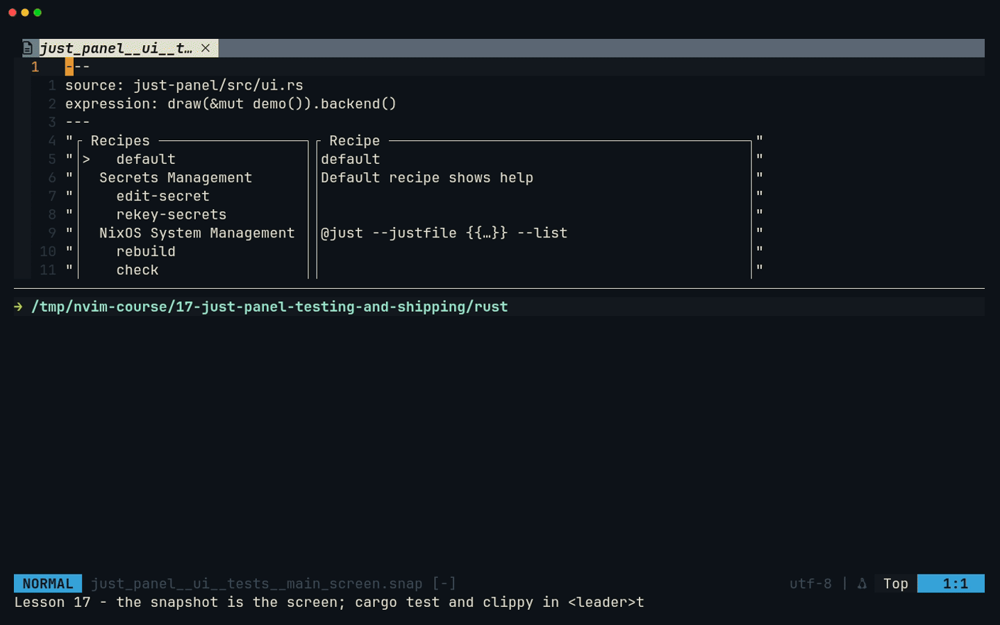
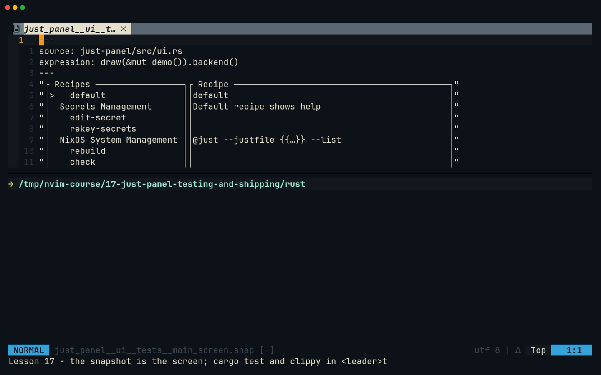
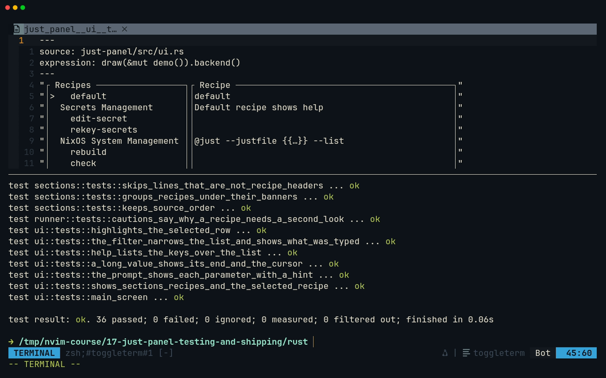
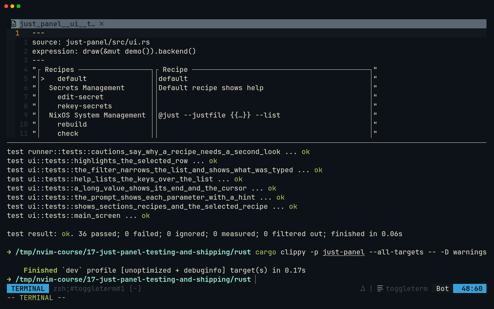

# Lesson 17 — just-panel: testing and shipping

**Last Updated**: 27/09/2026
**Version**: 1.0.0
**Maintained By**: Development Team
**Language**: British English (en_GB)
**Timezone**: Europe/London

---

just-panel works; this lesson makes it trustworthy and puts it on your `PATH`. You test every key without a
terminal, draw whole screens into ratatui's in-memory backend, and pin the first screen with an insta
snapshot, accepted without `cargo-insta`, which this config does not install. Clippy then checks the tests too.
You write the crate's README and package it the way every other tool in `rust/` is packaged: an entry in
`rust/nix/default.nix`, `git add` so the flake can see the files, `nix build .#just-panel`, then `just rebuild`.
From then on `just-panel` is a command on laptop-intel. In Neovim you run the test loop from `:TermExec`,
walk references with `grr` and the quickfix list, review a snapshot change in diff mode, and split one staged
change into two commits in Neogit.

**Part**: 6 — Build just-panel · **Time**: ~120 min · **Previous**: [Lesson 16 — just-panel: running recipes](16-JUST-PANEL-RUNNING-RECIPES.md) · **Next**: [Lesson 18 — session-browser: TUI skeleton](18-SESSION-BROWSER-TUI-SKELETON.md)

## Objectives

- Test key handling with no terminal: build the `App` from compiled-in fixtures and press keys at it.
- Draw the whole UI into ratatui's `TestBackend`, and assert on the text, on cell styles and on the cursor.
- Add an insta snapshot, accept it without `cargo-insta`, and review a changed snapshot in Neovim's diff mode.
- Keep `cargo clippy --all-targets -- -D warnings` clean, test code included.
- Write the crate's README.
- Package the crate with `buildWorkspaceCrate`, make the flake see it, build it with Nix, install it with
  `just rebuild`, and explain why tests that run `just`, need a terminal or read `$HOME` would break that
  build.
- Optionally, give it a Hyprland key.

## Before you start

- You have finished [Lesson 16](16-JUST-PANEL-RUNNING-RECIPES.md): milestone **JP7** is committed and
  tagged `course/jp7`, and `git status --short rust/` prints nothing.
- The checks pass:

  ```bash
  # in ~/Repos/personal/nix-config/rust
  cargo test -p just-panel
  cargo clippy -p just-panel --all-targets -- -D warnings
  cargo fmt -p just-panel --check
  ```

  Expect `test result: ok. 12 passed`, plus the tests you kept in lesson 13 (16 if you kept all four). This
  lesson adds 24, so its 36 is your 40 in that case. Clippy and the format check print nothing else.
- You are on NixOS laptop-intel with the **full** configuration: `just` and every tool from `rust/` are only
  installed there (modules/core/common.nix:88, :96-97), and step 11 runs `sudo`.
- Start Neovim in `rust/`, as in lessons 14 to 16:

  ```bash
  # in a Kitty terminal
  cd ~/Repos/personal/nix-config/rust && nvim just-panel/src/app.rs
  ```

## Keys in this lesson

| Keys | Mode | Action | Where it comes from |
|---|---|---|---|
| `:TermExec cmd="…"` | c | Run a command in the bottom terminal and stay where you are | toggleterm default |
| `<leader>t` | n | Toggle the bottom terminal | config (neovim.nix:27) |
| `<C-\><C-n>` | t (and any mode) | To Normal mode; a no-op when already there | Neovim default |
| `i` | n (terminal) | Back to Terminal mode | Neovim default |
| `<leader>o` | n | Toggle the Aerial outline | config (neovim.nix:26) |
| `{` / `}`, `<CR>` | n (Aerial) | Previous / next symbol, jump to it | aerial default |
| `gd` | n | Go to definition | config (LSP buffer-local, neovim.nix:340) |
| `grr` | n | References, in the quickfix list | Neovim 0.12 default |
| `]q` / `[q` | n | Next / previous quickfix entry | Neovim 0.12 default |
| `:cclose` | c | Close the quickfix window | Neovim default |
| `:vert diffsplit {file}` | c | Compare the current file with another, side by side | Neovim default |
| `]c` / `[c` | n (diff) | Next / previous change | Neovim default |
| `:diffoff!` | c | Leave diff mode in every window | Neovim default |
| `:noautocmd w` | c | Save without format-on-save | Neovim default |
| `<C-s>` | n | Save (Markdown goes through prettier) | config (neovim.nix:64, :951) |
| `<leader>xx` | n | All diagnostics in Trouble | config (neovim.nix:55) |
| `<leader>gg` | n | Neogit | config (neovim.nix:35) |
| `s` / `u`, `c` `c`, `<c-c><c-c>` | n (Neogit) | Stage / unstage, commit popup and commit, submit | neogit default |

## Walkthrough

Steps 1 to 6 explain what the milestone builds and why. The [milestone](#milestone-jp8-tested-documented-installed)
then does it.



[MP4](../media/17-just-panel-testing-and-shipping/17-just-panel-testing-and-shipping.mp4)

### 1. Where the tests run: in the Nix sandbox, on every build

`rust/nix/default.nix` builds each crate with `rustPlatform.buildRustPackage`, and its check phase runs the
crate's tests: line 40, `cargoTestFlags = [ "--package" pname ]`, turns into `cargo test --package just-panel`,
in release mode. That happens inside the Nix sandbox on every `nix build` and every `just rebuild` that
rebuilds the crate. The sandbox has no network, no terminal, a `$HOME` that does not exist, and no `just` on
its `PATH`. It also only has the files under `rust/` (the whole workspace is the build's source), and only
those git knows about.

So every test in this lesson follows three rules. They never run `just`: commands are built and inspected
with `Command::get_program` and `get_args`, never started. They never need a terminal: drawing goes to
`TestBackend`. They never read files at run time: the fixtures are compiled in with `include_str!` from
`tests/fixtures/`, the copies of `docs/NEOVIM-COURSE/fixtures/just/` you made in lessons 10 and 11.

**Try it.** `:e nix/default.nix`, then `/cargoTestFlags` and `<CR>`. Then, in `<leader>t`:

```bash
# in ~/Repos/personal/nix-config/rust
setsid -w cargo test -p just-panel < /dev/null
```

**What you should see:** line 40 of `default.nix`, and your tests (12, or 16) passing with no controlling
terminal and no stdin: `setsid` starts cargo in a new session, detached from the terminal. That imitates two
of the sandbox's conditions; the Nix build in milestone step 9 is the real test.

### 2. Testing state: keys in, state out

`app.rs` is already pure: `handle_key` takes a `KeyEvent` and returns an `Option<Action>`. A test needs only
an `App` to press keys at, and the milestone's `tests` module in `app.rs` starts with three helpers:

- `demo()` builds the `App` from the two compiled-in fixtures, exactly as `main` does from `just --dump`.
- `press(app, code)` sends one key with no modifiers; `type_keys(app, "/lint")` sends a string, one character
  at a time.

The module is `pub mod tests` (under `#[cfg(test)]`, so it exists only in test builds) so that the drawing
tests in `ui.rs` can reuse the same helpers as `crate::app::tests::{demo, press, type_keys}`.

One trick is worth knowing: `finished` takes a real `ExitStatus`, and a test cannot run a process to get one.
`ExitStatus::from_raw(130 << 8)` (from `std::os::unix::process::ExitStatusExt`) builds one: a raw wait
status keeps the exit code in its second byte.

**Try it.** `<leader>o` in `app.rs`: the outline's last entries after the milestone are the `tests` module and
its functions; `}` and `{` walk the symbols, `<CR>` jumps. Before the milestone, look instead at how the
existing tests load their fixtures: `:e just-panel/src/sections.rs`, `/include_str` and `<CR>`.

**What you should see:** `const JUSTFILE: &str = include_str!("../tests/fixtures/justfile");` in the
`tests` module of `sections.rs`: the pattern every new test module uses.

### 3. Testing the screen with `TestBackend`

`ui::render` draws into whatever `Frame` it is given. In a test, the frame comes from
`Terminal::new(TestBackend::new(80, 24))`: an in-memory terminal of 80 columns and 24 rows. After
`terminal.draw(|frame| render(frame, app))`:

- `terminal.backend().to_string()` gives the screen as text, one quoted row per line. Good for "the help
  popup shows `run the selected recipe`".
- The text has **no styles**. To check the highlight, read a cell: `buffer[(1, 1)].modifier` must contain
  `Modifier::REVERSED` on the selected row and not on the next one.
- `terminal.get_cursor_position()` says where the real cursor would be, which is how a test proves that
  the prompt keeps its cursor inside the popup when the value is 103 characters long.

The size is fixed on purpose: a test that depended on the size of your terminal would pass for you and fail
in the sandbox.

### 4. Snapshot tests with insta, without `cargo-insta`

`insta::assert_snapshot!(draw(&mut demo()).backend())` compares the whole first screen with a file that is
committed next to the code: `just-panel/src/snapshots/just_panel__ui__tests__main_screen.snap`. The name is
the module path (`just_panel::ui::tests`) and the test name, joined with `__`.

The first run has no file to compare with. insta writes what it saw to a `.snap.new` file next to it, prints
the new screen, says `` To update snapshots run `cargo insta review` ``, and fails the test. That is by design.

`cargo-insta` is not installed here: nixpkgs has it (`cargo-insta` 1.48.0 at the flake's pinned revision), but
nothing in this repository declares it. You do not need it:

1. Read the `.snap.new` in Neovim. It is plain text: the screen, in quotes.
2. When it is right, `INSTA_UPDATE=always cargo test -p just-panel` writes the `.snap` file.
3. `cargo test -p just-panel` once more: it passes, and insta deletes the leftover `.snap.new`.

After a deliberate layout change, the same failing run leaves a `.snap.new` beside the old `.snap`, and
`:vert diffsplit` shows exactly which rows changed (drill 2).

> **Tip:** if you want `cargo-insta` after all, `nix shell nixpkgs#cargo-insta` gives you a shell with it
> (verify on laptop-intel that `nixpkgs` resolves to the flake's pinned revision there). Its review command
> is `cargo insta review`, run in `rust/`, or `cargo insta test -p just-panel --review`. `review`
> itself has no `-p` option. To keep it, add `cargo-insta` to the `home.packages` list in `home/stages/dev.nix`.

In Nix, the same logic protects you: a `.snap` file that git does not track is missing from the build's
source, the snapshot test fails, and so does the build. The same goes for a `.snap` you forgot to update.

### 5. Clippy on tests

`cargo clippy -p just-panel --all-targets -- -D warnings` lints every target, and `--all-targets` includes
the `#[cfg(test)]` modules. `-D warnings` turns every warning into an error, so a sloppy test fails the check
as surely as sloppy production code. rust-analyzer runs clippy whenever you save (neovim.nix:427-431), so
Trouble (`<leader>xx`) shows test-code lints before you ever run the command.

### 6. How a crate reaches your `PATH`

Four files are involved, and you edit one of them:

1. `rust/nix/default.nix` defines one package per crate with `buildWorkspaceCrate` (lines 29-47): the whole
   `rust/` folder is the source, and `rust/Cargo.lock` pins every dependency. **You add `just-panel` here.**
2. `flake.nix:74` imports that file, and `flake.nix:84` publishes every entry as a flake package, so
   `nix build .#just-panel` works.
3. `modules/core/base-configuration.nix:22-23` adds them to `pkgs` through an overlay.
4. `modules/core/common.nix:96-97` installs every flake package on hosts with the full configuration. The
   same file installs `just` (line 88), which the panel runs, so no wrapper is needed.

Two consequences:

- **The flake only sees files git tracks.** A new file that is not at least staged (`git add`) is not part of
  the build: for just-panel, a missing snapshot fails the tests, and a missing source file fails the
  compile. Changes to files git already tracks are seen without `git add`.
- **One lock file for every tool.** just-panel's dependencies (ratatui in lesson 14, insta in this lesson)
  grew `rust/Cargo.lock` from 332 to 425 crates and gave nine crates the other tools already use newer
  versions (bitflags and time among them). Every tool is built from the same `rust/` source and lock, so the
  first rebuild after this capstone rebuilds all of them. Run the whole workspace's tests once
  (`just test-rust`) so that a surprise in another tool shows up there and not halfway through
  `just rebuild`.

## Gotchas in this config

- **`cargo insta review -p …` does not exist.** cargo-insta 1.48.0 answers it with
  `error: unexpected argument '-p' found`. Only `cargo insta test` takes `-p`, so the README uses
  `cargo insta test -p just-panel --review`; plain `cargo insta review` in `rust/` works too.
- **`INSTA_UPDATE=always` leaves the `.snap.new` behind** until the next passing run deletes it. Do not commit
  a `.snap.new`.
- **Nothing untracked reaches the Nix build.** `git add` new files before `nix build`; `git status --short`
  shows what is still `??`.
- **`warning: Git tree … is dirty`** from `nix build` just means there are uncommitted changes. They are
  included; untracked files are not.
- **Saving the README with `<C-s>` runs prettier** (neovim.nix:951): it adds a blank line under the `---` and
  pads the tables into columns. Step 7 saves with `:noautocmd w` to keep the file exactly as shown. If
  prettier got there first, its version is fine too (it is what Zed would produce); it only differs in
  whitespace.
- **Save `Cargo.toml` and `default.nix` with `:noautocmd w`.** TOML and Nix fall through to their language
  servers for formatting (neovim.nix:933-936, :974-977), which may rewrite more than your lines.
- **`just rebuild` rebuilds every Rust tool** the first time, because the shared source and lock changed. It
  takes a while and asks for your password.
- **After `just rebuild`, `just-panel` opens the real justfile.** In zsh, `$JUST_JUSTFILE` points at it
  (home/modules/shell.nix:79). `Enter` runs real recipes: the confirmations for sudo and session recipes are
  there for exactly this.
- **Launched from Hyprland, it may not find a justfile.** `JUST_JUSTFILE` is a zsh session variable, so a
  program started by a key binding probably does not have it (verify on laptop-intel). Pass `--justfile`, as
  step 13 does.
- **`:TermExec` targets the first ordinary terminal.** It never sends to the hidden Codex terminal
  (`<leader>co`), whatever its number.

## Drills

1. Run only the tests with `prompt` in their name, from the bottom terminal, without leaving the editor.
   <details><summary>Answer</summary>

   `:TermExec cmd="cargo test -p just-panel prompt"`. The last argument filters by name: 3 tests run
   (`the_prompt_starts_with_defaults_and_runs_what_was_typed`, `a_blank_required_parameter_keeps_the_prompt_open`,
   `the_prompt_shows_each_parameter_with_a_hint`) and the rest are filtered out.
   </details>

2. In `ui.rs`, change the status hint `q quit` to `q exit`, save, and run the tests. Which fails, and how do
   you see the difference in Neovim? Then put it back.
   <details><summary>Answer</summary>

   Only `ui::tests::main_screen` fails; insta writes
   `just-panel/src/snapshots/just_panel__ui__tests__main_screen.snap.new`. `:e` that file, then
   `:vert diffsplit just-panel/src/snapshots/just_panel__ui__tests__main_screen.snap`. `]c` jumps to each
   difference: the `assertion_line:` that only a `.snap.new` carries in its header, then the one changed
   row of the screen, the last. `:diffoff!` and `:only` tidy up. Undo the change in `ui.rs` (`u`, then
   `<C-s>`) and run the tests again: they pass, and the passing run deletes the `.snap.new`.
   </details>

3. Why does `highlights_the_selected_row` read cells from the buffer instead of checking the snapshot?
   <details><summary>Answer</summary>

   The snapshot is `TestBackend`'s text: symbols only, no colours or modifiers. A highlight is a style, so
   only the `Cell` (`buffer[(x, y)].modifier`) can show it.
   </details>

4. You add `tests/fixtures/extra.json`, `include_str!` it in a test, and `cargo test` passes. `nix build
   .#just-panel` fails to compile. Why?
   <details><summary>Answer</summary>

   The file is untracked, so it is not in the flake's copy of the source and `include_str!` cannot find it.
   `git add rust/just-panel/tests/fixtures/extra.json` and build again.
   </details>

5. A new test calls `justfile::load(Path::new("../../justfile"))` and passes on your machine. What happens in
   `nix build`?
   <details><summary>Answer</summary>

   It fails, and the build with it: `load` runs `just`, which is not on the sandbox's `PATH`, and
   `../../justfile` is outside `rust/`, so it is not in the source either. Test with the compiled-in
   fixtures instead.
   </details>

6. List every use of `demo` and step through them.
   <details><summary>Answer</summary>

   In `app.rs`, cursor on `demo` in `pub fn demo()`, then `grr`: the quickfix list opens with the calls in
   both test modules. `]q` and `[q` step through them from any window; `:cclose` closes the list.
   </details>

7. After `just rebuild` you add a Hyprland key that runs `kitty -e just-panel`, and the window shows
   `cannot read …/justfile` and closes. Why, and what is the fix?
   <details><summary>Answer</summary>

   Started by Hyprland, not by zsh, it has no `JUST_JUSTFILE`, so it looked for `./justfile` in Hyprland's
   working directory. Pass the path: `kitty -e just-panel --justfile ~/Repos/personal/nix-config/justfile`.
   </details>

## Milestone JP8: tested, documented, installed

**Goal:** 24 new tests (12 for state, 5 for the runner, 7 for the screen, one of them an insta snapshot), a
clean clippy run over all targets, a README, and just-panel built by Nix and installed on laptop-intel. No
production code changes: the tests are appended to the ends of `app.rs`, `runner.rs` and `ui.rs`.

> **Tip:** as in lesson 16, type the code or paste it (`p` in Normal mode). Each test module goes at the very
> end of its file: `G` jumps there, and `o` opens a line below. If a completion menu is open when you press
> `<CR>`, `<C-e>` first.

### Step 1: insta in both manifests

`:e Cargo.toml` (the workspace's). `G` jumps to the last line, `notify-rust = "4.10"`. Add a blank line and a
new group below it, then `:noautocmd w`:

```toml
notify-rust = "4.10"

# Testing
insta = "1.48"
```

Then `:e just-panel/Cargo.toml`, add the `[dev-dependencies]` table at the end, and `:noautocmd w`. The whole file:

```toml
[package]
name = "just-panel"
version.workspace = true
edition.workspace = true
authors.workspace = true
license.workspace = true

[[bin]]
name = "just-panel"
path = "src/main.rs"

[dependencies]
anyhow = { workspace = true }
clap = { workspace = true, features = ["env"] }
ratatui = { workspace = true }
serde = { workspace = true }
serde_json = { workspace = true }
signal-hook = { workspace = true }

[dev-dependencies]
insta = { workspace = true }
```

### Step 2: state tests in `app.rs`

`:e just-panel/src/app.rs`, `G`, `o`, and append the module after a blank line:

```rust
#[cfg(test)]
pub mod tests {
    use std::os::unix::process::ExitStatusExt;

    use super::*;

    /// The panel for the course's demo justfile, built from the compiled-in
    /// fixtures: no `just`, no terminal, no files read at run time.
    pub fn demo() -> App {
        let recipes = crate::justfile::parse(include_str!("../tests/fixtures/dump.json"));
        let sections = crate::sections::parse(include_str!("../tests/fixtures/justfile"));
        App::new(recipes.unwrap(), sections)
    }

    pub fn press(app: &mut App, code: KeyCode) -> Option<Action> {
        app.handle_key(KeyEvent::new(code, KeyModifiers::NONE))
    }

    /// Presses each character of `keys` in turn, returning the last action.
    pub fn type_keys(app: &mut App, keys: &str) -> Option<Action> {
        let mut action = None;
        for c in keys.chars() {
            action = press(app, KeyCode::Char(c));
        }
        action
    }

    fn selected(app: &App) -> &str {
        &app.selected().unwrap().recipe.name
    }

    fn visible(app: &App) -> Vec<String> {
        app.rows
            .iter()
            .map(|row| match row {
                Row::Header(title) => format!("# {title}"),
                Row::Recipe(index) => app.entries[*index].recipe.name.clone(),
            })
            .collect()
    }

    #[test]
    fn lists_public_recipes_in_source_order_under_headers() {
        let app = demo();
        let rows = visible(&app);
        assert_eq!(
            rows[..4],
            [
                "default",
                "# Secrets Management",
                "edit-secret",
                "rekey-secrets"
            ]
        );
        assert!(
            !rows.contains(&"_stamp".to_string()),
            "private recipes are hidden"
        );
        assert_eq!(selected(&app), "default");
    }

    #[test]
    fn moving_skips_headers_and_stops_at_the_ends() {
        let mut app = demo();
        type_keys(&mut app, "j");
        assert_eq!(selected(&app), "edit-secret");
        type_keys(&mut app, "kk");
        assert_eq!(selected(&app), "default");
        type_keys(&mut app, "G");
        assert_eq!(selected(&app), "snapshot");
        press(&mut app, KeyCode::Down);
        assert_eq!(selected(&app), "snapshot");
        type_keys(&mut app, "g");
        assert_eq!(selected(&app), "default");
    }

    #[test]
    fn filter_keeps_matching_recipes_under_their_headers() {
        let mut app = demo();
        type_keys(&mut app, "/LINT");
        assert_eq!(app.mode, Mode::Filter);
        assert_eq!(
            visible(&app),
            ["# Development", "lint", "lint-rust", "lint-nix"]
        );
        assert_eq!(selected(&app), "lint");

        press(&mut app, KeyCode::Enter);
        assert_eq!(app.mode, Mode::Normal);
        assert_eq!(app.filter, "LINT", "Enter keeps the filter");
        type_keys(&mut app, "j");

        assert_eq!(
            press(&mut app, KeyCode::Esc),
            None,
            "Esc clears before it quits"
        );
        assert!(app.filter.is_empty());
        assert_eq!(
            selected(&app),
            "lint-rust",
            "the selection survives clearing"
        );
        assert_eq!(press(&mut app, KeyCode::Esc), Some(Action::Quit));
    }

    #[test]
    fn a_filter_can_match_the_description() {
        let mut app = demo();
        type_keys(&mut app, "/screen");
        assert_eq!(visible(&app), ["# Session Control", "lock"]);
        type_keys(&mut app, "zzz");
        assert!(app.rows.is_empty());
        assert!(app.selected().is_none());
        press(&mut app, KeyCode::Esc);
        assert_eq!(app.mode, Mode::Normal);
        assert_eq!(selected(&app), "default");
    }

    #[test]
    fn help_closes_on_any_key_and_quitting_works_everywhere() {
        let mut app = demo();
        type_keys(&mut app, "?");
        assert_eq!(app.mode, Mode::Help);
        assert_eq!(type_keys(&mut app, "q"), None, "q only closes the help");
        assert_eq!(app.mode, Mode::Normal);

        type_keys(&mut app, "/li");
        let ctrl_c = KeyEvent::new(KeyCode::Char('c'), KeyModifiers::CONTROL);
        assert_eq!(app.handle_key(ctrl_c), Some(Action::Quit));
        assert_eq!(type_keys(&mut demo(), "q"), Some(Action::Quit));
    }

    #[test]
    fn keys_with_ctrl_or_alt_are_not_plain_keys() {
        let mut app = demo();
        type_keys(&mut app, "/lint");
        let ctrl_u = KeyEvent::new(KeyCode::Char('u'), KeyModifiers::CONTROL);
        assert_eq!(app.handle_key(ctrl_u), None);
        assert_eq!(app.filter, "lint", "Ctrl+U types nothing");

        press(&mut app, KeyCode::Enter);
        let ctrl_q = KeyEvent::new(KeyCode::Char('q'), KeyModifiers::CONTROL);
        assert_eq!(app.handle_key(ctrl_q), None, "Ctrl+Q does not quit");
        let alt_j = KeyEvent::new(KeyCode::Char('j'), KeyModifiers::ALT);
        app.handle_key(alt_j);
        assert_eq!(selected(&app), "lint", "Alt+J does not move");
    }

    #[test]
    fn enter_runs_a_recipe_without_parameters_at_once() {
        let mut app = demo();
        type_keys(&mut app, "/check");
        press(&mut app, KeyCode::Enter);
        let run = press(&mut app, KeyCode::Enter);
        let expected = Run {
            recipe: "check".to_string(),
            args: Vec::new(),
            yes: false,
        };
        assert_eq!(run, Some(Action::Run(expected)));
    }

    #[test]
    fn the_prompt_starts_with_defaults_and_runs_what_was_typed() {
        let mut app = demo();
        type_keys(&mut app, "/fuzz");
        press(&mut app, KeyCode::Enter);
        press(&mut app, KeyCode::Enter);
        let Mode::Prompt(prompt) = &app.mode else {
            panic!("expected the prompt, got {:?}", app.mode);
        };
        assert_eq!(prompt.values, ["", "5"]);

        type_keys(&mut app, "demo");
        let Some(Action::Run(run)) = press(&mut app, KeyCode::Enter) else {
            panic!("expected a run");
        };
        assert_eq!(run.to_string(), "just fuzz demo 5");
        assert_eq!(app.mode, Mode::Normal, "the prompt closes");
    }

    #[test]
    fn a_blank_required_parameter_keeps_the_prompt_open() {
        let mut app = demo();
        type_keys(&mut app, "/edit");
        press(&mut app, KeyCode::Enter);
        press(&mut app, KeyCode::Enter);
        assert_eq!(press(&mut app, KeyCode::Enter), None);
        let Mode::Prompt(prompt) = &app.mode else {
            panic!("expected the prompt, got {:?}", app.mode);
        };
        assert_eq!(prompt.error.as_deref(), Some("SECRET is required"));
    }

    #[test]
    fn sudo_recipes_wait_for_y() {
        let mut app = demo();
        type_keys(&mut app, "/rebuild");
        press(&mut app, KeyCode::Enter);
        press(&mut app, KeyCode::Enter);
        type_keys(&mut app, "--boot");
        assert_eq!(press(&mut app, KeyCode::Enter), None);
        let Mode::Confirm(confirm) = &app.mode else {
            panic!("expected a confirmation, got {:?}", app.mode);
        };
        assert_eq!(confirm.run.to_string(), "just rebuild --boot");
        assert!(confirm.reasons[0].starts_with("uses sudo"));

        assert_eq!(press(&mut app, KeyCode::Enter), None, "Enter is not yes");
        assert_eq!(type_keys(&mut app, "n"), None);
        assert_eq!(app.mode, Mode::Normal);
    }

    #[test]
    fn a_confirm_attribute_is_asked_once_then_passed_on_as_yes() {
        let mut app = demo();
        type_keys(&mut app, "/update");
        press(&mut app, KeyCode::Enter);
        press(&mut app, KeyCode::Enter);
        let Some(Action::Run(run)) = type_keys(&mut app, "y") else {
            panic!("expected a run after y");
        };
        assert!(run.yes);
        assert_eq!(app.mode, Mode::Normal);
    }

    #[test]
    fn finished_records_the_exit_code() {
        let mut app = demo();
        // A raw wait status holds the exit code in its second byte.
        app.finished("fuzz".to_string(), ExitStatus::from_raw(130 << 8));
        let expected = LastRun {
            recipe: "fuzz".to_string(),
            code: Some(130),
        };
        assert_eq!(app.last_run, Some(expected));
    }
}
```

`<C-s>`. Run them without leaving the file:

```vim
:TermExec cmd="cargo test -p just-panel app::"
```

**What you should see:** the bottom terminal opens, runs the command and your cursor stays in `app.rs`. The
last line is `test result: ok. 12 passed; …; 12 filtered out`: the filter `app::` keeps the new `app::tests`
tests and leaves out the 12 parser tests from lessons 10 and 11 (`16 filtered out` with lesson 13's tests).

### Step 3: runner tests in `runner.rs`

`:e just-panel/src/runner.rs`, `G`, `o`, append:

```rust
#[cfg(test)]
mod tests {
    use super::*;

    const DUMP: &str = include_str!("../tests/fixtures/dump.json");

    fn recipe(name: &str) -> Recipe {
        let recipes = justfile::parse(DUMP).unwrap();
        recipes.into_iter().find(|r| r.name == name).unwrap()
    }

    fn values(values: &[&str]) -> Vec<String> {
        values.iter().map(|value| value.to_string()).collect()
    }

    #[test]
    fn arguments_follow_the_parameters() {
        let fuzz = recipe("fuzz").parameters;
        assert_eq!(
            arguments(&fuzz, &values(&["demo", "5"])).unwrap(),
            ["demo", "5"]
        );
        assert_eq!(
            arguments(&fuzz, &values(&[" demo ", ""])).unwrap(),
            ["demo"]
        );
        assert_eq!(
            arguments(&fuzz, &values(&["", "5"])).unwrap_err(),
            "TARGET is required"
        );

        let rebuild = recipe("rebuild").parameters;
        assert_eq!(
            arguments(&rebuild, &values(&["--boot  --fast"])).unwrap(),
            ["--boot", "--fast"]
        );
        assert!(arguments(&rebuild, &values(&[""])).unwrap().is_empty());
    }

    #[test]
    fn a_blank_default_before_a_filled_in_value_keeps_its_place() {
        let optional = |name: &str| Parameter {
            name: name.to_string(),
            kind: ParameterKind::Singular,
            default: Some("x".into()),
        };
        let parameters = [optional("A"), optional("B")];
        assert_eq!(
            arguments(&parameters, &values(&["", "b"])).unwrap(),
            ["", "b"]
        );
        assert!(arguments(&parameters, &values(&["", ""]))
            .unwrap()
            .is_empty());
    }

    #[test]
    fn plus_parameters_need_a_value() {
        let files = [Parameter {
            name: "FILES".to_string(),
            kind: ParameterKind::Plus,
            default: None,
        }];
        assert_eq!(
            arguments(&files, &values(&[" "])).unwrap_err(),
            "FILES needs at least one value"
        );
        assert_eq!(arguments(&files, &values(&["a b"])).unwrap(), ["a", "b"]);
    }

    #[test]
    fn cautions_say_why_a_recipe_needs_a_second_look() {
        assert!(cautions(&recipe("check")).is_empty());
        assert_eq!(
            cautions(&recipe("rebuild")),
            ["uses sudo: you will be asked for your password"]
        );
        assert_eq!(
            cautions(&recipe("update")),
            ["Update every flake input? (demo: nothing changes)"]
        );
        assert_eq!(cautions(&recipe("lock")), ["locks the screen"]);
        assert_eq!(
            cautions(&recipe("rekey-secrets")),
            ["re-encrypts every secret"]
        );
        assert_eq!(
            cautions(&recipe("clean-cache")),
            ["deletes build output or old generations"]
        );
    }

    /// Checks the command without running it: `get_args` only reads it back.
    #[test]
    fn yes_goes_before_the_recipe_and_its_arguments_after() {
        let run = Run {
            recipe: "rebuild".to_string(),
            args: values(&["--boot"]),
            yes: true,
        };
        let command = command(Path::new("/demo/justfile"), &run);
        assert_eq!(command.get_program(), "just");
        let args: Vec<_> = command.get_args().collect();
        assert_eq!(
            args,
            [
                "--justfile",
                "/demo/justfile",
                "--working-directory",
                "/demo",
                "--yes",
                "rebuild",
                "--boot"
            ]
        );
    }
}
```

`<C-s>`, then `:TermExec cmd="cargo test -p just-panel runner::"`: 5 passed. The last test checks the exact
argv, `--yes` before the recipe name, without running anything.

### Step 4: screen tests in `ui.rs`

`:e just-panel/src/ui.rs`, `G`, `o`, append:

```rust
#[cfg(test)]
mod tests {
    use ratatui::backend::TestBackend;
    use ratatui::crossterm::event::KeyCode;
    use ratatui::style::Modifier;
    use ratatui::Terminal;

    use super::*;
    use crate::app::tests::{demo, press, type_keys};

    /// Draws `app` into an in-memory terminal: no TTY needed.
    fn draw(app: &mut App) -> Terminal<TestBackend> {
        let mut terminal = Terminal::new(TestBackend::new(80, 24)).unwrap();
        terminal.draw(|frame| render(frame, app)).unwrap();
        terminal
    }

    /// The screen as text, one quoted row per line. Colours and other
    /// styles are not included.
    fn screen(app: &mut App) -> String {
        draw(app).backend().to_string()
    }

    #[test]
    fn shows_sections_recipes_and_the_selected_recipe() {
        let screen = screen(&mut demo());
        assert!(screen.contains("Secrets Management"));
        assert!(screen.contains("> "), "the selection marker is drawn");
        assert!(screen.contains("Default recipe shows help"));
        assert!(screen.contains("Enter run"));
    }

    /// Text alone cannot show a highlight, so read the style of a cell.
    #[test]
    fn highlights_the_selected_row() {
        let mut app = demo();
        let terminal = draw(&mut app);
        let buffer = terminal.backend().buffer();
        // Row 1 is the first row inside the border, where `default` is.
        assert!(buffer[(1, 1)].modifier.contains(Modifier::REVERSED));
        assert!(!buffer[(1, 2)].modifier.contains(Modifier::REVERSED));
    }

    #[test]
    fn the_filter_narrows_the_list_and_shows_what_was_typed() {
        let mut app = demo();
        type_keys(&mut app, "/lint");
        let screen = screen(&mut app);
        assert!(screen.contains("/lint"));
        assert!(screen.contains("lint-rust"));
        assert!(!screen.contains("rebuild"));
    }

    #[test]
    fn help_lists_the_keys_over_the_list() {
        let mut app = demo();
        type_keys(&mut app, "?");
        let screen = screen(&mut app);
        assert!(screen.contains(" Keys "));
        assert!(screen.contains("run the selected recipe"));
        assert!(
            screen.contains("Enter keeps it, Esc clears it"),
            "the popup fits its longest line"
        );
    }

    #[test]
    fn the_prompt_shows_each_parameter_with_a_hint() {
        let mut app = demo();
        type_keys(&mut app, "G");
        press(&mut app, KeyCode::Enter);
        let screen = screen(&mut app);
        assert!(screen.contains(" just snapshot "));
        assert!(screen.contains("SUBVOL"));
        assert!(screen.contains(r#"default """#));
    }

    /// Typing happens at the end of a value, so a value too long for the
    /// prompt shows its end, with the cursor after it.
    #[test]
    fn a_long_value_shows_its_end_and_the_cursor() {
        let mut app = demo();
        type_keys(&mut app, "G");
        press(&mut app, KeyCode::Enter);
        type_keys(&mut app, &"x".repeat(100));
        type_keys(&mut app, "END");
        let mut terminal = draw(&mut app);
        let cursor = terminal.get_cursor_position().unwrap();
        let buffer = terminal.backend().buffer();
        assert_eq!(buffer[(cursor.x - 1, cursor.y)].symbol(), "D");
        // The prompt is 64 columns wide and centred in 80, so its right
        // border is in column 71.
        assert!(cursor.x < 71, "the cursor stays inside the prompt");
    }

    /// The whole first screen, compared with the committed file in
    /// `src/snapshots/`. After a deliberate change to the layout, review the
    /// new picture with `cargo insta review` (or rerun with
    /// `INSTA_UPDATE=always`) and commit the updated `.snap` file.
    #[test]
    fn main_screen() {
        insta::assert_snapshot!(draw(&mut demo()).backend());
    }
}
```

`<C-s>`. With the cursor on `demo` in `use crate::app::tests::{demo, press, type_keys};`, `gd` jumps to the
helper in `app.rs`; `<C-o>` comes back.

### Step 5: the first run, and the snapshot

```bash
# in ~/Repos/personal/nix-config/rust
cargo test -p just-panel
```

**What you should see:** 35 tests pass and `ui::tests::main_screen` fails. Above the failure, insta prints
`stored new snapshot …/src/snapshots/just_panel__ui__tests__main_screen.snap.new`, a summary headed
`Snapshot Summary` with `+new results`, and `` To update snapshots run `cargo insta review` ``. The run ends with
`test result: FAILED. 35 passed; 1 failed`.

Open the new file: `:e just-panel/src/snapshots/just_panel__ui__tests__main_screen.snap.new`. It must match
this screen row for row; only its header differs, with an extra `assertion_line:` line. This is the file you are
about to commit:

```text
---
source: just-panel/src/ui.rs
expression: draw(&mut demo()).backend()
---
"┌ Recipes ─────────────────┐┌ Recipe ──────────────────────────────────────────┐"
"│>   default               ││default                                           │"
"│  Secrets Management      ││Default recipe shows help                         │"
"│    edit-secret           ││                                                  │"
"│    rekey-secrets         ││                                                  │"
"│  NixOS System Management ││@just --justfile {{…}} --list                     │"
"│    rebuild               ││                                                  │"
"│    check                 ││                                                  │"
"│    update                ││                                                  │"
"│  Development             ││                                                  │"
"│    fuzz                  ││                                                  │"
"│    lint                  ││                                                  │"
"│    lint-rust             ││                                                  │"
"│    lint-nix              ││                                                  │"
"│  Cleanup                 ││                                                  │"
"│    clean-cache           ││                                                  │"
"│  Session Control         ││                                                  │"
"│    lock                  ││                                                  │"
"│  Storage Management / Bac││                                                  │"
"│    backup-status         ││                                                  │"
"│  Storage Management / Sna││                                                  │"
"│    snapshot              ││                                                  │"
"└──────────────────────────┘└──────────────────────────────────────────────────┘"
"Enter run · / filter · ? help · q quit                                          "
```

When it matches, accept it and run the tests once more:

```bash
# in ~/Repos/personal/nix-config/rust
INSTA_UPDATE=always cargo test -p just-panel
cargo test -p just-panel
ls just-panel/src/snapshots
```

**What you should see:** the first command prints `updated snapshot …main_screen.snap` and `36 passed`. The
second passes too, and `ls` then lists only `just_panel__ui__tests__main_screen.snap`: the passing run
deleted the `.snap.new`.





### Step 6: clippy and format

```bash
# in ~/Repos/personal/nix-config/rust
cargo clippy -p just-panel --all-targets -- -D warnings
cargo fmt -p just-panel --check
```

**What you should see:** clippy checks the crate and prints only its `Finished` line; the format check prints
nothing.



### Step 7: the README

`:e just-panel/README.md` and write:

````markdown
# just-panel

**Last Updated**: 27/09/2026
**Version**: 0.1.0
**Maintained By**: Development Team
**Language**: British English (en_GB)
**Timezone**: Europe/London

---
A terminal control panel for a justfile. It lists the recipes under the justfile's own `# ====`
section banners, shows what the selected recipe does, and runs it in the real terminal, with a
prompt for parameters and a confirmation step for recipes that use sudo or end your session.

Built with [ratatui](https://ratatui.rs) 0.30 as the Rust capstone of the Neovim course
(`docs/NEOVIM-COURSE/`, lessons 06 to 17).

## Usage

```bash
just-panel                                  # ./justfile, or $JUST_JUSTFILE when it is set
just-panel --justfile ~/Repos/personal/nix-config/justfile
just-panel -f docs/NEOVIM-COURSE/fixtures/just/justfile    # the harmless demo justfile
```

The justfile is resolved from `--justfile` (`-f`), then `$JUST_JUSTFILE`, then `./justfile`.
Recipes always run in the justfile's own directory: just-panel passes `--justfile` and
`--working-directory` explicitly, so an inherited `JUST_WORKING_DIRECTORY` cannot redirect them.
A symlinked justfile runs in the directory of the link, as it does with `just` itself, not in the
directory the link points to (home-manager links files in from the Nix store).
`just` itself must be on `PATH`.

## Keys

| Keys | Action |
|------|--------|
| `j` / `Down`, `k` / `Up` | Next / previous recipe (section headers are skipped) |
| `g` / `G` | First / last recipe |
| `Enter` | Run the selected recipe |
| `/` | Filter by name or description; `Enter` keeps the filter, `Esc` clears it |
| `Esc` | Clear a kept filter, or quit when there is none |
| `?` | Show the keys; any key closes the popup |
| `q`, `Ctrl+C` | Quit |

Apart from `Ctrl+C`, a key held with `Ctrl` or `Alt` does nothing: `Ctrl+Q` is not `q`, and
`Ctrl+U` types nothing into the filter or a prompt.

In the parameter prompt: type into the highlighted field, `Tab` / `Down` and `Shift+Tab` / `Up`
move between fields, `Enter` runs, `Esc` cancels. In a confirmation: `y` runs, `n` or `Esc`
cancels. `Enter` never confirms, so a double press cannot run a sudo recipe by accident.

## Running recipes

1. **Parameters.** A recipe with parameters opens a prompt with one field per parameter. String
   defaults start out typed in. Required parameters must be filled in, `+NAME` needs at least one
   word, and `*NAME` takes any number of space-separated words. Blank values at the end are left
   off, so just applies its own defaults.
2. **Confirmation.** The panel asks before running a recipe that
   - has a `[confirm]` attribute (it then passes `--yes`, so just does not ask a second time),
   - mentions `sudo` in its body, or
   - matches the `CAUTION` table in `src/runner.rs`: `lock`, `sleep`, `logout`, `clean-*`,
     `rekey-*`, `fuzz-clean`, `quarantine-delete`, `restic-prune`, `zfs-pool`, `raid-create`,
     `raid-fail`, `raid-remove`, `install-nixos` and `gen-hardware`. Add a line there for any new
     recipe you would hate to run by accident.
3. **The real terminal.** The panel leaves the alternate screen and raw mode, shows the cursor
   and runs `just --justfile … --working-directory … <recipe> <args…>` with the terminal
   inherited, so sudo password prompts, editors and `fzf` work normally. When just exits, the
   panel prints the exit status and waits for `Enter` before drawing the TUI again, and the status
   line keeps the last exit code. Keys that reached the panel before the run but were not handled
   yet are thrown away when it comes back, so a double-tapped `Enter` runs a recipe once.
4. **Ctrl+C.** While a recipe runs, `Ctrl+C` interrupts the recipe (just reports exit code 130)
   and the panel carries on. It installs a do-nothing SIGINT handler for this; a handler, unlike
   `SIG_IGN`, is reset to the default when a child program starts.

## How it works

| Module | Job |
|--------|-----|
| `justfile.rs` | The recipe model, parsed leniently from `just --dump --dump-format json` (works with just 1.46 and 1.58), plus helpers: `signature`, `needs_sudo`, `group`, `confirm_prompt`, `body_lines`. |
| `sections.rs` | Reads the justfile source for `# ====` banners and `# ----` sub-sections, giving the source order that the dump does not have. |
| `app.rs` | All state and key handling. Pure: no terminal, so every key is unit-tested. |
| `ui.rs` | Draws the state with ratatui: list, detail pane, status line and popups. |
| `runner.rs` | Caution rules, turning prompt values into arguments, and handing the terminal to `just`. |
| `main.rs` | Command line, loading, and the draw / read key / update loop. |

## Development

Run these from `rust/`:

```bash
cargo run -p just-panel -- -f ../docs/NEOVIM-COURSE/fixtures/just/justfile
cargo test -p just-panel
cargo clippy -p just-panel --all-targets -- -D warnings
cargo fmt -p just-panel --check
```

The tests never run `just`, need a terminal, or read `$HOME`, because the Nix build runs them in
its sandbox. They use copies of the course fixtures in `tests/fixtures/`, compiled in with
`include_str!`. See `docs/NEOVIM-COURSE/fixtures/just/README.md` for how to regenerate them.

### Snapshot test

`ui::tests::main_screen` compares the first screen with `src/snapshots/*.snap` using
[insta](https://insta.rs). After a deliberate layout change:

```bash
cargo insta test -p just-panel --review       # with cargo-insta (nixpkgs: cargo-insta)
INSTA_UPDATE=always cargo test -p just-panel   # without it: rewrites the .snap file
```

Commit the updated `.snap` file. A missing or stale snapshot fails the Nix build.

## Nix packaging

just-panel is built by `buildWorkspaceCrate` in `rust/nix/default.nix`, like the other tools in
the workspace, and installed on every host that uses the full configuration. The flake only sees
files that git knows about, so `git add` the crate (including `tests/fixtures/` and
`src/snapshots/`), `rust/Cargo.toml` and `rust/Cargo.lock` before `nix build .#just-panel` or
`just rebuild`.

## Limitations

- Parameters that `[arg(…)]` turns into options (`--name VALUE`) are passed positionally, so just
  rejects the run with a clear error. Neither the repo's justfile nor the demo one has any.
- Recipes from `mod` modules are not listed; recipes from `import`ed files appear under "Other".
- `needs_sudo` looks at the recipe's own body only, not at its dependencies.
- A key typed after the panel has handed the terminal over goes to the recipe, or answers the
  "Press Enter to return" pause. A second `Enter` pressed just too late therefore skips the pause.
  The output is not lost: it stays on the terminal's normal screen, which you see after quitting.
- Parameter prompts show the end of a value that is too long for the field, and only a value's
  start when the field is not selected.
````

Note the `cargo-insta` line: it runs the tests with `cargo insta test -p just-panel --review`, because the
`review` subcommand on its own has no `-p` option (step 4's tip). Save with `:noautocmd w`, which keeps the
file exactly as shown. A plain `<C-s>` runs prettier over it (see [Gotchas](#gotchas-in-this-config)): harmless,
but your README then differs from this one in whitespace.

### Step 8: the Nix package

`:e nix/default.nix`. `/dev-layout = ` and `<CR>`, then `3j` onto the entry's closing `};` (line 102), `o`,
and add a blank line and the new entry before the file's last `}`. `:noautocmd w`. The end of the file now
reads:

```nix
  dev-layout = buildWorkspaceCrate {
    pname = "dev-layout";
    description = "Hyprland dev layout launcher (Zed + 2 terminals)";
  };

  just-panel = buildWorkspaceCrate {
    pname = "just-panel";
    description = "Terminal control panel for the nix-config justfile";
  };
}
```

No `nativeBuildInputs` or `buildInputs`: unlike `wireguard-helper` and `malware-scanner`, just-panel does not
link openssl.

### Step 9: make the flake see it, and build it

`git status --short` in the repo root lists the new files as `??`: the README and `src/snapshots/`. Stage
everything this milestone touched:

```bash
# in ~/Repos/personal/nix-config
git add rust/just-panel rust/Cargo.toml rust/Cargo.lock rust/nix/default.nix
git status --short
nix build -L .#just-panel
```

**What you should see:** every file this milestone touched is staged (`A ` or `M ` in the first column; no
`??` under `rust/`). `nix build` warns that the Git tree is dirty, then compiles in its sandbox. `-L` prints
the build log, and near its end the check phase's `cargo test` reports `test result: ok. 36 passed` (40 with
lesson 13's tests): your tests, passing with no terminal, no `$HOME` and no `just`. It leaves a `result` link
in the repo root (git ignores `result*`). The first build takes a few minutes: every dependency is compiled
in release mode.

```bash
# in ~/Repos/personal/nix-config
./result/bin/just-panel --version
./result/bin/just-panel -f docs/NEOVIM-COURSE/fixtures/just/justfile
```

`--version` prints `just-panel 0.1.0`. The second command is the Nix-built panel on the demo justfile: run
`check` once, then `q`.

### Step 10: the rest of the workspace

```bash
# anywhere: JUST_JUSTFILE points `just` at the nix-config justfile
just test-rust
```

It runs `cargo test` for the whole workspace inside `nix develop` (justfile:304-305). Every `test result:`
line should say `ok`. If a crate you did not touch fails, the lock entries that ratatui moved are the first
suspect.

### Step 11: install it

```bash
# in ~/Repos/personal/nix-config
just rebuild
```

`sudo` asks for your password, and every Rust tool rebuilds, so it takes a while. If it stops with an error,
the running system is unchanged: `nixos-rebuild` only switches once everything has built. The usual causes
(an untracked file, a test that needs a terminal or `just`, a stale snapshot) are in
[Appendix C](../appendices/C-TROUBLESHOOTING.md#nix-builds-and-packaging); step 9's `nix build -L .#just-panel`
reproduces a just-panel failure faster than a full rebuild.

> **Tip:** or make it just-panel's first real job. `cargo run -p just-panel -- -f ../justfile` in
> `rust/`, `/rebuild`, `Enter` (keeps the filter), `Enter` (the prompt for ARGS), and `Enter` again
> with ARGS empty: the confirmation says `uses sudo: you will be asked for your password`. `y`: sudo's prompt
> appears with a visible cursor, the rebuild runs in the real terminal, and `Enter` brings the panel back
> with `rebuild: exit 0`.

Then, in a **new** Kitty window (`SUPER + RETURN`, then `SUPER + 0`), so the shell sees the new system `PATH`:

```bash
# anywhere
command -v just-panel
just-panel
```

**What you should see:** `/run/current-system/sw/bin/just-panel`, then the panel on your **real** justfile:
every recipe (131 today) under its banner, from Secrets Management (Phase 2) to Installation (Phase 1).
`/vpn` and `j` to explore; `q` quits. `Enter` here runs real recipes.

### Step 12: commit, in two commits, and tag

Everything is staged. `<leader>gg` opens Neogit. Commit the tests and the README first, the packaging second:

1. `/default\.nix` and `<CR>` puts the cursor on `rust/nix/default.nix` under Staged changes; `u` unstages it.
2. `c` `c`, and write:

   ```text
   test(just-panel): state, runner and screen tests, snapshot, README

   - 24 tests: key handling on a demo App built from compiled-in
     fixtures, the argument and caution rules, the just argv (inspected,
     never run), and whole screens drawn into TestBackend, with styles
     and the cursor read from the buffer.
   - An insta snapshot of the first screen, accepted with INSTA_UPDATE
     because cargo-insta is not installed here.
   - A README: usage, keys, running rules, modules, development, Nix.

   No test runs just, needs a terminal or reads $HOME, so they all pass
   in the Nix sandbox.
   ```

   `<c-c><c-c>`.
3. `s` on `rust/nix/default.nix`, `c` `c`:

   ```text
   feat(just-panel): build with Nix and install on full-config hosts
   ```

   `<c-c><c-c>`, then `q`.
4. Tag the commit, which finishes JP8, so you can diff against and return to this milestone later. In the
   terminal:

   ```bash
   # in ~/Repos/personal/nix-config
   git tag course/jp8
   ```

   The tag stays local; do not push.

### Step 13 (optional): a Hyprland key

The key choice and two details are unverified: whether `exec_cmd` expands `~` (line 79 of the same file
relies on it for `SUPER + slash`), and how Hyprland picks up the change (verify on laptop-intel).
`SUPER` plus `A`, `G`, `I`, `N`, `O`, `U`, `X` or `Y` is free; this suggestion takes `X`, for "execute".

`:e ~/Repos/personal/nix-config/config/hypr/60-keybinds.lua`, `/SHIFT + M` and `<CR>` (the htop line,
line 76), `o`, and add, after a blank line:

```lua
-- just-panel: the justfile control panel (rust/just-panel). A key binding does
-- not start zsh, so JUST_JUSTFILE is not set: pass --justfile.
hl.bind(mod .. " + X", hl.dsp.exec_cmd("kitty -e just-panel --justfile ~/Repos/personal/nix-config/justfile"))
```

Save with `:noautocmd w`. A plain save hands the file to `lua_ls`, which reformats all of it: on the real
config it strips the column alignment from 29 lines, 28 of them `hl.bind` calls, and your diff is no longer
just your four lines (one `u` undoes the formatting and keeps them). The file is deployed by home-manager, so
`just rebuild` again. Then press `SUPER + X`, then `SUPER + 0`: on laptop-intel every ordinary new window
opens on workspace 10 without switching to it (config/hypr/devices/laptop-intel.lua:115-121), and the
panel's Kitty window is no exception. If no window arrived there, run `hyprctl reload` or log out and in (verify on laptop-intel). Commit it as
`feat(hypr): SUPER + X opens just-panel`. The key lives outside `rust/`, so it is not part of JP8: the tag
stays on the packaging commit.

### Check it

```bash
# in ~/Repos/personal/nix-config
git log --oneline --decorate -3
git status --short
just-panel --version
nix build .#just-panel && echo "cached build ok"
```

`git log` shows this lesson's two commits on top, the packaging one with `tag: course/jp8` (with the Hyprland
key, that commit sits on top of them). `git status` prints nothing, `just-panel --version` prints
`just-panel 0.1.0`, and the second `nix build` finishes at once because nothing under `rust/` changed.

Stuck? Compare with [examples/just-panel/JP8](../examples/just-panel/JP8/) — see [examples/README.md](../examples/README.md).

## Recap

- Tests that need no terminal: a pure `App`, compiled-in fixtures (`include_str!`), commands inspected with
  `get_program`/`get_args` and never run.
- `TestBackend` at a fixed 80×24: text via `to_string()`, styles via buffer cells, the cursor via
  `get_cursor_position()`.
- insta: the first run writes `.snap.new` and fails; `INSTA_UPDATE=always` accepts, the next passing run
  cleans up; `:vert diffsplit` reviews a change. `cargo insta review` has no `-p`.
- `clippy --all-targets -D warnings` covers the tests; rust-analyzer shows the same lints on save.
- Shipping: an entry in `rust/nix/default.nix`, `git add` so the flake sees new files, `nix build .#just-panel`
  (tests run in the sandbox), `just test-rust` for the shared lock, `just rebuild`.
- Neovim: `:TermExec` for the test loop, `grr` with `]q`/`[q`, diff mode, `:noautocmd w` for exact files,
  Neogit's `u` to split one staged change into two commits.
- JP8 is committed and tagged `course/jp8`.

## Recording

- **Tape:** [`tapes/17-just-panel-testing-and-shipping.tape`](../tapes/17-just-panel-testing-and-shipping.tape).
  Run it from `docs/NEOVIM-COURSE/` on laptop-intel: `vhs tapes/17-just-panel-testing-and-shipping.tape`.
- **What it records:** the worked example [examples/just-panel/JP8](../examples/just-panel/JP8/), snapshot
  included, not your own crate, so it needs no tags and no course progress: record it whenever you like. The
  hidden setup copies the example to `/tmp/nvim-course/17-just-panel-testing-and-shipping/rust`, and Neovim,
  the terminal and cargo all work there. The packaging steps (8 to 11) are not recorded.
- **VHS:** after `just rebuild`, `vhs --version` must print `0.12.1`; 0.12.0 exits 0 and writes nothing
  ([Appendix B](../appendices/B-RECORDING-WITH-VHS.md#first-make-sure-vhs-is-0121)).
- **Outputs:** `media/17-just-panel-testing-and-shipping/17-just-panel-testing-and-shipping.gif` and
  `media/17-just-panel-testing-and-shipping/17-just-panel-testing-and-shipping.mp4`.
- **Screenshots** (all in `media/17-just-panel-testing-and-shipping/`):

  | File | Shows | Milestone step |
  |---|---|---|
  | `snapshot.png` | The committed `.snap` file open read-only in Neovim, with the caption | 5 |
  | `cargo-test.png` | `cargo test -p just-panel` in the bottom terminal, ending `test result: ok. 36 passed` | 5 |
  | `clippy.png` | `cargo clippy -p just-panel --all-targets -- -D warnings` printing only `Finished` | 6 |

- **Nothing is written to the repo:** Neovim opens the copied snapshot with `-R` and quits with `:qa!`, every
  cargo command builds into `/tmp/nvim-course/cargo-target`, the target directory every capstone tape shares,
  and `INSTA_UPDATE=no` stops a failing snapshot from writing anything. The hidden build runs in the same zsh
  as the recorded commands (`--locked`, so `Cargo.lock` cannot change); it can take minutes if no capstone
  tape has filled the target directory yet.
- **Privacy:** the terminal is your zsh, whose prompt shows the `/tmp/nvim-course/…` folder. The tape sets
  `ZSH_AUTOSUGGEST_HISTORY_IGNORE "*"`, so zsh-autosuggestions cannot show lines from your shell history
  ([Appendix B](../appendices/B-RECORDING-WITH-VHS.md#privacy-guards)). It also points `CLAUDE_CONFIG_DIR` at a
  throwaway folder so claudecode.nvim's lock file stays out of `~/.claude`, and clears the terminal after setup, so
  direnv's messages are not recorded. Check the frames for anything else from your environment before publishing.
- **Test count:** the worked example has no tests from lesson 13, so the frames show `36 passed`. The tape
  waits for any `test result: ok. N passed`.
- **Check before publishing:** `media/17-just-panel-testing-and-shipping/` really holds the GIF, the MP4 and
  the three PNGs, and `ls ~/.claude/ide/` shows no lock left by the tape's Neovim.
