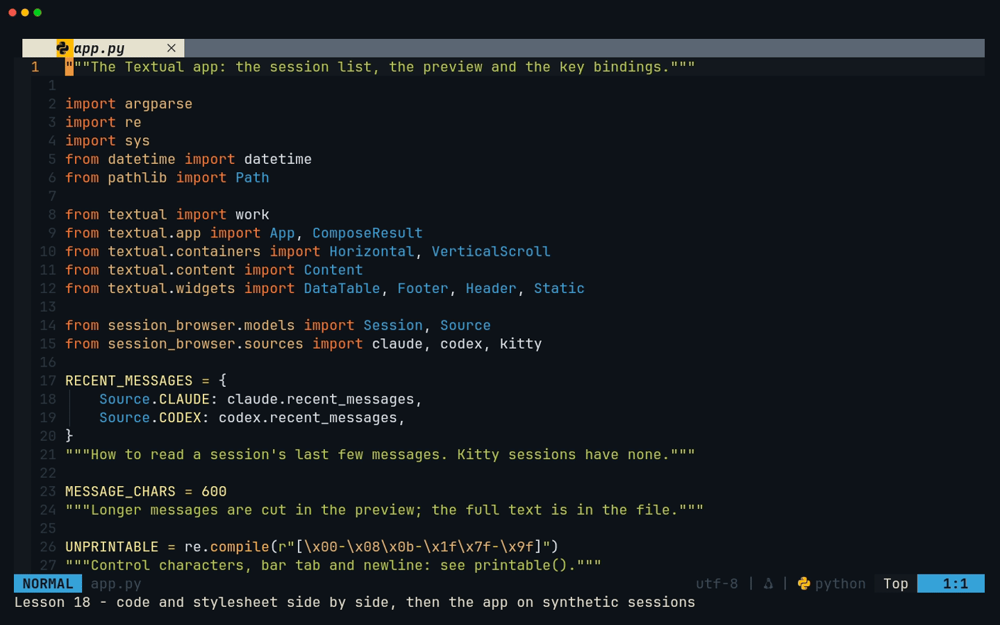
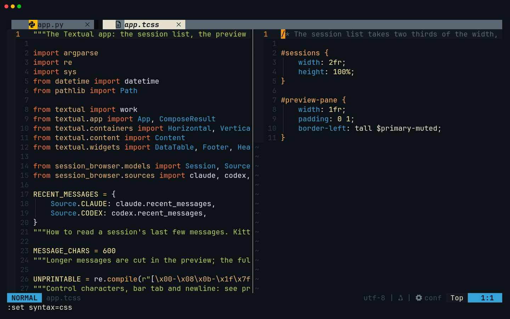
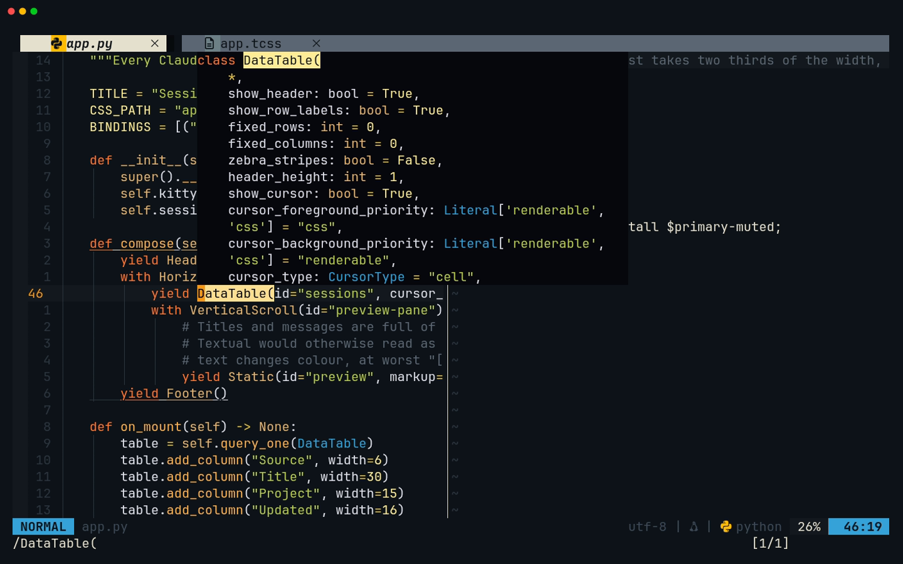
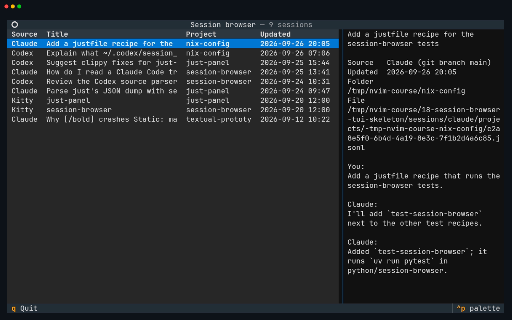
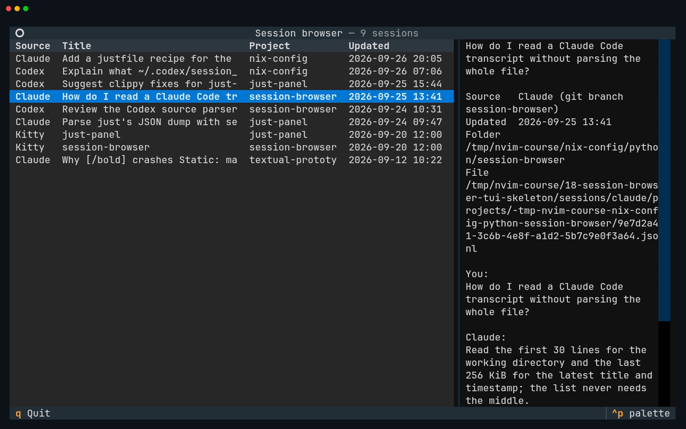
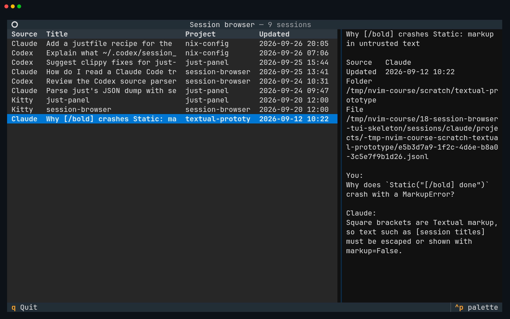
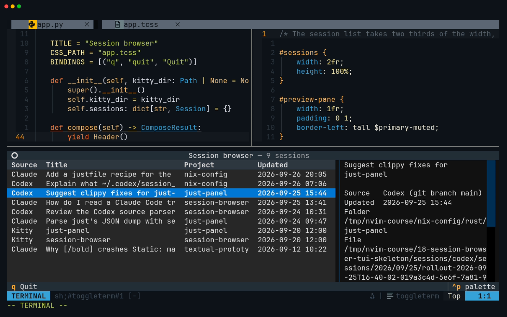

# Lesson 18 — session-browser: TUI skeleton

**Last Updated**: 27/09/2026
**Version**: 1.0.0
**Maintained By**: Development Team
**Language**: British English (en_GB)
**Timezone**: Europe/London

---

By the end of this lesson session-browser is a real app: one table of every Claude Code, Codex and Kitty
session, newest first, with a preview of the highlighted one, loaded in a background thread so the window
appears at once. The session sources you wrote in lessons 10 and 11 finally have a face. You build it the
way you will build any Python project in Neovim from now on: Telescope to reach files, the code and its
stylesheet side by side, `gd` and `K` straight into Textual's own source, Trouble and code actions for what
pyright and ruff find, the app running in the bottom terminal with `:TermExec`, Textual's dev console in a
second window, and finally a Neogit commit and a local tag, `course/sb5`, so you can diff against and return to
this milestone later. Along the way you meet
the one security bug a session browser must not have: printing someone else's text straight to your
terminal.

**Part**: 7 — Build session-browser · **Time**: ~150 min · **Previous**: [Lesson 17 — just-panel: testing and shipping](17-JUST-PANEL-TESTING-AND-SHIPPING.md) · **Next**: [Lesson 19 — session-browser: filter and search](19-SESSION-BROWSER-FILTER-AND-SEARCH.md)

## Objectives

- Build a Textual app from its parts: `compose()`, a `.tcss` stylesheet, `on_mount()`, message handlers and
  a thread worker that hands its result back with `call_from_thread`.
- Show a `DataTable` with a row cursor and a preview that follows it, and know the two traps in that
  sentence (the default cell cursor, and a row key that can be `None`).
- Show text you did not write safely: no markup parsing (`Content`, `markup=False`) and no terminal escape
  sequences (`printable()`), and explain what each one prevents.
- Read Textual's source from your code with `gd`, `K` and `<C-o>`, and fix what pyright and ruff report
  with Trouble, `]d`, `<leader>ca` and `<leader>rn`.
- Run the app against the synthetic fixtures three ways: in a Kitty window, in Neovim's bottom terminal with
  `:TermExec`, and under `textual run --dev` with `textual console` beside it.
- Commit SB5 with Neogit and tag it `course/sb5`.

## Before you start

- You have finished [Lesson 13](13-CLAUDE-CODE-AND-CODEX.md): milestone **SB4** is committed, with
  `AGENTS.md` and `CLAUDE.md` in `python/session-browser`. Lessons 14 to 17 build just-panel and never touch
  `python/session-browser`, so this lesson works whether or not you have done them.
- `git status --short` in `~/Repos/personal/nix-config` shows nothing under `python/`.
- The checks pass. In a terminal:

  ```bash
  # in ~/Repos/personal/nix-config/python/session-browser
  uv run pytest -q
  uvx ruff check
  uvx pyright
  ```

  pytest reports `41 passed` if `.python-version` says 3.14, or `39 passed, 2 skipped` if it says 3.12 (the
  two skipped tests need Python 3.14's zstd support). This lesson adds no tests, so the count
  stays exactly what it is now; Textual tests arrive in [Lesson 21](21-SESSION-BROWSER-TESTING-AND-SHIPPING.md).
  Ruff prints `All checks passed!` and pyright `0 errors, 0 warnings, 0 informations`.
- Give the two Kitty fixture files a fixed date. It changes no file content, so git sees nothing:

  ```bash
  # in ~/Repos/personal/nix-config/python/session-browser
  touch -d '2026-09-20 12:00:00 UTC' tests/fixtures/kitty/*.kitty-session
  ```

  A Kitty session's "Updated" time is its file's modification time, and a copy or a checkout dates the files
  the moment it was made, which puts the two Kitty rows at the top of a list sorted newest first. The fixed
  date puts them where this lesson's table (step 10) says they are. The tests do not depend on it: lesson
  21's tests pin the same date on their own copy of the fixtures.
- Read [projects/SESSION-BROWSER-SPEC.md](../projects/SESSION-BROWSER-SPEC.md) for where SB5 sits in the whole
  app, if you have not already.

## Keys in this lesson

| Keys | Mode | Action | Where it comes from |
|---|---|---|---|
| `<leader>ff` / `<leader>fg` | n | Telescope: find files / live grep | config (neovim.nix:29 / :30) |
| `<C-c>` | i (Telescope prompt) | Close the picker | telescope default |
| `:vsplit {file}` | Command | Open a file in a split to the right | Neovim default (right because of `splitright`, neovim.nix:249) |
| `<C-h>` / `<C-j>` / `<C-k>` / `<C-l>` | n | Move to the window left / below / above / right | config (neovim.nix:68-71) |
| `ggdG` | n | Delete every line of the buffer | Neovim default |
| `G` then `o` | n | Go to the last line, open a new line below it | Neovim default |
| `<C-e>` | i | Close the completion menu without choosing | config (neovim.nix:304) |
| `<C-s>` | n | Save; conform runs `ruff_format` first | config (neovim.nix:64; :953, :974-977) |
| `:set syntax=css` | Command | Colour a `.tcss` buffer, with no language server or formatter | Neovim default |
| `gd` | n | Go to the definition, even inside Textual | config (LSP buffer-local) |
| `K` | n | Hover: type and docstring | config (LSP buffer-local) |
| `zt` | n | Scroll so the cursor line is at the top | Neovim default |
| `<C-o>` | n | Back to where you were before the jump | Neovim default |
| `]d` / `[d` | n | Next / previous diagnostic, with its message in a float | config (LSP buffer-local) |
| `<leader>ld` | n | Message of the diagnostic under the cursor | config (LSP buffer-local) |
| `<leader>xw` / `<leader>xx` | n | Trouble: this buffer's diagnostics / all of them | config (neovim.nix:56 / :55) |
| `<leader>ca` | n | Code action (ruff's fixes live here) | config (LSP buffer-local) |
| `<leader>rn` | n | Rename a symbol everywhere | config (LSP buffer-local) |
| `:TermExec cmd="…" go_back=0` | Command | Run a command in the bottom terminal and stay in it | toggleterm default |
| `:TermE` then `<Up>` | c | Recall the last command line that starts `TermE` | Neovim default |
| `<C-\><C-n>` / `i` | t / n | Leave Terminal mode / go back in | Neovim default |
| `<leader>gg` | n | Neogit status in a new tab | config (neovim.nix:35) |
| `s`, `c` `c`, `<c-c><c-c>` | n (Neogit) | Stage; commit popup, commit; submit the message | neogit default |
| `<c-n>` / `<tab>` | n (Neogit status) | Next section / fold or unfold | neogit default |
| `t` `t` | n (Neogit status, on a commit) | Tag popup, then create a tag on that commit | neogit default |

Keys **inside the app** at SB5 (lesson 19 adds Vim keys):

| Key | Action | Where it comes from |
|---|---|---|
| `↓` / `↑` | Move the row cursor | Textual default (`DataTable`) |
| `PageDown` / `PageUp` | A page down / up | Textual default (`DataTable`) |
| `Ctrl+Home` / `Ctrl+End` | First / last row | Textual default (`DataTable`) |
| `q` | Quit | your code (`BINDINGS` in `app.py`) |
| `Ctrl+q` | Quit, whatever has focus | Textual default (`App`) |
| `Ctrl+c` | Does **not** quit: a notification tells you how to | Textual default (`App`) |
| `Ctrl+p` | Command palette | Textual default (`App`) |

## Walkthrough

You replace SB4's placeholder app with the real one, a piece at a time, trying each Neovim technique on the
piece you have just typed. The pieces, in file order, add up to exactly the `app.py` in
[Milestone SB5](#milestone-sb5), which also has the complete files to compare against.



[MP4](../media/18-session-browser-tui-skeleton/18-session-browser-tui-skeleton.mp4)

### 1. Open the project at its root

Neovim's working directory decides three things here: what Telescope searches, where `<leader>t` and
`:TermExec` start their shell, and (through `pyproject.toml`) which folder pyright treats as the project.
Start Neovim in `python/session-browser` and all three agree. Either use a dev layout for the capstone
([Lesson 09](09-PROJECT-PANE.md)), which puts Neovim, your KEYBINDS.md and a spare shell on a free workspace
between 3 and 5:

```bash
# in any terminal
dev-layout --new --nvim ~/Repos/personal/nix-config/python/session-browser
```

or start it by hand:

```bash
# in a Kitty terminal
cd ~/Repos/personal/nix-config/python/session-browser && nvim
```

Both start a bare `nvim`, so the dock layout opens: the tree on the left and a terminal along the bottom.

**Try it:** `<leader>ff` (Space, `f`, `f`), type `app.py`, `<CR>`. Then `<leader>fg`, type
`def recent_messages`, look at the results, and close the picker with `<C-c>`.

**You should see** SB4's placeholder in `src/session_browser/app.py`: `class SessionBrowser(App[None])` with a
`TITLE`, `BINDINGS = [("q", "quit", "Quit")]` and a `compose()` that yields a `Header()` and a `Footer()`.
The grep finds two definitions, in `sources/claude.py` and `sources/codex.py`: the preview will call both.

### 2. How a Textual app fits together

just-panel's ratatui loop redraws everything from your state on every pass and reads keys itself. Textual
works the other way round: it keeps a tree of widgets that draw themselves, and your code changes widgets
and reacts to **messages** (a key press, a highlighted row, a finished worker). Five ideas cover SB5:

| Piece | In your code | What Textual does with it |
|---|---|---|
| The app | `class SessionBrowser(App[None])`; `[None]` is what `run()` returns | Runs the event loop and owns the screen |
| `compose()` | `yield` widgets; `with Horizontal():` nests them | Builds the widget tree once, at start-up |
| `CSS_PATH = "app.tcss"` | A stylesheet next to `app.py` | Found relative to the module's own file, not your shell's directory |
| `on_mount()` and `on_<widget>_<message>()` | `on_data_table_row_highlighted` | Called when the widgets exist / when that message reaches the app |
| `BINDINGS` and `action_*()` | `("q", "quit", "Quit")` runs `action_quit` | Keys to actions, listed in the `Footer` |

A sixth, the **worker**, keeps slow work off the thread that draws the screen. You meet it in step 5.

### 3. The stylesheet, in a split beside the code

**Try it:** with `app.py` in front of you, `:vsplit src/session_browser/app.tcss`. The new, empty file opens
in a window to the right. Press `i` and type:

```css
/* The session list takes two thirds of the width, the preview the rest. */

#sessions {
    width: 2fr;
    height: 100%;
}

#preview-pane {
    width: 1fr;
    padding: 0 1;
    border-left: tall $primary-muted;
}
```

`<Esc>`, `<C-s>`, then `:set syntax=css`. Move between the two windows with `<C-h>` and `<C-l>`.

**You should see** the stylesheet on the right, in colour after `:set syntax=css`, and nothing reformatted
when you saved.



The recording opens the finished, saved file, so it runs the command for a reopened `app.tcss` from the
gotcha below. The result is the same as in your new buffer: CSS colours and no filetype in the status line.

What it says: `#sessions` and `#preview-pane` are the `id`s you give two widgets in step 4. `2fr` and `1fr`
share the width left over two to one, so the list gets two thirds. `padding: 0 1` is no padding above and
below and one cell left and right. `border-left: tall $primary-muted` draws a line down the preview's left
edge in a muted version of the theme's primary colour; `$primary-muted` is one of Textual's theme variables.

> **Gotcha:** Neovim 0.12.5 has no filetype of its own for `.tcss`, so this new, empty buffer gets no
> highlighting, no language server and no format-on-save. `:set syntax=css` borrows CSS colours and nothing
> else. Do **not** `:set filetype=css`: the CSS language server would attach to a file that is not CSS, and
> conform would run prettier on it at every save (neovim.nix:944, :974-977). Without a filetype, `<Tab>`
> inserts two spaces (neovim.nix:218-220); the listing indents by four, so press it twice or
> `:setlocal shiftwidth=4 softtabstop=4` first. Textual does not mind either way.
>
> **Once the file is saved, reopening it is different.** For a file type it does not know, Neovim falls back
> to `conf` when one of the first five lines starts with `#`, and `#sessions {` does. `conf` continues a `#`
> onto the next line when you press Enter or `o`, so the line after `#sessions {` would start with a `#` and
> the stylesheet would break. Whenever you open `app.tcss` again (lesson 19 does), run
> `:setlocal filetype= syntax=css` first: no filetype, CSS colours.

### 4. Imports and the layout

> **Tip: typing Python here.** Neovim indents each new line for you (`autoindent`, neovim.nix:221, plus
> Python's own indent rules), for example one level deeper after a line that ends in `:`. So type each line's
> text, not its leading spaces, and fix a line that lands at the wrong depth as you go: `<BS>` removes four
> spaces at a time in a Python buffer, and `>>` / `<<` in Normal mode shift the whole line by one level. The
> rest of [lesson 08's typing tip](08-FILE-PANE.md) applies too: closing brackets and quotes appear by
> themselves, and `<C-e>` closes the completion menu before `<CR>`. If a listing fights you, copy it from the
> rendered page and put it in with `p` in Normal mode; `<C-s>` then lets `ruff_format` fix the blank lines
> between blocks.

`<C-h>` back to `app.py`. SB4's placeholder goes completely: `ggdG` deletes every line. Press `i` and type the
top of the file:

```python
"""The Textual app: the session list, the preview and the key bindings."""

import argparse
import re
import sys
from datetime import datetime
from pathlib import Path

from textual import work
from textual.app import App, ComposeResult
from textual.containers import Horizontal, VerticalScroll
from textual.content import Content
from textual.widgets import DataTable, Footer, Header, Static

from session_browser.models import Session, Source
from session_browser.sources import claude, codex, kitty

RECENT_MESSAGES = {
    Source.CLAUDE: claude.recent_messages,
    Source.CODEX: codex.recent_messages,
}
"""How to read a session's last few messages. Kitty sessions have none."""

MESSAGE_CHARS = 600
"""Longer messages are cut in the preview; the full text is in the file."""

UNPRINTABLE = re.compile(r"[\x00-\x08\x0b-\x1f\x7f-\x9f]")
"""Control characters, bar tab and newline: see printable()."""
```

Leave two blank lines, then the class and its layout:

```python
class SessionBrowser(App[None]):
    """Every Claude Code, Codex and Kitty session, newest first."""

    TITLE = "Session browser"
    CSS_PATH = "app.tcss"
    BINDINGS = [("q", "quit", "Quit")]

    def __init__(self, kitty_dir: Path | None = None) -> None:
        super().__init__()
        self.kitty_dir = kitty_dir
        self.sessions: dict[str, Session] = {}

    def compose(self) -> ComposeResult:
        yield Header()
        with Horizontal():
            yield DataTable(id="sessions", cursor_type="row")
            with VerticalScroll(id="preview-pane"):
                # Titles and messages are full of [square brackets], which
                # Textual would otherwise read as style markup: at best the
                # text changes colour, at worst "[/bold]" raises MarkupError.
                yield Static(id="preview", markup=False)
        yield Footer()
```

The lines that matter:

- `DataTable(id="sessions", cursor_type="row")`. A `DataTable`'s cursor highlights a **cell** by default, and
  the row messages the preview needs (`RowHighlighted`, `RowSelected`) are only sent with a **row** cursor.
  Forget `cursor_type="row"` and the preview never changes.
- `Static(id="preview", markup=False)`. `Static` reads `[square brackets]` in its text as style markup unless
  told not to. Session titles and messages are full of brackets.
- `VerticalScroll` scrolls the preview when it is longer than the window; `Horizontal` puts the two side by
  side. Their `id`s are what `app.tcss` styles.
- `self.sessions` will map each table row's key to its `Session`. `RECENT_MESSAGES` maps a source to the
  function that reads its last messages (you wrote both in lessons 10 and 11); Kitty sessions have none.
  `UNPRINTABLE` waits for step 7.

As you type the imports, ruff marks each one unused (F401) and pyright greys it out, because nothing uses
them yet. That is expected: `<leader>xw` lists them in Trouble, and the list shrinks as you type the code
below. Do not accept ruff's "Remove unused import" in the meantime.

**Try it:** put the cursor on `DataTable` in `yield DataTable(...)` and press `K`; move the cursor (`j`) to
close the float. Back on `DataTable`, press `gd`, then `zt`. Look a few lines down, then come back with
`<C-o>`.

**You should see** `K` show the signature `class DataTable(` with every keyword argument it takes
(`show_header`, `zebra_stripes`, `cursor_type` and the rest), then its docstring, "A tabular widget that
contains data." `gd` opens Textual's own `textual/widgets/_data_table.py` from the project's `.venv` at
`class DataTable(ScrollView, Generic[CellType], can_focus=True):` (line 268 in Textual 8.2.8). A few lines
below, `BINDINGS` lists the keys every table gets for free: `enter`, `up`, `down`, `right`, `left`, `pageup`,
`pagedown`, `ctrl+home`, `ctrl+end`, `home` and `end`, each with the name of its action (`cursor_down`,
`scroll_top` and so on). Lesson 19 reuses those action names.



> **Tip:** `gd` works inside Textual only because pyright analyses against the project's `.venv`, which is
> what SB3's `[tool.pyright] venvPath = "."` and `venv = ".venv"` in `pyproject.toml` are for. If `gd` says
> no definition was found, run `uv sync` in the project and reopen the file.

### 5. Load the sessions in a worker

`G`, then `o` to open a line below the last one. Leave one blank line (the methods of a class are separated by
one), then type:

```python
    def on_mount(self) -> None:
        table = self.query_one(DataTable)
        table.add_column("Source", width=6)
        table.add_column("Title", width=30)
        table.add_column("Project", width=15)
        table.add_column("Updated", width=16)
        table.loading = True
        self.load_sessions()

    @work(thread=True, exclusive=True)
    def load_sessions(self) -> None:
        """Read all three stores in a thread, so the window draws at once."""
        sessions = [
            *claude.load_sessions(),
            *codex.load_sessions(),
            *kitty.load_sessions(self.kitty_dir),
        ]
        sessions.sort(key=lambda session: session.updated, reverse=True)
        # Widgets belong to the app's thread: hand the result back to it.
        self.call_from_thread(self.show_sessions, sessions)

    def show_sessions(self, sessions: list[Session]) -> None:
        self.sessions = {session.key: session for session in sessions}
        table = self.query_one(DataTable)
        table.clear()
        for session in sessions:
            table.add_row(
                session.source.name.title(),
                # A plain str cell is parsed as markup too; Content is not.
                Content(printable(session.title)),
                Content(printable(session.project)),
                format_time(session.updated),
                key=session.key,
            )
        table.loading = False
        # While it was loading the table could not take focus, so Textual gave
        # it to the preview pane. Move it to where the keys are meant to go.
        table.focus()
        self.sub_title = f"{len(sessions)} sessions"
```

- `on_mount()` runs once the widgets exist. It adds the four columns with fixed widths (they fit a window
  about 116 columns wide, scrollbar included), sets `table.loading = True`, which covers the table with a
  loading indicator, and starts the worker. `self.load_sessions()` returns at once: the decorator turns the
  call into "start a worker".
- `@work(thread=True, exclusive=True)` runs `load_sessions` in a thread. Reading three stores is file I/O (a
  store of 168 real Claude transcripts took a third of a second), and doing it on the app's own thread would
  freeze the window until it finished. `exclusive=True` cancels an older run in the same group if you ever
  start a new one, for example from a reload key.
- Widgets belong to the app's thread and are not safe to touch from another one. `call_from_thread` runs
  `show_sessions` on the app's thread and waits for it.
- `show_sessions` keeps the sessions by key (`claude:<id>` and so on, unique across the three tools), then
  fills the table. The Source and Updated cells are plain `str` because your own code made them. The Title
  and Project cells come from session data, so they are wrapped in `Content(...)`: a `DataTable` reads every
  `str` cell as markup (its `default_cell_formatter` calls `Text.from_markup`), and a title such as
  `Why [/bold] crashes…` would raise a `MarkupError`. `Content` is Textual's plain-text type.
- `table.loading = False`, then `table.focus()`. A widget cannot take focus while it is loading
  (`Widget.focusable` checks `not self.loading`), so at start-up Textual gave focus to the next focusable
  widget, the preview's `VerticalScroll`, and the arrow keys scrolled the preview. Moving focus back puts the
  keys where you expect them.
- `self.sub_title` appears in the `Header` after the title: `Session browser — 9 sessions`.

**Try it:** `K` on `call_from_thread`. Then `gd` on `load_sessions` in `claude.load_sessions()`, and `<C-o>`
to come back.

**You should see** the docstring "Run a callable from another thread, and return the result.", followed by
the warning that Textual apps are not thread-safe. `gd` opens `sources/claude.py` at `def load_sessions`, the
function you wrote in lesson 10, and `<C-o>` returns you to the call.

### 6. The preview follows the cursor

One blank line, then the handler:

```python
    def on_data_table_row_highlighted(self, event: DataTable.RowHighlighted) -> None:
        # Moving the cursor in an empty table (Up, Page Down) still posts this
        # event, for row -1 and with no row key at all, whatever the type hint
        # says.
        if event.row_key is None:
            return
        session = self.sessions.get(event.row_key.value or "")
        if session is not None:
            # Reading the preview is quick enough to do right here: at most the
            # first 30 lines and the last 256 KiB of one file.
            text = printable(preview_text(session))
            self.query_one("#preview", Static).update(text)
```

- The name is the rule: a message class `DataTable.RowHighlighted` reaches the method
  `on_data_table_row_highlighted`. `DataTable` posts it whenever the row cursor lands on a row.
- The guard. Press Up or Page Down in an **empty** table and the cursor goes to row -1: `DataTable` still
  posts `RowHighlighted`, with `row_key` set to `None`, although the attribute is typed `RowKey`. Without the
  `if`, `event.row_key.value` crashes the app. pyright cannot warn you, because the type says it never
  happens. The table is never empty with the fixtures, but lesson 19's search can empty it, and so can an
  empty store.
- The preview is read right here, on the app's thread: at most the first 30 lines and the last 256 KiB of
  one file (lesson 10's `read_entries`), 3.6 ms in the worst case on that real store. That is quick enough
  not to need a worker.

**Try it:** `K` on `row_key` in `event.row_key`.

**You should see** its type, `RowKey`, with no `None` anywhere: the type hint is exactly what the guard does
not trust.

### 7. Text you did not write

Two blank lines (you are back at the top level of the module), then the helpers:

```python
def preview_text(session: Session) -> str:
    """The preview pane as plain text: what the session is, then its tail."""
    source = session.source.name.title()
    lines = [
        session.title,
        "",
        f"Source   {source}" + (f" ({session.detail})" if session.detail else ""),
        f"Updated  {format_time(session.updated)}",
        f"Folder   {tilde(session.cwd) if session.cwd else '(unknown)'}",
        f"File     {tilde(session.path)}",
    ]
    read_messages = RECENT_MESSAGES.get(session.source)
    if read_messages is None:
        return "\n".join(lines)
    try:
        messages = read_messages(session.path)
    except OSError as error:
        lines += ["", f"Could not read the conversation: {error.strerror}"]
        messages = []
    for message in messages:
        speaker = "You" if message.role == "user" else source
        text = message.text
        if len(text) > MESSAGE_CHARS:
            text = text[: MESSAGE_CHARS - 1] + "…"
        lines += ["", f"{speaker}:", text]
    return "\n".join(lines)


def format_time(when: datetime) -> str:
    """Local time, to the minute: 2026-09-24 10:47."""
    return when.astimezone().strftime("%Y-%m-%d %H:%M")


def tilde(path: Path) -> str:
    """The path with your home directory written as ~, as a shell shows it."""
    home = Path.home()
    return str("~" / path.relative_to(home)) if path.is_relative_to(home) else str(path)


def printable(text: str) -> str:
    """The text with each control character, bar tab and newline, shown as �.

    Content and markup=False stop Textual reading [brackets] as style, but the
    characters themselves still go to your terminal as they are. An escape
    sequence in a title or a message would be obeyed, not shown: it could
    clear the screen, rename the window or write to your clipboard.
    """
    return UNPRINTABLE.sub("\N{REPLACEMENT CHARACTER}", text)
```

`preview_text` builds the preview as plain text: the title, the source (with the branch or the Kitty tab and
window counts), the time, the folder and the file, then the last messages, each cut at 600 characters.
`format_time` shows local time; `tilde` writes your home folder as `~`.

`printable` is the one to understand. `Content` and `markup=False` stop Textual reading brackets as style,
but the characters themselves still go to your terminal as they are. Textual and Rich remove only five
control characters on the way (bell, backspace, vertical tab, form feed and carriage return, the
`_STRIP_CONTROL_CODES` list in `textual/content.py`). **ESC is not one of them**, and your terminal obeys
escape sequences wherever they come from:

| Sequence inside a title | What the terminal does |
|---|---|
| `ESC ] 0 ; text BEL` (OSC 0) | Renames your window |
| `ESC ] 52 ; c ; <base64> BEL` (OSC 52) | **Writes your clipboard.** Kitty allows programs to do this by default: its `clipboard_control` includes `write-clipboard` |
| `ESC [ 2 J` | Clears the screen |
| `ESC [ ? 1049 l` | Leaves the alternate screen, the canvas the app draws on |

Where would such text come from? Session titles are summaries of conversations, and conversations hold
whatever went into them: a pasted log, a web page, a file someone sent you, the output of a command. A tool
that displays that text must treat it like any untrusted input. When this code was tested against a store
full of hostile titles and messages, the version without this protection wrote `ESC ] 0 ;` six times and
`ESC ] 52 ; c ;` twice to the terminal. With it: none. The next paste could be something an attacker chose.

The pattern `[\x00-\x08\x0b-\x1f\x7f-\x9f]` covers the C0 controls except tab (`\x09`) and newline (`\x0a`),
so ESC (`\x1b`) is in; then DEL and the C1 controls, where a one-byte CSI (`\x9b`) lives. Each becomes `�`
(`\N{REPLACEMENT CHARACTER}`) instead of vanishing, so you can see that something odd was there. It is
applied to the Title and Project cells and to the whole preview: everything else on screen is text your own
code wrote. You try it on a hostile title in step 10.

### 8. The command line and the exit status

Two blank lines, then `main()`:

```python
def main() -> None:
    parser = argparse.ArgumentParser(
        description="Browse, search and resume Claude Code, Codex and Kitty sessions."
    )
    parser.add_argument(
        "--kitty-sessions-dir",
        type=Path,
        metavar="DIR",
        help="where your kitty session files live (default: "
        "$SESSION_BROWSER_KITTY_DIR, else ~/.local/share/kitty/sessions)",
    )
    args = parser.parse_args()
    app = SessionBrowser(kitty_dir=args.kitty_sessions_dir)
    app.run()
    # run() returns normally even when the app crashed; its return code is 1
    # then, and passing it on lets your shell and scripts see the failure.
    sys.exit(app.return_code)
```

`argparse` gives the app `--kitty-sessions-dir DIR` and a `--help`. The last line matters more than it looks.
`App.run()` returns normally even when the app crashed: it prints the traceback and sets `return_code` to 1.
Without `sys.exit(app.return_code)` the `session-browser` command exits 0 after a crash, and a script or
keybinding that runs it believes everything went well. The script entry point in `pyproject.toml` has pointed
at `session_browser.app:main` since SB1, so nothing else needs changing.

**Try it:** `K` on `return_code`, then `<C-s>`.

**You should see** a docstring whose example is exactly `my_app.run()` followed by
`sys.exit(my_app.return_code)`. Saving runs `ruff_format` (neovim.nix:953); if you typed the listings as
shown, it changes nothing.

### 9. Let pyright and ruff check your typing

`<leader>xw` (typed briskly: see Gotchas) opens Trouble with this buffer's diagnostics. It should be empty. If
it is not, move into Trouble with `<C-j>` (it opens at the bottom without taking the cursor) and `<CR>` on an
entry jumps to it. In the file itself, `]d` and `[d` walk the diagnostics with the message in a float,
and `<leader>ld` repeats the message for the line you are on. Virtual text is off in Neovim 0.11 and later, so
a sign in the gutter is all you get unless you ask.

**Try it:**

1. **An error.** `/call_from_thread(` and `<CR>`, then `e` to the end of the word, `a`, type `s`, `<Esc>`.
   Wait a moment, then `]d`, then `<leader>xx`. Undo with `u`.
2. **A code action.** `gg`, then `4j` to the `import sys` line. `dd`, `k`, `k`, `P` puts it above
   `import argparse`. Wait for the sign on the import block, then `<leader>ca` and choose the "Organize imports"
   action for I001 by its number.
3. **A rename.** `/def tilde` and `<CR>`, `w` onto `tilde`, `<leader>rn`. The prompt starts with the old name
   filled in: `<C-u>` clears it. Type `home_short`, `<CR>`, and look at `preview_text`. Then rename it back the
   same way (`<leader>rn`, `<C-u>`, `tilde`, `<CR>`) so your file matches the listing.

**You should see:**

1. An error sign on that line, and pyright's message in the float: `Cannot access attribute
   "call_from_threads" for class "SessionBrowser*"`, then `Attribute "call_from_threads" is unknown
   (reportAttributeAccessIssue)`. Trouble lists the same entry. After `u` both go.
2. Ruff's diagnostic `Import block is un-sorted or un-formatted` (I001) and a menu of actions, among them
   `Ruff (I001): Organize imports`, `Ruff (I001): Disable for this line` and `Ruff: Fix all auto-fixable
   problems`. These are ruff 0.14's titles; the ruff your config pins may word them differently
   (verify on laptop-intel). Choosing "Organize imports" puts `argparse`, `re`, `sys` back in order.
3. The definition and both calls in `preview_text` renamed together, and all three back to `tilde` after the
   second rename.

pyright in this config only checks files you have open (the `diagnosticsMode` typo, neovim.nix:402), so a
break in `sources/claude.py` would not appear in Trouble unless that file is open. For the whole project, run
`uvx pyright` in the terminal.

### 10. Run it, on the fixtures only

By default the app reads `~/.claude`, `~/.codex` and `~/.local/share/kitty/sessions`: your real conversations,
with client names and folder paths in them. Running it on those is fine when you are alone with your laptop.
It is **never** fine in a recording, a screenshot, a screen share or a bug report. Every run in this course
therefore points all three sources at the synthetic fixtures in `tests/fixtures/` (a copy of
`docs/NEOVIM-COURSE/fixtures/sessions/`), with the two tools' own overrides and the app's flag:

```bash
# in ~/Repos/personal/nix-config/python/session-browser
CLAUDE_CONFIG_DIR=tests/fixtures/claude CODEX_HOME=tests/fixtures/codex \
  uv run session-browser --kitty-sessions-dir tests/fixtures/kitty
```

The paths are relative, so run it from the project folder. Give it a window at least about 110 columns wide: the dev
layout's shell pane (bottom right, `SUPER + L` then `SUPER + J` to reach it) is narrower, so make it full screen
with `SUPER + F11` while you try the app, and `SUPER + F11` again to put it back. A plain Kitty window also works
(`SUPER + RETURN`, then `SUPER + 0`: new windows open on workspace 10); `cd` to the project first.

**Try it:** run the command above. Press `↓` three times, then `↓` five more, then `q`, then `echo $?`.

**You should see** `Session browser — 9 sessions` in the header and nine rows, newest first. Times are your
local time, which in September is BST, one hour ahead of the UTC times listed in the fixtures' README:

| Source | Title (as the column cuts it) | Project | Updated |
|---|---|---|---|
| Claude | Add a justfile recipe for the | nix-config | 2026-09-26 21:05 |
| Codex | Explain what ~/.codex/session_ | nix-config | 2026-09-26 08:06 |
| Codex | Suggest clippy fixes for just- | just-panel | 2026-09-25 16:44 |
| Claude | How do I read a Claude Code tr | session-browser | 2026-09-25 14:41 |
| Codex | Review the Codex source parser | session-browser | 2026-09-24 11:31 |
| Claude | Parse just's JSON dump with se | just-panel | 2026-09-24 10:47 |
| Kitty | just-panel | just-panel | 2026-09-20 13:00 |
| Kitty | session-browser | session-browser | 2026-09-20 13:00 |
| Claude | Why [/bold] crashes Static: ma | textual-prototy | 2026-09-12 11:22 |

The preview shows the first session: its full title, `Source   Claude (git branch main)`,
`Updated  2026-09-26 21:05`, `Folder   /tmp/nvim-course/nix-config`, the file under `tests/fixtures/claude/`,
then its messages under `You:` and `Claude:`. The footer lists `q Quit` and `^p palette`. Three `↓` later the
preview shows "How do I read a Claude Code transcript without parsing the whole file?" and its conversation.
The last row shows `Why [/bold] crashes Static: markup in untrusted text` in the preview, brackets and all.
`q` returns you to the shell and `echo $?` prints `0`.







**Inside Neovim, with `:TermExec`.** [Lesson 06](06-TERMINAL.md) introduced `:TermExec`; with `go_back=0` it
runs the command in the bottom terminal and leaves you in that terminal, so your keys reach the app:

```vim
:TermExec cmd="CLAUDE_CONFIG_DIR=tests/fixtures/claude CODEX_HOME=tests/fixtures/codex uv run session-browser --kitty-sessions-dir tests/fixtures/kitty" go_back=0
```

It uses your first ordinary terminal, the one `<leader>t` toggles (created if there is none), which runs
across the whole width at the bottom. Its 15 rows (neovim.nix:776) are just enough for the app. If the mode
at the left of the status line says NORMAL rather than TERMINAL, press `i` first.

**Try it:** run the `:TermExec` line from `app.py`. Press `↓` twice. Then `<C-\><C-n>` and `<C-k>`: you are
back in the code while the app keeps running below. `<C-j>`, `i`, `q` to quit it. Later, `:TermE` followed by
`<Up>` brings the whole command back from the command-line history.

**You should see** the app draw itself inside the bottom terminal, header, nine rows, preview and footer
included, and the cursor move with `↓`. After `q` the terminal shows your shell prompt again.



> **Gotcha:** `:TermExec` runs `cmd` through Neovim's `expandcmd()` before the shell sees it, so `%` becomes
> the current file's name, `#` the alternate file and `$NAME` an environment variable, all expanded by
> Neovim. A single quote inside `cmd` cuts the command short (toggleterm's parser re-quotes the text in single
> quotes). Keep `%`, `#` and `'` out of `cmd`, and without `go_back=0` the cursor returns to your code, so
> the app does not get your keys.

**With Textual's dev console.** `textual-dev` (a dev dependency since SB0) adds a console that shows your
app's log live, and a `--dev` mode that reloads the stylesheet when you save it. It needs two terminals.

1. Open a second Kitty window (`SUPER + RETURN`, then `SUPER + 0`)
   and start the console:

   ```bash
   # in ~/Repos/personal/nix-config/python/session-browser
   uv run textual console -x SYSTEM -x EVENT -x DEBUG
   ```

   `-x` hides a log group: those three are very chatty. You should see `Textual Development Console v8.2.8`
   and "Run a Textual app with textual run --dev my_app.py to connect."
2. In the shell pane (or the `<leader>t` terminal), run the app under `textual run`. `-c` means "run this
   command", and the arguments after it are passed on to `session-browser`:

   ```bash
   # in ~/Repos/personal/nix-config/python/session-browser
   CLAUDE_CONFIG_DIR=tests/fixtures/claude CODEX_HOME=tests/fixtures/codex \
     uv run textual run --dev -c session-browser --kitty-sessions-dir tests/fixtures/kitty
   ```

   The console shows an `INFO` line naming the driver, then `WORKER` lines for
   `<Worker RUNNING name='load_sessions' …>` and `<Worker SUCCESS name='load_sessions' …>`: your worker, as it
   starts and finishes.
3. **Your own log line.** Quit the app with `q`. In `show_sessions`, below the `self.sub_title` line, add
   `self.log(f"loaded {len(sessions)} sessions")`, `<C-s>`, and run step 2 again. The console shows
   `loaded 9 sessions` as an `INFO` entry, tagged `app.py` and its line number. Python code is not reloaded
   while the app runs, which is why you restarted it. Delete the line again (`dd`, `<C-s>`): it is not part
   of SB5.
4. **The stylesheet, live.** With the app still running under `--dev`, go to `app.tcss`, change `2fr` under
   `#sessions` to `1fr` and `<C-s>`. Within a second or two the running app redraws with the list and the
   preview half and half. `u` and `<C-s>` put it back.

**The hostile title.** Build a one-session Claude store whose title carries an OSC 0 sequence, in `/tmp`:

```bash
# in any terminal
E=/tmp/nvim-course/escape-test
mkdir -p "$E/claude/projects/-tmp"
printf '%s\n' \
  '{"type":"user","cwd":"/tmp","timestamp":"2026-09-27T10:00:00.000Z","message":{"role":"user","content":"hello"}}' \
  '{"type":"ai-title","aiTitle":"\u001b]0;TITLE CHANGED BY A SESSION\u0007Harmless looking title"}' \
  > "$E/claude/projects/-tmp/11111111-2222-4333-8444-555555555555.jsonl"
```

`printf '%s\n'` writes each string as it is, so the file holds the six characters `\u001b`, which is how a
JSON Lines transcript stores ESC; the loader's `json.loads` turns them back into the real character, exactly
as it would for a real transcript. Point the app at it (the Codex and Kitty folders do not exist, and a
missing store simply has no sessions):

```bash
# in ~/Repos/personal/nix-config/python/session-browser
CLAUDE_CONFIG_DIR=/tmp/nvim-course/escape-test/claude CODEX_HOME=/tmp/nvim-course/escape-test/codex \
  uv run session-browser --kitty-sessions-dir /tmp/nvim-course/escape-test/kitty
```

**You should see** one row whose title starts `�]0;TITLE CHANGED BY A SESSION`, and in the preview
`�]0;TITLE CHANGED BY A SESSION�Harmless looking title`. The two `�` are the ESC and the BEL, shown instead
of obeyed; your window title does not change. `q`, then `rm -rf /tmp/nvim-course/escape-test`.

## Gotchas in this config

- **`.tcss` files have no filetype of their own** in Neovim 0.12.5: no language server, no format-on-save. A
  new one gets no filetype at all; an existing one with `#…` in its first five lines is guessed as `conf`,
  which puts a `#` at the start of every new line you open after a `#sessions {`. Use `:set syntax=css` on a
  new file and `:setlocal filetype= syntax=css` on a reopened one, never `:set filetype=css` (the CSS server
  would attach and prettier would reformat the file on every save, neovim.nix:944, :974-977). `<Tab>`
  inserts two spaces there (neovim.nix:218-220); Python buffers get four from Neovim's own Python settings.
- **`<CR>` accepts the first completion** while the menu is open (`select = true`, neovim.nix:305), so typing
  a line and pressing Enter can insert a word you did not want. `<C-e>` closes the menu first; `<Esc>` also
  works.
- **Saving reformats Python** with `ruff_format` (neovim.nix:953, :974-977). That is what keeps your file
  identical to the listing's layout; `:noautocmd w` saves without it if you ever need to.
- **Unused-import warnings while you type top down** are expected (ruff F401). They disappear once the code
  that uses the imports exists. Do not accept "Remove unused import" halfway through.
- **pyright checks only open files**, because `diagnosticsMode` is a typo for `diagnosticMode`
  (neovim.nix:402). `uvx pyright` in the terminal checks the whole project.
- **No inline error text.** Virtual text is off, so diagnostics are gutter signs until you ask: `]d`,
  `<leader>ld`, `<leader>xw`.
- **`<leader>x` on its own closes the buffer** (neovim.nix:63). Type `<leader>xw` and `<leader>xx` briskly: a
  pause after the `x` lets `:bdelete` fire.
- **In the terminal, keys go to the app.** `q` quits the app, not Neovim; `<C-h/j/k/l>` also go to the app.
  Leave Terminal mode with `<C-\><C-n>` first (neovim.nix:68-71 are Normal-mode maps).
- **`:TermExec` expands `%`, `#` and `$NAME` in `cmd`** and breaks on a single quote. Without `go_back=0` the
  cursor goes back to your code.
- **Real data stays off screen.** Without the three overrides the app reads your real stores. Every command in
  this course sets `CLAUDE_CONFIG_DIR`, `CODEX_HOME` and `--kitty-sessions-dir`.
- **Kitty rows at the top of the list?** A fresh copy or checkout dates the Kitty fixture files "now". The
  `touch -d` in "Before you start" puts them back where the lessons show them; git does not track the date,
  so there is nothing to commit.
- **`git commit` in a terminal opens Zed** (`core.editor`, git.nix:21). Commit from Neogit.

## Drills

1. You build a `DataTable` without `cursor_type="row"` and wire up `on_data_table_row_highlighted`. What do
   you see when you press `↓`, and why?
   <details><summary>Answer</summary>

   A single cell is highlighted instead of the whole row, and the preview never changes. The default cursor
   type is `"cell"`, and `RowHighlighted` is only posted when the cursor type is `"row"`, so the handler is
   never called.
   </details>

2. Name the two separate problems that `Content(printable(session.title))` solves, and which half solves
   which.
   <details><summary>Answer</summary>

   `Content(...)` stops Textual reading the text as markup (a `str` cell goes through `Text.from_markup`, so
   `[/bold]` would raise `MarkupError`). `printable(...)` stops control characters reaching the terminal,
   where an escape sequence could rename the window, clear the screen or write the clipboard through OSC 52.
   </details>

3. A colleague "simplifies" `load_sessions` to fill the table directly instead of calling
   `call_from_thread(self.show_sessions, sessions)`. What is wrong with that?
   <details><summary>Answer</summary>

   `load_sessions` runs in a worker thread, and Textual widgets are not thread-safe. Anything that touches a
   widget must run on the app's thread; `call_from_thread` does exactly that and waits for it.
   </details>

4. From `app.py`, find the action name behind `DataTable`'s `ctrl+end` key without leaving Neovim, and come
   back.
   <details><summary>Answer</summary>

   `gd` on `DataTable`, `zt`, read `BINDINGS`: `ctrl+end` runs `scroll_bottom`. `<C-o>` returns to `app.py`.
   </details>

5. Your app crashes on start with a traceback, yet `session-browser; echo $?` prints `0`. Which line is
   missing, and why is it needed?
   <details><summary>Answer</summary>

   `sys.exit(app.return_code)` at the end of `main()`. `App.run()` prints the traceback and returns normally,
   leaving `return_code` at 1; only `sys.exit` passes that on to the shell.
   </details>

6. Run the app in Neovim's bottom terminal and keep the cursor in your code, not in the terminal.
   <details><summary>Answer</summary>

   Leave out `go_back=0`: `:TermExec cmd="CLAUDE_CONFIG_DIR=tests/fixtures/claude CODEX_HOME=tests/fixtures/codex uv run session-browser --kitty-sessions-dir tests/fixtures/kitty"`.
   The default sends the command and returns you to the window you came from.
   </details>

7. With the app running under `textual run --dev`, make the preview pane wider than the list without
   restarting the app.
   <details><summary>Answer</summary>

   In `app.tcss` swap the fractions (`#sessions` to `1fr`, `#preview-pane` to `2fr`) and `<C-s>`: `--dev`
   reloads the stylesheet on save. Put them back and save again.
   </details>

8. You want pyright's opinion on every file in the project, not only the open ones. How?
   <details><summary>Answer</summary>

   `uvx pyright` in the project folder. In Neovim, pyright only checks open files because of the
   `diagnosticsMode` typo (neovim.nix:402).
   </details>

## Milestone SB5

**Goal:** `session-browser` shows every Claude Code, Codex and Kitty session in one table, newest first, with a
plain-text preview of the highlighted one; it loads in a worker, shows session text safely, takes
`--kitty-sessions-dir`, and exits non-zero after a crash. The change is committed and tagged `course/sb5`.

Two files change: `src/session_browser/app.tcss` is new and `src/session_browser/app.py` is replaced.
Nothing else in the project changes, tests included.

### Step 1: `app.tcss`

The file from walkthrough step 3:

```css
/* The session list takes two thirds of the width, the preview the rest. */

#sessions {
    width: 2fr;
    height: 100%;
}

#preview-pane {
    width: 1fr;
    padding: 0 1;
    border-left: tall $primary-muted;
}
```

### Step 2: `app.py`

The pieces from walkthrough steps 4 to 8, in that order, with two blank lines between top-level blocks and
one between methods. Compare yours with the complete file:

<details><summary>Complete <code>src/session_browser/app.py</code> at SB5</summary>

```python
"""The Textual app: the session list, the preview and the key bindings."""

import argparse
import re
import sys
from datetime import datetime
from pathlib import Path

from textual import work
from textual.app import App, ComposeResult
from textual.containers import Horizontal, VerticalScroll
from textual.content import Content
from textual.widgets import DataTable, Footer, Header, Static

from session_browser.models import Session, Source
from session_browser.sources import claude, codex, kitty

RECENT_MESSAGES = {
    Source.CLAUDE: claude.recent_messages,
    Source.CODEX: codex.recent_messages,
}
"""How to read a session's last few messages. Kitty sessions have none."""

MESSAGE_CHARS = 600
"""Longer messages are cut in the preview; the full text is in the file."""

UNPRINTABLE = re.compile(r"[\x00-\x08\x0b-\x1f\x7f-\x9f]")
"""Control characters, bar tab and newline: see printable()."""


class SessionBrowser(App[None]):
    """Every Claude Code, Codex and Kitty session, newest first."""

    TITLE = "Session browser"
    CSS_PATH = "app.tcss"
    BINDINGS = [("q", "quit", "Quit")]

    def __init__(self, kitty_dir: Path | None = None) -> None:
        super().__init__()
        self.kitty_dir = kitty_dir
        self.sessions: dict[str, Session] = {}

    def compose(self) -> ComposeResult:
        yield Header()
        with Horizontal():
            yield DataTable(id="sessions", cursor_type="row")
            with VerticalScroll(id="preview-pane"):
                # Titles and messages are full of [square brackets], which
                # Textual would otherwise read as style markup: at best the
                # text changes colour, at worst "[/bold]" raises MarkupError.
                yield Static(id="preview", markup=False)
        yield Footer()

    def on_mount(self) -> None:
        table = self.query_one(DataTable)
        table.add_column("Source", width=6)
        table.add_column("Title", width=30)
        table.add_column("Project", width=15)
        table.add_column("Updated", width=16)
        table.loading = True
        self.load_sessions()

    @work(thread=True, exclusive=True)
    def load_sessions(self) -> None:
        """Read all three stores in a thread, so the window draws at once."""
        sessions = [
            *claude.load_sessions(),
            *codex.load_sessions(),
            *kitty.load_sessions(self.kitty_dir),
        ]
        sessions.sort(key=lambda session: session.updated, reverse=True)
        # Widgets belong to the app's thread: hand the result back to it.
        self.call_from_thread(self.show_sessions, sessions)

    def show_sessions(self, sessions: list[Session]) -> None:
        self.sessions = {session.key: session for session in sessions}
        table = self.query_one(DataTable)
        table.clear()
        for session in sessions:
            table.add_row(
                session.source.name.title(),
                # A plain str cell is parsed as markup too; Content is not.
                Content(printable(session.title)),
                Content(printable(session.project)),
                format_time(session.updated),
                key=session.key,
            )
        table.loading = False
        # While it was loading the table could not take focus, so Textual gave
        # it to the preview pane. Move it to where the keys are meant to go.
        table.focus()
        self.sub_title = f"{len(sessions)} sessions"

    def on_data_table_row_highlighted(self, event: DataTable.RowHighlighted) -> None:
        # Moving the cursor in an empty table (Up, Page Down) still posts this
        # event, for row -1 and with no row key at all, whatever the type hint
        # says.
        if event.row_key is None:
            return
        session = self.sessions.get(event.row_key.value or "")
        if session is not None:
            # Reading the preview is quick enough to do right here: at most the
            # first 30 lines and the last 256 KiB of one file.
            text = printable(preview_text(session))
            self.query_one("#preview", Static).update(text)


def preview_text(session: Session) -> str:
    """The preview pane as plain text: what the session is, then its tail."""
    source = session.source.name.title()
    lines = [
        session.title,
        "",
        f"Source   {source}" + (f" ({session.detail})" if session.detail else ""),
        f"Updated  {format_time(session.updated)}",
        f"Folder   {tilde(session.cwd) if session.cwd else '(unknown)'}",
        f"File     {tilde(session.path)}",
    ]
    read_messages = RECENT_MESSAGES.get(session.source)
    if read_messages is None:
        return "\n".join(lines)
    try:
        messages = read_messages(session.path)
    except OSError as error:
        lines += ["", f"Could not read the conversation: {error.strerror}"]
        messages = []
    for message in messages:
        speaker = "You" if message.role == "user" else source
        text = message.text
        if len(text) > MESSAGE_CHARS:
            text = text[: MESSAGE_CHARS - 1] + "…"
        lines += ["", f"{speaker}:", text]
    return "\n".join(lines)


def format_time(when: datetime) -> str:
    """Local time, to the minute: 2026-09-24 10:47."""
    return when.astimezone().strftime("%Y-%m-%d %H:%M")


def tilde(path: Path) -> str:
    """The path with your home directory written as ~, as a shell shows it."""
    home = Path.home()
    return str("~" / path.relative_to(home)) if path.is_relative_to(home) else str(path)


def printable(text: str) -> str:
    """The text with each control character, bar tab and newline, shown as �.

    Content and markup=False stop Textual reading [brackets] as style, but the
    characters themselves still go to your terminal as they are. An escape
    sequence in a title or a message would be obeyed, not shown: it could
    clear the screen, rename the window or write to your clipboard.
    """
    return UNPRINTABLE.sub("\N{REPLACEMENT CHARACTER}", text)


def main() -> None:
    parser = argparse.ArgumentParser(
        description="Browse, search and resume Claude Code, Codex and Kitty sessions."
    )
    parser.add_argument(
        "--kitty-sessions-dir",
        type=Path,
        metavar="DIR",
        help="where your kitty session files live (default: "
        "$SESSION_BROWSER_KITTY_DIR, else ~/.local/share/kitty/sessions)",
    )
    args = parser.parse_args()
    app = SessionBrowser(kitty_dir=args.kitty_sessions_dir)
    app.run()
    # run() returns normally even when the app crashed; its return code is 1
    # then, and passing it on lets your shell and scripts see the failure.
    sys.exit(app.return_code)
```

</details>

### Step 3: check it

```bash
# in ~/Repos/personal/nix-config/python/session-browser
uv run pytest -q
uvx ruff check
uvx ruff format --check
uvx pyright
uv run session-browser --help
```

Expect the same pytest count as in "Before you start" (`41 passed` on Python 3.14, `39 passed, 2 skipped` on
3.12), `All checks passed!`, `18 files already formatted` (ruff 0.16 counts Markdown too: the milestone's 16
files plus lesson 13's `AGENTS.md` and `CLAUDE.md`), `0 errors, 0 warnings, 0 informations`, and a help text
that begins `usage: session-browser [-h] [--kitty-sessions-dir DIR]`. Then run the app on the fixtures
as in walkthrough step 10: nine rows, a preview that follows `↓` and `↑`, `[/bold]` shown literally, `q` to
quit and `echo $?` printing `0`.

### Step 4: commit and tag

1. `<leader>gg`. Under **Untracked files** you should see `python/session-browser/src/session_browser/app.tcss`,
   and under **Unstaged changes** `python/session-browser/src/session_browser/app.py`. Nothing else under
   `python/`: if the `self.log` line from step 10 is still in `app.py`, remove it first.
2. `s` on each of the two files. `<tab>` on `app.py` under **Staged changes** shows its diff if you want a
   last look; `<tab>` again folds it.
3. `c`, `c`, and write the message (paste it, as in lesson 12, if you prefer):

   ```text
   feat(session-browser): Textual table and preview of every session

   - app.py: one DataTable of every Claude Code, Codex and Kitty session,
     newest first, loaded in a thread worker, and a plain-text preview of
     the highlighted session with its last six messages.
   - Session text is shown as text: no markup parsing (Content,
     markup=False) and no terminal escape sequences (printable()).
   - --kitty-sessions-dir, and a non-zero exit status after a crash.
   - app.tcss: the list takes two thirds of the width, the preview one.
   ```

   `<c-c><c-c>`, then `q` to leave Neogit.
4. Tag the commit, so you can diff against and return to this milestone later. In the terminal:

   ```bash
   # in ~/Repos/personal/nix-config
   git tag course/sb5
   ```

A tag is a name for one commit. Lesson 19's review diffs your work against `course/sb5`, whatever your working
tree holds by then. The tag is lightweight and local: a plain `git push` does not send tags, and this course
never asks you to push. A tag in the wrong place goes with `git tag -d course/sb5`; then tag again.

> **Tip:** Neogit can tag too. In its status buffer, put the cursor on the commit (the first line under
> **Unmerged into origin/main**, or under **Recent Commits** after `<tab>` on its title), then `t` (the tag
> popup), `t` (create a tag), the name and `<CR>`. If the cursor is not on a commit, Neogit asks "Create tag on"
> instead: `<Esc>` out and try again from the commit line.

### Check it

```bash
# in ~/Repos/personal/nix-config
git log --oneline --decorate -1
git tag --list 'course/*'
git status --short
```

`git log` shows your commit with `tag: course/sb5` in its decoration, `git tag` lists `course/sb5`, and
`git status --short` shows nothing under `python/`. Do not push.

Stuck? Compare with [examples/session-browser/SB5](../examples/session-browser/SB5/) — see [examples/README.md](../examples/README.md).

## Recap

- A Textual app is a widget tree from `compose()`, styled by a `.tcss` file found next to the module, set up in
  `on_mount()`, driven by messages (`on_<widget>_<message>`) and bindings (`action_*`).
- Slow I/O runs in `@work(thread=True)`; results go back to the widgets through `call_from_thread`. A loading
  widget cannot take focus, so focus the table when loading ends.
- `DataTable(cursor_type="row")` or no row messages; `RowHighlighted.row_key` can be `None` in an empty table.
- Session text is untrusted: `Content(...)` and `markup=False` against markup, `printable()` against escape
  sequences that could retitle your window or write your clipboard.
- `sys.exit(app.return_code)`, because `App.run()` returns normally after a crash.
- Neovim: `<leader>ff`/`<leader>fg`, `:vsplit` plus `<C-h>`/`<C-l>`, `gd`/`K`/`<C-o>` into Textual,
  `<leader>xw`, `]d`, `<leader>ca`, `<leader>rn`, `:TermExec … go_back=0`, `<C-\><C-n>`.
- Every run uses `CLAUDE_CONFIG_DIR`, `CODEX_HOME` and `--kitty-sessions-dir` on the fixtures. Your real stores
  never appear on screen when anyone else can see it.
- SB5 is committed and tagged `course/sb5`.

## Recording

- **Tape:** [`tapes/18-session-browser-tui-skeleton.tape`](../tapes/18-session-browser-tui-skeleton.tape). Run
  it from `docs/NEOVIM-COURSE/` on laptop-intel: `vhs tapes/18-session-browser-tui-skeleton.tape`.
- **What it records:** the worked example [examples/session-browser/SB5](../examples/session-browser/SB5/), not
  your own project, so it needs no tags and no course progress: record it whenever you like. The hidden setup
  copies the example to `/tmp/nvim-course/18-session-browser-tui-skeleton/python/session-browser`, runs
  `uv sync --frozen` there, and works only on that copy. Nothing is written to the repository.
- **VHS:** after `just rebuild`, `vhs --version` must print `0.12.1`; 0.12.0 exits 0 and writes nothing
  ([Appendix B](../appendices/B-RECORDING-WITH-VHS.md#first-make-sure-vhs-is-0121)).
- **Outputs:** `media/18-session-browser-tui-skeleton/18-session-browser-tui-skeleton.gif` and `.mp4`.
- **Screenshots** (all in `media/18-session-browser-tui-skeleton/`):

  | File | Shows | Step |
  |---|---|---|
  | `split.png` | `app.py` and `app.tcss` side by side, the saved stylesheet reopened and coloured with `:setlocal filetype= syntax=css` | 3 |
  | `hover.png` | `K` on `DataTable`: the class signature from Textual's source | 4 |
  | `termexec.png` | The app in Neovim's bottom terminal after `:TermExec … go_back=0` | 10 |
  | `list.png` | The app at full size: nine sessions and the preview of the newest | 10 |
  | `preview.png` | Three rows down: "How do I read a Claude Code transcript…" and its messages | 10 |
  | `markup.png` | The last row: `Why [/bold] crashes…` shown as text in the table and the preview | 10 |

- **Privacy:** the app only ever sees a copy of `fixtures/sessions/` (synthetic), through `CLAUDE_CONFIG_DIR`,
  `CODEX_HOME` and `--kitty-sessions-dir`, all set on the visible command lines. The tape sets `SHELL=/bin/sh`, so
  the terminal inside Neovim runs a plain `sh`: no zsh prompt and no shell history
  ([Appendix B](../appendices/B-RECORDING-WITH-VHS.md#privacy-guards)). It sets `TZ=Europe/London` so the times
  match the table in step 10, and `TZDIR=/etc/zoneinfo` so that uv's Python can find that zone on NixOS
  (without it, the app silently shows UTC, an hour behind the table). It also points `CLAUDE_CONFIG_DIR` at a
  throwaway folder for Neovim itself, so claudecode.nvim's lock file never lands in your real `~/.claude/ide`.
- **Manual steps:** none, but the first run may take a while if `uv sync` has to download packages; the tape
  allows three minutes for the setup. If the copy or `uv sync` fails, the setup never prints its ready marker
  and VHS stops with a `Wait` timeout.
- **Check before publishing:** `media/18-session-browser-tui-skeleton/` actually contains the GIF, the MP4 and
  all six PNGs above. Every frame shows only the `/tmp/nvim-course/…` copy and fixture sessions. The `K` float
  needs pyright to have started: if `hover.png` shows no float, re-record.
