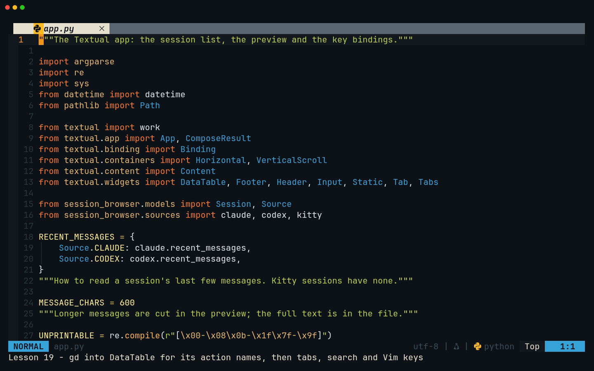
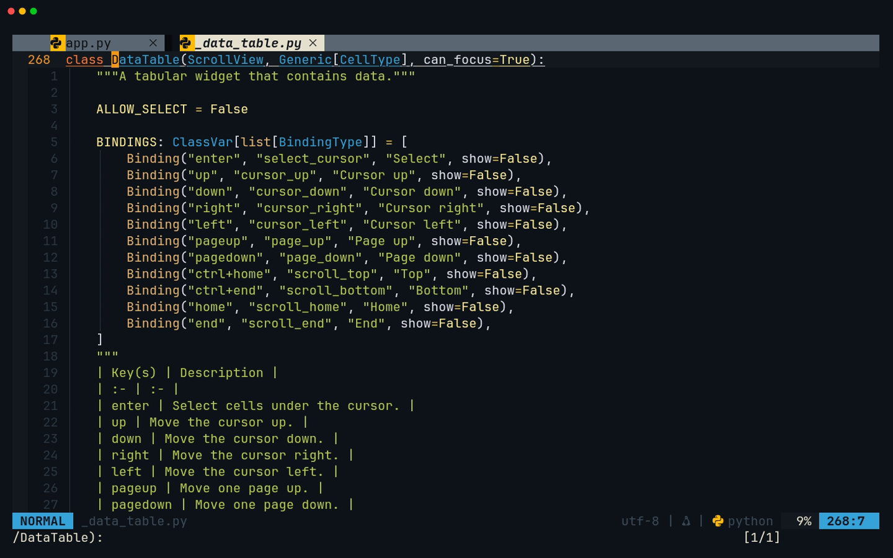
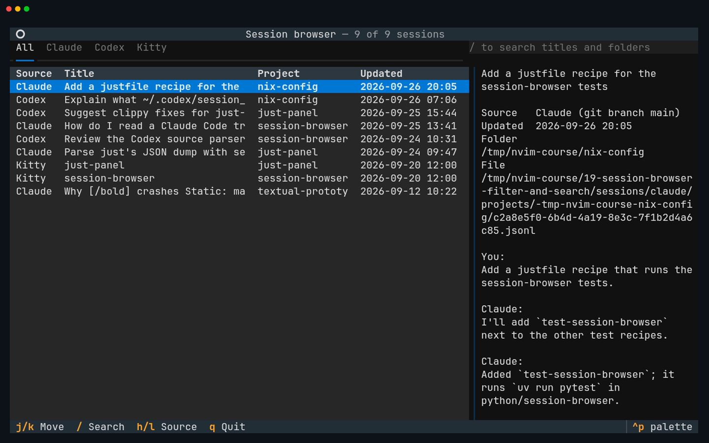
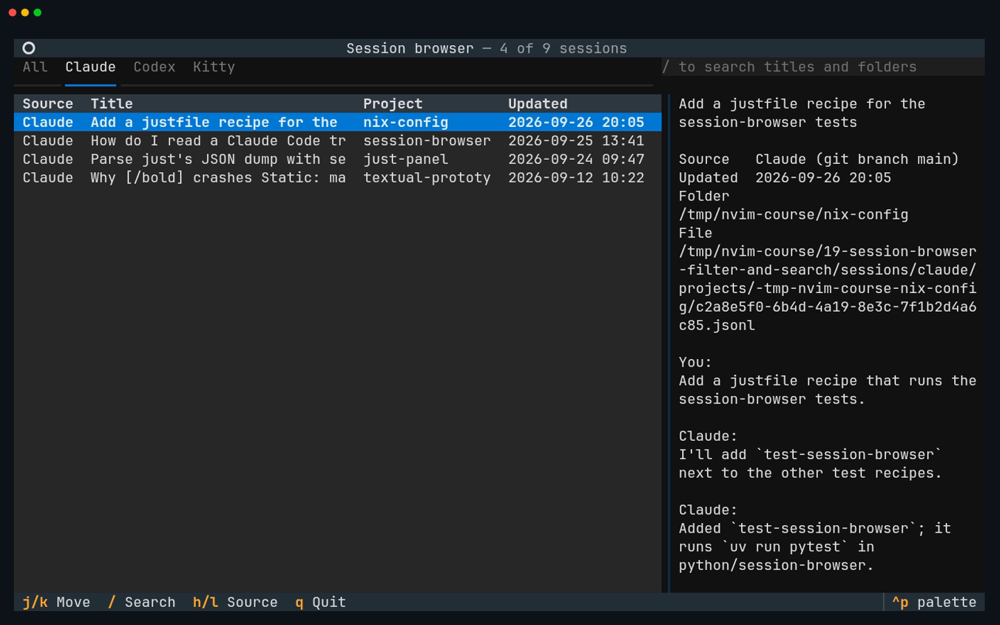
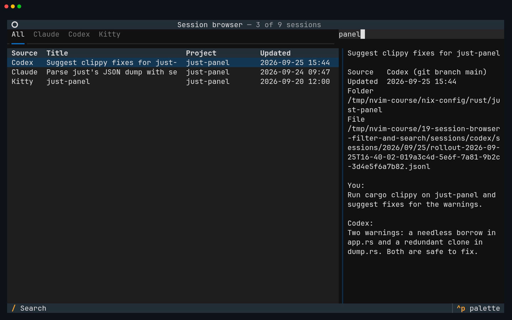
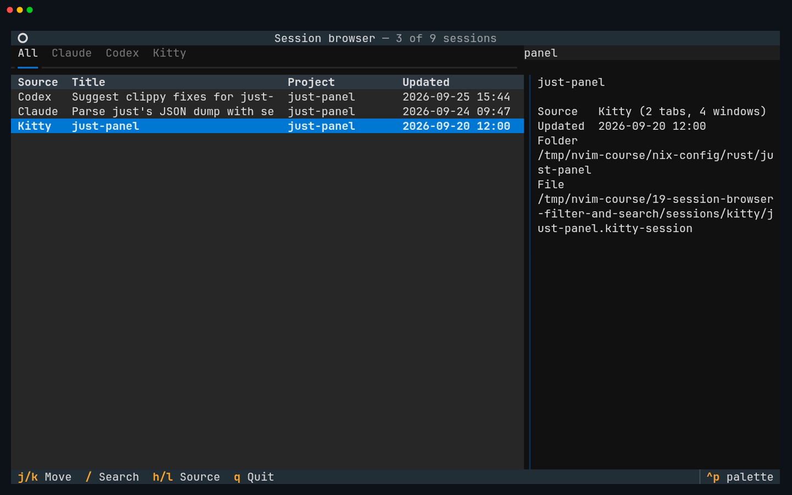

# Lesson 19 — session-browser: filter and search

**Last Updated**: 27/09/2026
**Version**: 1.0.0
**Maintained By**: Development Team
**Language**: British English (en_GB)
**Timezone**: Europe/London

---

Nine sessions fit on one screen; your real stores hold hundreds. In this lesson session-browser learns to
narrow the list: source tabs (All, Claude, Codex, Kitty) on `h` and `l`, a search box on `/` that matches
titles and folders as you type, `Esc` back to the list, and Vim's `j`, `k`, `g` and `G` on the list itself,
all advertised in the footer. The Textual ideas are bindings (where a key is looked up, and why `Esc` has to
live on the app) and messages travelling up the widget tree. The Neovim ideas are editing an existing file
precisely: `cgn` and `.` on the right matches only, `dap` to swap a whole method, ruff's organise-imports
action, `gd` into Textual to find action names you can reuse, and a Diffview review against the `course/sb5`
tag before you commit and tag `course/sb6`.

**Part**: 7 — Build session-browser · **Time**: ~110 min · **Previous**: [Lesson 18 — session-browser: TUI skeleton](18-SESSION-BROWSER-TUI-SKELETON.md) · **Next**: [Lesson 20 — session-browser: actions](20-SESSION-BROWSER-ACTIONS.md)

## Objectives

- Add keys to a Textual widget by subclassing it, reusing its own actions, and label them in the footer with
  `Binding(..., key_display=..., show=...)`.
- Explain where Textual looks a key up (focused widget first, then up to the app), why `Esc` is bound on the
  app, and why no letter key is a `priority` binding.
- Filter with `Tabs` and an `Input`, keeping one source of truth: read the state from the widgets each time
  instead of copying it into variables.
- Watch a message bubble up the widget tree in `textual console`.
- Edit with `cgn` and `.`, `ciw`, `dap`, `<leader>ca` "Organize imports", and review against a tag with
  `:DiffviewOpen course/sb5`.
- Commit SB6 with Neogit and tag it `course/sb6`.

## Before you start

- You have finished [Lesson 18](18-SESSION-BROWSER-TUI-SKELETON.md): milestone **SB5** is committed and
  tagged. Check it:

  ```bash
  # in ~/Repos/personal/nix-config
  git tag --list 'course/*'
  git status --short
  ```

  `course/sb5` is listed and nothing is pending under `python/`.
- The checks pass exactly as at the end of lesson 18 (`41 passed` on Python 3.14, `39 passed, 2 skipped` on
  3.12; ruff and pyright clean). This lesson adds no tests either.
- The Kitty fixtures carry the fixed date from lesson 18 (`touch -d '2026-09-20 12:00:00 UTC'
  tests/fixtures/kitty/*.kitty-session`), so the list order matches this lesson.
- Open Neovim in `~/Repos/personal/nix-config/python/session-browser` as in lesson 18 (the dev layout, or
  `cd` there and `nvim`), then `<leader>ff` to `src/session_browser/app.py` and
  `:vsplit src/session_browser/app.tcss`. In the stylesheet's window, `:setlocal filetype= syntax=css`
  (lesson 18's gotcha: reopened, the file is guessed as `conf`, which would put a `#` at the start of the new
  lines you type in step 5). `<C-h>` back to `app.py`.

## Keys in this lesson

| Keys | Mode | Action | Where it comes from |
|---|---|---|---|
| `<leader>ff` | n | Telescope: find files | config (neovim.nix:29) |
| `:setlocal filetype= syntax=css` | Command | Drop the guessed `conf` filetype of `app.tcss`, keep CSS colours | Neovim default |
| `<C-h>` / `<C-l>` / `<C-j>` / `<C-k>` | n | Move between windows | config (neovim.nix:68-71) |
| `/pattern` then `<CR>`, `n` | n | Search forward, next match | Neovim default |
| `*` | n | Search for the word under the cursor | Neovim default |
| `<leader>h` | n | Clear the search highlight | config (neovim.nix:66) |
| `cgn`, then `.` | n | Change the next match; repeat on the one after | Neovim default |
| `ciw` | n | Change the word under the cursor | Neovim default |
| `cc` | n | Change the whole line | Neovim default |
| `dap` | n | Delete a paragraph (a block with no blank lines) and the blank line after it | Neovim default |
| `o` / `O` | n | Open a line below / above | Neovim default |
| `}` | n | Jump to the next blank line | Neovim default |
| `<C-s>` | n | Save; `ruff_format` fixes the blank lines | config (neovim.nix:64; :953, :974-977) |
| `gd` / `K` / `<C-o>` | n | Definition / hover / jump back | config (LSP buffer-local) / Neovim default |
| `<leader>ca` | n | Code action: ruff's "Organize imports" | config (LSP buffer-local) |
| `<leader>xw` | n | Trouble: this buffer's diagnostics | config (neovim.nix:56) |
| `:TermE` then `<Up>` | c | Recall the last `:TermExec` line | Neovim default |
| `<C-\><C-n>` | t | Leave Terminal mode | Neovim default |
| `:DiffviewOpen course/sb5` | Command | Diff the working tree against the tag | diffview default |
| `<Tab>` / `<S-Tab>` | n (Diffview) | Next / previous file | diffview default (shadows neovim.nix:61-62) |
| `<leader>gq` | n | Close Diffview | config (neovim.nix:37) |
| `<leader>gg`, `s`, `c` `c`, `<c-c><c-c>` | n (Neogit) | Stage and commit, as in lesson 18 | config (neovim.nix:35) / neogit default |

Keys **inside the app** at SB6. The footer shows `j/k Move`, `/ Search`, `h/l Source` and `q Quit`:

| Key | Action | Where it comes from |
|---|---|---|
| `j` / `k` | Next / previous row | your code (`SessionTable.BINDINGS`, reusing `cursor_down` / `cursor_up`) |
| `g` / `G` | First / last row | your code (`SessionTable.BINDINGS`, reusing `scroll_top` / `scroll_bottom`) |
| `↓` `↑`, `PageDown` `PageUp`, `Ctrl+Home` `Ctrl+End` | As in lesson 18 | Textual default (`DataTable`) |
| `l` / `h` | Next / previous source tab; wraps from Kitty to All and back | your code (`App.BINDINGS`) |
| `/` | Put the cursor in the search box | your code (`App.BINDINGS`) |
| `Esc` | Back to the list, keeping the search | your code (`App.BINDINGS`) |
| `Enter` (in the search box) | Back to the list, keeping the search | your code (`on_input_submitted`) |
| `q` | Quit, from the list. In the search box it is just the letter q | your code (`App.BINDINGS`) |
| `Ctrl+q` | Quit from anywhere | Textual default (`App`) |

## Walkthrough

Steps 1 to 8 turn SB5's `app.py` into SB6's, and step 5 also adds three rules to `app.tcss`. Each step shows
the new code exactly as it ends up; [Milestone SB6](#milestone-sb6) has both complete files to compare
against.



[MP4](../media/19-session-browser-filter-and-search/19-session-browser-filter-and-search.mp4)

### 1. Imports, put in order by ruff

SB6 needs `Binding` and three more widgets: `Input`, `Tab` and `Tabs`. Add
`from textual.binding import Binding` on a line of its own anywhere among the `from textual` imports, and add
`Input, Tab, Tabs` anywhere inside the `from textual.widgets import …` list. Order does not matter yet.

**Try it:** type the two changes, `<Esc>`, and wait for ruff's sign on the import block (the I001 diagnostic,
"Import block is un-sorted or un-formatted", if your order differs from ruff's). Then put the cursor on
`import argparse`, where the import block starts, `<leader>ca`, and choose "Organize imports". `<C-s>`.

**You should see** the block end up exactly like this, whatever order you typed:

```python
from textual import work
from textual.app import App, ComposeResult
from textual.binding import Binding
from textual.containers import Horizontal, VerticalScroll
from textual.content import Content
from textual.widgets import DataTable, Footer, Header, Input, Static, Tab, Tabs
```

Ruff sorts the modules and the names inside each `from … import`; that is part of rule I, which the
project turned on in SB0. Until the new names are used below, ruff also marks them unused (F401): expected.

### 2. Vim keys for the list: subclass `DataTable`

You want `j`, `k`, `g` and `G` on the table. `DataTable` already has actions for all four moves: you only
need their names.

**Try it:** put the cursor on `DataTable` in `DataTable.RowHighlighted` (the handler's signature), `gd`, `zt`,
and read `BINDINGS` a few lines below the class line. `<C-o>` back. Then put the cursor on `Binding` in the
import and press `K`.

**You should see** `DataTable`'s own bindings: `down` runs `cursor_down`, `up` runs `cursor_up`, `ctrl+home`
runs `scroll_top` and `ctrl+end` runs `scroll_bottom`. The hover on `Binding` lists its fields, among them
`key`, `action`, `description`, `show`, `key_display` and `priority`.



Now add the subclass. Go to the line `class SessionBrowser(App[None]):` (`/class SessionBrowser` and `<CR>`),
`O` to open a line above it, and type the class, leaving two blank lines on each side of it:

```python
class SessionTable(DataTable):
    """The session list, with Vim's keys for moving about.

    Bindings on the focused widget are checked before the app's, and these
    are added to DataTable's own (arrows, Page Up/Down, Enter), not swapped
    for them.
    """

    BINDINGS = [
        Binding("j", "cursor_down", "Move", key_display="j/k"),
        Binding("k", "cursor_up", "Up", show=False),
        Binding("g", "scroll_top", "Top", show=False),
        Binding("G", "scroll_bottom", "Bottom", show=False),
    ]
```

- A subclass's `BINDINGS` are **added** to the parent's, not swapped for them: the arrows, Page Up/Down and
  `Enter` keep working.
- `Binding(key, action, description)` is the long form of the tuples you used in SB5. The extra fields shape
  the footer: `key_display="j/k"` makes one entry, `j/k Move`, stand for two keys, and `show=False` keeps
  `k`, `g` and `G` out of the footer altogether.
- The actions are `DataTable`'s own, found by name: `scroll_top` and `scroll_bottom` move the row cursor, not
  just the view (their docstrings say "Move the cursor and scroll to the top" / "to the bottom").
- A Textual key is one key. `g` goes to the top at once; there is no `gg` as in Vim.

### 3. Use `SessionTable`, but only where the app builds and queries the table

`DataTable` now appears in seven places, and only three of them should change. The import, the base class of
`SessionTable`, its docstring and the handler's `DataTable.RowHighlighted` must stay: the message class
belongs to `DataTable`, and a `SessionTable` posts it too. So no `:%s/DataTable/SessionTable/g`.

**Try it:**

1. `*` on any `DataTable` to see every match highlighted. `<leader>h` clears the highlight.
2. `/query_one(DataTable)` and `<CR>`: the cursor lands on one of the two queries (in `on_mount` or
   `show_sessions`). `cgn`, type `query_one(SessionTable)`, `<Esc>`. Then `.`: the same change happens to the
   other one (the search wraps round the end of the file if it has to). `n` now reports that the pattern is
   not found.
3. `/yield DataTable` and `<CR>`, `w` onto `DataTable`, `ciw`, type `SessionTable`, `<Esc>`.

**You should see** `yield SessionTable(id="sessions", cursor_type="row")` in `compose()` and
`table = self.query_one(SessionTable)` in `on_mount` and `show_sessions`. `query_one` finds a widget by class,
and asking for the subclass documents which table you mean. The pattern has capitals, so `smartcase`
(neovim.nix:227-228) makes the search case-sensitive.

### 4. The app's own keys

**Try it:** go to SB5's one-line `BINDINGS = [("q", "quit", "Quit")]` inside `SessionBrowser` with
`/("q", "quit"` and `<CR>` (searching for `BINDINGS` would find `SessionTable`'s first). `cc` changes the whole
line and keeps its indent. Type:

```python
    BINDINGS = [
        Binding("slash", "focus_search", "Search", key_display="/"),
        Binding("l", "next_source", "Source", key_display="h/l"),
        Binding("h", "previous_source", "Previous source", show=False),
        # Escape has to live here, on the app: the search box has no binding
        # for it, so the key bubbles up from the Input to the app.
        Binding("escape", "focus_table", "Back to the list", show=False),
        Binding("q", "quit", "Quit"),
    ]
```

`<Esc>`, `<C-s>`.

- `slash` and `escape` are Textual's key names for `/` and `Esc`; `key_display="/"` is how the footer shows
  it. `l` carries the footer entry for the pair, `h/l Source`, and `h` hides.
- **Where Textual looks a key up:** first in the focused widget's bindings, then in its parent's, and so on up
  to the app. With the search box focused, `Esc` goes to the `Input` first. `Input` has no `escape` binding,
  so the key travels up to the app, where `focus_table` catches it. On `SessionTable` the binding would only
  work while the table already had focus, which is when you do not need it.
- **Why no `priority=True`:** a priority binding is checked **before** the focused widget. A priority `q` or
  `h` would quit or switch tabs while you typed "hello" into the search box.
- Printable keys belong to the `Input` while it has focus (Textual asks the widget, `Input.check_consume_key`,
  before it looks at app bindings), so `q`, `h`, `l` and `/` are simply typed there. The footer hides those
  entries while you search.

### 5. The filter row

In `compose()`, `/yield Header` and `<CR>`, `o`, and type the new `with Horizontal(id="filters"):` block.
`compose()` now reads:

```python
    def compose(self) -> ComposeResult:
        yield Header()
        with Horizontal(id="filters"):
            yield Tabs(
                Tab("All", id="all"),
                *(Tab(source.name.title(), id=source.value) for source in Source),
            )
            yield Input(
                placeholder="/ to search titles and folders", id="search", compact=True
            )
        with Horizontal():
            yield SessionTable(id="sessions", cursor_type="row")
            with VerticalScroll(id="preview-pane"):
                # Titles and messages are full of [square brackets], which
                # Textual would otherwise read as style markup: at best the
                # text changes colour, at worst "[/bold]" raises MarkupError.
                yield Static(id="preview", markup=False)
        yield Footer()
```

- `Tabs(Tab("All", id="all"), …)` is a strip of tabs with no panes: one table below serves every tab. The
  generator makes one tab per `Source`, labelled `Claude`, `Codex` and `Kitty`, with the enum's value
  (`"claude"` and so on) as the tab's `id`. `Tabs.active` is the active tab's `id`.
- `Input(…, compact=True)` is a one-line box with no border, and its placeholder tells you the key.

Then the stylesheet: `<C-l>` to `app.tcss`. If you did not run `:setlocal filetype= syntax=css` in this
window (Before you start), do it now: otherwise every line you open after `#filters {` starts with a `#`.
These are the changes (the first rule's comment is replaced, and three rules are new):

```diff
--- a/src/session_browser/app.tcss
+++ b/src/session_browser/app.tcss
@@ -1,4 +1,18 @@
-/* The session list takes two thirds of the width, the preview the rest. */
+/* Two columns: the tabs and the list take two thirds of the width, the
+   search box and the preview the other third. */
+
+#filters {
+    height: auto;
+}
+
+Tabs {
+    width: 2fr;
+}
+
+#search {
+    width: 1fr;
+    margin: 0 0 0 1;
+}
 
 #sessions {
     width: 2fr;
```

`#filters` is as tall as its content (`height: auto`), and `Tabs` and `#search` take the same two-thirds and
one-third as the list and the preview below them. `Tabs` is a type selector: it matches the widget class.
`<C-s>`, then `<C-h>` back to `app.py`.

### 6. One source of truth for what is shown

The table must change when the tab changes, when the search changes, and when the sessions arrive. Instead of
keeping "current tab" and "current search" in variables that could drift from the screen, `refresh_table()`
reads them from the widgets every time.

**Try it:** `/def show_sessions` and `<CR>`. `dap` deletes the whole method and the blank line after it (it has
no blank lines inside, so it is one paragraph). The cursor is now on `def on_data_table_row_highlighted`: `O`
opens a line above it, and you type this, ending with one blank line:

```python
    def show_sessions(self, sessions: list[Session]) -> None:
        self.sessions = {session.key: session for session in sessions}
        table = self.query_one(SessionTable)
        table.loading = False
        # While it was loading the table could not take focus, so Textual gave
        # it to the preview pane. Move it to where the keys are meant to go.
        table.focus()
        self.refresh_table()

    def refresh_table(self) -> None:
        """Fill the table with the sessions the tab and the search allow."""
        source = self.query_one(Tabs).active
        search = self.query_one(Input).value
        shown = [s for s in self.sessions.values() if matches(s, source, search)]
        table = self.query_one(SessionTable)
        table.clear()
        for session in shown:
            table.add_row(
                session.source.name.title(),
                # A plain str cell is parsed as markup too; Content is not.
                Content(printable(session.title)),
                Content(printable(session.project)),
                format_time(session.updated),
                key=session.key,
            )
        if not shown:
            self.query_one("#preview", Static).update("")
        self.sub_title = f"{len(shown)} of {len(self.sessions)} sessions"

    def on_tabs_tab_activated(self) -> None:
        self.refresh_table()

    def on_input_changed(self) -> None:
        self.refresh_table()

    def on_input_submitted(self) -> None:
        self.action_focus_table()
```

- `show_sessions` still stores the sessions and ends the loading state, then hands over to `refresh_table()`.
- `refresh_table()` asks `Tabs` and `Input` for their state, keeps the sessions that `matches()` (step 8),
  clears the table and adds them. When the first row arrives, `DataTable.add_row` posts `RowHighlighted` for
  row 0, so the preview follows the filter without any extra code. When nothing matches, no row is
  highlighted, so the preview is cleared by hand; otherwise the last one would linger.
- `on_tabs_tab_activated`, `on_input_changed` and `on_input_submitted` are message handlers named by the same
  rule as lesson 18's `on_data_table_row_highlighted`. They take no `event` argument because they do not need
  one: Textual passes the message only to handlers that ask for it.
- The header now reads `9 of 9 sessions`. `Tabs` activates its first tab as soon as it is mounted, before the
  worker finishes, so for a moment at start-up it says `0 of 0 sessions`. That is harmless.

### 7. Actions for the keys

`/def on_data_table_row_highlighted` and `<CR>`, `}` to the blank line after that method, `o`, and type the
four actions (one blank line before them; `<C-s>` sorts out the blank lines after):

```python
    def action_focus_search(self) -> None:
        self.query_one(Input).focus()

    def action_focus_table(self) -> None:
        self.query_one(SessionTable).focus()

    def action_next_source(self) -> None:
        self.query_one(Tabs).action_next_tab()

    def action_previous_source(self) -> None:
        self.query_one(Tabs).action_previous_tab()
```

**Try it:** `gd` on `action_next_tab`, then `gd` on the `_move_tab` it calls. Read it, then `<C-o>` twice.

**You should see** `Tabs.action_next_tab` call `self._move_tab(+1)`, and `_move_tab` compute
`(tabs.index(active_tab) + direction) % tab_count`: the modulo is why `l` on Kitty wraps to All and `h` on
All wraps to Kitty.

### 8. The matching rule

`/def preview_text` and `<CR>`, `O`, and type `matches()` above it, with two blank lines before and after
(`<C-s>` fixes them if you miss one):

```python
def matches(session: Session, source: str, search: str) -> bool:
    """Is the session in the chosen tab, with the search text in its title
    or folder? Case is ignored; an empty search matches everything."""
    if source != "all" and session.source != source:
        return False
    search = search.casefold()
    folder = str(session.cwd or "")
    return search in session.title.casefold() or search in folder.casefold()
```

A pure function: no widgets, just a session, a tab id and a search string. `Source` is a `StrEnum`, so
`session.source != source` compares it directly with the tab's `id` string. `casefold()` is `lower()` done
properly for comparisons, and an empty search is "in" every string, so it matches everything. The folder
comes from the session's `cwd`, which is how searching `panel` also finds sessions that ran in
`…/rust/just-panel`.

`<C-s>`, then `<leader>xw`: Trouble should be empty. In the terminal, `uvx pyright` and `uv run pytest -q`
should report what they did before this lesson.

### 9. Run it and try every key

Run it as in lesson 18, on the fixtures only. In Neovim, `:TermE` and `<Up>` recall the last `:TermExec`
line; `<CR>` runs it. At full size, in a Kitty window:

```bash
# in ~/Repos/personal/nix-config/python/session-browser
CLAUDE_CONFIG_DIR=tests/fixtures/claude CODEX_HOME=tests/fixtures/codex \
  uv run session-browser --kitty-sessions-dir tests/fixtures/kitty
```

**Try it,** watching the header's count:

1. `l`, `l`, `l`, `l`, then `h`, then `l`.
2. `j` three times, `G`, `g`, `k`.
3. `/`, type `panel`, then `Esc`, then `j`.
4. `l` (Claude tab, search still `panel`), `h`. Then `/` and type `q`. Then `Enter`, and finally `q`.

**You should see:**

1. The tab underline move All → Claude → Codex → Kitty → All, and the count go `9 of 9`, `4 of 9`,
   `3 of 9`, `2 of 9`, `9 of 9`. `h` from All wraps round to Kitty (`2 of 9`), and `l` wraps back to All.
2. The cursor move down three rows, jump to the last row (`Why [/bold] crashes…`), back to the first, and
   stay there on `k`. The preview follows every move.
3. `/` puts the cursor in the search box and the footer shrinks to `/ Search`. `panel` leaves `3 of 9`: the
   Codex clippy session, the Claude serde session (its folder is `…/rust/just-panel`) and the Kitty
   `just-panel` session. `Esc` gives the list its keys back (the footer returns) and `j` moves in the
   filtered list.
4. `l` shows `1 of 9` (only the Claude serde session is in both), `h` returns to `3 of 9`. `/` selects the
   old search, so typing `q` replaces it: the app does **not** quit, the box says `q` and the count is
   `0 of 9` with an empty preview. `Enter` takes you back to the list with the search kept, and there `q`
   quits.









**Watch a message travel.** In a second Kitty window (`SUPER + RETURN`, then `SUPER + 0`: new windows open on
workspace 10), start the console without `-x EVENT` this time, so it logs messages:

```bash
# in ~/Repos/personal/nix-config/python/session-browser
uv run textual console -x SYSTEM -x DEBUG
```

and run the app under `textual run --dev` in the other window:

```bash
# in ~/Repos/personal/nix-config/python/session-browser
CLAUDE_CONFIG_DIR=tests/fixtures/claude CODEX_HOME=tests/fixtures/codex \
  uv run textual run --dev -c session-browser --kitty-sessions-dir tests/fixtures/kitty
```

The EVENT group is chatty (every `Resize` and `Show` of every widget is there), so wait for it to settle,
then press `l` once and look at the newest lines. The same `TabActivated(Tabs(), Tab(id='claude', …))` is
logged once for each widget it reaches: `Tabs()` itself, `Horizontal(id='filters')`, the `Screen`, and finally your
`SessionBrowser`, where `on_tabs_tab_activated` handles it. That is bubbling: a message starts at the widget
that posted it and travels up the tree until something handles it.

> **Gotcha:** inside Neovim's terminal, `Esc` goes to the app like every other key (only `<C-\>` is
> Neovim's), so in the app it means "back to the list", never "leave Terminal mode". Leave with `<C-\><C-n>`.

### 10. Review against the tag

A tag makes "everything since SB5" one command.

**Try it:** `:DiffviewOpen course/sb5`. `<Tab>` between the files, `]c` / `[c` between changes, and
`<leader>gq` to close.

**You should see** exactly two files under Changes, `app.py` and `app.tcss`, each diffed against the
`course/sb5` version: the new imports, `SessionTable`, the bindings, the filter row, the new methods and
`matches()`, and the new comment and three new rules in the stylesheet. Anything else listed is not part of
SB6.

> **Gotcha:** while Diffview is open, `<Tab>`, `<leader>e`, `<leader>b` and several `<leader>c` keys are its
> own, and after `<leader>gq` your `<leader>ca` stays gone in the reviewed buffers (lesson 12): use `gra`, or
> reopen the file.

## Gotchas in this config

- **`cgn` needs a precise pattern.** It changes the next match of the last search, whatever that matched.
  With capitals in the pattern, `smartcase` makes it case-sensitive (neovim.nix:227-228); `n` skips a match
  you want to keep, `.` changes it.
- **`dap` is only safe on a block with no blank lines inside.** A method with blank lines is several
  paragraphs: use `V` and a motion, or `d` with a search, instead.
- **A reopened `app.tcss` is guessed as `conf`** (a line starting with `#` near the top), and `conf` continues
  a `#` onto each new line you open. `:setlocal filetype= syntax=css` before you type in it (lesson 18).
- **Blank lines between methods and functions** are easy to get wrong while inserting code in the middle of a
  file. `<C-s>` runs `ruff_format` (neovim.nix:953, :974-977), which sets them right.
- **Unused-import warnings** after step 1 are expected until the new names are used.
- **`Esc` never leaves Terminal mode** in this config (no terminal-mode maps exist, neovim.nix:23-72); in the
  app it means "back to the list". `<C-\><C-n>` leaves the terminal.
- **In the search box, letters are text.** `q`, `h`, `l` and `/` are typed, not acted on. `Esc` or `Enter`
  first. `Ctrl+q` quits from anywhere.
- **`/` selects the current search**, so the next letter replaces it rather than adding to it.
- **Diffview borrows keys** (`<Tab>`, `<leader>e`, `<leader>b`, `<leader>c*`) and leaves `<leader>ca` deleted
  after `<leader>gq` (lesson 12). `gra` is the built-in code action.
- **`0 of 0 sessions` at start-up** is the tabs activating before the sessions load; it corrects itself.
- **Fixtures only.** The same three overrides as lesson 18 on every run, including under `textual run`.

## Drills

1. Why is the `escape` binding on the app, not on `SessionTable` or on the search `Input`?
   <details><summary>Answer</summary>

   You press `Esc` while the `Input` has focus. Textual looks a key up in the focused widget first, then in its
   ancestors up to the app. `Input` has no `escape` binding of its own, so the key reaches the app. A binding
   on `SessionTable` would only fire while the table was focused; a binding on the `Input` would need a
   subclass of `Input`.
   </details>

2. What would go wrong with `Binding("q", "quit", "Quit", priority=True)`?
   <details><summary>Answer</summary>

   Priority bindings are checked before the focused widget, so `q` would quit the app while you typed a `q`
   into the search box.
   </details>

3. You type `hello` in the search box. Why does the `h` not switch tabs?
   <details><summary>Answer</summary>

   While the `Input` has focus it consumes printable keys (`check_consume_key`), so the app's bindings on
   printable keys are skipped, and the footer hides them.
   </details>

4. Replace only the two `query_one(DataTable)` calls with `query_one(SessionTable)`, leaving every other
   `DataTable` alone, without retyping the second one.
   <details><summary>Answer</summary>

   `/query_one(DataTable)` `<CR>`, `cgn`, type `query_one(SessionTable)`, `<Esc>`, then `.`. The substitute
   `:%s/query_one(DataTable)/query_one(SessionTable)/gc` also works and asks before each change.
   </details>

5. A search matches nothing. What does the preview show, and which lines make it so?
   <details><summary>Answer</summary>

   Nothing: `refresh_table()` calls `self.query_one("#preview", Static).update("")` when `shown` is empty.
   With no rows, no `RowHighlighted` is posted, so without those lines the preview of the last session would
   stay on screen.
   </details>

6. You are on the Kitty tab and press `l`. Where do you land, and where is that decided?
   <details><summary>Answer</summary>

   On All. `action_next_source` calls `Tabs.action_next_tab`, which calls `_move_tab(+1)`, and `_move_tab`
   takes the new index modulo the number of tabs. `gd` from `action_next_tab` shows it.
   </details>

7. Show only the Codex sessions that mention `panel` in their title or folder. How many are there?
   <details><summary>Answer</summary>

   `l` twice (Codex), then `/` and `panel`: `1 of 9`, the clippy session. The order of the two filters does
   not matter, because `refresh_table()` reads both every time.
   </details>

8. Before committing, show everything you changed since SB5, file by file, in Neovim.
   <details><summary>Answer</summary>

   `:DiffviewOpen course/sb5`, `<Tab>` between files, `<leader>gq` to close. After the commit,
   `:DiffviewOpen course/sb5..course/sb6` shows the same change between the two tags.
   </details>

## Milestone SB6

**Goal:** the list can be narrowed by source (tabs on `h` and `l`) and by a search of titles and folders (`/`,
typed live, `Esc` or `Enter` back to the list); `j`, `k`, `g` and `G` move in it; the footer lists the keys.
The change is committed and tagged `course/sb6`.

Only `src/session_browser/app.py` and `src/session_browser/app.tcss` change; no tests change.

### Step 1: `app.tcss`

```css
/* Two columns: the tabs and the list take two thirds of the width, the
   search box and the preview the other third. */

#filters {
    height: auto;
}

Tabs {
    width: 2fr;
}

#search {
    width: 1fr;
    margin: 0 0 0 1;
}

#sessions {
    width: 2fr;
    height: 100%;
}

#preview-pane {
    width: 1fr;
    padding: 0 1;
    border-left: tall $primary-muted;
}
```

### Step 2: `app.py`

Walkthrough steps 1 to 8 applied to SB5's file. Compare yours with the complete file:

<details><summary>Complete <code>src/session_browser/app.py</code> at SB6</summary>

```python
"""The Textual app: the session list, the preview and the key bindings."""

import argparse
import re
import sys
from datetime import datetime
from pathlib import Path

from textual import work
from textual.app import App, ComposeResult
from textual.binding import Binding
from textual.containers import Horizontal, VerticalScroll
from textual.content import Content
from textual.widgets import DataTable, Footer, Header, Input, Static, Tab, Tabs

from session_browser.models import Session, Source
from session_browser.sources import claude, codex, kitty

RECENT_MESSAGES = {
    Source.CLAUDE: claude.recent_messages,
    Source.CODEX: codex.recent_messages,
}
"""How to read a session's last few messages. Kitty sessions have none."""

MESSAGE_CHARS = 600
"""Longer messages are cut in the preview; the full text is in the file."""

UNPRINTABLE = re.compile(r"[\x00-\x08\x0b-\x1f\x7f-\x9f]")
"""Control characters, bar tab and newline: see printable()."""


class SessionTable(DataTable):
    """The session list, with Vim's keys for moving about.

    Bindings on the focused widget are checked before the app's, and these
    are added to DataTable's own (arrows, Page Up/Down, Enter), not swapped
    for them.
    """

    BINDINGS = [
        Binding("j", "cursor_down", "Move", key_display="j/k"),
        Binding("k", "cursor_up", "Up", show=False),
        Binding("g", "scroll_top", "Top", show=False),
        Binding("G", "scroll_bottom", "Bottom", show=False),
    ]


class SessionBrowser(App[None]):
    """Every Claude Code, Codex and Kitty session, newest first."""

    TITLE = "Session browser"
    CSS_PATH = "app.tcss"
    BINDINGS = [
        Binding("slash", "focus_search", "Search", key_display="/"),
        Binding("l", "next_source", "Source", key_display="h/l"),
        Binding("h", "previous_source", "Previous source", show=False),
        # Escape has to live here, on the app: the search box has no binding
        # for it, so the key bubbles up from the Input to the app.
        Binding("escape", "focus_table", "Back to the list", show=False),
        Binding("q", "quit", "Quit"),
    ]

    def __init__(self, kitty_dir: Path | None = None) -> None:
        super().__init__()
        self.kitty_dir = kitty_dir
        self.sessions: dict[str, Session] = {}

    def compose(self) -> ComposeResult:
        yield Header()
        with Horizontal(id="filters"):
            yield Tabs(
                Tab("All", id="all"),
                *(Tab(source.name.title(), id=source.value) for source in Source),
            )
            yield Input(
                placeholder="/ to search titles and folders", id="search", compact=True
            )
        with Horizontal():
            yield SessionTable(id="sessions", cursor_type="row")
            with VerticalScroll(id="preview-pane"):
                # Titles and messages are full of [square brackets], which
                # Textual would otherwise read as style markup: at best the
                # text changes colour, at worst "[/bold]" raises MarkupError.
                yield Static(id="preview", markup=False)
        yield Footer()

    def on_mount(self) -> None:
        table = self.query_one(SessionTable)
        table.add_column("Source", width=6)
        table.add_column("Title", width=30)
        table.add_column("Project", width=15)
        table.add_column("Updated", width=16)
        table.loading = True
        self.load_sessions()

    @work(thread=True, exclusive=True)
    def load_sessions(self) -> None:
        """Read all three stores in a thread, so the window draws at once."""
        sessions = [
            *claude.load_sessions(),
            *codex.load_sessions(),
            *kitty.load_sessions(self.kitty_dir),
        ]
        sessions.sort(key=lambda session: session.updated, reverse=True)
        # Widgets belong to the app's thread: hand the result back to it.
        self.call_from_thread(self.show_sessions, sessions)

    def show_sessions(self, sessions: list[Session]) -> None:
        self.sessions = {session.key: session for session in sessions}
        table = self.query_one(SessionTable)
        table.loading = False
        # While it was loading the table could not take focus, so Textual gave
        # it to the preview pane. Move it to where the keys are meant to go.
        table.focus()
        self.refresh_table()

    def refresh_table(self) -> None:
        """Fill the table with the sessions the tab and the search allow."""
        source = self.query_one(Tabs).active
        search = self.query_one(Input).value
        shown = [s for s in self.sessions.values() if matches(s, source, search)]
        table = self.query_one(SessionTable)
        table.clear()
        for session in shown:
            table.add_row(
                session.source.name.title(),
                # A plain str cell is parsed as markup too; Content is not.
                Content(printable(session.title)),
                Content(printable(session.project)),
                format_time(session.updated),
                key=session.key,
            )
        if not shown:
            self.query_one("#preview", Static).update("")
        self.sub_title = f"{len(shown)} of {len(self.sessions)} sessions"

    def on_tabs_tab_activated(self) -> None:
        self.refresh_table()

    def on_input_changed(self) -> None:
        self.refresh_table()

    def on_input_submitted(self) -> None:
        self.action_focus_table()

    def on_data_table_row_highlighted(self, event: DataTable.RowHighlighted) -> None:
        # Moving the cursor in an empty table (Up, Page Down) still posts this
        # event, for row -1 and with no row key at all, whatever the type hint
        # says.
        if event.row_key is None:
            return
        session = self.sessions.get(event.row_key.value or "")
        if session is not None:
            # Reading the preview is quick enough to do right here: at most the
            # first 30 lines and the last 256 KiB of one file.
            text = printable(preview_text(session))
            self.query_one("#preview", Static).update(text)

    def action_focus_search(self) -> None:
        self.query_one(Input).focus()

    def action_focus_table(self) -> None:
        self.query_one(SessionTable).focus()

    def action_next_source(self) -> None:
        self.query_one(Tabs).action_next_tab()

    def action_previous_source(self) -> None:
        self.query_one(Tabs).action_previous_tab()


def matches(session: Session, source: str, search: str) -> bool:
    """Is the session in the chosen tab, with the search text in its title
    or folder? Case is ignored; an empty search matches everything."""
    if source != "all" and session.source != source:
        return False
    search = search.casefold()
    folder = str(session.cwd or "")
    return search in session.title.casefold() or search in folder.casefold()


def preview_text(session: Session) -> str:
    """The preview pane as plain text: what the session is, then its tail."""
    source = session.source.name.title()
    lines = [
        session.title,
        "",
        f"Source   {source}" + (f" ({session.detail})" if session.detail else ""),
        f"Updated  {format_time(session.updated)}",
        f"Folder   {tilde(session.cwd) if session.cwd else '(unknown)'}",
        f"File     {tilde(session.path)}",
    ]
    read_messages = RECENT_MESSAGES.get(session.source)
    if read_messages is None:
        return "\n".join(lines)
    try:
        messages = read_messages(session.path)
    except OSError as error:
        lines += ["", f"Could not read the conversation: {error.strerror}"]
        messages = []
    for message in messages:
        speaker = "You" if message.role == "user" else source
        text = message.text
        if len(text) > MESSAGE_CHARS:
            text = text[: MESSAGE_CHARS - 1] + "…"
        lines += ["", f"{speaker}:", text]
    return "\n".join(lines)


def format_time(when: datetime) -> str:
    """Local time, to the minute: 2026-09-24 10:47."""
    return when.astimezone().strftime("%Y-%m-%d %H:%M")


def tilde(path: Path) -> str:
    """The path with your home directory written as ~, as a shell shows it."""
    home = Path.home()
    return str("~" / path.relative_to(home)) if path.is_relative_to(home) else str(path)


def printable(text: str) -> str:
    """The text with each control character, bar tab and newline, shown as �.

    Content and markup=False stop Textual reading [brackets] as style, but the
    characters themselves still go to your terminal as they are. An escape
    sequence in a title or a message would be obeyed, not shown: it could
    clear the screen, rename the window or write to your clipboard.
    """
    return UNPRINTABLE.sub("\N{REPLACEMENT CHARACTER}", text)


def main() -> None:
    parser = argparse.ArgumentParser(
        description="Browse, search and resume Claude Code, Codex and Kitty sessions."
    )
    parser.add_argument(
        "--kitty-sessions-dir",
        type=Path,
        metavar="DIR",
        help="where your kitty session files live (default: "
        "$SESSION_BROWSER_KITTY_DIR, else ~/.local/share/kitty/sessions)",
    )
    args = parser.parse_args()
    app = SessionBrowser(kitty_dir=args.kitty_sessions_dir)
    app.run()
    # run() returns normally even when the app crashed; its return code is 1
    # then, and passing it on lets your shell and scripts see the failure.
    sys.exit(app.return_code)
```

</details>

### Step 3: check it

```bash
# in ~/Repos/personal/nix-config/python/session-browser
uv run pytest -q
uvx ruff check
uvx ruff format --check
uvx pyright
```

The same pytest count as before (`41 passed` on Python 3.14, `39 passed, 2 skipped` on 3.12),
`All checks passed!`, `18 files already formatted` (ruff 0.16 counts Markdown too: the milestone's 16 files plus
lesson 13's `AGENTS.md` and `CLAUDE.md`) and `0 errors, 0 warnings, 0 informations`. Then the key
tour from walkthrough step 9 on the fixtures: `9`, `4`, `3`, `2` and back to `9 of 9` with `l`; `3 of 9` for
`panel`; `q` typed into the search box without quitting; `Esc` back to the list; `q` quits from the list.

### Step 4: review, commit and tag

1. `:DiffviewOpen course/sb5`: only `app.py` and `app.tcss`. `<leader>gq`.
2. `<leader>gg`. Under **Unstaged changes**, `s` on both files.
3. `c`, `c`, and write:

   ```text
   feat(session-browser): source tabs, search and Vim keys

   - app.py: All/Claude/Codex/Kitty tabs on h and l, a search box for
     titles and folders (/ to focus, Esc or Enter back to the list), and
     j, k, g and G on the list. The table is rebuilt from the tabs and
     the search box every time, and the footer lists the keys.
   - app.tcss: the filter row shares the list's and the preview's
     columns.
   ```

   `<c-c><c-c>`, then `q` to leave Neogit.
4. Tag the commit, so you can diff against and return to this milestone later (lesson 20's review starts
   from it). In the terminal:

   ```bash
   # in ~/Repos/personal/nix-config
   git tag course/sb6
   ```

### Check it

```bash
# in ~/Repos/personal/nix-config
git log --oneline --decorate -2
git tag --list 'course/*'
git diff --stat course/sb5 course/sb6
```

`git log` shows the SB6 commit with `tag: course/sb6` on top of the SB5 commit with `tag: course/sb5`;
`git tag` lists both; `git diff --stat` names only the two files. Do not push.

Stuck? Compare with [examples/session-browser/SB6](../examples/session-browser/SB6/) — see [examples/README.md](../examples/README.md).

## Recap

- Subclass a widget to add keys; its parent's bindings stay. Reuse the parent's action names (`gd` into its
  `BINDINGS` finds them). `Binding(..., key_display=..., show=...)` shapes the footer.
- Keys are looked up from the focused widget up to the app. `Esc` lives on the app because the `Input` lets
  it through; letters are never `priority` because the `Input` needs them.
- `Tabs` plus one table, `Input` for search, and `refresh_table()` reading both every time: one source of
  truth. `add_row` re-highlights row 0, so the preview follows; an empty result clears it.
- Messages bubble from the widget that posts them up to the app: `textual console` shows the trip.
- Neovim: `cgn` and `.` with a precise pattern, `ciw`, `cc`, `dap` then `O`, `<leader>ca` to organise
  imports, `gd` into Textual, `:TermE<Up>`, `:DiffviewOpen course/sb5`.
- SB6 is committed and tagged `course/sb6`.

## Recording

- **Tape:** [`tapes/19-session-browser-filter-and-search.tape`](../tapes/19-session-browser-filter-and-search.tape).
  Run it from `docs/NEOVIM-COURSE/` on laptop-intel: `vhs tapes/19-session-browser-filter-and-search.tape`.
- **What it records:** the worked example [examples/session-browser/SB6](../examples/session-browser/SB6/), not
  your own project, so it needs no tags and no course progress: record it whenever you like. The hidden setup
  copies the example to `/tmp/nvim-course/19-session-browser-filter-and-search/python/session-browser`, runs
  `uv sync --frozen` there and works only on that copy, never in your repository.
- **VHS:** after `just rebuild`, `vhs --version` must print `0.12.1`; 0.12.0 exits 0 and writes nothing
  ([Appendix B](../appendices/B-RECORDING-WITH-VHS.md#first-make-sure-vhs-is-0121)).
- **Outputs:** `media/19-session-browser-filter-and-search/19-session-browser-filter-and-search.gif` and `.mp4`.
- **Screenshots** (all in `media/19-session-browser-filter-and-search/`):

  | File | Shows | Step |
  |---|---|---|
  | `datatable-bindings.png` | `gd` into Textual's `DataTable`: its `BINDINGS` and their action names | 2 |
  | `all.png` | The app with the tabs and the search box, `9 of 9 sessions` | 9 |
  | `claude-tab.png` | After `l`: the Claude tab, `4 of 9 sessions` | 9 |
  | `search.png` | After `/` and `panel`: `3 of 9`, the search box focused, the footer reduced to `/ Search` | 9 |
  | `filtered-list.png` | After `Esc` and `G`: the cursor on the last filtered row, the full footer back | 9 |

- **Privacy:** the app only sees a copy of `fixtures/sessions/` (synthetic), through `CLAUDE_CONFIG_DIR`,
  `CODEX_HOME` and `--kitty-sessions-dir` on the visible command line. `TZ=Europe/London` keeps the times as
  in lesson 18's table. Neovim's terminal is not used in this tape, and Neovim's own `CLAUDE_CONFIG_DIR`
  points at a throwaway folder, so claudecode.nvim's lock file never lands in your real `~/.claude/ide`.
- **Manual steps:** none. As in lesson 18, a failed copy or `uv sync` stops the tape at its setup `Wait`. If
  `datatable-bindings.png` shows `app.py` instead of Textual's source, pyright had not finished starting:
  re-record.
- **Check after every run:** `media/19-session-browser-filter-and-search/` actually contains the GIF, the MP4
  and all five PNGs above, and every frame shows only fixture sessions and paths under `/tmp/nvim-course`.
