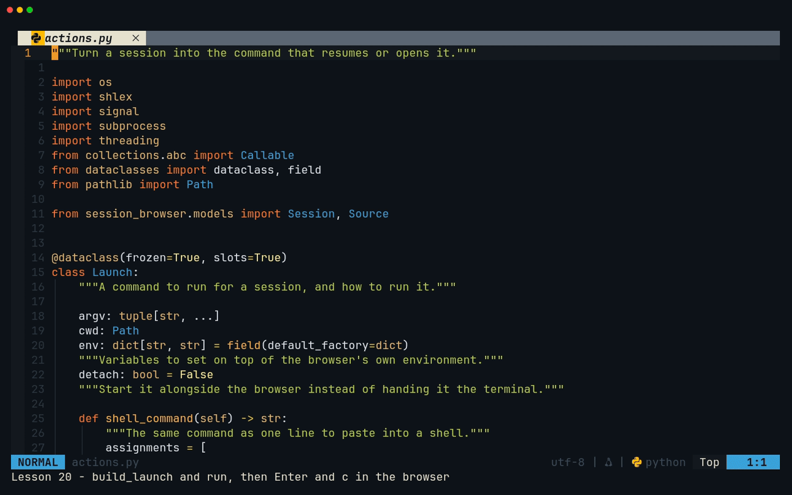
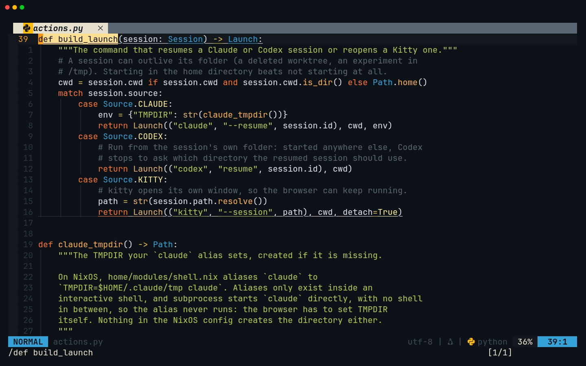
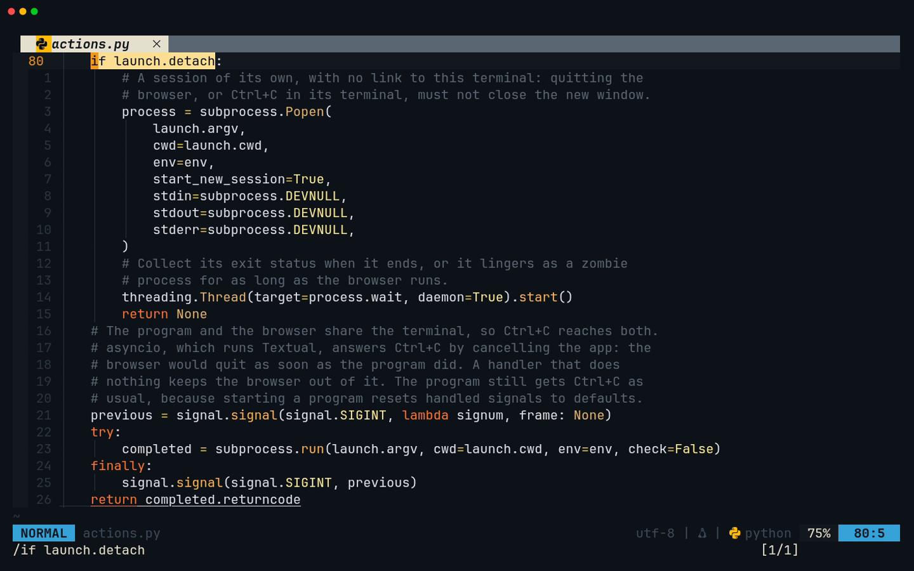
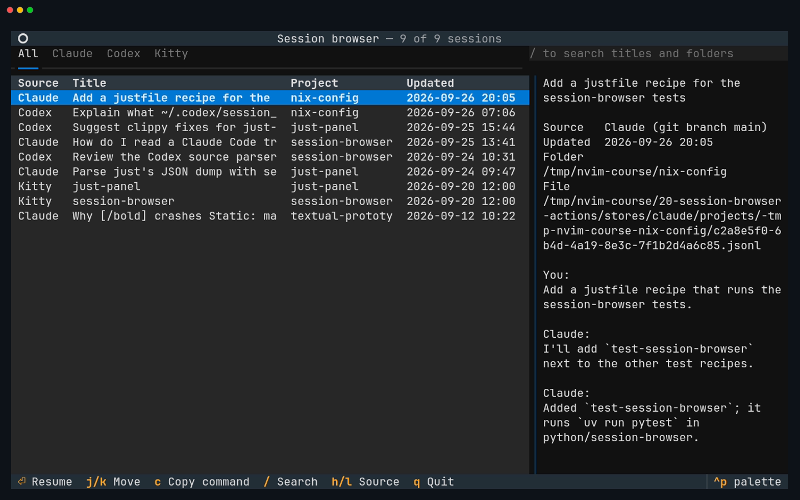
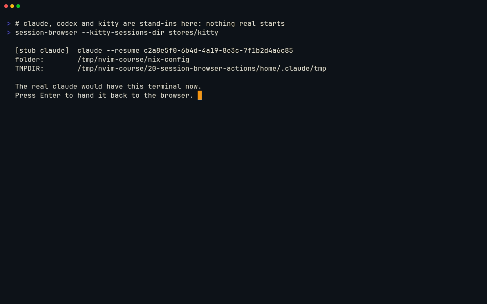
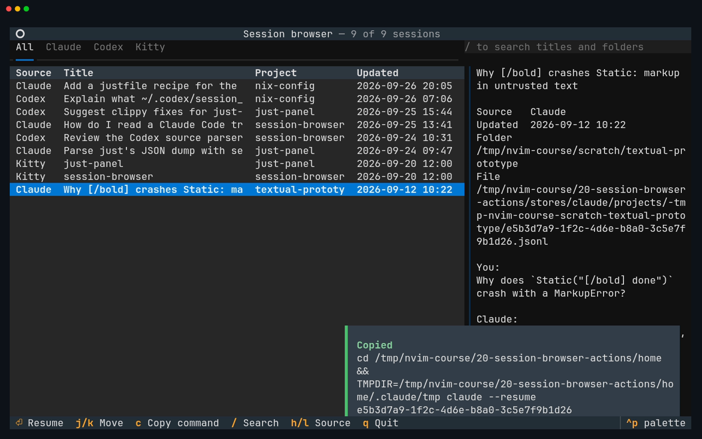
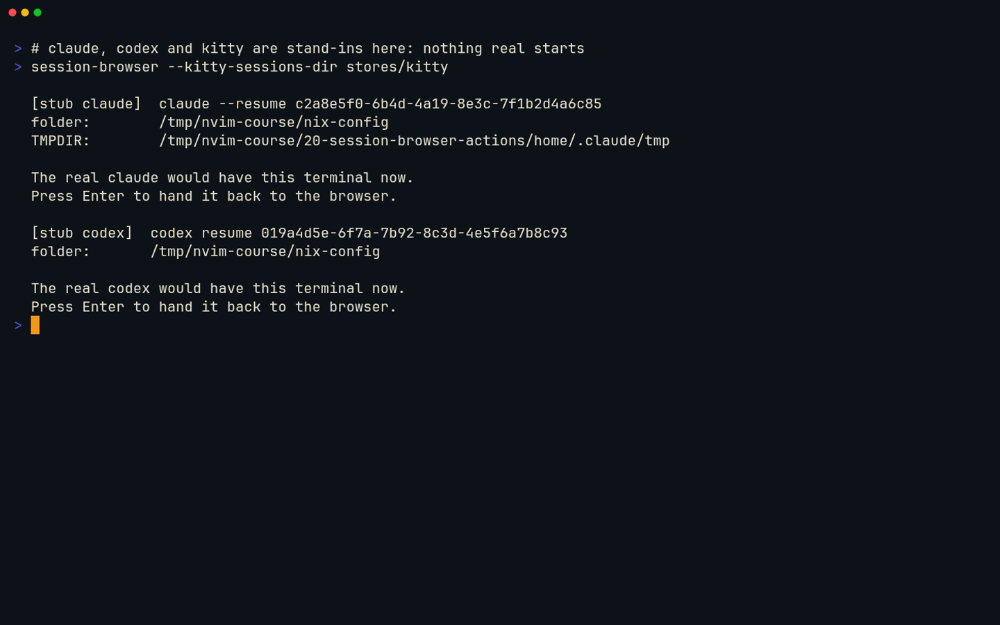
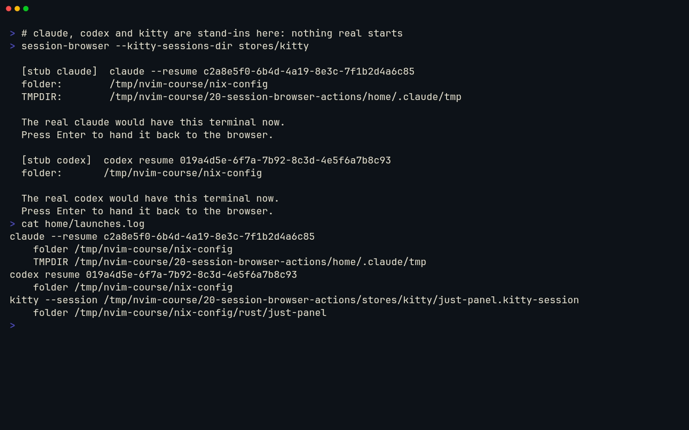

# Lesson 20 — session-browser: actions

**Last Updated**: 27/09/2026
**Version**: 1.0.0
**Maintained By**: Development Team
**Language**: British English (en_GB)
**Timezone**: Europe/London

---

Until now the browser has only looked. After this lesson, Enter on a row resumes that Claude Code or Codex
session in the folder it ran in, or opens a Kitty session in a new window, and `c` copies the exact command
so you can paste it anywhere. On the way you read Textual's own source from Neovim to find out why
`App.suspend()` needs careful handling, why Ctrl+C in a resumed program would otherwise quit the browser, and
why the thing that runs the command is a parameter you can swap for a fake. That last choice is what makes
lesson 21's app tests possible.

**Part**: 7 — Build session-browser · **Time**: ~100 min · **Previous**: [Lesson 19 — session-browser: filter and search](19-SESSION-BROWSER-FILTER-AND-SEARCH.md) · **Next**: [Lesson 21 — session-browser: testing and shipping](21-SESSION-BROWSER-TESTING-AND-SHIPPING.md)

## Objectives

- Say what Enter runs for each source, in which folder, and why.
- Describe a command as data: a frozen `Launch` built by `build_launch()` with `match`, turned into one
  pasteable shell line with `shlex`.
- Recreate the `claude` alias's `TMPDIR` in code, and explain why a program started from Python never sees an
  alias.
- Hand the terminal to a program with `App.suspend()` without losing the app when the program cannot start,
  and keep Ctrl+C away from the browser.
- Start Kitty detached, and reap it so no zombie process is left behind.
- Copy a command with `copy_to_clipboard()`.
- Make the launcher injectable, and know why headless tests need that.
- In Neovim: read library source with `gd`, come back with `<C-^>` or `<C-o>`, work in two files side by
  side, and let pyright check a `match` for you.

## Before you start

- You have finished [Lesson 19](19-SESSION-BROWSER-FILTER-AND-SEARCH.md): milestone **SB6** is committed and
  tagged. Check it:

  ```bash
  # in ~/Repos/personal/nix-config
  git tag --list 'course/*'
  git status --short
  ```

  `course/sb6` is listed and nothing is pending under `python/`.
- The checks pass. In a terminal (a Kitty window, or `<leader>t` in Neovim, where `<leader>` is Space):

  ```bash
  # in ~/Repos/personal/nix-config/python/session-browser
  uv run pytest -q
  uvx ruff check
  uvx ruff format --check
  uvx pyright
  ```

  Expect `41 passed` if your `.python-version` says 3.14, as it does on laptop-intel (`39 passed, 2 skipped`
  on 3.12: the two zstd tests need 3.14), `All checks passed!`, a line ending `files already formatted`, and
  `0 errors, 0 warnings, 0 informations`.
- The Kitty fixtures carry the fixed date from lesson 18 (`touch -d '2026-09-20 12:00:00 UTC'
  tests/fixtures/kitty/*.kitty-session`). If a checkout has rewritten them since, run it again: otherwise the
  Kitty rows jump to the top of the list. The tests pass either way.
- `claude` and `codex` start and are signed in when you run them in a normal terminal
  ([Lesson 13](13-CLAUDE-CODE-AND-CODEX.md)).
- Open Neovim in the project, on the app:

  ```bash
  # in a Kitty terminal
  cd ~/Repos/personal/nix-config/python/session-browser && nvim src/session_browser/app.py
  ```

## Keys in this lesson

| Keys | Mode | Action | Where it comes from |
|---|---|---|---|
| `<leader>t` | n | Toggle the bottom terminal | config (neovim.nix:27) |
| `<C-\><C-n>` | t | Leave Terminal mode, so Neovim keys work again | Neovim default |
| `gd` | n | Go to the definition, into the `.venv` for library code | config (LSP buffer-local) |
| `K` | n | Hover documentation for the name under the cursor | config (LSP buffer-local) |
| `<C-^>` | n | Back to the previous (alternate) buffer | Neovim default |
| `<C-o>` | n | Back one step in the jumplist | Neovim default |
| `/pattern`, `n` | n | Search forward, next match (wraps round at the end) | Neovim default |
| `zt` | n | Scroll so the cursor line is at the top | Neovim default |
| `:vsplit {file}` | c | Open a file in a new window on the right (`splitright`) | Neovim default (splitright: neovim.nix:249) |
| `<C-h>` / `<C-k>` / `<C-l>` | n | Window left / up / right | config (neovim.nix:68, :70, :71) |
| `dd`, `u` | n | Delete lines (`4dd` deletes four), undo | Neovim default |
| `<leader>xw` | n | Diagnostics of this buffer in Trouble (type it briskly) | config (neovim.nix:56) |
| `<leader>ld` | n | The diagnostic on this line, in a float | config (LSP buffer-local) |
| `:e!` | c | Throw away unsaved changes in this buffer | Neovim default |
| `<C-s>` | n | Save; conform runs `ruff format` first | config (neovim.nix:64) |
| `:DiffviewOpen {rev}` | c | Review everything since a commit or tag; `<leader>gq` closes it | diffview default |
| `<leader>gg` | n | Neogit, to commit | config (neovim.nix:35) |

## Walkthrough

Work through these with `app.py` open. Nothing here changes a file: the code arrives in the milestone.



[MP4](../media/20-session-browser-actions/20-session-browser-actions.mp4)

### 1. What Enter runs, and where

| Source | Command | Working folder | How it runs |
|---|---|---|---|
| Claude Code | `claude --resume <id>`, with `TMPDIR=~/.claude/tmp` | The session's folder | In this terminal: the browser steps aside until you quit Claude |
| Codex | `codex resume <id>` | The session's folder | In this terminal, the same way |
| Kitty | `kitty --session <absolute path of the file>` | The session file's first `cd` | Detached: a new window, and the browser keeps running |

- **The session's folder.** Since Claude Code 2.1.223, `claude --resume <id>` finds a session from any
  directory, but Claude still expects to run in its project: its picker lists sessions by the current
  worktree, and the project's `CLAUDE.md` and `.claude/settings.json` are found from the folder Claude starts
  in. Codex has a stronger reason (step 3).
- **A folder that has gone** (a deleted worktree, an experiment under `/tmp`) is not a reason to refuse. The
  browser starts in your home folder instead and tells you so.
- **`TMPDIR`.** `home/modules/shell.nix:60` makes `claude` an alias for `TMPDIR=$HOME/.claude/tmp claude`. The
  browser does the same thing in code (step 2). Why the alias sets it is not recorded in the repo.

**Try it:** `<leader>t` (Space, then `t`) opens the bottom terminal in Terminal mode:

```bash
# in ~/Repos/personal/nix-config/python/session-browser
type claude
ls -d ~/.claude/tmp
```

**You should see** `claude is an alias for TMPDIR=/home/<you>/.claude/tmp claude`, zsh's way of describing an
alias. `ls` either prints the folder or says `No such file or directory`: nothing in the NixOS config creates
it, which is why the browser creates it before it starts Claude.

### 2. A program started from Python never sees your aliases

An alias is text that an interactive zsh substitutes into the command line you type, before it runs
anything. `subprocess.run(["claude", "--resume", id])` has no shell in between: Python looks `claude` up on
`PATH` and starts the program directly, so the `TMPDIR=…` part of the alias never happens. The browser passes
`TMPDIR` in the child's environment itself, and creates `~/.claude/tmp` first. (claudecode.nvim starts the
bare `claude` in the same way, so the Claude split in Neovim does not get the alias's `TMPDIR` either.)

**Try it**, still in the terminal:

```bash
# in ~/Repos/personal/nix-config/python/session-browser
uv run python -c 'import shutil; print(shutil.which("claude"))'
```

**You should see** a full path to the `claude` program itself, somewhere in a Nix profile. That is what Python
will run: no alias anywhere.

### 3. Codex asks which folder to use

When you resume a Codex session from a folder other than the one the session last recorded, and
`tui.resume_cwd` is not set in `~/.codex/config.toml`, Codex stops and asks whether to use the session's
folder or the current one. Behind the browser that would be a surprise question in the middle of a hand-over.
Running `codex resume <id>` **from the session's folder** means the two match and there is no question. (The
alternative, `codex resume -C <dir> <id>`, forces "use this folder".)

**Try it:**

```bash
# in ~/Repos/personal/nix-config/python/session-browser
codex resume --help
```

**You should see** `[SESSION_ID]` in the usage line, and the `--last`, `--all` and `-C, --cd <DIR>` options.

### 4. Kitty opens a window of its own

- **An absolute path.** `kitty --session` resolves a *relative* path against Kitty's config folder, not the
  current folder, so the browser passes `session.path.resolve()`.
- **Detached.** `subprocess.Popen(..., start_new_session=True)` with `stdin`, `stdout` and `stderr` sent to
  `/dev/null` gives Kitty a session of its own with no link to this terminal: quitting the browser, or Ctrl+C
  in its terminal, cannot close the new window.
- **Reaped.** A finished child stays in the process table as a *zombie* until its parent collects its exit
  status. A daemon thread that calls `process.wait()` does that, for as long as the browser runs. Without it,
  `python -W error` shows `ResourceWarning: subprocess … is still running`.
- **Why not switch to the session inside a running Kitty** (`kitten @ action goto_session …`)? That needs
  Kitty's remote control, which this config leaves off (`home/stages/desktop.nix` sets neither
  `allow_remote_control` nor `listen_on`), and every Kitty that Hyprland starts is a separate process. It is a
  stretch goal in the [spec](../projects/SESSION-BROWSER-SPEC.md).

**Try it:** in the terminal, `kitty --detach`, then `SUPER + 0`.

**You should see** the new Kitty window on workspace 10, not on the one you are on: on laptop-intel every
ordinary new window goes there (the catch-all rule in `config/hypr/devices/laptop-intel.lua`; verify on
laptop-intel). Kitty sessions opened from the browser land there too. Close it with `SUPER + Q` and go back
with `SUPER` and your workspace's number.

### 5. Read `App.suspend()` before you trust it

`App.suspend()` is a context manager: inside `with self.suspend():` the app gives the terminal back exactly as
it was before the app started, and when the block ends it takes the terminal back and redraws. That is how
Claude and Codex get a real terminal. Read how it does it:

**Try it:**

1. `<C-\><C-n>` to leave Terminal mode, then `<C-k>` to go up to `app.py`.
2. `/App\[None` and `<CR>`: the cursor lands on `App` in `class SessionBrowser(App[None]):` (`\[` is a literal
   bracket in a search).
3. `K`: hover shows the class's docstring, `The base class for Textual Applications.` Move the cursor to close
   it.
4. `gd`: pyright opens Textual's own `app.py` from your `.venv` at `class App(...)`, around line 296. This works
   because `[tool.pyright]` points pyright at `.venv` (lesson 10).
5. `/def suspend` and `<CR>`, then `zt`. Read down to the `else:`.
6. `/SuspendNotSupported(` and `<CR>`.
7. `/def copy_to_clipboard` and `<CR>`: the search wraps round to the top ("search hit BOTTOM, continuing at
   TOP") and stops around line 1770.
8. `<C-^>` takes you straight back to your `app.py`. (`<C-o>` also works, one jump at a time.)

**You should see**, in Textual 8.2.8:

- in `suspend()`, a bare `yield` inside a `with (...)` block, and **after** it
  `self._driver.resume_application_mode()`. There is no `try`/`finally`, so if an exception leaves your
  `with self.suspend():` block, the resume never happens: the app is left without its terminal, frozen and
  reading no keys, or it crashes with a traceback.
- `raise SuspendNotSupported(...)` when the driver cannot suspend. The headless driver that tests use cannot,
  so inside `App.run_test()` a real launcher would fail.
- `copy_to_clipboard()` storing the text in `self._clipboard` (what `app.clipboard` returns, handy in tests)
  and writing `\x1b]52;c;…\a`: the OSC 52 escape sequence. The terminal decides what to do with it.

Three design decisions follow, and the milestone makes all three:

1. **Catch inside, raise after.** `run_in_terminal()` catches `OSError` *inside* the `with` block, keeps it,
   and raises it again after the block, once the app has its terminal back. That covers every start-up
   failure: a program that is not installed (`FileNotFoundError`), a folder you may not enter, a file that is
   not a runnable program.
2. **An injectable launcher.** `SessionBrowser(launcher=…)` takes any function that accepts a `Launch`. The
   real one, `run_in_terminal`, is the default. Tests pass `launches.append` and check what *would* have run.
3. **Report a failure you cannot see.** Whatever the program prints goes to the terminal's normal screen,
   behind the app. If it fails at once, `suspend()` switches straight back and you would only see a flicker.
   So a positive exit status becomes a warning: "claude exited with status 1. Quit the browser to read what
   it printed."

> **Gotcha:** the Textual buffer you opened with `gd` is an ordinary, writable file inside your `.venv`. Do
> not type in it. If you changed something by accident, `:e!` throws the change away.

### 6. Ctrl+C belongs to the program, not the browser

While Claude runs inside `suspend()`, the program and the browser share one terminal, so Ctrl+C sends SIGINT
to both. Textual runs under `asyncio.run()`, and asyncio answers the first SIGINT by cancelling the app's main
task: the moment Claude exits, the browser would quit too.

The fix is a Python handler that does nothing, installed only around the blocking `subprocess.run()` and
restored afterwards. It must **not** be `signal.SIG_IGN`: an ignored signal stays ignored in the child after
`exec`, so Ctrl+C could no longer stop Claude. A *handled* signal is reset to its default when the child starts
its program, so the child still gets Ctrl+C as usual.

**Try it:**

```bash
# in ~/Repos/personal/nix-config/python/session-browser
uv run python -c 'import asyncio.runners, inspect; print(inspect.getsource(asyncio.runners.Runner._on_sigint))'
```

**You should see** `def _on_sigint(self, signum, frame, main_task):`, whose first interrupt calls
`main_task.cancel()`. That is the handler the do-nothing handler stands in for.

Ctrl+Z needs nothing from you: Textual handles SIGTSTP and SIGCONT itself, so `fg` brings back the program and
then the browser. Ctrl+\ (SIGQUIT) is not guarded and still ends the browser; the spec lists it as a known
limitation.

### 7. Copy: one line you can paste anywhere

`Launch.shell_command()` writes the same command as a shell line: `cd <folder> && TMPDIR=… claude --resume
<id>`. `shlex.quote()` and `shlex.join()` add quotes only where the shell needs them, so a folder with a space
still pastes correctly.

**Try it:**

```bash
# in ~/Repos/personal/nix-config/python/session-browser
uv run python -c 'import shlex; print(shlex.join(["cd", "/tmp/my project"]), shlex.quote("plain"))'
```

**You should see** `cd '/tmp/my project' plain`.

`c` hands the line to `copy_to_clipboard()`, whose OSC 52 sequence Kitty passes to the system clipboard
(Kitty's default `clipboard_control` allows programs to write it). Paste it in another Kitty window with
`ctrl+shift+v`.

### 8. Two files side by side

You will type `actions.py` while looking at `app.py`, which calls it.

**Try it:** in the `app.py` window, `:vsplit src/session_browser/actions.py`, then `<C-h>` and `<C-l>`.

**You should see** `actions.py` open on the right (the config sets `splitright`), holding the one docstring
line you wrote in lesson 07, with the cursor in it. `<C-h>` and `<C-l>` move between the two windows. Leave
the split open for the milestone.

## Gotchas in this config

- **The `claude` alias does not apply.** It lives in zsh (shell.nix:60). Anything that starts `claude` without
  a shell, the browser and claudecode.nvim included, gets the bare program. The browser sets `TMPDIR` itself
  and creates `~/.claude/tmp`, which nothing else creates. A side effect: `c` creates it too, because it
  builds the same `Launch`.
- **Codex's folder question.** Run `codex resume` from the session's folder, or set `tui.resume_cwd` in
  `~/.codex/config.toml`. That file is not managed by Nix.
- **`App.suspend()` is not exception-safe in Textual 8.2.8.** Catch inside the block and raise after it, or a
  failed start leaves the app frozen or crashed.
- **Ctrl+C would quit the browser**, through asyncio's SIGINT handler. The guard is a do-nothing handler, never
  `SIG_IGN`. Ctrl+\ is still unguarded.
- **Output goes behind the app.** A program that fails straight away is only visible as a warning; quit the
  browser (`q`) to read what it printed.
- **New Kitty windows land on workspace 10** on laptop-intel (the catch-all rule in
  `config/hypr/devices/laptop-intel.lua`); `SUPER + 0` goes there. Verify on laptop-intel.
- **Inside `<leader>t`, every key goes to the browser**, Esc included, because the terminal is in Terminal
  mode; `<C-\><C-n>` gets you out. A resumed Claude in a 15-row pane is cramped: for real use, run the browser
  in a Kitty window (`SUPER + RETURN`, then `SUPER + 0`: new windows open on workspace 10) or the dev layout's free
  shell. Whether `c`'s OSC 52 sequence gets from Neovim's terminal to your clipboard: verify on laptop-intel.
- **`<leader>xw` shares the `<leader>x` prefix with "close buffer"** (neovim.nix:55-56, :63). Type Space x w
  briskly: a pause after Space x closes the buffer.
- **`gd` into a library opens a second `app.py`**, and the bufferline shows both. `<C-^>` goes back; `:bd` in
  the library buffer closes it.
- **A mouse click on the highlighted row resumes it**: Textual's `DataTable` selects on a second click. Keep to
  the keyboard.

## Drills

1. From `class SessionBrowser(App[None])`, reach Textual's `suspend()` and come back, in as few keys as you can.
   <details><summary>Answer</summary>

   With the cursor on `App`: `gd`, `/def suspend` and `<CR>`, read, then `<C-^>` to return. `<C-o>` also
   returns, one jump at a time.
   </details>

2. Why does `build_launch()` return a `Launch` instead of running the command itself?
   <details><summary>Answer</summary>

   So the decision is plain data. Tests compare it with `==` (`Launch` is a frozen dataclass), `c` turns the
   same value into a shell line, and the launcher alone decides how to run it: in the terminal, detached, or
   not at all in a test.
   </details>

3. A colleague "simplifies" the guard in `run()` to `signal.signal(signal.SIGINT, signal.SIG_IGN)`. What
   breaks, and which test catches it?
   <details><summary>Answer</summary>

   An ignored signal is inherited across `exec`, so Ctrl+C no longer reaches Claude or Codex.
   `test_the_command_itself_still_gets_ctrl_c` fails: its child survives `kill -INT $$` and creates the
   `survived` file.
   </details>

4. Enter on a Claude session whose folder was deleted: what happens? And what does `c` copy for it?
   <details><summary>Answer</summary>

   The app posts a warning, "<folder> no longer exists; starting in ~.", and Claude resumes in your home
   folder; you see the warning when you come back, if that is within about five seconds. `c` copies
   `cd /home/<you> && TMPDIR=/home/<you>/.claude/tmp claude --resume <id>`.
   </details>

5. You delete the `case Source.KITTY:` block to see what happens. Where does Neovim tell you, and how do you
   read the message?
   <details><summary>Answer</summary>

   A sign appears in the sign column at `def build_launch` (line 39). `<leader>xw` lists it in Trouble, or put
   the cursor on that line and press `<leader>ld`: "Function with declared return type "Launch" must return
   value on all code paths". `u` brings the block back.
   </details>

6. Why does the Kitty `Launch` carry an absolute path?
   <details><summary>Answer</summary>

   `kitty --session` resolves a relative path against Kitty's config folder, not the current folder.
   </details>

7. Run only the two Ctrl+C tests.
   <details><summary>Answer</summary>

   `uv run pytest -q -k ctrl_c` (both test names contain `ctrl_c`): `2 passed, 51 deselected`.
   </details>

8. You resume a session and are back in the list a moment later, with the warning "claude exited with status
   1". Where is Claude's error message?
   <details><summary>Answer</summary>

   On the terminal's normal screen, behind the app. Quit the browser with `q` and it is there above your
   prompt.
   </details>

## Milestone SB7: Enter resumes, `c` copies

**Goal:** Enter on a row resumes the session (Claude, Codex) or opens it (Kitty); every start-up failure is
reported and the app stays usable; Ctrl+C in a resumed program returns you to the browser; `c` copies the
command. Three files change:

| File | Change |
|---|---|
| `src/session_browser/actions.py` | Filled in: `Launch`, `build_launch()`, `claude_tmpdir()`, `run()` |
| `tests/test_actions.py` | New: 12 tests |
| `src/session_browser/app.py` | Five edits: imports, two binding lists, `__init__`, three new methods |



### Step 1: `actions.py`

In the right-hand window from walkthrough step 8, keep the docstring on line 1 and type the rest, so that the
file reads:

```python
"""Turn a session into the command that resumes or opens it."""

import os
import shlex
import signal
import subprocess
import threading
from collections.abc import Callable
from dataclasses import dataclass, field
from pathlib import Path

from session_browser.models import Session, Source


@dataclass(frozen=True, slots=True)
class Launch:
    """A command to run for a session, and how to run it."""

    argv: tuple[str, ...]
    cwd: Path
    env: dict[str, str] = field(default_factory=dict)
    """Variables to set on top of the browser's own environment."""
    detach: bool = False
    """Start it alongside the browser instead of handing it the terminal."""

    def shell_command(self) -> str:
        """The same command as one line to paste into a shell."""
        assignments = [
            f"{name}={shlex.quote(value)}" for name, value in self.env.items()
        ]
        command = " ".join([*assignments, shlex.join(self.argv)])
        return f"cd {shlex.quote(str(self.cwd))} && {command}"


type Launcher = Callable[[Launch], None]
"""Something that runs a Launch. The app's real one needs a real terminal."""


def build_launch(session: Session) -> Launch:
    """The command that resumes a Claude or Codex session or reopens a Kitty one."""
    # A session can outlive its folder (a deleted worktree, an experiment in
    # /tmp). Starting in the home directory beats not starting at all.
    cwd = session.cwd if session.cwd and session.cwd.is_dir() else Path.home()
    match session.source:
        case Source.CLAUDE:
            env = {"TMPDIR": str(claude_tmpdir())}
            return Launch(("claude", "--resume", session.id), cwd, env)
        case Source.CODEX:
            # Run from the session's own folder: started anywhere else, Codex
            # stops to ask which directory the resumed session should use.
            return Launch(("codex", "resume", session.id), cwd)
        case Source.KITTY:
            # kitty opens its own window, so the browser can keep running.
            path = str(session.path.resolve())
            return Launch(("kitty", "--session", path), cwd, detach=True)


def claude_tmpdir() -> Path:
    """The TMPDIR your `claude` alias sets, created if it is missing.

    On NixOS, home/modules/shell.nix aliases `claude` to
    `TMPDIR=$HOME/.claude/tmp claude`. Aliases only exist inside an
    interactive shell, and subprocess starts `claude` directly, with no shell
    in between, so the alias never runs: the browser has to set TMPDIR
    itself. Nothing in the NixOS config creates the directory either.
    """
    path = Path.home() / ".claude" / "tmp"
    path.mkdir(parents=True, exist_ok=True)
    return path


def run(launch: Launch) -> int | None:
    """Run the command. Wait for it to exit and return its exit status, or,
    if it is detached, return None straight away.

    Raises FileNotFoundError when the program is not installed, and another
    OSError when it cannot be started at all.
    """
    env = {**os.environ, **launch.env}
    if launch.detach:
        # A session of its own, with no link to this terminal: quitting the
        # browser, or Ctrl+C in its terminal, must not close the new window.
        process = subprocess.Popen(
            launch.argv,
            cwd=launch.cwd,
            env=env,
            start_new_session=True,
            stdin=subprocess.DEVNULL,
            stdout=subprocess.DEVNULL,
            stderr=subprocess.DEVNULL,
        )
        # Collect its exit status when it ends, or it lingers as a zombie
        # process for as long as the browser runs.
        threading.Thread(target=process.wait, daemon=True).start()
        return None
    # The program and the browser share the terminal, so Ctrl+C reaches both.
    # asyncio, which runs Textual, answers Ctrl+C by cancelling the app: the
    # browser would quit as soon as the program did. A handler that does
    # nothing keeps the browser out of it. The program still gets Ctrl+C as
    # usual, because starting a program resets handled signals to defaults.
    previous = signal.signal(signal.SIGINT, lambda signum, frame: None)
    try:
        completed = subprocess.run(launch.argv, cwd=launch.cwd, env=env, check=False)
    finally:
        signal.signal(signal.SIGINT, previous)
    return completed.returncode
```

`<C-s>`. If you typed it exactly, `ruff format` (run by conform on save) changes nothing.

What each part does:

- **`Launch`** is frozen and slotted like `Session`. `env` holds only the variables to set *on top of* the
  browser's environment; `run()` merges them over `os.environ`. `field(default_factory=dict)` gives each
  `Launch` its own dictionary.
- **`Launcher`** is a type alias (the `type` statement, Python 3.12) for "anything that takes a `Launch`".
- **`build_launch()`** does a `match` on the source. The folder check comes first, so all three cases share the
  home-folder fallback.
- **`claude_tmpdir()`** creates `~/.claude/tmp` (`exist_ok=True` makes it safe to call every time).
- **`run()`** is the only function that starts anything: detached with a reaper thread, or blocking under the
  SIGINT guard, returning the exit status.



**Check it with pyright.** `<leader>xw` (Space x w, briskly): Trouble reports no results for this buffer.
Now see pyright check the `match` for you: `/case Source.KITTY` and `<CR>`, then `4dd` to delete that case.
Within a moment a sign appears on line 39; `<leader>xw` lists "Function with declared return type "Launch"
must return value on all code paths". With three sources covered, pyright knows the `match` is exhaustive.
With one missing, it knows the function can fall off the end and return `None`. Add a fourth `Source` one day
and this is the error that tells you where to handle it. `u` brings the case back; `<C-s>`.

### Step 2: `tests/test_actions.py`

`:e tests/test_actions.py` opens a new, empty file. Type:

```python
"""Building and running the commands that resume sessions."""

import signal
import time
from datetime import UTC, datetime
from pathlib import Path

import pytest

from session_browser.actions import Launch, build_launch, run
from session_browser.models import Session, Source

WHEN = datetime(2026, 9, 24, 9, 47, tzinfo=UTC)


def make_session(source: Source, cwd: Path | None, path: str = "s.jsonl") -> Session:
    return Session(source, "abc-123", "A title", cwd, WHEN, Path(path))


def test_claude_resumes_by_id_in_the_session_folder(tmp_path: Path) -> None:
    launch = build_launch(make_session(Source.CLAUDE, tmp_path))

    assert launch.argv == ("claude", "--resume", "abc-123")
    assert launch.cwd == tmp_path
    assert not launch.detach


def test_claude_gets_the_alias_tmpdir_and_it_exists(tmp_path: Path) -> None:
    launch = build_launch(make_session(Source.CLAUDE, tmp_path))

    tmpdir = tmp_path / ".claude" / "tmp"  # HOME is tmp_path in tests
    assert launch.env == {"TMPDIR": str(tmpdir)}
    assert tmpdir.is_dir()


def test_codex_resumes_by_id_in_the_session_folder(tmp_path: Path) -> None:
    launch = build_launch(make_session(Source.CODEX, tmp_path))

    assert launch == Launch(("codex", "resume", "abc-123"), tmp_path)


def test_kitty_opens_the_session_file_detached(tmp_path: Path) -> None:
    file = tmp_path / "work.kitty-session"

    launch = build_launch(make_session(Source.KITTY, tmp_path, str(file)))

    assert launch.argv == ("kitty", "--session", str(file))
    assert launch.detach


def test_missing_folder_falls_back_to_home(tmp_path: Path) -> None:
    launch = build_launch(make_session(Source.CODEX, tmp_path / "gone"))

    assert launch.cwd == tmp_path  # HOME


def test_shell_command_quotes_what_needs_quoting() -> None:
    launch = Launch(
        ("claude", "--resume", "abc-123"),
        Path("/tmp/my project"),
        {"TMPDIR": "/home/me/.claude/tmp"},
    )

    assert launch.shell_command() == (
        "cd '/tmp/my project' && TMPDIR=/home/me/.claude/tmp claude --resume abc-123"
    )


def test_run_waits_and_passes_cwd_and_env(tmp_path: Path) -> None:
    run(
        Launch(("sh", "-c", 'echo "$GREETING" > out.txt'), tmp_path, {"GREETING": "hi"})
    )

    assert (tmp_path / "out.txt").read_text() == "hi\n"


def test_run_returns_the_exit_status(tmp_path: Path) -> None:
    assert run(Launch(("sh", "-c", "exit 3"), tmp_path)) == 3
    # A detached command has not finished yet, so there is no status to give.
    assert run(Launch(("sh", "-c", "exit 3"), tmp_path, detach=True)) is None


def test_run_detached_returns_straight_away(tmp_path: Path) -> None:
    started = time.monotonic()

    run(Launch(("sh", "-c", "touch started; sleep 2"), tmp_path, detach=True))

    assert time.monotonic() - started < 1
    while not (tmp_path / "started").exists():
        assert time.monotonic() - started < 5, "the detached command never ran"
        time.sleep(0.05)


def test_ctrl_c_during_a_command_does_not_reach_the_browser(tmp_path: Path) -> None:
    before = signal.getsignal(signal.SIGINT)

    # The command sends SIGINT to its parent, as Ctrl+C in a shared terminal
    # would. Without the guard in run(), pytest itself would be interrupted.
    run(Launch(("sh", "-c", "kill -INT $PPID"), tmp_path))

    assert signal.getsignal(signal.SIGINT) == before


def test_the_command_itself_still_gets_ctrl_c(tmp_path: Path) -> None:
    # If run() ignored SIGINT outright, the child would inherit that, survive
    # the signal and create the file.
    run(Launch(("sh", "-c", "kill -INT $$; touch survived"), tmp_path))

    assert not (tmp_path / "survived").exists()


def test_run_reports_a_missing_program(tmp_path: Path) -> None:
    with pytest.raises(FileNotFoundError):
        run(Launch(("no-such-program-for-the-course",), tmp_path))
```

`<C-s>`, then run just this file in `<leader>t`:

```bash
# in ~/Repos/personal/nix-config/python/session-browser
uv run pytest -q tests/test_actions.py
```

Expect `12 passed`. Points worth noticing:

- `tests/conftest.py` already sets `HOME` to the test's own `tmp_path` (lesson 10), which is why the `TMPDIR`
  test finds `.claude/tmp` under `tmp_path`, and why nothing touches your real `~/.claude`.
- The `run()` tests use `sh -c` as a harmless stand-in for Claude. `exit 3` gives a status to return.
- **The two signal tests** were written to fail against the naive versions. The first: the child sends
  SIGINT to its parent (`kill -INT $PPID`), as Ctrl+C in a shared terminal would. Without the guard, pytest
  itself is interrupted. The second: the child sends SIGINT to itself and must die before `touch survived`.
  With `SIG_IGN` it would survive.

### Step 3: `app.py`

`:e src/session_browser/app.py` (or `<C-h>` if it is still in the left window). Five edits; each block below
is how that part of the file must read afterwards.

**3a. Imports.** Two new lines, between `textual.widgets` and `session_browser.models`, in the order ruff's
import sorting (`I`) expects:

```python
from textual import work
from textual.app import App, ComposeResult
from textual.binding import Binding
from textual.containers import Horizontal, VerticalScroll
from textual.content import Content
from textual.widgets import DataTable, Footer, Header, Input, Static, Tab, Tabs

from session_browser import actions
from session_browser.actions import Launch, Launcher, build_launch
from session_browser.models import Session, Source
from session_browser.sources import claude, codex, kitty
```

**3b. The table's bindings.** `DataTable` already binds Enter to `select_cursor`; this copy only gives it the
footer label "Resume":

```python
    BINDINGS = [
        # DataTable already binds Enter; this copy only adds a footer label.
        Binding("enter", "select_cursor", "Resume"),
        Binding("j", "cursor_down", "Move", key_display="j/k"),
        Binding("k", "cursor_up", "Up", show=False),
        Binding("g", "scroll_top", "Top", show=False),
        Binding("G", "scroll_bottom", "Bottom", show=False),
    ]
```

**3c. The app's bindings.** `c` goes first, so it is listed first in the footer after "Resume" and "Move":

```python
    BINDINGS = [
        Binding("c", "copy_command", "Copy command"),
        Binding("slash", "focus_search", "Search", key_display="/"),
        Binding("l", "next_source", "Source", key_display="h/l"),
        Binding("h", "previous_source", "Previous source", show=False),
        # Escape has to live here, on the app: the search box has no binding
        # for it, so the key bubbles up from the Input to the app.
        Binding("escape", "focus_table", "Back to the list", show=False),
        Binding("q", "quit", "Quit"),
    ]
```

**3d. `__init__`** takes the launcher. `launcher or self.run_in_terminal` makes the real launcher the default:

```python
    def __init__(
        self, kitty_dir: Path | None = None, launcher: Launcher | None = None
    ) -> None:
        super().__init__()
        self.kitty_dir = kitty_dir
        # Tests pass a fake: suspend() needs a real terminal, and inside
        # run_test() it raises SuspendNotSupported.
        self.launcher = launcher or self.run_in_terminal
        self.sessions: dict[str, Session] = {}
```

**3e. Three new methods**, between `on_data_table_row_highlighted` and `action_focus_search`:

```python
    def on_data_table_row_selected(self, event: DataTable.RowSelected) -> None:
        session = self.sessions.get(event.row_key.value or "")
        if session is None:
            return
        launch = build_launch(session)
        if session.cwd and session.cwd != launch.cwd:
            gone, instead = tilde(session.cwd), tilde(launch.cwd)
            self.notify(
                printable(f"{gone} no longer exists; starting in {instead}."),
                severity="warning",
                markup=False,
            )
        try:
            self.launcher(launch)
        except FileNotFoundError:
            self.notify(
                f"Could not find {launch.argv[0]!r}. Is it installed and on PATH?",
                severity="error",
                markup=False,
            )
        except OSError as error:  # found, but it could not be started
            self.notify(
                f"Could not start {launch.argv[0]!r}: {error.strerror}.",
                severity="error",
                markup=False,
            )

    def run_in_terminal(self, launch: Launch) -> None:
        """The real launcher. A detached command just starts; any other one
        borrows the terminal until it exits."""
        if launch.detach:
            actions.run(launch)
            return
        # suspend() puts the terminal back the way it was before the app
        # started, runs the block, then takes the terminal back. In Textual
        # 8.2.8 that last step only happens if the block finishes normally: an
        # exception escaping it leaves the app without its terminal. So the
        # block holds on to any error, and it is raised once the app is back.
        status: int | None = None
        error: OSError | None = None
        with self.suspend():
            try:
                status = actions.run(launch)
            except OSError as caught:  # not installed, folder not allowed...
                error = caught
        if error is not None:
            raise error
        if status is not None and status > 0:
            # Whatever it printed is on the terminal behind the app.
            self.notify(
                f"{launch.argv[0]} exited with status {status}. "
                "Quit the browser to read what it printed.",
                severity="warning",
                markup=False,
            )

    def action_copy_command(self) -> None:
        table = self.query_one(SessionTable)
        if table.row_count == 0:
            return
        row_key, _ = table.coordinate_to_cell_key(table.cursor_coordinate)
        session = self.sessions[row_key.value or ""]
        command = build_launch(session).shell_command()
        # Written to the terminal as an escape sequence (OSC 52), which kitty
        # passes on to the system clipboard.
        self.copy_to_clipboard(command)
        self.notify(printable(command), title="Copied", markup=False)
```

How they fit together:

- **`on_data_table_row_selected`** runs on Enter. It builds the `Launch`, warns if the session's folder has
  gone, then calls `self.launcher`. It is also where every start-up error ends up: `FileNotFoundError` (not
  installed) first, because it is a subclass of `OSError`, then any other `OSError`, using its `strerror`
  ("Permission denied", "Exec format error"). The app stays usable either way.
- **Session text in notifications** goes through `printable()` from lesson 18 and `markup=False`, like the
  table and the preview: a folder name is untrusted text, and an escape sequence in it must not reach your
  terminal.
- **`run_in_terminal`** is the real launcher: a detached command just starts; anything else runs inside
  `self.suspend()`, with the error kept and raised after the block, and a positive exit status turned into a
  warning. A negative status means a signal ended the program (your Ctrl+C, for example), so it is not
  reported.
- **`action_copy_command`** does nothing in an empty list, reads the row under the cursor, and copies
  `shell_command()`.

`<C-s>`. In `<leader>t`, `git diff --stat` should report `2 files changed, 184 insertions(+), 1 deletion(-)`
(`actions.py` and `app.py`; the new test file is untracked, so it is not counted).

The browser's keys after this milestone (the app's own bindings, not Neovim's):

| Key | Where | Action |
|---|---|---|
| `Enter` | list | Resume the session (Kitty: open it in a new window) |
| `c` | anywhere but the search box | Copy the resume command |
| `j` / `k`, `g` / `G` | list | Move, first, last (lesson 19) |
| `h` / `l`, `/`, `Esc`, `q` | as in lesson 19 | Source tabs, search, back to the list, quit |

### Step 4: check it

```bash
# in ~/Repos/personal/nix-config/python/session-browser
uv run pytest -q
uvx ruff check
uvx ruff format --check
uvx pyright
```

Expect `53 passed` on 3.14 (`51 passed, 2 skipped` on 3.12), `All checks passed!`, `19 files already formatted`
(ruff 0.16 counts Markdown too: the milestone's 17 files plus lesson 13's `AGENTS.md` and `CLAUDE.md`) and
`0 errors, 0 warnings, 0 informations`.

### Step 5: try it safely, with stand-in programs

Before you point the browser at your real sessions, run it on copies of the synthetic stores, with stand-in
`claude`, `codex` and `kitty` scripts as the **only** programs on its `PATH`, and a throwaway `HOME`. The
stand-ins live in the course's fixtures: they print what they were given, note it in `$HOME/launches.log`, and
(for Claude and Codex) wait for Enter the way the real programs keep the terminal until you quit. Use a Kitty
window (`SUPER + RETURN`, then `SUPER + 0`) so the browser has the
whole screen:

```bash
# in ~/Repos/personal/nix-config/python/session-browser
D=/tmp/nvim-course/20-session-browser-actions
rm -rf "$D" && mkdir -p "$D/home" /tmp/nvim-course/nix-config/rust/just-panel /tmp/nvim-course/nix-config/python/session-browser
cp -r ../../docs/NEOVIM-COURSE/fixtures/20-session-browser-actions/bin "$D/bin"
cp -r tests/fixtures/. "$D/stores"
touch -d '2026-09-20 12:00:00 UTC' "$D"/stores/kitty/*
HOME=$D/home PATH=$D/bin CLAUDE_CONFIG_DIR=$D/stores/claude CODEX_HOME=$D/stores/codex \
  .venv/bin/session-browser --kitty-sessions-dir "$D/stores/kitty"
```

- The two `mkdir -p /tmp/nvim-course/nix-config/…` folders exist so that most fixture sessions find their
  folder; the textual-prototype one deliberately does not.
- `touch -d` gives the copied Kitty files a fixed time. A fresh copy is stamped "now", which would put the two
  Kitty sessions at the top of a list sorted newest first.
- The browser is started from `.venv/bin` because `PATH` holds nothing but the stand-ins.
- The folder is the one the lesson's recording uses, so the pictures below match what you see (apart from the
  command line: the recording wraps this command in a short shell function).



1. **Enter** on the first row (a Claude session). The browser disappears, and the stand-in prints
   `[stub claude]  claude --resume c2a8e5f0-…`, the folder `/tmp/nvim-course/nix-config` and
   `TMPDIR: /tmp/nvim-course/20-session-browser-actions/home/.claude/tmp`. Press Enter: the browser is back,
   exactly where you left it.

   

2. **`l` `l`** to the Codex tab, **Enter**: `[stub codex]  codex resume 019a4d5e-…` in
   `/tmp/nvim-course/nix-config`. Enter to come back.
3. **`l`** to the Kitty tab, **Enter**: nothing visible happens and the browser keeps running. That is
   "detached": the stand-in `kitty` had no terminal to print to.
4. **`l`** back to All, **`G`** to the last row (the textual-prototype session, whose folder is missing),
   **Enter**: the stand-in shows your throwaway home, `/tmp/nvim-course/20-session-browser-actions/home`, as
   the folder. Press Enter within a few seconds and the browser comes back still showing the warning
   "/tmp/nvim-course/scratch/textual-prototype no longer exists; starting in ~.". A notification lasts about
   five seconds, and that time keeps passing while the stand-in has the terminal.
5. **`c`** on the same row: a "Copied" notification with
   `cd /tmp/nvim-course/20-session-browser-actions/home && TMPDIR=… claude --resume e5b3d7a9-…`.

   

6. **`q`**. Above your prompt is everything the stand-ins printed while the browser was away. Then read the
   log:

   ```bash
   # in ~/Repos/personal/nix-config/python/session-browser
   cat /tmp/nvim-course/20-session-browser-actions/home/launches.log
   ```

   One entry per launch: the arguments and the folder, and for Claude the `TMPDIR` too. The Kitty entry
   shows the absolute path of `just-panel.kitty-session` and the folder from its first `cd`.

   

   

Now two failure cases, still harmless:

- **Not installed.** Start the browser the same way but with `PATH=$D/nothing` (a folder that does not exist)
  and press Enter: "Could not find 'claude'. Is it installed and on PATH?", and the app carries on.
- **Ctrl+C.** Start it normally, Enter on the Claude row, and press Ctrl+C while the stand-in waits: the
  stand-in stops, the browser comes back, and `l` still changes the tab.

### Step 6: try it for real

In a Kitty window, run the browser on your own sessions:

```bash
# in ~/Repos/personal/nix-config/python/session-browser
uv run session-browser
```

Pick a Claude session and press Enter. Claude resumes in that session's folder. Resuming by ID restores the
session's permission mode, so check Claude's mode line as in lesson 13 before you ask for edits. `/exit`
brings you back to the list. Do the same with a Codex session (`/quit`). Then `c` on a row, and paste into
another Kitty window with `ctrl+shift+v`.

### Step 7: review, commit and tag

1. `:DiffviewOpen course/sb6`: under Changes, only `actions.py`, `app.py` and the new `tests/test_actions.py`.
   `<Tab>` between them, `]c` / `[c` between changes, `<leader>gq` to close.
2. `<leader>gg`. `s` on `src/session_browser/actions.py` and `src/session_browser/app.py` under **Unstaged
   changes**, and on `tests/test_actions.py` under **Untracked files**.
3. `c`, `c`, and write:

   ```text
   feat(session-browser): resume sessions and copy the resume command

   - actions.py: Launch (arguments, folder, extra environment, detached
     or not), build_launch() for Claude Code, Codex and Kitty, and run(),
     which hands the terminal over or starts kitty detached and reaps it.
   - app.py: Enter resumes through an injectable launcher inside
     App.suspend(); start-up errors and a non-zero exit are reported and
     the app stays usable. c copies the command as one shell line.
   - 12 tests, including Ctrl+C reaching the program but not the browser.
   ```

   `<c-c><c-c>`, then `q` to leave Neogit.
4. Tag the commit, so you can diff against and return to this milestone later (lesson 21's review starts
   from it). In the terminal:

   ```bash
   # in ~/Repos/personal/nix-config
   git tag course/sb7
   ```

### Check it

```bash
# in ~/Repos/personal/nix-config
git log --oneline --decorate -2
git tag --list 'course/*'
git diff --stat course/sb6 course/sb7
```

`git log` shows the SB7 commit with `tag: course/sb7` on top of the SB6 commit with `tag: course/sb6`, and
`git diff --stat` reports `3 files changed, 298 insertions(+), 1 deletion(-)`: `actions.py`, `app.py` and
`tests/test_actions.py`. Do not push.

Stuck? Compare with [examples/session-browser/SB7](../examples/session-browser/SB7/) — see [examples/README.md](../examples/README.md).

## Recap

- Enter runs `claude --resume <id>` (with `TMPDIR=~/.claude/tmp`) or `codex resume <id>` in the session's
  folder, or `kitty --session <absolute path>` detached; a missing folder falls back to home, with a warning.
- Aliases live in the interactive shell. A program started from Python gets none of them, so the browser sets
  `TMPDIR` and creates `~/.claude/tmp` itself.
- Running Codex from the session's folder avoids its "which folder?" question.
- `App.suspend()` in Textual 8.2.8 resumes only if the block ends normally: catch `OSError` inside, raise
  after.
- Ctrl+C: a do-nothing handler around `subprocess.run()`, never `SIG_IGN`.
- Detached Kitty: `start_new_session=True`, `/dev/null` for all three streams, and a thread that waits.
- `c`: `shlex`-quoted `shell_command()` through `copy_to_clipboard()` (OSC 52).
- The launcher is a parameter, because `suspend()` raises `SuspendNotSupported` under `run_test()`.
- In Neovim: `gd` into library source, `<C-^>` back; `:vsplit` for two files; pyright flags a non-exhaustive
  `match`.
- SB7 is committed and tagged `course/sb7`.

## Recording

- **Tape:** [`tapes/20-session-browser-actions.tape`](../tapes/20-session-browser-actions.tape). Run it from
  `docs/NEOVIM-COURSE/` on laptop-intel: `vhs tapes/20-session-browser-actions.tape`.
- **What it records:** the worked example [examples/session-browser/SB7](../examples/session-browser/SB7/), not
  your own project, so it needs no tags and no course progress: record it whenever you like. The hidden setup
  copies the example to `/tmp/nvim-course/20-session-browser-actions/python/session-browser`, runs
  `uv sync --frozen` there and works only on that copy, never in your repository.
- **VHS:** after `just rebuild`, `vhs --version` must print `0.12.1`; 0.12.0 exits 0 and writes nothing
  ([Appendix B](../appendices/B-RECORDING-WITH-VHS.md#first-make-sure-vhs-is-0121)).
- **Outputs:** `media/20-session-browser-actions/20-session-browser-actions.gif` and
  `media/20-session-browser-actions/20-session-browser-actions.mp4`.
- **Screenshots** (all in `media/20-session-browser-actions/`):

  | File | Shows | Where it is used |
  |---|---|---|
  | `build-launch.png` | `actions.py` in Neovim, scrolled to `build_launch()` and `claude_tmpdir()` | Milestone |
  | `run.png` | `run()`: the detached branch, the reaper thread and the SIGINT guard | Milestone step 1 |
  | `browser.png` | The browser on the synthetic sessions, "9 of 9 sessions", Resume and Copy command in the footer | Step 5 |
  | `suspended.png` | The stand-in `claude` holding the terminal: arguments, folder and `TMPDIR` | Step 5.1 |
  | `copied.png` | The "Copied" notification for the textual-prototype session (`cd` to the throwaway home) | Step 5.5 |
  | `behind.png` | After `q`: what the stand-ins printed, left on the normal screen | Step 5.6 |
  | `launches.png` | `cat home/launches.log`: the Claude, Codex and Kitty launches | Step 5.6 |

- **How it stays harmless.** The hidden setup copies `fixtures/sessions/` and the stand-in scripts from
  `fixtures/20-session-browser-actions/bin/` next to the copied project, gives the Kitty files the fixed
  date, and creates the empty folders `/tmp/nvim-course/nix-config/rust/just-panel` and
  `/tmp/nvim-course/nix-config/python/session-browser` so that most sessions find their folder. The browser
  runs with `HOME` set to a throwaway folder and `PATH` set to the stand-ins alone, so the real `claude`,
  `codex` and `kitty` cannot start. `CLAUDE_CONFIG_DIR` points at the copied Claude store for the whole tape,
  so claudecode.nvim's lock file also stays out of your real `~/.claude/ide`. `TZ=Europe/London` keeps the
  times as in lessons 18 and 19. The browser
  is started through a shell function called `session-browser`, which is why the typed command is shorter
  than step 5's.
- **Manual steps:** none. A failed copy or `uv sync` stops the tape at its setup `Wait`. Afterwards
  `/tmp/nvim-course/` can be deleted.
- **Check before publishing:** `media/20-session-browser-actions/` actually contains the GIF, the MP4 and all
  seven PNGs above. Every frame shows only synthetic sessions and paths under `/tmp/nvim-course`. `c` writes an
  OSC 52 sequence; whether VHS's browser passes it to your clipboard is unverified, so check your clipboard
  afterwards (verify on laptop-intel).
