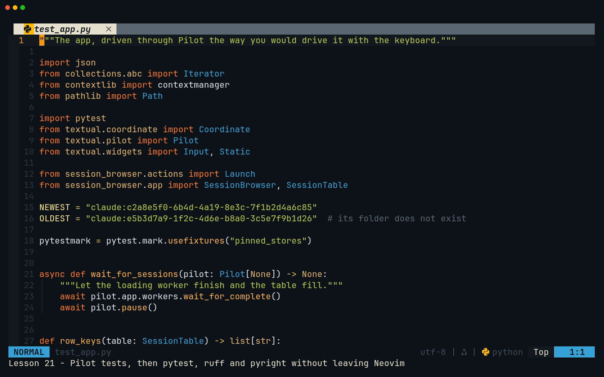
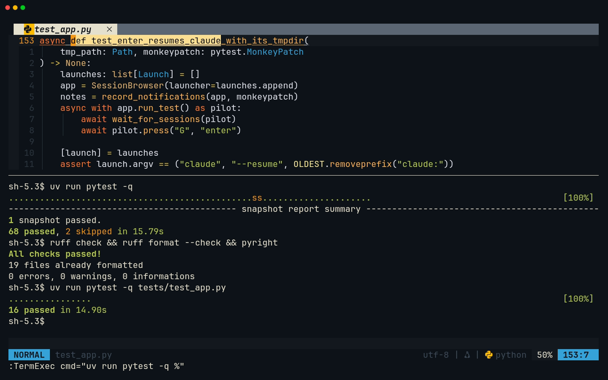
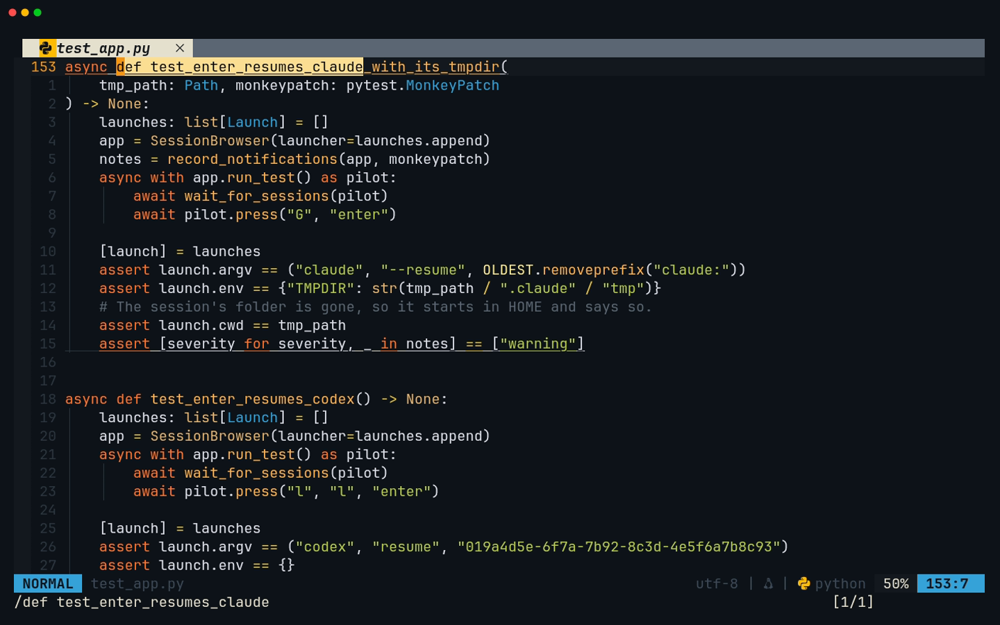
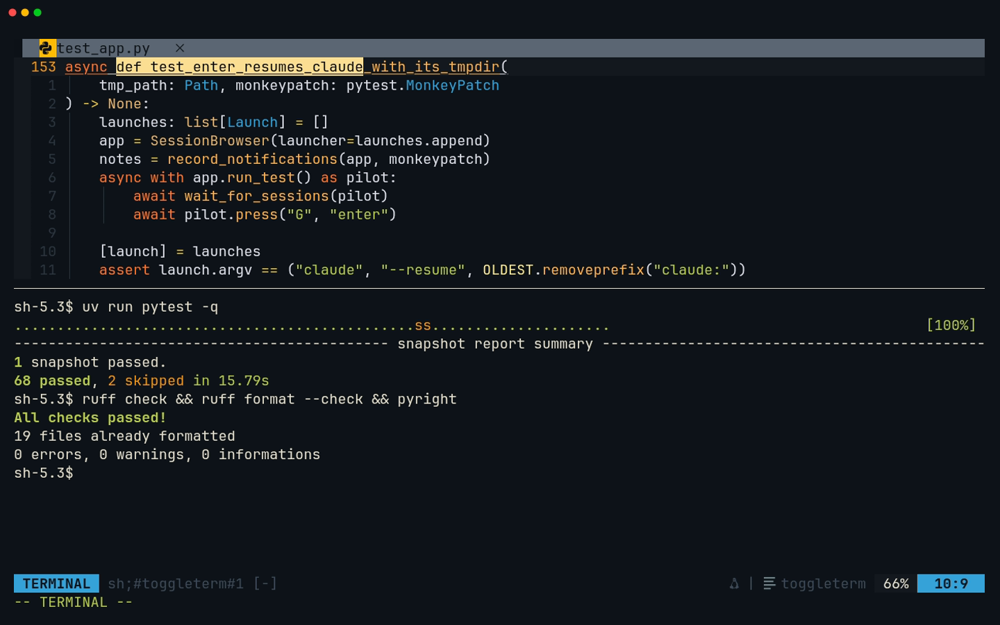
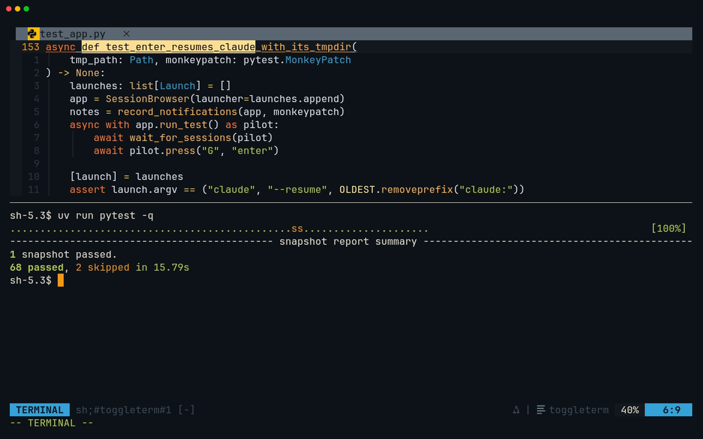

# Lesson 21 — session-browser: testing and shipping

**Last Updated**: 27/09/2026
**Version**: 1.0.0
**Maintained By**: Development Team
**Language**: British English (en_GB)
**Timezone**: Europe/London

---

The browser works; this lesson makes it provably keep working, then puts it on your `PATH`. You drive the
whole app from pytest with Textual's Pilot, pressing the keys you press and checking the notifications it
shows and the commands it would run. You pin the clock and the file times so that a picture of the screen can
be a test. You get ruff and pyright clean with the same binaries Neovim uses, write the README, and install the
app with `uv tool install`. A Nix package sketch and a Hyprland key are optional extras. The Neovim skill
underneath all of it: running and re-running tests, and reading their failures, without leaving the file you
are editing.

**Part**: 7 — Build session-browser · **Time**: ~120 min · **Previous**: [Lesson 20 — session-browser: actions](20-SESSION-BROWSER-ACTIONS.md) · **Next**: [Lesson 22 — Making the config yours](22-MAKING-THE-CONFIG-YOURS.md)

## Objectives

- Run one test file or the whole suite from the buffer you are editing, repeat it with one key, and read a
  failure inside Neovim.
- Drive the app with Pilot: `run_test()`, `pilot.press()`, waiting for the loading worker, recording
  notifications and suspends with `monkeypatch`, and a fake launcher.
- Make screen-level tests deterministic: time zone, file times, and paths shown relative to `HOME`.
- Add a snapshot test, create and review its SVG baseline, and update it on purpose.
- Explain why `pytest-textual-snapshot` is pinned to `>=1.1`, and what that does to pytest and syrupy.
- Get ruff and pyright clean with the system tools on NixOS, and explain why they are not project
  dependencies.
- Write the README, install with `uv tool install --editable .`, and read the Nix package sketch with its
  caveats. Optionally, give the browser a Hyprland key.

## Before you start

- You have finished [Lesson 20](20-SESSION-BROWSER-ACTIONS.md): milestone **SB7** is committed and tagged.
  Check it:

  ```bash
  # in ~/Repos/personal/nix-config
  git tag --list 'course/*'
  git status --short
  ```

  `course/sb7` is listed and nothing is pending under `python/`.
- The checks pass:

  ```bash
  # in ~/Repos/personal/nix-config/python/session-browser
  uv run pytest -q
  uvx ruff check
  uvx ruff format --check
  uvx pyright
  ```

  Expect `53 passed` on 3.14, as on laptop-intel (`51 passed, 2 skipped` on 3.12).
- Keep any notes from Codex's review in [Lesson 13](13-CLAUDE-CODE-AND-CODEX.md) at hand: milestone step 4 is
  where they get dealt with.
- Open Neovim in the project, on the lesson 20 tests:

  ```bash
  # in a Kitty terminal
  cd ~/Repos/personal/nix-config/python/session-browser && nvim tests/test_actions.py
  ```

## Keys in this lesson

| Keys | Mode | Action | Where it comes from |
|---|---|---|---|
| `:TermExec cmd="…"` | c | Run a command in the bottom terminal and keep the cursor where it is; `%` in it is the current file | toggleterm default |
| `@:` | n | Repeat the last command line you typed | Neovim default |
| `<leader>t` | n | Toggle the bottom terminal | config (neovim.nix:27) |
| `<C-\><C-n>` | t | Leave Terminal mode | Neovim default |
| `i` | n (terminal buffer) | Back into Terminal mode | Neovim default |
| `<C-j>` / `<C-k>` | n | Window down / up | config (neovim.nix:69, :70) |
| `/pattern`, `?pattern`, `n`, `N` | n | Search forward, backward; next, previous (also through a terminal's output) | Neovim default |
| `f{char}`, `r{char}` | n | Jump to a character on the line; replace the character under the cursor | Neovim default |
| `u` | n | Undo | Neovim default |
| `<C-s>` | n | Save; conform formats first (ruff for Python, prettier for Markdown) | config (neovim.nix:64) |
| `<leader>xx` | n | All diagnostics in Trouble (type it briskly) | config (neovim.nix:55) |
| `<leader>ca` | n | Code action, such as a ruff fix | config (LSP buffer-local) |
| `:lua =expr` | c | Evaluate a Lua expression and print the result | Neovim default |
| `:e {file}` | c | Open a file, or start a new one | Neovim default |
| `:DiffviewOpen {rev}` | c | Review everything since a commit or tag; `<leader>gq` closes it | diffview default |
| `<leader>gg` | n | Neogit, to commit | config (neovim.nix:35) |

## Walkthrough



[MP4](../media/21-session-browser-testing-and-shipping/21-session-browser-testing-and-shipping.mp4)

### 1. Run the tests from the file you are in

`<leader>t` then typing a command works, but it moves you into the terminal. toggleterm's `:TermExec` sends a
command to the bottom terminal (opening it if needed) and puts the cursor back where it was. Its `cmd` is
run through Neovim's `expandcmd()` (as in lesson 18), so `%` becomes the current file's name. The command
must be in double quotes.

**Try it** in `tests/test_actions.py`:

1. `:TermExec cmd="uv run pytest -q %"` and `<CR>`.
2. When it finishes, `@:`.

**You should see** the terminal open at the bottom with `12 passed`, the cursor still in the test file, and
`@:` run the same thing again. `@:` repeats the last command line you *typed*: saving with `<C-s>` in between
does not count, because that mapping runs `:w` without going through the command line.



### 2. Read a failure without leaving Neovim

**Try it:** break a test on purpose, run it, read it, repair it.

1. In `tests/test_actions.py`, `/abc-123")` and `<CR>` puts the cursor on the first expected argument list.
   `f3` moves to the `3`, `r4` turns it into `abc-124`. `<C-s>`.
2. `@:`. The run ends with `1 failed, 11 passed`.
3. `<C-j>` into the terminal. If what you type goes to the shell, you are in Terminal mode: `<C-\><C-n>`.
4. `?\.py:\d` and `<CR>` searches backwards for a file name followed by a line number, and lands on
   `tests/test_actions.py:23: AssertionError`: where the failure is. The lines starting `E` just above it say
   what failed; the useful one is `At index 2 diff: 'abc-123' != 'abc-124'`, what the code gave against what
   the test now expects. With several failures, `n` goes on to the next one up.
5. `<C-k>` back to the file, `u`, `<C-s>`, `@:`: `12 passed` again.

**You should see** pytest's failure report scrolled into the terminal window, readable and searchable like any
buffer while you are in Normal mode. `i` would take you back into the shell.

### 3. Pilot's names for keys

A Pilot test presses keys by name: `pilot.press("slash", "G", "enter", "escape", "pagedown")`. Textual can
show you the name of any key you press.

**Try it** in the terminal (`<leader>t`, or a Kitty window):

```bash
# in ~/Repos/personal/nix-config/python/session-browser
uv run textual keys
```

Press `/`, `G`, Enter, Esc and Page Down, then Ctrl+C twice to quit.

**You should see** one line per key, such as `Key(key='slash', character='/', …)`, `Key(key='G', …)`,
`Key(key='enter', …)`, `Key(key='escape', …)` and `Key(key='pagedown', …)`. The `key=` value is what
`pilot.press()` takes. A printable character can also be pressed as itself, which is why the tests write
`*"PANEL"` to type a word.

### 4. Why the tests pin the clock and the file times

A snapshot test compares the whole screen, character by character, and three things on this screen depend
on the machine rather than the code:

- **The time zone.** `format_time()` shows local time.
- **Kitty file times.** A Kitty session's `Updated` is its file's modification time, and a git checkout or a
  `cp` stamps files with the moment they were written. That also changes the sort order.
- **Paths.** The preview's `File` line shows where the fixtures are.

**Try it:**

```bash
# in ~/Repos/personal/nix-config/python/session-browser
TZ=UTC uv run python -c 'from datetime import datetime, UTC; print(datetime(2026, 9, 26, 20, 5, tzinfo=UTC).astimezone())'
TZ=Europe/London uv run python -c 'from datetime import datetime, UTC; print(datetime(2026, 9, 26, 20, 5, tzinfo=UTC).astimezone())'
stat -c '%y  %n' tests/fixtures/kitty/*
```

**You should see** `2026-09-26 20:05:00+00:00` and then `2026-09-26 21:05:00+01:00`: the same moment, two
different screens. `stat` shows `2026-09-20 13:00:00.000000000 +0100`, the date lesson 18 gave the files by
hand. On a fresh clone it would show the moment of the checkout, down to the nanosecond. The milestone's
`pinned_stores` fixture fixes all three inside the tests, whatever the files say: `TZ=UTC`, the Kitty copies
set to noon (UTC) on 20 September 2026, and the stores copied inside the test's `HOME`, so the preview shows
`~/stores/…` wherever the repository lives.

### 5. Snapshots: a picture as a test, and a version pin

`pytest-textual-snapshot` gives tests a `snap_compare` fixture. It runs the app headless at a terminal size
you choose, presses the keys you list, renders the screen as an SVG and compares it with a baseline stored
next to the tests, in `tests/__snapshots__/<test module>/<test name>.svg`. With no baseline, or a different
screen, the test fails and the plugin writes `snapshot_report.html` showing both pictures.
`uv run pytest --snapshot-update` writes the baseline from the current screen: you then review it and commit
it.

The plugin comes with a trap, and lesson 06's `uv add --dev … 'pytest-textual-snapshot>=1.1'` already avoided
it. Version 1.1.0, the latest, pins `syrupy==4.8.0`, and syrupy 4.8.0 needs pytest older than 9. Left
unpinned, uv prefers pytest 9 and falls back to the plugin's 1.0.0 with syrupy 6. That combination runs, but
syrupy 5 and later ignore the plugin's file-extension setting, so the baselines are saved as `.raw` instead of
`.svg`. The pin keeps the combination the plugin's authors released: pytest 8.4.2, syrupy 4.8.0, and a real
`.svg` that doubles as a picture of the app.

**Try it:**

```bash
# in ~/Repos/personal/nix-config/python/session-browser
uv pip list | grep -E '^(pytest|pytest-asyncio|pytest-textual-snapshot|syrupy) '
```

**You should see** `pytest 8.4.2`, `pytest-asyncio 1.4.0`, `pytest-textual-snapshot 1.1.0` and
`syrupy 4.8.0`.

### 6. The same ruff and pyright as your editor

On NixOS, `ruff` and `pyright` are system packages (`modules/software/development.nix:106`, `:184`), and they
are the builds Neovim runs: the pyright language server and `ruff server` are pinned to `${pkgs.pyright}` and
`${pkgs.ruff}` (neovim.nix:398, :409), and conform's `ruff_format` finds `ruff` on `PATH` (neovim.nix:959-964).
So this lesson checks with the system tools, and keeps them **out** of the project's dependencies:

- **One version everywhere.** The command line and the editor run the same binary, so "clean in Neovim,
  errors on the command line" cannot come from a version gap.
- **No second copy in `.venv`.** conform deliberately prefers a `ruff` found in a venv (neovim.nix:959-964).
  With ruff as a dev dependency, a Neovim started with the venv on its `PATH` would format with that copy
  while the language server lints with the store's.
- **pyright does not need to be inside the venv.** `[tool.pyright] venvPath = "."`, `venv = ".venv"` (lesson
  10) tells the system pyright where Textual and pytest are.
- **`uvx` still works.** `uvx ruff check` and `uvx pyright`, the commands in your `AGENTS.md` from lesson 13,
  fetch a version from PyPI into uv's cache. That is right on a machine without the system tools, but it is
  not necessarily the version your editor runs.

**Try it** in `tests/test_actions.py` (a Python buffer, so ruff's language server is attached):

1. `:lua =vim.lsp.get_clients({ name = 'ruff' })[1].config.cmd` and `<CR>`.
2. In the terminal:

   ```bash
   # in ~/Repos/personal/nix-config/python/session-browser
   readlink -f "$(command -v ruff)"
   ruff --version
   pyright --version
   ```

**You should see** the same `/nix/store/…-ruff-<version>/bin/ruff` path in both places (verify on
laptop-intel), then the two versions. They need not match the ones `uvx` fetches.

### 7. Trouble shows open files; the command line checks them all

pyright's `diagnosticsMode = "workspace"` in the config is a typo for `diagnosticMode` (neovim.nix:402), so
pyright runs in its default `openFilesOnly` mode: Trouble (`<leader>xx`) lists problems only in files you have
open. [Lesson 25](25-FIX-PYRIGHT-DIAGNOSTIC-MODE.md) fixes the key. Until then, the command-line `pyright` is
your whole-project check.

**Try it:** `<leader>xx` (Space x x, briskly), then `<leader>xx` again to close it. In the terminal,
`pyright`.

**You should see** Trouble report nothing, or only problems in open buffers, and `pyright` report
`0 errors, 0 warnings, 0 informations` for the whole project.

## Gotchas in this config

- **The Kitty file times on your disk do not matter to the tests.** A fresh clone or copy dates the Kitty
  fixtures "now", down to the nanosecond. `pinned_stores` re-dates its own copy inside each Pilot and snapshot
  test, and `test_updated_is_the_file_modification_time` compares two `datetime`s, so the suite passes
  whatever `stat` says. Only the order you see when you run the app by hand depends on lesson 18's
  `touch -d` (git does not track file times, so there is nothing to commit).
- **Do not "upgrade" pytest to 9.** It is held at 8.4.2 by the `pytest-textual-snapshot>=1.1` pin (walkthrough
  step 5). Without the pin, baselines become `.raw` files.
- **`asyncio_mode = "auto"` must stay** in `[tool.pytest.ini_options]` (lesson 07). Without it
  pytest-asyncio leaves unmarked tests alone, and pytest 8.4 fails every `async def test_…` in
  `test_app.py` with "async def functions are not natively supported." The other fix would be
  `@pytest.mark.asyncio` on each test.
- **A failing snapshot writes `snapshot_report.html`** in the project folder. The milestone adds it to
  `.gitignore`.
- **A fake program must be the whole `PATH`.** When a file on `PATH` cannot be executed, CPython's
  subprocess tries the next `PATH` entry. With the fake merely first, the real `claude` further down ran during
  a test. `install_program()` in the milestone sets `PATH` to the fake's folder alone.
- **The fake `suspend()` must behave like Textual's.** It records `"resume"` only if its block ends normally.
  With a `try`/`finally` it would record `"resume"` even for the broken version of lesson 20, and the test
  would prove nothing.
- **Headless notifications are not on screen.** `run_test()` does not display notifications by default, so
  the tests record them by swapping `app.notify` with `monkeypatch`.
- **`<leader>xx` shares the `<leader>x` prefix** with "close buffer" (neovim.nix:55, :63). Type Space x x
  briskly.
- **Trouble shows open files only** because of the `diagnosticsMode` typo (neovim.nix:402). Run `pyright` on
  the command line before you commit.
- **Saving `README.md` runs prettier** (neovim.nix:951), which may pad the table columns. That is expected;
  the text is the same.
- **`ruff format --check` counts differ by version:** ruff 0.16 also checks Markdown files, so `uvx ruff`
  reports more files than an older system ruff. "already formatted" and exit status 0 are what matter.
- **Never run `uv tool update-shell`**, even if uv suggests it. It edits your shell start-up files, which Home
  Manager owns. `~/.local/bin` is already on `PATH` (home/modules/shell.nix:26-28).
- **The tool's Python lives in the Nix store.** If a NixOS update and a garbage collection remove the Python
  the tool was installed with, `session-browser` stops starting; reinstall it with
  `uv tool install --editable --reinstall .` (verify on laptop-intel).
- **A window started from a Hyprland key lands on workspace 10** on laptop-intel (the catch-all rule in
  `config/hypr/devices/laptop-intel.lua`). Verify on laptop-intel.

## Drills

1. You are editing `tests/test_app.py`. Run just that file, then run it again after your next change without
   retyping anything.
   <details><summary>Answer</summary>

   `:TermExec cmd="uv run pytest -q %"`, then `@:` after each change (`<C-s>` in between does not replace the
   last command line).
   </details>

2. You widened the Title column on purpose and the snapshot test now fails. What do you do?
   <details><summary>Answer</summary>

   Open `snapshot_report.html` and check that the new picture is what you meant. Then
   `uv run pytest --snapshot-update`, look at the new SVG, run `uv run pytest -q` again, and commit the new
   baseline together with the change.
   </details>

3. Why does `record_suspends()` record `"resume"` only when its block ends normally?
   <details><summary>Answer</summary>

   Because Textual 8.2.8's `suspend()` behaves that way. The test then shows that the app catches the start-up
   error *inside* the block: `["suspend", "resume"]` is only possible if nothing escaped it.
   </details>

4. `install_program()` sets `PATH` to one folder. Why not put that folder first and keep the rest?
   <details><summary>Answer</summary>

   CPython's subprocess tries the next `PATH` entry when a file cannot be executed, so the "not a program"
   fake would fall through to the real `claude`.
   </details>

5. A friend scaffolds their own copy with lesson 06's commands but leaves the version off:
   `uv add --dev pytest pytest-asyncio pytest-textual-snapshot textual-dev`. What changes, and what do they
   see?
   <details><summary>Answer</summary>

   uv picks pytest 9, plugin 1.0.0 and syrupy 6. The tests still run, but baselines are written as `.raw`
   files, and a committed `.svg` baseline is not used.
   </details>

6. The snapshot passes on your laptop at noon and fails for a friend in New York. Which fixture should the test
   use, and what does it pin?
   <details><summary>Answer</summary>

   `pinned_stores`: `TZ=UTC` (with `time.tzset()`), the Kitty files' times, and a copy of the stores inside
   `HOME` so paths show as `~/…`.
   </details>

7. Why are ruff and pyright not in the project's dev dependencies?
   <details><summary>Answer</summary>

   The system builds are the ones Neovim runs (neovim.nix:398, :409, and conform's `ruff` from `PATH`), so one
   version serves the editor and the command line. A venv copy of ruff could disagree with the editor, and
   `[tool.pyright]` already points the system pyright at the venv.
   </details>

8. You press your new Hyprland key and nothing seems to happen. Where is the browser?
   <details><summary>Answer</summary>

   On workspace 10, where laptop-intel's catch-all rule sends every ordinary new window. `SUPER + 0`.
   </details>

## Milestone SB8: tests, README, install

**Goal:** 16 Pilot tests and a snapshot test on top of lesson 20's suite, a README, ruff and pyright clean, and
`session-browser` on your `PATH`. The files:

| File | Change |
|---|---|
| `tests/conftest.py` | Adds the `pinned_stores` fixture |
| `tests/test_app.py` | New: 16 Pilot tests |
| `tests/test_snapshots.py` | New: one snapshot test |
| `tests/__snapshots__/test_snapshots/test_oldest_session_selected.svg` | New: the baseline, generated, not typed |
| `.gitignore` | Adds `snapshot_report.html` |
| `README.md` | Written (uv created it empty in lesson 06) |

### Step 1: `pinned_stores` in `tests/conftest.py`

`:e tests/conftest.py`. The file becomes:

```python
"""Shared pytest fixtures."""

import os
import shutil
import time
from collections.abc import Iterator
from datetime import UTC, datetime
from pathlib import Path

import pytest

FIXTURES = Path(__file__).parent / "fixtures"

KITTY_MTIME = datetime(2026, 9, 20, 12, tzinfo=UTC).timestamp()


@pytest.fixture(autouse=True)
def synthetic_stores(tmp_path: Path, monkeypatch: pytest.MonkeyPatch) -> None:
    """Point every test at the synthetic fixtures, never at your real sessions.

    HOME moves as well, so anything that falls back to ~/.claude finds an empty
    temporary directory instead of your history.
    """
    monkeypatch.setenv("HOME", str(tmp_path))
    monkeypatch.setenv("CLAUDE_CONFIG_DIR", str(FIXTURES / "claude"))
    monkeypatch.setenv("CODEX_HOME", str(FIXTURES / "codex"))
    monkeypatch.setenv("SESSION_BROWSER_KITTY_DIR", str(FIXTURES / "kitty"))


@pytest.fixture
def pinned_stores(tmp_path: Path, monkeypatch: pytest.MonkeyPatch) -> Iterator[Path]:
    """A copy of the fixtures that looks the same on every machine.

    A git checkout stamps the Kitty files with the time you cloned, and the app
    shows times in your timezone, so both are pinned: the Kitty files to noon on
    20 September 2026 and the clock to UTC. The copy lives inside HOME, so the
    preview shows its paths as ~/... wherever the repository is.
    """
    root = tmp_path / "stores"
    shutil.copytree(FIXTURES, root)
    for path in (root / "kitty").iterdir():
        os.utime(path, (KITTY_MTIME, KITTY_MTIME))
    monkeypatch.setenv("CLAUDE_CONFIG_DIR", str(root / "claude"))
    monkeypatch.setenv("CODEX_HOME", str(root / "codex"))
    monkeypatch.setenv("SESSION_BROWSER_KITTY_DIR", str(root / "kitty"))
    monkeypatch.setenv("TZ", "UTC")
    time.tzset()  # TZ is only read when asked to
    yield root
    monkeypatch.undo()
    time.tzset()
```

- `synthetic_stores` is unchanged: every test still runs with `HOME` in `tmp_path` and the stores pointed at
  the fixtures.
- `pinned_stores` is opt-in. It copies the fixtures into `HOME`, gives the Kitty files a fixed time, points the
  three stores at the copy, and sets `TZ=UTC`. `time.tzset()` is needed because the C library reads `TZ` only
  when asked to.
- After `yield`, `monkeypatch.undo()` restores `TZ`, and the second `time.tzset()` makes the restored zone take
  effect before the next test.

### Step 2: `tests/test_app.py`

`:e tests/test_app.py`, a new file. It is long, so type it in parts and run it after each part with
`:TermExec cmd="uv run pytest -q %"` and then `@:`. The helpers come first:

```python
"""The app, driven through Pilot the way you would drive it with the keyboard."""

import json
from collections.abc import Iterator
from contextlib import contextmanager
from pathlib import Path

import pytest
from textual.coordinate import Coordinate
from textual.pilot import Pilot
from textual.widgets import Input, Static

from session_browser.actions import Launch
from session_browser.app import SessionBrowser, SessionTable

NEWEST = "claude:c2a8e5f0-6b4d-4a19-8e3c-7f1b2d4a6c85"
OLDEST = "claude:e5b3d7a9-1f2c-4d6e-b8a0-3c5e7f9b1d26"  # its folder does not exist

pytestmark = pytest.mark.usefixtures("pinned_stores")


async def wait_for_sessions(pilot: Pilot[None]) -> None:
    """Let the loading worker finish and the table fill."""
    await pilot.app.workers.wait_for_complete()
    await pilot.pause()


def row_keys(table: SessionTable) -> list[str]:
    return [
        table.coordinate_to_cell_key(Coordinate(row, 0)).row_key.value or ""
        for row in range(table.row_count)
    ]


def record_notifications(
    app: SessionBrowser, monkeypatch: pytest.MonkeyPatch
) -> list[tuple[str, str]]:
    """Swap app.notify for a recorder of (severity, message) pairs."""
    notes: list[tuple[str, str]] = []

    def notify(message: str, *, severity: str = "information", **_: object) -> None:
        notes.append((severity, message))

    monkeypatch.setattr(app, "notify", notify)
    return notes


def record_suspends(app: SessionBrowser, monkeypatch: pytest.MonkeyPatch) -> list[str]:
    """Swap app.suspend, which needs a real terminal, for a recorder that,
    like Textual 8.2.8's, only gets to "resume" if its block ends normally."""
    steps: list[str] = []

    @contextmanager
    def suspend() -> Iterator[None]:
        steps.append("suspend")
        yield
        steps.append("resume")

    monkeypatch.setattr(app, "suspend", suspend)
    return steps


def install_program(
    tmp_path: Path, monkeypatch: pytest.MonkeyPatch, name: str, content: bytes
) -> None:
    """Make an executable file called `name` the only program on PATH.

    Only: if the fake cannot run, subprocess goes on down PATH, and the tests
    must never start the real claude.
    """
    program = tmp_path / "bin" / name
    program.parent.mkdir(exist_ok=True)
    program.write_bytes(content)
    program.chmod(0o755)
    monkeypatch.setenv("PATH", str(program.parent))


async def test_lists_every_session_newest_first() -> None:
    app = SessionBrowser()
    async with app.run_test() as pilot:
        await wait_for_sessions(pilot)
        keys = row_keys(app.query_one(SessionTable))

        assert len(keys) == 9
        assert (keys[0], keys[-1]) == (NEWEST, OLDEST)
        assert app.sub_title == "9 of 9 sessions"


async def test_h_and_l_switch_the_source_tab() -> None:
    app = SessionBrowser()
    async with app.run_test() as pilot:
        await wait_for_sessions(pilot)
        table = app.query_one(SessionTable)
        counts = []
        for key in "llllh":
            await pilot.press(key)
            counts.append(table.row_count)

        # Claude, Codex, Kitty, round to All, back to Kitty.
        assert counts == [4, 3, 2, 9, 2]


async def test_search_matches_title_or_folder_ignoring_case() -> None:
    app = SessionBrowser()
    async with app.run_test() as pilot:
        await wait_for_sessions(pilot)
        await pilot.press("slash", *"PANEL")

        # A title, a title and folder, and a folder alone mention just-panel.
        assert app.query_one(Input).value == "PANEL"
        assert app.query_one(SessionTable).row_count == 3


async def test_escape_leaves_the_search_box() -> None:
    app = SessionBrowser()
    async with app.run_test() as pilot:
        await wait_for_sessions(pilot)
        await pilot.press("slash", "q")

        # In the search box q is just a letter: the app is still running.
        assert isinstance(app.focused, Input)
        assert app.is_running

        await pilot.press("escape")

        assert isinstance(app.focused, SessionTable)


async def test_enter_in_the_search_box_goes_to_the_list() -> None:
    launches: list[Launch] = []
    app = SessionBrowser(launcher=launches.append)
    async with app.run_test() as pilot:
        await wait_for_sessions(pilot)
        await pilot.press("slash", *"codex", "enter")

        assert isinstance(app.focused, SessionTable)
        assert launches == []


async def test_vim_keys_move_the_cursor() -> None:
    app = SessionBrowser()
    async with app.run_test() as pilot:
        await wait_for_sessions(pilot)
        table = app.query_one(SessionTable)
        rows = []
        for key in "jjkGg":
            await pilot.press(key)
            rows.append(table.cursor_row)

        assert rows == [1, 2, 1, 8, 0]


async def test_enter_resumes_claude_with_its_tmpdir(
    tmp_path: Path, monkeypatch: pytest.MonkeyPatch
) -> None:
    launches: list[Launch] = []
    app = SessionBrowser(launcher=launches.append)
    notes = record_notifications(app, monkeypatch)
    async with app.run_test() as pilot:
        await wait_for_sessions(pilot)
        await pilot.press("G", "enter")

    [launch] = launches
    assert launch.argv == ("claude", "--resume", OLDEST.removeprefix("claude:"))
    assert launch.env == {"TMPDIR": str(tmp_path / ".claude" / "tmp")}
    # The session's folder is gone, so it starts in HOME and says so.
    assert launch.cwd == tmp_path
    assert [severity for severity, _ in notes] == ["warning"]


async def test_enter_resumes_codex() -> None:
    launches: list[Launch] = []
    app = SessionBrowser(launcher=launches.append)
    async with app.run_test() as pilot:
        await wait_for_sessions(pilot)
        await pilot.press("l", "l", "enter")

    [launch] = launches
    assert launch.argv == ("codex", "resume", "019a4d5e-6f7a-7b92-8c3d-4e5f6a7b8c93")
    assert launch.env == {}
    assert not launch.detach


async def test_enter_opens_kitty_sessions_detached(pinned_stores: Path) -> None:
    launches: list[Launch] = []
    app = SessionBrowser(launcher=launches.append)
    async with app.run_test() as pilot:
        await wait_for_sessions(pilot)
        await pilot.press("h", "enter")

    [launch] = launches
    session_file = pinned_stores / "kitty" / "just-panel.kitty-session"
    assert launch.argv == ("kitty", "--session", str(session_file))
    assert launch.detach


async def test_missing_program_is_reported(monkeypatch: pytest.MonkeyPatch) -> None:
    def not_installed(launch: Launch) -> None:
        raise FileNotFoundError(launch.argv[0])

    app = SessionBrowser(launcher=not_installed)
    notes = record_notifications(app, monkeypatch)
    async with app.run_test() as pilot:
        await wait_for_sessions(pilot)
        await pilot.press("enter")

        assert app.is_running
        assert notes[-1] == (
            "error",
            "Could not find 'claude'. Is it installed and on PATH?",
        )


async def test_a_program_that_cannot_start_gives_the_terminal_back(
    tmp_path: Path, monkeypatch: pytest.MonkeyPatch
) -> None:
    # On PATH and executable, but not something the kernel can run.
    install_program(tmp_path, monkeypatch, "claude", b"\x00 not a program")
    app = SessionBrowser()
    steps = record_suspends(app, monkeypatch)
    notes = record_notifications(app, monkeypatch)
    async with app.run_test() as pilot:
        await wait_for_sessions(pilot)
        await pilot.press("enter")

        assert steps == ["suspend", "resume"]
        assert notes[-1] == ("error", "Could not start 'claude': Exec format error.")
        assert app.is_running


async def test_a_program_that_fails_is_reported(
    tmp_path: Path, monkeypatch: pytest.MonkeyPatch
) -> None:
    install_program(tmp_path, monkeypatch, "claude", b"#!/bin/sh\nexit 3\n")
    app = SessionBrowser()
    steps = record_suspends(app, monkeypatch)
    notes = record_notifications(app, monkeypatch)
    async with app.run_test() as pilot:
        await wait_for_sessions(pilot)
        await pilot.press("enter")

        assert steps == ["suspend", "resume"]
        assert notes[-1] == (
            "warning",
            "claude exited with status 3. Quit the browser to read what it printed.",
        )


async def test_moving_in_an_empty_list_is_harmless() -> None:
    launches: list[Launch] = []
    app = SessionBrowser(launcher=launches.append)
    async with app.run_test() as pilot:
        await wait_for_sessions(pilot)
        await pilot.press("slash", *"nosuchsession", "escape")
        await pilot.press("k", "up", "G", "pagedown", "enter", "c")

        assert app.query_one(SessionTable).row_count == 0
        assert launches == []
        assert app.is_running


async def test_c_copies_the_resume_command(tmp_path: Path) -> None:
    app = SessionBrowser()
    async with app.run_test() as pilot:
        await wait_for_sessions(pilot)
        await pilot.press("G", "c")

        # The session's folder is gone, hence the cd to HOME.
        assert app.clipboard == (
            f"cd {tmp_path} && TMPDIR={tmp_path}/.claude/tmp "
            f"claude --resume {OLDEST.removeprefix('claude:')}"
        )


async def test_preview_shows_brackets_as_text() -> None:
    app = SessionBrowser()
    async with app.run_test() as pilot:
        await wait_for_sessions(pilot)
        await pilot.press("G")
        preview = str(app.query_one("#preview", Static).render())

        assert preview.startswith("Why [/bold] crashes Static")
        assert "text such as [session titles] must be escaped" in preview


async def test_escape_sequences_are_shown_not_sent(
    tmp_path: Path, monkeypatch: pytest.MonkeyPatch
) -> None:
    # OSC 52: a terminal that allows it would put "hi" on your clipboard.
    osc52 = "\x1b]52;c;aGk=\x1b\\"
    entry = {"type": "ai-title", "aiTitle": f"Paste {osc52}"}
    store = tmp_path / "escape"
    transcript = store / "projects" / "-tmp-x" / "0e5c.jsonl"
    transcript.parent.mkdir(parents=True)
    transcript.write_text(json.dumps(entry) + "\n")
    monkeypatch.setenv("CLAUDE_CONFIG_DIR", str(store))  # its only Claude session
    app = SessionBrowser()
    async with app.run_test() as pilot:
        await wait_for_sessions(pilot)
        await pilot.press("l")  # the Claude tab
        title = str(app.query_one(SessionTable).get_row_at(0)[1])
        preview = str(app.query_one("#preview", Static).render())

        replaced = "\N{REPLACEMENT CHARACTER}"
        assert title == f"Paste {replaced}]52;c;aGk={replaced}\\"
        assert preview.startswith(title)
```



How the file works:

- **`pytestmark = pytest.mark.usefixtures("pinned_stores")`** applies the fixture to every test in the file.
  Tests that also need its path (the Kitty one) ask for it by name as well.
- **`async with app.run_test() as pilot:`** starts the app headless (80 × 24 by default) and hands you a
  `Pilot`. The tests are `async def` and need no marker, thanks to `asyncio_mode = "auto"`.
- **`wait_for_sessions()`** waits for the loading worker (`workers.wait_for_complete()`), then lets the app
  handle the rows it posted (`pilot.pause()`). Without it the table can still be empty.
- **The fake launcher** is `launches.append`: `SessionBrowser(launcher=launches.append)` records each `Launch`
  instead of running it. `[launch] = launches` fails unless there was exactly one.
- **`record_notifications()` and `record_suspends()`** swap `app.notify` and `app.suspend` with recorders,
  through `monkeypatch`, so they are put back after each test.
- **`install_program()`** writes a fake program and makes its folder the whole `PATH`. The two tests that use
  it go through the real `run_in_terminal()`: bytes the kernel cannot run give "Exec format error", and
  `exit 3` gives the exit-status warning.
- **`OLDEST`** is the textual-prototype session, whose folder the fixtures' README documents as missing. The
  tests that check the working folder use only that one, so a machine where `/tmp/nvim-course/nix-config`
  exists (the lesson 20 recording creates it) cannot break them.
- **The escape-sequence test** builds its own one-session Claude store, because files copied from a
  read-only checkout keep their read-only modes.

Check it: `:TermExec cmd="uv run pytest -q %"` gives `16 passed`.

### Step 3: the snapshot test

`:e tests/test_snapshots.py`:

```python
"""What the screen looks like, compared with an SVG committed next to the tests.

After a deliberate change to the layout, review the new picture and accept it
with `uv run pytest --snapshot-update`.
"""

import pytest
from textual.pilot import Pilot

from session_browser.app import SessionBrowser

pytestmark = pytest.mark.usefixtures("pinned_stores")


async def wait_for_sessions(pilot: Pilot[None]) -> None:
    await pilot.app.workers.wait_for_complete()
    await pilot.pause()


def test_oldest_session_selected(snap_compare) -> None:
    # The last row is the one with [/bold] in its title and messages, so the
    # picture also shows that markup is displayed, never interpreted.
    assert snap_compare(
        SessionBrowser(),
        terminal_size=(116, 34),
        run_before=wait_for_sessions,
        press=["G"],
    )
```

`terminal_size=(116, 34)` is the size of the course's recordings, and `press=["G"]` moves to the last row, the
session whose title and messages are full of `[/bold]`, so the picture also proves that markup is shown, not
obeyed.

1. `<C-s>`, then `:TermExec cmd="uv run pytest -q %"`. With no baseline yet it fails: `1 snapshot failed.` and
   a link to `snapshot_report.html`. That report is how every future snapshot failure looks.
2. Look at the picture before you accept it:

   ```bash
   # in ~/Repos/personal/nix-config/python/session-browser
   xdg-open snapshot_report.html
   ```

   (Which program opens it depends on your default applications: verify on laptop-intel. Any browser can open
   the file directly.)
3. Accept it:

   ```bash
   # in ~/Repos/personal/nix-config/python/session-browser
   uv run pytest --snapshot-update
   ```

   The summary says `1 snapshot generated.` and the baseline appears at
   `tests/__snapshots__/test_snapshots/test_oldest_session_selected.svg`. Open it the same way: the session
   list with the last row highlighted, "9 of 9 sessions" in the header, the preview showing
   `Why [/bold] crashes Static…` and `~/stores/claude/projects/…` as the file, and the footer
   `⏎ Resume  j/k Move  c Copy command  / Search  h/l Source  q Quit`.
4. `@:` (or `uv run pytest -q`): `1 snapshot passed.` The file is deterministic: generated from another
   folder, in another time zone or with Python 3.14 instead of 3.12, it came out byte for byte the same.

Then `:e .gitignore` and add the last three lines, so the whole file reads:

```text
# Python-generated files
__pycache__/
*.py[oc]
build/
dist/
wheels/
*.egg-info

# Virtual environments
.venv

# Tool caches
.pytest_cache/
.ruff_cache/

# pytest-textual-snapshot writes this when a snapshot test fails
snapshot_report.html
```

### Step 4: the quality pass

Lesson 13 left the notes from Codex's review "for lesson 21's quality pass". Go through them now, one at a
time:

- **A real bug:** write a test that shows it first, Pilot or plain, then fix it in the smallest way, keeping
  function names and signatures. Commit each as its own `fix(session-browser): …`.
- **Not a bug, or out of scope:** drop it, or add a line to the README's "Not done yet" list (step 6).
- **Already known:** the [spec](../projects/SESSION-BROWSER-SPEC.md#known-limitations) lists the limitations
  that were found and deliberately left alone; they need no fix here.

Run the whole suite after each fix. Your test count grows by the tests you add.

### Step 5: ruff and pyright, with the system tools

```bash
# in ~/Repos/personal/nix-config/python/session-browser
ruff check
ruff format --check
pyright
```

Expect `All checks passed!`, a line ending `files already formatted`, and
`0 errors, 0 warnings, 0 informations`. This code has been checked clean with ruff 0.14.11 and 0.16.9 and
with pyright 1.1.408 and 1.1.414; the exact versions nixpkgs gives you: verify on laptop-intel. `uvx ruff
check`, `uvx ruff format --check` and `uvx pyright` must agree.



If ruff reports something, put the cursor on the line in Neovim and try `<leader>ca`: ruff's language server
offers a fix for many of its rules. Format problems go away with `<C-s>`.

### Step 6: the README

`:e README.md`. uv created it empty in lesson 06; the whole file is:

````markdown
# Session Browser

**Last Updated**: 27/09/2026
**Version**: 0.1.0
**Maintained By**: Development Team
**Language**: British English (en_GB)
**Timezone**: Europe/London

---

A terminal app that lists, searches, previews and resumes your Claude Code,
Codex and Kitty sessions in one place. Built with [Textual](https://textual.textualize.io/)
as the second capstone of the Neovim course.

## Run it

```bash
# from python/session-browser
uv run session-browser
uv run session-browser --kitty-sessions-dir ~/work/kitty-sessions
```

## Keys

| Key | Where | Action |
|---|---|---|
| `j` / `k`, arrows | list | Move down / up |
| `g` / `G` | list | First / last session |
| `Enter` | list | Resume the session (Kitty: open it in a new window) |
| `c` | anywhere but the search box | Copy the resume command to the clipboard |
| `h` / `l` | anywhere but the search box | Previous / next source tab (All, Claude, Codex, Kitty) |
| `/` | anywhere but the search box | Search titles and folders |
| `Esc` | anywhere | Back to the list |
| `Enter` | search box | Back to the list, keeping the search |
| `q`, `Ctrl+Q` | anywhere but the search box (`Ctrl+Q` anywhere) | Quit |

## Where the sessions come from

| Source | Location | Override |
|---|---|---|
| Claude Code | `~/.claude/projects/<folder>/<session id>.jsonl` | `CLAUDE_CONFIG_DIR` (Claude Code's own) |
| Codex | `~/.codex/sessions/YYYY/MM/DD/rollout-*.jsonl` and `~/.codex/session_index.jsonl` | `CODEX_HOME` (Codex's own) |
| Kitty | `*.kitty-session` files in `~/.local/share/kitty/sessions` | `--kitty-sessions-dir DIR` or `SESSION_BROWSER_KITTY_DIR` |

Sub-agent transcripts (Claude) and sub-agent threads (Codex) are left out: you
cannot usefully resume them on their own. Compressed Codex rollouts
(`.jsonl.zst`) are read on Python 3.14 and later, and skipped before that.

The app only reads these files. It never changes them.

## What Enter runs

| Source | Command | Where |
|---|---|---|
| Claude Code | `claude --resume <id>`, with `TMPDIR=~/.claude/tmp` | The session's folder, in this terminal |
| Codex | `codex resume <id>` | The session's folder, in this terminal |
| Kitty | `kitty --session <file>` | A new kitty window; the browser keeps running |

Claude and Codex borrow the terminal and hand it back when you quit them. If a
session's folder no longer exists, the command starts in your home directory
and the app tells you so. If the program cannot start, or exits with an error,
the app says that too; what the program printed stays on the terminal behind
the app, so quit the browser to read it. `TMPDIR` is set because the `claude`
alias in `home/modules/shell.nix` sets it, and aliases do not apply to programs
started from another program.

Titles, folders and messages are shown as plain text: `[brackets]` are not
read as Textual markup, and control characters (the start of a terminal escape
sequence, for example) are shown as `�` instead of being sent to your
terminal.

## Try it on the synthetic sessions

```bash
# from python/session-browser
CLAUDE_CONFIG_DIR=$PWD/tests/fixtures/claude \
CODEX_HOME=$PWD/tests/fixtures/codex \
uv run session-browser --kitty-sessions-dir tests/fixtures/kitty
```

See `tests/fixtures/README.md` for what each file is there to test.

## Develop

```bash
uv sync                                   # create .venv with the dev tools
uv run pytest                             # all tests, including the snapshot
uv run pytest --snapshot-update           # accept a deliberate change to the screen
ruff check && ruff format --check         # uvx ruff ... where ruff is not installed
pyright                                   # uses .venv via [tool.pyright]
uv run textual run --dev -c session-browser   # live CSS reload
uv run textual console                    # in a second terminal: logs and print()
```

The tests never read your real sessions: `tests/conftest.py` points
`CLAUDE_CONFIG_DIR`, `CODEX_HOME`, the Kitty folder and `HOME` at the fixtures
and a temporary directory.

## Install

```bash
# from python/session-browser
uv tool install --editable .
```

This puts `session-browser` in `~/.local/bin`. With `--editable`, changes to
the source take effect without reinstalling.

## Layout

```text
src/session_browser/
├── app.py            Textual app: table, preview, tabs, search, key bindings
├── app.tcss          Layout
├── models.py         Session, Source, Message
├── actions.py        Launch: the command for a session, and running it
└── sources/
    ├── __init__.py   JSON Lines helpers shared by the sources
    ├── claude.py     Claude Code transcripts
    ├── codex.py      Codex rollouts
    └── kitty.py      Kitty session files
```

## Not done yet

- Live Kitty windows through `kitten @ ls`. That needs `allow_remote_control`
  and `listen_on` in kitty's settings, which this configuration leaves off.
- Showing Codex sub-agent threads under the thread that started them.
````

`<C-s>`. prettier may re-pad the tables as it saves; that is fine. Run the README's "Try it" command once to
check it works as written, but only look: do not press Enter or `c` there. Enter would start the **real**
`claude` or `codex` with the fixture folder as its configuration folder, where it finds no such
conversation and may write files of its own next to the fixtures (the gotcha in
`tests/fixtures/README.md`). Lesson 20's stand-in programs are the safe way to try Enter.

### Step 7: install it

```bash
# in ~/Repos/personal/nix-config/python/session-browser
uv tool install --editable .
command -v session-browser
session-browser --help
uv tool list
```

**You should see** `Installed 1 executable: session-browser`, the path `/home/<you>/.local/bin/session-browser`,
the help text (`usage: session-browser [-h] [--kitty-sessions-dir DIR]` and "Browse, search and resume Claude
Code, Codex and Kitty sessions."), and `session-browser v0.1.0` with `- session-browser` under it.

- `uv tool install` makes a separate environment for the app, with its runtime dependency (Textual) and not
  the dev tools, and links the command into `~/.local/bin`, which is on your `PATH` (shell.nix:26-28).
- `--editable` means the environment uses your source folder: edits to the code take effect the next time you
  start `session-browser`, with no reinstall. After a change to the dependencies in `pyproject.toml`, reinstall
  with `uv tool install --editable --reinstall .`.
- The uv wrapper on NixOS sets `UV_CONSTRAINT`, which `uv tool install` reads. It pins only playwright and
  patchright, so it changes nothing here.
- To remove it: `uv tool uninstall session-browser`.

Now start `session-browser` from any folder, in a Kitty window: it reads your real `~/.claude`, `~/.codex` and
`~/.local/share/kitty/sessions`.

### Step 8 (optional): a Nix package

`uv tool install` is the supported way to install the browser in this course. If you would rather have Nix
build it, like the Rust tools, this is the starting point. It has been built with `nix-build` in the Nix
sandbox against the flake's own nixpkgs revision (`20b1ddd`), but not yet through the flake on laptop-intel
(verify on laptop-intel).

```nix
# e.g. pkgs/session-browser.nix, called with pkgs.callPackage
{ lib, python3Packages }:

python3Packages.buildPythonApplication {
  pname = "session-browser";
  version = "0.1.0";
  pyproject = true;
  src = ../python/session-browser;   # flake sources hold only git-tracked files, so no .venv

  # uv init pins the build backend to the uv that ran it; nixpkgs ships an
  # older uv-build, which builds this project fine. Skip the pin check.
  pypaBuildFlags = [ "--skip-dependency-check" ];

  build-system = [ python3Packages.uv-build ];
  dependencies = [ python3Packages.textual ];

  nativeCheckInputs = with python3Packages; [ pytestCheckHook pytest-asyncio ];
  # nixpkgs puts pytest-textual-snapshot on syrupy 5, which looks for .raw
  # baselines instead of the committed .svg.
  disabledTestPaths = [ "tests/test_snapshots.py" ];

  pythonImportsCheck = [ "session_browser" ];
  meta.mainProgram = "session-browser";
}
```

What the build found. At `20b1ddd`, the flake's root `nixpkgs` input, nixpkgs has Python 3.14.7, uv-build
0.11.28, Textual 8.2.8, pytest 9.1.1, pytest-asyncio 1.4.0 and pytest-textual-snapshot 1.1.0 on syrupy 5.5.3.
To read one of them from your own checkout, run for example
`nix eval .#nixosConfigurations.laptop-intel.pkgs.python3Packages.uv-build.version` from the repository root
(verify on laptop-intel).

- **The build backend version.** `uv init` wrote `uv_build>=0.12.x,<0.13.0` into `[build-system]`, where
  `0.12.x` is the version of the uv that ran it: 0.12.16 on laptop-intel. nixpkgs' uv-build is 0.11.28, and
  nixpkgs builds with `--no-isolation` and checks that requirement, so without a fix the build stops at
  `ERROR Unmet dependencies`. `pypaBuildFlags = [ "--skip-dependency-check" ]` skips that check, whichever
  uv wrote the pin; uv-build 0.11.28 builds the project fine.
- **The snapshot baselines.** nixpkgs built `pytest-textual-snapshot` 1.1.0 against syrupy 5, which looks for
  `.raw` baselines: with the snapshot test enabled, the build fails with "1 snapshot failed. 1 snapshot
  unused". The sketch skips `tests/test_snapshots.py` in the Nix build; everything else runs.
- **The sandbox.** The tests need no terminal and no network, and set `HOME` themselves; `sh`, `touch` and
  `sleep` come from the build environment. In the sandbox build, 69 tests passed on Python 3.14.7 with
  pytest 9.1.1 (the zstd tests run; only the snapshot test is left out), `pythonImportsCheck` passed,
  `bin/session-browser --help` ran, and `app.tcss` was installed next to `app.py`.
- **Flakes see tracked files only.** `git add python/session-browser` (and the new `.nix` file) before
  building.
- **Wiring it in** would follow `uv-manylinux`: a `pkgs.callPackage ../../pkgs/session-browser.nix { }` in the
  `let` block of `modules/software/development.nix` (as at line 19), and the name in its package list (as at
  line 78), then `just rebuild`. Keep one install only: `~/.local/bin` comes first on `PATH`, so a uv-installed
  copy would hide the Nix one.
- **Save the config's `.nix` files with `:noautocmd w`.** A plain save hands them to `nil`, which runs
  nixfmt over the whole file ([lesson 22](22-MAKING-THE-CONFIG-YOURS.md), step 7).

### Step 9 (optional, verify on laptop-intel): a Hyprland key

`SUPER + A` is free (lesson 17's step 13 lists the free letters and suggested `X` for just-panel, so if you
picked `A` there instead, choose another). Add, after the system monitor binds in `config/hypr/60-keybinds.lua`
(lines 75-76):

```lua
-- Session browser (python/session-browser, installed with uv tool install)
hl.bind(mod .. " + A", hl.dsp.exec_cmd("kitty --class session-browser -e ~/.local/bin/session-browser"))
```

- The full path, because `~/.local/bin` joins `PATH` in zsh's start-up files, which a Hyprland key may not
  run. The `~` works the way it does for the `SUPER + slash` bind at line 79.
- `--class session-browser` gives the window a class of its own, for a window rule later.
- Save with `:noautocmd w`: a plain save lets `lua_ls` reformat the whole file (lesson 17, step 13).
- `just rebuild`, then `SUPER + A`, then `SUPER + 0`: on laptop-intel the window opens on workspace 10, like
  every ordinary window. To have it open elsewhere, add a `{ name = …, match = { class =
  "^(session-browser)$" }, workspace = "…" }` entry to `M.workspaceAssignments` in `config/hypr/00-vars.lua`.

### Step 10: review, commit and tag

1. `:DiffviewOpen course/sb7`: `.gitignore`, `README.md`, `tests/conftest.py`, `tests/test_app.py`,
   `tests/test_snapshots.py` and the SVG under Changes (plus whatever your quality pass changed, if you have
   not committed it yet). `<leader>gq`.
2. `<leader>gg`, then two commits. First `s` on `.gitignore`, `tests/conftest.py`, `tests/test_app.py`,
   `tests/test_snapshots.py` and the `tests/__snapshots__/` folder, `c`, `c`:

   ```text
   test(session-browser): drive the app with Pilot and snapshot the screen

   - conftest.py: pinned_stores, a copy of the fixtures inside HOME with
     the Kitty file times and the time zone pinned, so the screen is the
     same on every machine.
   - test_app.py: 16 Pilot tests: ordering, tabs, search, Esc, the Vim
     keys, what Enter launches for each source, start-up errors, a failing
     program, an empty list, c, and text shown literally.
   - test_snapshots.py and its SVG baseline; snapshot_report.html ignored.
   ```

   `<c-c><c-c>`.
3. Then `s` on `README.md`, `c`, `c`:

   ```text
   docs(session-browser): README with keys, sources, safety and install
   ```

   `<c-c><c-c>`, then `q` to leave Neogit.
4. Tag the README commit, which holds all of SB8, so you can diff against and return to this milestone
   later. In the terminal:

   ```bash
   # in ~/Repos/personal/nix-config
   git tag course/sb8
   ```

### Check it

```bash
# in ~/Repos/personal/nix-config/python/session-browser
uv run pytest -q
ruff check
ruff format --check
pyright
session-browser --help
git status --short .
git log --oneline --decorate -3
git diff --stat course/sb7 course/sb8
```

Expect `70 passed` on 3.14 (`68 passed, 2 skipped` on 3.12), with `1 snapshot passed.` above it, then the same
clean results as step 5, the help text, and nothing from `git status`. Add the tests from your quality pass to
the count, if you wrote any. `git log` shows `tag: course/sb8` on the README commit, and `git diff --stat` names
the six files of the table at the top of this milestone: `6 files changed, 695 insertions(+)`, plus your
quality-pass fixes, if any. Do not push.



Stuck? Compare with [examples/session-browser/SB8](../examples/session-browser/SB8/) — see [examples/README.md](../examples/README.md).

## Recap

- `:TermExec cmd="uv run pytest -q %"` runs the current file from where you are; `@:` repeats it; `<C-j>`,
  `<C-\><C-n>` and a search read the failure.
- Pilot: `run_test()`, `pilot.press()` with Textual's key names, `wait_for_sessions()` for the loading worker,
  a fake launcher, and `monkeypatch` recorders for `notify` and `suspend`.
- Deterministic screens: `TZ=UTC` with `time.tzset()`, pinned file times, paths under `HOME`.
- Snapshots: `snap_compare`, a failing first run and `snapshot_report.html`, then `--snapshot-update`, review,
  commit. `>=1.1` keeps pytest 8.4.2 and syrupy 4.8.0, and `.svg` baselines.
- ruff and pyright: the system builds Neovim runs, not dev dependencies; `uvx` where they are not installed.
- `uv tool install --editable .` puts `session-browser` in `~/.local/bin`. The Nix package is a sketch; the
  Hyprland key is optional and lands on workspace 10.
- SB8 is committed and tagged `course/sb8`: the session browser is finished.

## Recording

- **Tape:** [`tapes/21-session-browser-testing-and-shipping.tape`](../tapes/21-session-browser-testing-and-shipping.tape).
  Run it from `docs/NEOVIM-COURSE/` on laptop-intel: `vhs tapes/21-session-browser-testing-and-shipping.tape`.
- **What it records:** the worked example [examples/session-browser/SB8](../examples/session-browser/SB8/),
  snapshot baseline included, not your own project, so it needs no tags and no course progress: record it
  whenever you like. The hidden setup copies the example to
  `/tmp/nvim-course/21-session-browser-testing-and-shipping/python/session-browser`, runs `uv sync --frozen`
  there and works only on that copy, never in your repository. The example passes its suite, ruff and
  pyright; if one fails on your machine, a `Wait` in the tape times out (the `&&` chain stops at the first
  failure) or the failure ends up in the recording. `ruff` and `pyright` must be installed (they are, on the
  full configuration).
- **VHS:** after `just rebuild`, `vhs --version` must print `0.12.1`; 0.12.0 exits 0 and writes nothing
  ([Appendix B](../appendices/B-RECORDING-WITH-VHS.md#first-make-sure-vhs-is-0121)).
- **Outputs:** `media/21-session-browser-testing-and-shipping/21-session-browser-testing-and-shipping.gif` and
  `media/21-session-browser-testing-and-shipping/21-session-browser-testing-and-shipping.mp4`.
- **Screenshots** (all in `media/21-session-browser-testing-and-shipping/`):

  | File | Shows | Where it is used |
  |---|---|---|
  | `pilot-test.png` | `tests/test_app.py` in Neovim, scrolled to `test_enter_resumes_claude_with_its_tmpdir` | Milestone step 2 |
  | `pytest.png` | `uv run pytest -q` in the bottom terminal: the dots, `1 snapshot passed.` and the count | Check it |
  | `checks.png` | `ruff check && ruff format --check && pyright`, all clean | Milestone step 5 |
  | `termexec.png` | `:TermExec cmd="uv run pytest -q %"`: `16 passed`, with the cursor still in the test file | Walkthrough step 1 |

- **What it touches:** only the copy. The tests themselves never read your real sessions, and the
  tape never runs `--snapshot-update`.
- **Privacy:** the tape sets `SHELL=/bin/sh`, so the terminal inside Neovim runs a plain `sh`: no zsh prompt and no
  shell history ([Appendix B](../appendices/B-RECORDING-WITH-VHS.md#privacy-guards)). `CLAUDE_CONFIG_DIR` points at
  a throwaway folder, so claudecode.nvim's lock file never lands in your real `~/.claude/ide`. A passing `pytest -q`
  prints no paths. If a test failed, re-record: failure output prints paths.
- **Manual steps:** none. A failed copy or `uv sync` stops the tape at its setup `Wait`.
- **Check after every run:** `media/21-session-browser-testing-and-shipping/` actually contains the GIF, the
  MP4 and all four PNGs above.
