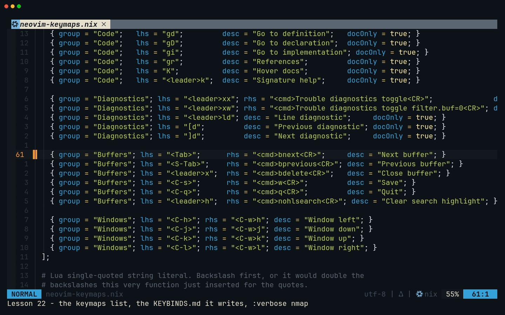
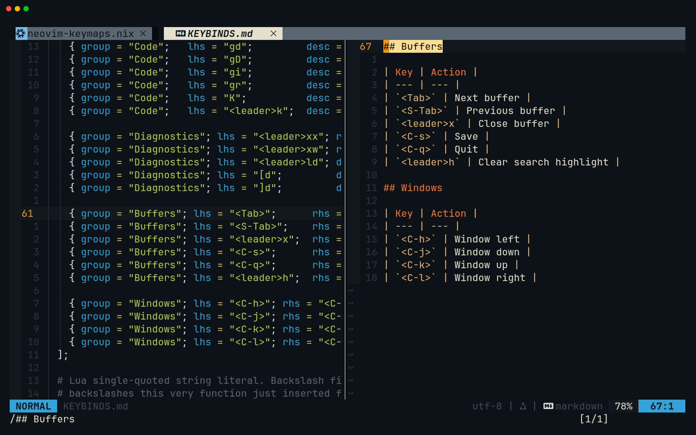
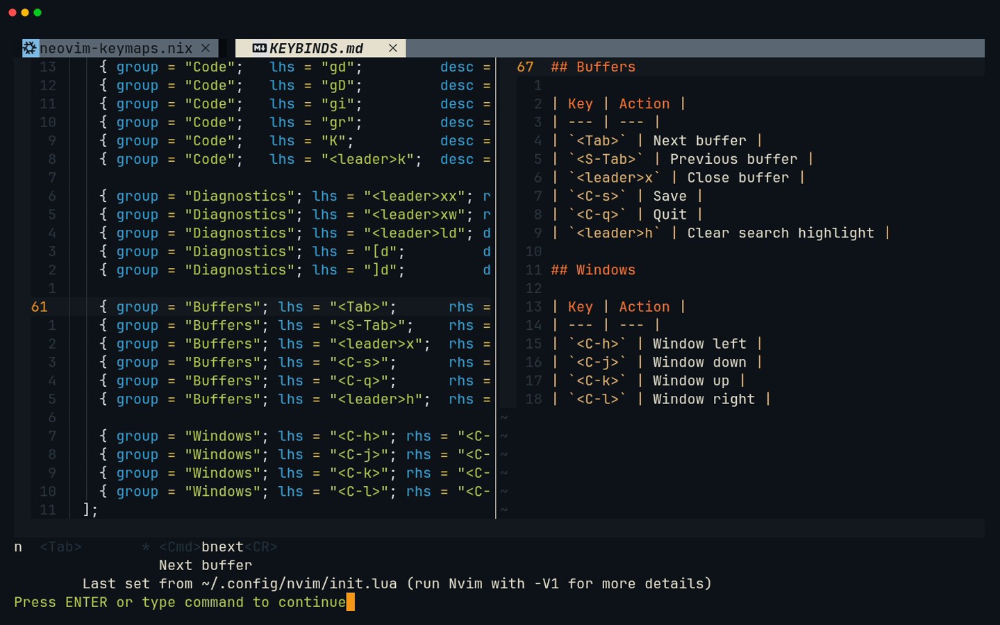
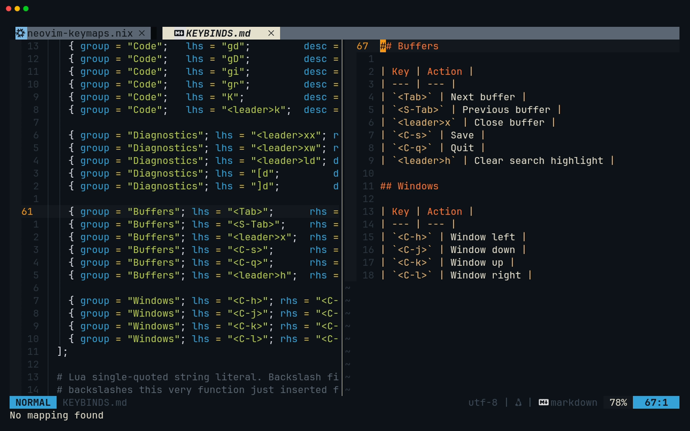
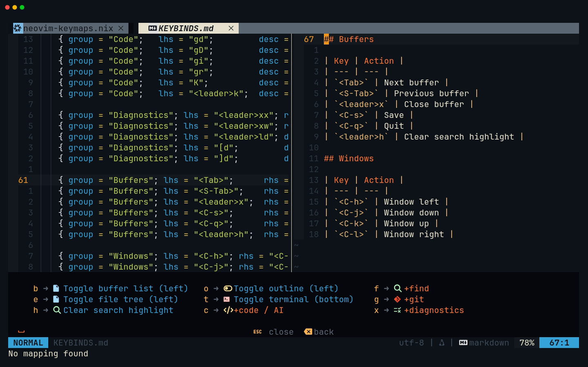

# Lesson 22 — Making the config yours

**Last Updated**: 27/09/2026
**Version**: 2.0.0
**Maintained By**: Development Team
**Language**: British English (en_GB)
**Timezone**: Europe/London

---

Twenty-one lessons taught the config as it is, traps included. From here on you change it. This lesson
teaches the one safe way to do that, the loop every later lesson follows: start a branch, find the entry
in `home/modules/neovim.nix`, save it without letting the formatter rewrite the file, check the syntax,
`just rebuild`, restart Neovim, check the result three ways (`:verbose nmap`, which-key and `KEYBINDS.md`),
and commit. You also learn how to go back when a change is wrong, how to choose a key that does not
collide with anything, and which recordings to make before you change anything. Lessons 23 to 27 then fix
five traps you met in the course, one per lesson, and lesson 28 adds keys and tools the course left out.

**Part**: 8 — Making the config yours · **Time**: ~75 min · **Previous**: [Lesson 21 — session-browser: testing and shipping](21-SESSION-BROWSER-TESTING-AND-SHIPPING.md) · **Next**: [Lesson 23 — Fix: jump forward again](23-FIX-JUMP-FORWARD.md)

## Objectives

By the end of this lesson you can:

- change, add or move a binding in the `keymaps` list and carry it through `just rebuild` to a
  running Neovim;
- read what one list entry turns into: the Lua `vim.keymap.set` call and the `KEYBINDS.md` row;
- ask Neovim what a key really does with `:verbose nmap`, `:nmap`, `:WhichKey` and
  `:checkhealth which-key`, and understand why "No mapping found" does not always mean "does nothing";
- save a Nix file without the language server reformatting all of it;
- go back from a change: before you commit, after you commit, and when the new system will not start
  properly;
- check a new key against Neovim's defaults, the config's prefixes, plugin windows and terminal
  programs before you take it;
- say which course recordings to make before you apply lessons 23 to 28.

## Before you start

- **Machine:** NixOS `laptop-intel` on the **full** configuration. `just` and the Rust tools such as
  `dev-layout` are only installed there (`modules/core/common.nix:88`, `:95-96`).
- **A clean tree.** Every change in Part 8 ends in its own commit, so a change you regret is one
  command away:

  ```bash
  # in ~/Repos/personal/nix-config
  git status          # expect: nothing to commit, working tree clean
  ```

- **Open the nix-config layout:** `SUPER + SHIFT + RETURN`. Workspace 2 gets Neovim on the left
  (75 % of the screen), `~/.config/nvim/KEYBINDS.md` in `less` at the top right, and a free shell at
  the bottom right. You run `just rebuild` in that shell.
- **Your sudo password.** `just rebuild` runs `sudo nixos-rebuild switch --flake .` (justfile:135-145).
- **Time.** A rebuild takes minutes. Step 7 has an optional rehearsal that costs two of them.

## Keys in this lesson

| Keys | Mode | Action | Where it comes from |
|---|---|---|---|
| `<leader>ff` (Space f f) | n | Find a file, e.g. `neovim.nix` | config (neovim.nix:29) |
| `<leader>h` | n | Clear the search highlight | config (neovim.nix:66) |
| `<leader>gg` | n | Open Neogit, to commit | config (neovim.nix:35) |
| `<Tab>` | n | Next buffer (and, today, `<C-i>` too) | config (neovim.nix:61) |
| `<C-o>` / `<C-i>` | n | Older / newer position in the jumplist | Neovim default |
| `:verbose nmap {lhs}` | command | Show a Normal-mode map, its description and where it was set | Neovim default |
| `:nmap {prefix}` | command | List every Normal-mode map that starts with `{prefix}` | Neovim default |
| `:noautocmd w` | command | Save without running autocommands, so no format-on-save | Neovim default |
| `:lua vim.keymap.set(…)` | command | Try a map in this Neovim only, until it exits | Neovim default |
| `:WhichKey n <leader>` | command | Open the which-key popup for a prefix | which-key default |
| `:checkhealth which-key` | command | Report keys that are both a mapping and a prefix | which-key default |

## Walkthrough



[MP4](../media/22-making-the-config-yours/22-making-the-config-yours.mp4)

### 1. The loop at a glance

Every change in Part 8 goes round the same loop:

```text
 1 branch ──► 2 edit neovim.nix ──► 3 :noautocmd w ──► 4 check syntax ──► 5 just rebuild
                                                                               │
                                                                               ▼
 8 commit (or go back)  ◄──  7 verify: :verbose nmap, which-key, KEYBINDS.md  ◄──  6 restart Neovim
```

The Nix file is the only thing you edit. Everything Neovim reads (`~/.config/nvim/init.lua`,
`~/.config/nvim/KEYBINDS.md`) is generated from it by Home Manager during the rebuild, and a running
Neovim keeps the old maps until you restart it.

> **Zed habit:** in Zed you edit `keymap.json` and the key works a second later. Here you edit Nix,
> the files Neovim reads are rebuilt from it, and nothing changes until you rebuild and restart. It
> costs a few minutes per change. In return you can never lose track of where a binding came from.

### 2. Start a branch

`just rebuild` builds whatever is checked out, committed or not. The running system therefore follows
the last tree you rebuilt, not the branch you happen to be on. A branch per change keeps that manageable:
the change, its commit and its reversal all live in one place.

**Try it.** In the layout's bottom-right shell:

```bash
# in ~/Repos/personal/nix-config
git switch -c config/rehearsal
```

Name each branch after its change (`config/jump-forward` for lesson 23, and so on). When a change is
verified and committed, fold it into the branch you normally rebuild from, here `main`:

```bash
# in ~/Repos/personal/nix-config
git switch main && git merge --ff-only config/jump-forward
```

The tree is the same after the merge, so no rebuild is needed. If you abandon a branch instead,
`git switch main` is not enough: the system still runs the branch's change until you `just rebuild`
from `main`. Keep everything local; nothing in Part 8 needs a push.

### 3. Find the source of truth

The global bindings live in one list, `keymaps`, at neovim.nix:23-72. The one exception, `<leader>cf`,
comes up below. The comment above the list (neovim.nix:10-22) states the rule: add a binding here and
both the Lua and the on-screen reference update together.

Each entry has these fields:

| Field | Meaning |
|---|---|
| `group` | The heading it appears under in `KEYBINDS.md` (Panels, Find, Git, AI, Code, Diagnostics, Buffers, Windows) |
| `lhs` | The keys you press, in Neovim notation |
| `rhs` | What they run: a string, usually `<cmd>…<CR>` |
| `desc` | The description which-key, `:map` and `KEYBINDS.md` show |
| `mode` | Optional. `"n"` when left out (neovim.nix:82); only `<leader>cs` sets it today, to `"v"` |
| `docOnly` | Optional. `true` means "documented here, defined elsewhere": no Lua is generated |

**Try it.** In the layout's Neovim, press Space f f (`<leader>ff`), type `neovim.nix`, move to
`home/modules/neovim.nix` if it is not already selected (`<C-n>`), and press `<CR>`. Then type `:61`
and `<CR>`, then `zz` to centre the line.

**What you should see:** the Buffers group, with the cursor on line 61:

```nix
    { group = "Buffers"; lhs = "<Tab>";      rhs = "<cmd>bnext<CR>";     desc = "Next buffer"; }
```


What that entry becomes: `renderKeymap` (neovim.nix:80-85) turns every entry that is not `docOnly`
into one line of Lua, and all those lines are pasted into `initLua` at neovim.nix:871. For line 61
the generated Lua is exactly:

```lua
vim.keymap.set('n', '<Tab>', '<cmd>bnext<CR>', { desc = 'Next buffer', noremap = true, silent = true })
```

Each field passes through `luaStr` (neovim.nix:76), which wraps it in single quotes and escapes any
backslash and single quote inside it. You never write Lua quoting yourself, but you do need Nix
quoting: a double quote inside `rhs = "…"` is written `\"`, and a literal `${` is written `\${`.

The twelve `docOnly` entries (all nine Code rows plus `<leader>ld`, `[d`, `]d`) generate nothing. The
real maps are written by hand where a string cannot express them. The LSP maps are buffer-local and
set in the `LspAttach` callback (neovim.nix:335-360). `<leader>cf` needs a Lua function
(neovim.nix:987-989). The `docOnly` entries exist so the reference still lists those keys.

### 4. Read what it generates

The same list renders `KEYBINDS.md` (neovim.nix:89-105), which Home Manager writes to
`~/.config/nvim/KEYBINDS.md` (neovim.nix:1002). It is the file in the top-right `less` pane of the dev
layout.

**Try it.** `:vsplit ~/.config/nvim/KEYBINDS.md` and `<CR>`. The new window opens on the right,
because `splitright` is on. Search for the Buffers section with `/## Buffers` and `<CR>`, press `zt`,
then Space h (`<leader>h`) to clear the highlight.

**What you should see:** one table per group, in the order the groups first appear in the list:

```markdown
## Buffers

| Key | Action |
| --- | --- |
| `<Tab>` | Next buffer |
| `<S-Tab>` | Previous buffer |
| `<leader>x` | Close buffer |
| `<C-s>` | Save |
| `<C-q>` | Quit |
| `<leader>h` | Clear search highlight |
```



Two columns only: the file shows **neither the mode nor `docOnly`**. `<leader>cs` is visual-only but
reads like its neighbours. When you add a map for another mode, say so in `desc`, as lesson 28 does
for its Terminal-mode keys.

> **Gotcha:** the header says "do not edit by hand", and it means it. Both generated files are links
> into the read-only `/nix/store`, and the next rebuild replaces them anyway.

### 5. Ask Neovim what a key really does

`KEYBINDS.md` tells you what the config *meant*. `:verbose nmap` tells you what Neovim *has*.

**Try it.** `:verbose nmap <Tab>` and `<CR>`.

**What you should see:**

```text
n  <Tab>       * <Cmd>bnext<CR>
                 Next buffer
	Last set from ~/.config/nvim/init.lua (run Nvim with -V1 for more details)
```

Read it left to right: `n` is the mode, `*` means non-recursive (the `noremap`), then the rhs. The
second line is the `desc`. The last line says where the map was set: the generated `init.lua`, even
though that file is a link into `/nix/store`. Started as `nvim -V1`, Neovim adds the line number, but
that is a line of the generated file, not of `neovim.nix`. You already know the real source: every
generated map comes from the `${keymapLua}` line at neovim.nix:871 (and `<leader>cf` from :987). The
listing is taller than the command line, so Neovim waits at a "Press ENTER" prompt. Press `<CR>` to
continue.



Now `:verbose nmap <C-i>` and `<CR>`.

**What you should see:** `No mapping found`.



Yet in Kitty, pressing `<C-i>` runs `:bnext` (the trap from [lesson 02](02-MOTIONS.md)). Neovim's rule
(`:help CTRL-I`): in a terminal that can tell the two keys apart, `<C-i>` can be mapped separately
from `<Tab>`, "on the condition that both keys are mapped, otherwise the mapping applies to both".
Only `<Tab>` is mapped, so the map covers both keys, but `:nmap` only lists what was mapped by name.
`:verbose nmap` tells you what is mapped. To learn everything a key does, press it too.
[Lesson 23](23-FIX-JUMP-FORWARD.md) fixes this one.

More ways to look:

| Command | What it shows |
|---|---|
| `:nmap <leader>` | Every Normal-mode map that starts with Space, global and buffer-local |
| `:verbose nmap <leader>x` | Three maps: `<Space>x`, `<Space>xx` and `<Space>xw`. That is the prefix overlap from [lesson 05](05-YOUR-KEYBINDINGS.md) |
| `:WhichKey n <leader>` | The which-key popup for Space, without the 200 ms wait |
| `:checkhealth which-key` | "Overlapping keymaps", keys that are both a mapping and a prefix. Today: `<Space>x`, and Comment.nvim's `gc` and `gb`. Information only |

> **Tip:** buffer-local maps only show in buffers that have them. Run the same `:nmap` in a Rust or
> Python buffer with a language server attached and the LSP maps (neovim.nix:340-358) appear, marked
> with `@`. A line whose description is `which-key-trigger` is which-key's own listener for a prefix,
> not one of your maps.

**Try it.** Press Space and wait. The which-key popup is the third view: the same `desc` strings, one
level at a time. `<Esc>` closes it.



Note `x` shown as `+diagnostics`: the group label hides that `<leader>x` on its own closes the buffer,
which is [lesson 26](26-FIX-CLOSE-BUFFER-KEY.md)'s trap.

### 6. Sketch a change live before making it permanent

You can try a map in the running Neovim without touching Nix:

```vim
:lua vim.keymap.set('n', '<leader>w', '<cmd>w<CR>', { desc = 'Save' })
```

Press the key and see whether you like it. The map disappears when Neovim exits and never reaches
`KEYBINDS.md`. That is why the config forbids hand-written maps as a permanent fix
(neovim.nix:861-865: one added by hand "would work but would be missing from the on-screen
reference"). Use this step to sketch, then make the change properly in step 7.

### 7. Make it permanent: edit, save, check, rebuild, restart, verify, commit

The full loop, which every lesson in Part 8 repeats:

1. **Edit** the entry in `home/modules/neovim.nix`.
2. **Save with `:noautocmd w`**, not `<C-s>` or `:w`. Saving runs conform's format-on-save. Nix is not
   in `formatters_by_ft`, so conform falls back to the language server (neovim.nix:974-977), and the
   pinned `nil` formats with nixfmt. That reflows the whole file: the aligned one-line entries of the
   `keymaps` list become one attribute per line, and `neovim.nix` grows from 1003 lines to 1217 (checked
   on the real config). `:noautocmd w` writes the file without running autocommands. If you saved the
   normal way by mistake, press `u` once (it undoes the formatting and keeps your edit), then
   `:noautocmd w`. `git diff --stat` tells you which happened: your few lines, or hundreds.
3. **Check the syntax.** A missing `;` or `}` should not cost you a rebuild:

   ```bash
   # in ~/Repos/personal/nix-config
   nix-instantiate --parse home/modules/neovim.nix > /dev/null && echo OK
   ```

   `OK` means it parses. A syntax error prints the file, line and column, and points at the spot:

   ```text
   error: syntax error, unexpected '}', expecting ';'
          at /home/…/nix-config/home/modules/neovim.nix:65:88:
   ```

4. **Rebuild** in the layout's bottom-right shell:

   ```bash
   # in ~/Repos/personal/nix-config
   just rebuild
   ```

   Give your sudo password. Home Manager runs as part of `nixos-rebuild`, so this one command
   regenerates `init.lua` and `KEYBINDS.md`. An edit to a file git already tracks is picked up as it
   is. A **new** file must be `git add`ed first, because a flake only sees files git knows about.

5. **Restart Neovim.** In the editor, `:qa` (if a terminal job stops it, `:qa!`). The dev layout's
   `SUPER + SHIFT + RETURN` only focuses workspace 2 while any window is still there, so close the
   other two windows as well, the `less` pane and the shell (`SUPER + Q` on each), and press
   `SUPER + SHIFT + RETURN` again. You get a fresh Neovim with the new maps, and a fresh `less` pane
   with the new `KEYBINDS.md`.

6. **Verify** three ways, and then press the key:
   - `:verbose nmap {lhs}`: the new rhs and `desc`;
   - Space, then pause: which-key lists the new `desc` in its popup;
   - the `KEYBINDS.md` pane: the new row.

7. **Commit** with Neogit, as in [lesson 12](12-GIT.md): Space g g (`<leader>gg`), `s` on the file,
   `c` `c`, write the message, `<c-c><c-c>`. Use the repo's style, for example
   `fix(nvim): map <C-i> explicitly so <Tab> no longer eats jumplist-forward`.

**Try it (optional rehearsal, two rebuilds).** Go round the loop once with a change that cannot hurt,
then undo it with step 8. On the `config/rehearsal` branch from step 2, give `<leader>h` a longer
description:

```diff
--- a/home/modules/neovim.nix
+++ b/home/modules/neovim.nix
@@ -63,7 +63,7 @@
     { group = "Buffers"; lhs = "<leader>x";  rhs = "<cmd>bdelete<CR>";   desc = "Close buffer"; }
     { group = "Buffers"; lhs = "<C-s>";      rhs = "<cmd>w<CR>";         desc = "Save"; }
     { group = "Buffers"; lhs = "<C-q>";      rhs = "<cmd>q<CR>";         desc = "Quit"; }
-    { group = "Buffers"; lhs = "<leader>h";  rhs = "<cmd>nohlsearch<CR>"; desc = "Clear search highlight"; }
+    { group = "Buffers"; lhs = "<leader>h";  rhs = "<cmd>nohlsearch<CR>"; desc = "Clear search highlight (nohlsearch)"; }
 
     { group = "Windows"; lhs = "<C-h>"; rhs = "<C-w>h"; desc = "Window left"; }
     { group = "Windows"; lhs = "<C-j>"; rhs = "<C-w>j"; desc = "Window down"; }
```

Keys for the edit: `:66` `<CR>`, `$` (the closing `}`), `F"` (back to the quote that closes the
description), `i`, type ` (nohlsearch)` with its leading space, `<Esc>`. Save with `:noautocmd w`,
check, rebuild and restart. **What you should see** for `:verbose nmap <leader>h`:

```text
n  <Space>h    * <Cmd>nohlsearch<CR>
                 Clear search highlight (nohlsearch)
	Last set from ~/.config/nvim/init.lua (run Nvim with -V1 for more details)
```

The which-key popup lists `h` as "Clear search highlight (nohlsearch)", and the Buffers table in the
`less` pane ends with `` | `<leader>h` | Clear search highlight (nohlsearch) | ``. Do not commit it:
step 8's first case takes it back out.

### 8. Going back

How you undo a change depends on how far it got.

- **Not committed yet** (the rehearsal): throw the edit away and rebuild.

  ```bash
  # in ~/Repos/personal/nix-config
  git restore home/modules/neovim.nix && just rebuild
  ```

  Restart Neovim; `<leader>h` reads "Clear search highlight" again. Then `git switch main` and
  `git branch -d config/rehearsal`.

- **Committed:** `git revert` makes a new commit that undoes the old one, so the history keeps both and
  says why. Find the commit, revert it, rebuild:

  ```bash
  # in ~/Repos/personal/nix-config
  git log --oneline -5 -- home/modules/neovim.nix
  git revert <hash>
  just rebuild
  ```

  `git revert` opens the commit message in your `core.editor`, which is Zed here
  (`zeditor --wait`, home/modules/git.nix:21): save and close the tab to accept it, or add
  `--no-edit` to keep git's message as it is.

- **The new system misbehaves badly** (no working terminal or editor): switch back to the previous
  generation.

  ```bash
  # in any terminal that still works
  sudo nixos-rebuild switch --rollback
  ```

  If even that is out of reach, reboot. The systemd-boot menu waits 5 seconds and lists the five newest
  generations (`configurationLimit = 5`, modules/core/base-configuration.nix:38); pick the one below the
  newest. `just show-generation` lists them all once you are back.

> **Gotcha:** a rollback or an older boot entry changes only the running system. Your checkout still
> holds the change, and the next `just rebuild` brings it straight back. Fix git as well (`git restore`
> or `git revert`) before you rebuild again.

### 9. Choosing a key that fits

Before you take a key, run through this checklist. Lessons 26 and 28 use it to pick theirs.

1. **Is it free?** `:verbose nmap {lhs}` says `No mapping found`. Check in a plain buffer *and* in one
   with a language server attached, since LSP maps are buffer-local. Then press it, because of the
   `<Tab>`/`<C-i>` rule in step 5.
2. **Does it start another map, or does another map start it?** `:nmap {lhs}` lists every map that
   begins with it. A key that is both an action and a prefix waits `timeoutlen` (300 ms,
   neovim.nix:270) and fires the wrong thing if you pause. The config's own rule is at
   neovim.nix:983-986, and `<leader>x` breaks it.
3. **Is it taken inside a plugin window?** Buffer-local maps win ([lesson 05](05-YOUR-KEYBINDINGS.md)).
   neo-tree, aerial, Telescope, Neogit, Diffview and Trouble all bring their own. Diffview is the
   greediest: in its tab `<leader>e`, `<leader>b`, `<Tab>`, `<S-Tab>` and `<leader>co`/`cb`/`ca` do
   Diffview things.
4. **Is it for Terminal mode?** Then every program in the terminal (zsh, Claude, Codex) loses that
   key. Lesson 28 shows how to pick one that none of them uses.
5. **Does the system take it first?** `SUPER` combinations belong to Hyprland. Kitty's own shortcuts
   use `ctrl+shift` (the config adds only font-size keys, home/stages/desktop.nix:82-90), so plain
   `Ctrl`, `Alt` and ordinary keys reach Neovim.

### 10. Record the earlier tapes first

A tape records the config you have installed. Most tapes never touch what lessons 23 to 28 change, but a
few show exactly the behaviour a fix removes: a `:verbose` listing, a which-key popup held open with a
bare `Space`, or Claude started with Space c c. Search for those three:

```bash
# in ~/Repos/personal/nix-config/docs/NEOVIM-COURSE
grep -l 'verbose\|^Space$\|^Type " cc"' tapes/*.tape
```

Leave aside the Part 8 tapes (23 to 28), which record the fixes themselves, and four remain:

| Tape | Shows | Changed by |
|---|---|---|
| 00 | The Space popup (`which-key.png`) | Lessons 24 (the `t` description) and 26 (`q` appears) |
| 05 | The Space popup and its groups, and `:verbose nmap <leader>x` (`verbose-x.png`) | Lessons 24 and 26; lesson 28 (the `+git` group, `leader-g.png`, gains four keys) |
| 13 | The mode Claude starts in, on its first screenshot | Lesson 27 (Claude starts in Manual mode) |
| 22 | `:verbose nmap <C-i>` (`verbose-c-i.png`) and the Space popup (`which-key.png`) | Lessons 23, 24 and 26 |

One more tape shifts without breaking. Tape 09 greps a copy of the repository's own justfile, and
lesson 28 (section 4) adds eight lines above its Fuzzing banner, so the line numbers in tape 09's frames
would no longer match the ones [lesson 09](09-PROJECT-PANE.md) quotes. The grep cannot find that one:
the tape reads the justfile, not a key.

So record tapes 00, 05, 09, 13 and 22 **before** you apply lessons 23 to 28. Tapes 23 to 28 are the other
way round: each records its own fix working, so it needs that lesson applied and rebuilt, and its header
says so. [Appendix B](../appendices/B-RECORDING-WITH-VHS.md#record-in-this-order) has the full rule and
what to do if you applied a fix too early. Before any recording, `vhs --version` must print 0.12.1
([Appendix B](../appendices/B-RECORDING-WITH-VHS.md#first-make-sure-vhs-is-0121)).

### 11. The road map: lessons 23 to 28

Each fix lesson has the same shape: see the problem, why it happens, decide, make the change (an exact
diff), check and rebuild, verify, what else changes, commit. Every one is independent. Skip any you
disagree with; the reasoning matters more than the edit.

| Lesson | What changes | The trap it removes | Where you met it |
|---|---|---|---|
| [23 — Fix: jump forward again](23-FIX-JUMP-FORWARD.md) | An explicit `<C-i>` map | `<Tab>` also takes `<C-i>`, so jumplist-forward is gone | [02](02-MOTIONS.md) |
| [24 — Fix: a counted terminal toggle](24-FIX-COUNTED-TERMINAL-TOGGLE.md) | `<leader>t` passes a count | `2<leader>t` ignores the 2 | [06](06-TERMINAL.md) |
| [25 — Fix: pyright's diagnostic mode](25-FIX-PYRIGHT-DIAGNOSTIC-MODE.md) | `diagnosticsMode` becomes `diagnosticMode` | The misspelt key is silently ignored | [10](10-LSP.md) |
| [26 — Fix: a close-buffer key that does not wait](26-FIX-CLOSE-BUFFER-KEY.md) | Buffer close moves to `<leader>q` | `<leader>x` is both an action and a prefix | [05](05-YOUR-KEYBINDINGS.md), [08](08-FILE-PANE.md) |
| [27 — Fix: review Claude's edits in Neovim](27-FIX-CLAUDE-DIFF-REVIEW.md) | `permissions.defaultMode` in `claude.nix` | Auto mode applies edits with no diff to review | [13](13-CLAUDE-CODE-AND-CODEX.md) |
| [28 — Going further](28-GOING-FURTHER.md) | gitsigns hunk keys, Terminal-mode window keys, tape recipes, an honest `NEOVIM-SETUP.md` | Nothing broken: keys and tools the course left out, and the VHS override explained | [12](12-GIT.md), [13](13-CLAUDE-CODE-AND-CODEX.md) |

> **Tip:** once you change a key, the earlier lessons, the cheat sheet and the recordings still show the
> old one. `KEYBINDS.md` does not: it is generated, so it is always right. When the course and your
> pane disagree, trust the pane.

## Gotchas in this config

- **Saving a Nix file reformats all of it.** conform falls back to `nil`, which runs nixfmt over the
  whole file. Save `neovim.nix`, `claude.nix` and `dev.nix` with `:noautocmd w`.
- **Hand-written maps drift.** A `vim.keymap.set` added straight into `initLua` works, but it is missing
  from `KEYBINDS.md` and from `:map` descriptions unless you remember a `desc`. The config says so at
  neovim.nix:861-865. Only real Lua functions justify it, and then you add a `docOnly` row as well.
- **Generated files are read-only.** `~/.config/nvim/init.lua`, `~/.config/nvim/KEYBINDS.md` and
  `~/.claude/settings.json` are links into `/nix/store`. Edit `neovim.nix` or `claude.nix` and rebuild.
- **A running Neovim keeps its old maps.** `just rebuild` changes the files, not the processes.
  Restart Neovim, and reopen the dev layout to refresh its `less` pane.
- **The system follows the last rebuild, not the checkout.** Switching branches, or rolling back a
  generation, does not change the other. Rebuild after `git switch`; fix git after a rollback.
- **`KEYBINDS.md` shows neither mode nor `docOnly`.** Put the mode in `desc`, for example
  "(terminal mode)".
- **Nix quoting, not Lua quoting.** In a `rhs = "…"` string, write `\"` for a double quote and `\${`
  for a literal `${`, because Nix would otherwise interpolate. `luaStr` handles single quotes and
  backslashes for you.
- **LSP maps live in two places.** A change to `gd`, `gr`, `<leader>ca` and the rest means editing the
  `LspAttach` callback (neovim.nix:335-360) *and* its `docOnly` row.
- **Prefixes wait.** Before you take a key, run `:nmap {lhs}`. A key that is both an action and a prefix
  waits 300 ms (neovim.nix:270) and fires the action if you pause. That is `<leader>x` today.
- **Plugin windows win.** Your new global key may do something else inside neo-tree, aerial,
  Telescope, Neogit, Diffview or Trouble, because their buffer-local maps take precedence.
- **New files need `git add`.** Edits to tracked files are picked up by `just rebuild` as they are.
  A new module, fixture or `.snap` file is invisible to the flake until git knows about it.

## Drills

1. Write the list entry for a Normal-mode map `<leader>w` that saves the file, under Buffers.
   <details><summary>Answer</summary>

   ```nix
   { group = "Buffers"; lhs = "<leader>w"; rhs = "<cmd>w<CR>"; desc = "Save"; }
   ```

   No `mode` is needed, since `"n"` is the default. Check with `:nmap <leader>w` first: it should say
   `No mapping found`.
   </details>

2. You want the rhs `<Cmd>echo "hello"<CR>`. What do you type between the Nix quotes, and what Lua
   does the config generate?
   <details><summary>Answer</summary>

   Nix: `rhs = "<Cmd>echo \"hello\"<CR>";`. Lua: `'<Cmd>echo "hello"<CR>'`. `luaStr` wraps the value in
   single quotes and only escapes backslashes and single quotes, so the double quotes pass through
   untouched.
   </details>

3. You edited `neovim.nix`, pressed `<C-s>`, and `git diff --stat` reports hundreds of changed lines.
   What happened, and how do you recover?
   <details><summary>Answer</summary>

   Format-on-save fell back to the Nix language server, which reformatted the whole file with nixfmt.
   Press `u` once: it undoes the formatting and keeps your edit. Then save with `:noautocmd w`, and
   `git diff --stat` shows your one change again.
   </details>

4. `:verbose nmap <leader>x` prints three maps today. Which, and what does that tell you?
   <details><summary>Answer</summary>

   `<Space>x` (Close buffer), `<Space>xx` and `<Space>xw` (Trouble). `<leader>x` is an action and a
   prefix at once, so Neovim waits `timeoutlen` after it and closes the buffer if you pause.
   </details>

5. You changed a key and ran `just rebuild`, but the new key does nothing in the Neovim you had open.
   Why, and what else is out of date?
   <details><summary>Answer</summary>

   A running Neovim does not reload `init.lua`: restart it. The dev layout's `less` pane still shows the
   old `KEYBINDS.md`, so close the layout's windows and open it again with `SUPER + SHIFT + RETURN`.
   </details>

6. Which of these would recreate the `<leader>x` trap: `<leader>gp`, `<leader>bd`, `<leader>hs`, `]h`?
   <details><summary>Answer</summary>

   `<leader>bd` (`<leader>b` toggles the buffers panel) and `<leader>hs` (`<leader>h` clears the search
   highlight). `<leader>g` is a pure group and `]h` extends no existing map.
   </details>

7. `:verbose nmap <C-i>` says `No mapping found`, yet `<C-i>` switches buffers in Kitty. Explain.
   <details><summary>Answer</summary>

   Only `<Tab>` is mapped. By Neovim's rule, a map on `<Tab>` also applies to `<C-i>` unless both are
   mapped. `:nmap` lists maps by the name they were created with, so it finds nothing under `<C-i>`.
   </details>

8. You committed a change last week and want it gone. After booting the previous generation, the next
   `just rebuild` put the change back. Why, and what is the right way?
   <details><summary>Answer</summary>

   A rollback or older boot entry changes only the running system; the checkout still holds the change,
   and `just rebuild` builds the checkout. `git revert <hash>` the commit, then `just rebuild`.
   </details>

## Recap

- One list, `keymaps` at neovim.nix:23-72, renders both the Lua maps (via `renderKeymap` and `luaStr`,
  pasted in at :871) and `~/.config/nvim/KEYBINDS.md` (:89-105, written at :1002).
- The loop: branch, edit, save with `:noautocmd w`, `nix-instantiate --parse`, `just rebuild`, restart
  Neovim (and the dev layout), verify with `:verbose nmap`, which-key and `KEYBINDS.md`, then commit.
- Going back: `git restore` and rebuild before a commit, `git revert` and rebuild after one, and
  `nixos-rebuild switch --rollback` or an older boot entry when the system itself is in the way.
- `:verbose nmap` shows what is mapped. Press the key as well, because `<Tab>` also answers for `<C-i>`
  without being listed under it.
- Before you take a key: is it free, is it a prefix, is it shadowed in a plugin window, is it stolen
  from a terminal program, and does the system take it first?
- Record tapes 00, 05, 09, 13 and 22 before lessons 23 to 28; record tapes 23 to 28 after their own
  lesson.

## Recording

- **Tape:** `tapes/22-making-the-config-yours.tape`. Run it from `docs/NEOVIM-COURSE` with
  `vhs tapes/22-making-the-config-yours.tape`, **before** you apply lessons 23, 24 and 26 (they change
  what it shows; step 10).
- **VHS version:** `vhs --version` must print 0.12.1, which the config builds; 0.12.0 exits 0 and writes
  nothing ([Appendix B](../appendices/B-RECORDING-WITH-VHS.md#first-make-sure-vhs-is-0121)).
- **Repository:** not read or written, and no tag is needed. The tape points `CLAUDE_CONFIG_DIR` at a
  throwaway folder, opens no terminal and shows no register, so nothing private can appear.
- **Fixture:** `fixtures/22-making-the-config-yours/`. `neovim-keymaps.nix` holds lines 10-105 of
  `home/modules/neovim.nix`, copied verbatim with the line numbers kept. `KEYBINDS.md` is exactly
  what those lines render to. The tape copies both to `/tmp/nvim-course/22-making-the-config-yours`,
  and never saves, so format-on-save never runs.
- **Outputs:**
  - `media/22-making-the-config-yours/22-making-the-config-yours.gif` and `.mp4`: the whole run.
  - `attrset.png`: the keymaps list with the cursor on the `<Tab>` entry, line 61.
  - `keybinds-split.png`: the list on the left, the generated `KEYBINDS.md` on the right at its Buffers
    table.
  - `verbose-tab.png`: `:verbose nmap <Tab>` at its hit-enter prompt.
  - `verbose-c-i.png`: `:verbose nmap <C-i>` answering `No mapping found`.
  - `which-key.png`: the Space popup, with `x` shown as `+diagnostics`.
- **Manual steps:** none. The rebuild, the restart and the rehearsal cannot be recorded (sudo), so the
  lesson describes them in text.
- **Check after rendering:**
  1. `ls -l media/22-making-the-config-yours/` lists the GIF, the MP4 and all five PNGs, none of them
     empty.
  2. In `keybinds-split.png`, `KEYBINDS.md` is on the right (`splitright`) and its Buffers table is at
     the top.
  3. `verbose-tab.png` shows the "Last set from" line and the "Press ENTER" prompt.
  4. The rest of [Appendix B's checklist](../appendices/B-RECORDING-WITH-VHS.md#checklist-for-every-recording).
